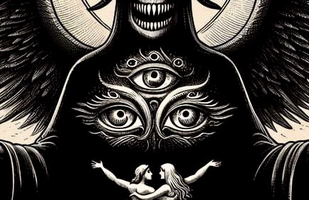

{fig-align="center"}

*«Non abbiamo deciso su chi sparare: è venuto da sé, insensato e inevitabile così come lo è la folla.»*

È stata tutta un’idea di Azrael, l’angelo della morte. Gerry lo sapeva da un pezzo, esitava per quanto fosse evidente; io da parte mia non avrei neanche immaginato tutto questo, prima che i dettagli trovassero il loro giusto posto. E so che proprio io sono stata inviata per portare le cose a compimento, e ho voluto io che afferrassimo questo destino nelle nostre mani. Scrivo dalla cella 238 di Regina Coeli, non so neanche se qualcuno leggerà, se queste parole usciranno mai da queste mura. Così vanno le cose, certe cose almeno. Quando siamo arrivati a Termini, Gerry e io, avevamo questi ST Kinetics BR18, i fucili automatici più corti e leggeri disponibili, addirittura ambidestri, perfetti come arma di servizio universale. Non è poi così difficile entrarne in possesso, e tranquilli che possono venir usati anche per scopi meno nobili.

L’amore mio mi ha detto fai fuoco su chiunque, nessuno è più innocente. Era tutto l’anno che studiavamo, leggendo ogni notte l’Apocalisse di Giovanni, quelle gnostiche di Adamo, Pietro, Giacomo, Paolo, quelle ebraiche di Elia, di Enoch e di Baruch, nonché i riferimenti disseminanti nelle Sure del Corano: XVIII - La Caverna, XXXIX - Le Schiere, LXXXI - L'Oscuramento, e così via. Siamo rimasti attoniti, desolati, gli occhi sbarrati, come avvolti da una tenebra indecifrabile. Ci ha fornito la chiave tale Guido Ceronetti, letto per caso non mi ricordo dove: *«Il mondo è un'apocalisse quotidiana»*: serve altro? Certo, sarebbe stato opportuno farlo in un’emittente televisiva o nella sede di qualche importante quotidiano, in una di quelle inutili fiere letterarie piene di tromboni autoincensantisi, in un qualsiasi palazzo del potere o in un qualsiasi centro commerciale. Abbiamo però optato per la stazione Termini, in modo da essere assolutamente imparziali, e lasciare che scegliesse la sorte.

Oggi sulle prime pagine di tutti i quotidiani elencano le vittime, le chiamano per nome. Ne abbiamo fatti fuori centodieci. Chi erano? Gente qualsiasi, tra loro padri e madri, e indubbiamente pure qualche bambino - per quelli forse un po’ ci dispiace, ma fino a un certo punto, sempre umani sono, sempre figli di qualcuno sono. L’adrenalina impazzava e né Gerry né io abbiamo avuto la freddezza e la lucidità, e neppure la cura, di andare troppo per il sottile: tanto, in fondo, non sei mai completamente buono, e ognuno lo sa. Chi erano? Gente. Cattiva, come tutti. Gente. Immorale, ineducata, arrivista, inutile. Che ci vuoi fare, così va il mondo, almeno questo mondo che ci ritroviamo. Con l’amore mio ce lo siamo detto pure troppe volte. Più nessuno è al sicuro dall’impazzare dell’iniquità.

Una madre che aveva appena violentemente sgridato la figlia per una lieve insufficienza a scuola. Un marito che da sempre tradiva la moglie con la cara vecchia cugina. Un travestito che si riprendeva con il cellulare mentre ballava come un orso cantando con la voce da baritono. Il senatore pronto all’ennesimo abuso di una comunità ormai felice di venir stuprata. Un broker che mentre camminava faceva operazioni di borsa al cellulare. Un mendicante arrivato dalla Nigeria per vomitare nell’indifferenza degli astanti. Un’attricetta anoressica e frustrata che vantava una processione di ogni sesso immaginabile tutti vittime del suo inenarrabile fascino da eterna vorrei ma non posso. Un regista che organizzava festini a base di aspiranti attori minorenni. Uno scrittore piccolo borghese sedicente anarco-individualista capace solo di propalare la propria inessenziale voracità di sesso triste. Un editor aridissimo capace di stroncare perfino Dante. E altri. Molti altri. Ma non serve a niente elencare tale orda di stronzi.

Non abbiamo deciso su chi sparare: è venuto da sé, insensato e inevitabile così come lo è la folla. L’ironia della sorte sa essere precisa come la profezia più micidiale, ma può essere meno inascoltata. I BR18 sanno essere più precisi di tante parole, e sono sicuramente meno inflazionati. Ora c’è poco da fare gli indignati: mica è la prima volta che succede. Sappiamo che nel 583 Michele e Lucifero girarono in coppia per una Roma in preda alla peste, uno con la spada e l’altro con il forcone, falciando almeno ottanta persone. Oggi la peste è più pervasiva e sottile. E mentre i decreti del cielo restano inascoltati, angeli e demoni si limitano a giocare a scacchi, il Santo Padre ha probabilmente meglio da fare che fermare il contagio, i cronisti e i commentatori di questi tempi infetti non hanno certo l’acume di Jacopo da Varazze. Non ci sono Leggende auree da raccontare. Non ci sono occhi per vedere, nessun orecchio sa ascoltare.

E questa è la realtà. La bambina diventata ormai adulta avrebbe propagato violenza tanto a sua madre quanto alla sua stessa figlia. I sensi di colpa del marito avrebbero fatto in modo che lui eliminasse la moglie come la cugina. Il travestito rubava qualsiasi cosa a chiunque avesse il desiderio e lo stomaco adatto ad avvicinarglisi. Il senatore andava a ratificare una transazione impresentabile eppure senza scampo. Il broker decretava la fame di un continente. Il mendicante avrebbe ucciso il giorno stesso una vecchietta impaurita perché non aveva soldi da dargli. L’attricetta era a un passo dal suicidio: quello successivo, e si limitava a deambulare come un pupazzo a molla. Il regista sarebbe morto di overdose tre giorni dopo, senza preoccuparsi che le sue vittime non avrebbero mai più provato nessuna gioia. Lo scrittore non sarebbe mancato a nessuno. L’editor a furia di correggere pure il proprio nome lo aveva perduto. I bambini rimasti coinvolti, poi, erano già pronti a prendere il posto dei genitori, il che è tutto dire.

Io so soltanto che abbiamo sentito le grida di un futuro che chiedeva giustizia. Abbiamo visto la sua ferita sanguinare copiosa. Abbiamo pianto a lungo, Gerry e io: mica eravamo contenti di come andavano le cose, io e l’amore mio non siamo affatto felici di quanto è successo. Abbiamo pregato per venir scampati da questo massacro; tuttavia, abbiamo visto ogni cosa in modo nitido, preciso, essenziale. Non potevamo far finta di niente: non siamo così incoscienti. Tutti erano già segnati. L’ironia della sorte è che sarebbero morti comunque, trascinando nella rovina molte più persone di quante possiamo averne falciate noi con la nostra azione risanatrice. L’ironia della sorte è che adesso ci chiameranno criminali laddove abbiamo soltanto cercato di portare giustizia. Come ci ha suggerito Azrael, che con più di sette miliardi di occhi e lingue, quattro facce e quattromila ali, saggio e astuto come nessuno, a ciò è preposto da tempo. Non sentite anche voi la sua voce?

•

[*Pubblicato su «Suite Italiana» 17.06.2020.*](https://suiteitalianalt.blogspot.com/2022/06/lironia-della-sorte.html) *Riveduto.*
