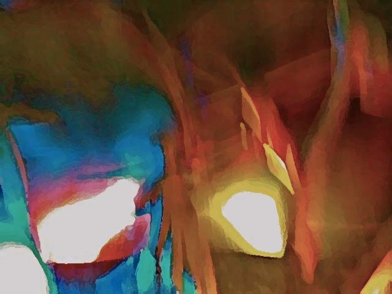

{fig-align="center"}

*Il fascino della fine e il proliferare apocalittico. Kant: la conclusione dello spettacolo. Taubes: l'irruzione del presente e lo svanire del passato. Apocalittica e messianismo. Il racconto ebraico del Messia. La ricostruzione del Tempio e la vacca rossa. Islam e giudizio universale. Nessun terrorista in paradiso. Imam nascosto e moschee di lusso. Il mosaico dell'Abbazia di San Nilo a Grottaferrata. Le riprese televisive della Seconda Venuta di Cristo. Storia del concetto di Parusia. Teocrazia dal basso.*

## 0. Preludio a una fine infinita

Viviamo in un mondo che, non conoscendo limiti e lanciato in un'inarrestabile corsa all'infinito, sollecita un'inesauribile produzione di immagini della fine. Il loro fascino non coinvolge soltanto i Maya \[1\] più o meno involontari: un repertorio piuttosto vario esercita suggestioni apocalittiche di varia tipologia e tendenza. Attacchi terroristici e guerre globali, catastrofe ecologica e disastri naturali, crisi economica e finanziaria, tecnicismo e consumismo trionfanti, svuotamento dell'umanesimo, erosione della democrazia, imporsi di manipolazioni costitutive, sono le emergenze più rilevanti, nella cui lettura arrivano a confondersi profezie *low cost*, sensibilità new-age e contenuti postmoderni \[2\]. Il filone principale sembra comunque delinearsi a partire dalla situazione di rovina generale destinato a risolversi in rinnovata pienezza, di cui offre esempio parole dei Salmi: «*Sii fedele alla tua alleanza;/ gli angoli della terra sono covi di violenza.»* (Salmi 73 \[74\]:20, II sec. a.C.)

Le questioni relative alla fine dei tempi sono trattate nell'escatologia (dal greco *éschatos*, ultimo), che riflette sul destino ultimo del mondo e dell'uomo. Nella storia delle considerazioni religiose, il tempo messianico del mutamento dell'Ebraismo si stempera nell'attesa cristiana del Regno di Dio; dopo Costantino l'apocalittica cristiana si concentra su letture allegoriche individuali, il messianismo ebraico è già assestato sulla visione storico mitica di redenzione. L'Islam precisa gli aspetti di guerra e premio. Nella teologia contemporanea Bultmann riporta l'escatologia al percorso di conversione di ogni persona.

Il rapporto della soggettività con il tempo e con l'*«appuntamento»* dell'*«abisso»* della sua fine fu individuato da Kant in quella strana esigenza che insiste nel trovare agli eventi un esito e una rivelazione, non importa se contraddittori, convinta della *«fondamentale corruzione del genere umano»* e pertanto che serva *«un termine a quella specie di spettacolo che è il mondo»* \[3\]. In tempi più recenti, questo aspetto abissale del tempo viene approfondito dal rabbino svizzero Jakob Taubes: ogni evento storico si configura come una creazione in cui *«l'io stabilisce un appuntamento tra un presente irruente e un passato che presto svanisce»*.\[4\] In tale quadro, la contingenza è radicale: ogni momento è dono e distruzione. Così, sembrerebbe appropriato, come suggerisce San Paolo, sperare che tutto accada abbastanza presto e al contempo permanere nelle necessità *«della propria condizione»* (Paolo, I Corinzi 7:17) insomma, nonostante l'emergenza, vivere senza paura e senza fretta.

L'Apocalisse oggi non sembra più un abisso di cui essere spaventati e anzi rappresenta una condizione abbastanza comune, nonché un argomento piuttosto *trendy*. Infatti, predomina un clima di millenarismo incipiente, nel quale le attese della fine si moltiplicano, e in qualche modo, come faceva il dottor Stranamore con labomba, abbiamo imparato ad amarla. In definitiva, desiderare la morte per sé, per i propri nemici o per il mondo, è ormai poco più di esercizio di stile: e, nonostante tutto, siamo ancora fermi a quanto diceva Kant. Infatti, è tuttora più facile *immaginare* tali evenienze piuttosto che farsene un concetto e quindi *pensarle* davvero. E così, l'immaginazione e la produzione di *immagini della fine* scavalcano così ogni elaborato di pensiero, guadagnandosi un posto di spicco nei vuoti del presente attraverso la vasta fenomenologia della cultura di massa.\[5\]

Narrazioni di ogni tipo celebrano la diffusa sensazione dell'esaurirsi della civiltà in un proliferare di soluzioni apparentemente modernissime eppure già affastellate dai millenni, profondamente intrise di contenuti religiosi. Infatti, l'idea che la storia abbia compimento attraverso un processo di rinnovamento e purificazione discende da un'idea di tempo che si corona nell'*apocalittica*, che significa propriamente rivelazione e comporta una teologia della storia, e nell'*apocatastasi*, che indica restaurazione e reintegrazione finali. In un mondo segnato dalla secolarizzazione, dove i contenuti religiosi sono assorbiti dalla mentalità comune, tale esigenza di compimento si è mantenuta sotterranea, per poi emergere imponendo spiegazioni totalizzanti, che nessuna mitologia razionalista riesce a contrastare.

Immagini apocalittiche più conformi ai testi si accompagnano ad altre di libera interpretazione: aosserviamo alcuni fotogrammi. Le azioni di morte dei fondamentalisti islamici. I proclami millenaristici dei telepredicatori americani. Le vacche rosse da immolare a Gerusalemme. Stilemi della storia quali nazismo, bolscevismo, paura del nucleare. Riti contemporanei come l'attentato fascista di Okhlaoma City e le morti della setta dei Davidiani. Uno scrittore avvezzo al macabro come Ian MacEwan consiglia di sconfiggere il desiderio della fine con l'esercizio di un'inesauribile curiosità, consapevoli che *«nessuno verrà a salvarci».* \[6\]

La nostra curiosità può così trovare interesse proprio dove il discorso della fine si intreccia con quelli che riguardano la *salvezza*, alla quale ogni civiltà ha dato risposte peculiari. Focalizziamo le attenzioni su tre argomenti: la figura del Messia presso la cultura ebraica, la ricezione dell'Apocalisse nel contesto islamico, le differenziazioni del concetto di *Parusìa*, trasmessosi dalla Grecia antica ai primi cristiani, ai tardi pagani e agli gnostici. Potremmo scoprire, senza abdicare alla lucidità e al rigore della nostra laicità e senza che questa comprometta fede e religiosità, quanto il contenuto dei testi che si dicono sacri possa apparire splendido e presente rispetto ai toni puerili delle letture integraliste di maggiore attualità, e quanto la comparazione e il dialogo tra religioni possa giovare alla comprensione di ognuna.

## 1. Il Messia degli Ebrei

Apocalisse e messianismo costituiscono due nozioni diverse, tra loro non pienamente assimilabili e però nemmeno perfettamente disgiungibili, da cui discendono differenti concetti di tempo, tenuti distinti da Agamben secondo questi termini: il tempo dell'apocalisse senza messianismo che si impone nel cristianesimo successivo al IV sec. rappresenta la *fine dei tempi*, il tempo messianico tipico del giudaismo successivo al 70 d.C. si configura come il *tempo della fine* \[7\]. Al riguardo, Moshe Idel ha evidenziato come in seguito alla distruzione del secondo tempio l'ebraismo tende a distanziarsi dalle coeve formulazioni cristiane agganciandosi in modi particolari a stati di redenzione presenti o futuri da ritrovare nel contatto con un'origine; nel XII sec., per influsso del linguaggio simbolico della *Qabbalah*, il messianismo si riconverte all'apocalittica e perfeziona il proprio aspetto di funzione, a cui è tipica la spersonalizzazione del messaggio della funzione messianica \[8\].

Il messianismo ha avuto costruzione varia e influsso enorme, coinvolgendo realtà profondamente diverse quali le speranze illuministe, il totalitarismo nazista, le avventure dei supereroi. Tuttavia, anche se il suo ascendente travalica la cultura presso cui è sorto, è opportuno precisare le peculiarità del messianismo riferendosi alla religiosità popolare ebraica, influenzata da rabbini e cabalisti e nella quale alle elaborazioni logiche dell'*Halachah* si affiancano le leggende dell'*Aggadah*. La figura del Messia assomma in sé caratteri sacerdotali e caratteri regali e oscilla tra idealizzazione politica e universalismo religioso, prescinde dall'unitarietà di una dottrina per definire un orizzonte mondano e storico profondamente dominato da preoccupazioni cosmologiche.

Nei Salmi attribuiti a David (in ebraico *Tehillim*) il messianismo si raccoglie nell'ascolto del presente e della voce di Dio (Salmi 95 \[94\]:8); il tempo del Messia comporta per il popolo d'Israele vittoria sui nemici, ricchezza e pace (Salmi 76 \[75\]). Isaia afferma che il Messia viene *«a suo tempo»* (Isaia 60:22, VIII-VI sec. a.C.), si configura come una *«promessa»* (Isaia 9:1-6) sulla quale *«aleggia»* Dio (Isaia 11:1-5), il cui nome simbolico è Emmanuele, *«Dio con noi»* (Isaia 7:14) .A tali caratteristiche, riscontrabili anche in Michea, Geremia ed Ezechiele (Michea 5:15, VIII-VI sec. a.C.; Geremia 23, 5s, V-IV sec. a.C; Ezechiele 34:23s.,VI sec. a.C.). Isaia aggiunge *«servo sofferente»* (Isaia 42:1-7) e Zaccaria *«re pacifico»* (Zaccaria, 9, 9s., IV sec. a.C.), il primo profetizza *«tempesta, tuoni e fuoco»* (Isaia, 29:6). il secondo la distruzione di *«tutte le genti ostili a Gerusalemme»* (Zaccaria 12:9). Daniele introduce la figura di *«figlio dell'uomo»* Daniele 7:13, II sec. a.C.). e specifica tanto gli aspetti di rivelazione ed espiazione ai quali la sua venuta prelude, quanto quelli di eternità del regno che giunge a stabilire.

Il Messia gli Ebrei è ancora da venire: è sempre da venire. Gesù è considerato perlopiù un impostore e le leggende raccontano che fosse il figlio di un soldato romano, impiccato ad un cavolo sotto l'accusa di magia \[9\]. In una generale ridefinizione dei rapporti tra cristianità ed ebraismo, per quanto la forme della sua divinizzazione continuino ad essere considerate idolatriche, c'è anche notizia di una revisione del processo di condanna a morte \[10\].

Per il *Talmud* (studio), dove sono specificati i contenuti dell'ebraismo post-biblico attraverso *Mishna* (codice), *Ghemara* (commento) e *Midrash* (ricerca), il Messia rappresenta il centro di gravitazione attorno al quale ruota il grandioso avvenire al quale gli Ebrei hanno affidato la loro età dell'oro; anche se viene a sanare la sottomissione politica e il degrado morale del popolo, fa parte del piano divino già dalla creazione. Non è lecito fissare una data per la fine: la venuta del Messia si collega piuttosto al pentimento e alla realizzazione di opere buone, e gli segue straordinaria abbondanza e pace durevole. Il Messia ha quali attributi la preesistenza, la vita occulta, l'apparizione da sovrano, la riunione delle tribù di Israele, la ricostruzione di Gerusalemme, gli omaggi di tutti i popoli \[11\].

Il Messia diventa ufficiale e inviolabile rappresentante di Dio attraverso la consacrazione con l'olio (unto, in ebraico *Mashiach*, in greco *Christos*): l'unzione è compiuta dal re di Israele o, in sua assenza, dal sommo sacerdote. Il titolo di Messia si intreccia alla carica di re, la cui istituzione è però contrastata dalla casta sacerdotale, che la considera un'usurpazione della regalità divina. In alcune correnti messianiche la reintegrazione del regno di Davide accentua il senso della vittoria politica sui gentili, in altre si evidenzia la portata spirituale universale della salvezza. Esemplifica la prima tendenza la proclamazione di Bar Kochba quale Messia sotto la persecuzione di Adriano, ma generalmente il ricordo di personaggi storici non è particolarmente sentito.

La narrazione dei due Messia riproduce uno schema di morte e rinascita. Un primo Messia, appartenente alla stirpe di Giuseppe, raduna gli Israeliti dispersi e ripristina il Tempio; questo precursore muore sconfiggendo, in una guerra che possa porre fine a tutte le guerre, il re Gog di Magog (Ezechiele 38:2), paese simbolico il cui re Armilo era nato da un rapporto sessuale tra la statua di pietra di una ragazza romana e Satana \[12\]. Dopo la morte del precursore, compare il Messia finale, della stirpe di Davide, redentore di Israele e dell'umanità, che sottomette le potenze ostili a Dio e guida da ogni parte del mondo il Raduno degli Esiliati (*Kibbutz Galuyyot*), rintracciando anche le dieci tribù perdute con l'aiuto del profeta Elia (II Re 2:11, VI-V sec a.C.).

Elia, asceso vivo in un carro di fuoco, in cielo registra le azioni degli uomini e accompagna le anime dei morti in paradiso, riconciliando le famiglie alla Fine dei Giorni (*Acharit Ha-Yamin*). In greco il termine corrispondente è *éschaton*, da cui deriva *escatologia*, considerazione delle cose ultime che nel Cristianesimo imperiale diventa la riflessione sul destino sovrasensibile dell'anima, mentre nell'ambito ebraico terminare i giorni comporta riepilogarli in una vicenda capace di decidere il destino ultimo dell'uomo e del mondo.

Elia annuncia il Giorno del Giudizio (*Yom Ha-Din*) e l'inizio del tempo messianico suonando lo *Shofar*, corno di montone, l'animale che sostituì Isacco al sacrificio. strumento usato anche nella festa del Capodanno (*Rosh Ha-Shanah*) e della ricorrenza della creazione di Adamo \[13\]. Il Messia entrerà trionfalmente a Gerusalemme dal Monte degli Ulivi (*Har Ha-Zeitim*), dove si posò la colomba di Noè e dove per purificare il Tempio si offriva l'olocausto della vacca rossa (*Parah Adumah*) \[14\]. Attraverso la rugiada (*Tal*), luce della creazione rimasta nascosta, Dio realizzerà la Resurrezione dei Morti (*Techiyyat Hametim*), coinvolgendo tanto Israele quanto le nazioni gentili, ma escludendo gli *Apikoros*, ebrei che non credono nella Rivelazione.

Il Giorno del Giudizio (*Yom Ha-Din*) sarà terribilmente oscuro, con tempesta, tuoni e fuoco (Isaia 29:6). Verrà quindi rivelata la via per il Giardino dell'Eden (*Gan Eden*), da dove Adamo ed Eva furono cacciati per aver mangiato il frutto dell'Albero della Conoscenza (*Etz Ha-Daat*); qui il Messia leggerà il *Sefer Thora* scritto a fuoco, l'Albero della Vita (*Etz Ha-Chaim*) i cui frutti andranno ai giusti nel mondo a venire (*Olam Haba*), un Nuovo ordine mondiale che rispetto alla quotidianità attuale si pone come *«un salone al fondo di un corridoio»* \[15\].

La venuta del Messia apre ad un regno terreno nel quale sono emendate afflizioni tipiche della condizione umana quali malattia e morte, e mali sociali come povertà, indigenza, esilio e diaspora. È quindi distrutta l'Inclinazione Malvagia (*Yetzer Ha-Ra*), rappresentata da Esaù-Edom, il fratello di Giacobbe-Israele, che spinge l'uomo al possesso, al potere, all'idolatria, all'illecito e al piacere sessuale, invece che a servire disinteressatamente Dio e i suoi simili: se tale inclinazione è indispensabile alla vita, può dominare l'uomo come *«un invitato che prende il posto del padrone di casa»*, configurando in tal modo il potere di Satana (*Shaitan*, avversario) \[16\]. Il primo nome di questi e dell'inclinazione malvagia stessa è Sammaele (*Shammael*, veleno di Dio), controllabile attraverso particolari sacrifici e che è meglio non pronunciare nemmeno; fu lui a mandare il serpente nel Paradiso e divenne quindi sposo di Lilith, prima moglie di Adamo; nel Giorno del Giudizio sarà il principale accusatore d'Israele ma, secondo alcuni rabbini, anche lui sarà coinvolto dalla redenzione integrale \[17\].

Le implicazioni cosmologiche di quanto possiamo chiamare male male attraversano la creazione da un capo all'altro. Il mondo finito è emanato dall'autolimitazione del divino, la cui *«contrazione»* (*Tzimtzum*) produce la struttura spazio-temporale di una creazione separata, una sorta di sottoprodotto o di area vacante che ha continuamente bisogno di essere corretta a causa dello scontro tra le forze limitanti e l'infinità di Dio. Questo scarto dell'emanazione da cui è scaturito il mondo finito è il *Sitra Achra* (in aramaico Altra Parte), sorta di antimateria oscura che non possiede propria energia, ma dipende dalla luce divina; qui prende forma il male degli uomini rappresentato dalle forze demoniache che frustrano continuamente lo sviluppo spirituale del mondo. La sua influenza può essere ridotta dall'osservanza dello *Shabbat* (Sabato) e delle *Kashrut* (regole alimentari).

Il *Sitra Achra* è propagato da Samaele attraverso i peccati a cui nottetempo istiga gli uomini, che alimentano l'assenza di luce e riducono l'influenza della *Shekhinah* (presenza immanente di Dio, che dimora presso *Sion*). I peccati umani permettono il controllo a Sammaele, che quindi separa la Shekinah dal suo *«sposo divino»* umano per accoppiarla a sé, e così riprodurre la spaccatura nell'unità divina prodottasi dall'unione del serpente con Eva. La *Shekhinah* è come la luna che rende luce al mondo, ma l'influenza di Sammaele concentra la malvagità umana nel suo volto oscuro \[18\]

Il racconto ebraico porta a convergenza elementi di enorme portata, altrove rintracciabili soltanto a tratti. Gli accoppiamenti anomali tra donne terrestri e creature celesti ricorrono con biasimo anche in uno dei primi testi apocalittici, l'apocrifo ebraico *Libro di Enoch* (II sec. d.C.), testo canonico per la chiesa copta conosciuto pure come *Enoch Etiopico* (VII - XXXIX, 2, 175 a.C.) \[19\]. Per il teologo anarco-cattolico Fritz von Baader l'idea di una scissione dell'unità divina interviene dove il peccato di Adamo ha portato alla perversione del corpo androginico dell'universo, corrotto nell'accoppiarsi di un femminile divorato dalla brama con un maschile schiacciato dall'arroganza \[20\]. Uno spazio virtuale che riflette in modo distorto la realtà per poi assorbirla e annullare sembra caratterizzare molti aspetti dell'esperienza contemporanea: l'Altra Parte non è così lontana.

Durante il Giorno del Giudizio i mostri conosciuti come *Behemot* e *Leviatano* si uccideranno l'un l'altro. Si banchetterà con le loro carni e quelle dell'uccello *Ziz*, bevendo il vino messo da parte durante i sei giorni della creazione. L'Albero della Conoscenza sarà gettato nella valle di Hinnom (*Gehinnom*), nella *Gehenna* ai cancelli del mondo infernale, e verrà rivelato il suo vero significato. I profeti torneranno: Mosè insegnerà la Torah, David canterà, Miriam danzerà e Aronne reciterà la preghiera di ringraziamento. Dal cielo il Tempio scenderà già costruito, per prendere posto sul monte Moriah, dove Abramo sacrificò il montone al posto di Isacco. Tornerà la *Shekhinah*, la quale secondo alcuni rabbini non avrebbe mai abbandonato il luogo: ella dimora presso *Sion*, segno e pietra di confine, la collina del sepolcro di Davide e per estensione l'area del Tempio, la città di Gerusalemme e l'intera Terrasanta. *Shekhinah* ha lo stesso significato letterale del termine greco Parusìa, ma una diversa articolazione concettuale \[20\].

L'insieme di storie proprie al messianismo ebraico rivela una formidabile forza simbolica, capace di agire potentemente sulla psiche e al contempo di spiccato impatto pubblico, che restituisce in pieno il senso di una religione che pur dando origine al *"concorrenziale"* culto cristiano si rinnova nei suoi peculiarissimi motivi. Diverse questioni politiche nell'attualità sono commiste di aspetti teologici.

Dal 638 sul sito del Tempio di Gerusalemme c'è la Cupola della Roccia, e lì gli Ebrei continuano a ricordare Isacco; il mancato sacrificio di Ismaele, l'altro figlio di Abramo, viene commemorato dai musulmani alla Mecca (La *Sura degli Angeli a Schiere,* Corano XXXVI 101-112, VII sec.) e conosce sul *Corano* racconto analogo eppure diversissimo da quello biblico,nel quale egli non è direttamente citato (Genesi 22:14, 1800-1700 a.C.). I due popoli che ne discendono si contendono la Terra Santa. Un piano urbanistico del defunto ex primo ministro israeliano Sharon intendeva demolire la Spianata delle Moschee per disporre i cantieri del Tempio, la cui pietra angolare è stata posta nel 3 marzo 2001 sotto l'ambasciata americana da parte dei Fedeli del Monte del Tempio, autorizzati dalla Corte Suprema, in un luogo dove meno attirare l'ira dei musulmani rispetto al sito dove effettivamente vogliono realizzarlo, e cioè il monte Morìah; inoltre, vengono scavati dei tunnel sotto tutta la zona, sperando che subisca un crollo. Nel 28 settembre dell'anno precedente, la *'passeggiata'* di Sharon provocò la Seconda Intifada, ma il piano urbanistico è stato contrastato anche dagli ebrei ultraortodossi Haredim, che lo considerano in contraddizione con la volontà di Dio, ed è invece sostenuto principalmente dai cristiano-sionisti americani, fondamentalisti dalle pretese millenaristiche di pretta impronta hollywoodiana, che lo identificano con una delle premesse della Parusìa. \[21\]

È spettacolare come persino nelle pretese della scienza "estrema"" il repertorio delle credenze religiose riesca a cobfigurarsi come progetto. I testi sacri prescrivono che l sacrificio di una vacca rossa sarebbe necessario per purificare l'area del Tempio dai molti morti che da tempo segnano la vita quotidiana di Gerusalemme: *«Dì ai figli d'Israele che ti menino una giovenca rossa, senza macchia, senza difetti, che non abbia mai portato il giogo»* (Numeri 19:1-10). Il testo biblico prescrive l'elaborato rituale di sacrificio della giovenca, dalle cui ceneri impastate con aromi se ne ricavi un'acqua con cui aspergere e purificare i fedeli, che potranno così partecipare all' ufficio divino nel Tempio.

L'animale è però estinto da secoli. Tra gli ineffabili ingredienti del sacrificio, secondo le ricerche pubblicate da Menachem Burstim nel 1987, c'è il *techelet*, tintura blu tipica degli abiti cerimoniali reperibile in una grotta marina denominata *hilazon*; Vendyl Jones, pastore battista del Texas, svolge indagini sui cocci che contengono il *kalel* (residuo) delle ceneri dell'ultima vacca rossa bruciata, coinvolgendo la Jerusalem Temple Foundation, diretta Stanley Goldfott, terrorista della Banda Stern responsabile nel 1948 dell'attentato al comando inglese all'Hotel David e dell'assassinio del conte Bernadotte \[21\]. Così, nel 2001 i rabbini Makover e Richman annunciano che l'animale sia pronto \[22\]. Non è da escludere l'eventualità di esperimenti di clonazione, laddove da tempo sono ufficiali le attenzioni dei genetisti verso Abramo e Gesù Cristo \[23\]; tuttavia, qualcosa è andato storto, e anche altri tentativi, realizzati negli allevamenti texani, non hanno ancora dato risultati apprezzabili \[24\].

Forse, invece di riattualizzare per grottesche giustificazioni particolaristiche le forme tradizionali di una religione autenticamente universale, sarebbe più opportuno favorire la coesistenza tra Ebrei e Arabi, che curiosamente ha precedenti sotto le amministrazioni islamiche andaluse e turche: uno dei problemi più grandi è però che, anche se lo stato Palestinese è ormai riconosciuto dall'Onu, non è ben chiaro dove dovrà sorgere. La città di Dio, nella quale si sono parlate fino a 17 lingue e che ha avuto almeno 70 nomi diversi, più che da dividere tra paesi concorrenti sarebbe da rendere davvero patrimonio dell'intera umanità.

## 2. L'Apocalisse nell'Islam

L'apocalittica è un movimento della religione popolare ebraica, si annuncia nella Bibbia e trova spazio in diversi testi apocrifi; si precisa con il Cristianesimo e conosce il suo testo esemplare in quello redatto secondo la tradizione dall'apostolo Giovanni nel 95 d.C. Le numerose apocalissi espunte dai canoni ebraici e cristiani sono indicative tanto dei rispettivi conflitti interni, quanto dei possibili punti di tangenza \[25\]. Questi testi esercitano influenza anche sull'Islam, che già al tempo del suo affermarsi nel VII sec. d.C. precisa il proprio messaggio intrattenendo con le culture precedenti un rapporto ad un tempo di assimilazione e distinzione.

Gli argomenti di carattere apocalittico sono trattati nel *Corano*, organizzati in modo non cronologico né logico ma secondo gli eventi allegorici della vicenda terrena e celeste di ogni credente: i quadri della fine del mondo disseminati in diversi luoghi, con numerose ripetizioni e approfondimenti e marcate indicazioni gnomiche ed esortative. Il suo svolgimento mantiene numerosi punti di contatto con le formulazioni delle altre religioni e riconosce a Gesù un ruolo decisivo, seppur non in qualità di figlio di Dio.

L'apocalisse coranica è molto simile a un disastro nucleare: da questa annotazione del sufi Gabriele Mendel ricostruiamone lo scenario \[26\]. Tale desolazione è quanto resta dove si eliminino le allegorie proprie alle altre tradizioni, lasciando al mondo soltanto il senso che può avere una pergamena arrotolata: il sole riavvolto, le stelle precipitate, le montagne in movimento, i mari in ebollizione, le cammelle incinte abbandonate, le belve radunate, le anime di nuovo appaiate ai corpi (*Sura dell'Avvolgimento,* Corano LXXXI: 1-7).

Sul Sinai, dove Mosè ricevette la legge, il cielo sarà squassato come da un vento, le montagne si metteranno in cammino. Il *«castigo»* colpirà coloro che *«si gingillano in vani discorsi»*, che gettati nel fuoco infernale da loro stessi smentito (*Sura del Sinai*, Corano LII:12) usciranno dalle tombe di fretta e con gli occhi pieni di vergogna (*Sura della Scale,* Corano LXX:43-44). In quell'ora, le donne da latte scorderanno i pargoli, quelle incinte abortiranno, gli uomini saranno tutti ubriachi pur senza aver bevuto (*Sura del Pellegrinaggio,* Corano XII:1-2), come *«farfalle disperse»* (*Sura della Percuotente,* Corano CI:4). Il criminale cercherà di salvarsi vendendo figli e parenti (*Sura della Scale,* Corano LXX:10-14) e l'empio, traviato e poi vigliaccamente abbandonato da Satana, si morderà le mani biasimandosi di non aver camminato con il messaggero di Dio (*Sura della Salvazione,* Corano XXV:27-29).

L'inferno ha molti nomi, tra cui *Nàr*, *Jahin*, *Laza*, sette porte vi conducono; ivi i criminali saranno incatenati a coppie, con tuniche di pece e il viso infuocato (*Sura di Abramo,* Corano XIV:49-50). castigati per aver dissipato la vita inseguendo beni effimeri, puniti a causa del loro orgoglio immotivato e della loro perversità (*Sura di Al-Ahqaf,* Corano XLVI:20). La zona infernale del fuoco della *Jahannamu* (dall'ebraico *Jahinnòn*) e quella paradisiaca (dal persiano *Faràdis*) del Giardino, sono separate da un limbo, dove trovano spazio coloro che tendono ad una e temono l'altra pur non appartenendo a nessuna delle due (*Sura del Limbo,* Corano VII:46-47). Sul Corano il ruolo di Satana è assunto da Iblîs, colui che, fatto di luce, rifiuta di inchinarsi ad Adamo, fatto di terra (*Sura della Vacca* Corano II:34) e quindi seduce la superbia di Eva inducendo lei e Adamo a mangiare i frutti dell'albero proibito, rendendoli consapevoli della loro nudità e determinandone la cacciata dal Giardino (*Sura del Limbo,* Corano VII:20-25).

Nel Giorno del Giudizio sarà dato fiato ad una tromba, come nelle cerimonie religiose e nelle battaglie. Ad eccezione dei prescelti, tutti sverranno, ma ad un altro squillo si alzeranno di nuovo. La terra brillerà della luce di Dio, sarà aperto il Libro, si aduneranno profeti e testimoni, per giudicare con giustizia e senza fare torti (*Sura delle Schiere,* Corano XXXIX:68-69). Non varranno le parentele e gli aiuti reciproci e coloro le cui bilance peseranno saranno beati, e quelli che le avranno leggère si perderanno in eterno nel fuoco infernale (*Sura dei Credenti*, Corano XXV:101-102). Nessuna anima potrà pagare per un'altra, nessuna intercessione sarà accolta, nessuna compensazione accettata, nessuno potrà essere soccorso (*Sura della Vacca,* Corano II:48).

Ai devoti a Dio si apriranno le porte del Giardino e saranno accolti dai guardiani e salutati con parole di pace, lodati per la loro condotta (*Sura delle Schiere,* Corano XXV:73-75). strappato dai petti ogni rancore, tutti diventeranno come fratelli, e verranno posti su troni e faccia a faccia, senza subire fatica e senza rischio di essere cacciati (*Sura di Al Higr,* Corano XV:46-48). I credenti riceveranno in premio un vino che *«non farà nascere discorsi sciocchi, o eccitazione di peccato»* \[65\] (*Sura del Sinai,* Corano LII:54). mentre godranno della compagnia di donne *«modeste di sguardi, bellissime di occhi»* (*Sura degli Angeli a Schiere,* Corano XXXVII:49). Nessuno sa quale effettiva ricompensa si nasconda dietro il termine «*delizia»* (*Sura della Prostrazione,* Corano XXXII:17). Mendel evidenza come le allegorie che descrivono i *«paradisi musulmani»* e i loro aspetti di premio siano interpretabili come semplice consapevolezza di divinità, senza gli eccessi volgarmente attribuitigli. Dove per chi appartiene al terzo mondo la vita è già abbastanza infernale, il paradiso godereccio che si accompagna all'integralismo fanatico riguarda cattive interpretazioni del testo e una sua conoscenza approssimativa e squilibrata \[26\]. Insomma, il terrorismo non ha casa in paradiso.

Tuttavia, alcuni ci vogliono arrivare proprio per tale via, e denunciano i miscredenti muovendo loro guerra con termini non dissimili da questi: *«Di fronte ad Allah non ci sono bestie peggiori di coloro che sono miscredenti e che non crederanno mai; coloro con i quali stipulasti un patto e che continuamente lo violano e non sono timorati \[di Allah\]. Se quindi li incontri in guerra, sbaragliali facendone un esempio per quelli che li seguono, affinché riflettano. E se veramente temi il tradimento da parte di un popolo, denunciane l'alleanza in tutta lealtà, ché veramente Allah non ama i traditori.»* (*Sura del bottino,* Corano VIII:55-58).

Al Zawahiri legittima la *Jihad* in termini religiosi dove accusa gli empi governanti islamici di favorire il predominio straniero, denunciando così come colpevoli di crimini contro l'Islam tanto i leader locali, quanto le potenze occidentali guidate da America e Israele; la sola occupazione della Palestina giustifica il martirio *«sulla strada di Dio»* che permette ai fedeli le ricompense negate in terra dalla giustizia degli uomini \[27\]. A sfavore dell'infervorato terrorista di fede sunnita, vicino per sentire e ispirazione al *karigismo* che in nome dell'egualitarismo e della virtù guerriera si oppone ad Alì e al nascente mondo sciita e non esattamente , si può notare che gli attentati non portano giustizia.

Nel Giorno del Giudizio, il profeta Gesù testimonierà sia contro chi non ha creduto nel proprio messaggio, sia contro chi ha dato credito agli equivoci rispetto una sua presunta divinità (*Sura delle donne*, Corano IV:156-159). insomma, colpirà atei, ebrei e cristiani, senza esclusione di colpi. Nel Corano, all'importante ruolo di Gesù non corrisponde una figura di tipo propriamente messianico, la quale invece nei testi cristiani dirige gli eventi e in quella ebraica li accentra.

Presso gli sciiti duodecimani concetti e svolgimento degli eventi sono diversi. Il Messia è colui che alla fine dei tempi estirpa il male e l'eresia per stabilire la pace e la giustizia e permettere che regnino il bene e l'Islam. Detto il *Mahadi*, chiamato anche *«Signore del Tempo»*, corrisponde al dodicesimo e ultimo discendente di Maometto e di sua figlia Fatima, andata in sposa ad Alì. Conosciuto come *Imam nascosto*, dopo essersi ritirato circa nell'888 in un pozzo presso Isfahaan si è occultato (*Ghaybat*) in una dimensione completamente soprasensibile, aprendo all'uomo il confronto con la storia. Con l'ausilio di Gesù e con lo scopo di fondare *Dar Es Salam*, il Regno di Pace, il Mahadi guiderà la lotta contro il *Dajjal* (l'Impostore), un demone che nell'ambito musulmano prende il posto dell'Anticristo \[28\].

Laddove per una tradizione profetica il Dajjal sarà un ebreo in guerra contro l'Islam, permettono di approfondirne ruolo e funzione due *Hadit* (detti) attribuiti a Maometto. Il Dajjal rappresenta lo spirito falso e fallace del progresso rettilineo, unilineare e continuo che non conosce limiti e confini, tipico di una temporalità esclusivamente quantitativa impadronitasi dell'Occidente in coincidenza della conquista musulmana di Costantinopoli, alla quale segue di una generazione quella europea delle colonie americane. La successione degli eventi e la definizione concettuale è indicativa della ricerca di una diversa modernità, ancora perseguita dalla civiltà musulmana \[29\].

La credenza nell'Imam nascosto, decisiva per la realizzazione della rivoluzione islamica del 1979, non ha basi coraniche, non è riconosciuta dai sunniti ed è influenzata soprattutto da apocalissi ebraiche apocrife come l'*Apocalisse Siriaca di Baruch* (100 d.C.) \[30\], diffusa nelle regioni persiane nelle quali poi si determinano le concezioni sciite. Il messianismo islamico sviluppa un insegnamento di tipo gnostico, sistematizzato dal sufi Adb Al Karim Al Jili (nato nel 1366 d.C. - anno 767 dell'Egira), secondo cui il senso della legge exoterica (*Zâhir*) è racchiuso nella realtà esoterica (*Bâtin*) e ambedue sono *Nomi di Dio*; il cuore coglie l'intimità con il mistero al di là della ragione, riconquistando l'integralità umana nella realizzazione dell'Uomo Universale (*al-Insān al-Kāmil*), prototipo di tutti gli esseri \[31\]. Se questo uomo perfetto islamico è analogo all'uomo primordiale ebraico (*Adam Kadmon*), somiglia molto al Cristo ed è realizzato da Maometto, l'Imam nascosto tornerà per ristabilire nella sua pienezza il Pleroma dei Dodici, la successione dei discendenti di Alì, realizzando così la *"presenza divina"* e quindi la Parusìa.

Secondo l'islamista Richard Corbin, il senso dell'occultamento dell'Imam nascosto è che gli uomini hanno velato la sua presenza ai loro occhi, diventando incapaci di vederlo. Quando apparirà, tutto avrà un'anima e l'unità divina si manifesterà come essenza della molteplicità delle sue teofanie. Questa conoscenza, definita *immaginale*, capace di vedere il divino in ogni cosa, avviene realizzando l'identità del soggetto di conoscenza con l'oggetto conosciuto: *«sii la resurrezione, e allora vedi la resurrezione.»* \[34\] L'attesa della venuta dell'Imam nascosto dipende da ogni credente ed è favorita dallo sviluppo delle sue capacità di comprensione.

Opere dal costo di 20 milioni di dollari per ampliare la moschea di Jamrakan, non lontano dalla città santa di Qun, vicino al pozzo da cui dovrebbe ricomparire il Mahadi, sono state disposte da Ahamadinejad al tempo del suo mandato, mentre procedeva nel contestato progetto di riarmo nucleare: questioni piuttosto visibili e apparentemente lontani dall'invisibile che viene sollecitato di cercare \[33\]. Le contraddizioni agitano il cuore stesso dell'Islam così votato all'unità, e a costituire la trama nascosta della Jihad che scuote il nostro presente sono anche le tensioni tra mondo sciita e mondo sunnita, che si combattono su Baghdad, Damasco e gli scenari europei, nonché le fratture determinate dall'influenza degli interessi occidentali. La questione politica e quella teologica si mescolano in modi difficili da comprendere in un mondo islamico spesso in lotta con se stesso.

## 3. Parusìa unica via

Nella chiesa di Santa Maria dell'Abbazia di San Nilo a Grottaferrata, legata nel medioevo al potere dei Conti di Tuscolo, in un ambito artistico dove confluiscono motivi bizantini e latini, un mosaico sovrasta l'arco trionfale al di sopra dell'altare centrale. È realizzato tra la fine del XII e l'inizio del XIII sec., poco prima della la distruzione di Tuscolo e della ridistribuzione dei poteri che la accompagnano, con cui si inizia ad infrangere l'ordine mondiale del medioevo. I dodici apostoli, ieratici e distaccati, sono in attesa che Cristo riprenda posto nel trono vuoto al centro della scena, in modo da giudicare i vivi e i morti nella celebrazione della Parusìa, qui strettamente associata alla Pentecoste.

L'impassibile serenità dei dodici nel ricevere le *«lingue di fuoco»* è indice di una rivelazione di se a se stessi e di una comprensione superiore favorita dal *«dono delle lingue»*, che indica il recupero di una lingua comune a tutti gli esseri già perduta a Babele (Atti degli Apostoli \[50-60 d.C.\], 2:1-4, *passim*). Il trono vuoto, alla cui base c'è la raffigurazione di un agnello, è affiancato da Pietro e Andrea, simboli delle Chiese di Roma e Costantinopoli; le figure hanno un volume che ricorda quelle dei mosaici dell'abbazia normanna di Monreale. Questa Parusia di sfondi dorati e tessere incastonate solleva da preoccupazioni terrene e apre ampi spazi di meditazione e di riflessione nel suo riferirsi alla visione dell'*altro* e alla presenza dell'*assente*, dove sono proprio alterità e assenza a sollecitare la nostra presenza.

La Parusìa conosce anche versioni più moderne, spettacolari tanto nell'ossessione letteraria quanto in quella tecnologica. La diffondono i telepredicatori evangelisti americani Pat Robertson, Jerry Falwell, Bill Graham, Jim Bakker, Jimmy Swaggart, collegandola alle aspirazioni politiche e militari israeliane \[34\]. La Parusìa potrà accadere solo con il ritorno obbligato di tutti gli Ebrei in Terra Santa, nei precisi termini sanciti dall'Apocalisse, implicando quindi lo sterminio di tutti quelli che non riconosceranno Gesù quale Messia. Il terribile combattimento tra le forze del Male e quelle del Bene si svolgerà ad Armagghedon, la valle di Meghiddo a Gerusalemme, e una parte degli Ebrei, *«segnata»* e contata in numero di dodici volte dodicimila, cioè 144.000, si salverà, mentre tutti gli altri moriranno nella conflagrazione finale (Apocalisse \[95 d.C.\] 7:4-8).

Il fondamentalismo cristiano-sionista rende spettacolo la presenza divina: infatti Robertson, in rapporti molto stretti con Ronald Reagan, già nel 1979 aveva elaborato un progetto di ripresa televisiva di una Seconda Venuta di Cristo, da realizzare a Gerusalemme per la Christian Broadcasting Network (CBN) con il nome di *God's Secret Project*, di cui i dettagli tecnici e finanziari erano stati ampiamente discussi con il produttore Gerard Straub \[37\]. I fedeli, secondo la dottrina *fundamentals* del Dispensazionismo, saranno rapiti in estatico volo in cielo (*raptured*). Secondo i piani, per quanto possa sembrare esclusivista, truce e assurdo, l'umanità intera potrà assistere in diretta allo spettacolo del fondamentalismo cristiano-sionista.

Di fronte a ciò, riconduciamo la nozione di Parusìa ai suoi ambiti di formulazione, per verificarne tanto la diffusione storica, quanto l'incidenza contemporanea. In Platone la Parusìa indica la presenza nella realtà sensibile del modello delle idee (*êidos*), internamente ad un tempo concepito ciclicamente, le cui diverse durate hanno la qualità dell'eterno presente (*Timeo, V-XII* \[354 a.C.\]) \[38\]. Tale schema, se destituito dai successivi sviluppi del pensiero, mantiene tuttavia un influsso sotterraneo piuttosto decisivo, caratterizza fortemente il Cristianesimo delle origini e si manifesta anche nell'Ebraismo e nell'Islam.

Il Cristianesimo introduce una storia lineare secondo la quale gli eventi hanno fulcro nella Prima Venuta di Cristo e sono ultimati dalla Parusìa della sua Seconda Venuta alla fine dei tempi. Le prime comunità reputavano questa Parusìa imminente e legata a forme di giustizia sociale, seppur non definibile nelle circostanze; con il realizzarsi dell'impero romano cristiano l'evento si configura come metatemporale e indirizzato ad una restaurazione archetipica. I richiami contemporanei della Chiesa di Roma alla Seconda Venuta di Cristo ricordano che questa dovrà essere preceduta dall'emendazione dei peccati, ponendo quindi l'accento sulla responsabilità personale di ognuno.

La Parusìa cristiana coincide quindi con il Giudizio Universale. Saranno realizzati cieli e terra nuova, nei quali la materia cesserà di essere corruttibile e ogni anima si ricongiungerà al proprio corpo (Apocalisse 21-22, *passim)*. San Paolo, che spera di essere vivo al momento del suo verificarsi (I Corinzi (50-60 d.C.) 16, 22) \[84\] indica comunque come opportuno un atteggiamento di distaccata accettazione della necessità presente (I Corinzi 7:29-32) e, tra i segni che lo precedono, indica l'apostasia piena, la venuta de *«l'uomo iniquo, il figlio della perdizione»*, che si contrappone e sostituisce a Dio (2 Tessalonicesi \[50-60 d.C.\], 2:3-4).

Dal momento che, nonostante i continui avvistamenti, un'apocalisse effettiva ancora non si è verificata, si direbbe che questa sia sottoposto ad un ritardo di cui non si conosce durata: pertanto, la Parusìa sembrerebbe interrotta, estendendo il tempo all'infinito. Tale interruzione ha diverse implicazioni, che vedremo più avanti, e si incontra con un carattere decisivo tanto per l'Antico che per il Nuovo Testamento per il quale agli occhi di Dio *«mille anni sono come un giorno ed un giorno sono come mille anni»* Salmi 90 \[89\], 4:2; Pietro (100-160 d.C.) 3:8). Tale riferimento destituisce di validità gli schemi storici, quelli cosmici, e ogni possibile calcolo: il tempo può accelerare o rallentare, favorendo all'uomo l'interrogarsi sulla problematicità della sua esistenza \[88\].

Gli Gnostici nei primi secoli dell'era cristiana avevano assunto il concetto di Parusìa elaborando un percorso diverso per la reintegrazione nella presenza divina. Per Valentino il definitivo veicolo della salvezza è la conoscenza, che in ogni anima si configura come evento cosmico, in quanto dipende da una storia divina segnata intimamente dalla frattura dualistica dell'essere, interna alla divinità stessa. Nel *Vangelo di Verità*, codice ritrovato nel 1945 ad Hag Hammadi e a lui attribuito, è detto: *«la fine consiste nel conoscere colui che è nascosto»*. Ad essere nascosto è Dio, la cui presenza nel mondo, seppure si protrae dall'inizio alla fine, si può constatare solo per tracce (Valentino, *Il Vangelo di Verità*, 38 \[150 d.C.\]) \[89\].

Dio è lontano dal mondo, separato da ogni realtà materiale e da ogni concettualizzazione, ed emana da sé il mondo invisibile del *Pleroma* (pienezza), agisce sulla materia attraverso le proprie potenze e gli intermediari che da lui procedono. Cristo opera come *logos* sulle scintille divine che palpitano nell'uomo, legato alla materia e desideroso di liberarsene, anche attraverso la mediazione dei *logoi*, che corrispondono a demoni socratici, messageri biblici, cause efficienti e finali aristoteliche e stoiche, e a quanto puoi venir indicato con il nome di angeli. In uno spazio che dall'ortodossia si apre ad altro, troviamo una compiuta teoria dei *logoi* in Dionigi Aereopagita: al di là delle loro rappresentazioni, i messaggeri sono la voce dell'invisibile in ascolto, in procinto di indicare ciò che non è \[90\].

Ciò che non è riguarda anche l'*apocatastasi*, la restaurazione di tutte le cose, che segue il pentimento e la consolazione e si compie secondo promessa profetica (Atti degli Apostoli 3:20-22). Nel III sec. Origene la intende come riconciliazione a Dio e dissolversi in lui dell'intera creazione così come le preesisteva, comprendendo in essa la morte, i dannati e lo stesso Satana \[42\]. Nella *Pistis Sophia*, testo cristiano-gnostico egiziano del II sec., l'apocatastasi è trattata in questi termini: la Sapienza, caduta vittima dell'*Arrogante* per aver scambiato il riflesso per la luce, viene riportata a sé attraverso la *«coscienza di sé»*, simboleggiata da Cristo \[43\].

Lo schema sembra essere il seguente. L'arrivo del Messia chiarisce le oscurità e compie l'Apocalisse quale rivelazione integrale del sacro. La fine, che discende dalle forme archetipiche al mondo sociale, riguarda la storia come insieme dei fatti, il cui coronamento è nel disvelarsi del Messia quale Dio salvatore; l'uomo, a cui spetta l'osservanza di precisi canoni morali e religiosi, ottiene attraverso il fuoco la redenzione e la reintegrazione nello stato adamitico. La morte dell'individualità rivela il Messia nell'interiorità, attualizzato e vissuto in un eterno presente dove la vicenda personale si riepiloga e risolve in lui, secondo un percorso propriamente detto di *anacefalosi* \[44\]. L'apocatastasi fu condannata dal II Concilio di Costantinopoli del 553 ed è rimasta estranea alle forme ufficiali del Cristianesimo, ma forse ne rappresenta uno dei nuclei più consistente e maggiormente dotati di universalità, e ha conosciuto tra i suoi interpreti Leibniz, de Unamuno e anche Philip K. Dick, che gli rende il senso pieno di restituzione universale \[45\].

La Parusìa si diffonde anche nel contesto pagano, ostile al Cristianesimo quanto agli Gnostici e tuttavia partecipe di un comune clima culturale. Plotino, l'ultimo grande filosofo antico, tematizza la Presenza (*Parousìa*) dell'io a se stesso, origine e ritorno all'origine. Dove l'uomo sorpassa tutti i sistemi logici e cognitivi e da tutti i contenuti intellegibili, si innalza al di sopra del sapere e si congiunge alla sua anima (*psyche*), al suo dio impersonale, e realizza l'unione con l'Uno, privo di pensiero e al di là di ogni sua forma, ma causa del pensiero \[46\]. Nella contemporaneità più atipica, uno sviluppo del concetto è formulato da Massimo Scaligero, influenzato dall'antroposofia di Steiner e dall'individualismo di Stirner. La Parusia si configura come la reintegrazione dell'intellettualità astratta nell'autocoscienza, l'unione di conoscere sentire e volere nel *«pensiero vivente»*. Il pensiero si presenta come individuale, ma nel suo contenuto è universale e gli è immanente la trascendenza, l'uomo ne è responsabile e può averne coscienza. Nel pensiero la concreta universalità si manifesta nelle sfumature del particolare \[46\].

Scaligero riconduce le cose ad una loro intrinseca divinità e realizza nel pensiero l'identità tra soggetto e oggetto: in un linguaggio ermetico e cristiano egli importa quanto tratteggiato da Plotino in ambito pagano e da Corbin in ambito islamico, reintroducendo un'*intuizione intellettuale* capace di generare immediatamente l'oggetto che percepisce, forma di conoscenza che Kant escludeva alla conoscenza umana. Rispetto a tale argomento, Slavoj Žižek difende la posizione kantiana e prende le distanze dalle forme degenerate dell'intuizione intellettuale, criticando le pretesa new-age alla Dan Brown di assimilare tra loro un pensiero e una realtà in bianco e nero: a suo dire, è proprio la *distanza* tra pensiero e realtà il *miracolo* che preserva dalla loro identificazione immediata e sostiene la nostra libertà \[47\].

Se Žižek ci permette di demistificare le illuminazioni da rotocalco del pop-esoterismo e di mantenere in piedi l'esigenza dell'onesta capacità di distinguere propria al criticismo, le scienze cosiddette esatte né legittimano né esauriscono il conoscere, il quale piuttosto deve considerare, come suggeriva Erasmo Silvio Storace, tutte le forme provviste di storia e teoreticità dischiuse dall'agire della *scrittura filosofica* \[48\]. Animare il pensiero non visibile con i colori del reale mantenendo cognizione del loro riconoscersi come diversi, sospendere gli ordinari intendimenti e portare a rivelazione il nascosto: questo permette al mondo contingente di mantenere distanza dal nostro contingente pensiero, e così continuare a stupirci.

Al riguardo, Agamben suggerisce un approccio che si ricollega ad un pensiero non ancora cristiano e non più soltanto ebraico, laddove una testimonianza pubblica di messianismo quale quella professata da Gerhard Sholem si incontra con l'esigenza testimoniata da Jakob Taubes di interiorizzare la redenzione, oltrepassare la Legge e la Thora per comprendere la Grazia di cui parla San Paolo e accettare anche il fallimento che la Croce sembra portare con sé \[49\].

Secondo tale impostazione accediamo alla presenza piena del Messia, e quindi alla sua Parusìa, proprio attraverso il *tempo vissuto*, il tempo che concretamente siamo, concepito nella sua qualità \[50\]. La sospensione temporale della Parusìa viene così a corrispondere allo stabilirsi della storia umana, il cui progresso secolarizza l'escatologia cristiana nelle forme della politica. Tale evenienza comporta alcuni effetti i cristallizzazione, per i quali viene reso immanente e assoluto l'ordine economico ed è fornita giustificazione a Dio pur tradendone l'essenza.

Due posizioni esemplificano i concetti introdotti dalla sospensione della Parusìa. La prima è quella indicata da Schmitt, per cui la teologia è alla base della politica e determina interamente la fondazione del potere sovrano, che nelle forme dell'Impero e della Chiesa si esercita sulla storia ritardando l'evento escatologico della fine del mondo. La seconda è quella espressa da Peterson, per il quale l'agire politico è propriamente liturgico, una prassi pubblica a base rigorosamente trinitaria valida come anticipazione del mondo a venire, che diventerà reale quando gli Ebrei si convertiranno al Cristianesimo. Una Parusìa sospesa nega però la tensione alla salvezza implicita nell'esperienza umana ed evidenzia reciproci e fatali disconoscimenti culturali: la vita eterna promossa dal Vangelo si traduce nella fondazione del potere temporale della Chiesa in contrapposizione alla teocrazia cosmica di Israele, il rifiuto ebraico di Cristo è parallelo allo smarrimento da parte dei cristiani dell'esperienza messianica \[51\].

L'operazione compiuta da Agamben rivela il sorprendente legame di pensieri apparentemente remoti con la nostra più dissennata attualità e apre prospettive immense, ancora tutte da metabolizzare. Le ambiguità antisemite che legano esistenza e compimento della Chiesa alla conversione degli Ebrei, l'accanimento israeliano nei confronti dell'assolutezza del proprio potere, le psicosi dell'integralismo islamico, l'ossessione verso la giuridificazione e l'economicizzazione di tutti i rapporti umani, la mancanza di decenza e di legittimità da parte di ogni autorità terrena, sono aspetti che potrebbero ricevere nuova luce e in qualche modo sciogliersi laddove si comprenda il tempo *"intermedio"* messianico, distinto da quello apocalittico e irriducibile a quello lineare.

Tale tempo *"penultimo"* è caratterizzato da un mutamento radicale dell'esistenza. Il tempo assume una dimensione *qualitativa* per cui ogni istante entra in relazione tanto con la fine del tempo, quanto con l'eternità: ed è qui che iniziamo ad essere davvero *presenti* \[52\]. Laddove il Messia, in ogni contesto religioso e filosofico, indica il confronto definitivo e continuamente differito e controllato tra l'ordine divino e quello stabilito dalla legge degli uomini, sempre arbitraria \[53\], il tempo tra i tempi si configura come il tempo concretamente vissuto, il correlato esistenziale della piena manifestazione della Parusìa, definitivamente compresa come *presenza*. E nell'attesa di afferrare questo tempo, ci fermiamo.

Uno degli contributi più interessanti che ad una critica del presente può portare lo studio delle religioni è dove l'orlo di una qualche verità si intravvede perlopiù quando l'universalità di ognuna viene giocata in relazione a concetti tipici di un'altra, portando così a demisitificare i millenari fraintendimenti che ne accompagnano i rapporti reciproci, e permettendo inoltre continua correzione a quell'esigenza di assoluto a cui tutte tendono e che nessuna forma finita può esaurire. Questo può favorire la radicalizzazione dell'esigenza di pensare il potere nelle forme che Giancarlo Gaeta definisce di *«teocrazia dal basso»* e così *«esercitare un giudizio ultimo sullo stato del mondo in tutte le sue forme istituite, minandone dall'interno la pretesa di totalità»* \[54\]. Un altro stimolo è quello di ricominciare a spiegare tutto da capo: probabilmente, nessuno ha mai saputo comprendere una sola parola di quanto le dottrine religiose hanno trasmesso, ma forse il bello è proprio questo. Tutto è scritto, tutto è continuamente da riscrivere.

•

\[1\] [Claudio Comandini, *2012: apocalissi su misura*, «Scritture» 1.06.2012](http://www.scritture.net/mag/2012-apocalissi-su-misura/).

\[2\] Claudio Bonvecchio, *Le Apocalissi dell'occidente*, in AAVV*, L'orologio dell'Apocalisse*, Edizioni Albo Versorio, Milano 2012, pp. 86-110.

\[3\] Immanuel Kant, *La fine di tutte le cose* (1794), Bollati Boringhieri, Torino 2006, pp. 20-22.

\[4\] Jacob Taubes, *Messianismo e cultura*, *Saggi di politica, teologia e storia* (1981), Garzanti, Milano 2001, p. 333.

\[5\] Andrea Tagliapietra, *Icone delle fine*, Il Mulino, Bologna 2010, pp. 11-14.

\[6\] Ian McEwan, *Blues della fine del mondo* (2007), Einaudi, Torino 2008, *passim*.

\[7\] Giorgio Agamben, *Il tempo che resta* (2000) Bollati Boringhieri, Torino 2008, pp. 62-68.

\[8\] Moshe Idel, *Mistici messianici* (1998), Adelphi, Milano 2004, p. 17, 68-69, 141-143.

\[9\] Alan Unterman, *Dizionario di usi e leggende ebraiche*, Laterza, Roma-Bari 1991, p. 120.

\[10\] Soloman Malka, *Gesù riconsegnato agli ebrei* (1999), Piemme, Casale Monferrato 2000, *passim*.

\[11\] Abraham Cohen, *Il Talmud* (1935), Laterza, Roma-Bari 2003, pp. 411-422.

\[12\] Alan Unterman, *Dizionario di usi e leggende ebraiche*, cit, pp. 188, 129.

\[13\] Alan Unterman, *Dizionario di usi e leggende ebraiche*, cit., pp. 274, 245-246.

\[14\] *Ibid*, p. 240.

\[15\] *Ibid,* pp. 244, 213-214.

\[16\] *Ibid*, pp. 141-142.

\[17\] *Ibid*, pp. 253-254.

\[18\] *Ibid*, pp. 281-282, 300-301.

\[19\] In *Apocrifi dell'Antico Testamento*, vol. I (1981), a cura di Paolo Sacchi, TEA, Torino 2001, p. 105

\[20\] Fritz von Baader, *Annotazioni al cap. II della Genesi* (1829), su *Filosofia Erotica*, Rusconi, Milano 1982, pp. 449-451.

\[21\] Alan Unterman, *Dizionario di usi e leggende ebraiche*, cit., pp. 14-15, 269-270.

\[22\] Israel Shamir, *Carri armati e ulivi della Palestina* (2001), C.R.T, Pistoia 2002, pp. 89-90; [Miguel Martinez, *Millenarismo, Terra Santa e Nuova Destra Statunitense*, «Movimenti Religiosi Alternativi» n. 29, 2000 (?).](http://kelebeklerblog.com/244-2/millenarismo-terra-santa-e-nuova-destra-statunitense/)

\[23\] [Roberto Giammanco*, Aspettando la giovenca rossa sulla via di Armageddon. L'epifania dell'immaginario cristiano-sionista*, «Hortus Musicus» a.III n.11 luglio/settembre 2002.](http://www.kelebekler.com/occ/giammanco.htm)

\[24\] [*Trovata la mucca rossa*, «Jewish Life» settembre/ottobre 2002.](http://www.jewishlife.it/JL03/JL3_1.html)

\[25\] Israel Shamir, *Carri armati e ulivi della Palestina*, cit., p. 93.

\[26\] Ian McEwan *Blues alla fine del mondo*, cit., pp. 35-36.

\[26\] Adel Theodor Kohury (a cura di), *Islam, Cristianesimo, Ebraismo a confronto* (1991), Edizioni Piemme, Casale Monferrato 2003, p. 96.

\[27\] Gabriele Mendel, *Il Corano senza segreti* (1994), Bompiani, Milano 2004, p. 105

\[28\] *Ibid*, p. 113.

\[29\] Antonella Caruso, *‘Perché combattiamo l'America': il sermone di Ayman Al Zawahiri*, in *Nel mondo di Bin Laden*, «Quaderni speciali di Limes» (supplemento al n.4/2001), pp. 15-20.

\[30\] Al-Tariqah al-Shadhiliyyah al-Dusuqiyyah al-Burhaniyyah, *Il Mahadi e l'Anticristo*, Edizioni all'Insegna del veltro, Parma 1988, pp. 21-22.

\[31\] Pierò Calo, *L'Islam e l'eredità bizantina*, Edizioni all'Insegna del Veltro, Parma 1990, pp. 61-62.

\[32\] In *Apocrifi dell'Antico Testamento*, vol. I, cit., pp. 259.

\[33\] Titus Burckhardt, *L'uomo universale* (XIV sec. - 1975), Edizioni Mediterranee, Roma 1981, pp. 8-9, 45.

\[34\] Henry Corbin*, L'imam nascosto* (1959), Celuc libri, Milano 1979, pp. 21-22, 75-78.

\[35\] Ian McEwan, *Blues della fine del mondo*, cit., pp. 32-33.

\[36\] Francis Wheen, *Come gli stregoni hanno conquistato il mondo* (2004), ISBN Edizioni, Milano 2005, p. 162.

\[37\] Gerard Thomas Straub, *Salvation For Sale: An Insider's Wiev of Pat Robertson,* Prometheus Books, New York 1988, *passim*.

\[38\] Platone, *Timeo*, in *Opere*, vol. I, Mondadori, Milano 2008, pp. 565-578.

\[39\] Elio Jucci, *Il tempo dell'Apocalisse*, in AAVV, *L'orologio dell'apocalisse*, cit., pp. 151-158.

\[40\] In *I Vangeli gnostici* (1984) Adelphi, Milano 2003, p. 42, 150.

\[41\] Dionigi Areopagita, *Gerarchie Celesti* (VI sec.) Tilopa, Roma 1994, p. 22, *passim*.

\[42\] Origene, *I principi* \[225 d.C.\], Utet 1968, I:6, §§ 1,3,4; III:5, § 8, pp. 199-200; 205-208; 461-462)

\[43\] *Pistis Sophia* (II sec.), Adelphi, Milano 1999, pp. 64-82, *passim.*

\[44\] Gian Carlo Benelli, *La Gnosi*, Mondadori, Milano 1991, pp. 32-43.

\[45\] Philip K. Dick, *L'Esegesi* (2011), Fanucci, Roma 2015, p. 102.

\[45\] Plotino, *Enneadi* *(libro VI, 9)* (254-263 d.C.), Mondadori Milano 2008, pp. 1050-1052; 1059-1062.

\[46\] Massimo Scaligero, *Iside-Sophia, la dea ignota*, Edizioni Mediterranee, Roma 1980, *passim.*

\[47\] Slavoj Žižek, *Vivere alla fine dei tempi* (2010), Ponte alle Grazie, Milano 2011, pp. 480-481.

\[48\] Erasmo Silvio Storace, *Sulla fine del mondo*, in *L'orologio dell'Apocalisse*, cit. pp. 248-249.

\[49\] Jacob Taubes, *Il prezzo del messianesimo. Lettere di Jacob Taubes a Gershom Scholem e altri scritti* (1974-1979), Quodlibet, Macerata 2000, p. 14-23, 40-41.

\[50\] Giorgio Agamben, *Il tempo che resta* (2000) Bollati Boringhieri, Torino 2008, pp. 62-68.

\[51\] Giorgio Agamben, *Il Regno e la Gloria* (2007), Bollati Boringheri, Torino 2009. p. 28-29.

\[52\] Giorgio Agamben, *La Chiesa e il Regno*, Nottetempo, Roma 2010, *passim*.

\[53\] Giorgio Agamben, *Il Messia e il sovrano. Il problema della legge in W. Benjamin*, in *Anima e paura. Studi in onore di M. Ranchetti*, Quodlibet, Macerata 1998, p. 13.

\[54\] [Giancarlo Gaeta, *Jacob Taubes, messianismo e fine della storia*, in *Le cose come sono. Etica, politica, religione*, Editore Scheiwiller, Milano 2009](http://proyectos.cchs.csic.es/sscv/sites/default/files/gaeta_0.pdf), pp. 3-6, 9.

•

*Fotografia: Claudio Comandini, La venuta del Messia - Oleggio, dicembre 2010*
