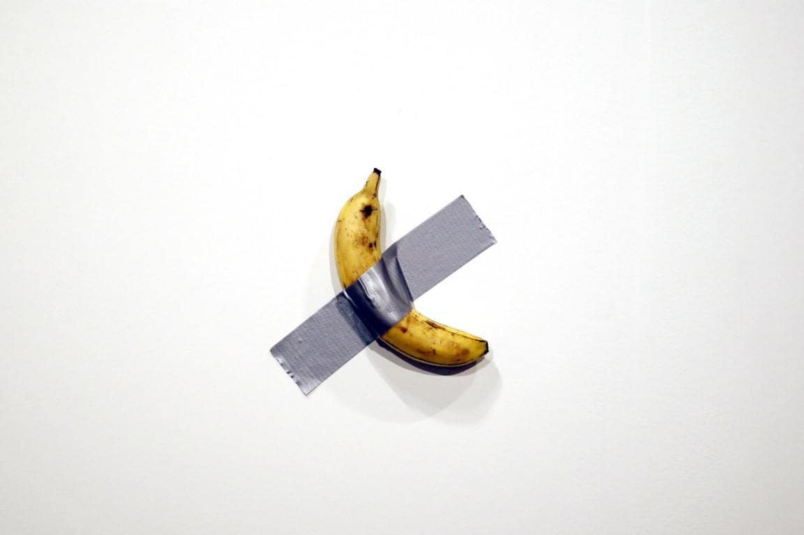
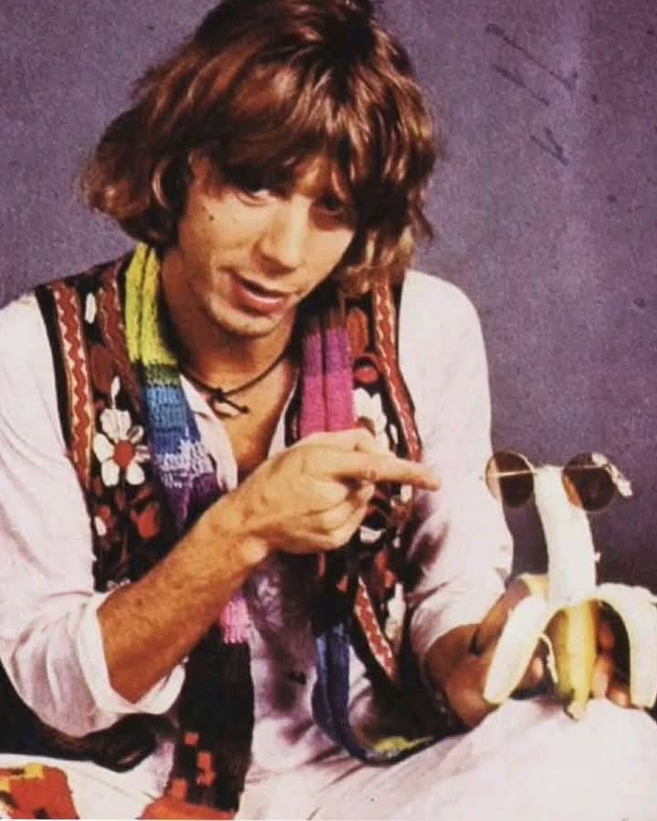

*L'arte delle banane tra speculazione e satira. Cosa è l'arte contemporanea e perché è roba che si mangia. Con una nota sulle banane in musica. Oltre il banale.*

Iniziamo questo argomento, scivoloso e affascinante, da una ricapitolazione gratuita e fuori luogo: ogni tanto mi sento generoso e simpatico e mi impegno ad aiutare le persone che ne dicono tante a capire almeno qualcosa. Sappiate dunque che l'arte contemporanea si è emancipata dalla rappresentazione del bello ed esprime piuttosto la tensione verso l'idea e lo spazio del concetto. Nel migliore dei casi è quindi un raffinato strumento di conoscenza, nei peggiori un mercatino per sciuponi in cerca di status, come del resto tutto ciò che fornisce l'illusione di non essere dei pirla pur essendolo in pieno. E, indipendentemente dalla sua presunta immortalità o meno, quanto decide se l'arte sia tale è sostanzialmente il circuito nel quale un qualsiasi oggetto viene collocato. Deve così essere riconosciuto che, nonostante possano esserci elementi in comune, c'è una certa differenza tra il mercato ortofrutticolo e quello artistico. Che poi questo, al di là delle quotazioni, sia ampiamente sopravvalutato, è cosa che di questi tempi viene da sé. Non sbaglia affatto chi astutamente lo sospetta, e certamente i veri tesori sono altrove. Piuttosto, cercateli, e fatemi sapere. Oppure, come suggerì il grande Ennio Flaiano, diventate voi stessi arte contemporanea: qualcuno ci riesce.

Entrando nel discorso propriamente estetico, va considerato che tale processo inizia con l'Impressionismo, nel quale vengono dissociati tra loro visione e individuazione delle forme. Il lavoro si concentra quindi sul rapporto tra strumenti artistici, percezione e condizioni ambientali. Questo apre a numerose e diverse correnti caratterizzare da una spiccata sperimentazione; durante le prime fasi prevale l'arte, dal secondo dopoguerra si impone il mercato. Negli anni sessanta del novecento Piero Manzoni realizza la Merda d'artista in scatola e il Fiato d'artista in palloncini, e lo fa soprattutto per una provocazione intenzionata a demistificare i meccanismi che permettono la collocazione delle opere nel contesto artistico. Qualcosa di simile a quanto realizzò lo stesso Manzoni con delle uova sode, per quanto con minor indole sperimentale e maggiore spirito commerciale, è stato quindi realizzato da Maurizio Cattelan con l'ormai famosissima installazione Comedian, realizzata la prima volta presso la Galerie Perrotin all’Art Basel Miami Beach, che sostanzialmente si compone di una banana attaccata al muro con uno scotch grigio.

Comedian prevede come performance anche il mangiarla e sostituirla con un'altra banana, come ha fatto il 6,2 milioni di volte fortunato acquirente dell'opera, o meglio del certificato di autenticità, l'imprenditore cinese di criptovalute Justin Sun, che l'ha quindi divorata divenendo giustappunto arte lui stesso, e quindi rifornendosi, senza badare a spese, di banane dal costo approssimativo di 35 centesimi cadauna, procuniando la sibillina sendenza che «*il valore reale è il concetto stesso*». Da parte sua Cattelan ha riconosciuto che l’opera è una satira delle speculazioni di mercato e, come evidenziato brillantemente dall'esperta di comunicazione [Marika Lion](https://www.firstonline.info/comedian-di-cattelan-satira-della-speculazione-del-mercato-dellarte-banane-e-criptovalute-cosa-hanno-in-comune/), proprio il parallelo con i token digitali delle criptovalute, il cui valore deriva esclusivamente dal contratto collettivo e dalla loro scarsità artificiale, è indice che l'operazione sia stata studiata a tavolino. Di per sé, il gesto non è cosa nuova e, con quotazioni minori, anche le uova personalizzate da Manzoni vennero mangiate e, per quanto mi riguarda personalmente, nel corso di una mostra della quale non ricordo come si chiamasse l'artista, ad una pastarella che nella sua integrità mi sembrava insignificante, diedi un morso per lasciarla quindi esposta ben smozzicata. Per quanto fosse stata una mia iniziativa personale, clandestina, fatta di sottecchie e del tutto gratuita, al pubblico la cosa piacque tantissimo.



Quanto va quindi focalizzato è che l'arte contemporanea può permettere di chiederci cosa conferisca valore ai nostri gesti, e così così contribuire a porre in dubbio i nostri automatismi; oppure, può essere la trappola che dimostra quanto di questi siamo inesorabilmente vittima. È soprattutto una questione di attitudine e, in maniera simile, potremmo anche interrogarci quale superstizione, sui social ma non solo, costringa a credere sia scrittura qualsiasi cosa abbia forma di parole. Quanto realmente conta è pertanto superare la soglia di un atteggiamento irriflesso, come già suggeriva la lezione di Duchamp. Non serve soffermarsi troppo sulle cronache, starsi sempre a fare i conti della serva, chiedersi che sapore abbia una banana o roba del genere.

Da parte mia, considero che un'arte realmente compiuta non disgiunga l'aspetto concettuale e ideativo da quello tecnico e operativo. E trovo che la musica, con l'immaterialità sua e la fisicità che richiede, sia quanto più permetta di confrontarsi con qualcosa che sia significativo e abbia una struttura, nonché di sfuggire all'insignificanza e alla pretestuosità che ci assedia, che certamente si manifesta anche nell'arte e nelle parole. Quindi, restando nell'ambito musicale, per quanto Andy Warhol con i Velvet Underground abbia dato forti stimoli al rapporto tra arti e al ruolo delle banane, e Daevid Allen abbia suggestivamente associato la banana alla luna in modi ancora da approfondire, trovo particolarmente appropriato segnalare Kevin Ayers, che paragonava la sua stessa musica ad una banana, e che in questa foto, diffusa sul gruppo Facebook [Kevin Ayers Appreciation](https://www.facebook.com/photo/?fbid=10162334573514469&set=gm.10159294058404649&idorvanity=18233279648), ci indica, con un senso della commedia particolarmente appropriato, una preziosissima banana con occhiali da sole.

Di tutto ciò, come al solito, agli stolti non fregherà nulla, perché tanto hanno già deciso che bastano le loro banalità a spiegare e addirittura risolvere il mondo. Ma pure questo viene da sé, e bisogna superare il fastidio che ancora porta, soprattutto alle persone buone e sensibili come me, per quindi concentrarsi nel salvaguardare gli interstizi dell'alterità. Avete capito? Forse sbaglio? Non sbaglio, e voi avete capito tutto.

{fig-align="center"}
