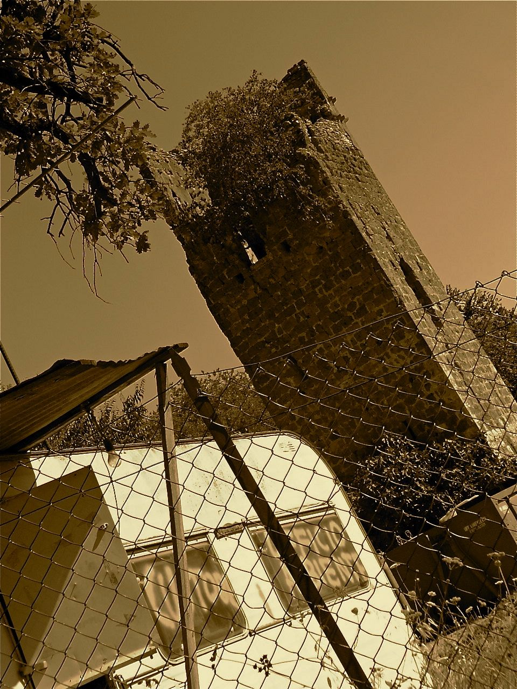

{fig-align="center" width="648"}

*Tuscolo anima del medioevo romano. Le Goff: la dispersione locale dei poteri. Dispersione del patrimonio archeologico. Distribuzione delle proprietà del feudo tuscolano: la rocca, i castelli, le torri, le coste, la via Latina e le altre. Congiunti e discendenti della potente casa baronale: i Colonna e gli altri. L'Aventino. I Templari al palazzo di Marozia e Alberico. Le chiese e i mitrei. Benedettini e basiliani. Papi e imperatori. Pellegrini e crociati. Libri di pietre, pietre che parlano. L'immagine di Gerusalemme e la nave pronta a salpare.*

## 1. I possedimenti

Ci sono storie che già in tempi lontani sembravano remote, e figurarsi a noi quanto possono sembrare distanti. Eppure, la loro influenza sugli eventi è stata enorme. Di queste storie, intrecciate come radici, le pendici del Tuscolo le strade di Roma tuttora nascondono le memorie: forse memorie spente, ma comunque avviluppate e fitte.

Se la Roma medievale è un «*fantasma inafferrabile*» (Mario Sanfilippo), Tuscolo ne rappresenta l'anima, tanto viva e potente ai suoi tempi quanto dimenticata oggi. Metterne in luce ruoli e vicende significa fornire voce a quel fantasma da cui hanno preso forma istituzioni e concetti che ancora caratterizzano il nostro stesso mondo. Inoltre la storia dei luoghi, al di là di ogni retorico localismo, offre dettagli concreti che chiariscono dinamiche collettive altrimenti sfuggenti, soprattutto quelle legate alla struttura feudale, «*trionfo della dispersione locale dei poteri*» (Jacques le Goff).

Quello che ci rimane di Tuscolo è pressappoco questo: siti cancellati, resti dispersi, dati carenti e fonti spesso manipolate. Ricordiamo più facilmente quanto appartiene all'era classica e imperiale di ciò che riguarda il medioevo a noi cronologicamente più prossimo, e non perché questa sia un'epoca oscura: in realtà, l'oscurità è tutta nostra. E dove la distruzione è stata sistematica e anche protratta nei secoli, al punto che il saccheggio arriva fino ad oggi, la tutela espressasi nel tempo, che ha comunque in tempi relativamente recenti espresso una netta ripresa di interesse che ha portato anche a importanti rilevazioni e notevoli contributi, è stata a lungo marginale, soprattutto per quanto riguarda il medioevo.

La collezione più significativa dei reperti tuscolani è da tempo al Castello di Agliè in Piemonte. Le collezioni sono così sparse per il mondo che ci vuole un atlante solo per farne l'indice. Tra gli strumenti oggi disponibili nel territorio di pertinenzafigurano il Museo Tuscolano di Frascati e quello dell’Abbazia di San Nilo a Grottaferrata. Pur eleganti, restano insufficienti a rendere testimonianza dell'antica città. Soprattutoto, conservare e celebrare non basta: relegare la storia a un mero esercizio commemorativo significa soffocarla in funzione degli equilibri del presente. È poi assurdo disperdere il già labile interesse collettivo in rivalità locali, talvolta meschine, intorno a un singolo ritrovamento o ad un monumento isolato, rivendicato come trofeo campanilistico nel chiuso dei confini del paese o della circoscrizione. Nulla di più distante dal mondo antico e medievale che, anche quando più particolarista, conserva sempre un respiro universale, e ciò è inutile anche nei confronti del nostro futuro. Quantomeno se si intende restituire significato tanto alla storia quanto al nostro agire.

Gli scavi sistematici compiuti in oltre trent'anni dall'Accademia Spagnola, che hanno dato risultati significativi, valorizzando l'area della Basilica Forense, delle Terme, del Santuario extraurbano, del Sacello di Mercurio, hanno favorito notevoli ritrovamenti. Tuttavia, risultano purtroppo troppo settoriali rischiando di alimentare un attitudine *feticista,* e una certa "deterritorializzazione" dell'intervento rischia di non favorire fruizione e partecipazione dell'area e dei suoi tesori. Né nei confronti di coloro che, come tanti tuscolani di oggi, hanno vissuto a lungo in *intimità* con le rovine, né nel permettere di collocare nella relazione più opportuna i dati archeologici con la dimensione internazionale delle vicende storiche che il sito ha espresso. Che va molto oltre la stessa logica del sito, del ritrovamento e della dimensione "locale".

Le questioni sono complesse e stratificate e, pu se sembra strano, la stessa storia non sempre aiuta. I cronisti medievali, e soprattutto i detrattori seriali Liutprando da Cremona, Rodolfo il Glabro, Pier Damiani e Bonizone di Sutri, non erano troppo lontani dal *gossip* odierno, tanto vincolanti erano gli interessi dai quali dipendevano, quanto esagerati, e spesso grotteschi, i toni da loro usati nei loro racconti. Molto di quanto riusciamo a vedere del paesaggio perduto di Tuscolo è quindi strappato alla polvere: non sono tanto i resti a portarci testimonianze, quanto proprio ciò che è andato *distrutto*. E dove è la stessa Tuscolo ad aver progressivamente dimenticato la propria importanza, cercarne le consistenza, ritrovarne il mondo perduto, guardando oltre ciò che appare *immediato*. A partire dal nome.

I *Comites de Tusculana* prendono nome dal titolo di Conti del Sacro Palazzo Lateranense e si collocano tra le famiglie baronali romane più influenti. Hanno quindi un ruolo che prescinde da un'appartenenza ad un luogo. L'antica citta di *Tusculum*, secondo la leggenda fondata, come narrano i cicli troiani di Cinetone di Sparta ed Eugammone di Cirene, da Telegono figlio dell'eroe greco Ulisse e della maga Circe, viene da loro occupa, e ne assumono il nome, in seguito a determinate circostanze che essi stessi favoriscono, e la poszione a nido d'aquila risulta loro funzionale quanto disporre delle ricchezze di un'area piuttosto fertile. Diventano quindi "tuscolani" dopo alla spiccata per quanto controversa affermazione su tutte le cariche civili e religiose in seguito all’incastellamento delle alture del sec. X. Nel sec. XI il titolo li accompagna nella decisa e piena affermazione nei poteri di Roma, li segue anche nella disfatta sul soglio pontificio per antenere comunque ruolo e dissolversi solo in un lento declinio che alla fine del sec. XII si risolve nella distruzione della città. Possedimenti, influenza e memorie restano a testimoniare in modo eloquente l’importanza di Tuscolo e della dinastia legata al suo nome.

Il peso storico delle vicende a cui tutto ciò è legato, evidente nelle tracce toponomastiche, nei ruderi disseminati sul territorio e nei monumenti ancora esistenti, sollecita interrogativi rispetto ai quali discipline purtroppo non avvezze a parlare tra di loro spesso faticano ad affrontare in modo integrato. Eppure, nessuno studio può venir trascurato, nessun aspetto può essere sottovalutato: parlano i libri e parlano le pietre. E il panorama anche sa essere vasto. E proprio l’incrocio di più prospettive e più piani di lettura, coordinato all’interno di un quadro generale strutturato, può permettere di formulare percorsi interpretativi in qualche capaci di restituire, attraverso una narrazione articolata quanto coerente, l'*esperienza* della storia. Quanto ci soccorre è che, ad essere archivio vivente e memoria viva, sono proprio le città, anche quelle perdute.

Tuscolo, a circa 650 metri di altitudine, rimandare ad una radice che indica «*incenso*» (Varrone) e quindi «*luogo sacro*» (Benveniste). Al centro della Valle Latina, sulla rocca si ergeva l'Acropoli, caratterizzata dal palazzo dei Conti costruito sul tempio dei Dioscuri, antichi protettori della città, e dalla chiesa della SS. Trinità. Più in basso si sviluppava la Tuscolo romana, con Teatro, Foro e Terme. Le chiese del Salvatore e di San Tommaso, tipiche dell’età medievale, a causa della distruzione ricordata dalle fonti, degli incendi ancora visibili sui costoni rocciosi, dell'aspersione di sale di cui si è tramandata memoria, e delle successive e continue sottrazioni, non sono più riconoscibili. Entrambe le aree erano difese dalle rispettive cinte murarie. In posizione extraurbana, sono ancora visibili le rovine di un santuario, originariamente dedicato a Giove o a Ercole, e un grande Teatro in *lapis tusculanum*. La Strada dei Sepolcri in pietroni di basolato discende ancora verso quel che resta della via Latina; sul versante opposto, presso le pendici, si nascondono i ruderi di un'ulteriore cinta muraria.

Le ville patrizie repubblicane e imperiali di Lucullo e quella di Passieno Crispo poi ereditata da Nerone, e in seguito l'area più favorevole al commercio, si sviluppano sul quadrante Ovest (Frascati), area dal sec. VIII nota con il nome *Frascata*. Verso Nord (Grottaferrata) si sviluppò la suburra, e più tardi l'Abbazia Greca dei monaci Basiliani di San Nilo, fondata su terreni donati da Gregorio I dei Conti di Tuscolo nel sec. XI, forse appartenuti alla Villa di Cicerone, da questo periodo caratterizzati con il nome di *Crypta Ferrata*. Più spostati a Sud (verso Marino) e presso uno dei siti attribuiti all'antica *Castrimoenium*, le fortificazioni dette Castel de Paolis, che risalgono al sec. X, forse contemporanee del ponteficato di Giovanni X e dell'affermazione del gruppo parentale poi detto tuscolano.

A Nord-Est, in una zona dal X sec. detta *Mons Porculi*, c'è l'oratorio dedicato al monaco siriano Antonino di Apamea, introdotto secondo la leggenda popolare da monaci greci migrati nel VI sec., documentato dal 1068; sull'altura sovrastante, si sviluppa Monte Porzio, il cui nome deriva dalla tradizionale attribuzione di una villa a Catone esistente nei pressi. A Sud-Est (Rocca Priora), presso l'antica *Corbium* distrutta ai tempi della Repubblica romana, l'*Algidum* o Artemisio ospitava chiese e monasteri quali Santa Aurea, San Nicola, San Michele Arcangelo, San Biagio (dipendente da Abbazia di San Nilo), e Sant'Agata, fondata da Giovanni di Cappadocia, fornendo ulteriore testimonianza di una persistenza presenza del Cristianesimo greco; scavi recenti ipotizzano tuttavia che Sant’Agata sorgesse originariamente presso il Foro di Tuscolo. Sul versante orientale (Monte Compatri), nei pressi di *Labicum vetus*, distrutta a sua volta in età repubblicana, sembrerebbero prevalere condizioni di maggiore ruralità.

I Conti possedevano feudi e castelli soprattutto nei territori degli attuali comuni di Frascati, Grottaferrata, Monte Porzio, Monte Compatri, Rocca Priora, Colonna, Rocca di Papa, i quali comuni, insieme a parte del territorio romano, costituiscono ancora oggi la diocesi *suburbicaria* di Frascati, anticamente detta di Labico Quintanense. Le propaggini del loro potere coinvolgono in modi e periodi differenti aree appartenenti ad altre diocesi e su cui sorgeranno i comuni di Marino, Castel Gandolfo, Albano, Ariccia, Genzano, Nemi, Lanuvio, Artena, Gallicano, Zagarolo, Palestrina, Subiaco, Lariano, Velletri.

Velletri, caso unico nella Campagna romana per la sua autonomia municipale, entra anch’essa nell’orbita tuscolana nel sec. X. E ne trae vantaggi così come li sconta: il suo episcopato viene unito a quello di Ostia, geograficamente lontano, proprio nel tentativo della Chiesa di contenere l'influenza dei Conti quando essi cercano, senza successo, di imporre come pontefice Benedetto X Mincio, già vescovo della città, per reagire al tracollo seguito al pontificato di Benedetto IX.

Nella piena espressione della loro potenza, i Conti controllavano gran parte della campagna romana sud-orientale, organizzando un sistema difensivo che seguiva le caratteristiche del territorio. Tale sistema si innerva anche a Roma dove, per quanto non tutte nello stesso periodo, possedevano zone d’influenza e importanti proprietà. Tali aspetti sono rintracciabili anche in quanto si è trasmesso come *usi civici*, diritti premoderni di carattere collettivo a base fideiussoria piuttosto diffusi in tutta la fascia che separa Frascati da Roma, che in una certa misura espressero nei loro esempi più datati la spartizione del patrimonio di Tuscolo effettuata dai poteri ecclesiastici e municipali. Il principale elemento nella strutturazione del loro controllo rimane comunque la rete viaria.

Un quadro capace di associare questioni materiali e aspetti dinastici, orizzonte internazionale e impatto territoriale, alimentando una memoria viva anche nella frammentarietà dei riferimenti attraverso l'osservazione di quanto resta nelle varie testimonianze di una storia di lungo periodo, può quindi permettere di riconoscere tracce non sempre evidenti in un'area per lungo tempo prevalentemente agricola, le configurazioni attuali sono molto diverse da quelle passate, eppure continuativamente centrale nelle dinamiche storiche e in qualche modo coerente nella sua complessità.

La crucialità di Tuscolo emerge anche dalla sua fine: la città non viene distrutta per conflitti locali, ma a causa del riassetto dei poteri nel tardo sec. XII. L’impero si riorganizza con l’unione dinastica tra Hohenstaufen e Normanni attraverso Enrico VI e Costanza d’Altavilla, acquisendo nuova e ingente composizione territoriale; il papato, dopo un ventennio di esilio, rientra a Roma con Celestino III Orsini, acerrimo rivale dei Tuscolani; il Comune di Roma, di recente istituzione, mira a consolidare la propria egemonia controllando la moneta e gli assi viari del territorio. Tuscolo diviene così un nodo strategico da eliminare.

Il territorio del Lazio meridionale più prossimo a Roma, ha una propria naturale continuità geografica. Modellato dai resti del vulcano laziale, si muove tra dolci colline e piccoli laghi, e su di esso spicca con i suoi boschi la mole del *mons Albanum* o *Cabuum*, oggi monte Cavo. Qui le tribù del Lazio celebravano le *Feriae Latinae*, qui si rifugiarono sovrani transfughi quali Tarquinio il Superbo e Benedetto IX. Presso il monte si colloca il sito di Alba Longa, identificato alternativamente nei pressi dei centri moderni che circondano il Lago Albano (Marino, Rocca di Papa, Castel Gandolfo, Albano). Secondo leggende poi formalizzate dagli autori classici, fu fondata da Ascanio, figlio del profugo troiano Enea, da cui prende origine la stirpe da cui discendono Romolo e Remo, abbandonati sulle sponde del Tevere per ordine del re usurpatore Amulio e quindi cresciuti in quella che soltanto in seguito sarà chiamata Roma.

Monte Cavo spezza il territorio nelle due parti che corrispondono alle due fasi di espansione dei Conti: prima di Benedetto IX nella parte verso la zona tuscolana, successivamente nella parte verso il versante costiero. Lo sviluppo si intreccia agli altalenanti rapporti con gli imperatori tedeschi, che ambivano a ricevere incoronazione e parimenti esigono influenza, e con la tensione ideale che si intrattiene con Bisanzio e con il cristianesimo orientale presente anche nel culto, che rappresenta l'altra parte dell'eredità di Roma.

## 2. L'influenza

I prolungamenti che da Tuscolo si dirigono verso la città di Roma seguono la *via Labicana* (grossomodo parallela all'attuale Casilina, importante direttrice delle basiliche cristiane ma anche gli eserciti in marcia), la *via Tuscolana* (che non appartiene alle strade consolari, mantendo per lungo tempo carattere secondario), la *via Latina* (parzialmente l'attuale Anagnina, strada decisiva nei traffici verso il sud), la *via Appia antica* (*Regina Viarum* e via sacra dei Romani, poi variata in vari punti). Le strade erano segnate da numerose torri, che in una mappa di Eufrosino della Volpaia degli inizi del sec. XVI, comunque tarda rispetto al periodo di nostro interesse, sono enumerate in circa 200.

Molte torri sono andate dissolte, altre sono in rovina, alcune sono ancora visibili per quanto in forme differenti. Quelle che sorgono con certezza in un periodo successivo, oppure risultano estranee all'influenza tuscolana, sono omesse dalla considerazione a meno che non possano trovare utilità per effettuare alcune precisazioni. Riconoscere lo sviluppo delle fortificazioni, di difesa militare, di semplice avvistamento o anche a carattere commerciale e di dazio, all'interno di un sviluppo urbanistico e amministrativo come il nostro, molto lontano dall'epoca medievale, può risultare piuttosto complesso e certamente irto di insidie. Tuttavia, delle ipotesi sono comunque necessarie, e bisogna sempre ricordare come per tre secoli i Conti di Tuscolo siano stati il gruppo di potere più rilevante a Roma.

La via Labicana è anche la direttrice che maggiormente espone Tuscolo agli attacchi militari, e infatti è scenario di scontri decisivi. Sul suo versante, al tempo delle Guerre Latine, nel 496 a.C. circa, vi si svolge la Battaglia del Lago Regillo, «*in agro Tusculano*» dice Livio e tuttavia dalla localizzazione incerta e ancora fortemente dibattuta, così come cruenta fu la battaglia e incerte sono le fonti. Sospesa tra storia e leggenda nell'intervento dei Dioscuri, divinità tuscolane evocate da Roma a proprio favore. Nella battaglia si contrappongono l'esercito repubblicano e quello che sostiene Tarquinio il Superbo, di cui un alleato decisivo è il dittatore di Tuscolo Ottavio Mamilio, sposo di Anicia figlia del re. Una guerra persa, che però portò pace: seguì il *Foedus Cassianum*, che pur rincoscendo a Roma la supremazia estese a Tuscolo e alle città del Lazio i diritti di cittadinanza romana, prolungando di un giorno le *Feriae Latinae*. E tuttora a Roma, sulla via Anicia, c'è sul muro una lastra di marmo bianco con un'aquila scolpita, che sembra omaggiare la figlia del re ribelle e la sua stirpe.

Sempre sulla direttrice della Labicana, durante il Medioevo, nello stesso periodo delle lotte tra i Comuni del Nord Italia e Federico Barbarossa, nel 1167 le truppe imperiali guidate da Cristiano di Magonza e Rainaldo di Dassel aiutano i Tuscolani di Rayno e fratelli a sconfiggere le armate del Comune di Roma nella battaglia che Sicardo riporta quale *apud Montem Portium,* chiamata perlopiù Battaglia di Prataporci. Una battaglia forse obbligata, conclusa dai Tuscolani con una vittoria che infierì ai 10.000 municipali, ai quali si aggiugevano ben noti esponenti delle famiglie patrizie romane, parenti compresi, più di 1.000 morti e circa 2.000 prigionieri. Una battaglia che sarebbe stato meglio non vincere: le truppe municipali si sarebbero vendicate, il supporto imperiale non sarebbe stato sempre disponibile, e le cose stavano cambiando. A Roma la Labicana procedeva verso l'entroterra a partire da Porta Esquilina, oggi chiamata Arco di Gallieno (presso Piazza Vittorio), da cui dipartiva anche la Prenestina, sotto il cui arco la tradizione popolare vuole siano state appese le teste dei cittadini tuscolani dopo la distruzione dell'antica città nel 1191.

Al III Miglio della Labicana non può essere stata estranea agli interessi dei Conti la vasta proprietà imperiale *Ad Dos Luaros*, peraltro sede della diocesi tuscolana dopo il trasferimento da quella originaria di Labico-Quintanense, locata invece al VII miglio della Labicana presso Torrenova. *Ad Dos Lauros* è dove Elena madre di Costantino imperatore ha avuto residenza, ricevendo poi il mausoleo detto Torre delle Pignatte, da cui il nome del quartiere di Tor Pignattara. Lo sviluppo dell'aereoporto di Centocelle, il primo in Italia nel 1926, ha determinato l'occultamento di numerosi impianti della villa, chiamata per le dimensioni proprio *Centum Cellae*. È quindi attribuibile ai Conti la Torre propriamente detta di Centocelle, già Torre di San Giovanni in quanto appartenuta all'omonima basilica, visibile al IV miglio (sulla via Palmiro Togliatti) e databile alla fine del sec. XII. Alla basilica di San Giovanni e allo stesso periodo appartiene pure la struttura fortificata di Tor Tre Teste sulla via Prenestina; sull'area prenestina inizialmente prevalgono i Crescenzi, rivali dei Conti, poi prevalgono i Conti e quindi i loro successori Colonna.

Al VII miglio della Labicana, la torre che oggi chiamiamo Torrenova apparteneva con diverso nome ai Crescenzi; in un altro contesto storico, apparterà ai Cenci e quindi agli Aldobrandini. Siamo nella zona di influenza tuscolana anche a Colle Carcariola, presso lo snodo che porta a Tuscolo oggi conosciuto come via di Vermicino; nei pressi, a Torre Maura, è stata creduta erroneamente torre una tomba laterizia del II sec. d.C. con cella funeraria inferiore ora interrata, mentre è suscettibile di rientrare almeno inizialmente nelle fortificazioni tuscolane una delle rovine delle Due Torri (Giardinetti-Tor Bella Monaca) risalenti al XII-XIII sec., così come lo è il rudere a base romana del casale fortificato di Caminetti (Torrenova). Circa all'VIII miglio della Labicana, dove oggi è Torre Gaia, che prende il nome da una costruzione del 1932, viene chiamata Torraccio una tomba romana a torre incorporata nel casale di Grotte Celoni riconducibile alle funzioni di fortificazione; nei pressi, un diverticolo passa per Pantano Secco per arrivare via Cocciano a Frascati. Nell'epoca precedende la distruzione di Tuscolo non esisteva ancora Torre Jacova, costruita dai discendenti tuscolani Colonna che prendono il nome dall'omonima città. Al XV miglio la strada passava al di sotto di *Labicum vetus* (presso Monte Compatri), distrutta dai Romani al tempo della Repubblica, per quindi dirigersi verso Capua.

La via Tuscolana rappresenta una strada minore; le fortificazioni si collegano soltanto in parte, ma vengono rubricate al suo riguardo in quanto individuabili sul suo asse a partire dal Raccordo Anulare ( fornendo indicazione chilometrica data l'assenza di indicazioni in miglia). La scomparsa Tor Vergata risulta particolarmente incerta come attribuzione, pur non potendo escludere abbia avuto rilevanza, data la prossimità alla zona di più stretta pertinenza. A metà strada tra la città di Frascati e le mura Aureliane di Roma, dopo il bivio che congiunge la via Tuscolana alla via Latina, trova importanza strategica negli accessi a Tuscolo la Tor di Mezzavia, eretta sui ruderi di una villa imperiale. Alla fine del sec. XII appartiene agli Annibaldi, parenti dei Tuscolani. La torre giunta a noi risale però al sec. XIII, dopo la distruzione di Tuscolo e la spartizione del suo patrimonio; lo stesso vale per la Torre dei SS. Quattro, nel quartiere oggi chiamato di Terranova, visibile dal km 13.500 della Tuscolana. Confusa tra le case della speculazione edilizia e provvista di merlature ghibelline, è appartenuta all'omonimo monastero, quindi agli Orsini, storici nemici di Tuscolani e Colonna.

Circa al km 20 della via Tuscolana, su un diverticolo che approssimandosi a Frascati riporta sulla via Latina, è patrimonio tuscolano il monastero fortificato detto di *Hierusalem*, dal quale deriva il toponimo De Salè, sede del mausoleo di Lucullo e oggi conosciuto come Torrione Micara. Esso fu concesso all’abate Pietro di Montecassino nel 1017 da una bolla emanata dal pontefice Benedetto VIII dei Conti di Tuscolo. Dopo Capocroce, la strada rimane sotto Frascati congiungendosi con la via Maremmana, poi rinominata Gregoriana, che prosegue per Monte Porzio e oltre; il diverticolo che si arrampica lambendo l'antica Frascati percorre quella che oggi è conosciuta come Salita dei Cappuccini e da lì penetra a Tuscolo.

La via Latina prende corso dalla porta omonima. Nei pressi c'è la chiesa di San Giovanni evangelista, che nella vicina cappella di San Giovanni in Oleo subì il martirio. La chiesa fu edificata nel sec. V da papa Gelasio sopra un tempio dedicato alla dea Diana. Nei sec. X-XII è strettamente legata ai Tuscolani. La via Latina costeggia la valle della Caffarella, corridoio naturale verso la limitrofa via Appia. Circa al V miglio, visibile lungo la linea ferroviaria Roma-Frascati presso Ciampino, si trova il Torraccio della Marrana o dell'Acqua Sotterra, citato in una bolla del 1122 di papa Callisto II dei Conti di Borgogna per l'adduzione dell'acqua Crabra o Mariana verso gli Orti di San Giovanni attraverso una condotta dell'acquedotto Claudio. Questa acqua scorreva parallela alla via Latina, costituendo poi un confine tra Tuscolo e Roma con un fiume in seguito interrato, il cui controllo fu decisivo nella competizione per il dominio sulla Campagna. Sgorgava nella valle Marciana che è sovrastata, dove oggi si biforca l'Anagnina, dal Castello di Borghetto, anticamente attraversato dalla strada, importante dominio tuscolano passato ai Savelli dopo la distruzione di Tuscolo, non lontano dalle catacombe *Ad Decimum.* A tale altezza, un diverticolo raggiunge l'Appia attraverso la Mola Cavona. Circa all'VIII miglio, un altro diverticolo percorre quella che conosciamo come via del Fico per poi all'altezza del XII miglio ascendere attraverso la Via dei Sepolcri a Tuscolo.

La via Appia antica parte da Porta Capena (ruderi presso Porta San Sebastiano). Tra le probabili pertinenze tuscolane, l'area del circo di Massenzio e della tomba di Romolo, a confine con la via Ardeatina. L'Appia attraversa strutture fortificate facilmente riconoscibili presso il Mausoleo di Priscilla, la Tomba di Cecilia Metella, la Villa dei Quintili, Casal Rotondo, Torre Selce, e *Castrum Bovillae* (Frattocchie), dove incrocia la Mola Cavona che da una parte riporta sulla via Latina e da quella opposta imbocca la Nettunense. Queste strutture sono comprese nel tratto tra il II e il XI miglio la cui intera area è nel XI sec. proprietà dei Conti di Tuscolo. La strada percorre quindi la Campagna laziale meridionale, attraversa i i monti Lepini e la palude Pontina, dove i Conti possiedono Ninfa e Norma, l'una al mezzo e l'altra alla fine delle loro vicende. In origine, come la Casilina e la Latina, l'Appia arriva a Capua; dal III sec. d.C. prosegue fino a Brindisi, porto per la Grecia.

Per quanto riguarda gli interessi costieri, un documento di donazione dell’anno 983 stabilisce rapporti dei Conti con il *castrum* di Porto (Fiumicino). Nel 999 Gregorio I ha ruolo di *consul et dux* e di *praefectus navalis*, ed è tradizione erudita pur se oscura che suo figlio Teofilatto II riceva nel 1001 quale titolo onorifico quello di vescovo di Porto. Nominato nel 1012 pontefice come Benedetto VIII, nel 1016 guida un'alleanza con le repubbliche marinare di Pisa e Genova e altri contro i Saraceni insediati in Sardegna, le cui incursioni avevano distrutto Luni sul Magra. Consolidato il ruolo marittimo della Chiesa e dei Tuscolani e posto le basi per alleanze nazionali che preannuciano le Crociate, nel 1018 emette una bolla che legittima la proprietà di Porto da parte della Chiesa, rispondendo agli interessi di quanto è chiamato *papato di famiglia* del quale comunque ha sancito la decisività. Successivamente, tra l'acme e il declino della loro inflenza, i Tuscolani assumono proprietà di zone costiere quali Torre Astura sulla via Pontina, Nettuno allo sfocio della Nettunense, Terracina sulla via Appia.

L'influenza dei Conti si estende anche a nord di Roma, dove una tradizione erudita riferisce che già ai tempi di Teofilatto e Sergio III abbiano proprietà a *Silva Candida,* presso la via Boccea e non lontano dallo svincolo per la Clodia e la Cassia, e quindi parte del sistema della Tuscia. In seguito, sviluppano interessi in Tuscia in zone quali Galeria sulla via Clodia, Mazzano nella valle del Treja, Celleno nella valle del Tevere, *Vicus Cimini* presso il lago di Vico (distrutto dal papato nel 1186 per effetto della politica tuscolana), in centri del lago di Bolsena quali Bolsena, Capodimonte, Montefiascone e Borgo San Flaviano (questi due acquisiti dopo l'abbandono di Tuscolo). Nella Sabina sono alleati con la filoimperiale Abbazia di Farfa.

Nell'epoca di Benedetto IX, i Tuscolani intrattengono rapporti di parentela con il duca di origine longobarda Guamario IV di Salerno che ribadiscono una lunga alleanza; Guamario conferisce al suo Ducato la massima estensione territoriale per venir poi esautorato dall'imperatore Enrico III di Franconia, deciso avversario del papa tuscolano. Sempre in tali circostanze, sono alleati di Bonifacio di Toscana, lui stesso di origine longobarda, il cui dominio comprendeva anche zone oggi in Emilia, Lombardia e Veneto; è padre di Matilde di Canossa, che sarà fedelissima del pontefice riformista Gregorio VII di Soana. Tuscolo assume quindi spiccata rilevanza anche sul territorio peninsulare, e tuttavia i poteri forti dell'epoca cominciano a seguire altre direttive.

A Roma, dove i Conti controllano l'istituzione papale, le milizie anche fiscali e navali e le cariche civili, sono attestate, seppur non tutte nello stesso periodo, diverse proprietà, che possono farne comprendere relazioni e geneaologie. Al palazzo di via Lata (oggi piazza SS. Apostoli), sono legate le origini dell'*augusta senatrix* Teodora, moglie del potente *vestararius e iudex civilis* Teofilatto. Era stato casa di famiglia degli Anici, la *gens* che discende da Ottavio Mamilio e Anicia. In seguito, sarà residenza principale dei Colonna, discendenti tuscolani attraverso Pietro *de Columna*, nipote di Benedetto IX il *tre volte papa* apice di tutte le controversie.

Invece, nella zona del porto fluviale di Ripa Grande da cui proviene Teofilatto, si eleva l'Aventino, sul quale c'è il palazzo oggi conosciuto come Santa Maria del Priorato e precedentemente consacrato a San Giovanni, dimora di Marozia e quindi di Alberico, rispettivamente figlia e nipote di Teofilatto. Marozia è la donna di potere più influente dell'età ferrea, Alberico è il *princeps* romano dal maggior prestigio. Il palazzo viene donato ai Benedettini e in seguito passerà ai Templari.

Il fantasma della Roma medievale prende quindi corpo nell'anima tuscolana. E oltre a quanto già riportato, è ipotizzabile da parte dei Conti di Tuscolo un utilizzo della Torre dei Conti, originariamente alta 60 metri e dimezzata da un terremoto del 1348. La Torre si eleva presso il Foro Romano su una delle esedre del *Templum Pacis* edificato nel 75 d.C. dopo la conquista di Gerusalemme, nella zona sulla quale insisteva parte del *Templum Telluris* costruito in seguito all'unificazione romana della penisola, ora del tutto scomparso.

Una prima costruzione della torre è effettuata nel 858 da Pietro dei Conti di Anagni, e viene quindi consolidata nel 867 dal pontefice Niccolo I; se questi è un probabile esponente dalla *gens* Anicia dalla quale derivano la stirpe di Teofilatto e quindi i Tuscolani, il primo appartiene ad uno dei molti rami in cui si suddivide la famiglia Conti nei territori della Campagna romana più a sud, che intrattengono con i Conti di Tuscolo parentela tramite ceppo patrizio comune.

Papa Innocenzo III, deciso esponente della teocrazia papale, nasce nel 1161 come Lotario dei Conti di Segni a Gavignano, nel 1153 feudo di Giordano dei Conti di Tuscolo, ed è lui che nel 1238, su un progetto che Vasari ci informa redatto da Marchionne d'Arezzo responsabile anche della Torre delle Milizie, termina la fortificazione della Torre dotandola dell'aspetto che, pur con le menomazioni successivamente subite, ha ancora oggi. Quando qui ci interessa è notare come anche un singolo monumento marginalmente associabile ai Conti di Tuscolo possa far comprendere la vastità del loro potere.

Potere che è destinato a sgretolarsi proprio mentre la città sulla collina procede verso la sua distruzione. Ilruolo dei Conti viene quindi progressivamente assunto da elementi dell'aristocrazia maggiormente inclini alla mediazione con gli emergenti poteri borghesi e mercantili.

Al riguardo, nel 1090 alcune importanti spartizioni patrimoniali coinvolgono due figlie di Agapito dei Conti di Tuscolo, che vanno in sposa una ad Oddone Frangipane, che riceve in dote Marino, Rocca di Papa, Monte Compatri, mentre l'altra diventa moglie di Annibale Annibaldi, portando Rocca Priora, Monte Porzio e Molara. I Colonna, discendenti diretti dei tuscolani, ricevono il patrimonio in maniera diretta, intrattenendo da subito rapporti ambivalenti con il papato. Tra 1101 e 1108 Pietro I, che possiede Colonna, Monteporzio, Rocca Priora, Gallicano, Zagarolo, Palestrina e Cave, entra in conflitto con papa Pasquale II Raineri di Bleda per il possesso di Zagarolo, Palestrina e Cave. Invece, nel 1152, Oddone e Carsidonio vendono al pontefice Eugenio III Paganelli metà dei beni di Tuscolo, Monte Porzio e Monte Fortino (Artena). Prestigio e risse dei Colonna saranno destinate ad approfondirsi nei secoli successivi.

I gruppi parentali più prossimi ai Conti tuscolani sono quindi i Colonna. Inoltre, i Conti di Tuscolo appartengono allo stesso ceppo dei Conti di Segni e delle loro diramazioni. Intrattengono poi alleanze matrimoniale con i Conti di Galeria, i Pierleoni, gli Annibaldi, i Frangipane, mentre più sfumate appaiono le relazioni con i Monticelli di Tivoli e i Prefetti di Vico. I Crescenzi, che si dividono in numerose ramificazioni, discendono anch'essi da Teofilatto per via della figlia Teodora I; tra loro le famiglie si contendono lungamente il potere su Roma e sul territorio prenestino e tiburtino, si disputano le cariche papali e quindi tanto i ruoli fiduciari quanto le ostilità da intrattenere con le potenze imperiali.

I loro intrecci dinastici più rilevanti coinvolgono discendenti carolingi, dove papa Giovanni XII è figlio di Alberico II e di Alda figlia di Ugo di Provenza figlio a sua volta di Berta di Lotaringia, nonché la casa di Franconia in quanto il conte Tolomeo II sposa in seconde nozze, dopo la morte di Tropea nipote di Anacleto II, Berta figlia naturale dell'imperatore Enrico V. Sono decisive le relazioni politiche con gli Ottoni, dati gli stretti e controversi rapporti tra il pontefice Giovanni XII e Ottone I e quelli tra il Gregorio I e Ottone III, cruciali nella *renovatio imperii*.

Negli anni intorno al 1000 i Conti amministrano anche Palestrina e zone circostanti, che in seguito trovano sviluppo con i Colonna. Hanno quindi ruolo nel vasto ducato autonomo di Tivoli, le cui vicende trovano particolari sviluppi. Infatti, è un contenzioso fiscale della città di Tivoli contro l'imperatore a far scaturire la cacciata di Ottone III da Roma, guidata dal suo uomo di fiducia Gregorio I di Tuscolo. In seguito, Tivoli si schiera con il Barbarossa per difendersi dall'egemonia di Roma, che la costringe a limitazioni patrimoniali a favore del monastero di Subiaco, e l'imperatore le concede uno stemma provvisto di aquila simile a quello tuscolano. Alla distruzione di Tuscolo, un contingente di Tivoli partecipa all'assedio sotto la minaccia che papato, impero e comune romano le avrebbero fatto subire la stessa fine; sulla rocca tuscolana ormai condannata viene sottratta un'icona di Cristo Salvatore che può essere identificata con quella ancora custodita nella cattedrale tiburtina di San Lorenzo.

Le vicende di Tivoli rappresentano un parallelo piuttosto interessante a quelle di Tuscolo, e costituiscono un ulteriore elemento di decodifica della storia nascosta di Roma, che riguarda non tanto i monumenti del centro storico e la straordinaria capacità di assimilazione e di ospitalità che l'Urbe testimonia nel carattere composito dell'epoca dei Re e dell'Impero, quanto la pretesa di dominazione e l'imposizione militare e fiscale, a cui si collega la sistematica distruzione delle città ribelli, già da Gregorovius messa in evidenza come azione tipica tanto della fase della Repubblica romana quanto del papato e del comune medievali. E infatti, della Tuscolo un tempo potente, oggi non ne resta più traccia.

## 3. Le memorie

Se le storie di Tuscolo appartengono a pietre distrutte, spesso i documenti le riportano in modo frammentario e incerto. Le questioni sono piuttosto intrecciate: infittire ancora di più le vicende può aiutare a comprenderle, come quando in una città si percorrono di continuo le strade di riferimento in direzioni sempre diverse, variando passi e prospettive. Tale città è certamente difficile da cogliere, anche perché scomparsa da tempo. Le pietre perdute di Tuscolo emergono a sprazzi, cifra nascosta nel tessuto dell'Urbe.

A Roma, alcune di queste storie sembrano incontrarsi, in tempi e modi diversi, in un palazzo turrito che, pur se rimaneggiato, è ancora visibile guardando all'Aventino dai pressi del ponte Sublicio e di Porta Portese, conosciuto oggi come Santa Maria del priorato, sempre celebre seppur per altre attrattive rispetto a quelle che stiamo considerando. Appartenuto a illustri proprietari che quasi nessuno ricorda, si erge su di un colle che, per quanto in una zona per lungo tempo liminare e appartata, è al centro della nascita stessa di Roma.

Il colle può aver preso nome dal re Aventino Silvio di Alba Longa, discendente di Enea e antenato di Romolo e Remo, ma più probabilmente deriva da *Adventus*, in riferimento ad una delle sfide su chi debba essere il fondatore della nuova città. Sull'Aventino Romolo avvista sei avvoltoi, Romolo sul Palatino dodici, disputano se conti la priorità o il numero. Romolo prevale, Remo oltraggia i confini stabiliti dal fratello per Roma. Ucciso, viene sepolto nel luogo dove avrebbe voluto fondare Remoria, sul colle che guarda al fiume dove erano stati abbandonati da neonati.

L'Aventino, oggi ancora quasi nascosto, sembra abbia vocazione a celare in sé una memoria essenziale quanto problematica, e vi si trovano luoghi cruciali per la romanità e il cattolicesimo e per la polarità di forze che vi si compongono. Dove Tuscolo viene fondata nella data mitica del VII sec. a.C. da un figlio del greco Ulisse, Roma trova origine storica nel 753 a.C. ad opera dei discendenti del troiano Enea. La polarità, evidente nei gemelli Romolo e Remo, è al nucleo della stessa Roma, e peraltro sono gemelli anche i Dioscuri, Castore e Polluce figli di Giove, divinità protettrici di Tuscolo che al tempo delle Guerre Latine passano dalla parte di Roma. Nei Dioscuri la contrapposizione sembra risolversi in equilibrio. La polarità di forze continua ad animare immaginario, storia e territorio.

Al centro del colle sorgeva il santuario di Diana, fatto erigere dal re etrusco di Roma Servio Tullio che ne conduce qui il culto traslandolo dalle sponde del lago di Nemi, dove alla dea della caccia era dedicato un centro religioso che continua ad essere operativo e a convivere con i culti cristiani fino all'Editto di Tessalonica del 380. Invece, chiesa di Santa Sabina, fondata nel 422 utilizzando le 24 colonne marmoree corinzie del tempio di Giunone Regina, le cui decorazioni nel IX sec. sono arricchite di finestre in selenite, è antica come lo è un tempio pagano e ne testimonia la continuità di forme.

A Santa Prisca si trova un fonte, tuttora usato nelle funzioni, dove la tradizione vuole che l'apostolo Pietro impartisse il battesimo. Al di sotto della chiesa, un Mitreo conserva l'affresco della *souvetaurilla*, un sacrificio simultaneo di ariete, toro e cinghiale, praticato a Roma quale rito agrario di purificazione collettiva di cui si parla anche nell'*Odissea*. L'affresco non pertiene quindi il mitraismo, religione iranica diffusasi con caratteristiche originali nell'impero prima dell'affermazione del Cristianesimo, nel quale la *tauroctomia*, uccisione del toro, rappresenta piuttosto che un banchetto una funzione archetipale cosmogonica che porta la luce a prevalere sulle forze oscure.

Altre contrapposizioni e altri equilibri che compongono Roma possono essere rinvenuti, sempre sull'Aventino, anche ad un altro estremo della storia che stiamo osservando. Le vicende sembrano concentrarsi nel 1138. Dopo la morte di Anacleto II Pierleoni, antipapa di origine ebraica piuttosto influente, cerca conferma al soglio pontificio Vittore IV Monticelli, vicino a Anacleto, all'aristocrazia romana e agli interessi tedeschi, ma viene esautorato. Trova quindi piena conferma Innocenzo II Papareschi, che come Anacleto II era stato eletto nel 1130. Questi assegna Santa Maria del Priorato, all'epoca conosciuta come *Sancta Maria de Aventino*, all'Ordine dei Cavalieri del Tempio di Gerusalemme. I Templari, uno dei più controversi ordini della Cristianità, avevano ricevuto la Regola nel 1128 al Concilio di Troyes da Bernardo di Chiaravalle, alleato del papa, e sull'Aventino ricevono uno dei loro primi insediamenti in Italia.

Il palazzo era appartenuto alla stirpe dei Conti di Tuscolo. Agli inizi del 900 è infatti residenza di Marozia, figlia di Teofilatto, il quale dal 901 figura tra i maggiorenti romani non patrizi nominati dall'esponente carolingio Ludovico III di Provenza, che nel 905 viene accecato dal suo rivale Berengario del Friuli, rendendo così piuttosto fragile il suo potere. Il nome di Teofilatto suggerisce che la sua origine possa essere bizantina o ravennate, che può trovare conferma laddove la presenza greca nella zona compresa tra Aventino e Circo Massimo, da cui proveniva, era attestata già da tempo. Teofilatto esercita presso palazzo SS. Apostoli, presso la via Lata (via del Corso) cariche che lo portano ad essere intendente di finanza e a capo delle milizie cittadine. Originaria di via Lata è la moglie, la nobile Teodora, appartente alla *gens Anicia*, secondo alcuni tardi apologeti legati ai Conti di Tuscolo addirittura alla *gens Julia*.

Pur ammettendo che le genalogie siano strumenti di potere e di propaganda, ciò non significa che la gente dell'epoca non ci credeva e non le prendeva sul serio. Allo stesso tempo, il simbolico trova significato laddove sappia avere effettuale. La partecipazione di Teofilatto alla spedizione del 915 contro i Saraceni del Garigliano, che nelle loro incursioni erano arrivati a minacciare anche Roma, guidata dal pontefice Giovanni X già arcivescovo di Ravenna e alla quale partecipano tra gli altri il longobardo Alberico insediatosi come signore di Spoleto, Berengario del Friuli e Guamario II di Salerno, trova valore dove assicura sicurezza al territorio. E questo permette all'influente Teofillatto di consolidare la già vasta rete di alleanze.

Marozia diviene in sequenza sposa dei tre sovrani più influenti del tempo: Alberico di Spoleto, Guido di Toscana, Ugo di Provenza, questi ultimi due figli dell'altrettanto discussa discendente carolingia illegittima Berta di Lotaringia. Inoltre, intrattiene rapporti piuttosto stretti con diversi papi, il che ci porta a considerare Liutprando e le altre malevole fonti dell'epoca quando dipingono un quadro a cui è stato coerentemente fornito il nome di *pornocrazia*. Sembra infatti che Marozia fosse stata amante di Sergio III e madre di Giovanni XI, tra loro quindi presumibilmente padre e figlio, con il non trascurabile dettaglio che il primo fosse anche parente di lei; inoltre, come già sua madre Teodora, si vocifera sia stata amante di Giovanni X.

I tempi sono effettivamente cruenti, spietate e spregiudicate le sue trame. Tuttavia va pur considerato come tali voci siano perlopiù conformi all'interesse degli imperatori tedeschi di portare discredito ad un potere romano da cui dipende la loro incoronazione e che dimostra troppo spesso eccessiva autonomia. Marozia non può non esserne bersaglio, essendo probabilmente l'autentica regina d'Italia di tutta l'età di mezzo e forse la donna che nella storia incarna maggiormente l'espressione del potere di Roma.

Il palazzo diventa quindi residenza di Alberico II il Grande. È figlio di Marozia, dal quale viene spodestata mentre è prossima alle nozze con il re d'Italia Guido di Provenza, aspirante imperatore, per venir quindi imprigionata dentro Castel Sant'Angelo, in quel periodo a sua volta pertinenza della casata. Alberico, che attraverso il padre Alberico di Spoleto rivendica ascendenze franco-longobardo, è per ventidue anni signore laico della città e chiude le porte ad ogni intromissione esterna, collocandosi come il riconosciuto *Princeps Atque Omnium Romanorum.*

Alberico favorisce il fenomeno dell'incastellamento e supporta la riforma cluniacense dei monasteri, che per suo volere l'Aventino inizia ad ospitare. Infatti, nel 939 trasforma il palazzo in monastero cluniacense e lo dona all'abate Oddone, il secondo priore dell'ordine benedettino riformista di Cluny; la chiesa interna viene dedicata al mistico greco San Basilio. Bisanzio, sede della chiesa greca, non è indifferente al potere di questa stirpe: una figlia di Marozia era stata già richiesta quale sposa per un figlio di Romano I Lecapeno, una principessa bizantina viene offerta in moglie ad Alberico. Poi, non se ne fa nulla, ma ciò è indice che la Roma d'Oriente prende posizione favorevole alla nuova affermazione della città di Roma quale sovranità autonoma e al suo orientamento.

Figlio di Alberico è Ottaviano, il pontefice Giovanni XII, che incorpora i poteri religiosi e civili della città. Inoltre, incoronando il potente re guerriero Ottone I di Sassonia, rinnova l'istituzione imperiale. Qualcosa sembra andare storto, dove il papa prima nomina l'imperatore e poi gli trama contro cercando contatti con Berengario II di Ivrea, e da parte sua, l'imperatore fa di tutto per delegittimare e spodestare il papa, alimentando una diffamazione che, come testimoniano anche queste escursioni, non è affatto insolita nei confronti dei Tuscolani, indipendentemente dai loro meriti. Infatti, sempre Liutprando racconta che Giovanni XII conferisca cariche vescovili a giovani stallieri di cui si invaghisce, bestemmi Bacco, Venere e altri demoni giocando a dadi, e finisca i suoi giorni buttato dalla finestra da un marito geloso. Ad ogni modo, l'impero romano-germanico va a rappresentare una compagine più solida di quello carolingio, con tutto ciò che ne consegue.

E mentre guerre e religioni oppongono i popoli e segnano le migrazioni, luoghi come i monasteri sull'Aventino permettono l'incontro di diverse generazioni di benedettini latini e basiliani greci, favorendo una confluenza di culture che porta al pellegrinaggio di Nilo da Rossano verso Roma e al suo approdo a Tuscolo, e quindi alla fondazione dell'Abbazia di Grottaferrata favorita da Gregorio I, il primo effettivo esponente della casata dei Conti di Tuscolo. Stando alla cronologia, Gregorio potrebbe essere nipote di Giovanni XII e quindi figlio di *Deodatus*, probabile figlio naturale del papa, che compare in alcune genealogie in posizione intermedia tra i due. Ed è proprio nell'intervallo tra tali figure che la stirpe di Teofliatto occupa Tuscolo, già passata attraverso l'incastellamento, e ne assume il nome.

Sull'Aventino la chiesa di San Bonifacio (oggi Sant'Alessio), coinvolta nel monastero cluniacense, è ceduta nel 977 da papa Benedetto VII, un altro esponente dei Conti di Tuscolo e fedele alleato dell'imperatore Ottone II, al monaco orientale Sergio, metropolita di Damasco, monaco basiliano fuggito dalle incursioni saracene. Nel 996 sul colle vi si insedia Ottone III di Sassonia, figlio di Ottone II e della principessa bizantina Teofano, dalle forse troppo nobili intenzioni. In aspra lotta contro il prefetto Crescenzio e con Giovanni XVI Filogato che si considera nonostante l'opinione dell'imperatore il papa legittimo, viene fortemente criticato da Nilo da Rossano per la sua severità. Temperamento mistico, nel 1000 fa riesumare la salma di Carlo Magno, restando a lungo in meditazione di fronte ad essa, e ne avvia il processo di santificazione. Spiccato riformista, dopo aver ricusato la Donazione di Costantino e biasimato l'operato pontificio, compie donazioni nei confronti del papa "mago" Silvestro II di Aurillac. Viene quindi scacciato nel 1002 da una sommossa guidata dal suo luogotenente Gregorio I di Tuscolo.

Facciamo un salto di più di un secolo. L'incrinatura del potere tuscolano sembra verificarsi proprio nel periodo precedente a quello dell'insediamento templare, quando Tolomeo II dei Conti di Tuscolo contrae matrimonio con la nipote di papa Anacleto, eletto come il suo rivale Innocenzo nel 1130. Tale sostegno, invece di preservarne le prerogative baronali, ne erode l'egemonia, e nello stesso periodo i contenziosi con l'Abbazia di Grottaferrata segnano una perdita di tenuta territoriale, che tenta inutilmente di compensare con l'espansione degli interessi costieri. Anche l'Aventino ormai è lontano dalla sfera d'azione del pur ambizioso e potente Tolomeo. Sul colle, per il volere di Innocenzo II e Bernardo di Chiaravalle, protettori dei Templari ma non dei suoi interessi, trova residenza un altro esponente del Sacro Romano Impero della Nazione Germanica, Lotario II di Supplinburgo. Intronizzato nel 1133, che tenta nonostante le condizioni di conflitto provocate dallo dell'elezione di Anacleto II tenta di portare pace e armonia a Roma. Le circostanze e la tempistica sono a purtroppo a sfavore, e la sua azione rimane piuttosto effimera. Morto nel 1137, viene soppiantato dagli Hohenstaufen, la casata di Federico Barbarossa. Se questi permette ai Tuscolani un recupero di importanza, li espone ancora di più al contrasto con gli altri poteri.

Nel frattempo, nella zona conosciuta come Piccolo Aventino, il monastero Cella Nuova (ora detto di San Saba), frequentato da monaci greci dai tempi di una (non certa) donazione di Gregorio Magno dell'800, nel 1144 viene concesso da Lucio II Caccianemici ai cluniacesi; lo stesso anno, mentre i sovrani cattolici deportano gli Ebrei Sefarditi dai regni di Castiglia e Aragona, i Turchi Selgiuchidi riconquistano ai Crociati la città mesopotamica di Edessa (Şanlıurfa, Turchia), dove era stato ritrovato il Volto di Cristo conosciuto come *Mandylion*. Il mondo approfondisce le sue fratture e si annunciano nuovi equilibri.

Per osservare i cambiamenti che si stanno verificano sul lungo periodo e il loro impatto su Roma, prendiamo la prospettiva di altre chiese alle quali i Conti sono particolarmente legati, ognuna associabile ad un diverso periodo: Santa Maria di Via Lata, San Giovanni a Porta Latina, Sant'Eustachio presso il Pantheon. Le chiese non sono solo templi: sono creature senzienti e ogni loro più piccola pietra pulsa. Ed è la città ad essere vivente. Le epoche si sfaldano e si ricostruscono. Memorie e presagi si intrecciano. Il tempo scorre in ogni direzione. Pronto per essere afferrato e riportato al presente.

Santa Maria di Via Lata ha gli occhi di pietra. All'epoca di Teofilatto, vi erano celebrati in una sorta di trinità lui, la moglie e il pontefice Sergio III loro congiunto, il quale ricostruisce dopo il suo crollo la basilica Lateranense allora sede papale. Soprattutto, il pontefice favorisce un ceto dirigente capace di coprire il vuoto di potere causato dalla dissoluzione dell'impero caroligio, che aveva condotto Roma a situazioni quali la vicenda della papessa Giovanna, certamente leggendaria e forse proprio ispirata dalla figura di Marozia, e il processo al cadavere di papa Formoso, determinato dalle controversie scaturite dalle nomine imperiali, senza alcun dubbio reale.

A San Giovanni a Porta Latina ci sono ombre che respirano. La chiesa ha un ruolo decisivo nel complicato periodo di Benedetto IX, e in particolare nel 1046, quando si verifica la successione sua e del suo rivale Silvestro III Crescenzi nei confronti di Gregorio VI Graziani, arciprete di San Giovanni, vicino ai Pierleoni e padrino di Benedetto IX. Il nuovo pontefice, che per la particolare conflittualità del periodo sarà piuttosto effimero, è mentore anche di Gregorio VII di Soana, il principale artefice della riforma che cambierà definitivamente i rapporti con il mondo temporale, la questione delle investiture e la composizione della Chiesa.

Sant'Eustachio è un cuore vibrante. La sua importanza si evidenza propria quando Rayno fuoriesce da Tuscolo, di cui teme la sua incombente distruzione quale vendetta per la Battaglia di Prataporci, e arriva a scambiarla con Montefiascone e Borgo San Flaviano. Da parte sua, Tuscolo dal 1170 si consegna al pontefice Alessandro III Bandinelli che vi risiede e da lì vi emana anche bolle; da parte loro i Conti, oltre ad acquisire proprietà sempre più distanti dal luogo del quale hanno assunto il nome, iniziano a farsi chiamare Cavalieri di Sant'Eustachio, e se ne proclamano pure discendenti.

La *Legenda Aurea* di Jacopo da Varazze ci informa che Eustachio fosse stato il soldato romano di nome Ippolito, convertitosi al Cristianesimo dopo aver visto una croce sul capo di un cervo presso la Mentorella sul Monte Guadagnolo, tra Palestrina e Tivoli, e si vuole fosse stato esponente degli Anici. Storia e leggenda si confondono, e se la storia ha base incerte, la leggenda è creduta quale vera, e ambedue hanno informato la cultura alla quale si riferiscono. E ancora oggi, sulla chiesa di Sant'Eustachio, che come le altre legate ai Tuscolani viene riconsacrata dopo la distruzione della città, c'è la testa di un cervo. Che, con uno sguardo, può riportarci la città perduta.

Torniamo sull'Aventino. Nel 1138, il colle e il suo palazzo vanno a costituire sede ideale per i Templari, che ufficialmente si propongono di proteggere i pellegrini diretti verso la Terra Santa. Qui però non parleremo dei Templari, della figura di Ugo di Payns e della circostanze oscure della loro fondazione a Gerusalemme nel 1119 circa, né di quelle altrettanto misteriose del loro scioglimento decretato da Filippo il Bello a Parigi nel 1332 e dello strano destino di Jacques de Molay, l'ultimo maestro templare che a detta di alcuni potrebbe essere l'uomo della Sindone. Non ci occuperemo né degli ambigui simboli dei due uomini su un solo cavallo o della cintura fallica, e delle accuse di sodomia loro inflitte, né delle loro immense ricchezze patrimoniali e finanziare e degli elevati tassi d'interesse praticati. Non faremo riferimento né all'idolo Bafometto, raffigurato con una testa caprina e nel cui nome si può rintracciare la storpiatura di quello del profeta musulmano Maometto, né tratteremo della mistica erotica capace di far ascendere ogni impulso che taluni attribuiscono loro.

Non parleremo delle vicende del Graal, definito anche come *«oggetto mistico e mistica della storia»*, conosciuto come la coppa che raccolse il sangue di Cristo crocefisso, di cui si dice sia stato ricavato da uno smeraldo caduto dalla fronte di Lucifero, eppure di probabile origine celtica. Non ci interesseremo né dei loro rituali demistificatori delle convenzioni cristiane e dello sputo verso la croce che elevava ad una fede maggiore, né della messa in discussione della divinità di Cristo, né tantomeno di un presunta discendenza sua e della Maddalena né delle loro eventuali ascendenze sui "re fannulloni" Merovingi. Non ci occuperemo né degli scavi da loro compiuti per cercare l'Arca dell'Alleanza o quanto restava di ciò da cui prendono il nome, il Tempio di Salomone situato sotto la Cupola della Roccia a Gerusalemme, dove è il Monte Morìa, per gli ebrei luogo dove fu risparmiato il sacrificio a Isacco figlio di Abramo, e tralasceremo pure che per i musulmani costui è Ismaele e il luogo dell'accaduto è presso La Mecca.

Tutto questo qui non ci interessa: stiamo parlando di strade ed edifici, dei loro diversi proprietari, degli ampi interessi di questi proprietari un tempo così illustri e ora praticamente polverizzati. E se di tutto ciò non ne resta che la memoria, stiamo comunque trattando perlopiù di questioni di pietre e di potere, concrete e materiali, non di storie sulle quali si è poi esercitato un ricamo di secoli. Anche se tale ricamo può far risaltare maggiormente quanto la storia nasconde. Come esistono libri fatti di pietre, ci sono racconti fatti di silenzi.

Dopo lo scioglimento dei Templari, la chiesa di Santa Maria che già fu il palazzo di Marozia viene assegnato ai Cavalieri di Rodi, e nel 1522 diviene proprietà dei Cavalieri di Malta; una sua sala viene utilizzata per le giureconsulte cittadine fino al sec. XV. Quanto resta dell'insieme originale, che oggi si distingue per la sistemazione architettonica realizzata nel 1756 da Giovan Battista Piranesi, un'enciclopedia in simboli del mondo templare, elaborato da un aderente alla Massoneria dallo spiccato gusto neo-classico, è un sempre sorprendente buco della serratura dal quale si riesce a vedere in fondo ad una fila di abeti la cupola di San Pietro. Che, nell'epoca delle vicende tuscolane, non era la sede papale, ma la chiesa dove venivano incoronati gli imperatori. Per i Templari rappresentava l'immagine di Gerusalemme, e l'intero Aventino era visto come una nave pronta a salpare. Noi invece, perlopiù, vediamo cose diverse.

**Bibliografia: in preparazione.**

*Prima pubblicazione: «Controluce» n. 4 a. XIV, aprile 2005; «Controluce» n. 3 a. XV, marzo 2006 e «Lazio ieri e oggi» n. 501, a. XLII n. 1, agosto 2006. Ultima revisione dicembre 2025.*

*Fotografia: Fabio De Simoni, Custode (Torraccio della Marrana lungo il tracciato della ferrovia Roma-Frascati, 2005).*
