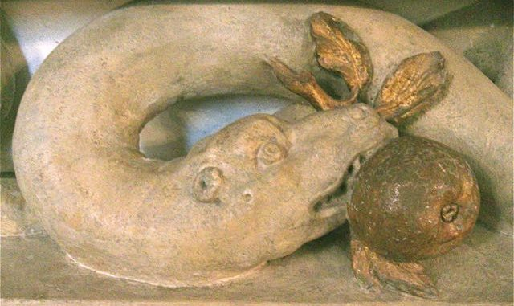

{fig-align="center"}

*Le critiche al determinismo meccanicista. Kleist: il peccato originale della razionalità. Schiller: la tensione morale all'ideale. Kant: il tutto e le parti. Goethe: la veste vivente della divinità. Hegel: reciprocità di mezzo e fine. Boutroux: il contingentismo. Einstein: caso e probabilità. Heisenberg: osservare la potenzialità. Husserl: la recettività. Montale e l'improbabilità del mondo: "Fine dell'infanzia". Simmel: il paesaggio. Obliquità fra linguaggio e cose. Bergson: la memoria ascensionale. Mallarmé: il percorso orfico. Disgregazione del cosmo. Baader e la caduta di Lucifero. "Male di vivere" e responsabilità. L'universo e la toilette. "Marezzo", "Incontro" e le basse sfere. La negazione come impulso etico. Critica a Gentile. "Non chiederci la parola".*

## 1. Le nature della modernità

Una natura strutturata secondo il modello della macchina, le cui leggi deterministiche di causa ed effetto possano permetterne manipolazione e sfruttamento da parte dell'uomo, si accompagna alla divisione tra spirito e materia nell'immagine del mondo costituita dalla scienza moderna. La coscienza di questa lacerazione si sviluppa nel pensiero e nella scrittura secondo diverse modalità.

Nel *Il teatro delle marionette* (1810) di Kleist la perfezione estetica del movimento meccanico di una marionetta e la serena spontaneità animale di un orso indicano la presenza della grazia più pura e naturale, perduta con la consapevolezza razionale rappresentata dal ballerino-schermitore. In tale figura dell'uomo moderno, il centro di gravità risulta spodestato dal *peccato originale* della razionalità, per ricostituirsi quindi in maniera solipsistica nel chiuso della riflessione e del sentimento, senza rapporto alcuno con le forze della natura. Nel mondo meccanico che ossessiona Kleist, la riconquista dell'innocenza rappresenta *«l'ultimo capitolo della storia del mondo»* e segna il ritorno nell'Eden *«dalla parte opposta»*, dopo aver percorso tutte le strade e mangiato di nuovo il frutto dell'albero della conoscenza.[^1]

[^1]: Kleist, 1986: 3-14.

La consapevolezza della frattura tra spirito e materia che si maturata nella storia della modernità trova un altro episodio in Schiller, che così ci avvisa: «*Perciò il sentimento con cui noi ci sentiamo portati verso la natura è così intimamente affine al sentimento con cui rimpiangiamo la perduta età dell'infanzia e dell'innocenza infantile. La nostra infanzia è la sola natura intatta, che ancora incontriamo nell'umanitàcoltivata*».[^2] La Natura è un'idea della ragione, non attingibile per l'esperienza, perduta così come lo è età dell'innocenza per l'uomo adulto. L'infanzia rappresenta l'espressione più diretta dello stato di natura, concepita come semplice *determinabilità,* rispetto alla quale la determinazione adulta ne è compimento ma gli è inferiore. La natura trova forma nel rapporto di unità delle forme istintive della classicità greca, ed è irreversibilmente infranta da riflessione intellettuale e razionalità strumentale; può essere rintracciabile, non più come esperienza ma come idea, nella *tensione morale* all'ideale della poesia moderna, la cui varietà dei generi rappresenta il tentativo, privo di esiti certi, di ricreare la natura internamente allo spazio ideale della riflessione: di riconquistare la natura attraverso la cultura.[^3]

[^2]: Schiller, 1993: 45.

[^3]: Schiller, cit. 24-7; 44-7.

Le premesse teoretiche di questa sensibilità sono poste da Kant, il quale con *Natura* indica la totalità dei fenomeni, necessitati secondo rapporti causali, conosciuti attraverso giudizi determinanti: la conoscenza è formulata dalle scienze fisiche-matematiche, dove la cosa-in-sé indica una realtà diversa da quella percepita e rappresentata. Tuttavia, laddove non è conoscibile a priori la legge scientifica, dove non è dato l'universale a cui ricondurre il particolare, nel giudizio si verifica una *contingenza* (*Zufällingkeit*). La facoltà del giudicare non opera come strumento di sensi e intelletto attraverso la produzione di concetti empirici, ma *artisticamente*, secondo un'universale e indeterminata finalità capace di renderne possibile l'esperienza, che la natura persegue nella varietà delle proprie forme.[^4]

[^4]: Kant, 1987: 258 (§ 70); 279 (§ 77), 416, *passim.*

Assume così rilevanza il rapporto organico tra tutto e parti, irriducibile al meccanicismo determinista. La filosofia del romanticismo lo sviluppa, assieme a motivi panteistici del Rinascimento italiano e di Spinoza e al *ritorno alla natura* suggerito da Rousseau, in una speculazione che con Fichte espone il limite estremo della soggettività e con Schelling l'estensione illimitata della natura. Una posizione particolare è rappresentata da Goethe che, portando a integrazione teoria poetica e pratica scientifica, vede nella Natura la «*veste vivente della divinità»*, e formula una teoria scientifica basata sull'osservazione di ogni dettaglio nella sua integrazione in un *tutto armonico*, mosso in una continua *produzione* di forme, dove l'esperienza rappresenta la mediazione tra soggetto e oggetto.[^5]

[^5]: Goethe, 1962: 27, *passim.*

Per Hegel lo splendore della natura è in un selvaggio isolamento, il quale deve essere superato. La *filosofia dell'identità* ruota attorno all'accordo tra io e mondo, che hanno comunanza del principio nella mediazione tra l'essere sé e l'essere altro;[^6] nel percorso razionale del reale la natura irrompe improvvisa nella Logica e nella «*serena calma della conoscenza semplicemente pensante*»[^7] come l'«*idea nella forma dell'essere altro*»,[^8] negazione dialettica dell'idea a se stessa, gioco accidentale di forme da cui è assente la libertà. Le antinomie che riguardano la Natura sono *necessità*, determinazione dal di fuori, e *contingenza*, assenza di determinazioni concettuali della sua forma; in essa il concetto si svolge attraverso la morte e il vivente, nei momenti della meccanica, della fisica e dell'organica. Nella natura organica non domina lo sviluppo ma l'*interazione*, la reciprocità di mezzo e fine, e procede per gradi secondo un'idea immanente. La natura si arresta nel suo essere contraddizione in sé irrisolvibile, ripetizione imperfetta ed esteriore dell'ordine razionale del concetto, determinazione di sé a se stesso. Scopo finale e realizzazione oggettiva della Natura è quindi la piena libertà dello Spirito.

[^6]: Lowith, 1988: 25.

[^7]: Hegel, 1984: 22.

[^8]: Hegel, 1987: 192 (§ 247), sgg.

Per quanto il pensiero cerchi diverse vie d'uscita, il determinismo meccanicista estende il proprio dominio. Con l'evoluzionismo il metodo dell'osservazione empirica e il modello della predittività matematica riguardano l'intero mondo umano. La filosofia muove una articolata serie di posizioni per contestare la priorità della applicazioni tecnico-pratiche con cui la scienza concepisce e agisce il suo rapporto con la natura. La contrapposizione tra Natura e Spirito si incrina, preludendo ad una nuova rivoluzione scientifica.

Il *contingentismo* di Boutroux rappresenta il retroterra di questi cambiamenti di paradigma. La conoscenza della realtà è sottratta all'epistemologia delle scienze positive, fondata sul principio d'identità e sul rapporto determinista di causalità, lasciando spazio al continuo e spontaneo prodursi nella natura di un *impulso spirituale creatore*, già affermato da Leibniz. Le leggi scientifiche, la cui importanza è in proporzione inversa al grado di complessità, rappresentano la *cristallizzazione* della spontaneità della natura.[^9] La sistematica delle scienze, perfezionata da Comte, è interpretata quale convenzionale, gli ordini di fenomeni superiori sono eterogenei e irriducibili a quelli inferiori, all'interno di ogni sfera del reale si manifestano fenomeni determinati da leggi proprie a sfere superiori. Come aveva già supposto Aristotele, sussiste una contingenza che comporta *variazioni qualitative* e un *ordine teleologico*, escludendo il caso e relativizzando la necessità.[^10]

[^9]: Boutroux, 1925: 142-3.

[^10]: Boutroux, 1877: XIX-XXI.

Il modello matematico quantitativo è un soltanto un modo con cui l'intelletto rappresenta i fenomeni e le loro relazioni, e dal meccanicismo non possono derivare la vita e il pensiero. Il *possibile* ha così primato rispetto al reale, le cose possono essere e non essere, risolvendosi nell'atto volontario di coscienza che le coordina ad un fine e nello *sforzo etico* verso un principio spirituale di perfezione e bellezza. La *Raison* procede dall'universale, attraversa un'intuizione non puramente intellettuale che cerca di autocomprendersi ponendo reciproca completezza con il concetto, quindi si approssima di continuo ad accogliere *«le forme particolari e i dettagli delle cose»*.[^11] Boutroux destituisce la dialettica hegeliana dell'universale concreto per salvare la spontaneità del *dato individuale contingente* all'interno di uno sviluppo razionale capace di mantenere ordine e armonia e riunire la ragione al sentimento, la trascendenza all'immanenza, la Natura allo Spirito.[^12]

[^11]: Boutroux, 1908: 215.

[^12]: Boutroux, 1919: 34.

Nella concreta pratica scientifica i cambiamenti sono ancora più decisi. Il concetto di natura si rende più complesso e viene a cadere un presupposto, tanto a priori quanto empirico, per cui debba essere definito l'oggetto di conoscenza, sperimentato soltanto attraverso *mezzi speculativi* di costruzione o postulazione teorica. Per Einstein caso e probabilità assumono significato scientifico esclusivamente nelle limitazioni epistemologiche della conoscenza finita in relazione con l'*oggetto totale* della conoscenza scientifica. Heisenberg considera il concetto di *potenzialità* come implicato nell'oggetto di conoscenza e nella relazione stabilita con osservazione ed esperimento. Le asserzioni statistico-probabilistiche della fisica quantistica escludono l'esistenza di un ordine naturale deterministico esistente indipendentemente da noi: «*Non ogni concetto o parola che si siano formati in passato attraverso l'azione reciproca fra il mondo e noi sono in realtà esattamente definiti rispetto al loro significato; vale a dire, noi non sappiamo fino a qual punto essi potranno aiutarci a farci trovare la nostra strada nel mondo.*»[^13]

[^13]: Heisemberg, 1994: 111.

L'estraniarsi delle scienze europee dal *mondo della vita* spinge Husserl a recuperare la libertà della natura nel ritorno alle *cose stesse*, colte come manifestarsi intuitivo originario della realtà nella coscienza, recuperando l'esperienza *antepredicativa* e sospendendo le transitorie credenze scientifiche e del senso comune.[^14] Per la fenomenologia logica, giudizio e discorso hanno genesi nell'esperienza diretta della pura percezione sensibile, la *recettività*, che emerge dallo sfondo della passività dell'io. Ogni atto di coscienza è intenzionale, esprime un tendere ad un proprio specifico oggetto. Quindi nell'*attenzione* l'oggetto sensibile è condizionato dalla modalità empirica del suo darsi e si manifesta indistintamente unitario, per essere così conservato senza essere posseduto con certezza. L'oggetto 'intenzionato' si differenzia successivamente nei momenti che lo costituiscono: la *contemplazione percettiva* è l'intuizione diretta dell'oggetto nel suo tutto, mentre ad un grado superiore la *sintesi esplicante* coglie progressivamente le diverse proprietà e determinazioni dell'oggetto. La conservazione dell'oggetto è poi affidata alla formazione delle espressioni linguistiche.[^15] La fenomenologia di Husserl rappresenta il tentativo di restituire alle cose un'articolazione antepredicativa indissolubilmente legata alla sfera logica e al pensiero una funzione costitutiva verso il mondo.

[^14]: Husserl, 1987: 88, *passim.*

[^15]: Husserl, 1960: 80, *passim.*

Laddove il mondo appare coerente eppure instabile, la natura onnipresente quanto estranea, l'esperienza delle cose sembra diventare particolarmente vicina alla poesia. Particolare importanza assume così la riflessione poetica di Montale, scientifica con mezzi impliciti, pensante pur prescindendo dalla filosofia. La poesia di Montale rifiuta i sistemi chiusi e totalizzanti dell'idealismo;[^16] guarda con sospetto la "messa fra parentesi" fenomenologica e l'irenismo morale comportato dalla sua applicazione all'esistenza;[^17] intrattiene un rapporto con il contingentismo non per assumerne il pensiero ma per crescere nel proprio.[^18] La poesia si pone consapevolmente quale strumento di conoscenza, seguendo «*un certo senso di 'improbabilità'... sulla costituzione fisica del mondo*»,[^19] accogliendo la rivelazione offerta dalla particolarità delle cose colte attraverso *«trasalimenti di luce*»,[^20] nel *lampo* con cui un oggetto si condensa in un nome fornito dal patrimonio linguistico del tempo ma sospeso nella memoria.

[^16]: Montale, 1976: 150-1 (*Difficile distinguere l'arte dalla poesia*).

[^17]: Montale, 1966: 193 (*Variazioni IX*).

[^18]: Montale, 1976: 565 (*Intenzioni*).

[^19]: Dego, 1985: 23.

[^20]: Getto, 1966: 130-1.

L'unità della natura è stata infranta dal dubbio e dalla razionalità, e dove la scienza testimonia la costitutiva incertezza del reale, la poesia ne ricostruisce a tratti il senso perduto. Emblematica di tale condizione è *Fine dell'infanzia,* pubblicata nel settembre 1924 sulla rivista genovese «Le Opere ed i Giorni» (a. III, n. 9) assieme a *Meriggio* (*Gloria nel disteso mezzogiorno* sugli *Ossi)* e *Vasca* (che subirà dalla prima edizione Einaudi del 1942 la decurtazione della strofa finale); in una lettera ad Angelo Barile, spedita da Monterosso il 12 agosto 1924, il poeta afferma: «*in essa ho spiato - sulla scorta della memoria - il primo sorgere del dubbio nelle anime infantili: né so con qual risultato.*»[^21]

[^21]: Montale, 1980: 874.

## 2. Paesaggi d'infanzia

Il mare e la terra che si contrappongono nel paesaggio ligure vanno rispettivamente a costituire le prime due strofe di *Fine dell'infanzia*. Il v. 1 si apre con «*Rombando*»: il suono del mare in movimento rivela un carattere misterioso e minaccioso, teso a scavare in uno spazio delimitato. Il mare, «*fioccoso*» (v. 4) e ingannevole, «*pulsante*» (v. 3) e vitale, contiene gli elementi della violenza e della purificazione. Vi affluisce un torrente: già premono le scorie. Il doppio senario del v. 3 («*un mare pulsante, sbarrato da solchi*») e il decasillabo al v. 9 («*e tronchi d'alberi alla deriva*») esemplificano il movimento di oscillazione del verso da una filigrana endecasillabica ad una scansione deca-dodecasillabica, su cui Montale costruisce la propria cadenza più tipica.[^22] Gli imperfetti in rima, chiusa da «*deriva*» (v. 9), indicano il prolungarsi di un tempo, di un fatto passato. Il mare diverrà, nel cammino poetico degli *Ossi di seppia*, protagonista, mito, immagine, metafora, delirio, assumendo quindi le caratteristiche, in *Mediterraneo*, di una legge morale.

[^22]: Giannangeli, 1987: 24-25; Brodskij, 1987: 44.

Nella seconda strofa, la «*conca ospitale/ della spiaggia*» (v. 10-11), le sue rare case, la vegetazione di «*scarse capellature/ di tamerici pallide*» (v. 14-15), indicano i segni del rifugio. Il sostantivo raro è immerso in una trama fonica di allitterazioni e assonanze, organizzata esaltando i singoli suoni attraverso il decentramento del significato. Se l'armonia naturale non è rotta dall'indagine razionale, queste stesse forme costituiscono *pentagramma* dell'anima: indecisione e inquietudine presagiscono l'incipiente violenza delle forze del male metafisico e del non essere che verranno ad imporsi. Le immagini di violenza e informità, escluse dal centro vitale degli interessi del fanciullo, sono minacciosamente avvertite come presenti nelle cose.[^23] Chiarificatori per la condizione di dubbio e scissione sono l'«*Orrore di visioni*» (v. 17), le «*apparenze malfide*» (V. 20), la «*musica dell'anima inquieta/ che non si decide*» (v. 21-22), dati del paesaggio che ne rivelano la *tonalità affettiva*: come dice Simmel, la sua *Stimmung*.

[^23]: Seroni, 1966: 79.

Per Simmel sentimento del paesaggio nasce contestualmente alla lacerazione dal sentimento unitario della natura universale e all'introdursi della dicotomia tra soggetto conoscente e oggetto conosciuto, che diviene struttura formale indipendente. La parte va a costituire un tutto a sé: sorge così il senso moderno dell'*individualità*. La *Stimmung* è così il momento che traduce la frammentarietà degli elementi in un universale che raccoglie tutti i particolari, né esistente al di fuori di questi, né da essi composto; l'attività formatrice soggettiva del sentimento realizza l'oggettività del paesaggio, che non si riduce né ai suoi particolari, né al paesaggio come genere. Dove la distanza che separa dal paesaggio garantisce un'obiettività di là dalle inclinazioni soggettive, il vedere e l'immagine della creazione artistica non intrattengono rapporto causale: sono proprio lo stesso atto, ed è solo il successivo intervento della riflessione intellettuale a provocarne la separazione.[^24]

[^24]: Simmel, 1985: 71-83.

Montale coglie tale azione formatrice del sentimento nel momento stesso in cui è spezzata dalla riflessione e dall'indagine razionale, dal sapere strumentale e argomentativo. Il «*dualismo fra lirica e commento, fra poesia e preparazione alla poesia*»[^25] si risolve nella costatazione di una irriducibile *alterità* tra natura e soggetto, fra i quali si stabilisce una rapporto di *correlazione*, organizzato in elementi stilistici e cognitivi. Il linguaggio è immagine allegorica del reale, il simbolo è colto nell'esperienza quotidiana del paesaggio;[^26] il significato è suscitato dal riferimento della *parola* al suono, dettato dalla sua invenzione progrediente[^27] e spezzato da *enjambement* che lo prolungano oltre il verso e specificano la parola.[^28]

[^25]: Montale, 1976: 566.

[^26]: Campailla, 1984: 153.

[^27]: Bonfiglioli, 1963: 48.

[^28]: Musumeci, 1972: *passim.*

Montale esprime una crisi teoretica *costitutiva*, stabilendo un rapporto *obliquo* tra il linguaggio e la cosa, rifiutandone quel legame con il nome che era stato affermato dal descrittivismo naturalista. Se la sua poesia nasce proprio dal distacco dell'identità immediata della natura, non si verifica la pretesa di cristallizzare la realtà nelle forme culturali: piuttosto, la poesia è quanto può condurre l'esperienza umana a confronto con una natura concepita nelle sue forme ancipiti: tanto come madre e *matrice*, quanto quale estraneità, *alterità radicale*. Il linguaggio segna il distacco dalla natura e la sua possibile riconquista.

## 3. La memoria delle cose

A formulare la lettura di *Fine dell'infanzia* più aderente alle istanze contingentiste è Piero Bigongiari, che riporta all'accuratezza di un quadro fiammingo lo sfondo visibile della terza strofa, stagliatasi su una condizione di trasparenza. Dove in *In limine* era il vento a liberarare le memorie, in *Ripenso il tuo sorriso* l'acqua limpida a favorire l'emersione degli archetipi del subconscio e ad insinuarli nella «*memoria grigia*», l'uomo «*ritto su un muletto*» (v. 33), si stampa «*nell'azzurro lavato*» (v. 34). La realtà si risolve nel ricordo, inciso su una lastra dall'infanzia, di cui si tenta il recupero retrospettivo, *à rebours*, recupero impossibile della realtà primaria conservata nella memoria.[^29]

[^29]: Bigongiari, 1970: 16.

Nella quarta strofa il flusso dei ricordi, che si svolge all'imperfetto, si interrompe momentaneamente nel presente indicativo. La realtà dell'uomo maturo è lo schermo della «*memoria stancata*» (v. 38), che come «*l'azzurro lavato*» (v. 34) cerca di mantenere l'esistente, «*stampato/ per sempre*» (v. 34-35). Il ricordo emerge dal basso e *riempie* la memoria, come atto intenzionale riempito dalla cosa a cui tende.

Dove la finalità dell'atto di coscienza è riconosciuta dalla fenomenologia, il contingentismo considera gli oggetti come scopo della rappresentazione. La filosofia è quindi la *materia* stessa di questa poesia, e ad un livello anche più essenziale si può rintracciare Bergson e la concezione di una materia come contrazione della memoria,[^30] che può entrare in questione anche a prescindere dalla lettura diretta da parte di Montale dell'impervio *Materie e memorie.* La memoria che raccoglie e conserva la totalità dei vissuti al fondo della coscienza è una *corrente* di energia che scorre in senso inverso rispetto alla *caduta* della materia, costituita in corpi dalle attività pratiche della percezione. La memoria ispira e guida la percezione, nella quale si articola e diviene attuale, è una durata colma di presenze, assoluto presente di metamorfosi, cresce di ricordi e contrae i propri momenti.[^31] Questa coscienza in Montale si avvia alla sua prova *abissale*, nella quale l'impronta lasciata dal ricordo resta vuota.

[^30]: Pipa, 1978: 841.

[^31]: Bergson, 1983: 171; 379; *passim.*

La «*memoria stancata*» (v. 38) accosta distanze e lontananze di ere, riportando ai motivi della lontananza leopardiana ne *Le ricordanze*: '*varcare un giorno/ Io mi pensava, arcani mondi, arcana/ Felicità fingendo*' (v. 22-24). In Montale i «*crinali prossimi*» (v. 36), superati appena dall'infante, la memoria adulta «*varcarli non osa*» (v. 37), «*memoria*» che conosce e che «*stancata*» (v. 38) rievoca. L'esitazione dissolve le finzioni della lontananza romantica in lontananza di natura botanica e geologica, attraversando «*fossi*», «*garbugli di spini*», «*radure*» (v. 39-41) per arrivare a «*recessi madidi di muffe/ d'ombre coperte e di silenzi*» (v. 43-44). Intervengono nel testo montaliano parole ad alto contenuto informativo,[^32] riconoscibili, sulla scorta del canone stoico, come *segni rammemorativi*, che rendono evidenti cose non manifeste, tentando di organizzare il mondo attraverso tracce precise e lontane come *stratificazioni geologiche.*[^33]

[^32]: Rosiello 1965: 141.

[^33]: Bigongiari, cit.: 17.

La «*meraviglia*» (v. 45) può tornare dove «*ogni umano impulso/ è seppellito*» in un *eterno presente* di «*aura millenaria*». (v. 46-8). Qui è il confine del mondo, gentilmente accarezzato da «*qualche bava d'aria*» (v. 49), immedesimato con la sua straordinarietà. Il gioco delle forme si adatta, similmente all'*età ferina* di Vico, alle fantasie infantili; il soggetto non si contrappone ad un mondo, la cui essenza, secondo le parole di Böhme, è *la pena e il tormento*. Prima dalla scoperta dell'inganno il tempo è sospeso, ed è postulata una possibile unità di natura e spirito, sussiste un richiamo immediato di parole e cose.[^34]\

[^34]: Seroni, cit.: 64.

*Ogni attimo bruciava* \[55\]\
*negl'istanti futuri senza tracce*\
*Vivere era ventura troppo nuova*\
*ora per ora, e ne batteva il cuore.*\
*Norma non v'era,*\
*solco fisso, confronto,* \[60\]\
*a scevrare gioia da tristezza.*\
*Ma riaddotti dai viottoli*\
*alla casa sul mare, al chiuso asilo*\
*della nostra stupita fanciullezza,*\
*rapido rispondeva* \[65\]\
*a ogni moto dell'anima un consenso*\
*esterno, si vestivano di nomi*\
*le cose, il nostro mondo aveva un centro.*\
\
La situazione evocata nella quinta strofa ricorda il percorso orfico del poeta nel cammino della terra, risalendo dalla sua infanzia ad un tempo precedente la sua nascita, un argomento di cui Mallarmé aveva trattato in una lettera del 18 febbraio 1869 indirizzata a Henry Cazalis. L'armonia della condizione infantile è da Montale ricondotta alla *topografia* di un mondo. Al centro chiuso del mondo è il fanciullo, circondato dal gioco esterno della natura, i cui confini consentiti all'esplorazione innocente si disperdono in «*apparenze malfide»* (v. 20), che segnano il limite dell'*«eta illusa»* (v. 79). La riviera ligure, esplorata con partecipazione, narrata nei suoi dettagli, è resa simile pur percependone appena l'*alterità* e, nell'accidentalità sregolata e sfrenata del gioco delle forme, lascia intendere la *minaccia*. L'innocenza è anche prigione e deriva, «*chiuso asilo*» (v. 63) e «*groviglio d'alighe*» (v. 8), il consenso con il mondo procede dalla «*conca ospitale/ della spiaggia*» (v. 10-11), dalla «*casa sul mare*» (v. 63), e si risolve in illusione prospettica, lasciando presagire solitudine e incomunicabilità. La fine dell'infanzia è l'uscita dalla terra orfica.

Alla sesta strofa barlumi di preconoscenza si manifestano nell'«*età verginale*» (v. 69): dove le nuvole non rappresentano i segni di qualcos'altro, «*cifre o sigle*» (v. 70), ma «*belle sorelle*» (v. 71) in viaggio. Ma se la natura sembra affine, nella sua grandezza sembra che essa sia «*d'altra linfa nutrita*» (v. 73), irrimediabilmente diversa dalla debolezza e dalla confusione dei vissuti umani: la stessa «*età illusa*» (v. 79) è sospettosa verso il suo «*asilo*» (v. 75) e verso quel «*portento*» (v. 76) a cui tende nel suo «*estatico affissare*» (v. 76). La condizione è costitutivamente precaria, l'«*età verginale*» (v. 69) esclude la conoscenza del male ma non la sua esistenza e, forse, la nasconde nella sublime ammirazione per la varietà e la forza della natura. L'essere prima del male è un momento sospeso sul male, i segni della morte sono soltanto cancellati dallo sguardo, e dall'esplorazione del limitato.[^35]

[^35]: Seroni, cit.: 75-6.

## 4. Parole e catastrofi

*L'inganno ci fu palese.* \[90\]\
*Pesanti nubi sul torbato mare*\
*che ci bolliva in faccia, tosto apparvero.*\
*Era in aria l'attesa*\
*di un procelloso evento.*\
*\[...\]*\
*Giungeva anche per noi l'ora che indaga.*\
*La fanciullezza era morta in un giro a tondo* \[99\]

La distruttività del tempo entra alla settima strofa e la perdita della certezza assume «*l'aspetto/ dubbioso dei tremanti tamarischi*» (v. 82-3). E dove «*un malchiuso portone*» (*I limoni,* v. 43) garantiva l'accesso al *miracolo*, qui in un'alba una «*porta/ stridula sulla ghiaia del giardino*» (v. 88-89) palesa l'*inganno*. Le nuvole non sono più «*sorelle*» in viaggio, ma pesano gonfie di pioggia sul «*torbato mare*» (v. 91). L'inquietudine prevale definitivamente sulla sicurezza, s'impone l'indagine intellettuale, consapevole della\* separazione\* definitiva dell'uomo adulto sulla natura. Il mondo dell'infanzia è solo un «*segnato cortile*» (v. 97), «*l'ora che indaga*» (v. 98) sancisce come illusoria la reciproca appartenenza di cosmo e fanciullo. Come se la condizione di innocenza non fosse mai esistita e il recupero fosse semplicemente impossibile.

L'allontanamento dal centro e dalla terra orfica è il ricoscimento della forza *centrifuga* e dispersiva del vivere, «*procelloso evento*» (v. 94), miracolo che si converte in *catastrofe.* La poetica centripeta della corrosione di natura e vita, invece, si allontano in termini quantitativi, allargandosi a cerchio.[^36] Improvvisamente «*in un giro a tondo*» (v. 99), muore l'innocenza.

[^36]: Bigongiari, cit.: 17.

Scompare dallo spazio poetico il *centro*, propulsore delle realtà arcaiche, a favore di *contingenza* e *deiezione*, categorie del moderno. In accordo con Schiller, dov'è perduta l'armonia ideale, l'idillio sfuma nell'elegia.[^37] La poesia è tensione in un centro qualitativo sentito nel suo disgregarsi, nel paesaggio come nel discorso. Il «*segnato cortile*» di *Fine dell'infanzia* si colloca dietro il «*muro d'orto*» riarso e sofferente di *Meriggiare*; oltre c'è il «*rivo strozzato*», «*l'incartocciarsi della foglia*», il «*cavallo stramazzato*» di *Spesso il male di vivere*. Nei momenti in cui la poesia di Montale assume con maggiore nettezza i caratteri di *elegia di privazione*, la natura viene testimoniata come impotenza e solitudine di forze in conflitto, che ristagnano in avversione e si esauriscono in inerzia. *Sul muro grafito* riconosce la potenza creatrice esclusivamente nelle forme della sua disgregazione: anzi, *questa disgregazione è il mondo stesso*:

[^37]: Schiller, cit.: 68-9; 92-3.

\
*Chi si ricorda più del fuoco ch'arse* \[5\]*\
impetuoso\
nelle vene del mondo; - in un riposo\
freddo le sue forme, opache, sono sparse.*\
\
In queste forme fredde, opache e sparse sembra smarrita l'idea di cosmo quale intima e feconda unione di potenze generatrici. Corruzione, sterilità ed estraneità sono nel nucleo del rapporto vitale, seguendo un dramma antico e ricorrente.

Tale dramma, cosmologico e gnoseologico, è ripercorsa dal teologo tedesco Baader, attento lettore del mistico Jacob Böhme, che segnala come nel mondo della scienza meccanicistica venga a cadere il momento *passivo* dell'autocoscienza, principio originario a cui tendono le forze di attrazione e repulsione. Nella formulazione di Newton e in quella di Schelling, queste forze fondamentali, con diverse modalità, prima si cercano per negarsi, poi si incontrano per subirsi e tormentarsi reciprocamente, infine si neutralizzano.

La cosmogonia sessuale di Baader le concepisce in modo diverso, rivelando il processo di *desacralizzazione* che accompagna la storia umana. Nella *prima natura*, quella che precede la scienza, la forza che si espande e quella che contiene si accompagnano in un *descensus-ascensus* reciproco; il principio della forma è nella produzione offerta della potenzialità di tutte le forme possibili. Questo spazio aperto, privo di punti e durate, è un *grembo* infinitamente desideroso di essere fecondato, una femminilità abissale. L'integrarsi dell'originario principio femminile ricettivo con il principio maschile attivo arresta la caduta della creazione provocata dal peccato di Lucifero, fornendo così un sostegno al cosmo, che si materializza come *terra* in un sostrato, una sostanza.

La natura costretta e sfruttata della modernità e dalla scienza è accompagnata dalla rimozione di questa preistoria della coscienza. Il maschile e il femminile si contrappongono come ognuno fine a se stesso, interviene nel principio maschile un'arroganza che scambia il contenimento per limite e lo rifiuta, mentre nel principio femminile una brama di riempirsi del proprio stesso desiderio va a instaurare un *terreno*, un fondamento instabile e ambiguo. Tale degenerazione soffoca la *Divina matrice*, l'attrazione positiva cambia di segno costituendo una *Matrice maligna*, la quale divora il volere puro delle forze generatrici rendendole sterili, statiche, senza vita.

In questo tipo di universo, l'attrazione e la repulsione delle forze centrifughe e quelle centripete rappresentano la dispersione della potenza del principio maschile e il ristagno della ricettività di quello femminile, ormai incapaci di intervenire sulla degenerazione del cosmo devastato, soltanto provvisoriamente organizzato secondo inerzia e gravitazione. Il suo annuncio nella rottura dell'androginia naturale compiuta da Adamo con l'imporre il nome agli animali. Il percorso letto da Baader nel secondo capitolo della *Genesi* è quello per cui Parola e Verbo da produzione dell'*essenza* della cosa si corrompono nell'umano segno convenzionale con cui sancire l'appartenenza dell'oggetto. L'*integrazione androginica* della natura subisce una caduta e degradandosi in *connubio adulterino*, secondo un processo che si manifesta nella storia dell'umanità e nella scienza come nell'etica.[^38]

[^38]: Baader, 1983: 21-5; 449, *passim.*

In questo mondo disgregato l'indagine umana, consapevole della lontananza dei nomi dalle cose, non arriva a stabilire un rapporto di certezza diretta con il reale e porta alla scoperta del 'male di vivere' e alla sua *esplorazione* nello spazio metaforico della poesia. La *fatale* volontà di conoscere e possedere dell'uomo adulto rievoca in forma linguistica i giochi vitali della fantasia, preludendo al suo irrompere come vento sul mare. Sempre il vento su *in limine*, sulla soglia degli *Ossi*, «*riconduce l'ondata della vita*» e risveglia «*l'eterno grembo*» e con sé la possibilità della «*maglia rotta nella rete*», e così infrangere «*l'inganno del mondo come rappresentazione*».[^39] Il vento prenderà un nome e sarà scirocco, tramontana, maestrale, zefiro, libeccio, e poi *Bufera*. Gli ultimi versi di *Fine dell'infanzia*:\
*\
Certo guardammo muti nell'attesa\
del minuto violento;\
poi nella finta calma* \[105\]*\
sopra l'acque scavate\
dové mettersi un vento.*\
\
La catastrofe finale è preposta da uno stato iniziale che esclude l'immobilità ed è un grumo di sensazioni spesso in contrasto. L'unica realtà è il movimento e la contraddizione: è realtà nel momento dell'infanzia, priva di regole o schemi, ricerca di unità nella diversità, di stabilità nel movimento. L'uomo ascolta i richiami della perduta anima del mondo non attraverso l'esercizio di una volontà superiore, come il veggente di Rimbaud, ma in risposta a semplici e immediate responsabilità.[^40]

[^39]: Montale, 1976: 565 (*Intenzioni-Intervista immaginaria*).

[^40]: Seroni, cit.: 78-80.

## 5 . Universi imperfetti

Ma in quale mondo si compie questa ricerca? Qual è il sistema cosmografico nel quale si inscrive la vicenda umana?

«*Io non credo che ci sia un divenire, un progresso. L'Universo è un quantitativo di forze finite e senza aumento: suscettibile solo di un livellamento secondo la teoria dei liquidi nei vasi comunicanti. Supponga tanti tubi incomunicanti pieni di liquido; stabiliamo la comunicazione: si fa subito un livello unico, ma più basso. Cioè: ogni guadagno presuppone una perdita, ogni acquisto presuppone un dolore. Il tempo non gioca quindi a nostro favore...È possibile una diversa ripartizione del Tutto; ma il Tutto resta quello che è.*»[^41]

[^41]: Manacorda, 1969: 7 (estratto da Montale, *Il mestiere di poeta*, a cura di F. Camon).

Questa totalità finita ha poi forma *sferica*, ma è più simile al serbatoio di una toilette o ad una chiavica che ad un mondo perfetto:

«*Si dice che la terra sia avvolta da una sfera di psichismo in continuo aumento di spessore. La terra sarebbe quindi una sfera dentro un'altra sfera: la sfera interna sarebbe materiale, l'altra psichica, in attesa di diventare del tutto anìmica e pronta al decollo per più spirabile aria. (...) Una simile crosta o gelatina di panpsichismo soltanto in rarissimi casi è attraversata dal brivido creatore della scienza o dell'arte o del pensiero filosofico. Nell'insieme essa sembra piuttosto uno spurgo, un'eruzione, il cròscio che manda il pull di un WC universale.*»[^42]

[^42]: Montale, 1966: 308-9 (*La fonduta psichica).*

L'uomo non vive sulla superficie di un mondo rivolto all'infinito, ma piuttosto in un universo curvo e chiuso, «*sotto la cappa di una sfera che tutto rinchiude e su cui sarebbero fissati stelle, pianeti ed i genere tutti i corpi celesti ruotanti intorno alla terra.*»[^43]

[^43]: Avalle, 1970: 103.

Nei versi di *Marezzo* il «*cristallo dell'acque*» (v. 2), la «*lente*» (v. 16) da cui vedere i fondali, ha prossimità semantica con la «*spera ardente*» (v. 44), percepita in un cielo vetroso, assimilando fuoco e acqua in un cerchio immerso in una regione oscura. L'azione fusiva della sfera solare dà forma all'essere, impegnato nel volo dal fondo dei tempi al primo pensiero, oltre l'alone scarlatto del cielo. In un fitto scambio di attributi e di ossimori come «*diluvio/ del sole*» (v. 27-8), «*falò senza fuoco*» (v. 33), «*male calmo e lucente*» (v. 42), «*stupore tinto di rimorso*» (v. 52), le cose perdono i tratti consueti, si sente «*la stortura nel corso/ delle stelle*» (v. 50-51). Ma la «*memoria dilavata*» (v. 54) non giunge a rigenerarsi, «i*mprovvise gravano/ sui cardini le cose che oscillavano*» (v. 58-59): l'impronta archetipica non agisce se dalla sfera alta, primo pensiero, non avviene una azione uguale e contraria.[^44]

[^44]: Bigongiari, cit.: 16.

*Incontro* descrive uno smarrimento a cui il momentaneo ricordo di *Arletta* (titolo originario della poesia e nome della destinataria, la stessa di *in limine*) restituisce la dignità di andare a *fondo*, rompendo con le circostanze, «senza viltà» (v. 54). In una sfera, «*volta infranta \[...\] discesa/ quasi a specchio delle vetrine,/ in una \[...\] aura*» (v. 22-23-24) dove vivono i «*sargassi umani*» (v. 25-26), alla deriva di una piccola foce, la vita si lega alle forme vegetali, a movimenti meccanici, assumendo fattezze grottesche, non umane:[^45]\

[^45]: Bonora, 1982: 184-5.

*La foce è allato del torrente, sterile,* \[10\]\
*d'acque, vivo di pietre e di calcine;*\
*ma più foce di umani atti consunti,*\
*d'impallidite vite tramontanti*\
*oltre il confine*\
*che a cerchio ci rinchiude: visi emunti,* \[15\]\
*mani scarne, cavalli in fila, ruote*\
*stridule: vite no: vegetazioni*\
*dell'altro mare che sovrasta il flutto.*\
\
Simile cosmo, diviso in sfere di *diverso ordine*, non risponde al modello ellittico della scienza moderna, ma è in qualche modo affine alla concezione geostatica e qualitativa aristotelica. Tale modello era stato parzialmente recuperato alla scienza da Boutroux nel configurarsi delle diverse discipline scientifiche in una pluralità di mondi distinti e coesistenti ordinati gerarchicamente, i quali pongono diverse modalità conoscitive e diversi rapporti di adattamento reciproci fra spirito e natura.[^46] Così, l'originale rapporto di Montale con il contingentismo si sviluppa in questo caso per contrasto, mantenendo spiccata modernità: le sfere del reale perdono il movimento gerarchico ed ascensionale garantito dalla teleologia, e assume carattere prioritaro quel vincolo *meccanico* e *quantitativo* che Boutroux intendeva confutare, sia come causalità che come legge di conservazione.[^47]

[^46]: Boutroux, 1877: XIX; 1913: 132.

[^47]: Boutroux, 1913: 27-8; 59-60.

Il mondo è un sistema chiuso di quantità finite soggette ad esaurimento, dove il cerchio dei mutamenti esprime una corruzione qualitativa, una *degenerazione*, attestata dall'abbassamento della condizione umana a quella vegetativa, dal crollo incipiente costitutivo ad un mondo incerto, dal livellamento dei vasi comunicanti e dal degrado della sfera «*panpsichica*», insieme dei sistemi di pensiero e della produzione artistica e culturale, interagente con il livello storico e sociale.[^48]

[^48]: Montale, 1966: 222-3 (*L'albero dell'arte*).

L'uomo è testimone inevitabile e senza scampo di una vicenda di caso e necessità, della ricerca di un punto nel caos, nella quale si sconta l'incertezza cosmica del tempo e l'angoscia temporale del cosmo. Il caso non è solo il simbolo della contingenza nel mondo empirico, ma è la sua realtà: sovvertendo ogni intenzione di Boutroux, il mondo è intellegibile a frammenti, esattamente come «*membra separate di un organismo disgregato*».[^49] Come annota Arshi Pipa, «*gli uomini sono giocattoli nelle mani di una forza cosmica crudele e cieca, indifferente alla sorte dell'uomo; il meglio che possiamo sperare è di eludere questa forza nemica, il che talvolta accade per caso*».[^50]

[^49]: Boutroux, 1913: 140.

[^50]: Pipa, cit.: 840.

La cosmografia montaliana vive nel paradossale incrocio di tutti i mondi possibili e nel loro confluire nell'unico mondo a disposizione, non necessariamente il migliore. Questo universo poetico, che sconta la transizione alla relatività e all'indeterminismo, avrebbe comunque dato maggiore credito alle fantasie di Copernico e a Keplero piuttosto che alle interpretazioni matematiche di Galilei e Newton, trovando lezioso l'ottimismo teleologico di Aristotele con la sua rigorosa catena di finalità e divertente l'*universo intermedio* di Tycho Brahe con i pianeti ruotanti attorno al sole e il sole attorno alla terra.

Montale è fortemente consapevole della rottura con la natura ma ne percepisce i ritmi; orienta la sua esistenza su un piano etico e umano eppure l'Universo indifferente continua a suggestionarlo; sa che la materia è convertibile in luce ma rimane all'interno del vincolo della causalità, al contempo non sfugge al substrato archetipico dei quattro elementi alchemici e della sfera, conosce lo sradicamento e riconosce la continuità delle forme naturali, subisce l'entropia e desidera annullare il tempo. Cosciente dell'incertezza costitutiva del reale, crede nei *miracoli*, un po' meno nei suoi simili, pochissimo in se stesso e nelle sue «*deboli forze*»[^51] e, soprattutto, osserva attentamente i tempi in cui vive:

[^51]: Montale, 1976: 569 (*Intenzioni*).

«*Stiamo assistendo a dei mutamenti di cui non sappiamo renderci ragione. Un nuovo mondo sta sorgendo, come un grosso dinasauro che cambia pelle, ed io passivamente assisto alla sua nascita.*»[^52]

[^52]: Nascimbeni, 1986: 10.

In anni di crisi storica e ideale, dove si accavallano guerra, involuzione politica, sbandamento del movimento socialista, ristagno della cultura cattolica, retorica della forza e dell'ottimismo anche da parte delle avanguardie intellettuali, Montale, piuttosto che aderire alle proposte di un conformistico nuovo centro del mondo dello storicismo idealistico, ricorre alla risorsa della *negazione quale impulso della forza etica*.

Il rapporto tra Gentile e Montale aiuta a comprendere le tensioni di un'epoca. Per il filosofo l'unica realtà è nel pensiero che si pone a sé direttamente nell'atto del pensare, immanenza dello spirito a se stesso. I residui di trascendenza mantenuti dall'hegelismo con l'Idea e la Natura sono eliminati, così come è assimilata la lezione marxiana per cui la natura appare nell'esclusivo orizzonte della storia umana, dove storia e natura si mediano nel lavoro e nella produzione. In tale quadro, il contingentismo viene confutato in quanto risolve la distanza tra poter essere e essere in empirismo del molteplice, nel quale ogni essere è assolutamente identico a se stesso e la libertà presupposta rimane illusoria.[^53] Il *pensiero in atto* è quindi infinito, libero e creativo di sé*,* l'attività dell'Io puro risolve l'opposizione tra immanenza e trascendenza e produce la stessa natura, la cui indipendenza dal pensiero esclusivamente nelle astratte formulazioni *oggettive* delle scienze empiriche, necessarie alla vita dello spirito in quanto il soggetto si afferma come tale oggettivandosi e risolvendo a sé ogni oggettività.

[^53]: Gentile, 1920: 148-9; 1925: 5-10.

Dal canto suo, Montale riconduce le pretese di oggettività delle scienze in una puntuale poetica degli oggetti e trova la necessità proprio nella contingenza e nel miracolo. La teoria dell'atto puro è da lui definita come «*imbrigliatissima*» e «*decifrata a malapena*» e, seppur «*apprezzata con grossa soddisfazione*», viene rifiutata laddove l'opposizione tra immanenza e trascendenza non fuoriesce da un «*ottimismo di parata*» nel quale l'Io puro è nulla più di «*uno stato d'animo della perenne mediazione dei due termini*».[^54] Per il poeta le contraddizioni della *condizione umana* e i tentativi di trascenderla vanno vissuti senza vigliaccherie e compiacimenti, sulla pelle della propria particolarissima apertura all'universale:[^55] idealismo, positivismo, naturalismo, risultano tutte come soluzioni inadeguate.

[^54]: Montale, 1976: 565 (*Intenzioni*).

[^55]: Montale, 1976: 581-2 (*Dialogo sulla poesia*).

Dove le teorie tradiscono l'esperienza, la *negazione* corrisponde ad una constatazione: «*non chiederci la parola*» è la riconosciuta incapacità dell'io poetico di trovare un nesso unitario di conoscenza di fronte ad un universo di singoli accadimenti irripetibili, perseverando tuttavia nel «*tentativo di fermare l'effimero, rendere non fenomenico il fenomeno, il tentativo di rendere comunicante l'io individuale che non è tale per definizione*».[^56] Se la crisi della razionalità è vissuta nel rifiuto del compromesso proposto da sistemi totalizzanti e totalitari, l'indagine che ha inaugurato l'età della ragione preclude il ritorno ad una condizione di innocenza, e lascia soltanto in attesa di una nuova alba.

[^56]: Montale, 1966: 54 (*La solitudine dell'artista*).

## Riferimenti

D'arco Silvio AVALLE, 1970: *Tre saggi su Montale*, Einaudi, Torino.

Franz von BAADER, 1982: *Filosofia erotica* (1808- 1834), a cura di L. Procesi Xella, Rusconi, Milano.

Henri BERGSON, 1983: *Materia e memoria* (1896), a cura di A. Passina, Città armoniosa, R. Emilia.

Ettore BONORA, 1982: *La poesia di Montale. Ossi di seppia*, Liviana, Padova.

Pietro BONFIGLIOLI, 1963: *Dante Pascoli Montale*, in «Nuovi studi Pascoliani», p. 35-62, Centro di Cultura dell'Alto Adige - Società di studi Romagnoli, Bolzano - Cesena.

Emilè BOUTROUX, 1913: *De la contingence des lois de la nature* (1875), Alcan, Paris.

Emilè BOUTROUX, 1877: *Avant-propost du traducteur*, in *La philosophie des Grecs*, par E. ZELLER, Hachette, Paris.

Emilè BOUTROUX, 1925: *De l'idée de loi naturelle dans la science et la  philosophie contemporaine* (1895), Vrin, Paris.

Emilè BOUTROUX, 1919: *La natura e lo spirito* (1905), a cura di G. Papini, Carrabba, Lanciano.

Emilè BOUTROUX, 1908: *Le sens de la philosophie de Hegel*, in *Évolutionnisme et platonisme*, par R. BERTHELOT, Alcan, Paris.

Iosif BRODSKIJ, 1987: *Il canto del pendolo*, pp. 41-58, Adelphi, Milano.

Sergio CAMPAILLA, 1984: *Il muro di Montale*, «Nuova Antologia» n. 2151, lug.-set. '84, pp. 150-165.

Giuliano DEGO, 1985: *Il bulldog di legno. Intervista ad Eugenio Montale*, Editori Riuniti, Roma.

Giovanni GENTILE, 1920: *Teoria dello Spirito come atto puro* (1916), Laterza, Bari.

Giovanni GENTILE, 1925: *Prefazione* a E. BOUTROUX, *Sull'idea di legge naturale nella scienza e nella filosofia contemporanea* (1895), Vallecchi, Firenze.

Giovanni GETTO, 1966: *Antico omaggio a Montale*, in *Omaggio a Montale*, pp. 124-135, a cura di S. Ramat, Mondadori, Milano.

Ottaviano GIANNANGELI, 1987: *Metrica e significato in d'Annunzio e Montale*, Solfanelli, Pescara.

Johann W. GOETHE, 1962: *Scritti scientifici* (1887- 1919), in *Opere*, vol. V, Sansoni, Firenze.

George W. F. HEGEL, 1984: *Scienza della logica* (1812- 16), Laterza, Bari.

George W. HEGEL, 1987: *Enciclopedia delle scienze filosofiche in compendio* (1817- 30), antologia a cura di A. Negri, Laterza, Bari.

Werner HEISEMBERG, 1994: *Fisica e filosofia,* (1958), Il Saggiatore, Milano.

Edmond HUSSERL, 1960: *Esperienza e giudizio* (1939), trad. it. F. Costa, Paravia, Torino.

Edmond HUSSERL, 1987: *La crisi delle scienze europee e la fenomenologia trascendentale* (1936-1954), a cura di E. Paci, Sansoni, Firenze.

Immanuel KANT, 1987: *Critica del Giudizio* (1790-99), a cura di A. Gargiulo, Bari, Laterza.

Heinrich von KLEIST, 1986: *Sul teatro delle marionette- Aneddoti - Saggi* (1797-1810), trad. E. Pocar, Guanda, Parma.

Karl LÖWITH, 1988: *Da Hegel a Nietzsche* (1941), trad. it. G. Colli, Einaudi, Torino.

Giuliano MANACORDA, 1969: *Montale*, «Il Castoro», La Nuova Italia, Firenze.

Eugenio MONTALE, 1966: *Auto da fé -- Cronache in due tempi*, Il Saggiatore, Milano.

Eugenio MONTALE, 1976: *Sulla poesia*, a cura di C. Zampa, Mondadori, Milano.

Eugenio MONTALE, 1980: *L'opera in versi*, edizione critica a cura di R. Bettarini e G. Contini, Einaudi, Milano.

Antonino MUSUMECI, 1972: *Silenzi Montaliani: note sull'enjambement nella poesia di Montale*, «Forum Italicum», vol. VI, n. 4, dicembre '72, pp. 497-515.

Giulio NASCIMBENI, 1986: *Montale. Biografia di un poeta* (1969), Longanesi, Milano.

Arshi PIPA, 1978: *Montale et le déterminisme physique*, in «Letteratura e scienza nella storia della cultura italiana. Atti del Congresso dell'Associazione internazionale per gli studi di lingua e letteratura italiana», Manfredi, Palermo, pp. 839-846.

Friedrich SCHILLER, 1993: *Sulla poesia ingenua e sentimentale* (1796), TEA, Milano.

Adriano SERONI, 1966: *Alle origini della poesia montaliana: "Fine dell'infanzia"*, in «Letteratura» a. XXX, n. 77-81, gennaio-giugno '66, pp. 6-20.

George SIMMEL, 1985: *Il volto ed il ritratto* (1895- 1915), a cura di L. Perucchio, Il Mulino, Bologna.

•

*Prima pubblicazione: «Philosophema» a.1 n.0, giugno 2001; riveduto e ampliato. Estratto dalla tesi di laurea in Storia della Filosofia "Boutroux e Montale: Poesia e contingenza", Università di Tor Vergata 1997, assegnataria lo stesso anno del Premio Internazionale Eugenio Montale.*

*Fotografia: Claudio Comandini, "Sin?" - Berlino 2006.*
