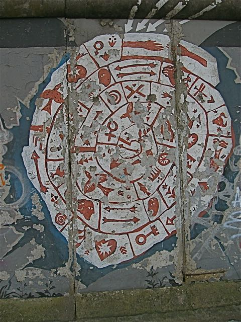

{fig-align="center"}

*Profezie e moda. Ricezione della cultura Maya e contenuti cristiani. Messianismo e apostolato. Apocalittica. Trailer e apocastasi. Astronomia e astrologia. Tre calendari. New age e profitto. Jenkins e l'ellittica. Le critiche di Aveni. Joseph e la sinossi delle teorie apocalittiche: attività solare, collisioni, allineamenti e altro. La fine del tempo in Kant. McKenna: i frattali e l'IChing. Kurzwail: la singolarità assoluta. Una nota di Aldo Tagliapietra. Grant Morrison: The Invisibles. Agamben: San Paolo e il tempo della fine.*

## 1. Rivelazioni

Se l'occidente ha da tempo fatto tacere i propri profeti,[^1] l'apocalisse sembra attualmente una moda piuttosto diffusa, come tutte le mode anche un po' fraintesa e volgarizzata. Per la felicità di chi ama prevedere catastrofi, che comunque non mancano mai di accadere per conto loro, la data del 2012 offre diversi motivi di interesse, che anche in anni successivi non smetteranno di affascinare. Al riguardo, è significativo un tweet del giornalista musicale Red Ronnie, che ci informa come lo sciame sismico avvenuto in Emilia realizzi alcune implicazioni previste dai Maya rispetto l'allineamento del 20 maggio di Pleiadi, Sole e Terra, concomitante all'eclissi di Sole allo zenit della piramide di Chichén Itza, eretta in onore del dio Kukulkan. Tale divinità, strettamente legata a Venere, la stella del mattino pronta per allinearsi con il Sole nelle prime ore del 6 giugno, è nota anche come Serpente Piumato, portatore di serenità. Di costui, partito un giorno del 999 d.C., se ne attende il ritorno proprio per il Solstizio del 2012, in coincidenza con una serie di eventi astronomici e cronologici.

[^1]: Giorgio Agamben, *Creazione e salvezza*, in *Nudità*, Nottetempo, Roma 2009, p. 7.

La scadenza del 2012 sarebbe quindi estranea alle preoccupazioni dei monoteismi, alle loro escatologie e ai loro millenarismi, e così ad eventi quali Giudizio finale e Resurrezione dei morti che coronano la storia di tre religioni. Tuttavia, come dimostra anche la versione di Red Ronnie, che non rappresenta affatto una voce isolata, la sua ricezione presenta diverse analogie con i contenuti cristiani; al contempo, ne costituiscono una variante cattolica i cataclismi e i terremoti previsti per un imprecisato maggio da Padre Pio, riportati dallo studioso di profezie Renzo Baschera.

Questa strana esigenza di prevedere catastrofi potrebbe anche essere determinata da una confusione piuttosto diffusa tra apocalisse e messianismo, categorie religiose ben presenti anche nelle nostre società secolarizzate. Tale confusione è evidente laddove seguiamo un'annotazione sul concetto di profezia del filosofo Giorgio Agamben: chi crede nel 2012, e nella catastrofe che annuncia, tende ad esprimere la convergenza di creazione e salvezza,[^2] ma piuttosto di pronunciarsi per «*una parola che non gli appartiene in proprio*», parla in qualità di «*mandatario di uno scopo determinato*». Tuttavia ciò dovrebbe pertenere ad un apostolo che ha un Messia di riferimento,[^3] ed è quindi opportuno fare un po' di chiarezza: del resto, apocalisse non significa casino.

[^2]: *Ibid,* p. 9.

[^3]: Giorgio Agamben, *Il tempo che resta*, Bollati Boringhieri, Torino 2000, pp. 61-63.

L'apocalittica antica si sviluppò come genere distinto da quello propriamente profetico nell'ambiente cosmopolita degli Ebrei di lingua greca, si trasmise e fu sviluppata dal Cristianesimo e poi dall'Islam; letteralmente significa «*togliere il nascosto*», assumendo il senso di "*rivelazione*" compiuta da Dio nei confronti di un profeta da lui scelto. In un senso più generale, oggi indica la «*fine dei tempi*», con una particolare predilezione nel congiungere l'influenza di elementi di carattere misterioso con una organizzazione del tempo di tipo sapienziale.

In tale quadro, elementi come l'*apocatastasi* (letteralmente reintegrazione), sembrano svolgere il senso di riepilogo complessivo delle vicende umane nelle modalità del *trailer*: cioè come un'immagine dal montaggio asincronico e provvista di un commento di tipo emotivo, che riassume il senso di eventi più complessi in un "*tempo concentrato*", ben afferrabile dalla comprensione. Una sequenza di trailer è alla base anche di una "*pop-spiritualità*" che pretende di mettere insieme senza troppi complimenti i testi che si dicono sacri con le centurie di Nostradamus, le catastrofi ambientali con la paura nucleare, non dimenticando le suggestioni di culture altre adeguatamente liofilizzate per adeguarla alla faciloneria del gusto imperante.

I Maya, pur se piuttosto evoluti nelle scienze matematiche e astronomiche, non misuravano gli anni alla nostra maniera, e concepivano il tempo per epoche, scandite secondo un sistema nel quale si integravano *tre calendari*, funzionali anche a regolare i riti tributati alle divinità, le quali erano mantenute in vita proprio attraverso i culti loro tributati. Mentre ad essersi estinta è proprio la civiltà Maya, le sue usanze sono ancora diffuse in molte tribù mesoamericane, e i suoi misteri, pur se privati dello specifico contesto culturale, incantano i figli dei colonizzatori, che ormai colonizzano se stessi in nome di un immaginario deterritorializzato, in grado di giustificare ogni cosa indipendentemente dalla capacità di rispondere ai propri perché.

Cerchiamo innanzitutto di comprendere come erano organizzati questi calendari provvisti della peculiare capacità di esporre la *fine dei tempi*. Il *primo calendario* era di tipo religioso, composto da 260 giorni (*Tzolk'in*) suddivisi in *trecene* (periodi di tredici giorni). Il *secondo calendario* era a base solare e comprendeva 365 giorni (*Haab*), divisi in 18 periodi di 20 giorni ognuno. Questi due cicli si combinavano per dare luogo ad ulteriori cicli di 18.980 giorni (circa 52 anni), per un totale di 52 cicli. Il *terzo calendario*, chiamato *Lungo Computo*, calcolava il tempo trascorso dalla data che secondo la mitologia maya segnava la creazione del mondo (per la correlazione di Goodman-Martinez-Thompson, la più accreditata dagli storici mesoamericani, corrisponderebbe al l'11 agosto 3114 a.C del calendario gregoriano). Tale calendario era progressivo e suddivideva il tempo in cicli non ricorrenti (*B'ak'tun*) della durata di 144.000 giorni, a loro volta ripartiti su base vintigesimale in 4 ulteriori sottocicli.

Pertanto, aggiornando tale datazione fino ai nostri giorni, risulta che il 20 dicembre 2012 debba terminare il 13º ciclo, laddove il giorno successivo farà seguito l'inizio del 14º ciclo: la fine del più grande ciclo del calendario maya (che comprende 1.872.000 giorni, cioè 512.537 anni) corrisponde sostanzialmente ad un *capodanno in scala cosmica*. Nella notazione originale del calendario, che considera l'intersezione dei vari cicli, il passaggio è da 12.19.19.17.19 a 13.0.0.0.0. La data del 2012 è ricavata da un'iscrizione rinvenuta sul Monumento 6 del sito archeologico di Tortuguero, collegata ad un evento riguardante la divinità della guerra e della creazione *Bolon Yokte*. Tuttavia, esistono anche altre tavolette, che riportano date di molto successive a questa.

In definitiva, laddove nei termini tradizionali non esiste un'effettiva previsione, né in termini logico-matematici né antropologici-culturali, gli elementi che definiscono tale "*profezia*" sono stati privilegiati dai lettori moderni proprio perché ne permettono una formulazione esattamente cronologica. Per farla breve: questo si chiama *barare*. Come suggerisce Anthony Aveni, professore di astronomia e antropologia a Colgate, dove l'attenzione temporale per i Maya era rivolta al passato ed era connessa con la legittimazione della propria civiltà, e dove la data rappresentava l'occasione di grandi celebrazioni per festeggiare l'ingresso in un nuovo periodo, come del resto è tipico di ogni capodanno, la "*fine*" che viene a prospettarsi oggi è nei termini concreti simile a quella segnata da un contachilometri quando passa da una serie di "9" ad una serie di "0".[^4]

[^4]: Anthony Aveni, *The End of Time: The Maya Mystery of 2012*, University Press of Colorado, 2009.

Tali dati possono aiutarci a comprendere il significato effettivo della scadenza nel suo contesto di formulazione, che non ha nulla di profetico, mentre sull'attualissima capacità della new age di connettere ignoranza, paura e commercio può illuminarci Sandra Noble, direttore esecutivo della Foundation for the Advancement of Mesoamerican Studies a di Crystal River, Florida, laddove afferma: «*rendere il 21 dicembre 2012 un Giorno del Giudizio, o un momento di cambiamento cosmico, è una completa invenzione e una possibilità per molte persone di fare profitto.*»[^5]

[^5]: [Jeffrey MacDonald, *Does Maya calendar predict 2012 apocalypse?*, «Usa Today» 27.3.2007.](http://www.usatoday.com/tech/science/2007-03-27-maya-2012_n.htm)

Proprio per tale motivo, in una società biecamente basata sul profitto la data non può non concentrare significati e messaggi, indipendentemente dalla pur diffusa possibilità di vendere *kit di salvataggio*, costruire rifugi, e altre paranoie ben strutturate. La scadenza del 2012 esemplifica così tanto la diffusa stanchezza verso un mondo di cui siamo stati artefici e che ha tradito le sue promesse, quanto la prevalente tendenza di delegare le prospettive di rinnovamento ad interventi sovrannaturali. E soprattutto, evita di chiamare in causa e così irritare la nostra decisamente troppo fragile responsabilità sociale e personale.

Numerosi i "*profeti apostolici*" contemporanei, che si sentono chiamati a trasmettere aspettative di tipo gnostico e rivelative su questa desideratissima apocalisse: Tra costoro, Geoff Stray, Jose Argüellas, e soprattutto John Major Jenkins, il quale sviluppa in modo originale le indicazioni astronomiche, arrivando ad affidare la *«rivoluzione»* di un modello sociale incapace di equità ai moti *«rivoluzionari»* delle stelle. Infatti, Jenkins verso la metà degli anni '80 propone che nella previsione possa assumere significato l'allineamento del Sole all'Eclittica, la proiezione in cielo del piano dell'orbita terrestre sulla quale si posizionano le costellazioni raccolte nello Zodiaco.

Questo dice il cielo: la *precessione degli equinozi* muta la visibilità delle costellazioni di circa un grado ogni 72 anni, ogni 2.160 anni cambia la costellazione che corrisponde al sorgere del Sole nell'Equinozio di primavera, mentre un intero ciclo dura 26.000 anni. E quindi, sulla linea del Sole, il passaggio dalla costellazione dei Pesci a quella dell'Acquario si sta svolgendo attorno ad un periodo di 36 anni, e si è realizzato con ampia approssimazione già nel Solstizio d'inverno 1998. L'Equinozio di primavera e il Solstizio d'inverno, che rappresentano i momenti di massima e minima vicinanza del Sole alla Terra, da sempre hanno un significato sacrale trasmessosi anche alla cristianità, che infatti vi ha collocato rispettivamente e con sufficiente approssimazione la Pasqua e il Natale.

Dove il Cristianesimo ha da tempo smarrito una cosmologia, elaborando i propri contenuti perlopiù sulla base della vicenda umana, i Maya, pur misurando i tempi della terra con quelli del cielo, probabilmente non erano a conoscenza della precessione degli equinozi. Tuttavia, Jenkins suggerisce che il loro calendario possa basarsi sull'osservazione della Fenditura del Cigno, attraversata dall'eclittica: infatti, la nebulosa termina all'altezza dell'equatore celeste, punto del cielo capace di assumere un significato cosmologico. Quindi, l'allineamento tra il Sole e tale punto del giorno del Solstizio d'inverno del 2012 assumerebbe il significato di compimento temporale e di chiusura di un ciclo: tuttavia, avviene all'interno di un periodo di 36 anni, e la convergenza di maggiore precisione è quella già avvenuta nel 1998.

L'occorrenza era poi già nota ai tempi del Flower Power come ingresso nell'Età dell'Acquario: di fronte alla sua effettiva configurazione iniziale, che abbiamo avuto modo di ammirare in questi brutali *anni zero*, possiamo lecitamente sospettare che nelle promesse degli hippies e di quella stagione culturale così entusiasta, di cui anche Red Ronnie è parte, ci sia stata, come minimo, qualche svista. Oppure, bisognerà aspettare ancora un po': in tal caso, le prospettive si pongono decisamente al di fuori della *"vulgata*", rientrando in millenarismi più tradizionali, di cui è opportuno trattare in altra sede.

Tutto è molto incerto. Instabile la terra. Abbiamo forse bisogno di credere in qualcosa, ma non dobbiamo per forza prenderci in giro da soli. E nel fare le dovute distinzioni, ci soccorre un'altra volta Aveni, dove segnala che i riferimenti testuali di queste concezioni sono piuttosto vaghi, che le cognizioni astronomiche e quelle Maya non hanno tra loro una corrispondenza automatica, che alla base delle diverse culture c'è una visione del cosmo molto diversa.[^6] Tali argomenti già li avremmo dovuti conoscere eppure, nel contemporaneo intorpidimento, sembrano autentiche rivelazioni.

[^6]: Anthony Aveni, *The End of the Time*, cit.

## 2. Rivoluzioni

Una sinossi di tutte le teorie apocalittiche del 2012 è formulata da Lawrence E. Joseph, che ai calcoli Maya aggiunge altri argomenti, di provenienza piuttosto eterogenea, collegati in un sistema complessivo.

L'incremento dell'attività solare. L'inversione di polarità dei campi magnetici terrestri. L'impatto con una cometa o con un asteroide. L'allineamento dei pianeti del sistema solare. La congiunzione del piano di rotazione del Sole e di quello della Via Lattea. L'imperversare di uragani e tempeste come Kathrina, Irene, e le altre. L'attività del vulcano Yellowstone, che circa ogni 700.000 anni erutta in maniera catastrofica e distruttiva, e la diffusa instabilità tellurica. La presenza di una nube di energia interstellare attorno al Sole, osservata dai geofisici russi. Le filosofie orientali, che supportano l'idea di un esaurimento dei cicli temporali, come nel Kaly Yuga induista. I millenarismi monoteistici in agitazione, come nel caso del raffinato concetto della *Parusia* che gli evangelisti americani riducono ad un ritorno di Cristo piuttosto materiale e anche decisamente televisivo.[^7]

[^7]: Lawrence E. Joseph, *Apocalypse 2012: A Scientific Investigation into Civilization's End*, Morgan Road Books/Random House, New York 2007, p. 29.

Alcune di tali questioni appartengono all'imponderabile, altre sono puramente teoriche, molte sono impossibili da osservare o prevedere. Tutte sembrano riguardare però la nostra esperienza, che ormai solo a stento sa contenersi nel qui e ora. Sicuramente, mentre il 2012 sfuma nelle date successive, altre profezie saranno vaticinate, così come la soluzione dei problemi che ci assillano continuerà ad essere demandata ad eventi sui quali non abbiamo nessun controllo. Piaccia o meno, questa piccola previsione laica ha margini di realizzazione maggiori di ogni altra.

Mentre aspettiamo che gli eventi prendano direttamente la parola, confrontiamoci con argomenti che possano permettere di confutare le prime cinque questioni elencate, il cui ampio spettro di fenomeni si riferisce ad un ambito astronomico i cui dati sono piuttosto controllabili e che dipendono in particolar modo da calcoli e astrazioni. Nel trascurare "*divulgatori*" più pedestri e televisivi, riprenderemo nella chiusura del testo le questioni più propriamente teologiche e religiose.

L'incremento eccezionale di attività solare avrebbe tra le sue conseguenze disastrose, oltre al riscaldamento climatico e al picco di anidride carbonica, anche la deriva dei continenti: se sarebbe opportuno inquadrare i cambiamenti riguardanti il clima in periodi di secoli, l'incremento del caldo ha delle concause che rispondono pure ad un'antropizzazione del pianeta spesso scellerata; inoltre, picchi recenti dell'attività solare quali quelli del 2009 sono stati piuttosto bassi, mentre sarà inferiore ai precedenti il picco previsto per il 2013. Invece, gli spostamenti delle placche continentali determinano terremoti come quello in corso in Emilia, ma la loro continuità dipende da durate centenarie. Ad ogni modo, i tempi che emergono da questa analisi sono già sufficientemente sfasati rispetto alla scadenza prefissata.[^8]

[^8]: [Aezio, *2012: Sei miti sulla fine del mondo sfatati*, «Il Fatto Quotidiano», 7.11.2009.](http://ilfattostorico.com/2009/11/07/2012-sei-miti-sulla-fine-del-mondo-sfatati/)

L'inversione dei poli magnetici terrestri, teoria diffusa inizialmente da Gregg Baden, secondo i geofisici si sarebbe verificata due volte da quando esiste l'uomo, e per alcuni avrebbe smesso di prodursi circa 780.000 anni fa, lasciando del tutto inalterata la direzione di rotazione del nostro pianeta. Nella remota ipotesi di un suo nuovo verificarsi, Glitzmaier e Roberts affermano che non comporti affatto l'azzeramento magnetico, ma esclusivamente una sua modifica, con un assottigliamento dello strato d'ozono e una minore schermatura contro il vento solare e le radiazioni ultraviolette. E così, mentre il pianeta non smetterà di girare, tutte queste cose continueranno ad accadere.[^9]

[^9]: [*2012 e inversione dei poli*, «Scienza e conoscenza» 18.02.2009.](http://www.scienzaeconoscenza.it/articolo/inversione-poli-magnetici-2012.php)

L'ipotesi della collisione di un asteroide, con una dinamica simile a quella alla base dell'estinzione dei dinosauri, coinvolge il pianeta X, o Niribu (Nibiru), la cui esistenza è provata dalle riprese di Hubble del 2002 della stella V838 Monocerotis. Tuttavia, la collisione sarebbe dovuta accadere già nel 2003, e lo scienziato della NASA David Morrison ci rivela che non c'è nulla a minacciarci: laddove ci fosse, sarebbe ben visibile ad occhio nudo. Insomma, è soltanto la nostra *cosmofobia* a spaventarci.[^10]

[^10]: [David Morrison, *Doomsday 2012, the planet Niribu, and Cosmophobia*, «Astronomy Beat» n. 32, 21.09.2009](http://www.astrosociety.org/2012/ab2009-32.pdf).

Invece, l'allineamento dei pianeti si è già verificato nel 1982, e sembrerebbe che siamo sopravvissuti. A suo tempo, ne scrisse Peter Kolosimo, singolare divulgatore che riusciva ad associare fantarcheologia e tendenze filosovietiche; l'allineamento "*galattico*", che interessa molto il già citato Jenkins, comporta che Sole e piano equatoriale della Via Lattea si allineino nel giorno del Solstizio di dicembre. I calcoli astronomici indicano che si sarebbe verificato già nel 1998, nell'ambito di un movimento lentissimo dalla durata di circa 36 anni. Tale allineamento è quindi puramente convenzionale: il piano equatoriale galattico esiste solo dal punto di vista soggettivo della Terra, e non è una demarcazione reale, ma un costrutto immaginario (come latitudini e longitudini): in realtà, il Sole transita fisicamente per il piano di tale equatore ogni 32 milioni di anni circa, secondo un moto estremamente lento per cui parlare di bruschi allineamenti verificatisi in date precise risulta del tutto insensato.[^11]

[^11]: [*2012, il futuro secondo la Nasa*](http://www.segnidalcielomag.altervista.org/nasa_2012.html); [Paolo Attivissimo, *La fine del mondo è vicina*, «Scienza e Paranormale» n. 81, a. XVII, sett/ott 2008](http://www.cicap.org/new/articolo.php?id=273764).

Lawrence E. Joseph, il cui libro si pregia di essere *«un'osservazione scientifica»*, non sembra tuttavia spaventato, ed è anzi piuttosto coinvolto dall'idea che la nostra sopravvivenza sia collegata ad un cambiamento radicale nello stato delle cose e nel nostro orientamento esistenziale.[^12] Sull'esigenza di tali cambiamenti credo sia difficile non concordare. Alcuni dati che il suo studio offre sono interessanti, molte sue preoccupazioni sembrano sincere, ed è anche insolitamente critico verso le idee espresse dal contesto culturale al quale sembra appartenere, in special modo verso la mancanza di contestualizzazione antropologica delle teorie pseudo-maya proposte da Argüellas.

[^12]: Lawrence E. Joseph, *Apocalypse 2012*, cit., p. IX.

Tuttavia, la sua esigenza di creare una teoria generale dell'Apocalisse rende piuttosto pasticciate anche argomentazioni potenzialmente brillanti, mescolando esigenze effettive a semplificazioni riduttive. Dopo aver espresso la certezza che per quella data ci sarà un olocausto mondiale, affida le speranze alla preghiera nei confronti di una divinità femminile, che può essere Gaia, Maria, la Madre Terra. Sulla ridefinizione del femminile e della sua *«divinità»* sembrano convergere molte riflessioni, in modi diversi espresse, per fare soltanto due esempi, tanto dal pensatore apocalittico Alber Caraco, quanto dalla sciamana femminista Vicki Noble. Tuttavia, non è detto che, solo per il fatto di essere femminile, tale divinità debba essere necessariamente giusta: nel soprasensibile mica ci sono le quota rosa, e peraltro tutte le culture storiche hanno conosciuto forme femminili della divinità dal carattere puramente distruttivo.

Secondo Joseph, ad essere risparmiati dalle distruzioni che accompagnano il cambiamento può aiutare la *«scrittura»*: bisogna tuttavia vedere quale, laddove molte forme di "*scrittura*" oggi diffuse non sembrano avere nessuna caratteristica di raccoglimento ed elaborazione, in definitiva sono peggio delle chiacchiere. Ad ogni modo, scopriamo pure che più di ogni altra cosa ci potrebbero aiutare i simboli. Ed è proprio su questo punto che il sincretismo totale tocca il suo vertice massimo: infatti, si equivarrebbero la Croce, la Luna Crescente, la Stella di Davide, la bandiera americana e anche la bandiera bianca, insomma ogni appartenenza forte, senza escludere però la resa. Non sembra affatto un grande cambiamento e non si capisce proprio come questo possa permette di innalzare la consapevolezza personale e collettiva.

Ad avviso di Joseph il 2012 si appresta a risolvere il riscaldamento globale, il buco dell'ozono e gli altri cataclismi ecologici, compresi i SUV, che mi sembra piuttosto sensato detestare.

Inoltre, avranno termine anche forme di dominio che comprendono la colonizzazione dello spazio e non escludono il carcere di Guantanamo. A tutto questo, per Joseph, che forse crede con molto ottimismo soltanto in una forma assoluta di giustizia retributiva e in una cooperazione sociale anche più rigida di quella ipostatizzata dal comunismo, i Maya avevano già pensato, calcolando per far quadrare i conti una scadenza astronomica capace di far coincidere nell'universo l'inizio con la fine.[^13] Sarebbe comodo, ma non funziona.

[^13]: *Ibid*, pp. 224-229.

Infatti, secondo questi ragionamenti la *«fine del tempo»* potrebbe essere legittimata soltanto quale «*esito narrativo»* della storia del mondo: a metterci in guardia nei loro confronti è un Kant più che mai attuale. Tale immagine vuota di un tempo che si riproduce indefinitivamente e sfugge persino a se stesso è però decisamente *«contronatura»* e di impossibile concettualizzazione.[^14] Tuttavia, potremmo essere condotti ad una fine indipendentemente da qualsiasi inizio, laddove venga introdotta una discontinuità radicale.

[^14]: Immanuel Kant, *La fine di tutte le cose* (1794), a cura di A. Tagliapietra, Bollati Boringhieri, Torino 2006, p. 28, *passim*.

Tale divario tra causa ed effetto è esattamente quanto fa nascere la tentazione di cercare un *«significato»* più profondo, come ricorda Žižek proprio in pagine dedicate all'apocalisse nella new age: così, invece di pretendere il possesso dell'*«intuizione intellettuale»* (*Intellektuelle Anschauung*), cioè la capacità di generare immediatamente l'oggetto che si percepisce, da Kant esclusa agli umani, oppure di estendere nozioni quali la *«sincronicità»* dal campo della fisica quantistica e dai processi inconsci ad una sorta di regola generale degli eventi, potremmo piuttosto provare a ricordare che ci sono cose che sappiamo di sapere e cose che sappiamo di non sapere, incognite note e incognite ignote.[^15] Insomma: un'indagine approfondita su intuizione e sincronicità fuoriesce dalla faciloneria dell'illuminazione per tutti proposta dalle apocalissi da rotocalco. Eppure, d'altro canto, si può davvero pretendere che la cosidetta *razionalità* spieghi tutto?

[^15]: Slavoj Zizek, *Vivere alla fine dei tempi* (2010), Ponte alle Grazie-Salani, Milano 2011, pp. 480, 484.

Nel lasciare in sospeso tale questione, atteniamoci a questo: la realtà è *contingente*. Non è necessaria, ma nemmeno impossibile. Ed è proprio questo ad incoraggiare il nostro conoscere, dove tale conoscere è contingente a sua volta. Siamo di continuo sull'orlo del collasso di ogni cosa, tutto è destinato a sparire per sempre. Ciò ci costringe a salvare quanto possa davvero essere prezioso, e a fare del nostro meglio, tanto per se stessi quanto per gli altri.

## 3. Oracoli

Nel 2012 quale termine di un lungo ciclo temporale trova riscontro anche nei calcoli effettuati da Terence e Dennis McKenna nel 1975. Esponenti di uno sciamanesimo psichedelico e tecnologico, questi due fratelli, oltre a credere che il corpo secerna autonomamente allucinogeni, hanno realizzato il software *Timewave 2012*. Hanno poi effettuato calcoli che combinano gli esagrammi dell'*IChing* e i *frattali* di Mandelbrot, arrivando alla definizione di un'onda temporale della storia umana, il cui termine si pone proprio nel 2012. Se le profezie maya trovano un'indiretta conferma, il loro studio precede le attenzioni più morbose di cui queste sono state fatte oggetto e le considera solo subordinatamente. L'ostentazione di uno spericolato sincretismo segna la vicinanza di questo singolare studio alla new age, dalla quale però mantiene le distanze approfondendo questioni che invece la spiritualità affaristica della cosiddetta nuova era solitamente aborre.[^16]

[^16]: [Terence McKenna, *The invisibile landscape* (Peer Review), Ojai, California 14.04.1985](https://www.youtube.com/watch?v=YfpKSdBMzrY).

L'IChing è l'antico oracolo cinese, che si compone di 64 esagrammi, ognuno a sua volta composto di sei line, che possono essere intere, spezzate o mutevoli, ottenute nella forma più diffusa attraverso il semplice lancio di tre monetine e nelle forme più tradizionali attraverso un complesso rituale di scelta di asticelle. Il ruolo decisivo lo ha il *mutamento*, per cui gli esagrammi sono suscettibili di trasformazioni continue, portando cambiamenti di significato della posizione nel flusso temporale del consultante, responsabilizzando il suo comportamento.

L'IChing è forse il libro più antico del mondo e rappresenta specie di "*macchina*" per fare previsioni, e rispetto ad altre forme di divinazione ha il pregio di una maggiore chiarezza argomentativa e di una migliore adattabilità ai vissuti, permettendoci a noi stessi di porci domande sempre particolarmente appropriate. La sua capacità di connettere scelte individuali e situazione complessiva consente un'*«esplorazione dell'inconscio»* particolarmente apprezzata da Jung.[^17]

[^17]: Richard Wilhelm, *I Ching. Il libro dei Mutamenti*, 1948, prefazione di Carl G. Jung, Astrolabio-Ubaldini, Roma 1949.

Troviamo linee spezzate e irregolari pure alla base dei frattali di Mandelbrot, strutture matematiche basate sull'invarianza di scala che esprimono comportamenti variabili in spazi anche molto piccoli. Adeguati a forme reali non rappresentabili con le astrazioni della geometria euclidea, i frattali comportano calcoli preferibili rispetto alle operazioni di tipo deterministico, capaci di quantificare il grado di *«erraticità»* dei fenomeni, e quindi l'alea e il caos, attraverso modelli matematici rigorosi che si propongono la fondazione di una precisa disciplina scientifica. Applicabile a realtà come una costa frastaglia in relazione ad ogni suo piccolo golfo, i crateri della luna, i fiocchi di neve, la geometria frattalica si è estesa efficacemente ad ambiti quali la teoria fisica dei fenomeni critici e nell'organizzazione delle componenti informatiche.[^18]

[^18]: Benoît B. Mandelbrot, *Gli oggetti frattali* (1975-1984), Einaudi, Torino 1987, *passim*.

I fratelli McKenna si sono quindi impegnati a combinare il modello degli esagrammi dell'IChing con quello dei frattali. Hanno così realizzato una tabella relativa alle differenze tra un esagramma e il successivo, sviluppando un sistema di frattali in cui ogni livello è 64 volte maggiore di quello che lo precede. Tale modello frattale è stato utilizzato in una scala temporale. Le cime e le depressioni del modello riguardano il grado di connessione o di novità in qualsiasi periodo di tempo, che può coprire tanto un giorno, quanto millenni. Moltiplicando il numero di linee per il numero di esagrammi si ottiene 6 x 64 = 384: numero piuttosto vicino alla quantità di giorni in 13 mesi lunari (29,5306 x 13 = 383.8978), indicando che probabilmente in origine l'*I Ching* fosse anche un calendario,[^19] e suggerendo che il tempo non sia regolare, ma per l'appunto *frattalico*, e quindi aberrante e curioso.

[^19]: Dennis J. McKenna - Terence K. McKenna, *Invisible Landscape: Mind Hallucinogens and the I Ching* (I ed. 1975) Harper Collins, San Francisco 1993.

Tutte le operazioni sviluppate all'interno di questi parametri possono essere lette secondo un significato astronomico:

1 giorno x 64 x 6 = 384 giorni = 13 mesi lunari. 384 giorni x 64 = 67 anni, 104,25 giorni = 6 cicli solari minori (11,2 anni). 67 anni, 104,25 gg x 64 = 4.306 + anni = 2 ere zodiacali (precessioni). Anno 4306 x 6 = 25.836 anni = 1 precessione degli equinozi.

La migliore corrispondenza di questo modello con i principali periodi storici si ottiene fissando la fine della scala temporale il 22 dicembre 2012. I calcoli, grezzi ma non troppo imprecisi, hanno permesso la scoperta di un periodo di base di circa 67 anni.

2012 - 67 = 1945, un anno di grandi cambiamenti. 2012 meno 4300 anni (67 X 64) = 2300 a.C., l'inizio del tempo storico. 2012 meno 275000 anni (4300 X 64) = la comparsa dell'Homo Sapiens. 2012 meno 18 milioni di anni (275000 X 64) = età dei primi mammiferi. 2012 meno 1,3 miliardi di anni = l'inizio della vita sul nostro pianeta.

Il 2012 rappresenta l'unico punto in cui il livello di novità raggiunge il suo massimo: quanto accade in questo «*punto zero*» esprime una *singolarità assoluta*, che può essere intesa come l'interruzione del tempo e l'annullamento dell'entropia, l'esaurimento dell'inerzia e l'irruzione del cambiamento, oppure anche la creazione della macchina perfetta, in grado di autogenerarsi.[^20]

[^20]: Lawrence E. Joseph, *Apocalypse 2012,* cit., pp. 203-204; [*Fractal time and the I Ching, «Survive 2012».*](http://survive2012.com/index.php/fractal-ching.html)

«*La realizzazione di "zero" può essere immaginato come il punto di arrivo in due forme fondamentali. Una è lo scioglimento del cosmo in un vero e proprio disfacimento e la cessazione delle leggi naturali, una letterale Apocalisse. L'altra possibilità \[...\], il culmine di un processo umano, un processo tecnologico, che giunge a compimento nel manufatto perfetto: un auto-monade, esteriorizzato, condensato, e visibile in tre dimensioni, in termini alchemici, il sogno dell'unione di spirito e materia*».[^21]

[^21]: Dennis J. McKenna and Terence K. McKenna, *Invisible Landscape*, cit., p. 188.

Una sfilza innumerevole di filosofi potrebbe dire che tra spirito e materia è sempre attiva una sorta di inclusione reciproca e mai un esclusione radicale, e che la preoccupazione di questi sciamani dei nostri giorni è in definitiva piuttosto puerile. Proseguendo ad orientarci razionalmente, con Kant potremmo riportare l'ipotesi del *«punto zero»* del tempo all'esigenza tutta spettacolare di far *«cadere il sipario»* e trovare un senso alla nostra vicenda. Tuttavia, proprio mentre crediamo di ridicolizzare l'esigenza della fine, proprio il pensarla conduce al *«vuoto della riflessione»* di una *«durata senza* *misura»*. Se il pensare è *ri-piegamento*, il disfacimento non può certo aggiungere niente. Per Kant la fine del tempo risulta così un'immagine svuotata di se stessa e priva di tempo, un annientamento assoluto, un cortocircuito del pensiero che assale senza scampo proprio all'interno del più solido edificio della ragione umana. Ed è proprio questo a rendere l'etica umanamente indispensabile ed estremamente *inumana*.[^22] Ed è difficile trovare una pecca nel ragionamento di questo nostro contemporaneo del settecento.

[^22]: Andrea Tagliapietra, *Kant e l'idea della fine*, in *Il senso della fine*, «Agalma» n. 19, 04.2010, pp. 19-27.

L'ipotesi dell'*«auto-monade»* conduce invece verso altre forme di inumanità. Sembra prefigurata dal laboratory-robot denominato Adam, capace di svolgere esperimenti e verificare ipotesi autonomamente,[^23] ed è in sintonia con l'idea di Raymond Kurzwail di una *«singolarità assoluta»* che avrà inizio quando verranno alla luce *«Intelligenze Artificiali auto-miglioranti»*, programmi per computer senzienti, altamente intelligenti e in grado di ridisegnare sé stessi e anche di riprodursi per migliorare le proprie prestazioni. L'aspetto apocalittico delineato dal santone informatico americano è nell'impatto causato dall'enorme rapidità del progresso tecnologico, *esponenziale* e non lineare, il quale disarticolando la società umana e la vita di tutti i giorni comporterà un *«salto»* capace inevitabilmente di condurre alla fine la storia umana così come la conosciamo e al superamento della *«biologicità»*. Per Kurzweil, al posto degli umani normali entro il 2045 le forme dominanti di vita senziente sulla Terra diventeranno *«Intelligenze Artificiali Forti»* e gli umani migliorati ciberneticamente.[^24]

[^23]: [Adam (robot), «Wikipedia».](http://en.wikipedia.org/wiki/Adam_(robot))

[^24]: Raymond Kurzwail, *La singolarità è vicina* (2005), Apogeo, Milano 2008, *passim*.

Al riguardo, se devo dire, io passo molto tempo al computer a fare questo e quello, insomma a *smanettare* in vari modi: forse, tutto questo in qualche modo mi *migliora*, sicuramente mi *estende*; tuttavia, se non esistesse il computer troverei sicuramente altri canali. Per quanto sappia apprezzare i cambiamenti introdotti, decisivi e inarrestabili, ho ancora ricordo di quando era diverso e non mi sembrava poi tanto male. Ad ogni modo, non credo affatto che i "*miglioramenti*" siano automatici: anzi, mi sembra che le persone generalmente non siano all'altezza delle possibilità offerte dalle nuove tecnologie, al punto che le capacità di percezione ed elaborazione di ognuno possono anche ridursi: che il livello medio sia progressivamente costretto ad abbassarsi è poi evidente. Esistono siti che fanno inorridire nel mostrare quanto l'umanità abbia appreso, e quanta violenza sia stata prodotta dall'aver costretto gente analfabeta e ignorante a scrivere e a "*comunicare*": viene da bestemmiare proprio la cosiddeta democrazia, ma forse sono io ad essere ancora *imperfetto*. E quando mi aggiro nel cosiddetto *mondo estern*o, e vedo le persone appiccicate al cellulare a dire frescacce a voce alta a qualcuno che è altrove senza che nessuno sia né qui ne là, non mi sembra affatto di riscontrare un'evoluzione così vistosa. Forse però deve ancora passare questo benedetto 2012.

Piuttosto che continuare ad assecondare una scienza preda di una *«malattia d'infinito»* custodita come fosse una fede, occorre, come segnala Andrea Tagliapietra, rendersi conto dei limiti inevitabili della nostra specie e della limitazione crescente delle risorse naturali. Dove la meccanizzazione è inarrestabile e la comunicazione sempre più invasiva, il compito sarà pensare in modi polivoci la finitezza, l'intimità e l'animalità umane, e così fare punto, invece che sulla volontà di potenza, sul principio di responsabilità e su una misura non imposta, epperò assunta nell'accordo tra la natura interna che ci abita e quella esterna di cui ci prendiamo cura.[^25]

[^25]: Andrea Tagliapietra, *Icone della fine*, Il Mulino, Bologna 2010, p. 187.

## 4. *Invisibles*

Alla "*mitologia*" del 2012 lo scrittore di fumetti Grant Morrison ha dedicato il complesso e stupefacente ciclo di *Invisibles*, da lui realizzato con la collaborazione di numerosissimi disegnatori per la linea editoriale Vertigo, comparto "*adulto*" della casa editrice di fumetti americana DC Comics. La realizzazione dell'opera ha coperto tre serie rispettivamente di 25, 22 e 12 albi (questi ultimi con numerazione inversa), pubblicati dal 1994 al 2000, precedendo abbondantemente l'esposizione mediatica della fatidica scadenza. La vicenda mette in gioco l'ipotesi che il tempo abbia natura modulare e non lineare, e sia ripiegato su se stesso come un origami, con punti di contatto fra ere e numerose singolarità.

In una scena del fumetto, il fisico Takashi, mentre sta lavorando su un progetto di macchina del tempo riceve dal futuro un origami inviatogli dal bisnonno, e descrive lo spaziotempo come «*un sistema multidimensionale autoperfezionantesi in cui tutto ciò che è successo o che succederà accade simultaneamente. Io credo che lo spaziotempo sia una sorta di oggetto, un supersolido geometrico.*»[^26]

[^26]: Grant Morrison, Phil Jimenez, *The Invisibles*, vol. 2 num. 4, p. 16, 1997, Vertigo/ DC Comics New York (*The Invisibles*, *Il suono della fissione*, Magic Press, Pavona 1999).

Questo modello temporale si differenzia da quello del *trailer* discusso inizialmente comprendendo in un'immagine unitaria non soltanto i tre tempi verbali di *passato, presente e futuro*, ma anche gli elementi concettuali di *potenziale, processo e costrutto*. Inoltre, permette di formulare un'articolata struttura narrativa nella quale trovano spazio personaggi piuttosto controversi: tanto quelli di fantasia (tra i quali un hooligan pensoso e violento, reincarnazione designata del prossimo Buddha, e un guerrigliero particolarmente incline all'esoterismo, al rock, alle droghe e al sesso, nel quale l'autore scozzese raffigura se stesso), quanto quelli storici (tra questi, il marchese De Sade, stupefatto e divertito della sua celebrità postuma, e anche Byron e Shelley, scolpiti in dialoghi di squisita fattura letteraria e piuttosto aderenti alle loro effettive figure).

Lo scenario è quello di una lotta millenaria. Questa coinvolge da una parte gli *Arconti*, nome ripreso dai demoni che nello gnosticismo dominano la materia, esponenti di un potere repressivo, attualmente agganciati a multinazionali ed eserciti, intenzionati a sottomettere completamente gli uomini ai propri interessi. Dall'altra, ci sono gli *Invisibili*, persone di ogni tipo caratterizzati da una tensione all'indipendenza personale, che può manifestarsi in qualsiasi atto di insubordinazione, raggruppati in cellule anarchiche e reticolari, impegnati in una lotta spesso disperata e disorganizzata per la liberazione collettiva.

Morrison è capace di autentiche rivelazioni: in altri tempi, invece di fumetti, avrebbe scritto grimori conservati nel silenzio dei luoghi ove si decideva il destino dei soli. Tuttavia, alcuni aspetti della sua opera, riletta oggi che 2012 sta scritto su tutti i calendari, rivela più di una faciloneria nel collegare il suo appassionato e feroce dualismo "*immoralista*" alla scadenza maya-new age, e nonostante il notevole sforzo di elaborazione messo in gioco si rivela sintomatica di una "*linearissima*" e disinvolta tendenza al lucro emersa nelle prove successive (per chi è "*iniziato*" in queste faccende, tra le sue storie preferisco quelle della Doom Patron a quelle della Justice League, e forse meglio di Animal Man non c'è niente).

Ad ogni modo, mantenendo i toni profetici a cui è incline, Morrison afferma che le diffuse ansie apocalittiche indichino la possibilità di *«un cambiamento di coscienza di massa»*, e quindi la definizione di un *«supercontesto»* che comprenda tutte le individualità. Mentre crolleranno le istituzioni politiche e sociali correnti, la mente individuale si dissolverà in una mente collettiva, nella quale sapranno adattarsi con saggezza solo coloro che hanno familiarità con gli stati alterati di coscienza.[^27]

[^27]: [Grant Morrison, *2012, & the Supercontext*, «Futurehi» 24.05.2004](http://www.futurehi.net/archives/000172.html) (sito estinto); [Ian Stuart Garlington, *A context for the supercontext: On the function of psychedelics in Grant Morrison’s The Invisibles*, «Studies in Comics», Vol.7, n.1, 07/2016, pp. 49-72.](http://sequart.org/magazine/51487/multiversity-whatever-happened-to-the-supercontext/)

Morrison fa ampio riferimento a McKenna, per cui la DMT (dimetiltriptamina), più controllabile dell'LSD e valido lasciapassare per le infinite dimensioni parallele che vibrano ad una sintonia diversa dalla nostra, è correlata alle fasi REM del sogno; la *«frequenza»* si aggiungerebbe così come quinta dimensione alle tre spaziali ed a quella temporale, rendendo tutti noi come radio che funzionano sulla stessa lunghezza d'onda.[^28]

[^28]: Pasquale Ruggero, *Intro o quasi*, su *The Invisibles*, *Il suono della fissione*, cit.

Un mondo complesso, dove lo spazio e il tempo sono soltanto in maniera piuttosto approssimabile definibili all'interno dei parametri della fisica classica e del determinismo meccanicista, sollecita un'opportuna riorganizzazione delle mappe cognitive e dei territori della conoscenza, effettivamente sempre più simili agli origami, oppure a labirinti, e comunque a costrutti complessi. Tuttavia, il complesso si risolve nel semplice, e la presenza su *«ogni piano»* costringe ad esserci per davvero almeno su uno di questi. Inoltre, l'essere *«ricetrasmittenti»* obbliga ad avere la capacità di mantenere una buona sintonia. Inevitabilmente, una volta che le frequenze sono note, occorre anche non *"sballarsi*" troppo, per quanto possa piacere oppure essere ormai normale, pure perché non sempre questo porta a scoprire chissà cosa: lo dico perché lo so.

Così, dove i limiti del sapere sono continuamente condotti a superare i loro confini, non sono tanto le profezie, le paranoie, i fumetti e gli stati alterati a guidarci in un cambiamento che non offre vie di scampo, quanto l'esigenza di orientarsi sopra questa terra scossa. Saper determinare una parte rispetto alle altre, mantenere chiara la percezione dello spazio e del tempo nella cognizione delle loro possibilità senza scivolare nell'insensatezza, agire per lasciare il mondo meglio di come l'abbiamo trovato, nonostante tutto vada sempre peggio e le istituzioni siano ormai incapaci e, soprattutto, rendere per davvero la vita degna di essere vissuta, richiede in maniera estremamente netta, come ricorda San Paolo, di essere sempre *«pronti ad ogni opera buona*».[^29] Tale tensione potrà aiutarci anche nel 2013 e in ogni altro tempo "*penultimo*" che dovremmo affrontare, nell'attesa dell'apocatastasi capace di reintegrarci in quella pienezza che forse ai margini della nostra storia umana non siamo nemmeno in grado di pensare. Di fatto, questo tempo non è più quello sfasato e semplificato del *trailer*, e non è nemmeno soltanto quello complesso e strutturato dell'origami.

[^29]: 2 Timoteo (50-60 d.C..) 3, 17.

Sono tempi incerti, incerta è la terra. Segnala Agamben che nell'escatologia, discussione delle cose ultime (dal greco *éschaton*) sfugge continuamente la considerazione del «*tempo della fine*»: non la «*fine del tempo*» e l'istante in cui il tempo finisce, ma il «*tempo che si contrae e inizia a finire*» a cui San Paolo stesso fa riferimento prima di esortare a vivere «*senza preoccupazioni*» la «*necessità presente*».[^30] Tale «*tempo dentro il tempo*» indica la propria sfasatura dal tempo e quindi anche la possibilità di «*afferrarlo*», così come si afferra un *costrutto*. In questo «*differimento*» trova così spazio la Parusia: in senso teologico il ritorno del Messia, in senso letterale l'«*essere presenti*», risolvendosi quindi nella manifestazione della nostra essenzialità all'interno della definizione del tutto. Questi però non sembrano ancora i tempi per tutto questo: forse non lo saranno mai. Ciò di cui parlano le profezie va accolto nel *tempo* loro proprio e portato quindi al compimento richiesto dalla loro specifica perfezione: non sappiamo però come fare e così continuiamo a cercarlo dove non è, in una fine che non smette mai di finire.[^31]

[^30]: 1 Corinzi (50-60 d.C.) 7, 29-32.

[^31]: Giorgio Agamben, *Il tempo che resta*, Bollati Boringhieri, Torino 2000, pp. 63, 67-71.

*Fotografia: Claudio Comandini, Labyrintime (Berlino, gennaio 2006).*
