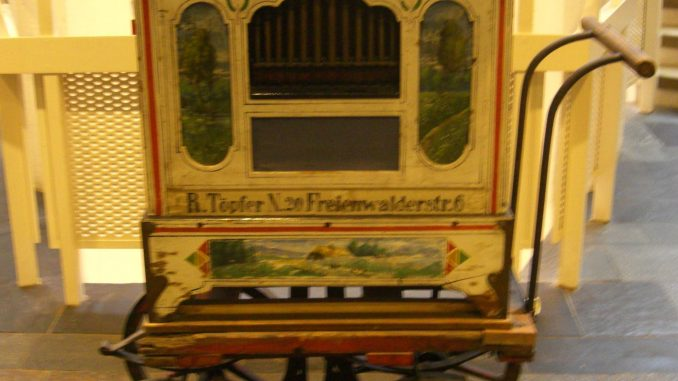

{fig-align="center"}

*Contemporanei tra luci e ombre: Agamben. Musiche di Jolivet, Copland, Hindemit, Arutiuniam, Wiltgen, Carisi, Sauter, Wolff, Wolpe, Günter Muller-Otomo Yoshihide, Butch Morris-Istanbul conduction, Giancarlo Schiaffini-Thurston Moore-Walter Prati.*

«*Può dirsi contemporaneo soltanto chi non si lascia accecare dalle luci del secolo e riesce a scorgere in esse la parte dell'ombra, la loro intima oscurità.*» Mi lascio sorprendere da questo appunto di Giorgio Agamben (*Cos'è il contemporaneo?*, su *Nudità*, Nottetempo 2009), poco più avanti definito come «*incompleto*», e cerco qualche idea per un ascolto della contemporaneità in musica. Cinque dischi, non tutti recenti, ma questo non significa niente.

*Counterpoise* (Hat Hut Records 2000)*:* composizioni di Carisi, Sauter, Wolff, Wolpe eseguite dall'ensemble Accanto e dal quartetto di sax Xasax. Il titolo è preso dalla più datata (1948), composta da [John Carisi](https://www.youtube.com/watch?v=qjHTqOpkYRk). Tromba, sax baritono, piano e percussioni, in una equilibrata contrapposizione tra spontaneità e costruzione.

*Apres la nuit...* (Chandos Records 2011) del trombettista Philippe Schwartz. Composizioni di Jolivet, Copland, Hindemit, Arutiuniam, e Ronald Wiltgen, autore della più recente (2010), che intitola la raccolta. Il flicorno segue le tre fasi di *calma*, *agitazione*, *calma*, prima di aprirsi al *sogno*.

Günter Muller e Otomo Yoshihide con *Time Travel* (Erstwhile records 2003, registrazioni del 2002) conducono in un rarefatto ambiente metropolitano costituito di parti irriducibili e suoni sempre nuovi, dove senza piani prestabiliti i due sperimentatori procedono attraversando città e continenti.

Ad un mondo "*diversamente globale*" approda Butch Morris. La lunga serie delle *conduction*, sintesi tra processi compositivi e improvvisazione mediata dai gesti del conduttore, trova momenti privilegiati negli squarci *neo-ottomani* di ney, zurle e saz del concerto di Istanbul del 16 ottobre 1992, pubblicato come *Conduction 25/26* (Anthology of Recorded Music 1995).

L'improvvisazione è al centro di *OPUS (Three Incredible Ideas)* (Auditorium 2001) di Thurston Moore, Walter Prati, Giancarlo Schiaffini. Suoni e intersezioni tra chitarra elettrica, violoncello e basso, trombone, elettronica, in un equilibrio che esplora i confini tra scrittura, post-produzione e improvvisazione.

Walter Prati in *All'improvviso* (Auditorium 2010) cerca di «*definire il percorso necessario affinché possa svilupparsi nel musicista la consapevolezza del 'pensiero musicale' immediatamente precedente all'emissione di un determinato suono*». Viene qui colta la tensione filosofica della composizione istantanea, nella quale diversi parametri sonori intervengono strutturando un'essenza continuamente in divenire.

Agamben prosegue nel dirci che è contemporaneo chi *«riceve in pieno viso il fascio di tenebra che proviene dal presente»* e chi sa *«percepire nel buio questa luce che cerca di raggiungerci e non può farlo»*. La luce è suono, il buio non è silenzio, il silenzio è musica.

Una musica possibile è un suono dotato di propriocezione e concentrato come una goccia. Capace di *«tornare ad un presente in cui non siamo mai stati».*

Contemporanei: ma di chi?

*Fotografia: Claudio Comandini, "Musica da passeggio - Berlino, gennaio 2006.*
