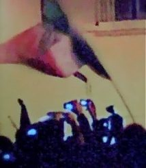
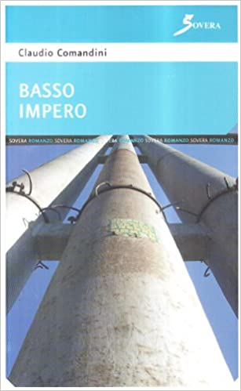

{fig-align="center"}

*Dove si vince la partita e si incontrano quattramicialbar a fare festa e sono funerali di stato. Dal romanzo "Basso Impero".*

«*Cosa significano queste carte?*»

«*Servono per vedere il futuro.*»

La partita procedeva da un quarto d'ora e già era stanca. Ingiurie erano dedicate a tutti i partecipanti al gioco, con rare incitazioni in forma d'insulto. Non era una partita di quelle che stai attizzato.

«*E che vuol dire ?*»

«*Il Folle, il Diavolo, il Giudizio rovesciato, la Torre pure, la Morte. Perdiamo.*»

«*E ci volevano le carte per capirlo?*»

«*Ci vediamo qualche filmetto?*»

«*Faccio una canna.*»

«*Un'altra? Dammi una carta da cento.*»

«*E chi ce l'ha. Da mille. Fare comunque canna.*»

«*Arrotolala intanto.*»

[Pippano pippano e strapippano.](https://soundcloud.com/claudio_comandini/litalia-ha-vinto) Arriva il gol della Nigeria. A Porkoskin va di traverso. Soffia sullo specchio accuratamente rifinito di striscioline bianche, e la polveretta va tutta intorno nel salotto buono.

«*Cretinodeficentepezzodimerdaidiotaimbecillefrocio!*»

«*Ma questi cazzo di negri...*»

Senza prodursi in ulteriori spropositi, si pippano tutto il salotto buono, lo spolverano infilando il naso in ogni angolo e in ogni fibra, regrediscono a livelli futuribili. E restano catodici svariati minuti. Poi, la frenesia s'esterna.

«*Senti...*»

«*Non ho voglia, Lele. Non ora.*»

«*Dai che ti va più che ha me.*»

Si avvicina e gli si mette sopra.

Quella vittoria non se l'era aspettata nessuno, ma tutti trovarono l'obbligo di festeggiarla. Ogni piazza invasa da un tumulto di grida e bandiere, caroselli isterici per un gol all'ottantanovesimo minuto e un altro ai supplementari contro la Nigeria, in vantaggio dal ventesimo. E come in tutte le città del paese, la piazza di decibel impazzita, sul corso parate con donne bruttissime inelegantemente mascherate da bandiera italiana, e tuffi in fontane, scalate ai monumenti, gente che butta i rifiuti dalla finestre, atti vandalici generici.

Pure il tossico è felice, e con un mantello bianco rosso e verde e la mano stesa fa davvero una bella figura. Le crickcrok sono patriotticamente vestite con la maglia dei giocatori della nazionale. Sullo spartitraffico, assediato da vetture d'ogni sorta in caroselli di tripudio tricolore, si incontrano Giggi, che ha visto la partita al bar insieme a tutti ed è entusiasta, con Lele, che ha appena fatto una strage, e Porkoskin, inevitabilmente complice.

Mentre Porkoskin stava sbocchinando il cazzo sporco di merda di Lele che se l'era inculato, i genitori di Lele si sparavano. E quindi lui uccide la madre che ha ucciso il padre: durante il tifo gli spari non si distinguono. Poi prende soldi, libretto degli assegni, carte di credito, gioielli, oro e pistola e se ne va.

Mentre sono in piazza a pianificare, entra in scena Mario in un Maserati pieno di bandiere. Con un urlo e due trombette da stadio, annuncia l'intenzione di andare a fare giustizia in città per festeggiare il furto dell'automobile e la sconfitta degli sporchi negri.

«*Ma 'ndo l'hai rimediato ?*»

«*Lo 'nculato a uno che era andato a pià il giornale e figurate se co la partita lo cercavano! Eh eh eh!*»

«*Il 190?*»

«*Fuso. Rimasto a Vermicino. Nu' rompete li cojoni, 'namo.*»

Per arrivare alla città c'è una sola strada che conosce tante deviazioni. Qui il paesaggio si offre inconsueto, con luoghi che potrebbero essere ovunque, e quasi sembra di essere condotto in altre città. Queste deviazioni riportano poi improvvise alla vista rassicurante delle grandi piazze, da cui poi si snodano altri percorsi, dentro la stessa e in altre città.

Ad uno degli incroci di queste strade c'è Abdul, dal Togo. Non sa come stanno i suoi figli, sua moglie. Manda loro i soldi, centocinquantamila al mese dal guadagno al semaforo. Un terzo le tiene per se. Qualcuno dice che i suoi guadagni sono più alti e che non paga le tasse, e che a furia di pulirli i vetri si sporcano di più. Dorme alle rovine dell'acquedotto Felice. Non è mai invadente, ringrazia, ed augura la buona fortuna agli automobilisti, sempre.

Presso le arcate è stato trovato il suo corpo carbonizzato, col cranio spaccato, e tre colpi in pieno petto inferti successivamente al suo decesso. L'Italia aveva vinto, e con i rumori dei festeggiamenti non se ne sarebbe accorto nessuno.

A Porkoskin l'hanno lasciato a maledire il giorno che continua a sorgere seminando massacri. È stato lui a terminare Abdull, per pietà, dopo che gli avevano dato fuoco, e visto contorcersi urlando. Adesso il coraggio per terminare se stesso non lo trova. L'unica cosa sensata da fare, e non gli riesce. Lele è scappato con gli altri, la pistola gli è rimasta in tasca per sbaglio, ora la getterà via da qualche parte.

Verranno le guardie, lo porteranno al gabbio, questa volta non può inventarsi storie. Ma non farà i nomi. Non è un infame. E l'Italia ha vinto.

Gli altri si ammazzano contro un muro mentre vanno a prendere i cornetti correndo a centoventi all'ora. Sopravvive solo Giggi che all'ospedale si fa un sacco di amici e passa la giornata a vedere la televisione ed organizzare serate e businesse.

Funerali di stato di Abdull, a reti unificate, discorso delle più alte autorità. Giggi riconosce:

«*Hanno fatto bene a dare spazio a quelle cose importanti e a quella brava persona, che io ho pure conosciuto*».

E già che c'è, si incazza, come tutte le brave persone, e pontifica, con consenso unanime:

«*Quell'infamata del decreto Biondi, che rimette in libertà tutti i ladri. Che io l'ho puro votati questi, perchè erano quello che ci voleva per risollevà l'Itaglia. Intanto la brava gggente more e l'infami prospereno, e ce rovinano puro la soddisfazione delle partite che uno vince perché se lo merita. Ma Forza Itaglia e daje e daje che io c'ho la speranza che tutte le persone oneste come noi possano un giorno sconfiggere tutta l'ipocrisia del mondo, ecc.*.»

Non si capisce se finge o se non ricorda o se proprio non si rende conto. Neanche quando vengono le guardie e gli annunciano il trasferimento.

Porkoskin già da una misura di tempo per lui incalcolabile è in cella d'isolamento a Regina Coeli, dove cinque presunti banditi su sei sono extracomunitari e due sono scuri scuri. Ogni tanto lasciano qualcuno dopo mesi perché innocente, ma comunque qui tutti dicono di essere innocenti, tutti tranne lui, che proprio non può e non vuole. Sanno ormai chi è e lui ha paura che minimo minimo lo uccidano da un momento a quello prima, e non si muove dal lettino da giorni senza più tempo. Grida soffocate, nei corridoi, nei cortili, nella sua testa, e dallo spioncino una rete, alle finestre un intrico di reti, reticoli dovunque assalgono gli occhi, chiusi fra le loro feritoie. Il cibo ha un puzzo orrido e arcano che nemmeno Dante si sarebbe figurato, e le sue mani stringono imploranti Famiglia Cristiana. In crisi di conversione, non sa se dorme o se è desto, non vuole più parlare, mai più con nessuno, solo con Gesù Bambino. Che chissà che gli frega di uno stronzo del genere. O forse si. Massì, dai, si. Tanto, per quello che può servire...

Ritrovata la pistola, registrata dal padre di Lele, si palesa tutta la merda della vicenda. Seguono processi che non finiranno mai, mentre sorgono centri culturali dedicati ad Abdull gestiti da bianchi, e gruppi eversivi, sempre più bianchi, di camerati a favore di Porcoskin libero, e le cazzatone dei giornalisti prosperano alla grande.

Il sole implacabile secca le piante più deboli. Non vuole piovere. Non vuole proprio. Ma proprio no.

*Fotografia: Claudio Comandini, "Forza, Italia" - Bologna-Roma 2011.*

*Musica: L'Italia ha vinto (Comandini), registrata al Sound Club di Marino da Ernesto Ranieri nel maggio 2007. Claudio Comandini: voce, tromba, elettronica - Caterina Rosolino: kora - Ernesto Ranieri: chitarra elettrica - Francesco Ranieri: basso elettrico, batteria, percussioni.*

*Tratto da: Claudio Comandini, Basso Impero, Sovera Roma 2006, pp. 60-62.*

{fig-align="center"}
