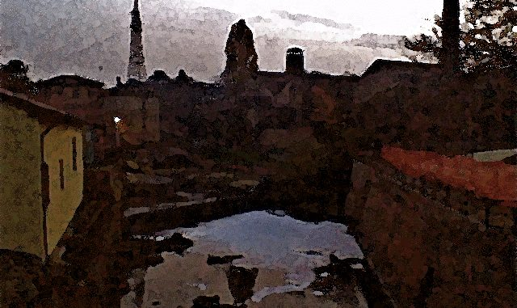

{fig-align="center"}

*Le mura e le porte di Bologna. Corrispondenze: porte della città, segni zodiacali, tonalità musicali. Porta Lame, il Porto di Navile, la Manifattura Tabacchi, l'Archivio Notarile. La battaglia del 7 novembre 1944. L'asteroide Bonomia. Metafisica e impressionismo. Le forme retoriche nell'improvvisazione musicale. Anarchismo epistemologico e istant composition.*

## 1. La Porta dei Pesci

La terza delle cerchie di mura che circondavano Bologna, detta anche *circla* e corrispondente all'attuale perimetro dei viali di circonvallazione, venne costruita nella seconda metà del XII secolo. Più di sette chilometri di mura difensive, erette per circoscrivere una superficie di circa 400 ettari e tutti i borghi sorti fuori dalla seconda cerchia. Di queste mura, abbattute nel 1902-1906 per lasciare spazio a quelli che sono chiamati viali e al traffico automobilistico, sono scampate per interessamento di Alfonso Rubbiani e Giosuè Carducci dieci porte e due loro indicazioni: dodici come i segni dello Zodiaco posizionati sull'ellittica terrestre, dodici come le note e le tonalità musicali, chiamate spesso anche chiavi; tuttavia, l'ultimo tipo di utilizzo corrisponde ad un'impropria traduzione dall'inglese: infatti, le chiavi sono i segni grafici che determinano le altezze delle note, come quella di sol. Ad ogni modo, tutti sanno che normalmente sono le chiavi ad aprire le porte.

Porta Lame sorge ancora all'incrocio tra la fine del viale omonimo e l'inizio di via Zanardi, ed era vicina all'antico porto della città. Del complesso portuale oggi restano la Salara (tra il Museo di Arte Moderna e i Giardini del Cavaticcio, il cui nome deriva da un canale che, attraverso una cascata, convogliava le acque di quello di Reno in quello del Navile), e la Gabella (a suo tempo caratterizzata da un enorme bassorilievo della Madonna che oggi può ammirarsi a Palazzo D'Accursio sulla sommità dello scalone).

Nella zona c'è anche una struttura conosciuta come Bestial Market, un tempo adibita a mattatoio, e poi sede di numerose attività culturali; qui nel maggio del 2010 ho condotto un laboratorio di improvvisazione musicale, organizzato con l'associazione culturale Farm. I temi da me proposti erano fortemente legati agli elementi simbolici e storici dell'area, sui quali ci soffermeremo in questo scritto, gironzolando nello spazio e nel tempo, anche in termini siderali.

Tutto comincia quando, in una libreria remainder che stava sotto le torri, ho trovato per poco più di due euro un suggestivo libercolo di Massimo Frisari dal titolo *Bologna. Le dodici porte, i dodici segni zodiacali* (Sarva, Imola 1991), dove viene sviluppata proprio la sovrapposizione del cerchio dello zodiaco alla mappa della città. Qualcuno potrebbe inorridire di fronte a tali elaborazioni, altri invece ne sarebbero entusiasti: per quanto mi riguarda, trovo che le implicazioni da valorizzare sono altre rispetto a quelle delle proprie pregiudiziali reazioni.

L'asse dei segni cardinali Ariete-Bilancia è quindi rappresentato dalla via Emilia, la strada consolare che dal 187 a.C. unisce Piacenza a Rimini e che attraversa la città con il nome di Strada Maggiore unendo Porta S. Felice a Porta Mazzini.

Secondo tale schema, Porta Lame corrisponde ai Pesci, ultimo segno dello zodiaco, segno d'acqua e mobile, posto tra inverno e primavera; è anche il segno sotto cui sono nato, ma questo è trascurabile. I Pesci rappresentano tanto l'apertura oceanica quanto i luoghi isolati, e nel segno ha domicilio il pianeta Nettuno, che governa tanto le profondità marine quanto i gas. Un tempo, procedendo oltre la porta si raggiungeva la parte bassa della pianura, coperta da numerosi specchi d'acqua. E infatti, *lame* nel latino di Orazio significa *palude*, per quanto secondo un'altra etimologia il nome derivi invece dagli acciaiuli che vi erano presenti in gran numero. Come accade ovunque, la zona portuense era piuttosto malfamata, piena di immigrati di ogni dove che al tempo di Dante vi si parlava una gran moltitudine di dialetti, come un giorno mi segnalò un tassista slavo, attento lettore del *De Vulgari Eloquentia* (1304); tale questione è menzionata anche su una lapide apposta su Porta Mazzini, per la precisione sulla porta duecentesca scoperta grazie alla demolizione di quella settecentesca.

La Porta delle Lame venne eretta, insieme alle antiche mura, nella seconda metà del sec. XIII. Originariamente aveva un cassero, nel 1334 fu dotata di due ponti levatoi, uno per i carri e l'altro per i pedoni. Nel 1428, nel 1440, nel 1451 e nel 1511 venne chiusa per isolare la città da assalti sui quali ora non mi dilungo. L'edificio barocco ancora esistente è un rifacimento del 1677, disegnato dall'architetto Agostino Barelli dopo l'abbattimento del cassero medievale.

Il porto dentro le mura prendeva il nome dal canale Navile, che dopo quattro chilometri conduceva al porto detto di Corticella, per quindi risalire verso il Po di Primaro; i traffici riguardavano principalmente stoffe pregiate, prodotte dalle colture di bachi della zona dell'Appennino, per secoli principale elemento della ricchezza della città con cui si finanziava anche l'università. Le acque rappresentavano così tanto il motore propulsore del fiorente sviluppo protoindustriale cittadino quanto degli studi e della ricerca. Tale porto cittadino sostituì quello più antico e distante, detto della Bova o del Maccagno, e venne stabilito nelle sue fattezze definitive nel 1494 per ordine di Giovanni Bentivoglio, poi perfezionato dal 1548 dal Vignola che, disponendo delle dighe mobili ridusse l'alto scorrimento delle acque, causa del continuo interramento del canale.

Realizzato all'alba della modernità ed emblema dell'avanzamento di condizioni e strumenti di vita civile, fu proprio l'avanzare del progresso che condusse il porto a perdere sempre più di importanza, fino alla sua esclusione dal piano regolatore del 1889, e venne quindi demolito nel 1933; il canale fu definitivamente chiuso alla navigazione nel 1948, dopo che il suo traffico si era ridotto, da 28 unità di *barche*, *burchielli*, *sandali* e *bucintori*, a due sole imbarcazioni, un Mas della Marina e un barcone carico di sabbia. Per chi trovasse interesse nell'aspetto acquatico di una città quale Bologna, ora marcatamente terragna eppure un tempo solcata da numerosi canali, può consultare tra le molte pubblicazioni l'agile volume di Tiziano Costa *I Canali Perduti* (Costa Editore, Bologna 1998), e così contemplarne con più accortezza il fantasma che qua e là ancora affiora e riflettere su come i cambiamenti intercorsi possano aver mutato carattere e funzioni della città.

E nel suo sviluppo, il quartiere ospita anche la Manifattura Tabacchi, progettato dall'architetto Gaetano De Napoli nel 1906, nel cui perimetro oggi vi è il parco che commemora l'11 settembre, con una scelta che un amministratore con un minimo di gusto avrebbe trovato più appropriata ad una rotatoria. Verso la fine del secolo il Ministero di Grazia e Giustizia ha inaugurato, nel moderno edificio di fronte alla porta, un organizzato Archivio Notarile.

Frisari, nel suo sfizioso studio su porte e segni, nota alcune corrispondenze piuttosto suggestive, legate soprattutto al pianeta Nettuno che, oltre ad intrattenere nessi con l'isolamento e con l'oceano, governa il vizio del fumo (in fondo una specie di gas), la memoria (l'archivio ne è immagine molto appropriata), la navigazione (peraltro nel 1948 Saturno entra in Pesci, indicando alcune restrizioni per quanto riguarda le acque, e la data coincide con la definitiva cessazione della navigazione in Bologna). Tutti questi aspetti sono stati attentamente considerati nel predisporre le indicazioni musicali su cui il gruppo ha lavorato, ma di questo vedremo più in là.

Soffermiamoci sulla storia contemporanea, le cui caratteristiche marcatamente materiali sembrerebbero farla vistosamente fuoriuscire dallo schema astrologico: sarà che gli uomini moderni spesso dimenticano le stelle, oppure le seguono solo dove, loro malgrado, sono conformi alla stretta misura del controllo sociale, come avviene, secondo la decisiva lezione di Adorno, con gli oroscopi dei giornali. L'episodio che ci interessa è quello della battaglia svoltasi presso Porta Lame nel 7 novembre 1944, uno dei più importanti combattimenti cittadini della II Guerra Mondiale. Contingenti arrivati dai distaccamenti della 7a GAP, con sedi presso l'Ospedale Maggiore e via del Macello, si scontrano con le forze dell'esercito nazista presenti sulla Linea Gotica nell'Appennino tosco-emiliano e con i combattenti della Repubblica Sociale di Salò. Nonostante la superiorità militare nazifascista, i partigiani prevalgono con l'attacco parallelo sferrato dalle due basi. La guerra, ad ogni modo, non terminò lì.

A memoria della battaglia, presso la porta una lapide ricorda i caduti, e vi sono inoltre disposte due statue di partigiani forgiate da Luciano Minguzzi dal bronzo di una statua equestre di Mussolini, la quale a sua volta riciclava tre cannoni sottratti agli austriaci nella battaglia dell'8 agosto 1848 a Porta Galliera (corrispondente al segno dell'Acquario). Non è inutile sottolineare che ogni commemorazione utilizza per realizzare i propri monumenti le armi di quella contro la quale le proprie forze si sollevarono.

Il libro di Frisari omette completamente i dati relativi a tale scontro; tuttavia, in appendice, è riportata la carta astrale del 21 aprile 1945, giorno in cui in città entrano gli Alleati anglo-americani. Secondo questo documento, l'asteroide Bonomia, che porta il nome romano della città, risulta posizionato sul secondo grado dell'Ariete (segno che, come già ricordato, corrisponde alla vicina Porta San Felice): tale posizione, a detta dell'astrologo Hitschelr citato dal Frisari, ha attinenza con il razzismo e le sue battaglie, ed è peraltro in congiunzione con la posizione natale di Hitler, nato proprio il 21 aprile. L'asteroide sarebbe stato poi in trigono con la Luna, indicando la partecipazione popolare alla cacciata dei nazifascisiti, alla quale si sovrappone il bilancio disastroso dei danni subiti da una città da ricostruire, a sua volta segnalato dal quadrato Bonomia-Saturno. Invece, l'opposizione Bonomia-Nettuno riporta all'estrema confusione di un periodo nel quale per l'Italia una guerra persa si capovolgeva in un conflitto vinto, anche per via delle ambiguità mai chiarite che accompagnarono l'armistizio dell'8 settembre 1943.

Nel primo decennio del 2000, ai restauri della porta si sono aggiunti quelli del quartiere, permettendo il recupero delle vecchie case degli operai e la costruzione di moderni edifici che hanno arricchito lo skyline bolognese di elementi dall'alto profilo metafisico, riscattando la zona dal suo antico degrado, ripetutamente evocato nella città dalla pubblicistica più diffusa. Eppure, passeggiare la sera per il parco dell'11 settembre sembra quasi riscattare dalla mediocrità diffusa, e sembra quasi di transitare per un quadro di De Chirico; tale circostanza non è affatto male ed è particolarmente suggestiva oggi 2012. In un periodo in cui l'ingresso di Nettuno in Pesci dovrebbe indicare un periodo di prosperità strettamente legato alla cosiddetta Età dell'Acquario. Di tutto questo sotto la volta celeste non sembra però vedersi ancora granché, e quanto resta è perlopiù un certo sapore impressionista, inevitabile laddove si contemplano tracce perdute e irrecuperabili, come sono le pietre distrutte, oppure quelle lontane e forse già spente, come lo sono le stelle del firmamento.

Quindi, come già accennato, ho assunto gli elementi urbanistici (legati al quartiere nel suo complesso) e astronomici (non esclusivamente astrologici) quale ipotesi di lavoro musicale, anche per formulare un contributo personale alla vaga idea di Bologna "*città della musica*". Pertanto, sovrapponendo tra loro la pianta della città, il cerchio dello zodiaco, e il circolo delle quinte, ho fatto corrispondere Porta Lame alla tonalità di Fa, laddove peraltro Fa è la nota che suonano le navi quando entrano nei porti. Tenendo un orecchio alla tonalità allargata di cui parla Schoenberg e l'altro allo spazio possibile dell'improvvisazione, ho vincolato la mia *conduction* ai parametri musicali nei quali traducevo i vari dati da me raccolti.

I risultati, come si conviene ad un qualcosa di artistico, e mantengono l'immediatezza propria alla musica: non è affatto necessario che l'ascoltatore faccia riferimento al complesso metodo di elaborazione da me architettato, nel quale hanno agito i modi con cui guardo alle città e ai suoni delle cose. Per comprendere quanto sto dicendo, basta alzare gli occhi verso il cielo stellato e notare che le costellazioni lasciano emergere soltanto i puntini e non le linee che li uniscono, guarda caso messe lì soprattutto per non far perdere i i marinai. E come un palazzo compiuto si libera definitivamente dei tubi innocenti e un'opera letteraria nasconde accortamente procedimenti e strutture, dopo le note, gli accordi, le chiavi e tutto il resto, restano soltanto suoni destinati a svanire e le porte che riescono ad aprire.

## 2. In Fa maggiore

<iframe width="100%" height="300" scrolling="no" frameborder="no" src="https://w.soundcloud.com/player/?url=https%3A//api.soundcloud.com/tracks/58789760&amp;color=%23ff5500&amp;auto_play=true&amp;hide_related=false&amp;show_comments=true&amp;show_user=true&amp;show_reposts=false&amp;show_teaser=true&amp;visual=true">

</iframe>

[***L'archivio della memoria***](https://soundcloud.com/claudio_comandini/larchivio-della-memoria): realizzata utilizzando le formule di retorica musicale che risalgono alla Riforma protestante, i cui termini vengono elaborati da una serie di trattatisti tedeschi che, da Michael Keinspeck (sec XV-XVI) a Johann Lippius (1585-1612), sono impegnati ad adattare alla musica il sistema utilizzato dai latini per la poesia. In questo modo veniva traslata dalla letteratura alla musica la rivalità con Roma, proprio mentre la costruzione della leggenda della papessa Giovanna permetteva ai protestanti di diffamare la corte papale, basandosi comunque sui suoi ricorrenti scandali. La sistematica delle figura retoriche e la storia della loro applicazione alla musica, ampiamente misconosciuta e piuttosto interessante, è studiata da Ferruccio Civra in *Musica Poetica* (Utet, Torino 1991). Secondo le mie indicazioni, ogni musicista aveva a disposizione una figura retorica per interagire con il materiale sonoro che progressivamente si configurava. Il tempo di esecuzione è stato stabilito in sessanta battute al secondo, basandosi sul fatto che la memoria si svolge, qualunque discorso vi si stabilisca, sempre al presente.

`<iframe width="100%" height="300" scrolling="no" frameborder="no" src="https://w.soundcloud.com/player/?url=https%3A//api.soundcloud.com/tracks/58789297&amp;color=%23ff5500&amp;auto_play=true&amp;hide_related=false&amp;show_comments=true&amp;show_user=true&amp;show_reposts=false&amp;show_teaser=true&amp;visual=true"`{=html}

</iframe>

[***Squarci***](https://soundcloud.com/claudio_comandini/larchivio-della-memoria): frammento di improvvisazione radicale, ampiamente sfuggito ad ogni indicazione, ma piuttosto vicino, in quanto riesce a trasmettere, agli effetti delle lame e delle bombe, attinenti e non solo in senso filologico alle storie che si svolgono attorno a quella che anticamente era conosciuta come la Porta delle Lame.

`<iframe width="100%" height="300" scrolling="no" frameborder="no" src="https://w.soundcloud.com/player/?url=https%3A//api.soundcloud.com/tracks/58788652&amp;color=%23ff5500&amp;auto_play=true&amp;hide_related=false&amp;show_comments=true&amp;show_user=true&amp;show_reposts=false&amp;show_teaser=true&amp;visual=true"`{=html}

</iframe>

[***Manifattura Tabacchi***](https://soundcloud.com/claudio_comandini/manifattura-tabacchi): prende spunto da quanto ordinariamente si fa col tabacco, cioè spippettare, però suggerisce di farlo con gli strumenti. Si basa su un tempo adagio in 5/4 che presenta una terzina sugli ultimi due movimenti. Per inciso, da quando suono regolarmente non fumo più sigarette. Chissà quanto durerà.

`<iframe width="100%" height="300" scrolling="no" frameborder="no" src="https://w.soundcloud.com/player/?url=https%3A//api.soundcloud.com/tracks/58788121&amp;color=%23ff5500&amp;auto_play=true&amp;hide_related=false&amp;show_comments=true&amp;show_user=true&amp;show_reposts=false&amp;show_teaser=true&amp;visual=true"`{=html}

</iframe>

[***Il porto improvviso***](https://soundcloud.com/claudio_comandini/il-porto-improvviso): un'altra ampia trasgressione ad ogni indicazione fornita. Proprio per questo, riesce a rappresentare la felice scoperta involontaria di un qualcosa che non si era cercato, e comunque trovato perché si stava cercando qualcosa.

## 3. Epistemologia improvvisativa

Una sorta di *serendipità* (parola che comunque detesto profondamente) rappresenta a mio avviso un elemento capace di unire l'anarchismo epistemologico di Paul R. Feyrabend alle formule di *istant composition* quali quelle proposte nei suoi imbattibili seminari da Tristan Honsinger, che ci tiene particolarmente a porre dei parametri anche se poi si va a finire da tutt'altra parte.

Per permettere che si instaurasse un dialogo rispetto a quella che secondo me era una spiccata parentela, regalai a Tristan il libro *Contro il metodo* (1979-1989) del filosofo della scienza austriaco. Il grande violoncellista disse però che quella roba non gli piaceva per niente, e che preferiva leggere Deleuze. Personalmente, dato che ammiro l'originalità soprattutto quand'è rigorosa, Deleuze lo apprezzo molto da solo e accademico, mentre quando fa comunella con Guattari mi sembra che si diventa a sparare ai pesci nel barile dopo aver bevuto assai. Infatti *Millepiani* (1980), come una volta ebbi a dire conversando con Slavoj Žižek, risulta più schizofrenico del capitalismo che descrive, e forse gli è sin troppo solidale per venirne per davvero a capo. Ma anche io ora sto divagando.

E, nel divagare, recuperiamo la dizione latina delle figure retoriche usate in L'archivio della memoria, e una loro breve descrizione: *Anaphora* (ripetizione di elemento all'inizio di una frase), *Apocope* (troncatura della fine di una frase), *Asyndeton* (elementi o frasi elencati senza l'uso di congiunzioni), *Catachresis* (estensione di un'espressione oltre il suo uso proprio)*, Hyperbole* (esagerazione che rafforza la credibilità dell'espressione), *Emphasis* (espressione che accentua il significato dei suoi elementi)*, Metonymia* (sostituzione di un elemento con uno che ne abbia contiguità), *Omoyosis* (espressione che trasforma la parte di un espressione in un'altra), Prolepsis (anticipazione di un possibile contrasto), *Synekdoche* (sostituzione di un elemento per connessione quantitativa)*, Transgressio* (mutamento dell'associazione degli elementi con inserimenti inconsueti). A mio avviso, proprio l'oratoria nella sua articolazione più classica (*Inventio, Disposizio, Elocutio, Memoria, Actio*), formulata da Cicerone nel *De Oratore* (55 a.C.), è del tutto pertinente all'arte dell'improvvisazione sonora o della composizione istantanea.

Ovviamente, non serve sapere tutto questo per farsi piacere la musica, se piace: ogni lavoro nasconde le tracce della propria fatica, e lo racconto solo perché è divertente di per sé, se diverte. Grazie ancora a tutte le persone che in quelle, strano a dirsi ma è così, fredde giornate di maggio 2010 hanno reso tutto questo possibile (me compreso):

Claudio Comandini (tromba, direzione)

Oliviero Antonaci (sax baritono)

Elena Maestrini (sax soprano)

Marta Cannella (flauto)

Angelica Fusco (fisarmonica, melodica)

Daniele Giannotta (fiati, laptop)

Andrea Laino (chitarra elettrica)

Lorenzo Divizia (chitarra elettrica)

Ranieri Spina (chitarra elettrica)

Matteo Sardo (basso)

Marco Lazzaretto (batteria)

*Fotografia: Claudio Comandini, Impressioni da un porto perduto (Bologna, settembre 2010).*
