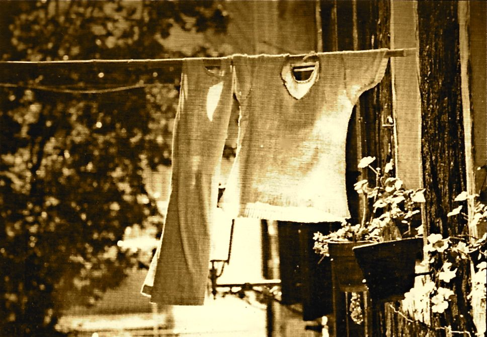

{fig-align="center"}

*Come in un calendario, il tempo ritorna e celebra nuovi inizi.*

I. La goccia insegna.

II\. Un volto si scolpisce da dentro.

III\. Prima si ha una deformazione, poi si sceglie un mestiere.

IV\. Il desiderio di vuoto s'avvampa.

V. Terra bruciata più fertile di sterpaglia.

VI\. Dolore reclama salute.

VII\. Vive bene chi è morto assai.

VIII\. Forti delle possibili sconfitte.

IX\. Facile smarrire difficili conquiste.

X. Legge a sé sua ignoranza nasconde.

XI\. Sempre in viaggio, sempre a casa.

XII\. Pensiero è freccia e bersaglio.

XIII\. Ventre di uomo gravido di madri.

*Aforisma XIII e foto pubblicate in "Nuovo Millennio : Nature Umane - L'ultimo calendario antico" (Edizioni Creative Partner, Roma 2000), realizzato in collaborazione con Maurizio Ciminelli, Greta Correani, Massimiliano Nemez.*

*Fotografia: Claudio Comandini, Vestitinudi (Anagni, ottobre 1995).*
