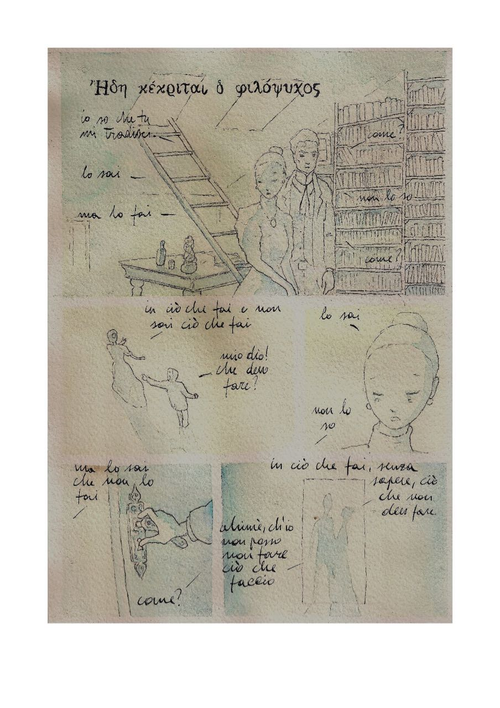
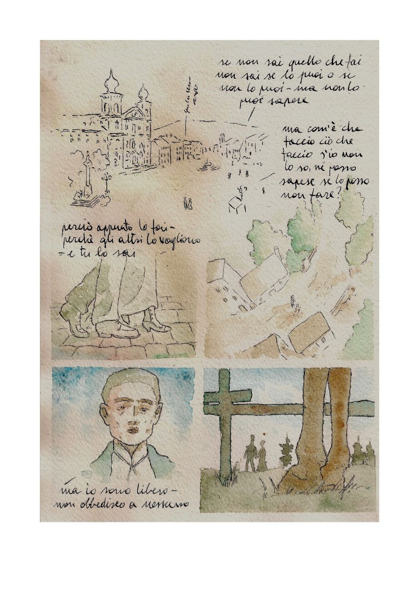
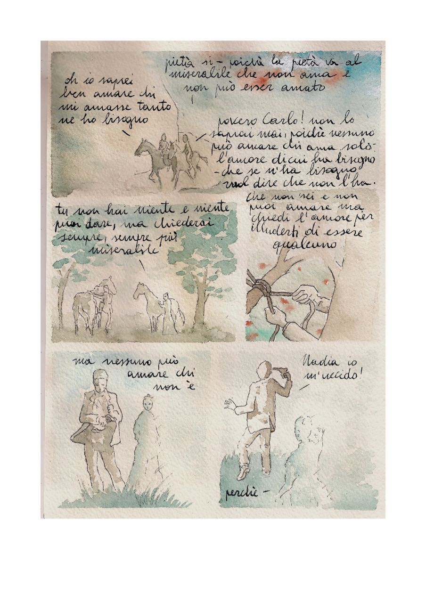
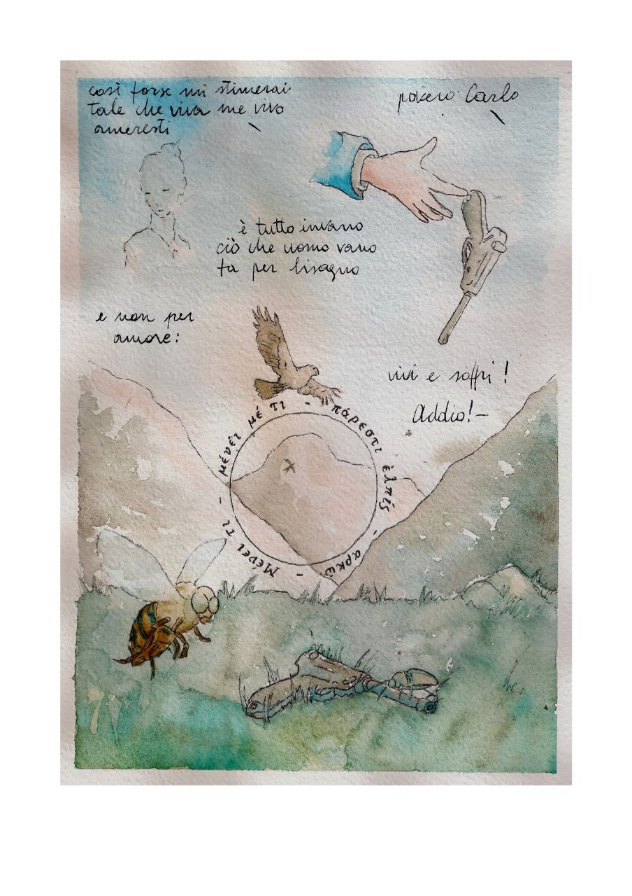

*La via della «persuasione», laddove questa si compendia nel dono di sé capace di rivelare la trascendenza nascosta nell'umano e superare così le convenzioni della «rettorica» e delle istituzioni con cui si propaga l'egoismo degli uomini, trovano forse traguardo nella negazione suprema - quella della vita.*

*Possiamo così sintetizzare il pensiero e la vita di Carlo Michelstaedter (1887-1910), figura decisiva della filosofia italiana di inizio novecento, sul quale continuano a proliferare opere e studi che difficilmente riescono a prescindere dal suo enigmatico suicidio, compiuto a ventitré anni dopo la stesura della tesi di laurea. L'autore di "La Persuasione e la retorica", cresciuto in una famiglia di origine ebraica nella mitteleuropea Gorizia e poi trasferitosi nella Firenze di riviste quali «Il Leonardo» e «La Voce», trova i riferimenti più prossimi in Tolstoj, Ibsen, Schopenhauer e Beethoven, ed è impegnato a cercare una filosofia capace della tensione propria ai pensatori greci della 'phisis'. Il suo gesto estremo fu, a detta del letterato Giovanni Papini, dovuto all'esigenza di «accettare sino all'ultimo, onestamente e virilmente le conseguenze delle sue idee». Invece, Gaetano Chiavacci, che conobbe personalmente l'autore, vi legge, piuttosto che «ragioni metafisiche», l'incapacità di vivere la «qualunque vita» dopo avere toccato un pensiero di cristallina purezza. Sergio Campailla, studioso ed editore dell'opera di Michelstaedter, ha riscontrato nell'ultimo periodo della vita la decisiva presenza di una figura femminile, la russa Nadia Baraden, studentessa di belle arti, esiliata dal suo paese perché implicata nella rivoluzione del 1905. A quanto risulta da alcune lettere, la donna non corrispose un suo approccio amoroso, per poi rivelargli di aver avuto la vita rovinata da una violenza subita da uno zio nell'infanzia, e di aver inoltre deciso di suicidarsi, cosa che avvenne nell'11 aprile del 1907 in quella che oggi a Firenze è Piazza della Repubblica, dove allora erano i caffè letterari Paszkowski e Giubbe Rosse. La donna lo aveva invitato ad «affrontare la vita e a non rinunciare mai a se stesso»: eppure, e sempre con un colpo di pistola, Michelstaedter pone termine alla propria esistenza il 17 ottobre dello stesso anno.*

*Un incontro tra i due personaggi è immaginato nelle tavole di Gianluca Varone, disegnatore e musicista che ha dedicato la tesi di laurea al grande filosofo goriziano.*

*Amore e morte, l'universo e 'l nulla*\
*necessità crudele della vita*\
*tu mi rifiuti.*

(*Voglio e non posso e spero senza fede - III*, Febbraio 1907, Carlo Michelstaedter, da *"Volo per altri cieli è la mia vita"*, Fara Editore, Santarcangelo di Romagna 1996).

{fig-align="center" width="695"}

{fig-align="center"}

{fig-align="center"}

{fig-align="center"}

La grafic novel è scaricabile [qui](/images/2016/05/Varone_Michelstaedter.pdf).

*Illustrazione: Carlo Michelstaedter, "Autoritratto" (Olio su pannello, data incerta).*
