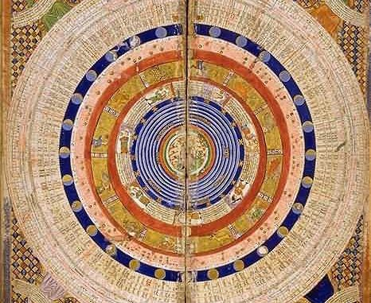

{fig-align="center" width="503"}

*Ogni giorno rappresenta ormai una celebrazione di qualcosa che fatichiamo a ricordare: quasi sempre, qualche cosa di atroce. Tuttavia, come ricorda Massimo Pamio, sarebbe il caso di tenere a mente ogni giorno qualcosa di importante.*

Pian piano il calendario gregoriano si sta infettando di *giorni del ricordo*, celebrazioni molto dignitose istituite per non dimenticare chi siamo veramente: il giorno dedicato alla memoria dei caduti della prima guerra mondiale, quello dedicato ai caduti della seconda, l'altro ai martiri della resistenza, quello alle vittime delle foibe, e poi della fede cattolica, del razzismo, fino a giungere a quello di recente istituzione, dedicato alla sempre più nobile memoria delle vittime della letteratura dell'orrore, che sarà comunque preceduto dal giorno dedicato alla memoria delle vittime dei libri di Fabio Volo e del cinema apocalittico.

Non sarebbe più semplice creare un solo giorno dedicato alla memoria di tutti i delitti perpetrati dall'uomo nei confronti dell'umanità, il giorno dell'*homo homini lupus*, in cui ognuno piange e si dispera e si rimprovera per i propri eccidi?

I cinesi ricorderanno Mao che fece fuori un milione di connazionali e gli attuali governanti che hanno fatto sparire tanti giovani nella piazza della pace celeste, i russi correranno con la memoria a Stalin e ai lager e alle deportazioni, i belgi al milione di congolesi uccisi, gli statunitensi ricorderanno la strage degli indiani e le migliaia di guerre condotte in Vietnam e in tanti altri paesi, gli spagnoli quella degli Indios del Centro e Sudamerica, i cambogiani le epurazioni di Pol Pot, gli argentini verseranno lacrime e si batteranno il petto per i desaparecidos, i turchi per gli armeni e ora per i curdi, i sudafricani bianchi per la segregazione razziale, i tedeschi per gli ebrei, gli ebrei per i palestinesi, i palestinesi per gli attentati commessi, infine per giungere ai più vicini, gli italiani si batteranno il petto per gli etiopi, i somali, i libici, senza dimenticare i martiri innocenti delle guerre; i confinanti slavi dovranno piangere l'eccidio dei bosniaci e quello degli infoibati italiani, i francesi per gli algerini, gli svizzeri per gli uccellini degli orologi a cucù.

Insomma, a tirare le somme, sarà un giorno pieno per tutti, tutti i popoli, le razze, le religioni (non dimentichiamo neanche le guerre tra i sessi, le vittime della violenza sessuale) e infine, ultime ma non proprio in fondo al culo del barile, le minoranze (i derelitti, i poveri, gli indifesi, i bambini, le donne, i nomadi, gli esuli, i migranti, i barboni, i vecchi, i gay, le lesbiche, i terroni, i polentoni, i lettori di Tex Willer), le vittime di sempre.

Sarebbero invece da istituire i giorni della memoria in cui gli uomini sono riusciti a combinare qualcosa di buono, soprattutto dal punto di vista morale: il giorno delle Opere Pie di Madre Teresa di Calcutta, il giorno del Sogno di Martin Luther King, il giorno del Sorriso, il giorno dell'Albero piantato e non estirpato dal Comune per la solita lottizzazione tra intimi, il giorno dell'Energia Verde, il giorno dell'Ozio questo Sconosciuto, il giorno dello Stupore, il giorno dell'Innocenza, dedicato ai bambini e agli alberi, il giorno dei pochissimi giornalisti italiani coraggiosi che dicono pane al pane e vino al vino, il giorno del ritrovamento del mio portafogli da parte di un gentile signore che non ha voluto facessi il suo nome: beatifichiamolo, subito.

[*Massimo Pamio, "Il giorno della memoria", «Edizioni Noubs» 21.04.2016.*](https://noubs.wordpress.com/2016/04/21/il-giorno-della-memoria-per-massimo-pamio/)

*Illustrazione: Cresques Abraham, “Calendari de l'Atles Català - Taula 2”, 1375.*
