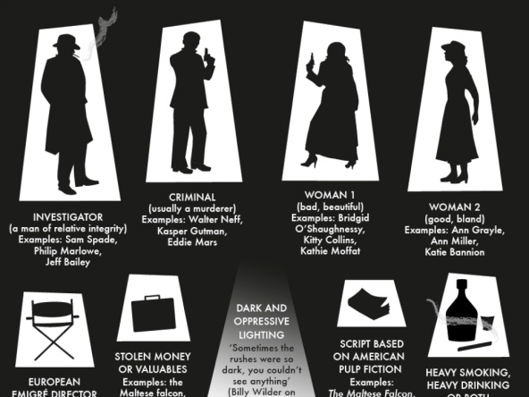
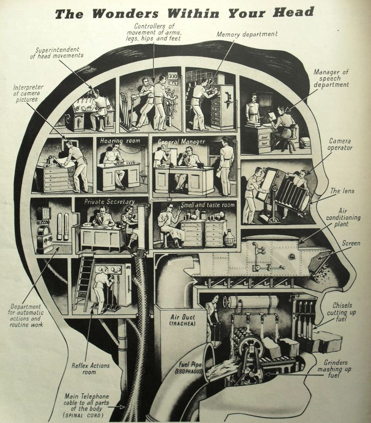
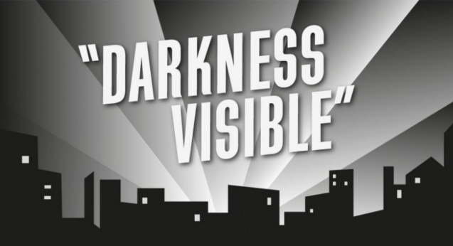

{fig-align="center" width="436"}

*Le narrazioni noir, gialle e affini, conoscono* [*metropoli e province*](https://grandtour.shop/posts/pages/2015-02-28-colori-noir-comandini.html)*, eccellenze e mestieranti, conoscono tecniche per risolvere problemi nelle quali le preoccupazioni scientifiche e matematiche sono decisive.* [*Oscar Montani*](https://grandtour.shop/posts/pages/2016-03-15-giallo-matematica-oscar-montani.html)*, autore di romanzi (ultimo libro "La pazienza del gatto", 2016) e direttore editoriale per* [*Nerocromo*](https://www.nerocromo.com)*, ricorda inoltre che, per farne un'arte, non basta seguire le regole di genere, ma occorre avere una storia da raccontare.*

#### 1. Un volto nell'ombra

{fig-align="center" width="621"}

È di pochi giorni fa una frase che mi ha un po' agitato (sinonimo gentile per incazzato): «*Sì, ma va bene così, in fondo è solo un giallo!*» L'ha pronunciata un mio autore in risposta alla mia ipotesi (richiesta non troppo velata) di revisione di un dialogo che poteva meglio caratterizzare un personaggio.

La mia risposta, pacata: «*C...o! Stai a imbrattare carta e schizzare inchiostro o pensi di far arte? Nel primo caso smetti: va bene così! Nel secondo impegnati e cerca di avere più rispetto per il tuo personaggio: mettilo sotto uno spot impietoso!*»

#### 2. Genere o arte?

{fig-align="center" width="615"}

Ci sono aspiranti autori che, prima di mettersi a scrivere un giallo (o noir), si ispirano (si attengono) a regole di genere, convinti (gli stolti) di produrre un'opera di sottocultura pop.

L'immagine sopra, se da voi consultata, vi farà capire come i primi delinquenti siano proprio questi principianti! Peggio di loro sono quelli che, alla seconda o terza opera (quanti lettori: complici ignoranti, viscidi condiscendenti o semplicemente parenti?) continuano a seguire pedissequamente le regole!

Io credo che prima di prendere in mano una penna (una tastiera) ci si debba porre un paio di  domande: *«Ho una storia da raccontare? Cosa voglio dire ai miei lettori?»*

#### 3. Una mente organizzata

{fig-align="center" width="648"}

Se si hanno le risposte significa che la nostra mente è ben organizzata. Solo allora si può cominciare a costruire la nostra opera artistica. Sì, credo che il noir sia arte.

Non vi scandalizzate, se lo fate significa che in altri tempi avreste pensato che i fumetti (ora che si chiamano Graphic Novel non osereste mai!) fossero un perdita di tempo per i vostri figli!

#### 4. Perché il noir è arte

{width="630"}

Cercherò di elencare alcune ragioni a sostegno della mia tesi. Un autore che scrive gialli persegue un obiettivo: *rendere visibile il buio dell'anima*!

1.  Descrive uno stato dell'anima che tormenta uno o più personaggi. È il primo processo di identificazione che colpisce il lettore.

2.  Costruisce uno stato di tensione emotiva attraverso la suspense (diffidate da chi non la scrive così!).

3.  Utilizza metodi di montaggio delle scene più in chiave emotiva che logica.

4.  Scava nei caratteri del personaggi per far emergere punti di vista diversi. Per offrire chiavi di lettura della complessità.

5.  Parla di situazioni poco note al grande pubblico, abituato a vederne solo la punta dell'iceberg o a vederle raccontate da frettolosi giornalisti TV.

6.  È un romanzo! A commento di questa affermazione mi limiterò solo a citare Andrea Camilleri (da considerare come "il Maestro"!): *«Ho imparato a fare lo scrittore quando mi son messo a scrivere un giallo! Prima pensavo di esserlo, ma solo un giallo ti fa capire quanto rigore occorra nello scrivere!»*. Grazie Maestro!

{fig-align="center" width="640"}

*Illustrazioni: Oscar Montani - Book dell'artista noir*
