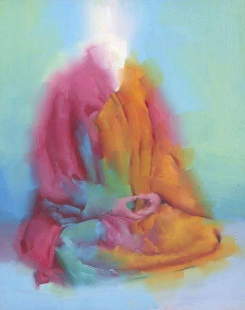
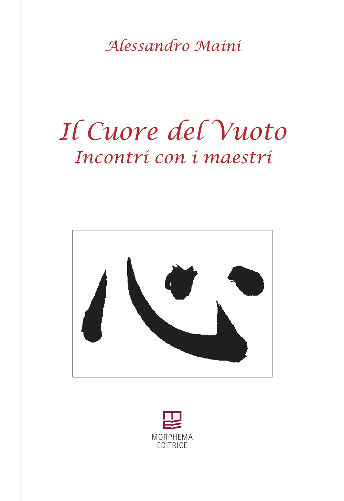

{fig-align="center"}

*«Frasi brevi, spesso folgoranti, che danno più il senso dell'immagine che il contenuto letterale e semantico della parola. \[...\] Tutta la verità è posta al di là del dualismo inevitabile che il linguaggio viene a creare tra soggetto pensante e oggetto pensato. La verità è situata, oltre ogni dualismo, nell'unità semplice e fondamentale dell'esistenza per quello che è, le suo inarrestabile divenire. Maini ci ricorda, in modo ispirato e poetico, che la vita è un continuo fluttuare di cose che, a loro volta, ci indicano la precarietà e l'incostanza dell'essere. \[...\] Racconta di un'armonia universale che lega l'Uomo al Cielo e alla Terra e che si può raggiungere uno stato di perfetta serenità seguendo le leggi del mondo naturale, praticando il wu-wei, il non-agire: non opponendosi a nessun evento, ma cercandone il senso nella propria vita e nella propria crescita individuale.» (Carlo di Stanislao). Alessandro Maini offre nel suo libro 81 sguardi, 81 visioni dal Cuore del Vuoto: qui presentiamo, in ordine sparso, 12 soste da un cammino di una Presenza del Tutto sempre all'inizio e sempre al ritorno.*

LXXXV. La Porta non ha serrature, non farti distrarre.

LXXXVI. Osserva, agisci, ma lascia accadere dall’alto; confida.

LXXXVII. Ama il tuo cavallo, figliolo, ma la direzione decidila tu.

LXXXVIII. Ho ascoltato la Parola, non ciò che gli uomini ne hanno fatto.

LXXXIX. Fui frainteso, parlai di Vita (il sepolcro è vuoto).

XC. Il Maestro Jiu Hua vedeva solo fiori, chiunque avesse di fronte.

XCI. È così, tutto fu nuovo. Perché, vedete, il guardiano si era dissolto, stufo della mia noncuranza.

V. Non rinunciai al mondo: anzi, mi ci immersi. Rinunciai, invece, alla vostra velocità.

XXXIX. Ora è silenzio, anche nell’azione.

XL. C'è sempre una possibilità diversa, ed è miracolo.

XLI. Ma non vedi?

XLII. L’ultima parola del Maestro fu un sorriso.

*Alessandro Maini: «dal cuore libero nasce la vita, e con il cuore libero la si condivide.»*

{fig-align="center" width="643"}

*Immagine: Ethereal Meditation*
