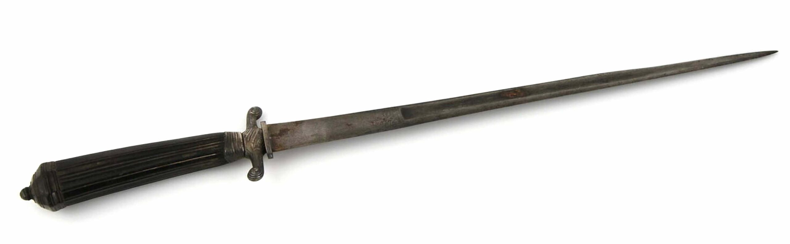

{fig-align="center" width="547"}

*Storia e significato di un pugnale e di un sentimento che sapevano toccare il cuore.*

La *Misericordia* è un pugnale o daga corta simile allo stiletto e al quadrello, usato specialmente dal sec. XV al sec. XVII. Portata bassa sul fianco sinistro, era utilizzata per terminare l'avversario o anche il compagno a fine battaglia, quando tra i feriti rimasti sul terreno occorreva decidere quali non fossero in grado di sopravvivere. Con lama a doppio filo rigida e sottile, triangolare o a sezione di losanga, lunga circa trenta centimetri e raramente più larga di un dito, era considerata tra le produzioni piu tipiche degli armaioli di Albacete. La struttura permetteva di penetrare attraverso gli spazi scoperti di visiere, armature e corazze, in modo da onorare i doveri cavallereschi fino al punto di donare la morte agli *inguaribili*. Esemplari di alto pregio potevano essere incisi con versetti biblici.

La *misericordia* è un sentimento generato dalla compassione per la miseria altrui. Il termine deriva dal latino *misericors* (genitivo *misericordis*), quindi da *misereor* (ho pietà) e *cor-cordis* (cuore). In ebraico il suo nome è *Chesed* e ha radici nell'alleanza tra due parti e nella conseguente solidarietà di una verso quella in difficoltà; nella Cabala è la quarta delle Sephirot sull'Albero della Vita e rappresenta la forza maschile che ordina le cose e le edifica. Perdona ogni colpa e contribuisce a riparare il mondo. È il Padre che protegge il Figlio. Quale virtù morale è tenuta in grande considerazione dall'etica cristiana concretizzandosi in atti di soccorso e opere di pietà. Nel Corano *Rahmân* indica in modo esclusivo Dio quale «*misericordia*», *Rahîm* come colui che la compie. Il *cuore* si fa senziente. 

Nel Nuovo Testamento il suo significato si sviluppa in rapporto al greco e si usano diverse parole per definirlo. *Eleos* indica un sentimento di intima commozione che è il contrario dell'invidia per la fortuna del prossimo. Dove in Aristotele il timore e la compassione della *tragedia* greca permettono la catarsi e quindi la purificazione, nei Vangeli la richiesta di essere misericordiosi trova sviluppo nella parabola del Buon Samaritano (Luca 10:37). Un altro termine è *oiktirmòs*, sentimento di compassione di fronte alle sventure altrui, esemplificato in «*Dio Padre della Misericordia*» (II Corinti 1:3). A detta del sufi ibn Arabi è proprio la misericordia, capacità di comprendere tutte le cose, causa dell'universalità di Dio. Nella Firenze del XIII sec. il concetto trova impiego come nome per un ente assistenziale.

A partire dal sec. XVII, lo sviluppo nell'iconografia della Madonna della Misericordia è legato sopratutto all'opera del cistercense San Bernardino, e fa riferimento all'antifona *Sub tuum presidium*, la più antica preghiera dedicata a Maria per la quale chi è sottoposto alla prova chiede di essere liberato «*a periculis*». Rappresentata in piedi, nell'atto di custodire quale Genitrice della Chiesa sotto al proprio mantello il popolo di Dio, l'immagine si ricollega al retaggio medievale della *protezione del mantello* che le nobildonne potevano concedere ai *perseguitati*. Tale difesa consisteva per l'appunto nell'offrire un riparo simbolico sotto il proprio mantello, considerato inviolabile. Di stoffa o di acciaio, la "misericordia" sapeva sempre toccare il cuore - poi, cadde in disuso.
