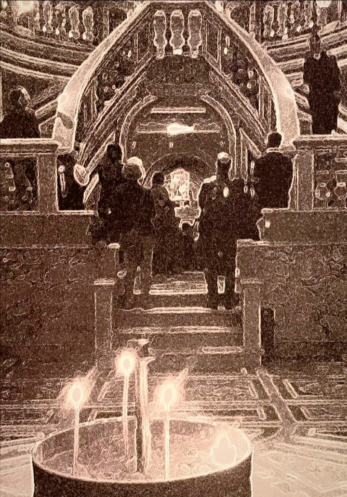

{fig-align="center"}

*Cosa hanno ancora da raccontarci Filippo e Giacomo apostoli e i Dioscuri Castore e Pollùce? Un viaggio tra storia e religioni, chiese e città.*

Le vicende degli apostoli, attualmente perlopiù trascurate, sono avvincenti e significative come un romanzo d'avventure, e introducono figure che, nello sviluppo non soltanto della cristianità ma della romanità tutta, si intrecciano in tempi e luoghi diversi in modi spesso sorprendenti. Tra loro, Filippo e Giacomo, le cui spoglie sono custodite nella basilica dei SS. Apostoli, giunte a Roma da Gerusalemme o da Costantinopoli attraverso un lungo viaggio.

La loro festa non viene commemorata, come è consueto, nel giorno della loro morte, ma in quello della dedicazione della basilica eretta a loro luogo di culto tra 556 e 574 da papa Pelagio I Vicariani e papa Giovanni III Catelino. Fino al 1955, la festa veniva celebrata il primo maggio, nella cui data Pio XII Pacelli decide quindi quella di San Giuseppe lavoratore, alla quale poi si sovrappone la commemorazione della rivolta di Chicago del 1886. Ad ogni modo, feste intrastagionali come il primo maggio esistono in tutte le culture e si mantengono tuttora sottobraccio alla nostra laicità; per quanto riguarda i tempi più antichi, Macrobio Teodosio racconta che il mese stesso di maggio deriva dal dio Maius invocato a Tuscolo, passato ai fasti di Roma nei panni di Giove. Giove dispensa con generosità e molti sono i suoi figli, tra cui i Dioscuri che proteggono un’altra volta Tuscolo. Nella cristianità maggio è il mese della Madonna, per gli astrologi quello in cui il Sole entra nel segno dei Gemelli.

La basilica di SS. Apostoli sulla via Lata (l'attuale via del Corso, la chiesa è oggi sulla piazza omonima) viene costruita negli anni delle dispute teologiche di condanna di duofisiti e nestoriani dette *Tre Capitoli* che subordinano la piccola Roma dei papi Roma alla potente Costantinopoli dell'imperatore Giustiniano. Sono anche gli anni degli assedi dei Goti e dei Longobardi e di una Roma di cui papa Pelagio dice: «*La povertà e lo squallore sono tali che non si possono guardare*». Il pontefice la rinnova costruendo chiese e attraverso una diplomazia accorta all'esterno, in modi forse non specchiati laddove è persino accusato di omicidio del suo predecessore Vigilio, comunque da parte sua simoniaco e persecutore dell’ancora precedente papa Silverio, che muore in esilio presso l'arcipelago ligure Palmaria (non nella Palmarola dell'arcipelago pontino come è generalmente creduto). La diplomazia papale è efficace ma ha le sue regole e le sue insidie, e quello non cambia. Da parte sua, SS. Apostoli rappresenta una delle poche chiese che non sorgono su un edificio di culto preesistente. Nel disegno originario era probabilmente un edificio a tre navate ispirato all'Apostoleiòn bizantino, dopo la conquista ottomana trasformato nella moschea di Fathi, modello anche di San Marco a Venezia.

SS. Apostoli viene quindi ricostruita nel 901, e viene a trovarsi nella principale zona di influenza di Teofilatto, sorta di intendente di finanza con compiti militari che veniva dalla zona dell’Aventino e forse di origine greca; la moglie Teodora è "*augusta senatrice*" e vanta discendenze dalla *gens* Anicia, di origine tuscolana. Dalla loro figlia Marozia nasce il potere dei principi e dei papi che verrano detti dei Conti di Tuscolo, che riportano un’altra volta alla città anticamente protetta dai Dioscuri, i divini gemelli. La chiesa crolla con il terremoto nel 1348, siamo negli anni della Cattività avignonese e da quelle parti può capitare pure d'incontrare il cadavere squartato di Cola di Rienzo, abbandonato presso una facciata non più in uso della vicina chiesa di San Marcello.

Nel secondo quarto del 1400 Martino V Colonna, che riporta il papato da Avignone e Roma, ricostruisce la chiesa dei SS. Apostoli con affreschi di Melozzo da Forlì, attualmente non più presenti, che faranno da scuola a Michelangelo. La chiesa rimane particolarmente legata ai Colonna, discendenti dei Conti di Tuscolo, e dal 1440 ne diventa titolare il cardinal Bessarione, già patriarca di Costantinopoli e tra gli altri titoli vescovo tuscolano (quando la sede era a Santa Maria in Monasterio sull'Esquilino) e abate commendario a San Nilo (fondata da basiliani di rito greco-ortodosso), assommando per un periodo le due cariche. Bessarione rimane bloccato a Roma negli anni in cui Maometto II compie la presa di Costantinopoli e diventa grande ambasciatore della cultura bizantina presso la chiesa latina.

Fautore di una riunificazione tra le Chiese che preservi quanto più possibile gli elementi greci, Bessarione è con il pontefice Pio II Piccolomini uno dei principali artefici dell'Umanesimo, di cui arricchisce la componente neoplatonica. A lui si deve anche l'istituzione del patronato di Filippo e Giacomo nella diocesi tuscolana, ed è sepolto proprio nella chiesa a suo tempo da lui retta e oggi dedicata ai Dodici Apostoli. Nel 1702 Clemente XI Albani commissiona il totale rifacimento dell'edificio all'architetto Francesco Fontana, dopo la sua morte precoce nel 1708 sostituito dall'anziano padre Carlo Fontana, al quale succede nel 1712 da Nicola Michetti. Gli scavi del 1873 rinvengono le reliquie dei santi.

Filippo e Giacomo ci accolgono quindi ai lati del portale d'ingresso della Cattedrale di San Pietro di Frascati, di cui sono tuttora patroni, per quanto anche taluni ecclesiastici li abbiano reputati obsoleti. La facciata rococò della chiesa, disegnata da Girolamo Fontana è, esclusi i campanili, ultimata nel 1700 sotto Clemente XI utilizzando *lapis tuscolanum* e travertino di Tivoli, associando quindi nella stessa struttura la pietra vulcanica dalle cave di levante del territorio e quella dei monumenti della Roma antica e meno antica. Alla sinistra, Giuseppe Napolione ha scolpito San Giacomo minore, mentre a Vincenzo Felici dobbiamo San Filippo sulla destra. Uno brandisce una croce, l'altro si impone in un gesto ieratico, e ambedue hanno nell'altra mano un libro. I due apostoli si aggiungono a San Sebastiano e San Rocco, che a destra e a sinistra della facciata occupano le nicchie sotto ai campanili, e a San Pietro e Paolo nella fascia superiore, con opere realizzate da altri artisti. L'interno della chiesa è stato interamente ricostruito dopo i bombardamenti dell'8 settembre 1943.

Ricorre con ogni evidenza nelle figure di Filippo e Giacomo un aspetto gemellare di manifestazione teofanica, del quale sono modello essenziale proprio i Dioscuri, Castore e Pollùce che, dove considerati di discendenza divina, sono ritenuti figli di Zeus e di Leda (Orazio, *Ars Poetica*, 147). Il loro culto approda nella campagna romana e, come stabilisce l'archeologo Grossi-Gondi, si stabilisce a Tuscolo, nell'epoca che gli astronomi definiscono dei Gemelli. I Dioscuri, tra gli Argonauti alla ricerca del Vello d'Oro che guariva ogni ferita, si distinguono uno come boxer, l'altro come cavallerizzo. In occasione delle Guerre Latine, come era consueto alla vigilia di ogni guerra, il rituale dell'*evocatio* svolto sul Palatino accoglie le divinità nella loro nuova dimora, e tanto Livio quanto Dionisio di Alicarnasso ricordano come combatterono dalla parte dei Romani contro Tuscolo alleata a Tarquinio il Superbo in fuga dall’Urbe. Sconfitta la ribellione dell'ultimo re etrusco, Roma diviene repubblica: il *Foedus Cassianum* inizia ad estendere la cittadinanza Romana alle popolazioni. Da Ottavio Mamilio di Tuscolo e Anicia figlia di re Tarquinio si vuole quindi discenda una linea che, tra figure e intrecci, dati certi e ricostruzioni plausibili, permette di individuare quanto, sviluppandosi principalmente con i Conti di Tuscolo e quindi i Colonna, può ricucire diverse parti della storia della romanità. I Dioscuri, da parte loro, restano a lungo sulle monete e nei culti popolari, prestandosi poi ad una reintepretazione cristiana di cui sono traccia anche Pietro e Paolo patroni di Roma, Cosma e Damiano legati eminentemente alla medicina, e con peculiarità specifiche Filippo e Giacomo.

San Giacomo minore, spesso definito fratello di Gesù, risulta figlio di Alfeo e di Maria di Cloefa, parente della Madonna (Matteo 10:3-27:56, Marco 3:18-15:40, Luca 6:15-16:1, Atti 1:13; Galati 1:18,19). Cristo risorto appare a lui prima che ad altri apostoli (Corinti 15:7). Eusebio di Cesarea (*Storia ecclesiastica*, IV sec.) lo descrive incline alla carità e alla giustizia e ne riferisce la rigorosa osservanza alla legge ebraica, ed era addirittura l'unico a cui fosse permesso di entrare nel Santo dei Santi e dalle abitudini di astensione e castità che riportano all'ambiente essenico; a Gerusalemme fonda una comunità che attira conversioni anche presso gli ebrei, partecipa al Concilio e diventa vescovo della città, ed è altresì indicato come autore della prima delle sette lettere definite "cattoliche". Flavio Giuseppe (*Antichità Giudaiche*, 94 d.C.) ne ricorda la condanna nel 62 ad opera del sommo sacerdote Anania; viene martirizzato prima venendo buttato giù da un terrazzo, quindi lapidato, poi preso a mazzate sul cranio. A dispetto di ciò, la sua testa viene custodita, e non è un caso isolato, presso il Duomo di Ancona, nonché a Santiago di Compostela che da parte sua è dedicata a Giacomo maggiore, forte difensore dell'elemento giudaizzante e anche lui, primo tra gli apostoli, martire per mano ebraica. A Giacomo minore si attribuisce la sentenza senza tempo: «*La fede senza le opere è morta.*»

San Filippo, nativo di Betsaida, aveva fama di uomo giusto che consultava le Scritture, ed è in significativo contatto con l'ambiente dei giudei ellenisti. Viene preso per la via dal Messia e coinvolge nella situazione tale Natanaele, che lo stronca così: «*Può forse venir qualcosa di buono da Nazaret?*» (Giovanni 1:43-51). Sua la domanda che precede la moltiplicazione dei pani e dei pesci: «*Dove troveremo sufficiente pane per sfamare tanta moltitudine?*» (Giovanni 6:1-15), ed è lui a chiedere che il Figlio mostri il Padre, ricevendo come risposta un po' stizzita che «*Il Padre sia glorificato nel Figlio*» (Giovanni: 14-14). Predica nelle Scizia, vasta zona persa tra Mar Nero, steppa e Caucaso, e quindi in Frigia, al centro della Turchia. Nel sempre prezioso repertorio agiografico costituito assortito da Jacopo da Varazze in *Legenda Aurea* (1298) si narra che alcuni pagani lo trascinarono in un tempio di Marte, costringendolo ad un sacrificio davanti alla statua della divinità. Con toni horror senza tempo, il piedistallo della statua si sgretola e dalla cavità ne esce un drago, che si avventa sul figlio del sacerdote intento a preparare il fuoco per il sacrificio; quindi, con il suo alito venefico, il drago uccide il sacerdote e due tribuni, avvelenando molti dei presenti. Da par suo, Filippo scaccia il drago, resuscita gli uccisi e guarisce coloro che si erano ammalati per le esalazioni. Con tale forte fama di taumaturgo e fiero avversario dell'idolatria, e proprio a causa dei suoi inarrestabili successi, viene inchiodato ad un albero a testa in giù per ordine di un proconsole romano nell'80. La tomba a Hierapolis conosce la visita degli antichi scopritori di mete sacre quali Eusebio di Cesarea, nel 1190 vi sfila l'armata dei crociati al comando di Federico Barbarossa, viene infine ufficialmente ritrovata nel 2015. Nel *Vangelo di Matteo* (1964) di Pasolini la sua parte è interpretata dal filosofo Giorgio Agamben. Nel Vangelo a lui attribuito, tra quelli scoperti a Nag Haggadi nel 1941, uno dei quattro del canone gnostico, possiamo farci sorprendere da queste parole: «*La verità non è venuta nuda in questo mondo, ma in simboli e immagini. Non la si può afferrare in altro modo.*»

I Dioscuri continuano a sorvegliare Roma in due punti. Dalla sommità delle scale del Campidoglio, con due statue ritrovate durante i lavori nel ghetto ebraico e lì poste nel 1584. Nella piazza del Quirinale, nella fontana ove le statue, dopo aver avuto come sedi il Tempio di Ercole e Bacco (via del Corso) e le terme di Costantino (adiacenti), sono state collocati nel 1591 da Domenico Fontana per volere da Sisto V Peretti, particolarmente attento alla politica romana delle acque, riattualizzata dai tempi antichi proprio della Controriforma, che parallelamente riprende nel proprio rigorismo elementi della filosofia stoica. La ricca presenza delle acqua a Roma è probante del suo carattere *santo*, forse l'unico rimasto insieme ad uno stoicismo "implicito" nell'essere romani, in grado di sopravvivere anche ad una siccità mondiale probabilmente prossima.

Dove vengano sottoposti ad una considerazione pensante, santi e dèi trovano posto in ogni cultura e, in forme diverse e camuffate, possiamo rintracciarne la spinta anche nel nostro distratto presente nelle figure più o meno riconoscibili quali eroiche, le cui virtù emergono dalle difficoltà e contro i loro stessi tempi. E quindi, in tutte le vicende che mantengono desta l'attenzione verso l'orizzonte del possibile senza perdere i segnali del presente, viaggiando su un equilibrio di forze contrapposte capace di proteggere lotte, giochi, viaggi e peripezie.

*Immagine: Claudio Comandini, Célébration de Philippe et Jacques à l'église des Saints Apôtres à Rome, Roma 2021*
