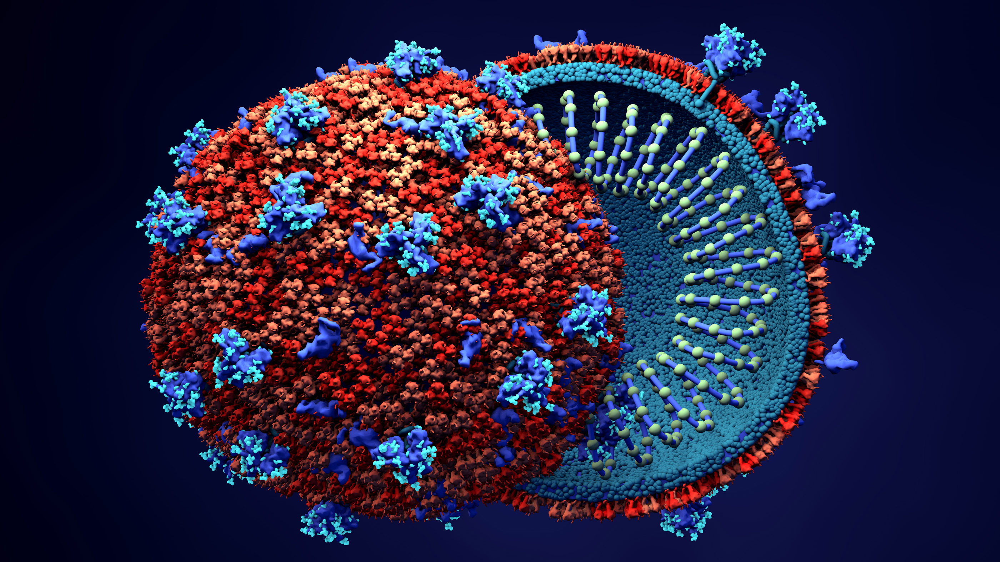

{fig-align="center"}

*Estraneità tra corpi e salti di specie. Esperimenti sociali e fallimenti della società. Virus, infodemia, scrittura. Comunità umana e pensiero non umano. La politica del corpo e la grande salute.*

FP: "*Aggredior Virus*" è il titolo del saggio che lo scrittore e filosofo Claudio Comandini ha dedicato durante il lockdown al tema del coronavirus. Un *istant book* basato su quanto stava accadendo, in Italia e nel mondo, per gli effetti del *«tempo sospeso»* eppure distante e inafferrabile che sembrava di vivere stando chiusi in casa senza contatti diretti con altre persone, fossero anche gli effetti più cari. Un isolamento di protezione imposto dai tanti governi nazionali che hanno seguito le indicazioni del mondo scientifico e sanitario, spesso controverse e contraddittorie, ancor oggi prive di un'affidabile sintesi risolutiva. Il libro di Comandini, presentato anche attraverso le dirette Facebook della redazione de *"Il Tuscolo"* durante il lockdown, ha incuriosito coloro che hanno interesse verso gli aspetti sociologici che seguono e procedono momenti di particolare importanza della contemporaneità e che vogliono comprendere gli effetti che un determinato accadimento è capace di provocare sui comportamenti dei singoli e delle masse globalizzate. In quattro paragrafi, l'autore esplica alcuni degli argomenti con cui si articola il piano del libro muovendo riflessioni che permettono di capire cosa sembra accaderci.

*CC: «Se in Italia come nel mondo intero la pandemia ha manifestato l’estraneità tra corpi individuali e corpo sociale, le cause della SARS-CoV-2 e di altri virus zoonotici sono da cercare, come aiuta a comprendere David Quammen, nella profonda alterazione subita dagli equilibri naturali a seguito dei processi di antropizazzione e industrializzazione. Come reazione alla diffusione del virus, tutto il mondo si è arrestato: le reazioni sono state perlopiù inadeguate ladddove hanno confuso i modelli astratti con la complessità del reale. E se in Italia, come riconosciuto da analisti quali Federico Petroni, era in gioco una sorta di esperimento sociale che doveva garantire la tenuta del Paese, oggi il Paese stesso e i suoi equilibri sono a rischio, determinando una situazione che, come il virus, sembra tanto diffusa quanto inafferrabile.*

*La presunta razionalità ostentata da scienza e politica è stata così fortemente condizionata dall’imperversare dell’infodemia, che la Treccani definisce quale eccesso di informazioni costituite e diffuse senza criterio. Tale situazione è determinata dalla comunicazione che, come segnalava Mario Perniola, rappresenta l’opposto della conoscenza in quanto non tende a diffondere le idee, ma piuttosto a distruggerle. La sua nefasta influenza sulle scelte collettive, rimarcata dall’uso improprio dei dati personali emerso con lo scandalo della Cambridge Analytica, ha preceduto, accompagnato e segue la pandemia, e sono parimenti virali e tossiche. Peraltro, i due fenomeni trovano particolare analogia: se il filamento di RNA con cui si diffonde il virus ha quale esclusivo compito il proprio cieco e ostinato riscriversi, i media portano a viralità e quindi a continua riscrittura notizie spesso infondate nonché manipolate. Ambedue, per quanto non propriamente morte, sono lontane dalla vita.*

*Il mondo dei media si è quindi sovrapposto a quello reale pretendendo che esso e il virus fossero gli unici vincoli in grado di tenere insieme il mondo: indispensabile tornare a considerare come i rapporti che lo costituiscono non si risolvono soltanto in quelli stabiliti dal contagio e dall'informazione, soprattutto laddove proprio la pandemia ha evidenziato le inadeguatezze di letture quantitative e le disparità delle condizioni concrete. È quindi necessario comprendere le problematiche di lungo periodo e le distinte impronte culturali di Paesi quali Italia e Germania, in relazione dinamica da secoli, e di quelle che caratterizzano USA e Cina, che nel nostro tempo sono le nazioni che si sfidano maggiormente. Contestualmente, è compito di ognuno promuovere un’interazione costruttiva tra singolo e comunità che, in una linea di pensiero che possiamo ritrovare negli Atti degli Apostoli come in Marx, possa porci in condizioni di superare il neo-liberismo e la sua logica di sfruttamento, nonché di operare una conversione ecologica dell’economia che non si risolva in un sordido riciclaggio del capitalismo in salsa verde. Riuscire ad afferrare nella vita concretamente vissuta il tempo che a noi si offre permetterebbe di rompere l'inganno di quella sua inafferrabilità con la quale il lockdown ce lo ha imposto.*

*In questa riappropriazione di vissuti profindi, la riscoperta di aspetti simbolici e storici, che può coinvolgere le immagine sacre dell’Urbe nonché elementi di culture apparentemente altre eppure vive e presenti, quali quelle rappresentate da I-Ching e Cabala. Soprattutto, contro la pretesa di fondare l'esistenza personale e collettiva sull'onnipresenza della malattia, va fornita centralità ad un corpo concepito quale unità psicofisica capace di portare coscienza e salute. E, di fronte ad un mondo che si è dimostrato lontano persino da se stesso, al cospetto di un pensiero che non ha saputo accoglierlo in nessun modo, soprenderci a scoprire che concetti quali quelli tematizzati da Eugene Thacker relativi alla radicale impensabilità del mondo e al carattere non umano del pensiero possono rappresentare una risorsa da opporre a quanto, come ammoniva Nietzsche, proprio nel suo essere “umano, troppo umano” si è dimostrato dannoso nei confronti della stessa umanità. Tutto ciò, come il tempo da ritrovare e vivere, è in qualche modo già a portata di mano: riusciremo però a comprenderlo?*»

•

*Da «Il Tuscolo» a. 27 n. 217 Luglio/Agosto 2020 (rivisto e ampliato).*
