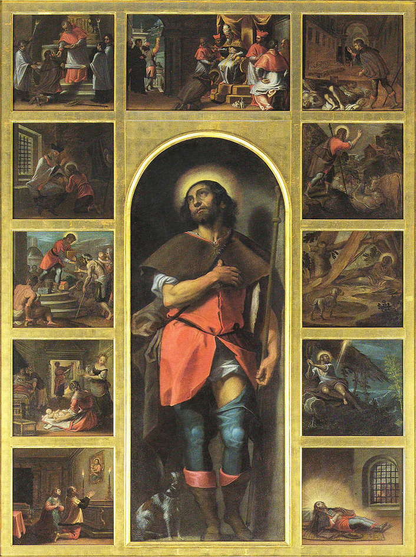
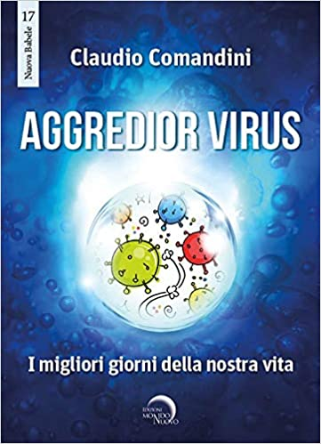

{fig-align="center"}

*Thacker e l'impensabilità del pianeta. Oltre l'umanesimo e il transumanesimo. Le vite estreme dei santi. San Rocco amico degli appestati nutrito dal cane. La problematica dello spillover e i nuovi patti di convivenza tra uomo e natura. Il superamento dell'animalismo quale soluzione parziale. Il culto di S. Rocco a Frascati e nel mondo.*

L’orrore, come segnala il filosofo americano Eugene Thacker, ha maggiormente a che fare con l’angoscia della vita piuttosto che con la paura della morte, laddove concerne i limiti del nostro esserci: in tale dimensione, a riguardarci non è più il mondo soggettivo né l’oggettività della terra, ma il *pianeta in quanto impensabile*. In tale dimensione, va considerato che l’attività dell’impatto biologico comportato dalle epidemie passa attraverso i *corpi individuali* e le reti di scambio che costituiscono il *corpo sociale*; ne consegue che un duplice apparato concettuale, costituito da una parte da malattie infettive dovute a cause naturali, e dall’altra da biodifese legate a cause artificiali, renda la vita biologica addirittura un’*arma contro se stessa*. Il compito diventa così quello di trovare ad una pestilenza inumana un contenimento umano. 

Tuttavia, la militarizzazione della salute pubblica che pravale nelle risposte dei governi e l’ansietà che si diffonde nelle popolazioni non sanno fornire risposte risolutive, e rimane insoluto l’intreccio di biologia e teologia tipica della loro concettualizzazione premoderna. Questa, basata sulle nozioni di contagio, corruzione e contaminazione, destituiva l’opposizione tra *interno* ed *esterno* a favore di quella tra *vita* e *oltrevita*, collocando la crucialità del *Pharmakos* in una pervasività del contagio configurata come *emanazione* del divino e quale sua *arma*, mentre parallelamente il sovrano terreno incaricato a contenere il contagio controllava la pervasività della popolazione in modi affini al divino: in qualche modo, tale modello è tuttora operativo tanto nelle credenze personali quanto nelle pratiche collettive, indipendentemente dalle fedi e dalla tecnologia di riferimento. Thacker sembra così suggerire che l’instabilità delle categorie biologiche e teologiche proprie al mondo antico e medievale torni a riproporsi in un contesto che, tra secolarizzazione compiuta, scientismi falliti, ritorno del religioso e insorgenze magiche, ne favorisce il loro reciproco sconfinamento, e tale intreccio concettuale è *utile all’umana comprensione proprio in quanto inumano*. 

Tale orizzonte filosofico sembra particolarmente puntuale laddove le circostanze che accompagnano il verificarsi della pandemia sembrano segnare un duplice fallimento. Da una parte, quello dell’*umanesimo* consolatorio e compiaciuto, che appiattisce lo stesso uomo che esalta sulla solennizzazione di una sua pretesa parte migliore sempre altrove e perennemente da ritrovare, sui cui limiti nel comprendere quanto definiamo come *tecnica* e nel custodire quanto si offre come *essenziale* si è pronunciato da tempo Heidegger. Dall’altra, quello del *transumanesimo* facilone e delirante, che rende ridicole le pretese umane più estreme di immortalità declinandole in una banale mistica tecnologica e produttivista, i cui percorsi sono stati brillantemente tratteggiati dal giornalista d’inchiesta Mark O’Connell. Per quanto l’uno non possa nascondere di essere datato e l’altro si sforzi di essere di tendenza, le parentele nascoste di umanesimo e transumanesimo si compendiano nell’ostentazione di quanto, comunque vada, rimane un pensiero sin *troppo umano*. A questo sembra invece irriducibile, permettendo una rinnovata idea di umanità che si compie nel proprio stesso *superamento*, il confronto proposto da Thacker tra uomini e pianeta reciprocamente estranei e l’*inumano* che ne emerge connotando in maniera essenziale proprio il pensiero stesso. Ciò segna altresì il ripescaggio di idee da secoli relegate nello sgabuzzino del sapere. 

Tra queste, ritrova interesse l’*agiografia*: le vite dei santi assumono nuova importanza quali testimonianze di *alterità* radicale, e ritrovano attualità le epidemie dei tempi andati. Nella cristianità, tradizionalmente legato alla difesa dalla peste è San Rocco, nato a Montpellier nell’illustre famiglia dei Delacroix intorno alla metà del sec. XIV. Come riporta lo storico Domenico Seghetti, costui è ritenuto discendente da rifugiati della distruzione di Tuscolo, antica città della campagna romana, avvenuta nel 1191 per accordi tra i poteri di Chiesa, Impero e Comune di Roma. Spiccatamente dotato di carità cristiana e buona educazione, Rocco, rimasto orfano, parte dal sud della Francia e compie un pellegrinaggio verso Roma che coinvolge diverse città, continuamente impegnato a soccorrere i contagiati. Tra i centri da lui toccati, Parma, Bologna, Forlì, Cesena, Rimini, Voghera, in modo particolare Acquapendente e Piacenza, seguendo una scansione degli eventi che, con tutte le contraddizioni e le ingenuità tipiche del genere, ha i primi estensori in Francesco Diedo (*Vita Sancti Rochi,* 1479) e Domenico da Vicenza (*Istoria di San Rocco*, 1478/1480). 

La cura degli ammalati lo porta a contrarre il morbo, da cui guarisce, ma è incerto dove muoia. Il culto della sua figura si diffonde in tutta Europa e coinvolge anche città come Costanza, Norimberga, Maastricht. Papa Urbano VIII Barberini nel 16 luglio 1629, ricorrenza della morte del santo, ne estende la figura a difesa di tutte le epidemie per tutto il popolo romano. L’accompagnarsi costante del cane e del santo, che il folclo- re ha mantenuto anche nel *Fante di coppe* del mazzo di carte bresciano, rivela una loro parentela particolarmente prossima laddove, come era per Adamo nel giardino, sembra prescindere dallo stesso nome che alla bestiola può esser attribuito. I racconti della vita di San Rocco ne caratterizzano le abitudini come adeguatamente frugali, ed è il cane che ancora lo accompagna nelle iconografie ad aiutarlo nel sostentamento, rubando il cibo dalla mensa dei suoi ricchi padroni, *sovvertendo* così gli ordinari rapporti tra classi sociali. A ciò si accompagna anche la sfida verso l’opposizione tra vita e morte, inevitabile laddove si frequentino gli appestati; tale disposizione diventa segno di una *carità integrale* che si rivela non soltanto quale amore degli uomini verso Dio ma, come segnala Perniola, come amore di Dio nei nostri confronti, pura *caritas* esente da interesse e moralismo, diretta ad un servizio offerto alla società capace di *apprezzare* l’essere umano piuttosto di svilirlo. 

Il cane di San Rocco decostruisce con straordinario anticipo le dicotomie tipiche dell’ordine capitalista e radicalizza le esigenze di un socialismo a venire. Nessuna estrazione di plusvalore dal lavoro salariato, nessuna accumulazione originaria, nessuna appropriazione dei corpi e del lavoro non riconosciuto e non pagato. E nel portare alle conseguenze ultime l’economia del *dono*, questo cane riesce a prescindere anche da quello strano prodotto della società del benessere che estremizza il vezzeggiamento dell’animale credendo che l’emancipazione di questo si compia nella sua antropomorfizzazione estrema. E lo stesso *antispecismo*, quantomeno quello più aberrante, viene così confutato prima ancora del suo nascere, in quanto diventa evidente che l’animale può prendersi cura di noi soltanto dove noi sappiamo prenderci cura di lui, dato che il nostro *specifico* si compie anche in questo, e non c’è nessuna *discriminazione* quale quella vaneggiata dal docente di bioetica australiano Pete Singer, laddove tra uomo e animali gli interessi sono i medesimi e ognuno serve l’altro. E per quanto oggi lo *spillover* problematizzi i rapporti di specie, e trovi particolare importanza la concezione, sostenuta dal progetto One Health della virologa Ilaria Capua, per cui la salute umana va associata a quella animale e a quella dell’ambiente, non possiamo certo delegare agli animali la risoluzione dei rapporti di forza che assediano tanto l’uomo quanto la natura, a meno di non ritrovarci in una *fattoria degli animali* globale dove la stessa loro antropizzazione prevalga su ogni specificità e tutti prendano le malattie di tutti, senza più salute per nessuno. San Rocco e il cane riescono ad andare oltre tutto questo e possono così ricordare l’esigenza, per il nostro stesso sussistere, di stabilire *nuovi patti* di convivenza e collaborazione tra l’uomo o quel che ne resta, e quanto tuttora nonostante gli scempi chiamiamo ancora “*natura*”. 

L’erede più prossima della potenza tuscolana, il luogo dal quale San Rocco trova le sue più remote origini, è quindi Frascati; l’area e le vicende tuscolane trovano interesse generale in quanto permettono di focalizzare questioni decisive per l’Urbe e le sue dinamiche storiche e culturali. Qui nel 1656, sotto papa Alessandro VI Chigi, quando l’ancora fiorente *civitas* ha comunque ormai perduto il privilegiato ruolo di residenza papale, viene effettuato il ritrovamento degli affreschi di San Rocco e San Sebastiano nell’antica chiesa di Santa Maria *in Vivarium*, il cui nucleo originario è costruito tra i ruderi della villa neroniana sui quali sorge il nucleo della cittadina. Mentre sono coinvolte nel contagio, oltre Roma, anche Palestrina, Albano, Marino, nonché la limitrofa Grottaferrata, a Frascati il ritrovamento di questi affreschi *dimenticati* segna lo scampare dalla peste, ed è subito proclamato il miracolo, al punto che nei confronti delle immagini i coevi documenti del consiglio comunale parlano addirittura di «*apparizione»*. Nella circostanza, la chiesa di Santa Maria, la cui prima citazione nei documenti risale all’876 e ha ruolo di cattedrale dal 1538 al 1636, riceve anche la dedica a San Rocco. Nei confronti degli affreschi, mons. Leonello Razza avanza l’ipotesi che siano databili all’epoca del cardinal d’Estouteville, a cui si deve la risistemazione di chiesa e piazza, e quindi al tardo 1400. Al primo quarto dello stesso secolo risale invece l’associazione di San Rocco e San Sebastiano, promossa da Martino V Colonna che, riportando dopo il concilio di Costanza il papato a Roma, trova la città devastata dall’ennesima epidemia di peste. 

Da parte sua San Sebastiano, soldato romano di alto rango, comandante della prestigiosa prima corte pretoria a difesa dell’imperatore, martirizzato da Diocleziano per la sua fede cristiana, trova a Frascati un culto piuttosto antico e un ospedale a lui dedicato risale già al 1518. Dimostrando scarsa intelligenza urbanistica, tale edificio viene demolito nel secondo dopoguerra, mentre risale addirittura al sec. II una basilica che poi venne a lui dedicata, e che Duchesne, comunque piuttosto isolato tra tutti gli storici, assimila proprio alla chiesa di Santa Maria dove si verifica il ritrovamento degli affreschi. 

Sempre nell’anno 1656, fuori dal paese, non lontano da dove un secolo e mezzo più tardi un nuovo cimitero sostituisce quello dell’Ospedale di San Sebastiano, un’icona dedicata alla Maria Santissima *Salus Infirmorum* è istituita presso un’edicola campestre, popolarmente detta della Sciadonna dal nome di famiglia della *tuscolanae uxori* Lavinia Sciadonna che fu ivi seppellita, il cui cognome deriva da quello del soldato francese Chadon che per un periodo stazionò a Frascati. Mentre a Roma imperversa la peste, il paese offre ospitalità ad alcuni abitanti dell’Urbe ed è così estesa ai frascatani la cittadinanza romana, che ricevono inoltre l’enfiteusi di numerosi terreni a confine tra le due località, parte di una vasta serie di terre a uso civico il cui significato quali *beni collettivi* deve ancora venir adeguatamente compreso. Nel 1693 l’edicola della Sciadonna, sotto il pontificato di Innocenzo XII Pignatelli, diventa per iniziativa dell’arciprete della cattedrale Clemente Micara una piccola e graziosa chiesa. 

La cappella di San Rocco e San Sebastiano della chiesa di Santa Maria in Vivario viene ristrutturata nel 1713, in occasione di una forte mortalità di bestiame; il papa in carica è Clemente XI Albani, che accoglie a Roma il pretendente al regno di Inghilterra e Scozia Giacomo III Stuart, padre di Enrico che a lungo sarà vescovo di Frascati. Nel 1867, sotto Pio IX Mastai e poco prima dell’annessione di Roma al Regno d’Italia, mentre si diffonde un’epidemia di colera, la cappella viene decorata da Pietro Gagliardi e Domenico Jannetti, in modo particolare nelle lunette che celebrano il discoprimento delle immagini. Gagliardi effettua inoltre presso il Ninfeo di Villa Aldobrandini un affresco di San Sebastiano. La devozione verso le icone si rinnova in maniera significativa quando la *Salus Infirmorum* nel 1918 viene esposta sulla balconata della cattedrale di San Pietro perché interceda contro l’epidemia di Spagnola che funesta l’ultimo anno della Grande Guerra. Poi, per qualche altro miracolo, viene scongiurato il rischio dell’epidemia di tifo dovuto alla gran massa di morti provocati dai bombardamenti alleati dell’8 settembre 1943, nonché il progetto dei nazisti di dare alle fiamme il paese, dove era collocato il loro quartier generale nell’Europa del Sud che sono prossimi ad abbandonare. Dopo ciò, si fece finta di essere sani una volta per tutte. 

Nel 2020, con il diffondersi della pandemia di Covid-19, la figura di San Rocco, ormai diffusa in tutto il mondo, viene invocata a protezione contro il contagio con preghiere effettuate in diverse città della Francia e in alcune comunità cattoliche dell’Estremo Oriente quali Filippine, Hong Kong e Macao. In Italia, il principale centro viene attivato a Santa Rita da Cascia, mentre a Frascati la chiesa a lui dedicata resta, come molte altre, chiusa. Non si ricorda di commemorarne adeguatamente la figura nemmeno il vescovo Martinelli, tutto intento a benedire ramoscelli d’ulivo e a farsi riprendere per YouTube, dimostrando in maniera lampante come la cultura cattolica non sia affatto esclusivo appannaggio del clero, da parte sua niente affatto omogeneo. E così, se un tempo la comunità celebrava attraverso la figura di San Rocco la propria salute e apertura, oggi ogni comunità sembra *ammalata* e inabile a ricordare persino se stessa, pur se da se stessa è *incapace di uscire.*\
\
\
**RIFERIMENTI**

Eugene Thacker, *Tra le ceneri di questo pianeta* \[2011\], Nero Edizioni 2018.\
Martin Heidegger, *Lettera sull’umanismo* \[1946\], Adelphi 1995.\
Mark O’Connel, *Essere una macchina* \[2017\], Adelphi 2018.\
[San Rocco, «Wikipedia» (consultazione 1.06.2020).](https://it.wikipedia.org/wiki/San_Rocco)\
Mario Perniola, *Del sentire cattolico*, Il Mulino 2001.\
Massimo Filippi, *Il virus e la specie*, «AutAut», 14.04.2020.\
Pete Singer (a cura di), *In difesa degli animali* \[1985\], Lucarini 1987.\
[Ilaria Capua, *One Health Center of Excellence* (consultazione 09.06.2020).](https://ilariacapua.it/one-health-un-approccio-e-un-metodo-non-piu-rinviabili/)\
Domenico Seghetti, *Memorie storiche di Tuscolo antico e nuovo*, Tipografia Fratelli Pallotta 1891.\
Leonello Razza, *Santa Maria in Vivario*, Edizioni Vivarium 1975.\
Romano Mergé, *Frascati nella realtà documentata* - Vol. II, Amici di Frascati 1989.\
[Claudio Comandini, *La storia e i giorni. Le bombe su Frascati e la distruzione di Tuscolo*, «Scritture» 7.09.2016.](https://grandtour.shop/posts/pages/2016-09-07-8-settembre-frascati-tuscolo-comandini.html)

{fig-align="center"}

Tratto da: Claudio Comandini, *Aggredior Virus*, Edizioni Mondo Nuovo 2020, p. 97-103.

*Illustrazione: San Antonio Gandino, Polittico di San Rocco, 1590.*
