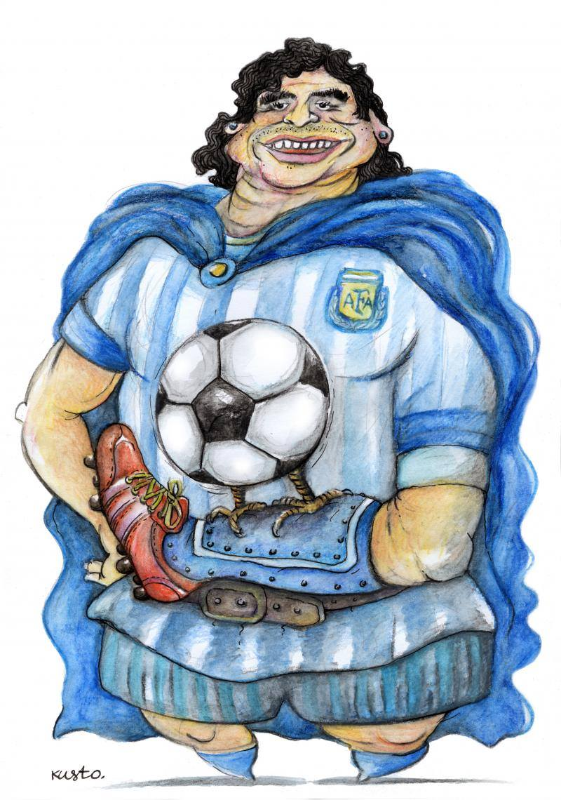

{fig-align="center"}

*Del significato extracalcistico di un protagonista di un tempo già passato.*

Non seguo il calcio, trovo volgare il tifo, tali fenomeni mi sono prossimi quanto l'astrofisica, che comunque mi coinvolge più di tante nostre miserie. E tuttavia, credo di essere in grado di rendermi conto che la dimensione di eroe popolare che Maradona è riuscito a conquistare ha coinvolto ben oltre uno sport, dimostrando così l'inadeguatezza della triste normalizzazione del *politically correct* nel leggere la realtà. Infatti, le note incongruenze del calciatore argentino, fragilissimamente e grandiosamente umano e capace di imprese quali presentarsi con l'autoradio dal papa e parlare di socialismo con Castro, possiamo tranquillamente lasciarle ai nostri spesso blandi esercizi di carità, che sarebbero certamente più significativi laddove non si riducano alla sviolinata insulsa; del resto, lui stesso ha dichiarato a diverse riprese di essersi in qualche modo redento - qualunque cosa ciò possa significare in un mondo non più cristiano ma troppe volte peggio che bigotto. E, valga quel che vale, la *mano di Dios* gli permise un decisivo gol contro l'Inghilterra, memore di cosa, pochi anni prima, accadde alla Falklands-Malvinas. E i cortei che lo hanno salutato sembrano rispondere pienamente a decreti altri rispetto a quelli posti in essere dal Covid.

Il talento del calciatore, gladiatore del nostro perenne basso impero, ha favorito per molti la sua elevazione al rango di artista. La questione, dietro l'apparente banalità, è delicata e controversa. Non è del tutto gratuita ed è evidente che nel suo mestiere Maradona a livello tecnico ha assommato, a competenze affini a quelle del danzatore, altre più propriamente marziali. Inoltre, tale attribuzione segna implicitamente la caduta del concetto di arte e al contempo una sua estensione, approfondendo ed evidenziando linee di tendenza piuttosto diffuse. E, se tale caduta è positiva in quanto emancipa dal mercato che ha fagocitato l'arte, questa estensione permette di comprendere l'arte quale *gesto*. Allo stesso tempo, ciò non salva affatto il calcio dalla finanziarizzazione che, insieme ad altre sfere del quotidiano, ormai lo domina, e tuttavia nemmeno restituisce a quanto chiamiamo arte una capacità di condividere immagini della nostra complessità. Ad ogni modo, se tutto ciò resta insoluto, di lui rimane, come di altri che ci stanno lasciando in questo presente così assente, il segno di un passato in qualche modo sospeso, pronto a distruggere un futuro inaccettabile alla cui svendita sembriamo costretti.

*Caricatura: Oleksiy Kustovsky*
