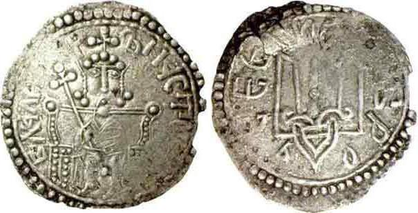

{fig-align="center"}

<em>Il conflitto in Ucraina non è scoppiato all'improvviso. La sua complessità si può individuare nel nome stesso dei suoi protagonisti, Putin e Zelensky, che hanno lo stesso nome detto in modo diverso, peraltro quello del principe Vladimir, il primo variago a convertirsi al cristianesimo ortodosso. La civilizzazione russa si afferma infatti per effetto delle migrazioni vichinghe a Kiev alla fine del IX sec. e si pone a cavallo di Europa e Asia, e già questo fa comprendere le sue peculiarità. Tra queste, uno stretto rapporto tra popolo e territorio, che la Russia esprime in senso federalista mantenendo ruolo al Patriarcato; da parte sua, l'Ucraina sta cercando di declinare in chiave nazionalistica tale elemento ratificando nel primo articolo della sua costituzione un'unità territoriale in realtà piuttosto tarda e surrettizia. Questo aiuta a comprendere che, per quanto la comunicazione tenti di annullarla, marginalizzando il ruolo della Russia e facendo prevalere gli interessi dell'Occidente a guida USA, anche il conflitto russo-ucraino ha una storia. Di questa sono tappe fondamentali la rivoluzione arancione apertamente sostenuta dagli USA del 2004 e il prevalere come presidente del già capo della banca centrale e filooccidentale Juščenko, e le manifestazioni di Euromaiden del 2013 sfociate nella destituzione del presidente filorusso Janukovyč e nelle proteste filorusse in Crimea e in Donbass. Il conflitto può avere quindi diversi livelli di lettura, e le complessità della cultura russa si accompagnano all'esigenza di controllo sullo spazio eurasiatico ponendo in gioco da una parte le istanze di un mondo multipolare e dall'altra quelle di una globalizzazione a guida unica. Viene qui offerta quale strumento di comprensione, per coloro che non si accontentano di essere destinatari e strumenti di bieche propagande, una piccola antologia di testi, che già ha subito censura su quella macchina del consenso obbligato e felice chiamata Facebook. Tale censura è forse inutile visto il già enorme livello di condizionamento, ma ad ogni modo, a differenza di tanti post fatti a casaccio, questa scelta di testi è destinata a durare e a confermare i propri contenuti.</em>

## 1. Le origini (K. Boeckh - E. Völkl)

L'impero di Kiev (la Rus' di Kiev) fu una lega di regnanti che si formò, a partire dal X secolo, nell’Oriente dell’Europa medievale. Si trattava di un potentato slavo orientale condiviso, sebbene nel presente sia i russi, sia i bielorussi sia gli ucraini considerino la Rus' di Kiev la “*culla*” delle rispettive storie nazionali. La differenziazione etnica degli slavi orientali da cui si sono enucleati i popoli degli ucraini, dei russi e dei bielorussi ebbe inizio all’epoca della Rus' ma si concluse appena nel XVI secolo. Accanto alle tribù slave orientali vennero insediandosi in questi territori anche tribù finniche, baltiche e di lingua turca, motivo per cui è il caso di parlare di un conglomerato polietnico.[^1]

[^1]: Katrin Boeckh - Ekkehard Völkl, *Ucraina. Dalla rivoluzione rossa alla rivoluzione arancione* \[2007\], Bet 2009.

## 2. La frontiera reale e l'identità mitopoietica (E. De Rienzo)

Cos’è infatti l’Ucraina se non una terra di frontiera, priva di confini storici, nata dall’Unione di Lublino, come frattura della Rus' medievale e «*lacerazione della nazionalità russa*»,[^2] se non un «*vuoto geopolitico, poco più di un intermezzo territoriale, la cui assenza di unità effettiva ha risucchiato le potenze contigue in due guerre mondiali*»,[^3] se non una «*guerreggiata area di confine*» divenuta lo scenario delle '*bloodlands*' del XX secolo,[^4] se non, infine, l'esatto contrario di uno stato nazionale nel senso classico del termine, dove neppure «*la maggioranza etnica titolare ucraina costituisce una Nazione unificata, omogenea e coerente*»?[^5]

[^2]: Timothy Snyder, *The Reconstruction of Nations*, Yale University Press 2003.

[^3]: Andrew Wilson, *The Ukrainians. Unespected Nations*, Yale University Press 2000.

[^4]: Timothy Snyder, *Bloodlands: Europe Beetween Hitler and Stalin*, Basic Books 2010.

[^5]: Peter W. Rodgers, *Nations, Region and History in Post-Communist Transitions*, Ibidem-Verlag 2008.

\[...\] I governi occidentali hanno, invece, rinunciato alla possibilità di fare del territorio ucraino un'intercapedine neutrale tra i Paesi della NATO e la Federazione Russa e hanno deciso di trasformare l'"*identità ucraina*" in principio di contrapposizione, accettando senza verifiche «*il mito, radicato dell'autocoscienza nazionale di Kiev, dell'Ucraina, terra europea che si contrappone alla Russia, Potenza eurasiatica, come portatrice di un principio "repubblicano", antitetico a quello "dispotico" moscovita, e come modello di una società civile aperta, opposta ad un oppressivo statalismo assoluto*».[^6] È, però, il passato dei popoli, e non i loro tendenziosi esercizi mitopoietici, che ci consente di comprendere il loro presente.[^7]

[^6]: Vittorio Strada, *Europe. La Russia come frontiera*, Marsilio 2014.

[^7]: Eugenio De Rienzo, *Il conflitto russo-ucraino*, Rubettino 2015.

## 3. Il ponte e il fossato (H. Kissinger)

Troppo spesso la questione ucraina si è posta come una resa dei conti per decidere se questo Paese debba unirsi all'Oriente o all'Occidente. Eppure se il destino dell'Ucraina è sopravvivere e prosperare, essa non può divenire l’avamposto militare dell’uno o dell’altro schieramento ma deve trasformarsi, invece, in un ponte capace di unire e non in un fossato per dividere. La Russia deve rendersi conto che trasformare l'Ucraina in uno stato satellite e quindi espandere nuovamente i suoi confini la condannerebbe a ripetere il ciclo secolare della sua contrapposizione con Europa e Stati Uniti. L'Occidente deve capire che la Russia non tollererà mai che l'Ucraina possa divenire un Paese a lei estraneo e potenzialmente avverso. La storia russa iniziò nella Rus' di Kiev ed è lì che nacque la sua religione. L'Ucraina ha fatto parte della Russia per secoli e le loro storie si sono intrecciate anche prima di allora. Alcune delle battaglie più importanti per la libertà russa, da quella di Poltava del 1709, sono state combattute sul suolo ucraino. La Flotta del Mar Nero - il solo mezzo per la Russia di accedere al Mediterraneo - esiste come forza operativa solo grazie all'affido a lungo termine di Sebastopoli in Crimea. Anche dissidenti famosi come Aleksandr Solženicyn e Iosif Brodsky hanno sempre insistito sul fatto che l’Ucraina è parte integrante della storia russa: anzi, della Russia stessa.

L'Unione Europea deve riconoscere che la sua lentezza burocratica e la subordinazione dei suoi problemi interni e particolari alla soluzione delle grandi questioni strategiche di carattere generale durante i negoziati con l'Ucraina, hanno dato origine alla crisi odierna. La politica estera infatti, è l'arte di stabilire delle priorità. Una lezione, questa, che l'Europa di Bruxelles è lontana dall’aver appreso. Nell'attuale congiuntura, sono comunque gli Ucraini a restare l'elemento decisivo. Essi appartengono a una terra dalla storia complessa, teatro di conflitti dovuti all'esistenza di barriere linguistiche e religiose. Qualsiasi tentativo dell’Ucraina cattolica e di lingua ucraina di dominare l'altra Ucraina ortodossa e russofona condurrà necessariamente alla guerra civile e alla fine dell’unità nazionale. Considerare l'Ucraina come parte del confronto est-ovest, spingendola a far parte della NATO, equivarrebbe ad affossare per decenni ogni prospettiva d'integrare la Russia e l'Occidente - e in particolare la Russia e l'Europa - in un sistema di cooperazione internazionale. Una saggia politica statunitense verso l'Ucraina avrebbe dovuto cercare il modo per favorire l’intesa tra le due parti del Paese. L'America avrebbe dovuto favorire la riconciliazione e non, come ha fatto, il dominio e la sopraffazione di una fazione sull’altra. Per l'Occidente infine, la demonizzazione di Vladimir Putin non è una scelta politica: è solo un alibi che evidenzia drammaticamente l’assenza di qualsiasi scelta.[^8]

[^8]: Henry Kissinger, *How the Ukraine crisis ends,* «The Washington Post» 5.03.2004.

## 4. Le responsabilità dell'Occidente (J. J. Mearsheimer)

Gli Stati Uniti e i loro alleati europei condividono la maggior parte della responsabilità della crisi ucraina. Il nodo del problema è l'allargamento della NATO come elemento centrale di una strategia più ampia tesa a spostare l'Ucraina fuori dall’orbita della Russia e integrarla all'Occidente. Allo stesso tempo, l'espansione dell'Unione Europea verso est e il sostegno di Bruxelles al movimento democratico ucraino - che inizia con la «*rivoluzione arancione*» del 2004 - costituiscono altrettanti elementi di sovvertimento dell’ordine mondiale. Alla metà degli anni 1990, i leader russi si sono fermamente opposti all’allargamento della NATO e negli ultimi anni hanno messo in chiaro che non avrebbero accettato passivamente la trasformazione di uno Stato confinante, di massima importanza strategica, come l'Ucraina, in un bastione dell'Occidente.

Per Putin, il rovesciamento illegale del Presidente dell’Ucraina, filo-russo ma democraticamente eletto - che egli ha giustamente etichettato come un «*Colpo di Stato*» - è stata l’ultima goccia. Putin ha risposto impadronendosi della Crimea, prima che la penisola potesse ospitare una base navale della NATO, e decidendo di destabilizzare l'Ucraina fino a quando Kiev non rinuncerà al programma di entrare nel fronte occidentale. La reazione di Mosca era ampiamente prevedibile e tale da non riservare nessuna sorpresa. In fin dei conti, l'Occidente era entrato a piede teso del cortile di casa della Russia per minacciare i suoi interessi strategici fondamentali.[^9]

[^9]: John Joseph Mearsheimer, *Why the Ukraine Crisis Is the West Fault?*, «Foreign Affair» 21.08.2014.

## 5. Questioni di soldi (E. Verga)

Le attività di lobby a Washington sono registrate presso il [FARA](https://www.justice.gov/nsd-fara). Questo organo mappa la maggioranza le delegazioni o i singoli portatori di interessi che operano nella capitale americana. Tra le organizzazioni più attive, specialmente nel 2021, risulta la Ukrainian Federation of Employers of the Oil & Gas Industry (di seguito [UFEOGI](https://frng.org.ua/en/pro-nas/frnh)) che rappresenta gli interessi delle aziende di petrolio e Gas ucraine. Nel 2021 la UFEOGI ha assoldato e pagato 840.000 dollari alla [Yorktown Solutions](https://www.opensecrets.org/fara/registrants/D000071696) per operazioni di lobby verso politici americani, media e think tank. Il contratto, come riportano i [file](https://efile.fara.gov/docs/6491-Exhibit-AB-20211230-27.pdf) di FARA, è stato rinnovato per tutto il 2022.[^10]

[^10]: [Enrico Verga, *Ucraina, è una questione di soldi e la guerra è già in corso a Washington*, «ilSole24ore», 15.02.2022.](https://www.econopoly.ilsole24ore.com/2022/02/15/guerra-ucraina-washington/)

## 6. Il fallimento di tutti (A. C. Kuchins)

Perché Putin ha agito ora? Perché l'Ucraina stava pericolosamente (dal suo punto di vista) scivolando verso Occidente. Gli astronomici livelli di corruzione del Paese hanno rappresentato un freno poderoso al suo sviluppo e al pieno dispiegamento della sua sovranità. Inoltre, a 69 anni Putin non vede probabilmente alcun successore che voglia e possa completare il suo messianico disegno di ripristino della grandezza russa.

Questo crea un enorme dilemma geopolitico per gli Stati Uniti e l'Europa. Nessuno è pronto a dispiegare truppe NATO al fianco delle forze ucraine rischiando uno scontro diretto con la Russia, potenza atomica. Le opzioni strategiche euro-statunitensi scontano serie limitazioni. Le pesanti sanzioni imposte a caldo erano state messe in conto da Putin, tant'è che non l’hanno distolto dalla guerra. Mosca ha il coltello dalla parte del manico: da un lato l'Occidente restio a combattere e con le mani parzialmente legate sulle sanzioni; dall'altro Putin che politicamente non può permettersi di perdere (contro) l’Ucraina, il cui esercito è nettamente inferiore al suo.

Comunque finisca, stiamo entrando in una nuova éra dove la linea che bisecava Berlino nella guerra fredda si sposta ora al confine orientale della UE, o forse dentro ciò che resterà dell'Ucraina. Ma le implicazioni saranno molto più ampie. Come minimo l'idea statunitense di concentrare attenzione e risorse sulla Cina sarà compromessa. Inoltre la NATO ne esce ricompattata come mai dal crollo dell'URSS, ma con quali effetti sulla propensione degli europei a rendersi militarmente più capaci? A dispetto delle evidenze, forse il ritorno della minaccia russa li spingerà a dotarsi di quella parziale autonomia strategica che sin qui è mancata. Di certo il mondo è diventato più pericoloso e imprevedibile.

In una prospettiva storica, ho sempre creduto che il nobile obiettivo di un'Europa «*integra e libera*» presupponga una Russia sicura, ascoltata e rispettata nel sistema di sicurezza europeo. Sotto questo profilo abbiamo fallito tutti. Russi inclusi, ovviamente.[^11]

[^11]: [Andrew C. Kuchins, *L’Ucraina paga anche gli sbagli dell’America*, «Limes - La Russia cambia il mondo», 2/2022.](https://www.limesonline.com/rivista/l-ucraina-paga-anche-gli-sbagli-dell-america-14639458/)

## 7. Il Trizub e la Russia

Le prime monete dell'antica Russia sono state rinvenute sul territorio del Principato di Kiev. Quelle di oro e argento coniate dal 980 al 1015 avevano da un lato l'immagine e il nome del principe Vladimir, convertitosi al cristianesimo ortodosso di Bisanzio, dall’altro il Trizub, il tridente che rappresenta quindi, oltre al simbolo dell'attuale Ucraina, un elemento comune all'intera storia della civiltà russa.

<em>Immagine: Le monete del principe Vladimir.</em>
