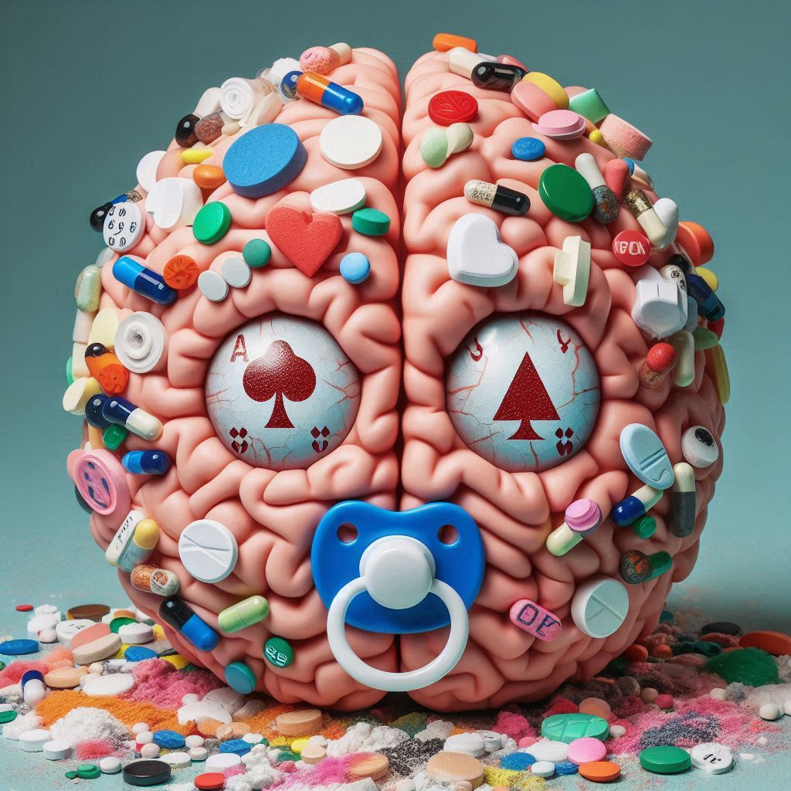
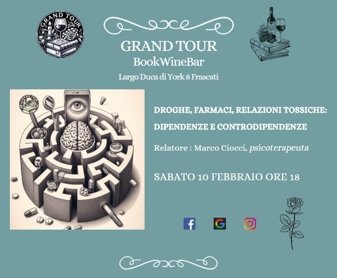

{fig-align="center"}

*In che modo piacere e sofferenza rappresentano possibilità di conoscenza, nonché di incontro e di scambio? Rispetto alle sostanze psicotrope, qual è la linea di confine tra l'uso e l'abuso, e dove si innesca la tossicità? In che modo queste inibiscono e ostacolano la crescita personale? In quale prospettiva possono permettere consapevolezza?*

«*La sostanza ha già una sua poltrona nella mente, ma se quella poltrona viene chimicamente occupata, c’è il rischio di una congiuntura pericolosa tra fisico e psichico, poiché 'da vicino, nessuno è normale'*». Già queste parole di Franco Basaglia fanno comprendere come la condotta *drogastica*, cioè basata su abuso sistematico di sostanze psicotrope, di farmaci e di alcool oppure sul loro uso abituale compulsivo, non trovi sostegno in forme di razionalità o in logiche strutturate, e piuttosto segnali quanto profondamente la nostra mente abbia radice e natura somatica.

Per comprendere tale problematica, occorrono alcune precisazioni: se il termine *mente* si riferisce perlopiù alla rappresentazione del complesso degli aspetti psicofisici riconducibili alla facoltà di pensare così come viene studiata dalla Filosofia, *pensare i pensieri* rappresenta soltanto una piccola parte dell’uso della mente. Infatti, la mente raccoglie ed elabora segnali ormonali legati a ciclicità metaboliche, le quali a loro volta sono condizionate dallo stato funzionale complessivo del corpo e dalle rappresentazioni correnti sintetizzate più o meno consapevolmente dalla mente stessa. Invece, da parte sua, il corpo simbolico elaborato dalla mente è un corpo metafora che va ben al di là del corpo somatico, il quale viene quindi investito di significato, oggetto significante in quanto rappresenta *istanze, aspettative e desideri*; ad esempio, esso può diventare campo di battaglia di ingiunzioni genitoriali, veicolo di tensioni ossessivo/compulsive oppure di idealizzazioni legate a chiusure narcisistiche. Tale complessa processualità fa intuire quanto la mente sia continuamente implicata nella corporeità e di questa sia intrisa. Una concezione *dicotomica* di tipo cartesiano risulta semplificatoria nel rappresentare l’essere umano, mentre quella di Spinoza, che trasfonde il *deus sive natura* in *mente sive corpus*, risulta decisamente più vicina all’intima embricazione tra corpo e mente, psicosomatica e sogno, raggiunta dai risultati convergenti di neurofisiologia e psicoanalisi.

Pertanto, quando parliamo di aspetti tossicomaniaci, ci troviamo necessariamente a parlare di fenomeni legati alle dinamiche degli affetti, a quelle della dimensione estetica nell'accezione di esperienza psicofisica. Le dimensioni affettive prendono consistenza fin dal primo incontro tra individuo e ambiente che, se vogliamo considerare l'*amnios,* avviene nel corpo materno, in cui tutto è dato in un soddisfacimento anogettuale che non richiede azione. Successivamente, dopo la nascita, il seno nutriente della madre, il suo corpo avvolgente nell’abbraccio, il suono delle sue parole, provocano vibrazioni che penetrano quella sensibilità uditiva già incontrata fin dai tempi dell'*amnios*. «*Ogni volta che il bambino ritrova il seno dopo averlo perduto si mette in moto un processo maniacale mediante il quale l’Io e L’ideale dell’io vengono a coincidere*»: Melanie Klein fa comprendere che il latte non è soltanto cibo, ma è rassicurazione nel controllo dell’oggetto, cosi come lo è il capezzolo e come quindi lo sarà il ciuccio.

La parola tossicomane trova perlopiù due accezioni: la più utilizzata riguarda un uso smodato e continuativo di una sostanza psicotropa, mentre l'altra riguarda lo stato maniacale indotto dalla sostanza psicotropa. Concentriamoci su questo secondo significato, cercando di comprendere quale siano i funzionamenti mentali più predisposti a trovare nella sostanza psicotropa un mezzo di alleviamento delle proprie sofferenze. Questo può essere trovato, per quanto anche il pensiero ossessivo martellante, spesso posto a difesa dal vuoto depressivo, possa spingere verso una difesa ottundente o maniacale, nel quadro depressivo. E la strutturazione depressiva può essere pensata come un freno posto su un'oralità in pieno vigore, animata da componenti sadiche e aggressive connaturate alla pulsione e alle sue frustranti vicissitudini, ben descritte da Melanie Klein in invidia e gratitudine.

Tale spinta libidica potentissima legata alla fase orale, che il piccolo dell'uomo vigorosamente esprime con grida e alti lai, diventa inoltre fonte di rabbia e odio verso l’oggetto, con spinte fameliche colorite di avidità e aggressività, ed è causata dalla ricorrente frustrazione cui va incontro il piccolo percependo la mancanza o quantomeno il non assoluto controllo del seno. Al contempo, il piccolo umano sa che se tagliasse con la mamma perderebbe la sua fonte di vita e calore quindi, invece di mandarlo in malora, cerca assolutamente di mantenere il legame assumendo l'oggetto dentro di sé. Questa *introiezione/incorporazione* risente di tutte le caratteristiche del funzionamento mentale del periodo, piuttosto vigoroso e intenso, decisamente legato alle componenti fisiologiche del bisogno e scarsamente in grado di posporre e mentalizzare l’esperienza. Siamo più nell'area dell'originario, non si è ancora formulato il desiderio che sarà già un derivato della rappresentazione simbolica, con la strutturazione dei personaggi del teatro edipico.

La dipendenza assoluta del proprio benessere psicofisico e l'investimento verso la figura materna provocano ambivalenza e aggressività, l'assenza di controllo spinge alla proiezione del proprio odio nell'oggetto che odia e sadicamente fa sentire la sua mancanza.

Tuttavia, nello stesso tempo, l'*Io* fa di tutto per mantenere un legame con l’oggetto. Freud descrive adeguatamente nei processi di lutto e melancolia l'incorporazione dell’oggetto per mantenerlo sotto il proprio controllo, ma a questo punto l’incipiente potere assunto dal *Super-Io* bombarda l'io e l'oggetto introiettato, dando inizio a tutti i conflitti relativi alla dipendenza e alle forme sostanziali, caratteristiche del depresso, di dipendenza e di mancanza. Scissione, diniego e proiezione, in altro modo presenti anche nella condizione maniacale, vanno quindi a costituire il funzionamento depressivo; peraltro, lo stato maniacale, nella condizione di affaticamento e implosione dell'Io schiacciato e messo alle strette dal dolore depressivo, è quanto di più può sedurre e sostanzialmente allontanare dal vissuto depressivo stesso. Nello stato maniacale l'individuo non avverte più il peso flagellante del *Super-Io*, impiegando quindi scissione e diniego per non vedere e non sentire il senso di colpa e le angosce relative alla dipendenza percepita quale irrisolvibile e menomante e in effetti ineludibile.

Così, attraverso la mania, l'individuo si prende una sorta di ricreazione dal vuoto e dal dolore depressivo, ma è una ricreazione drammatica: l'*Io* non vorrebbe più rientrare in classe e c’è effettivamente rischio che scappi dalla scuola, cioè che perda di vista la realtà e, pur di non fermarsi e attendere di capire, proceda per evitare le pause e le attese che rimandano di nuovo all’orrida dipendenza e all’odio depressivo verso se stessi. Tale condizione impedisce quasi ogni movimento soddisfacitorio: infatti, come potrebbe una persona che provasse un profondo disprezzo di sé concepire di stare tra gli altri senza sentirsene rifiutato, mal visto, giudicato negativamente, non trattato bene, ritenendo peraltro che gli altri abbiano addirittura ragione?

Un'alternativa a ciò è lottarvi contro, eppure non passarsela affatto bene: la rabbiosità del depresso è colorita da una continua rivalsa contro quanto ritiene essere un pessimo trattamento ricevuto dagli altri, tirando spesso in ballo il mondo nella sua totalità. L'odio e l'invidia per quella leggerezza e spensieratezza che egli immagina negli altri, la sua permalosità alimentata dalla continua proiezione negli altri della propria personale disistima, rappresenta il versante del depresso che fa in modo che lui percepisca la neutralità come una forma di non-considerazione, e che l'affabilità venga considerata quale un inganno o un errore che altri commettono in quanto lui non la merita affatto. La trappola è tale anche perché il depresso rimane incastrato nelle sbarre costituite da rabbia repressa, dolore, contrizione, inibizione, autoannichilimento.

"*L’ombra dell’oggetto caduta sull’Io*" rappresenta uno sfondo di malessere da cui diviene facile percepire il rifiuto altrui, e in questo gioco proiettivo ad innalzarsi è una cortina di angoscia. Questa costituisce però anche la spinta che conduce ad oscillare tra la scissione e la proiezione del proprio odio verso l’oggetto d’amore introiettato, e il mettere l'odio e il disprezzo fuori di sé negli altri definisce una condizione tormentata e a volte sfiancante che si colloca tra l'immedesimarsi nella posizione masochista soddisfacitoria e una pozione disperata o arrabbiata maggiormente integrata con il disprezzo altrui.

Si può così comprendere come la mania appaia addirittura come un soccorso per questa condizione affettiva fustigante e diuturnamente patita. Certamente, non c'è calore nella mania, non ci sono affetti, spesso lo stato maniacale è soltanto una bramosia corrente che accelera e in parte anestetizza, impoverisce la relazionalità di componenti empatiche e affettive, e tuttavia permette con certezza di fuoriuscire dalla trappola depressiva e allevia il dolore psichico. Tale stato, in cui si presume di possedere la chiave gestionale della realtà, libera da quel coacervo di rabbia, dipendenza e senso di colpa che connota la vita del depresso. Infatti, in tal modo il piacere e il desiderio non sono legati all'altro: meglio ancora, il piacere viene *autoprodotto* dall’attività maniacale, la possibilità di allontanarsi parzialmente dall’angoscia depressiva rendono autoreferenziale la condotta, cosicché i sentimenti di dipendenza, avidità e ambivalenza possono venir denegati. In certi quadri clinici maniacalità e depressione riescono quasi a convivere, nel senso che una richiama l'altra dando luogo alle note oscillazioni *maniaco-depressive*.

Un mio paziente, un professionista sui 35 anni, mi riferiva di quanto per lui fosse difficile, addirittura impossibile, ballare in pubblico se non bevendo: "*questo fatto di muoversi al ritmo della musica mi sembra un’inutile pagliacciata ridicola, l’unico modo per riuscire a ballare è bersi 4 o 5 shottini, non capirci più niente e a quel punto iniziare a ballare*". Dagli alcolici, passava all'haschisch e alla cocaina seguendo uno schema ripetitivo. Il giovane uomo presentava nei primi incontri una condizione di *ipomaniacalità*, con un’autoapprovazione a priori delle sue scelte, dei suoi gusti e della sua condotta, compiendo affermazioni autocelebrative del proprio modo d’intendere la vita. Anche descrivendomi la situazione del ballo, la riferiva presentando la cosa nei termini della necessità di bere alcool in modo da adeguarsi al rituale sociale del contesto nonché dalla necessità di approcciare donne: non si chiedeva affatto cosa ci vedesse lui di ridicolo nel ballare, non voleva in nessun modo soffermarsi a vedere qual era l'aspetto propriamente ridicolo che vedeva immaginando sé stesso muoversi al ritmo della musica, mentre al contempo in numerose circostanze trovava ridicoli gli altri. E al riguardo, nei primi mesi della terapia, non c'era seduta nella quale non trovasse ridicolo anche lo stesso stare in terapia e non dovesse sminuire la Psicoanalisi o il mio stesso modo di lavorare, laddove era lì proprio per cercare vie di uscita dalla continua ripetizione dei suoi passaggi tra esaltazione e svuotamento.

Una duplice condizione, nella quale si può rimanere bloccati per anni, coglie questo giovane uomo, spezzandolo tra angoscia da castrazione e idealizzazione, riattualizzando così una condizione subalterna e dipendente dall'oggetto nella quale viene percepito tanto un rifiuto del proprio desiderio quanto un vissuto di abbandono e insignificanza. Per liberarsi da tale condizione opprimente e castrante, nella quale si sente dipendente e desiderante, egli opta per il rendersi alticcio. A quel punto, avverte un senso di alterazione interna che non gli fa sentire le menomazioni prudenziali, avverte una sorta di autonomia e di leggerezza, un distacco dalle preoccupazioni del rifiuto e del ridicolo, una sicurezza sconsiderata che lo spinge a rivolgersi al femminile e poter dire qualcosa. Così, in qualche modo, riesce a relazionarsi presentando il desiderio, cosa che, laddove, impegnandosi nel nasconderlo pervicacemente, generalmente non si permetterebbe mai di fare. Il gioco sembrerebbe facile, la condizione alticcia fornisce una potenza antidepressiva che consente l’abbordaggio, ma quanto agisce è una falsificazione strutturale nella quale il *Super-Io* sembrerebbe messo per un po' semplicemente fuorigioco.

Certamente, questi sono quadretti tenui ed episodici, comunque niente affatto innocenti perché c’è una *condizione dissociativa* della struttura, ma ad ogni modo circostanziati: non rappresentano la condizione del quadro maniaco depressivo nei cui estremi il funzionamento mentale assume tali tratti di disconoscimento della realtà da poterli considerare propriamente *fenomeni psicotici*.

Pertanto, l'incastro dell’assunzione della sostanza con la struttura maniaco-depressiva potrebbe essere il creare uno scompenso rapido e liberatorio della struttura, liberando così l'*Io* e l'*Es* dal controllo minaccioso del *Super-Io*. La mania indotta va a far regredire il funzionamento depressivo dello scacco. L'oggetto amato-odiato è a tal punto sotto il controllo dell'utilizzatore e nulla più conta: la "liberazione" ottenuta diventa talmente importante da essere centrale da far sparire tutte le altre "piccole cose" che vanno generalmente a corroborare il senso di sé. In tale assetto tossico, la sostanza che ha fatto sparire l’ansia e l’angoscia utilizza difese come il diniego, la scissione, la proiezione: ma proprio queste stesse difese vanno a depauperare lo spessore dei rapporti con la famiglia, gli altri, il lavoro, in definitiva con la realtà.

Si è riaperto un antico funzionamento soddisfacitorio, una regressione ad una dipendenza orale, nell'oralità la brama è potente e incisiva, dal punto di vista fisiologico facilita il grido e l'intervento del *caregiver* - e non a caso, molte volte capita di constatare che pusher della sostanza è la madre stessa. Qui parliamo di oralità come condizione di assunzione dall'esterno che ripristina una condizione di trasformazione e soddisfacimento, non importa che sia endovena o attraverso la mucosa nasale.

La sostanza assume così la valenza di un oggetto assoluto, elicitando una condizione psicofisica di bramosia simile a quella di un neonato. Tutti ci siamo passati! Essere un tutt'uno con la fame e il desiderio, mentre giunge quel seno che salva dal vuoto e dalla solitudine, fornendo cibo, contatto e calore, e la sensazione di essere accudito. Sono aspetti fondanti la dimensione psicofisica dell’individuo che iniziano a strutturarsi dai primi mesi di vita: in quel periodo la mente è 'poca cosa', non c'è ancora un discorso nella psiche del bambino, non ci sono pensieri articolati che possano contenere le sensazioni corporee. La fame, il vuoto e il dolore sono lì adesso e il bambino urla, arriva la mamma e lui la divora letteralmente, riprende il possesso e il controllo del seno e della sua sopravvivenza. In quegli albori della psiche, il corpo e le sue tensioni sono autonome e incontrollabili, in buona parte, la mente ancora può fare poco. Per un adulto, vivere in una condizione cosi potente e travolgente di dipendenza è sconvolgente e drammatico, infine devastante.

Ricordo un altro paziente, un papà sconvolto e devastato dai sensi di colpa, che raccontava di aver avuto un rapidissimo accesso di dipendenza, nel suo caso *ludopatica*, e di aver preso e spaccato in bagno il salvadanaio dell'amato figlio per correre in una sala giochi con il ricavato, che ovviamente perse. Qui possiamo vedere come anche come i meccanismi psichici sono preesistenti alla dipendenza fisica provocate dalle sostanze e ne sono esattamente il presupposto. E ovviamente, dobbiamo altresì considerare come la dipendenza fisica crei ulteriori complicazioni, tanto psichiche quanto fisiche e comportamentali.

Una fame e un vuoto senza mente né memoria. Al contempo, tale regressione orale è intrisa di sadismo per quest’alternanza di vissuti di soddisfazione e perdita dell’oggetto che cominciano a prendere forma durante la fase orale, che Karl Abraham definisce *fase ambivalente dell’oralità*. Ma la componente distruttiva cannibalica, se troppo intrisa di odio, può nello stesso tempo incorrere nell’attacco inibitorio del *Super-Io,* e qui si va a delineare il quadro rallentato, inibito, annoiato del depresso. L’instaurarsi del funzionamento maniacale segnala il trionfo sulle istanze vincolanti e inibitorie del *Super-Io* del depresso, e la mania salta a piè pari i drammi della dipendenza che conducono alla depressione; i sentimenti aggressivi rivolti contro la figura che procura il piacere vengono così recepiti dal *Super-Io* e tengono sotto tiro l'*Io* del paziente. D’altra parte, se non se lo avesse nel mirino, esploderebbe una rabbia psicotica di distruzione del mondo; successivamente, quando va bene, tale circostanza verrà trasformata nel gioco del rocchetto descritto da Freud per le coazioni a ripetere in *Al di là del principio del piacere*.

Una prolungata e ripetuta circostanza di frustrazione condotta fino all'astinenza, cioè ad uno stato di deficit dell'organismo nei confronti del latte, dell’affetto, dell’apprezzamento, e quindi dai bisogni tanto fisici quanto mentali associati alla rappresentazione come ricco e rifiutante dell'azione dell’oggetto complementare, provocano quindi una dipendenza patologica e ambivalente, rabbiosa e rivendicativa. E questo è proprio il caso del paziente che assume gli *shottini* per ballare in quella che reputa "*una pagliacciata*". Egli, risultava di già fortemente limitato nella relazione dalle ingiunzioni familiari: non puoi giocare a calcio perché è volgare, non puoi guardare la televisione perché è diseducativa, non puoi mangiare i dolci, devi studiare violino, non devi fornire importanza ai vestiti per cui devi abbigliarti con indumenti semplici e al meglio usati. Nel suo quadro, tali *input* educativi, di per sé anche sensati, hanno creato un'astinenza, non di oggetti o dolci, ma di desiderio per il suo desiderio nel *caregiver*, senza nessuna concessione al piacere che crea condizionamento e dipendenza. E va a finire che ancora ragazzino già entra in coma etilico.

Il suo uso dell'alcool sembra legato alla necessità di agire contro il bambino voluto dalla madre, nel quale non viene concepita alcuna forma di piacere per il figlio stesso, facendo sì che nello stordimento e nella perdita di coscienza trovino appagamento le angosce mobilitate dal suo odio verso la madre e il padre, tenute mirabilmente a freno dal suo ordine, dalla formazione reattiva e dall’isolamento così massicciamente utilizzati.

Il dominio della gestione del piacere diventa quindi una rivalsa verso la dipendenza così frustrante vissuta nella rigidità e nella centellinizzazione subita, con sensazioni di trionfo per l’acquisito possesso delle fonti di piacere e per l'abuso compiuto. La liberazione sommaria dalla dipendenza e dalla rabbia si accompagna tuttavia ad un particolare senso di vuoto, determinato dal fatto che il piacere si è configurato quale un mezzo per contrastare il vuoto e le angosce persecutorie, non è stato determinato da un rapporto con il piacere che nasce, si sviluppa e si soddisfa creando sazietà.

Al contrario, il giovane uomo mio paziente che trovava una pagliacciata ballare, affrontava scorpacciate di piacere, facendone addirittura scorta oppure programmandole nello sforzo di assumerne quanto più possibile e così danneggiarsi. Portava almeno quattro bottiglie di vino ad una cena e poi sentiva che non poteva lasciarlo agli altri, programmava intense sessioni di passaggi per osterie, ristoranti, locali, alcool, canne e coca, "*serate in cui devo sfasciarmi*". Eppure, sentiva che stava dentro il banale mantenimento di un programma. Arrivava al punto di sentirlo come un dovere da adempiere che non dava lui alcun autentico piacere. Secondo lo schema descritto all'inizio, la sua mente raccoglieva segnali condizionati dallo stato funzionale complessivo del corpo e dalle rappresentazioni sintetizzate dalla mente stessa, che elaborava il corpo simbolico investito di significato e campo di battaglia di ingiunzioni, tensioni e idealizzazioni. Così, l'intima embricazione tra corpo e mente teorizzata da Spinoza e descritta da neurofisiologia e psicoanalisi riesce a rappresentare ad un tempo la problematica di uno stato mentale rappresentativo e la componente pulsionale psicosomatica collegata ad esso.

Per concludere: la sperimentazione *drogastica*, così come un comportamento *ludopatico*, possono ricevere un iniziale abbrivio dal desiderio di cambiare magicamente (chimicamente o meno) stato d’animo, ma tale tentazione rappresenta già il segnale di una intolleranza verso l'*algos* psicofisico della frustrazione, l'attesa che rimanda al limite e alla sua persecutorietà abbandonica, la profonda ambivalenza segnala la precarietà della assunzione dell'oggetto buono e l'insuccesso di questa acquisizione determina la mobilitazione di difese, ossessivo-compulsive o depressive. Intolleranza che può avviare quel circolo vizioso tra problematiche non sufficientemente esplorate e consapevoli e soluzioni d'emergenza che lasceranno il problema inalterato e il tempo consumato nel consumarsi alla ricerca dell’oggetto "felicitante" perduto.

*Tra gli argomenti della conferenza presentata il 10 febbraio 2024 presso il Grand Tour BookWineBar dal dott. Marco Ciocci, psicoterapeuta
e psicologo, in attività privata dal 1998, supervisore di operatori e
management del terzo settore, membro della Federazione Europea di
Psicoanalisi.*

{fig-align="center"}
