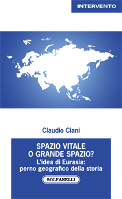

{fig-align="center"}

*"Se l’Ucraina vuole sopravvivere e prosperare, non deve essere l’avamposto di una delle due parti contro l’altra, ma deve funzionare come ponte tra loro." (Henry Kissinger) Questa frase dell'ex Segretario di Stato USA, non certo una colomba, descrive bene la frattura tra Oriente e Occidente e la mancata integrazione dell'Eurasia che il conflitto in Ucraina rappresenta. Due fazioni che non possono perdere si sfidano su una frontiera priva di confini storici e geografici che nega il proprio carattere composito per affermare un'identità surrettizia. Una Russia dalle pulsioni imperiali reclama la propria apertura sul Mar Nero, peraltro su territori russofoni la cui popolazione è stata costantemente perseguitata dal governo centrale ucraino; un Occidente a guida americana intende affermare la propria preminenza su uno spazio di civiltà dove la Russia rappresenta la sfera culturale più influente. Questa frattura, che si aggiunge a quella col mondo islamico, è decisiva per tutti gli equilibri a venire e servirebbe vederci chiaro quanto possibile: eppure, nell'agenda dell'infowar, la corruzione, gli scandali, le stragi avvenute in Ucraina non sembrano valere nulla di fronte agli interessi USA e NATO, prima del conflitto ampiamente considerati obsoleti. Ad ogni modo, laddove la guerra ha immediatamente determinato ampi spostamenti di interessi e già ha favorito soprattutto la Cina, principale avversario degli USA, l'Europa sconterà ancora di più la propria decadenza ed è essa stessa a ridursi a zona di frontiera. All'interno di tale contesto, all'Ucraina resta il bizzarro ruolo di nazione transgender, nata russa e luogo di nascita della Russia, che altresì pretende di diventare euroatlantica proprio nel momento della massima estraneità tra i due termini della transizione. E persino i protocolli che assegnano l'identità di Paese NATO e UE, quelli per i quali si è compiuto il suo sacrificio, vogliono essere trasgrediti, mentre i media sono obbligati a celebrare la libertà dell'Ucraina e ad alimentare le armi. Chi resterà nell'inevitabile rovina?*

## 1. "Al confine"

Dal 24 febbraio il mondo ha preso a correre a velocità folle. Verso dove non si sa o si preferisce non sapere. Cartografare questa corsa su scala planetaria per offrirne una visione d’insieme è temerario. Viviamo in una guerra a più dimensioni di cui è impossibile determinare gli esiti, salvo che muteranno i paradigmi fondamentali del potere. Illusorio pretendere di rifissarli ora.[^1]

[^1]: Caracciolo L., *Il silenzio di Puškin*, in «Limes. Rivista italiana di geopolitica», 2/2022, pp. 8-9.

La guerra in Ucraina sta ridisegnando la Carta dell’Eurasia. Questa è una consapevolezza di estrema importanza perché ciò che sta per essere ridisegnato non è il rapporto tra l’Ucraina e la Russia, tra la Russia e l’Europa, tra la Russia e gli Stati Uniti, in realtà è tutta l’Eurasia - potremmo anche dire tutto il pianeta - che è coinvolta in questa guerra *in fieri*[^2]. È la Guerra, storicamente, che definisce gli equilibri ed è proprio quello che uscirà dalla guerra ucraina che ridisegnerà la geopolitica futura.

[^2]: Mutuandolo dalla meccanica quantistica e volendolo applicare alle relazioni internazionali con i necessari distinguo che l’analisi del caso di specie impone, possiamo utilizzare il paradosso del gatto di Schrödinger, per spiegare che i due attori, Russia e Stati Uniti, potrebbero avere entrambi torto ed entrambi ragione. Così come nel paradosso illustrato dal fisico austriaco è impossibile sapere se il gatto rinchiuso dentro ad una scatola sia vivo o morto fino al momento in cui la scatola si apre così, anche in questo caso, non sapremo chi ha torto o ragione fino al momento in cui – saltate eventualmente tutte le possibili soluzioni diplomatiche – Washington o Mosca non diano inizio, l’una o l’altra, ad un’escalation militare.

Oggi ci siamo. Potevamo non esserci? Sicuramente sì. E se ci siamo nessuno è innocente. Non lo siamo noi occidentali, pure convinti di esserlo. A cominciare dagli Stati Uniti d’America, che vinta la guerra fredda senza davvero volerlo, non hanno saputo che fare dei vinti. Quando l’avversario ti crolla davanti e tu non sai come trattarlo, ne diventi prigioniero. La tragedia del non-rapporto fra America e Russia dopo il suicidio dell’Urss è tutta qui. Doppia afasia. Soliloqui spacciati per dialogo. Finché le parole finiscono e a parlare sono le armi. Russe.[^3]

[^3]: Caracciolo L., *Il silenzio di Puškin*, cit., pp. 15-16.

Più che mai nell’attuale congiuntura bellica, la linea di confine della guerra in corso è una linea di confine fra la Russia e gli Stati Uniti d’America, dove l’Europa, per l’ennesima volta, rappresenta più una sorta di teatro di battaglia non richiesto, non è una protagonista neanche nella mediazione.

D’altronde, U-kraina significa letteralmente "*al confine*".[^4] Ed è, giustappunto, il confine fra Oriente e Occidente, con questa guerra, che si sta semplificando, sta peggiorando da un punto di vista storico nel senso che sta aggravando lo iato esistente tra Oriente e Occidente: la spaccatura, la distanza che già c’era stata a partire dal 2001, con delle premesse negli anni precedenti, fra il mondo islamico e il mondo occidentale, adesso passa, obliquamente, anche attraverso l’Europa, separando l’Europa dalla Russia.[^5]

[^4]: Il toponimo Ucraina deriva dall’antico slavo orientale *u okraina*, formato da *u* (“vicino, presso”) e *okraina* (*“periferia”*) dalla radice slava *kraj* (*“limite, bordo”*). Pertanto ukraina significa *“al margine”* o *“sul confine”* oppure *“in periferia”*. In lingua ucraina *krajina* significa semplicemente *“paese, terra”*. *Kraj* e *krajina* sono termini semanticamente analoghi all’italiano *“marca”*.

[^5]: Del resto, l’Europa non è altro che una penisola geografica dell’Asia, non è un continente a sè stante perché il continente di riferimento è quello eurasiatico nel suo insieme dove l’eredità imperiale russa tende sempre a riemergere durante i secoli, perché la Russia è sempre stata un Impero e non uno Stato-nazione. Lo stesso dispotismo russo, che si è manifestato nel tempo fino ad oggi, è un dispotismo di tipo asiatico, è un’eredità mongola, gengiskhanide, che si riverbera e riaffiora come un fiume carsico nelle mentalità e nelle scelte politiche. L’Europa risente periodicamente di queste pulsioni asiatiche profonde.

## 2. Allargamenti e destabilizzazioni

Nell’incontro del 9 febbraio 1990, il Segretario di Stato USA, James Baker, aveva detto a Gorbaciov: "*Comprendiamo la necessità di fornire garanzie ai paesi dell'Est. Se la Germania rimane all'interno della NATO, non vi sarebbe alcuna espansione verso est della giurisdizione militare della stessa per il proprio esercito*"[^6] e aveva asseverato la stessa posizione sotto forma di domanda: "*preferiresti una Germania unita e indipendente al di fuori della NATO e priva di forze militari statunitensi, oppure preferiresti una Germania unita che ha legami con la NATO con l’assicurazione che l'attuale giusrisdizione di questa non effetuerebbe alcuna estensione verso est.*"[^7] Accordo verbale che non fu, certamente, rispettato così come fu ignorata l’esplicita protesta di El’cin al presidente Clinton durante l’incontro al Cremlino del 10 maggio 1995: "*Voglio capire meglio la tua idea di espansione della NATO, perché ora se procedi non vedo altro che umiliazione per la Russia. Come pensi possa sembrare che un blocco continui ad esistere proprio mentre il Patto di Varsavia è stato abolito? Si tratterebbe di una nuova forma di accerchiamento laddove l’unico blocco sopravvissuto alla Guerra Fredda si espandesse fino ai confini della Russia. Molti russi ne hanno paura e, considerando che Russia dovrebbe essere un partner, si chiedono cosa si voglia ottenere in tal modo. Lo chiedo anch'io: perché vuoi fare questo? Abbiamo bisogno di una nuova struttura per la sicurezza paneuropea, non di quella vecchia \[…\], e accettare che i confini della NATO si espandano verso quelli della Russia costituirebbe da parte mia un tradimento del popolo russo."*[^8]

[^6]: Così si legge nel [*Memorandum of conversation between Mikhail Gorbachev and James Baker in Moscow*](https://nsarchive.gwu.edu/document/16116-document-05-memorandum-conversation-between), 9.02.1990, p. 6.

[^7]: *Ibid*, p. 9. Si radica in questa visione concettuale l’obiettivo di espandere la NATO fino alle propaggini estreme dell’Eurasia; espansione che il Dipartimento di Stato USA pianificò in dettaglio già nel settembre 1993, prevedendo entro il 2005 l’ingresso nell’Alleanza di Ucraina, Bielorussia e Russia (cfr. Memo declassificato del Dipartimento di Stato USA, [*Strategy for NATO’s Expansion and Transformation*](https://nsarchive.gwu.edu/document/16374-document-02-strategy-nato-s-expansion-and), 7.09.1993, pp. 5-6.

[^8]: [*Summary report on One-on-One meeting between Presidents Clinton and Yeltsin*,](https://nsarchive.gwu.edu/document/16825-document-04-summary-report-one-one) Kremlin 10.05.1995, pp. 6-7.

Da questo punto di vista, è possibile affermare che la guerra in atto in Ucraina è la plastica rappresentazione e conseguenza dell’effetto destabilizzante della geopolitica americana di "*allargamento democratico*" sull’architettura di sicurezza europea.[^9] Tanto è vero che il padre della teoria del *containment* dell’URSS, George F. Kennan, quando l’8 luglio 1997 l’Amministrazione Clinton decide di invitare Polonia, Ungheria e Cechia a far parte della NATO entro il 1999, scrive nel suo diario il 31 luglio 1997: "*…Ho semplicemente il cuore spezzato per quanto sta accadendo ora. Non posso scorgervi altro che una nuova Guerra Fredda, che probabilmente culminerà in un conflitto aperto. Tale scenario vanificherebbe ogni sforzo di raggiungere una democrazia praticabile in Russia e condurrebbe alla totale, tragica e inutile disgregazione delle relazioni tra quel Paese e il resto dell'Europa.*"[^10]

[^9]: Su ciò si veda anche [*John Mearsheimer on why the West is principally responsible for the Ukrainian crisis*](https://www.economist.com/by-invitation/2022/03/11/john-mearsheimer-on-why-the-west-is-principally-responsible-for-the-ukrainian-crisis), «The Economist» 19.03.2022. Si consideri anche la [*Conferenza di Mearsheimer*](https://www.youtube.com/watch?v=qciVozNtCDM) presso l'European University Institute, 16.06.2022, pubblicata come [*The causes and consequences of the Ukraine war*](https://nationalinterest.org/feature/causes-and-consequences-ukraine-crisis-203182), «National Interest» 23.06.2022.

[^10]: Kennan G.F., 2014, *The Kennan Diaries*, New York-London, W.W. Norton & Company, p. 689.

Su questa stessa lunghezza d’onda si pone Henry Kissinger che nel 2014, subito dopo l’invasione russa della Crimea, scrisse: «*Troppo spesso la questione ucraina viene posta come una resa dei conti: se l’Ucraina si unirà all’Est o all’Ovest. Tuttavia, se l’Ucraina vuole sopravvivere e prosperare, non deve essere l’avamposto di una delle due parti contro l’altra, ma deve funzionare come ponte tra loro. La Russia deve accettare che cercare di costringere l’Ucraina a diventare uno stato satellite, e quindi spostare nuovamente i confini della Russia, condannerebbe Mosca a ripetere la sua storia ciclica di profezie autoavverantesi di pressioni reciproche con Europa e Stati Uniti. L’Occidente deve capire che, per la Russia, l’Ucraina non potrà mai essere soltanto un paese straniero. La storia russa è iniziata in quella che veniva chiamata Rus’ di Kiev. Da lì si diffuse la religione russa. L’Ucraina fa parte della Russia da secoli e le loro storie sono intrecciate già prima di allora.*»[^11]

[^11]: Kissinger H., *To settle the Ukraine crisis, start at the end*, in «The Washington Post» 5.03.2014.

Non va dimenticato, peraltro, che la notte precedente alla tragedia di Piazza Maidan, il 21 febbraio 2014, era stato firmato un accordo fra tre ministri degli esteri (Francia, Germania, e Polonia), i leader dell’opposizione e il presidente filorusso Yanukovich, che aveva accettato di indire nuove elezioni:[^12] la mediazione dell’Europa c’è stata ma è stata interrotta in modo drastico e addirittura screditata nei fatti perché la notte seguente a quell’accordo c’è stato il colpo di Stato in Ucraina che ha destituito Yanukovich. È stato quell’evento a far precipitare la situazione. Un atto che, a torto o ragione, Mosca ha interpretato come ostile ed eterodiretto dagli Stati Uniti. Con la sostituzione della classe dirigente dell’Ucraina orchestrata da Washington ("*fuck the Eu!*" dirà la vice di John Kerry, Victoria Nuland,[^13] intercettata mentre stabilisce al telefono la composizione del nuovo governo post Yanukovich) e con la trasformazione della Russia in avversario fisso, il sistema europeo perse nel 2014 il suo ultimo elemento di flessibilità, irrigidendo lo scontro in Europa tra due blocchi frontalmente contrapposti.

[^12]: Gli [Accordi di Kiev](https://www.auswaertiges-amt.de/blob/260130/db4f5326f21530cad8d351152feb5e26/140221-ukr-erklaerung-data.pdf), sottoscritti il 21.02.2014, stabilivano di restaurare la Costituzione del 2004; completare la riforma costituzionale entro settembre 2014; indire elezioni presidenziali anticipate entro dicembre 2014; indagare sugli atti di violenza sotto il controllo congiunto delle autorità, dell’opposizione e del Consiglio d’Europa; amnistiare i manifestanti arrestati dal 17 febbraio 2014; confiscare le armi illegali; previsione di *“nuove leggi elettorali”* per essere eletti e formazione di una nuova Commissione elettorale centrale.

[^13]: Cfr. *Leaked audio reveals embarrassing U.S. exchange on Ukraine, EU*, Reuters 7.02.2014. Victoria Nuland, diplomatica e attuale Sottosegretario di Stato per gli affari politici nell’Amministrazione Biden, è la moglie di Robert Kagan, teorico neocon che ha prefigurato, tra gli altri, il destino manifesto degli USA a espandersi nel mondo.

I Protocolli di Minsk, negoziati da Ucraina e "*separatisti*"[^14] filorussi delle regioni orientali, vennero firmati nella capitale bielorussa, in due diverse occasioni, il 5 settembre 2014[^15] e il 12 febbraio 2015,[^16] in presenza dei rappresentanti dell’OSCE, della Russia e di alcuni Paesi occidentali, dopo la crisi che nel 2014 portò all’invasione della Crimea da parte della Russia e agli scontri nel Donbass. Prevedevano un cessate il fuoco immediato, lo scambio dei prigionieri e l’impegno, da parte dell’Ucraina, di garantire maggiori poteri alle regioni di Doneck e Lugansk. Tuttavia, nonostante abbiano portato ad un’iniziale diminuzione delle ostilità, gli accordi non sono stati rispettati. In un’intervista al Kyiv Independent[^17] l’ex presidente francese François Hollande ha confermato le affermazioni dell’ex cancelliera Angela Merkel, pubblicate da *Die Zeit.*[^18] Alla domanda "*Pensa che anche i negoziati di Minsk avevano lo scopo di ritardare l’avanzata russa in Ucraina?”*, Hollande risponde: *“Sì, Angela Merkel a questo proposito ha ragione*". D’altro canto, l’ex presidente ucraino Petro Poroshenko aveva immediatamente dichiarato che non avrebbe mai applicato gli Accordi firmati. Soltanto il quarto firmatario, Vladimir Putin, ha creduto alla buona fede degli altri. Ma l’aver proposto e fatto adottare al Consiglio di Sicurezza delle Nazioni Unite la risoluzione 2202[^19] di avallo degli Accordi, dimostra che il presidente russo non credeva più agli Occidentali e cominciava a preparare l’operazione militare speciale, tuttora in corso. Le forze armate russe sono arrivate in Donbass solo con l’intervento del 24 febbraio 2022 finalizzato a far applicare la risoluzione 2202 del Consiglio di Sicurezza delle Nazioni Unite che avallava gli Accordi di Minsk in ottemperanza alla "*responsabilità di proteggere*" (responsibility to protect) assunta con la firma degli Accordi. Sostenere che l’intervento russo in Ucraina è illegale equivale a dire, per esempio, che l’intervento della Francia durante il genocidio in Ruanda era illegale e che si doveva lasciar continuare il massacro.

[^14]: Termine improprio ed anacronistico per indicare gli abitanti del Donbass che chiedevano il riconoscimento dei loro diritti. Nel 2014 e 2015 le Repubbliche di Donetsk e Lugansk si consideravano regioni autonome della Crimea; sono diventate separatiste solo nel 2022, allorché Kiev preparò un’operazione militare decisiva contro di loro.

[^15]: [Protocolli di Minsk 1](https://www.osce.org/files/f/documents/a/a/123258.pdf), 5.09.2014.

[^16]: [Protocolli di Minsk 2](https://peacemaker.un.org/sites/peacemaker.un.org/files/UA_150212_MinskAgreement_en.pdf), 12.02.2015.

[^17]: Prouvost T., *Hollande: ‘There will only be a way out of the conflict when Russia fails on the ground’*, «The Kyiv Independent» 28.12.2022.

[^18]: Hildebrandt T. - di Lorenzo G., *Hatten Sie gedacht, ich komme mit Pferdeschwanz?*, «Die Zeit» 7.12.2022.

[^19]: [Risoluzione ONU 2202](http://unscr.com/en/resolutions/doc/2202).

## 3. Crollo delle esportazioni russe

Il 5 settembre 2019, la Rand Corporation organizzò una riunione alla Camera dei Rappresentanti USA per esporre il proprio piano: indebolire la Russia, obbligandola a intervenire in Kazakistan, in Ucraina e in Transnistria. Furono presentati ai parlamentari due rapporti: *Overextending and Unbalancing Russia*[^20] ed *Extending Russia: Competing from Advantageous Ground.*[^21] L’idea di fondo era sfruttare la particolarità su cui la Russia basa la propria difesa: la vastità di un territorio gigantesco che i russi difendono arretrando e praticando la "*strategia della terra bruciata*"; basterebbe quindi costringerli a intervenire all’estero per sfiancarli. Vengono, quindi, analizzati vari modi per costringere la Russia a sbilanciarsi, indicando per ciascuno le probabilità di successo, i benefici, i costi e i rischi per gli USA.

[^20]: [*Overextending and Unbalancing Russia*](https://www.rand.org/pubs/research_briefs/RB10014.html)*,* «Rand Corporation» 5.09.2019.

[^21]: [*Extending Russia: Competing from Advantageous Ground*](https://www.rand.org/pubs/research_reports/RR3063.html)*,* «Rand Corporation» 24.04.2019.

I piani stabilivano che si doveva attaccare la Russia sul lato più vulnerabile, quello della sua economia fortemente dipendente dall’export di gas e petrolio: a tale scopo andavano usate le sanzioni commerciali e finanziarie (che sono state di fatto utilizzate contro la Russia) e, allo stesso tempo, si doveva far sì che l’Europa diminuisse l’importazione di gas naturale russo, sostituendolo con gas naturale liquefatto statunitense. In campo ideologico e informativo, occorreva incoraggiare le proteste interne e allo stesso tempo minare l’immagine della Russia all’esterno espellendola dai forum internazionali e boicottando gli eventi sportivi internazionali che essa organizza.

In campo militare si doveva operare affinché i Paesi europei della NATO fossero disposti ad accrescere le proprie forze in funzione anti-russa. Gli USA possono avere alte probabilità di successo e alti benefici, con rischi moderati, investendo maggiormente in bombardieri strategici e missili da attacco a lungo raggio diretti contro la Russia. Schierare in Europa nuovi missili nucleari a raggio intermedio puntati sulla Russia assicurerebbe agli USA alte probabilità di successo, ma comporta anche alti rischi. Calibrando ogni opzione per ottenere l’effetto desiderato – concludono i rapporti della RAND Corporation – la Russia finirà col pagare il prezzo più alto nel confronto con gli USA, ma questi e i loro alleati dovranno investire grosse risorse sottraendole ad altri scopi.

Nel quadro di tale strategia – prevedeva nel 2019 il piano della RAND Corporation – «*Fornire aiuti letali all’Ucraina sfrutterebbe il punto di maggior vulnerabilità esterna della Russia. Il problema è che qualsiasi aumento delle armi militari e del supporto degli USA all’Ucraina dovrebbe essere attentamente calibrato in modo che aumentino per la Russia i costi di mantenimento del proprio attuale impegno, e senza che questo provochi un conflitto molto più ampio nel quale la Russia, a causa della vicinanza, avrebbe significativi vantaggi.*»[^22] È proprio qui – in quello che la RAND Corporation definiva «*il maggiore punto di vulnerabilità esterna della Russia*», sfruttabile armando l’Ucraina in modo «*calibrato per aumentare i costi per la Russia senza provocare un conflitto molto più ampio*» – che è avvenuta la rottura. Stretta nella morsa politica, economica e militare che USA e NATO serravano sempre di più, ignorando i ripetuti avvertimenti e le proposte di trattativa da parte di Mosca, la Russia ha reagito con l’operazione militare speciale che ha distrutto in Ucraina centinaia di strutture militari realizzate e controllate in realtà non dai governanti di Kiev ma dai comandi USA/NATO.

[^22]: *Ibid*, p. 4. Probabilmente, sulla scorta dei rapporti della RAND, il direttore di Limes, meglio di un oracolo, nell’aprile 2021, aveva scritto: *“Dopo aver inflitto nel 2014 una sconfitta storica a Putin, trovato con la guardia bassa in Ucraina e quindi ormai costretto nel ridotto crimeano e nel Donbas – dove le truppe di Mosca sostengono discretamente i ribelli anti-Kiev – i paesi della Nato baltica e russofoba sentono prossima la vittoria. Che per loro, come per gli americani, significa la disintegrazione della Russia. Sulle orme del collasso sovietico del 1991. \[...\] E la Russia? Non va troppo per il sottile. In caso fosse alle strette, Mosca sarebbe pronta alla guerra. Perché ne andrebbe della sua stessa sopravvivenza”* (Caracciolo L., *Liquidare la Russia e isolare la Cina*, in «Azione» 12.04.2021).

## 4. Pretese e legalità

L’ordinanza della Corte Internazionale di Giustizia del 16 marzo 2022 ha stabilito a titolo cautelativo che «*La Federazione Russa sospenderà immediatamente le operazioni militari iniziate il 24 febbraio 2022 nel territorio dell'Ucraina*».[^23] Mosca non ha obbedito ritenendo che la Corte fosse stata chiamata a giudicare sulla natura genocidiaria di quanto perpetrato da Kiev contro la sua stessa popolazione, non sull’operazione militare finalizzata a proteggere la popolazione ucraina. L’Assemblea Generale delle Nazioni Unite, da parte sua, ha adottato molte risoluzioni, l’ultima è la A/RES/ES-11/6 del 23 febbraio 2023 nella quale si scrive: «*Si ribadisce la richiesta che la Federazione Russa ritiri immediatamente, completamente e incondizionatamente tutte le sue forze militari dal territorio dell'Ucraina entro i suoi confini riconosciuti a livello internazionale, e si chiede la cessazione delle ostilità.*»[^24] Nessuno di questi testi dichiara l’intervento russo illegale. Entrambi ordinano o pretendono che l’esercito russo si ritiri.

[^23]: Corte Internazionale di Giustizia, [*Allegations Of Genocide Under The Convention On The Prevention And Punishment Of The Crime Of Genocide (Ukraine c. Fédération De Russie)*](https://www.icj-cij.org/public/files/case-related/182/182-20220316-ORD-01-00-EN.pdf), 16.03.2022, p. 19.

[^24]: United Nations General Assembly, [*Principles of the Charter of the United Nations underlying acomprehensive, just and lasting peace in Ukraine, Resolution A/RES/ES-11/6*](https://t.ly/c7CXu), 23.02.2023.

## 5. Esigenza di nuovi negoziati

Le ambizioni dell’élite, che decide la politica estera statunitense, di battere sia la Russia che la Cina stanno causando un conflitto interno tra i neocons.[^25] La guerra in Ucraina sta, infatti, prosciugando di armi gli USA che stanno ottenendo poco o nulla nei loro tentativi di rifornire le truppe ucraine;[^26] e ciò sollecita alcuni neocons a spingere per un cessate il fuoco per chiudere l’impegno con l’Ucraina perché la prossima grande sfida per la sicurezza nazionale statunitense sarà quella di scoraggiare e, se necessario, combattere la Cina nella regione indo-pacifica. Tale preoccupazione, presente in alcune parti della comunità neocon, è affiorata nel Council of Foreign Relations (CFR) il 13 aprile 2023 quando Richard Haass, il presidente del CFR, e Charles Kupchan si sono dichiarati apertamente a favore di un cessate il fuoco in Ucraina cercando una via d’uscita.[^27] Il 24 aprile 2023, i Presidenti della Repubblica Ceca, della Repubblica slovacca e della Repubblica di Polonia (vicini all’ala irriducibile e radicale di altri neocons[^28]) si sono opposti all’idea di Haass e Kupchan di un cessate il fuoco con la Russia continuando, però, ad ignorare i fatti e insistendo addirittura su una completa sconfitta militare della Russia, anche se l’Occidente sta finendo le armi con cui combattere.[^29]

[^25]: Il pensiero dei neoconservatori americani sul conflitto russo-ucraino, e su quali basi dovrebbe porsi l’intervento americano, è stato chiarito da Eliot A. Cohen, [*The Strategy That Can Defeat Putin*](https://t.ly/FHrC) «The Atlantic» 7.03.2022.

[^26]: Cameron D., *U.S. Struggles to Replenish Munitions Stockpiles as Ukraine War Drags On*, «The Wall Street Journal» 29.04.2023.

[^27]: Haass R. - Kupchan C., [*The West Needs a New Strategy in Ukraine. A Plan for Getting From the Battlefield to the Negotiating Table*](https://t.ly/6_Ata), «Foreign Affairs» 13.04.2023.

[^28]: Non è un caso se il Presidente Zelens'kyj pensa all’Ucraina come a un *“grande Israele”*, cfr. Shapiro D., *Zelenskyy wants Ukraine to be ‘a big Israel.’ Here’s a road map*, «The Atlantic Council» 6.04.2022.

[^29]: Fiala P., Heger E., Morawiecki M., [*The Free World Must Stay the Course on Ukraine. A Frozen Conflict or Partial Victory Will Solve Nothing*](https://www.foreignaffairs.com/ukraine/free-world-must-stay-course-ukraine), «Foreign Affairs» 24.04.2023.

Suscita particolare interesse, da questo punto di vista, un articolo di Jeffrey D. Sachs, Direttore del Center for Sustainable Development presso la Columbia University, dal titolo *L’Ucraina è l’ultimo disastro neocon*[^30] che vale la pena tradurre. Questo l’incipit: «*La guerra in Ucraina è il culmine di un progetto trentennale del movimento neoconservatore americano.*[^31] *L’amministrazione Biden è gremita degli stessi neocons che hanno sostenuto le guerre degli Stati Uniti in Serbia (1999), Afghanistan (2001), Iraq (2003), Siria (2011), Libia (2011) e che si sono tanto adoperati per provocare l’invasione russa dell’Ucraina. Il background dei neocons è una serie di disastri assoluti, eppure Biden ha gremito la sua squadra di neocons. Di conseguenza, Biden sta guidando Ucraina, Stati Uniti e Unione Europea verso l’ennesima débâcle geopolitica"*. Questa la conclusione: *"Il risultato più probabile dei combattimenti è che la Russia conquisterà una vasta parte dell’Ucraina, forse lasciando l’Ucraina senza sbocco sul mare o quasi. In Europa e negli Stati Uniti aumenterà la frustrazione a causa della sconfitta militare e per le conseguenze della stagflazione causata dal conflitto e dalle sanzioni. \[...\] Invece di rischiare questo disastro, la vera soluzione è porre fine alle fantasie neocon degli ultimi 30 anni e fare in modo che Ucraina e Russia tornino a sedersi al tavolo dei negoziati, con la NATO che si impegna a porre fine all’allargamento verso est, dall’Ucraina alla Georgia, in cambio di una pace che rispetti e protegga la sovranità e l’integrità territoriale ucraina.*»

[^30]: Sachs J.D., [*Ukraine Is the Latest Neocon Disaster*,](https://t.ly/mvfgD) «Other News» 27.06.2022.

[^31]: Lo scrittore Michael Lind ha affermato che i neoconservatori americani sono influenzati dalla visione trotskyista di pensatori come James Burnham e Max Shachtman e che il concetto di *“rivoluzione globale democratica”* (esportato in tutto il mondo) non è altro che una deriva del pensiero trotskyista espresso nella “*Quarta Internazionale*” quando Trotsky parlò della necessità della rivoluzione permanente (cfr. Lind M., *A Tragedy of Errors*, «The Nation», 23.02.2004, pp. 23-32). L’origine trotskysta dei neocons è stata sostenuta anche dal filosofo marxista Costanzo Preve (*Un trotzkismo capitalistico? Ipotesi sociologico-religiosa dei Neocons americani e dei loro seguaci europei*”, AAVV, *Neocons. L’ideologia neoconservatrice e le sfide della storia*, Il Cerchio, 2007).

{fig-align="center"}

*Tratto da: Claudio Ciani, "Spazio vitale o grande spazio? L'idea di Eurasia: perno geografico della storia", Solfanelli 2024, pp. 89-102.*

*Carta di Laura Canali da «Limes. Rivista italiana di geopolitica», 2/2022.*

*Adattamento: Claudio Comandini*
