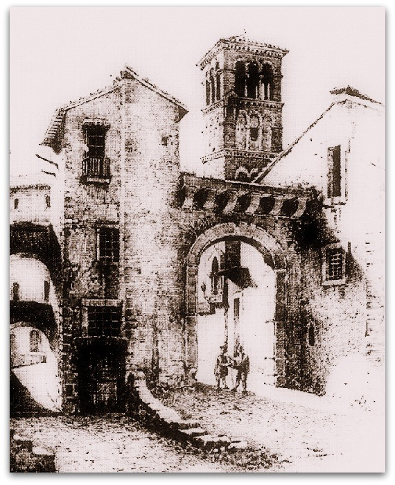
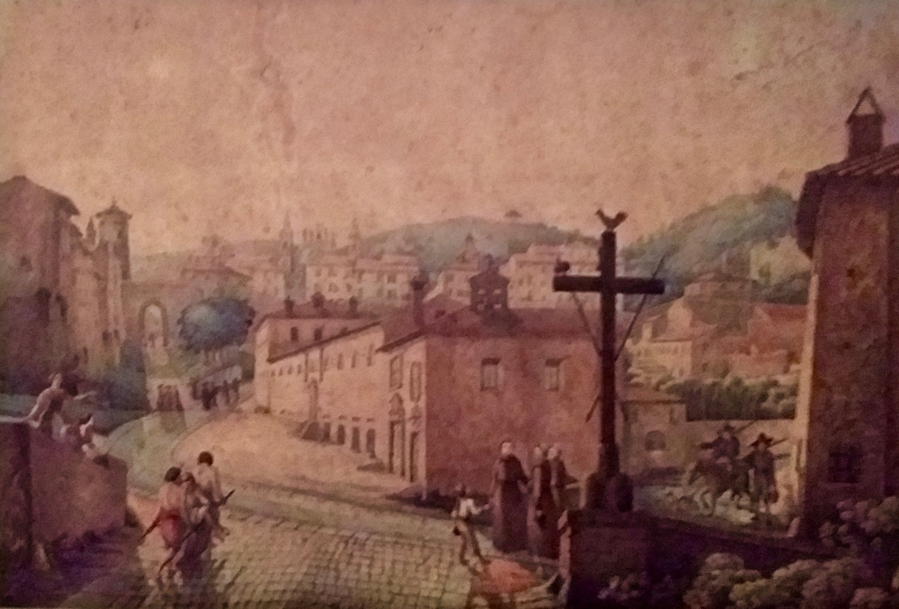
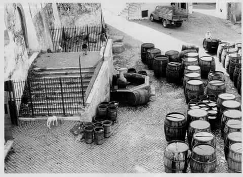

{fig-align="center"}

*Nascita, sviluppo e prospettive di una città a partire dal suo monumento più antico.*

## 1. *In Vivarium*

La chiesa di S. Maria in *«locus qui vocatur Frascata»* è ancora oggi sulla piazza che porta il nome di S. Rocco, un po’ spostata sulla destra di chi guarda rispetto alla fontana e alla Rocca. La sua prima menzione documentale compare sul Liber Pontificalis nell’876, insieme alle chiese di S. Sebastiano, in seguito anche ospedale e quindi cimitero, non più esistente dagli anni cinquanta del novecento, che costeggiando il tratto urbano della Via Tuscolana era sul sito dell’attuale scuola media (ora Via Domenico Seghetti), e di S. Vincenzo, la cui collocazione è ipotizzabile dove venne eretta la chiesa delle Scuole Pie, nella parte alta del tracciato urbano superiore della via Tuscolana (attuale Corso Italia). L’ultimo quarto dell’800 è caratterizzato dalla dissoluzione dell’impero carolingio, diviso in tre tronconi dei quali l’Italia settentrionale e centrale occupano la parte più bassa di quello mediano, detto Lotaringia, il quale a livello territoriale risulta particolarmente instabile. La penisola è soggetta a numerose incursioni saracene, il ruolo universale di Roma è minato dai conflitti con Bisanzio su questioni teologiche e da quelli con la Germania sul ruolo imperiale nell’elezione del pontefice. La parcellizzazione dei feudi porta nel 901 all’affermazione a Roma di Teofilatto, “*iudex dativus*”, intendente di finanza con poteri militari, capostipite della [potente casata tuscolana](https://grandtour.shop/posts/pages/2012-05-10-possedimenti-memorie-tuscolo-comandini.html). A ciò si accompagna il fenomeno dell*'incastellamento*, che concentra gli abitati nei fortilizi più elevati.

Durante il lungo periodo segnato dall’influenza tuscolana, Frascati non riceve nessuna menzione sui documenti, e torna successivamente alla distruzione della città di Tuscolo con la denominazione di *castrum* nelle bolle di Innocenzo III dei Conti di Segni (1200), Gregorio IX dei Conti di Segni (1228) e Innocenzo IV dei Conti di Lavagna (1244) come S. Maria «*in Frascata*», località indicata quale fondo destinato ad uliveto; il nome deriva dalla presenza di legna da ardere, e non da altro. I tre poteri il cui compromesso si è basato sulla [distruzione dell’antica città](https://grandtour.shop/posts/pages/2016-09-07-8-settembre-frascati-tuscolo-comandini.html) si spartiscono il bottino: a Roma si consolida il Comune, l’impero domina anche nel meridione, il papato rilancia ogni sua prerogativa. Nel territorio della Campagna Romana si accrescono i centri che derivano dalla dispersione dell’immenso feudo tuscolano, del quale i Castelli romani sono soltanto una parte e dei quali Frascati è il più noto e centrale, tanto per la prossimità a Roma quanto per il ruolo nei traffici locali e verso il meridione. La storia fa comprendere quanto la località sia sempre stata terreno di battaglia tra poteri diversi; il presente ricorda quanto oggi essa necessiti di un rilancio complessivo.

{fig-align="center"}

In un periodo in cui Tuscolo era ancora esistente, viene citata nei documenti la piazza più antica di Frascati, piuttosto piccola e nascosta, non distante dalla chiesa di Santa Maria in Vivario: la piazza del Matone, sulla quale si affaccia un lavatoio pubblico chiuso all’utenza dal 1983. Infatti, una Bolla del 1116 emanata dal pontefice Pasquale II Raineri di Bleda menziona l’area del Matone. Il nome deriva dal colle su cui la piazzetta poggia, e appartiene all’[Abbazia Greca di Grottaferrata](https://grandtour.shop/posts/pages/2016-12-31-momenti-fine-comandini.html#parus%C3%ACa-unica-via); laddove il documento è reputato di dubbia autenticità, risale al 1465, probabile anno di realizzazione del lavatoio, il Regesto stilato dal cardinal [Bessarione](https://grandtour.shop/posts/pages/2014-04-29-strade-fener-comandini.html#partire), che ne conferma nome e attribuzione, questa comunque da tempo decaduta.

Bessarione, esule di una Bisanzio ormai conquistata dai Turchi, è il primo egumeno dell’Abbazia ed è inoltre vescovo della diocesi suburbicaria, che in pratica significa extraurbana, denominata Labico Quintanense, che ha ricevuto già diverse sedi, tra le quali Tuscolo e, dopo la distruzione dell'antica città, Santa Maria in Monasterio sull'Esquilino presso la Domus Aurea. Il coltissimo cardinale, esponente del neoplatonismo, esercita le sue cariche mentre è pontefice l'altrettanto erudito Pio II Piccolomini, ad un tempo il primo a interessarsi alle rovine di Tuscolo e il primo a dotare Frascati di un impianto urbano, stilato sul modello della città ideale già realizzato a Pienza. Il nucleo del Matone, dove occupa l'area in cui le antiche mura si risolvono nella cortina delle case, risulta limitrofo al tratto della via Tuscolana che lo lambisce dall’attuale Via Ludovico Micara, oltrepassando le Scalette di Porta Granara, nell’epoca che ci interessa soltanto una salita in terra piuttosto ripida; dalla parte opposta rispetto al Matone, si sviluppano i rioni che compongono quello che chiamiamo quartiere di S. Rocco e che nel dettaglio risulta piuttosto differenziato nelle parti.

Il nome *vivarium* della chiesa deriva dalla vasca per la coltura dei pesci della villa appartenuta al senatore Passieno Crispo e a sua moglie Agrippina e infine a suo figlio Nerone, alimentata a suo tempo da una sorgente probabilmente locata fuori porta presso l’attuale Chiesa del Gesù, allora non esistente. Nei tempi antichi lo sviluppo della villa e quindi della località segue per terrazzamenti successivi la caduta delle acque, che trovano il loro punto di raccolta presso l’attuale villa Campitelli nella cisterna di Galba, peraltro successore di Nerone dopo il periodo dell’anarchia militare. Presso la zona di *Bagnara* (in via Luciano Manara, anticamente via di Sanguineto), non lontano da un ninfeo romano scoperto nel 1854 ed erroneamente attribuito a Lucullo dalla tipica fantasia popolare dei luoghi, venne ritrovata una fistola, cioè una conduttura in piombo per l’acqua, con il nome di Agrippina (custodita presso l’Orto Botanico di Roma). La Villa di Lucullo, la prima del territorio e forse la più vasta, ci riporta alla zona dell'attuale Villa Torlonia e a quella del *Mausoleo di Lucullo*, che fu anche monastero benedettino (ora Torrione Micara), la cui attribuzione è incerta se sia quella del grande console e stratega romano, oppure dei Valerii Messalla. Questo, in un'area piuttosto esterna al *castrum*, lo troviamo sulla *Via de' Salé* (contrazione di Gerusalemme), diverticolo che conduce a S. Nilo dal tratto in cui Via Tuscolana viene perlopiù chiamata Via Romana.

{fig-align="center"}

Invece, presso l’allora *Ospedale di S. Sebastiano*, venne ritrovato un altro tratto di conduttura recante l'iscrizione del nome di Nerone (conservato al Museo dell’Abbazia di Grottaferrata). È plausibile che il controverso imperatore, in un panorama immenso che ancora oggi incanta lo sguardo, abbia ammirato da qui l’incendio su Roma. Dopo la sua sfortuna, il territorio diventa proprietà demaniale. Parte delle rovine romane sottostanti sono tuttora accessibili dall’abside centrale della chiesa, proprio dietro l’altare ricavato da un sepolcro paleocristiano, mentre dalla sagrestia si accede alla cripta nei cui pressi insiste il perimetro della chiesa primitiva del V sec., precedente quindi ogni fonte scritta conosciuta.

La chiesa viene ricostruita nel X sec., al tempo in cui la [dinastia](https://grandtour.shop/posts/pages/2012-05-10-possedimenti-memorie-tuscolo-comandini.html) in seguito detta Tuscolana comincia ad espandersi, prima con Teoflilatto e Teodora, poi con Marozia, quindi con il figlio di lei Alberico, e infine con il figlio di questi, il pontefice Giovanni XII che, incoronando imperatore il re sassone Ottone, rinnova l’istituto imperiale. Domenico Seghetti e altri storici menzionano un rifacimento ricevuto dalla chiesa nel 1296, e a detta del cardinal Ludovico Micara in quell’anno Bonifacio VIII Caetani benedice la prima campana su quella che deriva da una torre saracena e però esiste nella sua forma di campanile in maniera accertata soltanto dal 1305. Per comprendere storia e significato di questo primo monumento cittadino, sola testimonianza medievale superstite, continuiamo a passeggiare nella storia e quindi nelle sue vicinanze, lontani dal presente quanto basta per metterlo in prospettiva e cercare di comprenderlo meglio.

## 2. La Roma dei Colonna e la cattività avignonese

Alla fine del 1200 territorio e istituzioni sono segnate dal conflitto tra papa Bonifacio VIII e l’illustre famiglia dei [Colonna](https://grandtour.shop/posts/pages/2015-12-15-marcantonio-colonna-frascati-comandini.html). La genealogia di questa, che si diffonde soprattutto nel Lazio e nel Meridione, si collega per via di un fratello del pontefice [Benedetto IX](https://grandtour.shop/posts/pages/2013-04-02-benedetto-ix-tuscolo-comandini.html) ai Conti di Tuscolo e di lì all’antichità e annovera nel blasone, oltre alla *gens* Anicia e la Mamilia, anche la Julia, mantenendo un’impronta politica di peculiare ispirazione romana. Il loro privilegio è quello di essere obbediti: se li incontri, devi fare quanto ti dicono. Da parte sua, il cesaropapismo del pontefice tende a riaffermare il ruolo accentratore della Chiesa mentre, con la decapitazione di Corradino di Svevia da parte di Carlo D’Angiò del 1268, l’impero si sta sfaldando e il contesto politico e sociale è ormai prossimo a sganciarsi dalle strutture di potere feudali.

{fig-align="center"}

Bonifacio VIII quindi deve combattere sovrani quali Ferdinando d’Aragona di Sicilia, internamente alla Curia è contrastato dai cardinali Giacomo e Pietro Colonna, a loro volta sostenuti dai Celestini e dai Francescani Spirituali. Stefano il Vecchio, capostipite dei Colonna di Palestrina, conte di Romagna e sposato a Guacerande di L’Isle-Jourdain in Guascogna, compie nel maggio 1297 un’imboscata ai danni del pontefice presso Porta Tiburtina, depredando un convoglio carico di duecentomila fiorini d’oro atti ad acquistare un castello dai Frangipane. Conseguentemente, tutti i Colonna vengono deposti e scomunicati, e costoro reagiscono con i *Manifesti di Lunghezza* accusando il papa di elezioni illegali nonché di essere responsabile della morte del suo predecessore Celestino V da Morrone. I Colonna tentano la reintegrazione, ma nel dicembre 1297 una vera e propria crociata porta a due anni d’assedio e quindi alla distruzione di Palestrina, nonché alla confisca dei beni e alla dispersione di quella che viene definita *«dannata stirpe»*, esclusa persino dalle indulgenze giubilari del 1300.

Stefano il Vecchio e suo fratello Giacomo detto Sciarra (che vuol dire rissa violenta), podestà di Narni, si ritirano presso la corte francese preparando il terreno alla riscossa, che inizia a prendere luogo nel 1303 con lo *Schiaffo di Anagni*, condannato nel canto XX del *Purgatorio* persino da [Dante](https://grandtour.shop/posts/pages/2024-05-27-dante-islam-comandini.html) che di Bonifacio era avversario. Il pontefice, intenzionato a emanare una seconda scomunica contro Filippo il Bello D’Angiò, viene imprigionato nel palazzo pontificio di Anagni da Sciarra e dal cancelliere del re Guglielmo di Nogareth che gli intima un processo, eppure riesce a fuggire. Il suo successore Benedetto XI Boccassini annulla la scomunica contro i Colonna, ma è comunque costretto a rifugiarsi a Perugia. Qui nel maggio 1305, dopo undici mesi di sede vacante, viene eletto Clemente V De Got, due anni dopo coinvolto dal re francese nella persecuzione contro i Templari. Nel 1309 il pontefice trasferisce la curia a Poitiers e nel 1313, pur ponendo sede ad Avignone, mantiene residenza nel feudo papale di Carpentras.

.jpg){fig-align="center"}

Ai Colonna viene quindi accordato il recupero dei beni ed è concesso di ricostruire Palestrina. Stefano il Vecchio esercita potere a Roma, nel 1313 al fianco del duca di Baviera e imperatore Enrico VII Wittelsbach. Pur nella cruenza degli eventi, il suo comportamento appare esemplare: rimane a fianco del sovrano anche quando questi attacca l’Urbe in modo da poter esercitare quanto possibile garanzie, e pur favorendo pace rifiuta l'investitura feudale che gli farebbe ottenere più potere. Nel 1328 Stefano sostiene il papa avignonese Giovanni XXII Duèze e il re di Napoli Roberto D’Angiò, trovandosi sul campo avverso rispetto a Sciarra, capitano del popolo romano, che da parte sua incorona come imperatore Ludovico IV il Bavaro, il quale a sua volta nomina pontefice Niccolo V Rainalducci. Si oppone loro Jacopo, uno dei figli di Stefano, che provoca la fuga del Bavaro e dell’antipapa. Entrato nelle grazie del legittimo pontefice, Jacopo è nominato vescovo di Lombes e intrattiene rapporti con Francesco Petrarca.

Nel 1333 il tentativo di espansione del Bavaro verso Napoli provoca lo scontro di Sciarra con gli Annibaldi che controllano il castello della Molara, ultimo avamposto insieme all’[Abbazia di San Nilo](https://grandtour.shop/posts/pages/2016-12-31-momenti-fine-comandini.html#parus%C3%ACa-unica-via) di quella che fu Tuscolo. Il proposito viene abbandonato, Sciarra muore in esilio, torna la pace tra i Colonna. Roma senza papa continua ad essere travolta dalle consuete faide, in attesa di assistere alla quasi messianica epopea di colui che, tra molte contraddizioni, tenta di promuovere ordinamenti comunali definendosi quale ultimo “*tribuno del popolo*”, Cola di Rienzo. Inevitabilmente destinato a scontrarsi con i Colonna, nel suo tentativo di riscossa del 1354 circonda di armate tutto il territorio attorno Palestrina, e a Frascati concentra fanti e arcieri. Definitivamente caduto in disgrazia, viene trucidato sul Campidoglio. Il suo cadavere squartato è lasciato appeso davanti all'antico ingresso della Chiesa di S. Marcello in Via Lata, di fronte alle abitazioni dei Colonna.

## 3. Breve storia di una chiesa

Torniamo nel 1305 a Frascati dove, sotto l’autorità del Capitolo Lateranense, la chiesa di S. Maria in Vivario riceve un campanile romanico-romano rivestito in selce a tre ordini di trifore separati da mensoline, simile a quello di S. Maria in Cosmedin presso la Bocca della Verità a Roma. Nel 1478 Guillame D’Estouteville, normanno appartenente alla famiglia reale francese, papa mancato e uomo più ricco della sua epoca, da Sisto IV Della Rovere riceve Frascati come saldo per debiti; a segno della sua munificenza lascia, oltre alla fontana ottogonale in pietra sperone, detta anche *lapis tuscolanus*, otto figli ottenuti da Girolama Tosti. La chiesa viene da lui di nuovo consacrata nel 1495. Nel corso del secolo successivo nuovi altari vengono realizzati dal governatore card. Giacomo Savelli. Gli affreschi, dei quali molti nel tempo danneggiati dall'umidità e quindi andati perduti, hanno attribuzione incerta. Romano Mergé ricorda che vi lavorò anche Francesco Caiazza, vissuto a Frascati nell’attuale via dell’Olmo, morto sul patibolo per fatti di sangue nel 1486 e del quale è sparita pure la lapide dedicatoria. L'affresco in stile raffaellesco dell’abside della chiesa, che raffigura l’incoronazione della Vergine Maria, appartiene probabilmente al periodo Colonna-Della Rovere, e quindi al primo quarto del 1500. Leonello Razza segnala che nel *Libro del Camerlengo* nel 1581 sono annotati notevoli restauri e nuove pitture opera di "Messer Richardo pittore". Nel 1592 si decide di non inumare più i defunti nella cripta sottostante, portando così allo stabilirsi del Cimitero presso l’Ospedale di S. Sebastiano. Nel 1636 viene consacrata come nuova cattedrale la chiesa di S. Pietro, che eredita suppellettili della sede precedente.

Dopo i fasti del periodo che procede da Paolo III Farnese a Paolo V Borghese, nel quale i papi vi risiedono, Frascati si sviluppa oltre il nucleo antico. Nel 1650 la cerchia muraria viene allargata portandola dall’attuale via Cairoli a fronte della nuova cattedrale, tagliando in diagonale quella che oggi è piazza S. Pietro. Dopo la peste del 1656, alla chiesa di S. Maria viene aggiunta una dedica a [S. Rocco](#0) grazie alla riscoperta degli affreschi quattrocenteschi che raffigurano lui e S. Sebastiano, secondo un’iconografia che si consolida all'epoca di Martino V Colonna. Laddove al soldato romano Sebastiano era dedicata un'altra chiesa già da tempi remoti, il nome più tipico della chiesa e della piazza diventa quello di Rocco, il santo di Montpellier di origine tuscolana amico degli appestati, sempre in compagnia del cane che gli porta cibo. Nuove immagini del culto dei santi vengono realizzate nel 1715 nella cappella loro dedicata, che riceve nuove decorazioni di Pietro Gagliardi e Domenico Jannetti nel 1867. Nel 1765 il [Duca di York](#0), ultimo discendente degli Stuart, cardinale e vescovo della città, compie rifacimenti interni ed esterni. L’intero complesso è oggetto di restauri, rifacimenti e aggiunte nel 1878 e quindi nel 1958-1969. Soltanto allora le dieci colonne in pietra sperone furono liberate dalle coperture in calce, al tempo della peste usata per allontanarla.

{fig-align="center"}

I bombardamenti alleati dell’[8 settembre 1943](https://grandtour.shop/posts/pages/2016-09-07-8-settembre-frascati-tuscolo-comandini.html) colpisco la chiesa demolendone la parte più prossima alla Rocca e operano chirurgicamente attorno al campanile isolandolo dai palazzi cresciutigli intorno, attuando involontariamente un progetto del 1915. La muratura delle trifore impedisce al monumento di crollare. L’orologio che vi era apposto dalla parte di Piazza Paolo III viene spostato su uno dei campanili di S. Pietro. Oggi, a vederlo dalla prospettiva della piazza, il campanile sembrerebbe appartenere al pur valido negozio di generi alimentari della signora Mirella, e tutto il tratto che lo unisce alla chiesa sottostante non è visibile in quanto coperto da costruzioni di vario tipo e dal dislivello stradale. Sul lato opposto, un pezzo di colonna romana rimane incastonato tra tali costruzioni e l'angolo sinistro del campanile. Nella nicchia bassa vi sono affreschi stratificati di autori ignoti; quello più in profondità rendeva presente la figura del Figlio, quello in superficie quella della Madre; ambedue sono stati recentemente coperti da un restauro che a definirlo dilettantesco gli fai un complimento.

Nella piazza di S. Rocco nel 1969 la fontana ottogonale, figura che rimanda alla sovrapposizione tra la Gerusalemme celeste e quella terrena, combinazione delle figure dei segni cardinali e di quelle intermedie, simbolo della resurrezione e della vita eterna, viene spostata dalle adiacenze della Rocca e collocata al centro della piazza, dove era stata originariam.ente posta nel 1480, concludendo così una lunga serie di peregrinazione da un punto all’altro. Mergé segnala che nel 1769 Paolo Borghese principe Aldobrandini concesse al Duca di York l'acqua per la Rocca; gli ampliamenti successivi delle condutture attraversano tutta Frascati, dalla zona delle Scuole Pie e del cosidetto *Sepolcro di Lucullo* (di era repubblicana ma non ben identificato, nel 1598 viene spogliato per utilizzarne i materiali nella costruzione di S. Pietro e delle ville tuscolane) fino alla chiesa di S. Bonaventura (anticamente detta *Sanguineto)*. Le fresche acque dell’Algido, presso la Molara, già sono state divinizzate da Alessandro Stradella nella cantata *Circe* (1667); come recita la lapide posta nella parte della fontana ottogonale che guarda Roma, “*Ninphar haec domus*” - la fontana è casa di una ninfa.

{fig-align="center"}

Sul lato nord del campanile una lapide in marmo bianco dedicata alle anime dei defunti ricorda con caratteri gotici fortemente abbreviati alcune informazioni, invero piuttosto parziali e pasticciate. Segnala che il campanile è stato realizzato il 26 aprile 1305, sotto Clemente V: la scritta potrebbesi dire profetica, giacché il pontefice viene ufficialmente eletto in maggio. Viene quindi la dedica ai defunti “*Andrea Madiss et Johannis Jordani*: a detta di Nibby, di Santovetti e di Razza, l’indicazione potrebbe essere di due nomi, dei quali almeno il secondo è tipico presso gli Orsini, storici rivali dei Colonna, il cui antenato più illustre è papa Celestino III, tra i responsabili della distruzione di Tuscolo. Da parte sua, Mergé suggerisce si tratti di un unico nome, indicando nel secondo il genitore del primo, il cui patronimico è riscontrabile in un notaio di casa Colonna, i quali effettivamente si impongono a Frascati per una periodo piuttosto rilevante, per quanto in maniera discontinua, per poi sparire e tornare al massimo come governatori.

Osserviamone brevemente alcune fasi. Nel 1420 Martino V, nativo di Gennazzano, "capitale" dello stato feudale dei Colonna, rompe la cattività avignonese, si stabilisce a Roma nel Palazzo dei SS. Apostoli e accompagna il suo rientro all’attribuzione dei territori della Chiesa ai suoi congiunti; Frascati spetta, insieme a Molara, Montecompatri, Marino, Rocca di Papa, Lariano, Genzano, Nemi e Ardea, al cardinal Prospero figlio di Lorenzo. Già sotto il pontefice a seguire, Eugenio V Condulmer, il territorio viene perduto, costringendo alla riconquista, fin quando nel 1485 si accende un ennesimo scontro tra Colonna e Orsini. Nella circostanza Prospero Colonna figlio di Antonio, tra gli uomini d’arme eminenti di un'epoca in cui la guerra era una delle belle arti, occupa la Rocca di Frascati e rapisce Girolamo D’Estouteville, dal 1482 proprietario del feudo insieme al fratello Agostino. Sul lato occidentale del campanile, non lontano da dove erano le fortificazioni, è ancora visibile un'irregolarità della superficie che può ascriversi ad un colpo di cannone. Gli Orsini si uniscono a D'Estouteville, di cui vengono rapiti anche moglie e figlio, e si combatte su tutto il Lazio, da Nemi a Genazzano, da Marino a Bracciano; l’intervento di papa Innocenzo VIII Cybo porta i Colonna, ma non gli Orsini, a rappacificarsi con lui, e nel 1488 è pace anche tra Colonna e D’Eustoteville. Le casate romane quindi si alleano nel contrastare il papa spagnolo Alessandro VI Borgia.

{fig-align="center"}

Nel 1494 il re di Francia Carlo VIII di Valois discende in Italia puntando a Napoli e dà l’avvio alle guerre d’Italia. I Colonna, insieme ad altri signori quali Ludovico il Moro di Milano, sono suoi alleati. Il pontefice requisisce i beni dei Colonna. Frascati viene quindi annessa al ducato di Nepi, e la piccola Lucrezia sua figlia potrebbe essere così cresciuta, nell’isolamento sospettoso in cui i Borgia si tenevano, oltre che in piazza Pizzo di Merlo a Roma, proprio nei luoghi tuscolani che furono anche di Nerone. Alla nomina come Giulio II di Giuliano della Rovere, deciso rivale di Borgia, i Colonna vengono reintegrati dei loro beni. La nipote del pontefice Lucrezia della Rovere è data in sposa al valoroso [Marcantonio I Colonna](https://grandtour.shop/posts/pages/2015-12-15-marcantonio-colonna-frascati-comandini.html), distintosi nella battaglia che nel 1506 porta definitivamente Bologna nell’orbita romana. Gli sposi ricevono congiuntamente in dote il feudo di Frascati, che nel 1515 viene fornito di uno Statuto cittadino.

Il Sacco di Roma del 1527, favorito dal focoso Pompeo Colonna, egumeno a S. Nilo, fedelissimo dell’imperatore Carlo V d’Asburgo e da tempo impegnato in una guerra personale con Clemente VII de' Medici, porta l’Urbe in rovina, permettendo così una crescita di importanza di Frascati. Attraverso complesse operazioni immobiliari mediate da Alessandro Farnese, che fu anche lui dalla parte dei Lanzichenecchi, Frascati passa nel 1537 sotto la Camera Apostolica e quindi al diretto dominio papale, tenuto dal di lui padre Paolo III. La rivendicazione della proprietà da parte di Ascanio Colonna non viene accolta, anche il ricorso del ramo dei Colonna di Riofreddo viene cassato, così come quello degli eredi D’Eustoteville. L'anno successivo il pontefice da *castrum* nomina Frascati quale *civitas* attribuendogli la sede vescovile che fu di Tuscolo e di Labico Quintanense, e il titolo di cattedrale viene assunto da S. Maria in Vivario. L’intensa attività urbanistica, che inizia a svilupparsi verso la direttrice sud-est, opposta a quella precedente, viene affidata a Sangallo il Giovane, ed è ultimata la Rufinella, ora Falconieri, la prima delle ville tuscolane volute dall’aristocrazia papale. La pace di Cateau-Cambrésis del 1559 pone termine alle guerre d'Italia, portando alla prevalenza asburgica sulla penisola; questo favorisce a Roma, il cui potere è stato fortemente relativizzato dagli effetti della Riforma protestante, di completare il Concilio di Trento. L’importanza di Frascati, stabilizzatasi con un forte ancoraggio ai poteri romani, è destinata a crescere.

{fig-align="center"}

## 4. In giro per rioni

Il campanile rimane lì, dove ancora sta. Le maioliche circolari sulla sua sommità, sette per ogni lato, cinque sopra e due sotto, conoscono ancora i colori che ne videro le origini: rosso, giallo, verde e blu variatamente assortiti. Torniamo quindi nei primi decenni del 1300, dove sappiamo che i continui conflitti tra Colonna e Orsini e le lotte intestine dentro le stesse famiglie nobiliari rendono Roma ingovernabile. A breve verrà contesa tra diversi poteri anche Frascati, ancora priva di fortificazioni e di modeste dimensioni che conta, come si deduce dalla tassazione di dieci rubbie di sale al semestre imposta dalla Camera Apostolica, circa un migliaio di abitanti.

Cerchiamo di ricostruire i rioni popolati da queste anime antiche nelle strade di oggi. Il rione *Vardesca*, che fornisce nome a una via oggi spezzata in due tratti e ad una piccola piazza, è sul lato nord della chiesa, ed è delimitato nella parte più ad est dal decumano romano, attuale via dell’Olmo. Comprende l’area di Piazza Bambocci, il cui nome deriva, in maniera simile pur se diversa rispetto alle “*grottesche*” della Domus Aurea, dalle maschere rinvenute tra i ruderi della villa di Nerone e usate come decorazione sulle case, che ha come confine i bordi dell'attuale Piazza del Mercato, ai tempi non esistente. Va segnalato che la denominazione di Piazza Bambocci prima del secondo conflitto mondiale era attribuita all’attuale piazza Casini, e quella che conosciamo oggi con tale nome era occupata da un agglomerato di costruzioni basse e irregolari inframmezzate da viuzze dai nomi tipo Via della Trippa e Via della Trippetta; come altri elementi, anche soltanto nella zona troppi per venir qui nominati tutti, distrutti dalle [bombe angloamericane](https://grandtour.shop/posts/pages/2016-09-07-8-settembre-frascati-tuscolo-comandini.html). Verso ovest, Vardesca si estende dall’area che da *Via Caperchiano*, scalinata che dall’arco di ingresso posto nei pressi del campanile scendeva al borgo in basso, ricollegandosi con quella che era chiamata *Concia* e segnava un'area occupata da attività del settore tessile. Da qui si incrocia la strada anticamente detta *Maremmana* (nel punto oggi alla confluenza tra Via Brigida Pastorino e Via Gregoriana), che procede da Via Sciadonna verso le campagne. Nella parte più vicina alla chiesa il rione era caratterizzato dalla presenza di fortilizi medievali poi riadattati e rovine romane, anche di epoca repubblicana, nel 1888 coperti dalla realizzazione di Via Regina Margherita, la cosiddetta “*Via Penza*”, via pensile ideata dal Valadier che guarda verso il cimitero moderno.

*Vallocchia* è nel livello più in basso, nell’attuale Largo Pentini, e accoglie il diverticolo che dalla Tuscolana conduceva a Porta S. Rocco, il più antico ingresso della città. La porta venne abbattuta per i lavori della via pensile insieme alle piccole abitazioni che la fiancheggiavano e ad un tratto di mura che ancora portava lo stemma Piccolomini. Per lungo tempo erroneamente attribuita al Vignola, la possiamo immaginare collocata tra i due platani del terrazzamento prospiciente la Rocca, la cui prospettiva definiva l'emiciclo sottostante dell’abitato che caratterizzava quella che oggi chiamiamo Via Borgo S. Rocco.

{fig-align="center"}

*Piazza del Mercato*, nella parte superiore della Rocca, doveva il nome al mercato settimanale concessovi il giovedì, come citato nella lapide del 1697 apposta su una colonna romana che si eleva sulla fontana in pietra sperone con mascherone e vasca. Probabilmente la prima pubblica della città, le cui acque, come ricorda Mergé, provengono dalla zona dell’Abbazia di San Nilo. Originariamente la colonna era posta all’inizio della discesa intitolata a D’Estouteville, e i due monumenti vennero sovrapposti nel 1840. Precedentemente la concessione di Paolo V del 1607 di tenere mercato nelle mura cittadine, questo veniva effettuato nella parte esterna alle mura e quindi nella succitata zona della Vallocchia. Alla colonna si sovrappongono le chiavi papali dello stemma cittadino deciso da Paolo III, al quale oggi la piazza è dedicata, e quindi delle pignatte che rappresentano lo stemma di Innocenzo XII Pignanelli sotto il cui pontificato vengono eretti i monumenti, e il cui nome è ricordato insieme a quello del governatore Carlo Colonna.

{fig-align="center"}

La Rocca rivela interventi che si sono succeduti nel tempo, da Pio II Piccolomini a cui si deve la fondazione, al D’Estouteville che la fortifica, ai vari passaggi dei Colonna, e allo stesso Paolo III che ne aggiorna l’aspetto che dà sulla sua piazza riallestendo la stessa con demolizioni e ricostruzioni mirate. Il [Duca di York](https://grandtour.shop/posts/pages/2017-05-20-frascati-goethe-comandini.html) erige la torre in stile scozzese, ornata internamente dalle tele affrescate del pittore polacco Taddeo Gunz, e dopo di lui l'edificio viene appellato quale Palazzo vescovile; laddove la sede vescovile dal 2023 è stata posta a Velletri, il piccolo castello deve ricominciare a farsi chiamare *Rocca* e va definitivamente tematizzato quale cuore del centro storico. Da parte loro, fontana e pertinenze, le cui prossimità sono molto frequentate a tutte le ore, risultano piuttosto malmesse, danneggiate dall’incuria amministrativa e dal vandalismo generico di chi ha piantato rampini e inciso sui monumenti come se niente fosse, e al massimo ci ha messo un rubinetto non pertinente al contesto. Sono visibilmente necessari interventi che restuiscano pieno decoro all'area.

{fig-align="center"}

Adiacente a tale piazza, quello che oggi chiamiamo Largo duca di York, già *Via delle Carceri*. Nella parte occidentale si elevava un palazzo fatto costruire dal cardinal Giacomo Savelli, governatore di Frascati, che nel 1553 diviene oggetto di una ribellione popolare a mano armata, determinata da vessazioni eccessive in contrasto con lo Statuto colonnese. Nel 1590 viene venduto alla Comunità che vi realizza il secondo edificio comunale, successivo a quello del palazzo senza fondamenta che attualmente a piazza Bambocci ospita il Forno Ceralli. La centralità della zona favorisce la crescita del suo prestigio, e il palazzo viene ampiamente ristrutturato nel 1771, affiancandosi al palazzo vescovile. Nel 1868 la sede comunale viene spostata a Palazzo Botti, poi anche Casa del Fascio, quindi Tribunale, ora adibito a uffici per servizi comunali, adiacente la cattedrale di S. Pietro. Palazzo Savelli viene venduto alla Sede Apostolica, che vi stabilisce il Carcere Giudiziario, sostituendo così il primo carcere che, come segnala la sagomatura a “*mezzo litro*” della grata in Via D’Estouteville, era nei sotterranei della Rocca. Demolito dalle bombe dell’[8 settembre](#0), prende il suo posto una palazzina di case popolari di proprietà comunale.

La zona, la cui rinascita è dovuta al lavoro delle attività lì presenti, che caratterizzano in modo peculiare la movida cittadina, ancora mantiene in modo incongruo il declassamento deciso dai tempi in cui era sopratutto il carcere a caratterizzare l’area, senza però mantenere il fascino del posto solitario lontano dalla pazza folla. E per quanto possa offrire ad ognuno la sua ora d’aria e rancio su misura, sembra incombervi un oblio generale che svilisce i pur notevoli potenziali e minimizza gli interventi resisi necessari, aggravando le difficoltà di gestire tanto il traffico locale quanto il flusso turistico nonché la stessa abitabilità, lasciandoci in attesa della cura che restituisca piena dignità storica e urbanistica a quanto già da tempo ha prodotto città e conosciuto storia. Nella parte orientale del Largo, c’è poi il [Grand Tour BookWineBar](https://grandtour.shop/), da cui ora vi scrivo: se passate, posso raccontarvi questa e altre storie.

{fig-align="center"}

*Pubblicato in forma breve su «il Tuscolo» #211, 15.12.2018. Riveduto e ampliato.*
