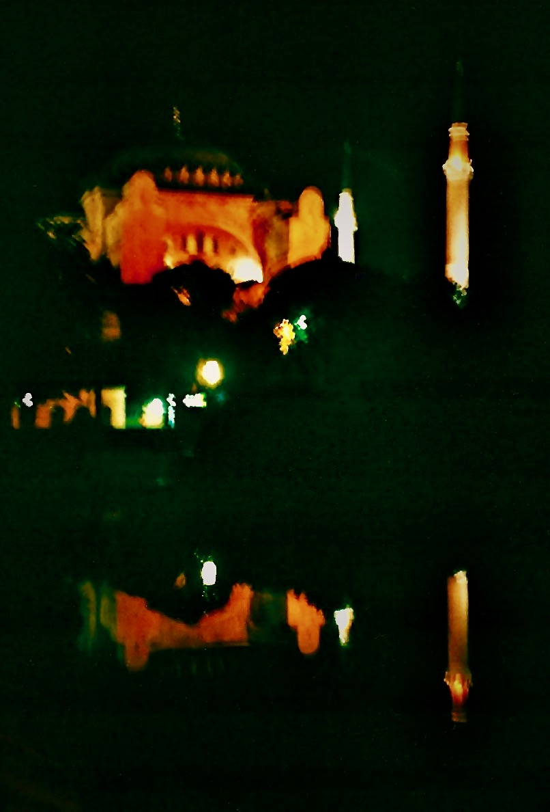{fig-align="center" width="650"}

*Lo spazio vuoto della storia e una santa mai esistita. La Turchia vista da* *Hagía Sophía.* *Ricorrenze del simbolo della mezzaluna tra l'Islam e Genzano di Roma. La storia sulle sponde del lago di Nemi. La generazione degli dei e i molti nomi della dea. La parte nascosta dell'Islam e gli infiniti Nomi di Dio. Principessa Bibesco: il tempio dell'idea. Corbin: lo specchio del mondo divino. Frazer nel bosco del sacerdote assassino. Le navi di Caracalla ieri e oggi. Lord Byron e l'esecuzione di un'adultera. Fourier, Flaubert, Pamuk: Istanbul capitale del mondo e tetra cloaca. Logos spermatikos, Paràcletos, Periklytos, Cabala e altre ragioni. Derrida: effetti di spettralità. Montale: il fantasma che ti salva. Pagels: vuoto fisico e indeterminazione della materia. Vuoti del presente e metropoli impossibili tra il Bosforo e i Castelli romani.*

## 1. Santa Sapienza

*Il Signore con la Sapienza fondò la Terra e consolidò le cose con l'Intelligenza. Per la sua Scienza gli Abissi si spalancano. (Proverbi 3:19-20)*

Resta della nostra storia un puro spazio vuoto. Questo vuoto, a differenza di quanto possano aver considerato gli antichi e i moderni, non nega e non afferma il movimento, il pensiero e la compiutezza, e si impone alla nostra considerazione anche in base all'esperienza di un presente che oscilla continuamente tra potenzialità generativa di forme e perdita irreparabile di ogni eredità.

A Istanbul, questo vuoto può sorprenderci tra la loggia del *muezzin* e il luogo di incoronazione dei *basileus*, all'interno di Hagía Sophía, nome di una santa mai esistita. Edificio dalle proporzioni improbabili ma solide, è originariamente un tempio pagano dedicato alla Sapienza, che nell'Ebraismo, nel Cristianesimo e nell'Islam si configura quale aspetto della divinità.

L'edificio, consacrato come chiesa da Costanzo II nel quadro della riorganizzazione della nuova capitale imperiale nel 360, nel 404 viene incendiato durante gli scontri che coinvolsero Giovanni Crisostomo, patriarca della città costretto a deporre la carica. Riedificato da Teodosio II nel 415, nel 532 è un'altra volta dato alle fiamme durante la rivolta di Nika, che minaccia di travolgere Giustiniano accusato di eccessive spese militari. Di nuovo eretto nel 537 con il proposito di essere più splendido del Tempio di Salomone di Gerusalemme, rappresenta il più grande edificio sacro della cristianità, per lasciare dopo la presa ottomana il primato a Santa Maria Maggiore di Roma.

A detta delle leggende, nel 1453 Maometto II vi entra a cavallo e interrompe una messa che attende ancora di essere ripresa; a detta di altri, si prosterna al suo interno in direzione della Mecca e poi pronuncia un discorso in greco antico. Il sultano, figlio di una cristiana e collezionista di reliquie, conquista la città all'Islam accrescendone di fatto la ricchezza, e trasforma l'edificio in moschea. Nel 1934 Hagía Sophía diventa museo, per opera di Mustafa Kemal, padre laico della Turchia moderna, «*turco come gli antenati*» (Atatürk), che inoltre trasferisce la capitale ad Ankara.[^1] Nel revival ottomano truce, puritano e un po' kitsch che ha seguito l'amara sbronza europeista, per iniziativa del presidente Erdogan l'edificio viene riconsegnato nel 2020 al culto islamico, rinnovando le lotte su suo significato e sua funzione.

[^1]: Philip Mansel, *Costantinopoli* \[1995\], Mondadori, Milano 2003.

Segnato dalle fiamme, dalle spade e dal sangue, l'edificio porta il santo nome della divina Sapienza, che precede la creazione di questo mondo e nel quale verrebbe a manifestazione permettendone intelligenza nonché governo (*Sapienza* 7:25ss). Tuttavia, così come il libro che le è dedicato non è stato scritto da Salomone e piuttosto sembra redatto nel I sec. d.C., questo nostro mondo non sembrerebbe affatto ordinato come sapienza comanda, e restano vane le ingiunzioni verso i potenti (6:4-8). Può fornire una traccia per decifrarne i travagli la *Pistis Sophia*, vangelo gnostico del III sec. che racconta come la Sapienza per inseguire una luce solo apparente precipita, per restare imprigionata nella tenebra e nella materia che contribuisce a creare. Lei, che cerca verità, giustizia e amore, è odiata da potenze, dette Arconti, che propalano inganni.[^2] Se il primo testo è estraneo al canone ebraico, il secondo è considerato eretico dai cristianesimi ufficiali, mentre il mondo musulmano è generalmente estraneo ad ambedue: tuttavia, pur se dai margini delle ortodossie monoteiste, le loro concezioni implicano elementi costitutivi di quella che possiamo chiamare coscienza collettiva, cosi come è per la mitologia. Tali elementi riguardano anche la nostra contemporanea laicità e, concentrandoci perlopiù su questioni relative alla storia e alle idee, possiamo trovare il filo che le lega insieme esattamente in quello della sapienza. Che, in qualche modo, continua a precipitare.

[^2]: *Pistis Sophia* (II sec. d.C.), a cura di L. Moraldi, Adelphi, Milano 1999.

Potremmo così, per sua e nostra salvazione, essere costretti a cercare questa sapienza quale ragione e soluzione di un mondo che è fiamme, spade e sangue anche tra coloro che si appellano a luci superiori. E, laddove una scintilla di sapienza è in ognuno, pur se spesso imperscrutabile, la sua stessa dispersione può ritrovare consistenza nel nostro risalirne le forme, ovunque si svolga il nostro andare. Saremo così sulle sponde del lago di Nemi e su quelle del Bosforo a rintracciarne l'eco, intenti a riscoprire storie di città e nomi di divinità e a contemplare i vuoti diventare pieni e viceversa.

## 2. Genzano e la Luna

*Ciò che il Santo, egli sia benedetto, ha fatto sulla Terra, è a somiglianza di quanto è nel Firmamento: ogni cosa allude a quello che si trova nel mondo superno. (Zohar 2:15b-16a)*

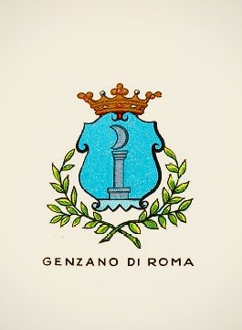{fig-align="center" width="423"}

La sapienza ama adornarsi di simboli che si rincorrono tra posti diversi e lontani in modi a volte apparentemente incomprensibili, sollecitando la nostra intelligenza a confrontare tra loro sistemi e credenze diverse. Questo accade anche nei luoghi del nostro vivere ordinario. Nella bandiera turca e nel simbolo dell'Islam, uno spazio vuoto si apre verso una stella da una mezzaluna crescente. Si apre ad uno spazio vuoto la mezzaluna calante sormontata da una corona nello stemma di Genzano, cittadina dei Castelli Romani. Spazi vuoti suscettibili di riempirsi di continuo di tensioni e significati.

Le differenze tra i simboli sono evidenti eppure la loro similiarità è netta, e tutto appare piuttosto enigmatico. Sviluppiamone le indicazioni vagliando, per quanto questi offrano molti vuoti, i dati della storia. L'ipotesi che a Genzano nel X sec. fosse esistito un piccolo insediamento saraceno non è suffragata in alcun modo, e non ci sono tracce da far risalire alle incursioni che nel IX sec. investono anche il territorio della vicina Lanuvio, e coinvolgono particolarmente Ostia e le chiese di S. Paolo e S. Pietro a Roma, sedimentandosi in maniera accertata in alcune zone della Valle dall'Aniene. Consideriamo inoltre che Genzano, in epoca antica parte del territorio appartenente alla *gens Aricina*, e che deriva, come gli altri paesi della zona, dal lento smembramento dell'immeso feudo tuscolano, è stata per lungo tempo circoscritta ad un remoto villaggio di contadini e pescatori, lontano dal vecchio tracciato della via Appia che corrisponde grossomodo all'odierna via dei Laghi. L'antico borgo corrisponde alla zona oggi chiamata Genzano Vecchio, sul ciglio settentrionale esterno del lago di Nemi; quello conosciuto come Nemi, collocato sulla parte opposta del lago e ancora più appartato, per lungo tempo semplice *massa* e quindi costituito da fondi e casolari sparsi, gli è strettamente associato fino alla metà del XVI sec. Le due località sono unite tra loro da un percorso a mezzaluna che costeggia il lago, anticamente detto *Speculum Dianae*. Sul bosco che lo circonda era dedicato al Diana Nemorense un santuario piuttosto articolato ed esteso. Nemi significa propriamente bosco, e nove alberi ripartiti su tre colli sono riportati sul suo stemma. Invece, origine e significato del nome Genzano, così come quella dello stemma, sono incerti e ancora dibattuti, scarne per quanto intricate le sue vicende, continuamente coinvolte nelle continue dispute, spesso anche piuttosto violente, che i nobili romani intrattenevano tra di loro e con i pontefici in carica.

Quanto sappiamo per certo proviene perlopiù dall'opera di Nicola Ratti,[^3] che va integrato con quanto possa chiarire contesto e dinamiche. Il *Fundus* *Cynthianum* è possedimento, per una donazione del 1153 effettuata dal pontefice Anastasio IV della Suburra e confermata nel 1183 da Lucio III Allucingoli, dell'Abbazia delle Tre Fontane sulla Laurentina, luogo del martirio di San Paolo, conosciuta anticamente con il nome di Acque Salvie e all'epoca tenuta dai Cistercensi. Tale ordine nasce dalla riforma di Cluny e ha già fornito contributi all'organizzazione degli ordini cavallereschi, in particolar modo con la *Regola* emanata da Bernardo di Chiaravalle per i Templari. Nel 1218 Onorio III Savelli decreta la demolizione di una torre abusiva eretta nel XII sec. dai Gandolfi che danno nome alla vicina Castel Gandolfo. Le prime citazioni del toponimo *Genzani* quali *fundus* e *castrum* risalgono alle bolle emanate nel 1255 da Alessandro IV de' Conti di Segni, che si riferiscono alla costa montana e al castello, fondato in quell'anno dai Cistercensi e ricostruito prima dai Colonna e poi sostituito da palazzo Sforza Cesarini. La torre di avvistamento del XIII sec., detta Saracinesca, già parte della cerchia muraria del castello e ancora incastonata all'inizio del Corso Vecchio, prova perlopiù l'esigenza di difendersi dalle incursioni e non spiega né stemma né altro.

[^3]: [Nicola Ratti, *Storia di Genzano*, Stamperia Salomon, Roma 1797](#0).

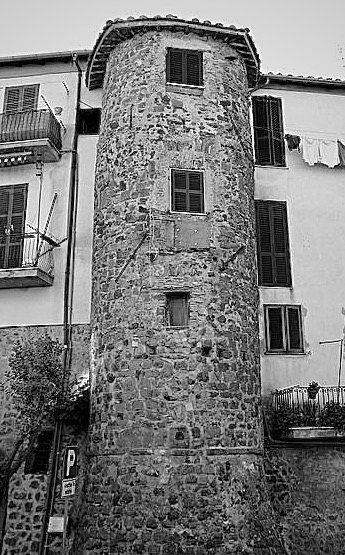{fig-align="center" width="504"}

Anche per la particolare fragilità a cui è territorialmente esposto, Genzano e pertinenze restano coinvolte nelle instabilità del periodo in cui la sede del papato è presso Avignone. Nel 1378 l'antipapa Clemente VII di Ginevra lo attribuisce a Stefano Orsini di Marino, ma probabilmente il paese torna ai Cistercensi già l'anno successivo la battaglia di Marino, dove si fronteggiano mercenari francesi e italiani e prevalgono questi ultimi che parteggiano per Bonifacio IX Tomacelli. Nel 1393 Genzano viene invaso da Nicola Colonna di Palestrina ed è annessa ai domini di Lariano. Nel 1399 il Colonna, che già era stato scomunicato, fallisce una congiura ai danni del pontefice, e quindi Genzano passa per un breve periodo al suo sodale Buccio Savelli. Il governo dispotico degli occupanti provoca disordini, rivolte e forse anche l'incendio del 1402 e quindi, per volontà degli abitanti e intercessione del papa il paese, ora annesso alla castellania di Marino, dalla fine del 1399 inizia a tornare ai Cistercensi e al dominio diretto della Camera apostolica, con governatori Piero e Marino Passerello. Nel 1410 il nuovo pontefice Giovanni XXIII Cossa, in seguito reputato antipapa, consegna Genzano in locazione per un triennio a Giovanni Colonna in modo da stringere alleanze con la potente famiglia. Allo scadere del periodo, nel 1413 Antonello Savelli occupa Genzano e Giovanni Annibali si insedia a Nemi. Martino V Colonna, nominato papa nel 1417, riassocia le due località e le restituisce ai Cistercensi.

Minore precarietà si stabilisce a partire dal 1420 con il ripristino della sede papale a Roma. Nel 1423 i Cistercensi concedono a Giordano Colonna di Salerno, fratello del papa, l'affitto della località, che nel 1428 viene acquistata da Antonio, Prospero e Odoardo Colonna. I Colonna ne restano quindi stabilmente proprietari per mezzo secolo, e nel 1446 il card. Prospero Colonna inaugura gli interessi verso il santuario di Diana. Nel 1479 Genzano e Nemi sono acquisite dal card. Guillame D'Estouteville e quindi passano ai suoi eredi, ai quali nel 1485 muove guerra Prospero Colonna, che occupa anche Frascati e attacca pure gli Orsini; nel 1486 Innocenzo VIII Cybo prima requisisce la proprietà per poi attribuirne, in base al diritto di retrovendita, pieno possesso al Colonna. Nel 1501 i principali esponenti della famiglia sono colpiti da scomunica e confisca dei beni da Alessandro VI Borgia, che conferisce Genzano alla figlia Lucrezia, che a sua volta ne nomina principe il figlio Rodrigo d'Este di due anni. Nel 1503 Giulio II della Rovere restituisce ai Colonna i loro beni. Nel 1514 a Nemi, cresciuta di consistenza e prossima a trovare autonomia, viene apografato da parte di Marcantonio I Colonna uno *Statuto* del periodo cistercense, modello dello Statuto di Frascati di un anno successivo. Il dominio della casata resta stabile per un altro sessantennio.

Questa lunga permanenza ha favorito l'ipotesi di associare lo stemma alla battaglia contro gli Ottomani svoltasi a Lepanto nel 1571, dove si dice che la flotta cristiana e quella turca si affrontarono assumendo rispettivamente le formazioni della croce e della mezzaluna, e nella quale si distingue come ammiraglio Marcantonio II Colonna, signore di Marino e inizialmente anche di Genzano e Nemi. Tuttavia, nel 1563 Colonna cede Genzano a Fabrizio Massimi, il quale l'anno successivo lo rivende a Giuliano Cesarini duca di Civitanova Marche, che era stato per breve periodo in possesso di Nemi. Ed è il Cesarini ad emanarne nel 1565 lo *Statuto*, ed è sotto i suoi discendenti e i loro eredi Sforza Cesarini che Genzano trova stabilità e sviluppo. Alla luce di tali passaggi, non ha alcun senso attribuire lo stemma della città alla commemorazione della pur celebre vittoria navale di Lepanto, che a Marino ispira la Fontana dei Mori.

Andiamo verso lo scioglimento delle trame cittadine. Colmando i vuoti che lo sviluppo del contesto ha determinato, Genzano Nuova viene costruita nel 1708 per volere di Livia Sforza Cesarini, che era stata, senza essere sottoposta a particolari vincoli di voto, conventuale presso la congregazione delle Oblate dei Sette Dolori; morti i fratelli, e opponendosi al disegno dinastico che impegnava la sorella minore Cleria con Filippo Colonna di Sonnino, contrae nel 1672 il matrimonio combinato dal card. Palazzo Altieri degli Albertoni con Federico Sforza di Santa Fiora, che prende il titolo di principe di Genzano soltanto nel 1697. L'evento infrange le consuetudini di un'epoca e gli interessi già decisi, e leggenda dice che il fantasma della donna resti tuttora ad aggirarsi per l'elegante palazzo di famiglia. E questo, ultimato nel 1730 su disegno di Ludovico Gregorini sul sito del vecchio castello, ha la singolare caratteristica di mantenere alla popolazione il diritto di attraversarne il portone, che sostituisce l'antica porta per il borgo di Genzano Vecchio, nascosto dietro il palazzo e la chiesa di S. Maria della Cima, ultimata al posto dell'antica chiesa parrocchiale nel 1650. Da parte sua, Livia Cesarini ha il merito di attuare il disegno di espansione urbanistica, ideato dal padre Giuliano III Cesarini e progettato dall'architetto Ludovico Gregorini, che si articola per triangolazioni su un tridente di strade principali, tra cui quella, popolarmente detta via Livia, su cui attualmente si svolge la tradizionale Infiorata del Corpus Domini, che scendendo da S. Maria della Cima immette su via Appia nuova. In tale incrocio, troviamo oggi la fontana di San Sebastiano, eretta nel 1776 su disegno di Virginio Bracci, autore anche dei corpi centrali della Fontana di Trevi a Roma. Gli elementi simbolici del monumento sono costituiti da una colonna adornata di pampini e grappoli d'uva, sulla quale, sormontata da corona e croce, si eleva una sfera adornata da tre falce di luna. Considerando i dati, la mezzaluna di Genzano non può trovare ascendenze né nelle vicende dei Colonna, né tantomeno in memorie saracene, e piuttosto riguarda la storia complessiva della località, che ha come riferimento principale il lago di Nemi.

{fig-align="center" width="423"}

Fornisce una traccia per venire a capo di questa intricata e finora irrisolta questione, che senza che nessuno se ne turbi troppo resta come vero e proprio vuoto negli studi sul territorio, l'antica denominazione del territorio quale *Fundus Cynthianum*. Il Ratti associa il toponimo alla famiglia *Gentia* che sarebbe stata proprietaria del fondo e avrebbe avuto anche esponenti, invero piuttosto oscuri, in età repubblicana e imperiale, e così fa Antonio Nibby,[^4] peraltro nel 1827 testimone delle operazione di ricerca delle navi. In tale quadro, rimane però inspiegabile la Luna dello stemma, che piuttosto trova una spiegazione convincente nell'ipotesi formulata nel rinascimento da Leandro Alberti[^5], per cui il territorio deriva il suo nome da *Cynthia Fanum*, che grossomodo significa spazio sacro alla Luna. Fanum significa luogo o tempio sacro, il nome Cinzia indica la Luna, e la dea Diana Nemorense è venerata nel Santuario che sorge tra il bosco e il lago. Diana protegge gli animali selvatici, custodisce fonti e torrenti, tutela le donne e i parti, dispensa la sovranità. Il filosofo e astronomo romano Nino Figulo la ricorda anche con il nome di Trivia, confermato da Alberti che la tripartisce in questo ordine: in cielo è Luna, in terra è Diana, agli inferi Ecate. Il culto procede fino alla messa al bando del paganesimo decretata nel 391 dall'imperatore Teodosio, ed è probabilmente per un protratto pregiudizio che, nell'omettere la considerazione del paganesimo sulla formazione del canone religioso cristiano e occidentale, ha altresì impedito di valutare l'influenza della forma *Cynthia* per indicare la Luna e il nome dell'antica dea sulla denominazione della località. Da essa deriva il nome Cinzia, che è adespota: come per Sophia, non è mai esistita una santa con questo nome. Tuttavia, ambedue sono forma della divinità.

[^4]: [*Antonio Nibby, Analisi storico-topografico-antiquaria della carta de' dintorni di Roma*, Vol. II, Roma 1849.](https://books.google.it/books?id=Q4hJAAAAMAAJ&hl=it&pg=PA107#v=onepage&q&f=false)

[^5]: [Leandro Alberti, *Descrittione di tutta l'Italia, et isole pertinenti* \[1596\], Libreria della Fortezza, Venezia 1638.](https://books.google.it/books?id=KdclEEV28MsC&hl=it&pg=PA248#v=onepage&q&f=false)

Gli dei della mitologia possono essere visti come forze naturali che pervadono profondamente l'esistenza ed essi, suggerisce il filologo e latinista Walter F. Otto, non hanno nulla a che fare né con la tecnica né con la magia, non sono né frutto di invenzioni né vanno evocati e, per quanto sia difficile crederci seriamente, «*possono soltanto essere sperimentati*».[^6] In opposizione al positivismo scientista e anche alla psicologia del profondo, e in sottile corrispondenza con Nietzsche, Otto definisce *teofania* l'esperienza con cui il divino della natura viene incontro all'uomo, manifestandosi con una pienezza che conferisce forma all'esperienza umana. Tale considerazione del mito come «*potenza ontologica*» corrisponde ad un'esigenza di sacro a suo dire niente affatto rappresentata dai cristiani a lui contemporanei, che hanno portato a profondo divorzio culto religioso e quotidianità profana. È stata la pretesa di possesso di una verità esclusiva ad aver condotto da una parte alla svalutazione di tutto ciò che non si comprendesse o che semplicemente fosse *altro* e, tuttavia, i primi cristiani avevano il sentore della realtà, quantomeno *demonica*, delle divinità della religione antica. Otto, da parte sua apparteneva alla cultura protestante, che ha sempre accusato di paganesimo l'attenzione nei confronti del mondo sensibile e della pluralità delle sue manifestazioni tipica del cattolicesimo, testimoniata peraltro anche dalla sua ricca produzione artistica, che ha mantenuto ampia considerazione delle antiche divinità, Diana inclusa. Questo non riduce la forma cattolica ad una religione di risulta, ma ne indica una peculiarità, da comprendere nella tensione, oggi messa particolarmente in crisi, per cui l'impersonalità del divino si carica senza riserve delle contraddizioni umane. E rispetto a ciò, le pur raffinate riflessioni di Otto non offrono argomenti.

[^6]: Walter F. Otto, *Teofania* \[1956\], Adelphi, Milano 2021.

Quanto a noi oggi serve, in un occidente non più cristiano che ha svuotato di senso ogni trascendenza per rendere il presente uno spazio vuoto pronto a colmarsi di qualsiasi spazzatura, è collegare tra loro le forme storiche del sacro per tendere ad una conoscenza capace di accogliere la pluralità dell'esistenza e connetterla con la nostra unità psichica. E ricollegarsi, ancora una volta, a quanto chiamiamo sapienza. Vanno pertanto evitati i rischi di psicosi comportati da un neopaganesimo da rotocalco ormai piuttosto diffuso, dove presunte dee e altri rottami religiosi hanno un posto in prima fila. Occorre quindi considerare che quanto ci separa dagli antichi è laddove il nostro universo è sopratutto mentale e, per essere conosciuti e compresi nella loro consistenza, i nomi delle divinità chiedono, per quanto parziale, anche una sistematica. In tale sistematica il tre, che abbiamo già visto riguardare la stessa Diana e che riguarda anche altre divinità del politeismo, esprime una relazione dinamica di generazione e di sintesi che si rinnova su ogni piano della manifestazione. Tale relazione non è limitata all'ordine biologico di padre-madre-figlio, né inerisce quelle che sono considerate ipostasi, o *persone*, della Trinità cristiana di Padre, Figlio e Spirito Santo, né tantomeno concerne l'unità del non manifestato su cui si concentra il monoteismo islamico. Ed è soprattutto la considerazione della Cabala, il cui testo fondamentale è lo *Zohar*,[^7] che suddivide le diverse qualità dell'esistenza nella serie delle *Sephirot* mantenendo l'indeterminatezza dell'*Ain Sof Aur* da cui tutto procede, a permettere l'atteggiamento ad un tempo di apertura e rigore con cui il nostro andare, ovunque si svolga, possa essere in grado di riscattare la dispersa Sapienza.

[^7]: *Zohar. Il libro dello splendore* \[1275?\], a cura di G. Busi, Einaudi, Torino 2016; [*The Zohar online*](https://www.zohar.com).

Cerchiamo le linee guida essenziali e le genealogie nella selva degli dei greci che, a detta di Esiodo,[^8] nascono tutti da Chaos, che significativamente indica il vuoto primordiale, la cui reciproca attrazione con Gaia «*dall'ampio petto*», potenza divina della Terra, è sostenuta quale fondamento dell'universo da Eros. Gaia si unisce ad Urano, personificazione del Cielo stellato, generando Crono, titano del tempo e della fertilità, e Rea, forza creatrice e distruttrice della natura, grande madre degli dei. Rea per evirare Crono intenzionato a uccidere i loro figli fornisce loro una «*gran falce*», che ha un'altra volta forma di mezzaluna. Da Rea e Crono nascono, tra gli altri, Hera, protettrice del parto, del matrimonio e della fedeltà coniugale, e il suo consorte Zeus, dio del cielo e del tuono, che spodesta Crono per diventare padre di un'altra generazione di dei. Hera, a causa dei tradimenti del marito, diventa nemica del genere umano. Da Zeus e Latona, dea della maternità, della modestia e delle tenebre notturne ma anche della luce del giorno, nascono, nell'isola di Delo sul monte Cinto (da cui il latino *Cynthium* e *Cynthia*), Apollo, che traina il carro del Sole e governa profezia, scienza e intelletto, e sua sorella gemella Artemide, alla quale sono sacri il fuoco, la caccia e i nascituri. Modello di ierogamie a venire, delle quali anche l'imperatore romano sarà debitore.

[^8]: Esiodo, *Teogonia* \[VII sec. a.C.\], a cura di G. Arrighetti, Mondadori, Milano 2007.

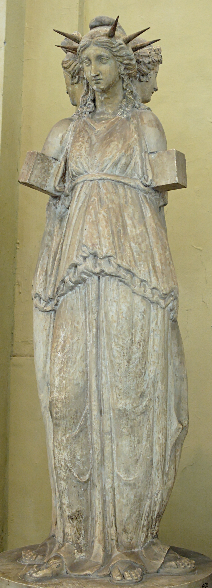{fig-align="center" width="255" height="771"}

Attributo di Artemide è l'arco, che ha ha un'altra volta ancora forma di mezzaluna. In epoca più tarda, seguendo la tradizionale ripartizione tra fase crescente propizia e fase calante nefasta, Artemide viene identificata con la Luna crescente, e la Luna calante trova forma in Ecate, che governa gli incroci, i demoni e l'oscurità. Nel mondo latino, soprattutto durante il sincretismo imperiale, il nome di Artemide diventa quindi perlopiù quello di Diana. Diana è casta, solitaria e irascibile, e nel suo aspetto infero e ctonio è conosciuta appunto anche come Trivia, da parte sua oscura, magica e mortifera, e inoltre celeste, terrena e marina. Il Santuario di Diana Nemorense comprendeva il tempio e le statue, un portico dorico con colonne intonacate in rosso e un altro con colonne di peperino grigio scuro, ambienti per i sacerdoti e alloggi per i pellegrini, celle donarie per le lustrazioni, bagni idroterapici e un teatro.

Di grande fortuna nelle letteratura e nelle arti, da Bernini a Stravinskij-Gide, sono altri appellativi di Ecate, detta anche Kore, cioè Persefone, in latino Proserpina, legata alla rinascita della vegetazione dopo i rigori invernali. È figlia della Terra, che in Grecia prende il nome di Cerere e a Roma quello di Demetra, ed è sposa di Ade, nel mondo latino chiamato Plutone, dio degli inferi e signore dell'oltretomba, che la rilascia a primavera. Studiando il mito quale sistema di conoscenza, Karòli Kereny ricorda come la tripartizione della dea era destinata tanto a lasciar posto tanto al cosmo ordinato di Zeus quanto a mantenere una sfera polimorfa infera; da parte sua, il legame del rifiorire della Terra dal mondo infero e dopo l'inverno, indicato dai Misteri Eleusini che ineriscono il mito di Proserpina, rappresenta un destino immortale che oltrepassa l'umano. Indagando i modelli universali inscritti negli aspetti impersonali della psiche, Carl G. Jung annota come la relazione madre e figlia tra Demetra-Proserpina rappresenti un ordine matriarcale che arriva a escluderlo, mentre nel femminile archetipo di Demetra l'uomo trova la propria esperienza più importante e decisiva. Le componenti oscure di questa vicenda alludono agli aspetti inconsci che l'uomo dotato di una «*personalità sopraordinata*» è chiamato a integrare.[^9]

[^9]: Karòli Kereny - Carl G. Jung, *Prolegomeni allo studio scientifico della mitologia* \[1941\], a cura di A. Brelich, Borighieri, Milano 1972, pp. 151-248.

Possiamo anche vedere in queste dee e nei loro nomi, il cui elenco potrebbe continuare indefinitivamente, il precipitare della Sapienza nel mondo materiale e il suo prodursi in una pluralità di manifestazioni. Funzioni e forme di un'unica idea che precede le religioni indoeropee, si differenzia e si disperde in esse come falda fertile, viaggiando tra il maschile e il femminile, la vita e la morte, gli uomini e gli dei, per venir quindi elaborata nel quadro delle rivelazioni monoteiste in forme femminili della divinità che hanno sotterranea ma decisa influenza. La sua presenza si mantiene costante nell'arte e ogni epoca le porta tributo; in epoca barocca, nel quadro del Guercino, accompagnata da un levriero, Diana si volta a vedere il suo amante Endimione addormentato. Abita, oggi come allora, la nostra psiche, e ne tenta il risveglio. Questo accade nelle modalità più proprie alla nostra esperienza personale e storica, che possono ancora vestirsi di quelle del mondo antico, ma che in una considerazione generale occorre adeguatamente considerare nel quadro dello sviluppo dei monoteismi. Ad ogni modo, a Diana si riferisce ancora la mezzaluna calante rappresentata sullo stemma della città di Genzano.

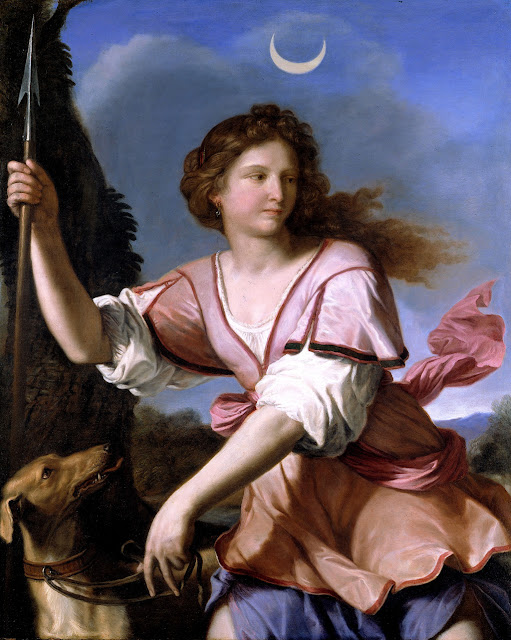{fig-align="center" width="482"}

## 3. Il volto nascosto dell'Islam

*Non vedi che Dio conosce quel che è nei Cieli e sulla Terra? (Corano 58:7)*

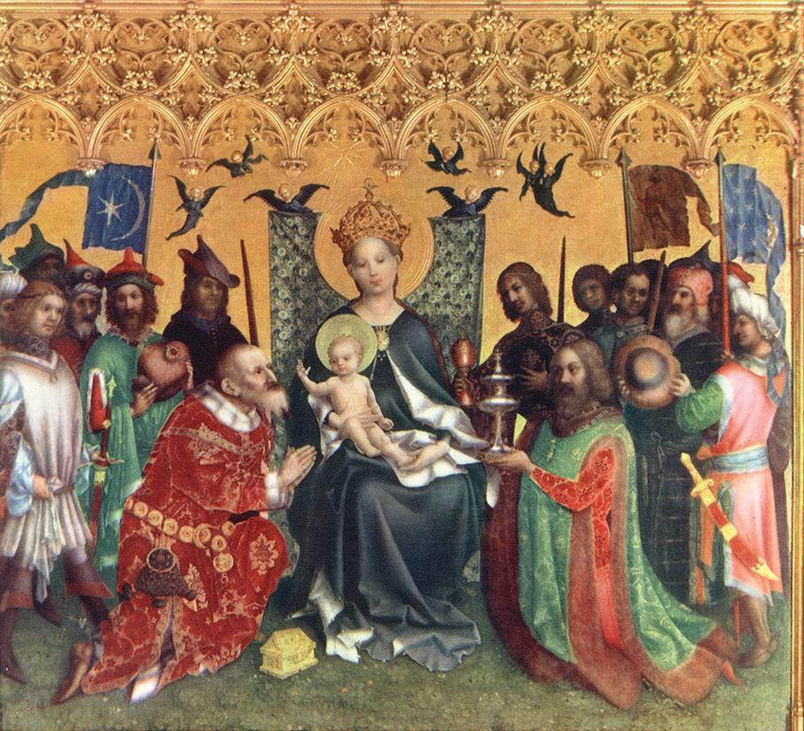{fig-align="center" width="549"}

La somiglianza tra la mezzaluna di Genzano e quella dell'Islam suggerisce come l'estrema lontananza possa accogliere una continuità sotterranea. E, in modi laterali, un aspetto nascosto dell'Islam può rivelarsi nei riflessi del lago, uno dei luoghi storici della latinità, così come aspetti essenziali della cultura greca e romana arrivano a riflettersi nelle increspature del Bosforo, sul quale si distende quella che fu la capitale dell'impero musulmano.

La città che oggi chiamiamo Istanbul ed è stata conosciuta pure come Costantinopoli e prima ancora come *Bizantyon*, nome poi recuperato insieme alla lingua greca al tempo di Eraclio, viene fondata su suggerimento dell'oracolo di Delfi nell'immenso porto naturale che fronteggia la città di Calcedonia, il cui nome "città dei ciechi" indica proprio il non essersi avveduti i suoi abitanti di tale opportunità. Occupata dai Turchi già in epoca bizantina, oggi si chiama Kadiköy ed è nella parte asiatica del sistema metropolitano stanbulino, che il Bosforo separa dalle due parti europee a loro volta separate dal Corno d'Oro. Il culto della dea e della Luna viene introdotto nelle forme di Hera da coloni provenienti da Argo, si specifica in epoca classica in quelle di Artemide, in seguito sembra mantenersi negli aspetti di Ecate. La città, così come la dea che un tempo ne fu protettrice, non è una, non è due: è tre.

Un simbolo è sempre plurale e nel suo formularsi storia e leggenda si confondono; se esprime il contenuto a cui rimanda, può trovare significati diversi nei differenti contesti. L'universalità è alla base del simbolismo, ma ogni simbolo si pone sempre su piani delimitati, convenzionati in base a presupposti e credenze da esplicitare di continuo. Troviamo il simbolo della mezzaluna utilizzato come segno di ringraziamento laddove Bisanzio scampa all'assedio notturno di Filippo II di Macedonia grazie alla luce di una Luna crescente. La mezzaluna coinvolge anche il Cristianesimo e nel 330 Costantino, dedicando la città a Maria Vergine, aggiunge il simbolo mariano della stella alla falce di Luna della dea ormai spodestata. Presso la Persia sasanide del V sec. d.C. la mezzaluna è nelle monete emesse da Kavad I.[^10] L'uso del simbolo da parte dell'impero Bizantino è riscontrabile nella pittura, e ne *L'adorazione dei Re Magi* (1440-1442) di Stephan Lochner i suoi rappresentanti lo riportano sui loro stemmi.

[^10]: [Omer Sayadi, *Post-Classical star and crescent,* «Mena symbolism» 03.17.2019](https://menasymbolism.wordpress.com/2019/03/07/the-ancient-star-and-crescent/).

Da parte sua Maometto, quando conquista la Mecca ai Coreisciti, tribù pagana alla quale peraltro appartenne suo nonno, mantiene inizialmente quale unica immagine di divinità al suo interno quella di Maria con Gesù. Per il sufismo, come rimarca Titus Burckhardt, il profeta dell'Islam assomma in sé i caratteri delle due figure, stabilendo così un'equivalenza tra la Maternità e la mezzaluna, affini in quanto manifestazioni della luce divina che interrompe l'oscurità della vita bruta soddisfando così il desiderio di Dio di essere conosciuto. Maometto rappresenta il ripristino dell'Uomo universale (*al-Insān al-Kāmil*), che assorbe le qualità che descrivono positivamente la divinità per essenza descrivibile soltanto attraverso negazioni. L'Uomo universale è in forma primordiale in Adamo, che per l'Islam non contrae peccato originale (*Corano* 53:38), e tutte le rivelazioni ne portano traccia, avendo ognuna con raggi diversi centro nel divino.[^11]

[^11]: Titus Burckhardt, *L'uomo universale. Antologia dall'opera di 'Abd Al-Karîm al-Jîlî* \[1975\], Edizioni Mediterranee, Roma 1981.

{fig-align="center" width="483"}

Le ventotto lettere dell'alfabeto arabo sembrano corrispondere ai ventotto giorni del mese lunare, e ventotto sono i profeti (*nabī*) che precedono Maometto citati nel *Corano*, tre di loro senza menzione esplicita del nome. In arabo la somma dei numeri che compongono la parola *Hilal* (mezzaluna nel senso di "crescente lunare") è 66, che corrisponde allo stesso valore numerico del divino nome *Allah*.[^12] In arabo la calligrafia del nome *Muhammad* trova l’aspetto di una stella a cinque punte. A detta del sufi Rumi «*il Profeta riflette Dio come la Luna riflette la luce del Sole*». La Luna (*Qamar*) è creata da Dio (*Corano* 10:15), al quale ella rende omaggio con il creato tutto (22:18), permettendo all'uomo il calcolo dei giorni (55:4) e la regolazione della preghiera.[^13] La purificazione delle intenzioni, ciò a cui sostanzialmente tende la *Sharia*, che lega strettamente il sacro alla quotidianità, consente al Sole di riflettersi nella Luna e quindi di riconoscere il Vero (91). Un legame tra Cielo e Terra è rintracciabile anche nelle assi che compongono la croce cristiana e nei triangoli che costituiscono l'esagramma ebraico.

[^12]: Annemarie Schimmel, *Deciphering the Signs of God. A Phenomenological Approach to Islam*, Albany: State University of New York Press, 1994.

[^13]: Jean Chevalier - Alain Gheerbrant, *Dizionario dei simboli* \[1969\], Rizzoli 1987.

Alcuni non esitano a far appartenere la mezzaluna ai Turchi, di origine altaica e divisi in varie tribù, sin dai tempi dell'antica popolazione dei Göktürk. I popoli turchi si convertono all'Islam nel X sec. ed esprimono una cultura fortemente ellenizzata, arrivando persino a rivendicare discendenze da Teucro di Troia.[^14] La mezzaluna viene utilizzata come stendardo dopo la conquista dell'Armenia del 1064 dal sultano selgiuchide Ap Arslan, che nel 1071 a Manzicerta cattura l'imperatore bizantino Romano IV Diogene.

[^14]: Piero Calò, *L'Islam e l'eredità bizantina*, Edizioni all'insegna del Veltro, Parma 1990.

Osman I agli inizi del XV sec. fonda la dinastia ottomana, e riceve in sogno la visione di una mezzaluna che sorge dal petto del sufi Edebali, padre di sua moglie, per quindi stagliarsi sopra il mondo. Un riflesso della Luna che nasconde una stella appare nel 1448 durante la battaglia di Kosovo nelle pozze di sangue dei cristiani sconfitti dagli Ottomani. Nel 1453 nella notte della caduta di Costantinopoli la mezzaluna e la stella sono viste tra le mani di Maometto II. L'impero assume il simbolo riconoscendosi nella conquista di Costantinopoli, predetta da un Hadit del profeta Maometto. *Ay Yıldız* è inizialmente una falce di Luna su campo verde, cambiato in rosso nel 1793 da Selim III; la stella a cinque punte viene introdotta nel 1844. Soltanto dal XX sec. la mezzaluna crescente diventa simbolo dell'Islam tutto.[^15]

[^15]: Jean-Paul Roux, *Storia dei Turchi: duemila anni dal Pacifico al Mediterraneo* \[1988\], Argo, Roma 2006.

Se la formulazione del simbolo risulta lenta e complessa, rimescola le carte sui riferimenti la principessa Marthe Lucile Bibesco. La grandiosità di Hagía Sophía è capace di annientare una persona così come può farlo il Cielo: «*prodigiosa basilica non dedicata al culto*» e «*santuario del Dio assente*», è lontana dal Cristianesimo quanto dall'Islam, e rappresenta l'«*enorme tempio dell'Idea*». L'evocazione di tale idea è fatta accompagnare dalla scrittrice e storica rumena a leggende per cui l'influenza occulta di Ecate mai abbandonò la città: le streghe la celebravano segretamente nella notte di San Giorgio, e l'imperatrice Teodora, reputata la cristianissima consorte di Giustiniano, la implorava affinché non perdesse i propri poteri di seduzione.[^16] Vada come vada, chiamiamola pure come ci pare, sui cieli di Istanbul sempre una Luna splende.

[^16]: Marthe Lucile Bibesco, *Gli otto paradisi* \[1908\], Sellerio, Palermo 1993.

Procopio di Cesarea nella *Storia segreta,*[^17] che contiene ogni sorta di invettiva contro Giustiniano e consorte, ci informa invece che l'imperatrice, «*famosa meretrice*», era cristiana monofisita. Per i monofisiti Gesù ha unica natura, tanto divina quanto umana, in maniera difforme dalla prescrizioni stabilite nel 451 dal Concilio di Calcedonia (l'antica "terra dei ciechi" e l'attuale Kadiköy già ricordata). Con la conquista musulmana di Costantinopoli molti dei monofisiti, a lungo perseguitati, si convertono all'Islam. A modo suo, anche questo fiume porta allo stesso mare: ogni prospettiva di questa straordinaria città, tutte le diverse tradizioni che ha accolto, sembrano convergere in una visione tanto sfaccetta quanto unitaria.

[^17]: [Procopio di Cesarea, *Storia segreta* \[554-560\],](https://it.wikisource.org/wiki/Storia_segreta) [a cura di G. Compagnoni,Sonzogno, Milano 1828.](https://it.wikisource.org/wiki/Storia_segreta)

Dove il rigoroso monoteismo islamico non consente divinità associate di nessun tipo, unità e molteplicità di Dio si manifestano tramite i piani dell'essere e attraverso l'uomo nei Nomi divini, generalmente considerati in numero di 99, infiniti a detta del filosofo e sufi Ibn Arabi, da considerarsi quali ipostasi o *dimensioni* della divinità attraverso i quali essa si rende conoscibile.[^18] Tali Nomi si dividono, seguendo distinzioni già proprie al pensiero greco, in attributi di essenza (forma universale, *tí ên eînai*) e di sostanza (fondamento ontologico, *ousia*) e laddove tra i primi è la Sapienza e tra i secondi il Creatore, Dio muove ed è testimone di ogni cosa. Oltre a non sussistere dualismi o trinità, Dio si svuota anche dagli attributi antropomorfi e quindi non è né uomo né donna.

[^18]: Ibn Arabi, *I nomi più belli di Dio* \[1201-1204\], a cura di Pablo Beneito Arias, Mimesis, Milano 2011.

{fig-align="center" width="550"}

Se la riduzione di Allah a divinità lunare non trova pertinenza nella sua articolazione concettuale, esistono ad ogni modo aspetti femminili della divinità che trovano spazio in maniera eminente nel Nome divino *Rahîm*, il Misericordioso, riportato nell'esordio di tutte le Sure (eccettuata la 9, probabilmente per un frazionamento), che indica qualità di compassione verso la creatura e quindi le *viscere*, chiamate anche *cuore*. Il cardinal Ravasi ricorda che l'arabo *Rahîm* deriva dall'ebraico *rahamîm,* che ricorre in Mosé con «*il Signore Dio misericordioso e pietoso, lento all’ira e ricco di amore e di fedeltà*» (*Esodo* 34: 6) e in Davide dove «*il Signore prova tenerezza verso quelli che lo temono*» (*Salmo* 103:13). Inoltre, ha equivalenze con il verbo greco *splanchnismos* il cui senso più pregno è «*avere viscere di tenerezza misericordiosa*», come accade a Cristo incrociando il funerale del figlio unico di una vedova (*Luca* 7:13), davanti a un lebbroso (*Marco* 1:14), di fronte ad una folla affamata (*Marco* 6:34), e come accade al buon Samaritano e al padre del figliol prodigo (*Luca* 10:33; 15:20).[^19]

[^19]: [Gianfranco Ravasi, *Rahamîm: viscere di misericordia*, «Famiglia Cristiana» 17.06.2021.](https://www.famigliacristiana.it/blogpost/rahamim-viscere-di-misericordia.aspx)

Presso l'Islam sussiste il concetto marcatamente femminile di Madre del Libro, archetipo del Corano custodito in Cielo che precede la lingua stessa, libro-matrice concepibile quale attributo di Dio che partorisce il reale in maniera conforme esclusivamente al suo volere: «*Allah cancella quello che vuole e conferma quello che vuole. È presso di Lui la Madre del Libro*» (13:39). Ibn Arabi considera che, se «*noi siamo di Dio e a Lui ritorniamo*» (2:156), pur non avendo figli e non essendo né padre né madre (19:35), Dio partorisce la Terra che, riflettendo nella sua pienezza la presenza divina, è celebrata quale fonte creativa.[^20] Dall'argilla, elemento marcatamente femminile, è fatto l'uomo da cui poi è tratta la donna (15:9). In maniera difforme dal rigorismo fondamentalista e dal perpetuarsi delle false opposizioni che caratterizzano gli integralismi, e senza ridursi al livellamento delle diversità e alla mistificatoria confusione tra i generi ai quali ha condotto il progressismo, forme maschili e femminili della divinità indicano un percorso di perfezionamento umano di assimilazione e integrazione. Ogni tensione è riportata ad Unità, ogni cosa dispersa si riconduce ad Uno. Accendere una luce nell'oscurità che sorvegli l'ombra e dissolva la tenebra: la lezione della mezzaluna sembrerebbe essere questa. Con ogni evidenza, non basta fare riferimento nel simbolo o crederci in maniera irriflessa per farne esperienza, e infatti l'ideologia islamista sembrerebbe, in maniera affine all'ebraismo sionista, piuttosto chiusa in un'oscurantista ripetizione dell'identico, secondo una specie di programmazione monodirezionale per cui le Scritture vengono assunte come fossero una specie di manualetto scemo, e con un'attitudine inquinata che non sa in nessun modo rispondere all'appello di nessun nome.

[^20]: [Sa’diyya Shaika, *Allah, hidden treasures, and the Divine Feminine*, «The Immanent Frame» 27.05.2019.](https://tif.ssrc.org/2019/05/27/allah-hidden-treasures-and-the-divine-feminine/)

In questo mondo in troppi parlano a nome di qualcosa che nemmeno li rappresenta, pretendendo persino di prendere voce per tutti. Vanno addirittura contro se stessi e quanto davvero amano, servi di assiomi indiscutibili ma non compresi e spesso anche soltanto di semplici opinioni, religiose o politiche, istituzionali o plebee che siano, contribuendo così a distruggere il mondo stesso nonché la propria e l'altrui esistenza. La cosa più terribile sono quelli che restano sempre all'interno del recinto per loro deciso, a volte contrastandosi ferocemente, ma senza mai metterne in discussione i presupposti, rafforzando quanto li opprime persino quando credono di opporvisi. Quanto serve, quanto davvero resta, in questa guerra che ovunque infuria, è trovare lo spazio che permetta di affermare intuizioni personali profonde e autorevoli, e quindi di elaborare idee capaci di imporsi in virtù propria rompendo le convinzioni imposte nonché le false opposizioni. Alimentare una capacità di comprensione dotata di propria forza, in rapporto vivo con la storia e il presente, il pensiero e la realtà, affermare una comprensione autenticamente in diritto di sussistere di fronte a quanto resta degli uomini e a quanto davvero possa essere la divinità, e così permettere di ritrovare un futuro lì dove sembra esserci soltanto una ferita.

Cio che può portare vera e splendida luce in tenebre apparentemente senza scampo è nella rinnovata alleanza di ognuno con quella che in ogni tradizione ha portato il nome o il segno della sapienza. Suggerisce il filosofo Henry Corbin, rispondendo a Jung e corrispondendo con il suo ecumenismo gnostico e il concetto di *immaginale* all'idea degli archetipi quali funzioni trascendentali dell'esperienza, che ciò è possibile anche nello scoprire la Sapienza quale alleanza tra umano e divino capace di agire attraverso un piano di individuazione rigorosamente personale e non trasmissibile, rendendo così proprio questo mondo travagliato «*immagine di questa Sophia divina eterna*» e «*specchio del mondo divino*». Laddove nella considerazione delle divinità femminili e degli aspetti femminili della divinità, più si procede e più si chiarisce che non necessariamente hanno carattere benevolo o compiuto di per sé. Questo può contribuire a far comprendere quanto sia ormai superato quel femminismo che è arrivato a impuntarsi su patriarcati immaginari per non riconoscere la propria petulante e presuntuosa paternale, e che da tempo «*non fa altro che riconoscere definitivamente la preponderanza e il primato dei valori maschili, sia pure come caricatura*». Così, il regno della Sapienza divina può piuttosto tralucere nelle possibilità di «*un mondo in cui l'amore dovrebbe procedere ogni conoscenza e in cui il senso della morte non sarebbe che la nostalgia della resurrezione*».[^21] Questo mondo sempre possibile è anche quello dove la medesima Luna vagabonda che ispirò gli antichi ancora si riflette sulle acque del Bosforo e del lago di Nemi facendo scintillare come lame gli orizzonti della metropoli e dei boschi. La stessa Luna continua a illuminare Hagía Sophía senza dare troppa importanza alla sua destinazione di culto: la stessa Luna che sto guardando io, e che ora è sopra voi.

[^21]: Henry Corbin, *La Sophia eterna* \[1953\], Mimesis, Milano 2014.

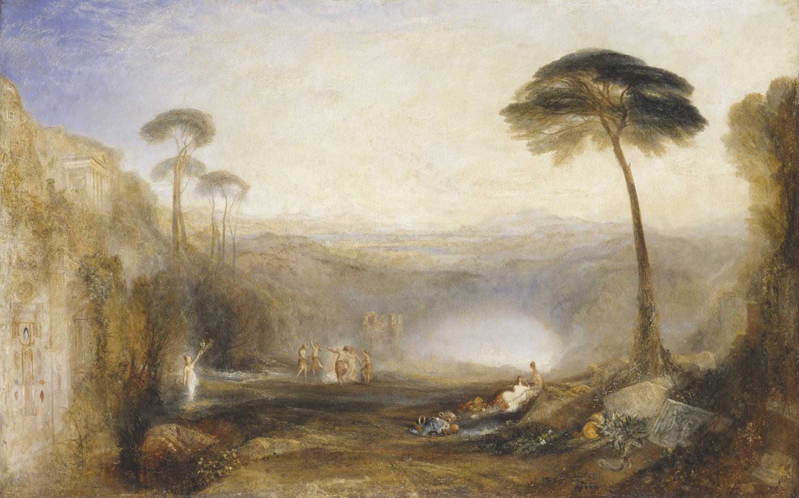{fig-align="center" width="562"}

## 4. Memorie interrotte

*La mia Luce è sparita come alito, e io sono diventata Materia. (Pistis Sophia 39:5)*

Nei boschi sulle sponde del lago di Nemi, presso il Santuario di Diana, risplendeva nel riflesso della Luna la lama di un coltello, brandito da uno schiavo fuggitivo. In remote notti d'estate, esattamente il 13 agosto, egli avrebbe colto un ramo d'oro da un albero sacro che nessuno poteva spezzare, e uccidendo il proprio predecessore sarebbe stato nominato *Re del Bosco*. James Frazer[^22] per *Il ramo d'oro* si ispira all'omonimo quadro di William Turner e ricorda che dobbiamo ad Oreste la figura del *Rex Nemorensis* e l'introduzione del culto di Diana, il cui tempio viene traslato sull'Aventino dal re Servio Tullio. L'imperatore Caracalla, perfezionando l'influenza egizia su Roma, associa il lago al culto di Iside, altra forma della divinità lunare, a detta di Plutarco «*dea eletta per sapienza e amante di sapienza*», nata insieme ad Osiride dall’unione tra Nut (il Cielo) e Geb (la Terra).[^23] Caracalla vi colloca, conformemente al carattere del sito, due navi atte alla celebrazione di feste religiose, che in seguito alla sua morte vengono affondate dai senatori, per essere quindi sottoposte, insieme a tutta la sua opera, alla *damnatio memoriae*. Nessuna prova testuale ha mai supportato tali circostanze, che con ogni evidenza si sono dimostrate come effettive. ll complesso del tempio si estendeva su un'area di 45.000 mq dal perimetro di metri 200 per 175. Oggi ne sono visibili una parete di grandi nicchioni, una parte del pronao con un altare votivo, alcune colonne. La generalità dei reperti ha subito una dispersione territoriale enorme, analoga a quella del patrimonio archeologico del Tuscolo, che si auspica possa recuperarsi, quantomeno parzialmente e in forma di copie, nell'esistente struttura museale.

[^22]: James Frazer, *Il Ramo d'Oro* \[1890-1922\], Newton Compton, Roma 1992.

[^23]: Plutarco, *Su Iside e Osiride* \[II sec. d.C.\], a cura di D. Del Corno, Adelphi, Milano 1985.

Tra i reperti navali che affioravano dal lago già dal medioevo e oggetto di abituali saccheggi da parte di pescatori e altri residenti, delle *fistule acquarie* in piombo che ne permettono l'attribuzione a Caligola. Le ricerche iniziano per volere del card. Prospero Colonna signore di Genzano sotto la cura di Leon Battisti Alberti nel 1446, quindi conoscono una ripresa nel 1535 ad opera dell'architetto bolognese Francesco de Marchi.[^24] Nella seconda metà del 1600 i signori di Nemi Mario e Pompeo Frangipani accompagnano nuovi lavori di recupero degli scafi all'urbanizzazione del borgo di Nemi.[^25] Nel 1827 ci lavora il cav. Annesio Fusconi e, mentre i reperti trovano spazio in collezioni private e musei extraterritoriali, Nibby contesta l'attribuzione delle navi a Caligola. Nel 1895 se ne occupa la famiglia Orsini, proprietaria del lago, con il contributo dello Stato.[^26] Dopo tutti questi sporadici, parziali e anche dannosi tentativi, nel 1929 una commisione presieduta dal sen. Corrado Ricci permette il recupero dei resti delle due imbarcazioni attraverso lo svuotamento delle acque del lago. Custodite presso il Museo delle Navi di Nemi voluto da Mussolini, progettato da Vittorio Ballio Morpurgo e inaugurato nel 1940, i resti degli scafi e la struttura del museo vengono devastati dalle fiamme dopo solo quattro anni il 31 maggio 1944. Demistificando tutte le false piste accavallatesi per lunghi decenni, Flavio Altamura e Stefano Paolucci hanno dimostrato che l'incendio dell'edificio museale fu provocato da quattro granate di un cannoneggiamento americano mirato a neutralizzare una vicina postazione di artiglieria tedesca.[^27] Una perdita incolmabile, quella dei reperti delle navi, a cui soltanto recentemente è stata fatta giustizia, quantomeno in sede di studi storici: e chissà quanti altri misfatti continueranno ancora a venir coperti da luoghi comuni più o meno interessati.

[^24]: Ugo Antonielli, *La prima nave imperiale del lago di Nemi*, Istituto Italiano d'Arti Grafiche, Bergamo 1930.

[^25]: [Giovanni Argoli, *Epistola ad Jacobum Philippum Tomasinum de templo Dianae Nemorensis*, in: Giacomo Filippo Tomasini, *De donariis ac tabellis votivis liber singularis,* II ed. Padova 1654.](https://books.google.it/books?id=6KhSAAAAcAAJ&lpg=PA13&dq=AR%20GOL%20VS&hl=it&pg=PA13#v=onepage&q&f=false)

[^26]: [Saverio Giulio Malatesta, *Le navi di Nemi*, 24.03.2019, «saveriog».](https://www.saveriog.net/le-navi-di-nemi/)

[^27]: Flavio Altamura - Stefano Paolucci, *L'incendio delle navi di Nemi*, Passamonti, Grottaferrata 2023; [Flavio Altamura - Stefano Paolucci, *Una lente sull’incendio delle Navi romane di Nemi*, «Engramma» 203, 23.06.2023.](https://engramma.it/eOS/index.php?id_articolo=5153)

La storia di questo nostro povero mondo sembra sempre la stessa, e continua a diffondere inganni, riscattato ogni tanto da qualche momentanea bellezza. Quella dei luoghi. Lo «*specchio ovale del vitreo lago*» e le «*onde scintillanti*» del Bosforo spazzate da «*una brezza fugace*», come nei girovagare giovanili dell'*Aroldo* (1809-1818) di Lord Byron, che anche nell'epistolario racconta delle «*meraviglie*» tanto di Istanbul quanto dei Castelli romani. Lo riscatta, questo povero mondo, talvolta, quello che chiamiamo amore, che forse non è cosa per gli umani, per quanto straparlino di Dio. E proprio per denunciare le inadeguatezze nell'organizzazione civile e nel rispetto della persona ancora riscontrabili nelle convenzioni tanto cristiane quanto musulmane, Byron compone *Il Giaurro. Frammento di un racconto turco* (1812-1813), ispirato all'esecuzione sommaria di un'adultera alla quale aveva assistito ad Atene. Un linguaggio studiatamente zeppo di arcaismi e una forma frammentaria e modulare gli permettono ampie trasgressioni rispetto all'unità cronologica e a quella della voce narrante. Il Giaurro è l'infedele veneziano che vendica l'omicidio di Leila, donna musulmana da lui amata, una serva che per adulterio viene gettata in mare chiusa in un sacco. Le inadeguatezze sono pure personali, anche l'amore uccide: la fede di lei è complice della sua morte, che lui ha provocato con il suo desiderio. Per quanto cerchi espiazione in un monastero, l'uomo è ormai al di là del bene e del male in modi che egli stesso stenta a comprendere e, nonostante il tormento a cui è costretto, viene riscattato da «*una scintilla del fuoco immortale/ dono di Allah - condiviso dagli Angeli/ per innalzare da terra il nostro desiderio triviale.*»[^28]

[^28]: Lord Byron, *Opere scelte*, a cura di T. Kemeny, Mondadori 1993.

Nelle inadeguatezze del nostro presente, banalmente al di qua del bene e del male, incapace di amore e incomprensibile anche a se stesso, le memorie antiche restano interrotte. Così, irrimediabilmente lontane dai fasti classici, dalle glorie del feudo tuscolano e anche dalla fortune settecentesche, Genzano è conosciuta per produrre pane casareccio, nel bosco di Nemi si coltivano le fragole: come dice la canzone *Nannì,* «*li Castelli so' così*». E a parte il godere di un'ottima gastronomia, in queste contrade non sembra esserci molto da fare. Forse, la loro storia si è per davvero conclusa; oppure, più semplicemente, non siamo in grado di muoverla. Le acque del lago, già ridotte per i lavori connessi al recupero delle navi, si ritirano progressive e inesorabili tanto in risposta a cicli antichi quanto per l'azione dell'uomo, fornendo così estremo emblema a quello svuotamento che sembra il segno della nostra epoca.

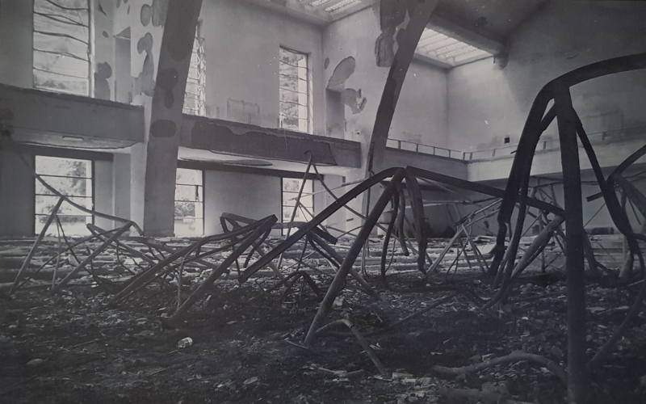{fig-align="center" width="547"}

Metropoli antica, detta già dai Bizantini *Is tin polin*, la città, da parte sua Istanbul genera, travolge e sopravvive a quattro imperi: romano, bizantino, latino, ottomano. Charles Fourier, che critica e detesta capitalismo e libero mercato teorizzando società dove individualismo, merito e istanze socialiste possano accordarsi, annota che essa fosse destinata a diventare capitale del mondo. Su questa scia, Gustave Flaubert ne ammira lo splendore e la fierezza e, sentendosi schiacciato dalla sua folla e immensità, testimonia che «*come umanità è davvero enorme*», con cimiteri che sono «*foreste in mezzo all'abitato*» e palazzi che sembrano le navi di «*una flotta immobile*».[^29] Ritorna, anche sulle terra ferma, l'immagine delle acque. E dove, come suggerisce Orhan Pamuk, le acque del Bosforo si stanno ritirando, quello che fu un paradiso terrestre «*presto si trasformerà in una tetra cloaca dove le carcasse dei galeoni, coperte di fango nero, luccicheranno come denti di fantasmi*», trascinando così con sé tutte le civiltà nate sulle sue sponde.[^30]

[^29]: Gustave Flaubert, *Correspondance*, Charpentier, Paris 1887-1893.

[^30]: Orhan Pamuk, *Libro nero* \[1990\], Milano, Frassinelli, 1996.

Immagini arcaiche si sovrappongono a quelle contemporanee nel sistema gemello costituito dall'affiancarsi della cerchia regolarissima del Grande raccordo anulare che circonda la capitale con quella più incerta e immaginaria dei paesi dei Castelli Romani e Prenestini. In tale sistema, possiamo in qualche modo intravedere due diverse e distinte realtà. Infatti, i due anelli che si evidenziano dalle mappe formulano la moderna proiezione topografica dei Dioscuri, i divini gemelli figli di Zeus e Leda che fino alle Guerre Latine furono protettori di Tuscolo, le cui statue dalla seconda metà del XVI sec. ci accolgono alla sommità della scalinata del Campidoglio, indicando un qualcosa che appartiene in maniera archetipitica ed essenziale all'Urbe nella sua continuità con il territorio. Inoltre, in maniera più contemporanea, possiamo anche immaginare in tali cerchi gemelli la filigrana di una metropoli romana capace di comprendere insieme città e paesi, appartemente ancora impossibile ma alla quale prima o poi bisognerà fornire risposte. Fino ad ora, esclusivamente un abusivismo sfrenato ha saldato i paesi alla città, nessuno si è preoccupato di realizzare in modi adeguati servizi e infrastrutture: la condanna al provincialismo sancita dalla politica è stata implacabile. Questa condanna risulta ancora più beffarda laddove fu Roma a inventare la politica, ma in fondo fu una politica che ratificò il fratricidio, trasmessasi in tali forme pure alle sue eredità bizantine e ottomane. E, per quanto dei, erano fratelli pure i Dioscuri.

Anche a Istanbul, Roma d'Oriente, i vuoti urbanistici tendono perlopiù ad essere colmati da una logica irriguardosa. La vertiginosa crescita economica verificatasi dal 2002 ha incrementato tanto il livello di vita quanto quello degli investimenti. Sulukule, nel distretto di Fatih, quartiere dalle piccole e colorate case in legno, abitato dai tempi di Solimano il Magnifico da Rom dei Balcani, è stato travolto dalle ruspe nel 2009. Poco dopo, dall'altra parte del Corno d'Oro, a Beyoglu e quindi tra Taqsim e Pera, a Tarlabasi, vicino alla centrale strada Ìstiklâl Caddesi, sono stati abbattuti i palazzi ottomani popolati da Curdi, in pessimo stato e dalla fama ancor peggiore. Al posto dei quartieri popolari, abitazioni lussuose: la nomina di Istanbul a Città europea della cultura del 2010 ha così trovato celebrazioni in linea con le peggiori tendenze occidentali.

Le proteste che nel 2013 hanno coinvolto piazza Taqsim hanno portato il segno di un dissidio tra potere e popolazione che ha mobilitato, in forme nuove, millenarie irruenze e crudeltà levatine. Causa principale, la prevista rimozione di Gezi Park, tra i pochi spazi verdi della parte europea, da sostituire con una ricostruzione in stile ottomano della Caserma Militare demolita nel 1940, con al piano terra un centro commerciale e ai piani superiori appartamenti di lusso. Inoltre, la realizzazione di una moschea, il cui progetto era stato precedente bocciato in quanto «*contrario all'interesse pubblico*», nonché la demolizione e il rifacimento del Centro culturale Ataturk, simbolo della Turchia repubblicana. Le proteste, debordanti e spavalde, caotiche e contagiose, sono state caratterizzate da spiccata eterogeneità: kemalisti, socialisti, comunisti, anarchici, libertari, ambientalisti, femministi, attivisti LGBT, turchi nazionalisti e islamisti anticapitalisti, associazioni politiche e sindacali, associazioni calcistiche quali UltrAslan e Çarşı. Metà dei manifestanti erano donne. Ruolo fondamentale lo hanno avuto gli Aleviti,[^31] musulmani di derivazione sciita, influenze cristiane e zoraostriane e tendenze universaliste, invisi ai rigoristi sunniti e alla destra nazionalista, già kemalisti per quanto traditi anche da Atatürk e attualmente su posizioni di sinistra dissidente, che rappresentano tra il 10 e il 20 % della popolazione turca. Tra gli Aleviti c'è stato il 78% dei più 1700 arrestati. Tra gli altri, il 25% era laureato, il 36% studenti universitari, il 56% tra i 18 e i 25 anni, il 26% tra i 26 e i 30, ultraquarantenne solo l'1%. Oltre 8.163 i feriti, 11 i morti. Più di 900 persone sono state prese in custodia in più di 90 manifestazioni svoltesi in 48 province. Nessun risultato della protesta è stato raggiunto. Erdogan ha proseguito le sue politiche di restrizioni in forza di un consenso elettorale che spacca a metà il Paese e di un ruolo internazionale destinato a crescere di importanza. Il nostro presente disattende di continuo le proprie esigenze. Ed è quindi il sottrarsi alle pretese della sua ignoranza a permettere quello spazio vuoto nel quale ritrova possibilità una sapienza.

[^31]: [Marta Ottaviani, *Gli Aleviti in Turchia o la tolleranza non ricambiata*, «oasiscenter» 10.06.2021](https://www.oasiscenter.eu/it/gli-aleviti-in-turchia-e-la-tolleranza-non-ricambiata); [Mavro, *Cos'è l'Alevismo e cosa abbiamo da imparare dagli Aleviti*, «Abrahamic Study Hall» 12.06.2021.](https://it.abrahamicstudyhall.org/2021/06/12/cose-lalevismo-e-cosa-abbiamo-da-imparare-dagli-aleviti/)

## 5. Vuoto presente

*Nessuna delle potenze che governano questo mondo ha conosciuto questa Sapienza. (Prima lettera ai Corinti 2:8)*

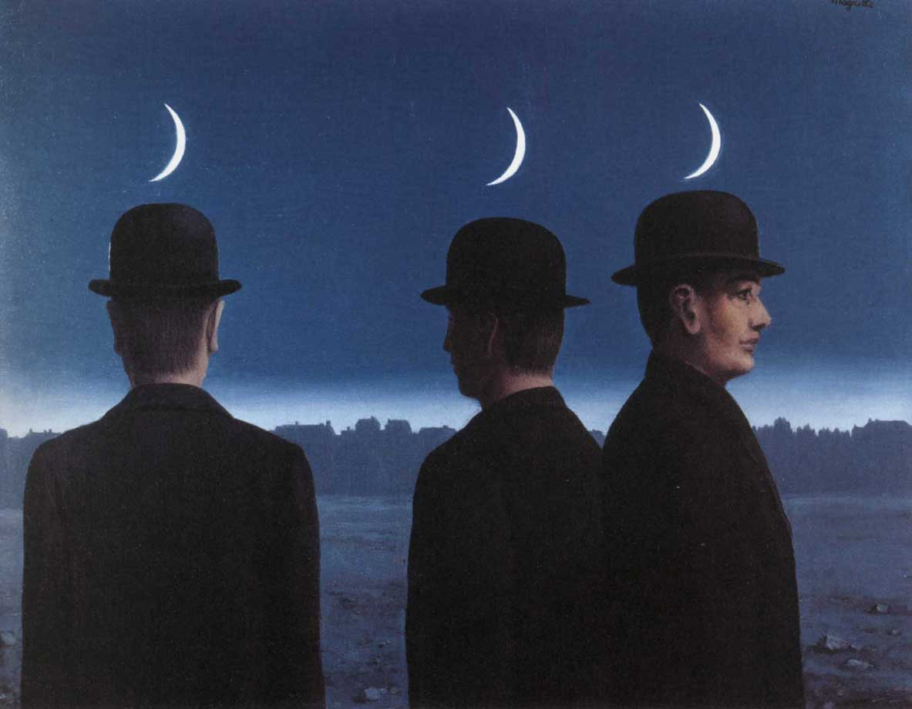{fig-align="center" width="585"}

«*Non basta acquistar la sapienza, bisogna anche usarla*»: questa sentenza di Marco Tullio Cicerone[^32] fa comprendere come la parola *proverbio* abbia assunto il significato di normativa che viene desunta e riferita all’esperienza, traducendo in tal modo il termine greco *phronesis,* sapere utile a orientare le scelte pratiche. La parola "proverbio" traduce tuttavia anche il termine ebraico *mashal*, che significa saggezza, indicando quindi una conoscenza pratica collegata al possesso della perfezione spirituale teorica. In tal senso va inteso il *Libro dei Proverbi,* compilazione del V sec. a. C. attribuita a Salomone, che rappresenta il centro del corpus ebraico, dove la figura della Sapienza viene presentata non quale nozione, ma come ipostasi che assume qualità di essere personale e parla a proprio nome, dono di Dio e partecipe della creazione, il cui accoglimento è vitale per l'uomo (Proverbi 8:22-36). Tali termini ricorrono anche nel *Logos* descritto nel *Vangelo di Giovanni* (1:10) dalla cui osservanza e il cui dipendere da Dio configurano la Sapienza come lo Spirito Santo nella presenza del Padre e del Figlio (14:23), portando quindi a identificarla come la seconda persona della Trinità. Nel pensiero greco, lo stoico Cleante si richiama ad Eraclito per affermare la dottrina del *logos spermatikòs*, "ragione seminale", principio che si diffonde nella materia inerte animandola.[^33]

[^32]: Marco Tullio Cicerone, *De finibus bonorum et malorum* \[45 a.C.\], a cura di A. Selem, Edizioni dell’Ateneo, Roma 1962.

[^33]: [Cleante di Asso, *Inno a Zeus* \[III sec. a.C\], «Poetarum Silva» 23.05.2013.](https://poetarumsilva.com/2013/05/22/cleante-di-asso-inno-a-zeus/)

Nel *Vangelo di Giovanni* (15:26; 16:17) ricorre il termine *Paràcletos*, letteralmente "*chiamato appresso*", traducibile in latino come "*advocatus*", da cui quindi il titoli di "*Consolatore*" o "*Aiutatore*", che chiama in causa la Pentecoste, discesa dello Spirito Santo (*Atti degli Apostoli* 2:1), spirito di verità destinato a guidare il cammino della Chiesa. Invece, letto come *Periklytos*, che significa "*Glorioso*", conosce come traduzione araba *Ahmad*, che ha come significato il "*Molto Lodato*" e corrisponde al nome celeste di Maometto; il significato di Maometto è "*Colui che molto loda*", in quanto come in uno specchio chi ha molto lodato Dio in Terra diviene colui che riceve molte lodinei Cieli. In tali termini, l'Islam considera il passo di *Giovanni* quale profezia di Maometto, che nel *Corano* è descritto dalle parole di Gesù quale il messagero (*rasul*) e il profeta (*nabī*)che Dio è prossimo a inviare per fornire la definitiva e corretta conferma delle rivelazioni ebraiche e cristiane (*Corano* 61:6). Su tale punto l'Islam, pur mantenendo ruolo messianico a Gesù e attenzione al testo evangelico, si distacca in modo decisivo dal Cristianesimo. Si riaggancia quindi all'Ebraismo dove afferma «*Coloro che sono radicati nella scienza dicono: "Noi crediamo: tutto viene dal Signore. Ma i soli ad averne ricordo sempre sono i dotati di intelletto*» (3:7), affermazione che sembra in controcanto con l'idea ebraica che «*Il Signore con la Sapienza fondò la Terra e consolidò le cose con l'Intelligenza*» (*Proverbi* 3:19). Questi passaggi fanno comprendere la portata speculativa, nonché il legame che i testi che si dicono sacri intrattengono tra di loro e con i testi e i temi della tradizione filosofica.

Occorre approfondire, seppur brevemente, alcune questioni, forse remote eppure incombenti, che comunque rappresentano lo scioglimento dei fili che sono stati dipanati: quanto ci chiama a farlo è esattamente lo stesso vuoto che abbiamo finora attraversato. Il "ricordo" (*dhikr*) di Dio a cui allude il Corano si riferisce alla nozione, cruciale nel Sufismo, della lucida coscienza dell'Onnipresenza divina percepita nella mente dell'uomo, tra i cui esercizi conosce quella della recitazione dei Nomi di Dio. Tale elemento è incorporato anche nella pratiche degli Aleviti, che considerano bigotto, fanatico e reazionario il legalismo sunnita, e hanno usanze peculiari, quali l'utilizzo della musica nelle cerimonie e il pregare senza inchinarsi accompagnandosi alle donne alle quali riconoscono piena parità. L'Uomo universale, *al-Insān al-Kāmil,* viene riconosciuto in termini pratici come il Perfetto Essere Umano, controllato, equo e altruista. La credenza negli Angeli (*malāʾik* in arabo, *melekler* in turco), prescritta nell'Islam come articolo di fede, si specifica in culto e si differenzia laddove gli Aleviti ritengono che durante la Creazione cinque Arcangeli (*karubiyin*) furono invitati da Dio alla sua Presenza; di fronte alla Luce che rappresenta Maometto e Alì, uno di loro rifiutò di prostarsi, come di fronte ad Adamo è compiuto da Iblīs, miscredente già nel considerare non giusto l'ordine divino (*Corano* 7:11-18; 36:40-42; 18:50). Invece, presso il paganesimo arabo erano considerati angeli le divinità femminili quali Allat, al-'Uzzā, e Manāt, dal cui culto e intercessione quali "figlie di Dio" il Corano prende le distanze (54:19-20; 53:19-20); le tre divinità possono essere denominate, facilitando l'individuazione del loro carattere nonché dei loro corrispettivi in altri contesti, quali la dea della Luna infera, la Potentissima, il Destino.[^34]

[^34]: Toufiq Fahd, *Le panthéon de l'Arabie centrale è la veille de l'Hégire*, Librairie Orientaliste Paul Geuthner, Paris 1968.

Per comprendere a cosa si riferisce l'Ebraismo con la Sapienza e il suo operato, possiamo rivolgerci alla Cabala. Specifica lo *Zohar* che nell'uomo la sapienza è la capacità di rispondere a ogni domanda, superiore all'intelligenza da intendere come capacità di dedurre da un particolare l'intera struttura, ed è superiore anche alla conoscenza. Invece, l'operato di Dio, che crea una cosa dall'altra, è piuttosto complesso e articolato. Sappiamo che Dio con la Sapienza ha creato i Cieli, e con l'Intelligenza ha fondato la Terra (*Proverbi* 3:19). Poi, con l'Intelligenza ha creato i Cieli, emanando dalla sua Luce quali fondamento di tutte le creature i Nomi angelici (*Elohim*, "coloro che stanno davanti"), "figli di Dio" che «*cantano insieme alle stelle del mattino*». Con la Sapienza ha quindi stabilito per la Terra quale fondamento le Acque sulle quali aleggiava già prima della Creazione, per poi dividerle tra quelle sopra e sotto il Cielo (*Genesi* 1:6-10). Gli Angeli rappresentano aspetti del divino che derivano da *Esodo* (14:19-21), i cui versetti si compongono in 72 Nomi dei quali ognuno a sua volta si tripartisce in tre Angeli.[^35] Nei loro confronti è indegno fare sacrifici ma possono essere meditati con intenzioni pure (*Zohar* Hadaš:4a-6a). Tutto ciò concorre a Sapienza che, ricordiamolo ancora, oltre ad agire nella Creazione, è vitale per l'uomo. Chi la perde danneggia se stesso e chi la odia sceglie la morte. Inoltre, essa spalanca l'Abisso (*Proverbi* 8:36; 3:20).

[^35]: Nadav Hadar Crivelli, *I Settantadue Nomi di Dio*, Psiche2, Torino 2012.

L'Abisso (*Tehom*) corrisponde a quanto all'alba della Creazione è ricoperto dalle Tenebre (*Genesi* 1:1) e, oltre ad essere lo spazio vuoto che la precede, rappresenta una delle sette abitazioni infernali dello *Sheol*, detto anche *Sithra Achra* ("altra parte", che si oppone alla santità e all'osservanza dei precetti), regno dei morti e dimora delle forze spirituali impure, che prendono la forma nelle *Qliphoth* ("gusci vuoti" dell'Albero della Morte, opposti alle *Sephirot* dell'Albero della Vita), nelle quali si raccolgono gli scarti della Creazione e il male degli uomini. Nel rinascimento il cabalista Isaac Luria, ripreso recentemente anche in ambito cattolico dal card. Martini, sostiene che, prima della Creazione, Dio si contrae, compiendo un atto di autolimitazione (*Tzimtzum*), con il quale si esilia dal mondo istituendo il vuoto che lascia spazio al cosmo e all'azione umana.[^36] Ciò spiega la presenza del male, nonché dell'idolatria, e aggiungere anche degli stati patologici, i quali tuttavia possono nascondere e racchiudere scintille di santità e sapienza. Il primo delle serie delle *Qliphoth* prende il nome di Lilith, la prima moglie di Adamo che rifiutò di sottomettersi a lui, per quindi attentare alla vita dei suoi figli, per accoppiarsi con l'arcangelo Samaele, l'Avversario (*Zohar* II:242b-243a; III:19a-20a; III:41a-b). Fermiamoci qui, e restiamo nel presente.

[^36]: [Lorenzo Cortesi, *Tzim-Tzum, la contrazione di Dio e il suo esiliarsi*, 26.12.2007 «blogphilosophica».](https://blogphilosophica.wordpress.com/2017/12/26/tzim-tzum/)

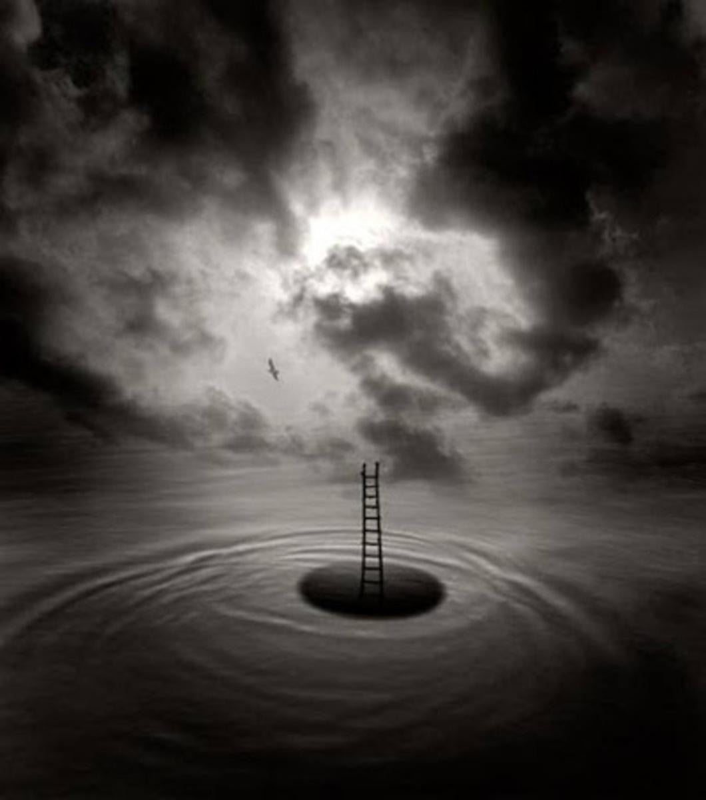{fig-align="center"}

Anche oltre il Bosforo e i Castelli, oltre i templi contesi e le navi in fiamme, il presente sfugge a se stesso e non sa bene come raccapezzarsi. Ogni cultura ha ormai sperperato l'eredità delle civiltà storiche, oppure le ha coperte di mistificazioni e ostentazioni, e la miseria e l'impotenza si impongono, producendo così subumanità peraltro anche compiaciuta di esserlo. C'è un pensiero cieco e un culto dell'ignoranza che imperversano ovunque, alimentati soprattutto dalla peggiore politica e dalle aberrazioni dei media, che instillano la convinzione che l'ignoranza di chiunque valga più di ogni conoscenza. L'aspetto più subdolo è laddove tutto ciò prende le forme di un intellettualismo facilone e ruffiano, apparentemente democratico e libertario ma interessato e manipolatorio, che diffonde e rafforza ignoranza proprio tra coloro che più odiano la conoscenza, coinvolgendo anche grossa parte di quanto ancora chiamiamo cultura. Folle la superstizione di una scienza chiusa in formule che non spiegano nemmeno se stesse, ridicole le pretese di una poesia e di un'arte ridotte a giocherello, rifiuti da raccolta indifferenziata le pretese di magia degli psicopatici, assurdo e dannoso l'assolutismo religioso dei fanatici. Eppure, come ricorda anche la *Pistis Sophia*, «*chiunque cerca la verità, la troverà*». In questo cercare, se dobbiamo al nichilismo filosofico la messa in discussione di ogni sistema di pensiero e di potere dalle pretese di assolutezza, è anche arrivato il momento di liberarsi del nichilismo alla moda che nasconde proprio nel culto del vuoto la propria debolezza di pensiero e la propria accondiscendenza al potere. E nell'andare alla ricerca in questo nostro presente, è forse l'acume di Diana che può aiutarci ad afferrare il dischiudersi di una verità nelle intersezioni di tre pensatori tra loro piuttosto diversi, quali il filosofo Jacques Derrida, il poeta Eugenio Montale, il fisico Heinz Rudolf Pagels.

Questa l'esperienza che oggi viviamo: il tempo stesso sembra essersi spezzato. Non sussiste in nessun gesto continuità degli atti, non c'è alcuna presenza di quanto si offre come presente, nella loro stessa natura sembra essersi insinuato il vuoto. Il tempo stesso si è disarticolato portando ad «*effetti di spettralità*» e siamo esposti ad un'inadeguatezza diffusa e senza scampo, come novelli Amleto di fronte al fantasma del padre. Eppure, Derrida suggerisce che la frattura di un «*tempo fuor di sesto*» possa essere a sua volta necessaria. Se nella diffusa non contemporaneità di un presente assente è impossibile pensare l'omogeneità, è il recupero della storia che apparentemente stiamo perdendo a permettere gli «*effetti di congiuntura*» che ne favoriscono in qualche modo una riparazione. Non c'è né sconfitta né condanna. Nessuna eredità è perduta oppure obbligata: una eredità è sempre eterogenea e la si riafferma scegliendo. E quindi, siamo sempre sul punto di restituire, a tutti gli spettri che ci vengono incontro, a partire da quello di Marx, suggerisce Derrida, così come quello di chiunque abbia lasciato esempio nonché di ogni irriducibile eterogenetà, una dignità superiore ad ogni interesse economico che ormai si vuole esclusivo, accogliendo la responsabilità infinita per cui ogni evento, ovunque accada, ci riguarda, e così «*imparare a vivere, infine*.»[^37]

[^37]: Jacques Derrida, *Spettri di Marx* \[1993\], Raffaello Cortina, Milano 1994.

Cosa tutto questo possa significare, lo scopriamo quando, magari per caso, succede che ci troviamo di fronte a qualcosa, un incontro imprevisto o qualsiasi altro lampo improvviso che, proprio nel corso dei giorni più ordinari, cambia i giochi già decisi, ed è proprio un fantasma a indicare una via oltre ogni perché. La pura esteriorità delle apparenze ci sorprende nel costituire la cifra di un'intimità e di una consistenza capaci di accogliere e consolare: ciò viene descritto da Montale laddove, procedendo «*di qua dall'erto muro*», e quindi nell'esplorazione del finito, è possibile ascoltare il «*commuoversi dell'eterno grembo*» e quindi incontrare il «*fantasma che ti salva*» (*In limine*, 1924).[^38] Il grembo è quello spazio vuoto dove ritroviamo le viscere nella loro immagine di fertilità e di vita che si rinnova oltre ogni ricordo già fissato, il fantasma è quell'assenza che rappresenta la contingenza capace di spezzare quanto è meccanicamente determinato dalla catena delle cause e degli effetti. E, oggi come ieri, i messaggeri sono spesso ignoti: semmai, è il messaggio ad essere riconosciuto, e quello che davvero conta è chi lo riceve.

[^38]: Eugenio Montale, *Ossi di Seppia*, Gobetti, Torino 1925.

Questo messaggio si annuncia quando, ovunque possiamo trovarci, scopriamo che la relazione che ogni cosa intrattiene con tutte le altre ha intrecci aperti a ogni soluzione, e sussiste equilibrio dinamico di materia tra perdita e potenzialità. Anche le nostre città sono così, sono così i mari e i laghi, così i rapporti che costellano la nostra esistenza. E ovunque, in ogni momento, tutto può finire e tutto può iniziare (*Corano* 35:16). Il vuoto, la cui occorrenza è nel registro simbolico delle diverse tradizioni fino alla loro radice ultima anche a dispetto delle loro diversità e dei loro conflitti, questo vuoto appropriato a descrivere un presente e i drammi che segnano ogni esperienza tanto collettiva quanto personale, risulta essere un grembo sempre pronto a generare e una culla sempre pronta ad accogliere. Pagels rimarca come «*il vuoto e lo spazio in realtà sono fatti di particelle e antiparticelle che spontaneamente si creano e si annichilano*», misurabili, come prescrive il principio di indeterminazione di Heisenberg, soltanto in uno spazio limitato.[^39] Nelle infinite vastità di stelle insondabili, anche il nostro sistema solare è limitato, e le sue interazioni, per quanto calcolabili e prevedibili, non sono mai le stesse, in un equilibrio dinamico in cui vuoto e pieno si rovesciano l'uno nell'altro attraversando ogni gradazione. In questi spazi fatti di vuoto la complessità è quanto riunisce parti interrelate che si influiscono reciprocamente, portando piccole cause ad avere effetti non predicibili e indefinitivamente sovrapponibili, ma pur sempre conoscibili. E ogni possibile ha una struttura di cui attuiamo il codice proprio nel nostro andare.

[^39]: Heinz Rudolf Pagels, *Codice cosmico* \[1983\], Bollati Boringhieri, Torino 2016.

Pensosa la Luna si riflette in tutti gli specchi d'acqua e ogni mese compie il suo cerchio. Non ha luce senza il Sole e non è vista che dalla Terra, la quale deve alla Luna la possibilità di un'atmosfera e al Sole quella di una luce. Grazie al suo influsso, la potenza generatrice della Terra, nonostante le offese che continuamente riceve, non smetterà di sostenere il mondo degli uomini. A dispetto di un idiotismo perennemente incombente e di un provincialismo ancora ineluttabile, ogni località è suscettibile di diventare centro di una cultura cosmopolita in formazione, sollecitando partecipazione diffusa e pronto intelletto. Come un'antica divinità sempre viva nel suo farsi incontro, la realtà ha molti nomi e unica fonte. Al limite e al centro di ogni esistenza, spazi vuoti tuttora generano stelle, perfezione e sapienza.

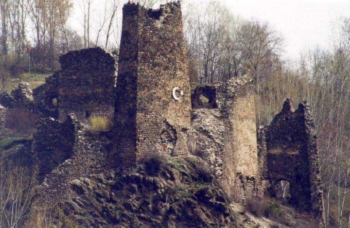{fig-align="center"}

*Prima stesura 2002, aggiornato nel 2012, completato nel 2024.*

*Fotografia: Claudio Comandini, Santa Sofia riflessa sulle acque (Istanbul, agosto 2002).*
