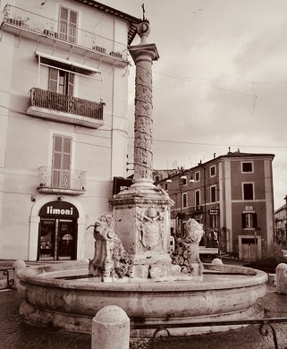

{fig-align="center" width="650"}

*Lo spazio vuoto della storia e una santa mai esistita. La Turchia vista da* *Hagía Sophía.* *Ricorrenze del simbolo della mezzaluna tra l'Islam e Genzano di Roma. La storia sulle sponde del lago di Nemi. I molti nomi della dea. La parte nascosta dell'Islam. Principessa Bibesco e il tempio dell'idea. Flaubert e la capitale del mondo. Frazer nel bosco del sacerdote assassino. Lord Byron e l'esecuzione di un'adultera. Derrida e gli effetti di spettralità. Montale e il fantasma che ti salva. Pagels: vuoto fisico e indeterminazione della materia. I vuoti del presente tra il Bosforo e i Castelli romani e le prospettive di una metropoli impossibile.*

## 1. Santa Sapienza

*Il Signore con la sapienza fondò la terra e consolidò le cose con l'intelligenza. Per la sua scienza gli abissi si spalancarono. (Proverbi 3:19-20)*

Resta della nostra storia un puro spazio vuoto. Questo vuoto, a differenza di quanto possano aver considerato gli antichi e i moderni, non nega e non afferma il movimento, il pensiero e la compiutezza, e si impone alla nostra considerazione anche in base all'esperienza di un presente che oscilla continuamente tra potenzialità generativa di forme e perdita irreparabile di ogni eredità.

A Istanbul, questo vuoto può sorprenderci tra la loggia del *muezzin* e il luogo di incoronazione dei *basileus*, all'interno di Hagía Sophía, nome di una santa mai esistita. Edificio dalle proporzioni improbabili ma solide, è originariamente un tempio pagano dedicato alla Sapienza, che nell'ebraismo e nel cristianesimo si configura quale aspetto della divinità.

L'edificio, consacrato come chiesa da Costantino nel quadro della riorganizzazione della nuova capitale imperiale nel 360, nel 404 è incendiato dai partigiani di Giovanni Crisostomo, patriarca della città. Riedificato da Teodosio II nel 415, nel 532 è un'altra volta dato alle fiamme durante la rivolta di Nika, che minaccia di travolgere Giustiniano accusato di eccessive spese militari. Di nuovo eretto nel 537 con il proposito di essere più splendido del Tempio di Salomone di Gerusalemme, rappresenta il più grande edificio sacro della cristianità, per lasciare dopo la presa ottomana il primato a Santa Maria Maggiore di Roma.

A detta delle leggende, nel 1453 Maometto II vi entra a cavallo e interrompe una messa che attende ancora di essere ripresa; a detta di altri, si prosterna al suo interno in direzione della Mecca e poi pronuncia un discorso in greco antico. Il sultano, figlio di una cristiana e collezionista di reliquie, conquista la città all'Islam, accrescendone di fatto la ricchezza e trasformando l'edificio in moschea. Nel 1934 Hagía Sophía diventa museo, per opera di Mustafa Kemal, padre laico della Turchia moderna, «*turco come gli antenati*» (Atatürk), che inoltre trasferisce la capitale ad Ankara.[^1] In un pieno revival ottomano dal sapore cruento e un po' kitsch, nel 2020 per iniziativa del presidente Erdogan viene riconsegnata al culto islamico, rinnovando le lotte su suo significato e sua funzione.

[^1]: Philip Mansel, *Costantinopoli* \[1995\], Mondadori, Milano 2003.

Segnato dalle fiamme, dalle spade e dal sangue, l'edificio porta il santo nome della Divina Sapienza, che procede la creazione di questo nostro mondo, nella quale quindi verrebbe a manifestazione permettendo così intelligenza e governo. Tuttavia, questo mondo non sembra affatto ordinato in tal modo. Può fornire una traccia per decifrarlo la *Pistis Sophia*, vangelo gnostico del II-III sec., che racconta come la Sapienza, per inseguire una luce solo apparente, si ritrovò nelle tenebre precipitando in quel mondo materiale che contribuì a determinare.[^2]

[^2]: *Pistis Sophia* (II sec. d.C.), a cura di L. Moraldi, Adelphi, Milano 1999.

Se così stanno le cose, per trovare sua e nostra salvezza potremmo essere costretti a cercarla quale ragione e soluzione di un mondo che è fiamme, spade e sangue anche tra coloro che a lei si appellano. E dove sua scintilla è in ognuno, pur se spesso imperscrutabile, ciò che è disperso può ritrovare consistenza nel risalirne le forme, in ogni luogo possa svolgersi il nostro andare.

## 2. Genzano e la Luna

*Ciò che il Santo, egli sia benedetto, ha fatto sulla Terra, è a somiglianza di quanto è nel firmamento: ogni cosa allude a quello che si trova nel mondo superno. (Zohar 2:15b-16a)*

{fig-align="center" width="423"}

La sapienza ama adornarsi di simboli che si rincorrono in luoghi diversi e lontani in modi a volte apparentemente incomprensibili, che sollecitano la nostra intelligenza a confrontare tra loro sistemi e credenze diverse e spesso nemiche. Questo accade anche nei luoghi e nelle forme dal nostro vivere ordinario passato e presente. Si apre ad uno spazio vuoto la mezzaluna calante sormontata da una corona che caratterizza lo stemma di Genzano, cittadina dei Castelli Romani. Nella bandiera turca e nel simbolo dell'Islam, uno spazio vuoto si apre verso una stella da una mezzaluna crescente. Nei limiti delle loro condizioni, tali spazi vuoti sembrano suscettibili di accogliere e generare forme che rivelano i modi del nostro andare, mantenendone aperte le tensioni.

Le differenze tra i simboli sono evidenti eppure la loro similiarità è netta, e tutto appare piuttosto enigmatico. Sviluppiamone le indicazioni vagliando i dati della storia. L'ipotesi che a Genzano nel X sec. fosse esistito un piccolo insediamento saraceno non è suffragata in alcun modo, e non ci sono tracce da far risalire alle incursioni che nel IX sec. investono Ostia e le chiese di S. Paolo e S. Pietro a Roma, sedimentandosi in maniera accertata in alcune zone della Valle dall'Aniene. Consideriamo inoltre che la località, in epoca antica parte del territorio appartenente alla *gens Aricina e* che deriva come gli altri paesi della zona dallo smembramento dell'immeso feudo tuscolano, fu lungamente circoscritta a quanto oggi chiamiamo Genzano Vecchio, un remoto villaggio di contadini e pescatori posto sul ciglio meridionale del lago di Nemi, lontano dal vecchio tracciato della via Appia che corrisponde grossomodo all'odierna via dei Laghi. L'origine del nome del paese è incerta e ancora dibattuta, scarna per quanto travagliata la sua storia, continuamente coinvolta nelle continue dispute che i nobili romani intrattenevano tra di loro e con i pontefici in carica.

Sappiamo per certo, soprattutto per opera di Nicola Ratti,[^3] che nel 1188 il pontefice Anastasio IV della Suburra dona il *Fundus Cynthianum* all'Abbazia delle Tre Fontane sulla Laurentina, dove venne martirizzato San Paolo, conosciuto anticamente con il nome di Acque Salvie e all'epoca tenuto dai Cistercensi. Dal XII sec. è presente una torre dei Gandolfi che danno nome alla vicina Castel Gandolfo, demolita nel 1218. Le prime citazioni di *Genzani* quali *fundus* e *castrum* risalgono a bolle del 1255 e si riferiscono alla costa montana e al castello, inizialmente fondato dai monaci e poi ricostruito prima dai Colonna e poi dai Cesarini nelle forme attuali. La torre di avvistamento del XIII sec. detta Saracinesca, che era parte della cerchia muraria del castello, ancora incastonata all'inizio del Corso Vecchio, prova perlopiù l'esigenza di difendersi dalle incursioni e non spiega né simbolo né altro.

[^3]: [Nicola Ratti, *Storia di Genzano*, Stamperia Salomon, Roma 1797](#0).

{fig-align="center" width="561"}

Genzano resta coinvolto nelle instabilità del periodo in cui la sede del papato è presso Avignone e che proseguono anche successivamente. Dal 1378 ne è proprietario Stefano Orsini di Marino, nel 1393 è invasa da Nicola Colonna di Palestrina e unita ai domini di Lariano. Nel 1399, sventata una sua congiura ai danni di papa Bonifacio IX Tomacelli, Genzano passa a Buccio Savelli e viene associato a Marino. Dalla fine dello stesso anno fino al 1410, considerando anche il grande incendio del 1402, torna sotto i Cistercensi e al dominio diretto della Camera apostolica. Per un triennio appartiene quindi a Nicolò Colonna, nel 1417 è occupato da Antonello Savelli. Con il ripristino della sede papale a Roma effettuato da Martino V Colonna, passa di nuovo ai Cistercensi che nel 1423 lo affittano, associato a Nemi, a Giordano Colonna, da cui è acquistato due anni dopo. Nel 1479 è venduto a Guillame D'Estouteville e quindi passa ai suoi eredi, ai quali nel 1485 muovono guerra i Colonna che occupano anche Frascati e attaccano pure gli Orsini; nel 1486 la mediazione di Innocenzo VIII Cybo prima glielo toglie per poi attribuirgliene pieno possesso. Esautorati da questi e altri domini da papa Alessandro VI Borgia, recuperano la proprietà nel 1503.

Il paese non ha agganci nemmeno con la battaglia contro gli Ottomani svoltasi a Lepanto nel 1571, dove si dice che la flotta cristiana e quella turca si affrontarono assumendo rispettivamente le formazioni della croce e della mezzaluna, e nella quale si distingue Marcantonio II Colonna, signore di Marino. Infatti, per quanto il condottiero abbia avuto possesso di ambedue le località, nel 1563 cede Genzano a Fabrizio Massimi che l'anno dopo lo rivende a Giuliano Cesarini di Civitanova Marche. Sotto i Cesarini e i loro eredi Sforza, Genzano trova stabilità e sviluppo, mantenendo per lungo tempo un'estensione territoriale che comprende oltre alle vicine Nemi e Lanuvio anche Ardea. Alla luce di tali passaggi, non ha alcun senso attribuire lo stemma della città alla commemorazione della pur celebre vittoria navale di Lepanto, che a Marino ispira la Fontana dei Mori.

Genzano Nuova viene costruito nel 1708 per volere di Livia Sforza Cesarini sul nuovo tracciato della via Appia, e alla confluenza di questa con il tridente costituito dalle strade cittadine è oggi collocata la fontana di San Sebastiano eretta nel 1776 su disegno di Virginio Bracci, autore anche dei corpi centrali della Fontana di Trevi a Roma. A maggior ragione, il simbolo della mezzaluna, che nel monumento si compone propriamente di tre lune, corona e croce che sormontano la colonna centrale adornata di pampini di uva, non può trovare ascendenze né nelle vicende dei Colonna, né tantomeno in memorie saracene.

{fig-align="center" width="481"}

Fornisce una traccia per venire a capo di questa intricata e finora irrisolta questione l'antica denominazione del territorio quale *Fundus Cynthianum* e, per quanto Antonio Nibby[^4] contesti tale evenienza, facciamolo derivare da *Cynthia Fanum*, nome che ad un tempo indicava il sito sacro e la divinità lunare, il cui nome si associa a quello di Diana, particolarmente venerata presso il lago, anticamente detto appunto *Speculum Dianae*. Diana protegge gli animali selvatici, custodisce fonti e torrenti, tutela le donne e i parti, dispensa la sovranità. Il filosofo e astronomo romano Nino Figulo la ricorda con il nome di Trivia, e nel rinascimento Leandro Alberti[^5] la tripartisce in questo ordine: in cielo è Luna, in terra è Diana, agli inferi Ecate.

[^4]: [*Antonio Nibby, Analisi storico-topografico-antiquaria della carta de' dintorni di Roma*, Vol. II, Roma 1849.](https://books.google.it/books?id=Q4hJAAAAMAAJ&hl=it&pg=PA107#v=onepage&q&f=false)

[^5]: [Leandro Alberti, *Descrittione di tutta l'Italia, et isole pertinenti* \[1596\], Libreria della Fortezza, Venezia 1638.](https://books.google.it/books?id=KdclEEV28MsC&hl=it&pg=PA248#v=onepage&q&f=false)

Gli antichi dei possono essere visti come quanto pervade profondamente l'esistenza umana ed essi, suggerisce lo storico delle religioni Walter F. Otto, non hanno nulla a che fare né con la tecnica né con la magia, non sono né frutto di invenzioni né vanno evocati, ma «*possono soltanto essere sperimentati*».[^6] Nel farne esperienza, i nomi delle divinità, di diversa origine e variatamente associati, chiedono, per quanto possa essere parziale, una sistematica. In tale sistematica, il tre non va limitato all'ordine biologico di padre-madre-figlio né concentrato nella Trinità cristiana di Padre, Figlio e Spirito Santo; piuttosto, esso esprime una relazione dinamica di generazione non antropomorfa che continuamente si rinnova su ogni piano della manifestazione, non inerendo quello dell'unità che la precede.

[^6]: Walter F. Otto, *Teofania* \[1956\], Adelphi, Milano 2021.

Cerchiamo di trovare delle linee guida dentro la selva degli dei che, a detta di Esiodo, nascono tutti da Chaos, il vuoto primordiale, la cui reciproca attrazione con Gaia «*dall'ampio petto*», potenza divina della Terra, è sostenuta come fondamento dell'universo da Eros. Gaia si unisce ad Urano, personificazione del Cielo stellato, generando Crono, titano del tempo e della fertilità, e Rea, forza creatrice e distruttrice della natura, grande madre degli dei. Rea per evirare il consorte che vuole impedire la nascita dei loro figli, fornisce costoro una falce in modo da evirarlo. Da Crono e Rea nascono, tra gli altri, Hera, protettrice del parto, del matrimonio e della fedeltà coniugale, e Zeus, dio del cielo e del tuono, che spodesta Crono per diventare padre di un altra generazione di dei. Hera sposa Zeus e, a causa dei tradimenti del marito, è nemica del genere umano. E quindi, da Zeus e Latona, dea della maternità, della modestia e delle tenebre notturne ma anche della luce del giorno, nascono, sul monte Cinto dell'isola di Delo, i gemelli Apollo, che traina il carro del Sole e governa profezia, scienza e intelletto, e Artemide, alla quale sono sacri il fuoco, la caccia e i nascituri.[^7]

[^7]: Esiodo, *Teogonia* \[VII sec. a.C.\], a cura di G. Arrighetti, Mondadori, Milano 2007.

{fig-align="center" width="359" height="908"}

Attributo di Artemide è l'arco, che ha forma di mezzaluna. In epoca più tarda è identificata con la Luna crescente, e la Luna calante trova dorma in Ecate, che governa gli incroci, i demoni e l'oscurità. Nel mondo latino, e soprattutto durante il sincretismo imperiale, il nome di Artemide diventa quindi quello di Diana. Diana è casta, solitaria e irascibile, e nel suo aspetto infero e ctonio è conosciuta giustappunto anche come Trivia, oscura, magica e mortifera, nonché celeste, terrena e marina. A Diana era dedicato il tempio che tuttora sorge sulla sponda del lago opposta a quella su cui si affaccia Genzano vecchio.

Di grande fortuna nelle letteratura e nelle arti, da Bernini a Stravinskij-Gide, sono altri appellativi di Ecate, detta anche Kore, cioè Persefone, in latino Proserpina, legata alla rinascita della vegetazione dopo i rigori invernali. È figlia della Terra, che in Grecia prende nome Cerere e a Roma quello di Demetra, ed è sposa di Ade, nel mondo latino chiamato Plutone. Studiando il mito quale sistema di conoscenza, Karòli Kereny ricorda come la tripartizione della dea doveva lasciar posto tanto al cosmo ordinato di Zeus quanto ad una sfera polimorfa infera, e il legame del rifiorire della Terra indicato dai Misteri Eleusini rappresenta un destino immortale che oltrepassa l'umano; indagando i modelli universali inscritti nella psiche, Carl G. Jung annota come se la relazione madre e figlia che intrattengono Demetra-Proserpina rappresenta un ordine matriarcale che arriva a escluderlo, nella figura del femminile archetipo di Demetra l'uomo trova la propria esperienza più importante e decisiva.[^8]

[^8]: Karòli Kereny - Carl G. Jung, *Prolegomeni allo studio scientifico della mitologia* \[1941\], Borighieri, Milano 1972, pp. 151-248.

Possiamo così vedere in tutte queste dee e nei loro nomi, il cui elenco potrebbe continuare indefinitivamente, il precipitare della Sapienza nel nostro mondo materiale e il suo prodursi in una pluralità di manifestazioni. Funzioni e forme di un'unica idea che precede le religioni indoeropee e le informa differenziandosi e disperdendosi in esse come falda fertile, viaggiando tra il maschile e il femminile, tra la vita, la morte e gli dei. Si mantiene nell'arte e ogni epoca le porta tributo; in epoca barocca, nel quadro del Guercino, accompagnata da un levriero, si volta a vedere suo amante Endimione addormentato. Abita, oggi come allora, la nostra psiche, e ne tenta il risveglio. E ad essa si riferisce pure la mezzaluna calante rappresentata sullo stemma della città di Genzano.

{fig-align="center" width="546"}

## 3. La parte nascosta dell'Islam

*Non vedi che Dio conosce quel che è nei cieli e sulla terra? (Corano 58:7)*

{fig-align="center" width="549"}

La somiglianza tra la mezzaluna di Genzano e quella dell'Islam suggerisce come l'estrema lontananza possa accogliere una continuità sotterranea permettendo che, in modi laterali, un aspetto nascosto dell'Islam si riveli nei riflessi del lago, uno dei luoghi storici della latinità, così come aspetti essenziali della cultura greca e romana sono riflessi nelle increspature del Bosforo, su cui si distende quella che fu la capitale dell'impero musulmano.

La città che oggi chiamiamo Istanbul ed è stata conosciuta pure come Costantinopoli e prima ancora come *Bizantyon*, nome poi recuperato insieme alla lingua greca al tempo di Eraclio, è fondata su suggerimento dell'oracolo di Delfi nell'immenso porto naturale che fronteggia la «*città dei ciechi*», Calcedonia, Kadiköy. Occupata dai Turchi già in epoca bizantina, oggi rappresenta la parte asiatica del sistema metropolitano stanbulino, che il Bosforo separa dalle due parti europee a loro volta separate dal Corno d'Oro. Il culto della dea e della Luna viene introdotto nelle forme di Hera da coloni provenienti da Argo, si specifica in epoca classica in quelle di Artemide, in seguito sembra mantenersi negli aspetti di Ecate. La città, così come la dea che un tempo ne fu protettrice, non è una, non è due: è tre.

Un simbolo è sempre plurale e nel suo formularsi storia e leggenda si confondono; se esprime il contenuto a cui rimanda, può trovare significati diversi nei differenti contesti. L'universalità è alla base del simbolismo, ma ogni simbolo si pone sempre su piani delimitati, convenzionati in base a presupposti e credenze da esplicitare di continuo. In epoca preislamica, troviamo il simbolo della mezzaluna utilizzato come segno di ringraziameno laddove scampa all'assedio di Filippo II di Macedonia Bisanzio grazie alla luce di una luce crescente. La mezzaluna coinvolge anche il Cristianesimo e nel 330 Costantino, dedicando la città a Maria Vergine, aggiunge il simbolo mariano della stella alla falce di luna della dea ormai spodestata dalla quella che viene concepita come madre di Dio. La mezzaluna è quindi presso la Persia sasanide del V sec. d.C. nelle monete emesse da Kavad I. L'uso da parte dell'impero bizantino del simbolo è riscontrabile nella pittura, per esempio in *L'adorazione dei Re Magi* (1440-1442) di Stephan Lochner.[^9]

[^9]: [Omer Sayadi, *Post-Classical star and crescent,* «Mena symbolism» 03.17.2019](https://menasymbolism.wordpress.com/2019/03/07/the-ancient-star-and-crescent/).

Da parte sua Maometto, quando conquista la Mecca ai Coreisciti, per un periodo mantiene quale unica immagine all'interno del tempio quella di Maria con Gesù; ricorda Titus Burckhardt che il profeta dell'Islam assomma in sé i caratteri delle due figure, in quanto assorbe le qualità che descrivono positivamente Dio la cui essenza in sé è descrivibile soltanto attraverso negazioni.[^10] E laddove la somma dei numeri che compongono la parola *hilal*, mezzaluna, è la stessa della parola Allah, nella calligrafia araba il nome Muhammad ha l’aspetto di una stella a cinque punte.

[^10]: Titus Burckhardt, *L'uomo universale. Antologia dall'opera di 'Abd Al-Karîm al-Jîlî* \[1975\], Edizioni Mediterranee, Roma 1981.

{fig-align="center" width="483"}

A detta del sufi Rumi «*il Profeta riflette Dio come la luna riflette la luce del sole*», ed è compito di chi ha fede guidare gli uomini. La Luna (*Qamar*) è creata da Dio (Corano 10:15), al quale con il creato tutto ella rende omaggio (Corano 22:18), permettendo all'uomo il calcolo dei giorni (Corano 55:4) e la regolazione della preghiera.[^11] La purificazione delle intenzioni, che è quanto a cui sostanzialmente tende la *sharia*, consente al Sole di riflettersi nella Luna e quindi di riconoscere il Vero (Corano 91).

[^11]: Jean Chevalier, Alain Gheerbrant, *Dizionario dei simboli* \[1969\], Rizzoli 1987.

Alcuni non esitano a far appartenere la mezzaluna ai Turchi, di origine altaica e divisi in varie tribù, sin dai tempi dell'antica popolazione dei Göktürk. I popoli turchi si convertono all'Islam nel X sec. ed esprimono una cultura fortemente ellenizzata, arrivando anche a rivendicare discendenze da Teucro di Troia. La mezzaluna viene utilizzata come stendardo dopo la conquista dell'Armenia del 1064 dal sultano selgiuchide Ap Arslan, che nel 1071 a Manzicerta cattura l'imperatore bizantino Romano IV Diogene.

Osman I, che agli inizi del XV sec. fonda la dinastia ottomana, ha in sogno la visione di una mezzaluna che sorge dal petto del sufi Edebali, padre di sua moglie, per stagliarsi sopra il mondo. Un riflesso della Luna che nasconde una stella appare nel 1448 durante la battaglia di Kosovo nelle pozze di sangue dei cristiani sconfitti dagli Ottomani. Nel 1453 nella notte della caduta di Costantinopoli la mezzaluna e la stella sono viste nelle mani di Maometto II. L'impero assume il simbolo riconoscendosi nella conquista di Costantinopoli, predetta da un Hadit di Maometto. *Ay Yıldız* è inizialmente una falce di Luna su campo verde, cambiato in rosso nel 1793 da Selim III; la stella a cinque punte viene introdotta nel 1844. Soltanto dal XX sec. la mezzaluna crescente diventa simbolo dell'Islam tutto.[^12]

[^12]: Jean-Paul Roux, *Storia dei turchi: duemila anni dal Pacifico al Mediterraneo* \[1988\], Argo, Roma 2006.

Rimescola le carte la principessa Marthe Lucile Bibesco, per la quale la grandiosità di Hagía Sophía è capace di annientare una persona così come può farlo il cielo: «*prodigiosa basilica non dedicata al culto*» e «*santuario del Dio assente*», lontana dal Cristianesimo quanto dall'Islam, essa rappresenta l'«*enorme tempio dell'idea*». La scrittrice e storica rumena rammenta inoltre leggende secondo le quali l'influenza occulta di Ecate mai abbandonò la città: le streghe la celebravano segretamente nella notte di San Giorgio, e l'imperatrice Teodora, reputata la cristianissima consorte di Giustiniano, la implorava affinché non perdesse i propri poteri di seduzione.[^13] Certamente, anche questo ha a che vedere con il femminile.

[^13]: Marthe Lucile Bibesco, *Gli otto paradisi* \[1908\], Sellerio, Palermo, 1993.

{fig-align="center" width="550"}

Il suo contemporaneo Procopio di Cesarea ci informa che l'imperatrice era di fede monofisita, per cui Gesù ha unica natura, tanto divina quanto umana, in maniera difforme dalla prescrizioni, decisive tanto per il cattolicesimo quanto per l'ordodossia, peraltro allora non ancora differenziatisi tra loro, del Concilio di Calcedonia del 451.[^14] Con la conquista musulmana di Costantinopoli molti dei monofisiti, a lungo perseguitati, si convertono all'Islam.

[^14]: [Procopio di Cesarea, *Storia Segreta* \[554-560\], Sonzogno, a cura di G. Compagnoni, Milano 1828.](https://it.wikisource.org/wiki/Storia_segreta)

Il rigoroso monoteismo islamico non prevede divinità associate di nessun tipo. Unità e molteplicità di Dio si manifestano tramite i piani dell'essere e attraverso l'uomo nei Nomi divini, generalmente considerati in numero di 99. Questi si dividono in attributi d'essenza e di sostanza, e laddove tra i primi è la Sapienza e tra i secondi il Creatore, Dio muove ed è testimone di ogni cosa. Oltre a non sussitere dualismi o trinità, Dio è depurato anche dagli attributi antropomorfi e quindi non è né uomo né donna. Esistono aspetti femminili della divinità che trovano spazio in maniera eminente nel Nome divino *Rahîm*, il Misericordioso, riportato nell'esordio di tutte le Sure (eccettuata la 9, probabilmente per un frazionamento), che indica qualità di compassione verso la creatura e quindi le *viscere*, chiamate anche *cuore*. L'arabo *Rahîm* deriva dall'ebraico *rahamîm* per cui «*il Signore prova tenerezza verso quelli che lo temono*» (Salmo 103:13), e ha equivalenze con il verbo greco *splanchnízestha* che riporta all'«*avere viscere di tenerezza misericordiosa*», come accade a Cristo di fronte ad una folla affamata (Marco 6,34).[^15]

[^15]: [Gianfranco Ravasi, *Rahamîm: viscere di misericordia*, «Famiglia Cristiana» 17.06.2021.](https://www.famigliacristiana.it/blogpost/rahamim-viscere-di-misericordia.aspx)

Presso l'Islam esiste il concetto marcatamente femminile di Madre del Libro, archetipo del Corano custodito in cielo che precede la lingua stessa, libro-matrice concepibile quale attributo di Dio che, senza riguardo alcuno, partorisce il reale conformemente al suo volere: «*Allah cancella quello che vuole e conferma quello che vuole. È presso di Lui la Madre del Libro*» (Corano 13:39). Per il sufi Ibn Arabi, laddove «*noi siamo di Dio e a Lui ritorniamo*» (Corano 2:156), pur non non avendo figli e non essendo né padre né madre (Corano 19:35), Dio genera la Terra che riflettendo la presenza divina è celebrata quale fonte creativa che conosce, oltre ad una caduta, anche un'ascesa.[^16] Senza cedere alla all'omogeneizzazione delle diversità e alla confusione dei generi propria agli aspetti più aberranti dell'esperienza contemporanea, proprio un cammino di assimilazione degli aspetti maschili e femminili della divinità può condurre alla perfezione umana. Ogni tensione è riportata ad unità, ogni cosa dispersa si riconduce ad uno.

[^16]: [Sa’diyya Shaika, *Allah, hidden treasures, and the Divine Feminine*, «The Immanent Frame» 27.05.2019.](https://tif.ssrc.org/2019/05/27/allah-hidden-treasures-and-the-divine-feminine/)

Le storie che si intersecano nella formulazione delle divinità femminili e degli aspetti femminili della divinità si raccolgono quindi proprio nella presenza di Sophia che, come suggerisce l'islamista Henry Corbin rispondendo a Jung e corrispondendo all'idea degli archetipi quali funzioni trascendentali dell'esperienza, impone la sapienza quale segno di alleanza tra umano e divino: «*il mondo, il nostro cosmo, è a immagine di questa Sophia divina eterna. Con la sua 'sofianicità' il mondo è divenuto lo specchio del mondo divino*».[^17] E la stessa Luna vagabonda che ispirò gli antichi ancora si riflette sulle acque del Bosforo e del lago di Nemi. Ogni spazio vuoto è suscettibile di essere fertile produzione di forme

[^17]: Henry Corbin, *La Sophia eterna* \[1953\], Mimesis, Milano 2014.

{fig-align="center" width="562"}

## 4. Memorie sospese

*La mia luce è sparita come alito, e io sono diventata materia. (Pistis Sophia 39:5)*

Nei boschi sulle sponde del lago di Nemi, presso il santuario di Diana, risplendeva nel riflesso della Luna la lama di un coltello, brandito da uno schiavo fuggitivo. In remote notti d'estate, esattamente il 13 agosto, egli avrebbe colto un ramo d'oro da un albero sacro che nessuno poteva spezzare, e uccidendo il proprio predecessore sarebbe stato nominato *Re del Bosco*. James Frazer[^18] nel fornire gli elementi di questa antropologia si ispira all'omonimo quadro di William Turner e ricorda che dobbiamo ad Oreste della figura del *Rex Nemorensis* e l'introduzione del culto di Diana, il cui tempio viene traslato sull'Aventino da Servio Tullio. Caracalla, perfezionando l'influenza egizia su Roma, associa il lago al culto di Iside, altra forma della divinità lunare, e vi colloca due navi, affondate dai senatori in seguito alla morte dell'imperatore; dopo sporadici tentativi, i resti delle imbarcazioni vengono recuperati sotto il fascismo e custoditi nel Museo delle Navi di Nemi. Al finire della II Guerra mondiale, sono devastati da un incendio, provocato, come è stato definitivamente accertato, dall'impazzare delle bombe alleate.[^19]

[^18]: James Frazer, *Il Ramo d'Oro* \[1890-1922\], Newton Compton, Roma 1992.

[^19]: Flavio Altamura - Stefano Paolucci, *L'incendio delle navi di Nemi*, Passamonti, Grottaferrata 2023.

Nei girovagare giovanili dell'*Aroldo* (1809-1818) Lord Byron canta tanto lo «*specchio ovale del vitreo lago*», quanto le «*onde scintillanti*» del Bosforo spazzate da «*una brezza fugace*», e anche nel suo epistolario ricorrono riferimenti alle «*meraviglie*» delle due località. Ne *Il Giaurro* (1812-1813), «*racconto turco*» ispirato dall'esecuzione sommaria di un'adultera alla quale aveva assistito ad Atene, una forma frammentaria e modulare permette al poeta ampie trasgressioni rispetto all'unità cronologica e a quella della voce narrante e, attraverso un linguaggio studiatamente zeppo di arcaismi, denuncia tanto le inadeguatezze musulmane nell'organizzazione della vita civile quanto quelle cristiane verso il rispetto delle esigenze affettive. Il Giaurro è l'infedele che vendica l'omicidio della donna musulmana da lui amata, una serva che per adulterio viene gettata in mare chiusa in un sacco; pur trovando espiazione in un monastero, è ormai irrimediabilmente collocato al di là del bene e del male in modi che egli stesso stenta a comprendere. Tuttavia, nonostante il tormento a cui è costretto, è riscattato da «*una scintilla del fuoco immortale/ dono di Allah - condiviso dagli Angeli/ per innalzare da terra il nostro desiderio triviale.*»[^20]

[^20]: Lord Byron, *Opere scelte*, a cura di T. Kemeny, Mondadori 1993.

Nelle inadeguatezze del nostro presente, al di qua del bene e del male, incapace di amore quanto di convivenza e incomprensibile anche a se stesso, le memorie antiche restano sospese. Così, irrimediabilmente lontane dai fasti classici e anche dalle glorie del feudo tuscolano, Genzano è conosciuta per produrre pane casareccio, nel bosco di Nemi si coltivano le fragole: come dice la canzone *Nannì,* «*li Castelli so' così*». E a parte il godere di un'ottima gastronomia, in queste contrade non sembra esserci molto da fare. Forse, la loro storia si è per davvero conclusa; oppure, più semplicemente, non siamo in grado di muoverla. Le acque del lago, già ridotte per i lavori connessi al recupero delle navi, si ritirano progressive e inesorabili tanto in risposta a cicli antichi quanto per l'azione dell'uomo, fornendo così estremo emblema a quello svuotamento delle possibilità che sembra segnare la nostra epoca, stanca persino della propria arroganza.

{fig-align="center" width="547"}

Metropoli antica, detta già dai Bizantini *Is tin polin*, la città, Istanbul genera, travolge e sopravvive a quattro imperi: romano, bizantino, latino, ottomano. Charles Fourier, che critica e destesta capitalismo e libero mercato teorizzando società dove individualismo e merito possano accordarsi, annota che essa fosse destinata a diventare capitale del mondo. Sulla sua scorta, Gustave Flaubert ne ammira lo splendore e la fierezza e, sentendosi schiacciato dalla sua folla e immensità, testimonia che «*come umanità è davvero enorme*», con cimiteri che sono «*foreste in mezzo all'abitato*» e palazzi che sembrano le navi di «*una flotta immobile*».[^21] Ritorna, anche sulle terra ferma, l'immagine delle acque.

[^21]: Gustave Flaubert, *Correspondance*, Charpentier, Paris 1887-1893.

Immagini arcaiche si sovrappongono a quelle contemporanee nel sistema gemello costituito dalla cerchia regolarissima del Grande raccordo anulare che circonda la capitale, e da quella più balenga dei paesi dei Castelli Romani e Prenestini; in tale sistema gemello, si può intravedere tanto la proiezione topografica dei Dioscuri, i divini gemelli figli di Giove che protessero Tuscolo sino ai tempi delle Guerre Latine e le cui statue dal 1500 ci accolgono alla sommità della scalinata del Campidoglio, quanto la filigrana di una metropoli romana tuttora impossibile, eppure necessaria, alla quale prima o poi bisognerà fornire risposte. Fino ad ora, esclusivamente un abusivismo sfrenato ha saldato i paesi alla città, nessuno si è preoccupato di realizzare in modi adeguati servizi e infrastrutture: la condanna al provincialismo sancita dalla politica è stata implacabile. Questa condanna è ancora più beffarda laddove fu Roma a inventare la politica, ma in fondo fu una politica fondata sul fratricidio, e tale si è trasmessa alla sua eredità.

Anche a Istanbul, Roma d'Oriente, i vuoti urbanistici tendono perlopiù ad essere colmati da una logica irriguardosa. La vertiginosa crescita economica verificatasi dal 2002 ha enormemente incrementato tanto il livello di vita quanto quello degli investimenti. Sulukule, nel distretto di Fatih, quartiere dalle piccole e colorate case in legno, abitato dai Rom dei Balcani dai tempi di Solimano il Magnifico, è stato travolto dalle ruspe nel 2009. Poco dopo, dall'altra parte del Bosforo, a Beyoglu e quindi tra Taqsim e Pera, sono stati abbattuti i palazzi ottomani in pessimo stato e dalla fama ancor peggiore di Tarlabasi, abitato da Curdi, vicino alla centrale strada Ìstiklâl Caddesi. Il posto di questi quartieri popolari demoliti deve essere preso da abitazioni di lusso. Una modalità atta a celebrare la nomina di Istanbul a Città europea della cultura piuttosto in linea con le peggiori tendenze occidentali. L'ignoranza di cui il nostro presente si ammanta disattende di continuo le proprie esigenze. Ed è nel sottrarsi alle pretese di questa ingnoranza a permettere quello spazio vuoto nel quale la sapienza ritrova possibilità.

## 5. Nel vuoto del nostro presente

*Quando il potere sarà affidato a chi non ne è degno, allora aspettati l'ora. (Hadit - Abu Huraian, Libro della Scienza)*

{fig-align="center" width="585"}

Anche oltre il Bosforo e i Castelli, in tutto il territorio della metropoli globale, il presente sfugge a se stesso e non sa bene come raccapezzarsi, e sono parimenti fuori luogo le opposte disabilità di progressisti e nostalgici. Ogni cultura ha ormai sperperato l'eredità delle civiltà storiche e la miseria e l'impotenza si impongono ovunque. Assurdo e irrilevante l'assolutismo religioso dei fanatici, rifiuti da raccolta indifferenziata le pretese magiche degli psicopatici. L'acume di Diana può quindi aiutarci a muoverci degli interstizi di questa guerra che ovunque infuria, e andare a caccia del presente perduto, afferrandone la sapienza riposta nelle intersezioni di tre pensatori tra loro molto diversi, quali il filosofo Jacques Derrida, il poeta Eugenio Montale, il fisico Heinz Rudolf Pagels.

Dove è il tempo stesso ad essersi disarticolato portando ad «*effetti di spettralità*»*,* siamo esposti ad un'inadeguatezza diffusa e senza scampo. Eppure, Derrida suggerisce che la frattura di un tempo scardinato possa essere necessaria a sua volta. Se nella diffusa non contemporaneità di un presente assente è impossibile pensare l'omogeneità, è proprio il recupero della storia a permettere gli «*effetti di congiuntura*» che ne favoriscono in qualche modo una riparazione. Raccogliere la responsabilità infinita per cui una cosa, ovunque accada, ci riguarda: restituire a ciò che ci viene incontro una dignità che supera ogni economia: «*imparare a vivere, infine*.»[^22]

[^22]: Jacques Derrida, *Spettri di Marx* \[1993\], Raffaello Cortina, Milano 1994.

Cosa tutto questo possa significare, lo scopriamo quando la pura esteriorità delle apparenze va a costituire la cifra di un'intimità e di una consistenza capaci di accogliere e consolare: in qualche modo, ciò viene descritto da Montale laddove, procedendo «*di qua dall'erto muro*», e quindi nell'esplorazione del finito, è possibile ascoltare il «*commuoversi dell'eterno grembo*» e incontrare il «*fantasma che ti salva*» (*In limine*, 1924).[^23] Il grembo è immagine di fertilità e di vita che si rinnova oltre ogni ricordo già fissato, il fantasma rappresenta la contingenza che spezza quanto è meccanicante determinato. E, oggi come ieri, i messaggeri sono spesso ignoti: semmai, è il messaggio ad essere riconosciuto.

[^23]: Eugenio Montale, *Ossi di Seppia*, Gobetti, Torino 1925.

Questo messaggio si annuncia in un vuoto che è perdita e potenzialità, equilibrio dinamico di materia le cui particelle costitutive, a detta di Pagels, si creano e si annullano di continuo, e sono misurabili, come prescrive il principio di indeterminazione di Heisenberg, soltanto in uno spazio limitato.[^24] In tale spazio la complessità è quanto riunisce parti interrelate che si influiscono reciprocamente portando piccole cause ad avere effetti non predicibili e indefinitivamente sovrapponibili. Ogni possibile ha una struttura di cui attuiamo il codice proprio nel nostro andare.

[^24]: Heinz Rudolf Pagels, *Codice cosmico* \[1983\], Bollati Boringhieri, Torino 2016.

Pensosa la Luna si riflette in ogni specchio d'acqua. Come è da quando segna i cicli del tempo e regola i flussi delle acque, quando essa cala l'oscurità cresce, laddove cresce la luce si dispega. Sotto la Luna, gli orizzonti delle foreste e della metropoli scintillano affilati come lame nella notte. Sotto il suo influsso, la potenza generatrice della Terra, nonostante le offese che continuamente è costretta a ricevere, non smettera di sostenere il mondo degli uomini. A dispetto di un idiotismo perennemente incombente e di un provincialismo ancora ineluttabile, ogni località è suscettibile di diventare centro di una cultura cosmopolita in formazione, sollecitando partecipazione diffusa e pronto intelletto. Come un'antica divinità sempre pronta a farsi incontro, la realtà ha molti nomi e un'unica essenza. Al limite e al centro di ogni esistenza, spazi vuoti tuttora generano stelle, perfezione e sapienza.

{fig-align="center" width="592"}

*Prima stesura 2002, completato nel 2012, rivisto nel 2024.*

*Fotografia: Claudio Comandini, Santa Sofia riflessa sulle acque (Istanbul, agosto 2002).*
