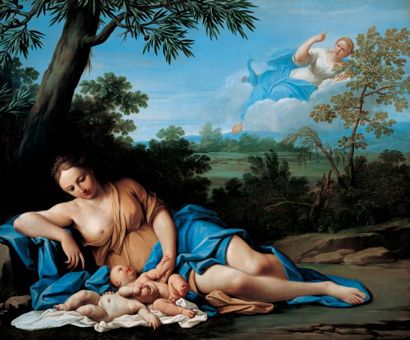
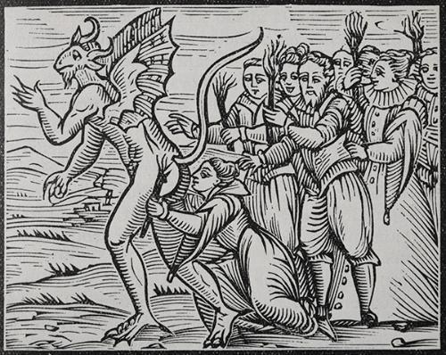
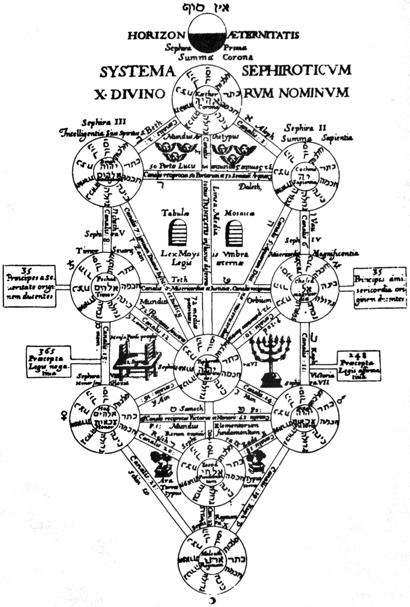
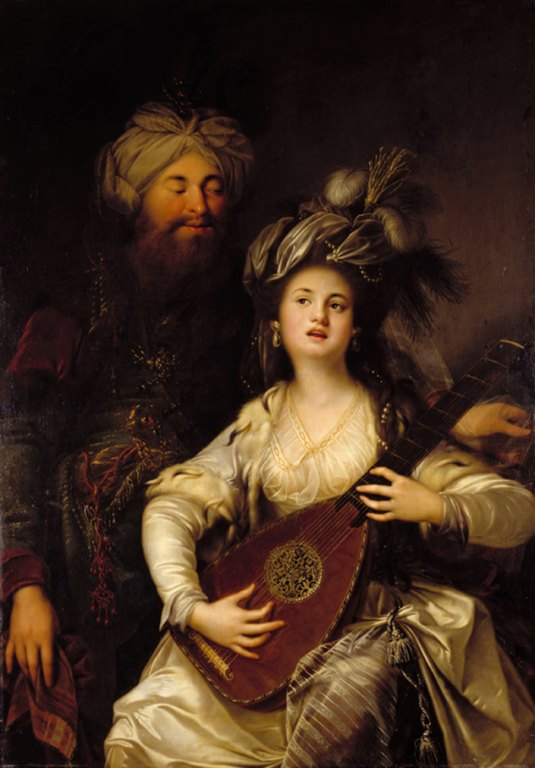
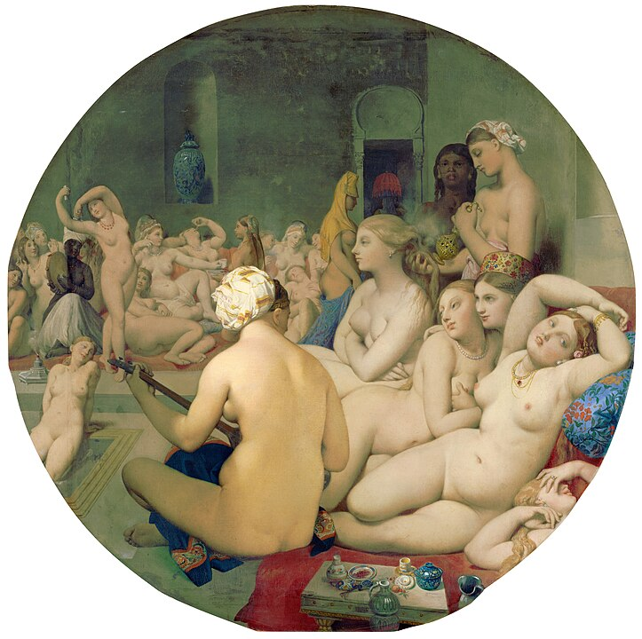
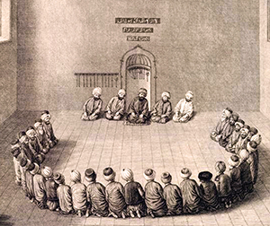

{fig-align="center" width="560"}

*Uno spazio vuoto e una santa mai esistita. Il continuo precipitare della Sapienza. Istanbul vista da Hagía Sophía. Ricorrenze del simbolo della mezzaluna tra la Turchia e Genzano di Roma. La storia sulle sponde del lago di Nemi. La generazione degli dei e i molti nomi della dea. La faccia nascosta dell'Islam e gli infiniti Nomi di Dio. Principessa Bibesco: il tempio dell'Idea. Corbin: lo specchio del mondo divino. Frazer e Wittgenstein nel bosco del sacerdote assassino. Le ierogamie e le loro manifestazioni. Matrifocale e potere tra due Rome. Le navi di Caligola ieri e oggi. Lord Byron e l'esecuzione di un'adultera. Fourier, Flaubert, Pamuk: Istanbul capitale del mondo e tetra cloaca. Logos spermatikos, Paràcletos, Periklytos, Cabala e altre ragioni. Derrida: effetti di spettralità. Montale: il fantasma che ti salva. Pagels: vuoto e materia. Vuoti del presente e metropoli impossibili tra il Bosforo e i Castelli romani.*

## 1. Santa Sapienza

*Il Signore con la Sapienza fondò la Terra e consolidò le cose con l'Intelligenza. Per la sua Scienza gli Abissi si spalancano. (Proverbi 3:19-20)*

Resta della nostra storia un puro spazio vuoto. Questo vuoto, a differenza di quanto possano aver considerato gli antichi e i moderni, non nega e non afferma il movimento, il pensiero e la compiutezza, e si impone alla nostra considerazione anche in base all'esperienza di un presente che oscilla continuamente tra potenzialità generativa di forme e perdita irreparabile di ogni eredità. Il tempo sembra essersi spezzato, il presente appare assente a se stesso: forse è soltanto esteriorità, ma l'idea di vuoto è quanto perlopiù si impone.

A Istanbul, questo vuoto può sorprenderci tra la loggia del *muezzin* e il luogo di incoronazione dei *basileus*, all’interno di Hagía Sophía, che prende il nome da una santa mai esistita. Edificio dalle proporzioni improbabili ma solide, è originariamente un tempio pagano dedicato alla Sapienza, che nell’Ebraismo, nel Cristianesimo e nell’Islam si configura quale aspetto della divinità.

L’edificio, consacrato come chiesa da Costanzo II nel quadro della riorganizzazione della nuova capitale imperiale nel 360, nel 404 viene incendiato durante gli scontri che coinvolsero Giovanni Crisostomo, patriarca della città costretto a deporre la carica. Riedificato da Teodosio II nel 415, nel 532 è un’altra volta dato alle fiamme durante la rivolta di Nika, che minaccia di travolgere Giustiniano accusato di eccessive spese militari. Di nuovo eretto nel 537 con il proposito di essere più splendido del Tempio di Salomone di Gerusalemme, rappresenta il più grande edificio sacro della cristianità, per lasciare dopo la presa ottomana il primato a Santa Maria Maggiore di Roma.

{fig-align="center" width="500"}

A detta delle leggende, nel 1453 Maometto II vi entra a cavallo e interrompe una messa che attende ancora di essere ripresa; a detta di altri, si prosterna al suo interno in direzione della Mecca e poi pronuncia un discorso in greco antico. Il sultano, figlio di una cristiana e collezionista di reliquie, conquista la città e il suo impero all'Islam accrescendone di fatto la ricchezza, e trasforma l’edificio in moschea. Tra i suoi titoli, imperatore dei Romani. Nel 1934 Hagía Sophía diventa museo, ad opera di Mustafa Kemal, padre laico della Turchia moderna, «*turco come gli antenati*» (Atatürk), che inoltre trasferisce la capitale ad Ankara.[^1] Nel revival ottomano truce, puritano e un po' kitsch che ha seguito l'amara sbronza europeista, per iniziativa del presidente Erdogan l'edificio viene riconsegnato nel 2020 al culto islamico, rinnovando le lotte su suo significato e sua funzione.

[^1]: Philip Mansel, *Costantinopoli* \[1995\], trad. C. Lazzari, Mondadori, Milano 2003.

Segnato dalle fiamme, dalle spade e dal sangue, l'edificio porta il santo nome della divina Sapienza, che precede la creazione di questo mondo e nel quale verrebbe a manifestazione permettendone intelligenza nonché governo (*Sapienza* 7:25ss). Tuttavia, così come il libro che le è dedicato non è stato scritto da Salomone e piuttosto sembra redatto nel I sec. d.C., questo nostro mondo non sembrerebbe affatto ordinato come sapienza comanda, e restano vane le ingiunzioni verso i potenti (6:4-8). Può fornire una traccia per decifrarne i travagli la *Pistis Sophia*, vangelo gnostico del III sec. dove la Sapienza stessa racconta come, per inseguire una luce solo apparente, *precipita*, per restare quindi imprigionata nella tenebra e nella materia che contribuisce a creare. Lei, che cerca verità, giustizia e amore, è odiata da potenze, dette Arconti, che propalano inganni.[^2]

[^2]: *Pistis Sophia* (II sec. d.C.), a cura di L. Moraldi, Adelphi, Milano 1999.

Se il primo testo è estraneo al canone ebraico, il secondo è considerato eretico dai cristianesimi ufficiali, mentre il mondo musulmano è generalmente estraneo ad ambedue: tuttavia, pur se dai margini delle ortodossie monoteiste, le loro concezioni implicano elementi costitutivi di quella che possiamo chiamare coscienza collettiva, cosi come lo è la mitologia. Tali elementi riguardano anche la nostra contemporanea laicità e il vuoto che sembra aver lasciato l'immagine del divino. Nel tralasciare diatribe di altro genere e concentrandoci perlopiù su aspetti di carattere speculativo e questioni relative alle idee e alla storia, ne cercheremo le tracce intrecciando tra loro le tradizioni di diverse culture e trovando il filo del discorso proprio nella sapienza. Che, in qualche modo, continua a precipitare.

Potremmo così, per sua e nostra salvazione, essere costretti a cercare questa sapienza quale ragione e soluzione di un mondo che tuttora è fiamme, spade e sangue anche tra coloro che si appellano a luci superiori. E, laddove una sua scintilla è in ognuno, pur se spesso imperscrutabile, la sua stessa dispersione può ritrovare consistenza nel nostro risalirne le forme, ovunque si svolga il nostro andare. Senza illudersi con poca saggezza che i tempi andati siano stati migliori (*Ecclesiaste* 7:10), saremo a rintracciarne l'eco sulle sponde del lago di Nemi e su quelle del Bosforo, intenti a riscoprire storie di città e nomi di divinità e a contemplare i vuoti diventare pieni e viceversa. E in questo andare, non privo di deviazioni obbligate e ritorni improvvisi, cercarne le manifestazioni.

## 2. Genzano e la Luna

*Ciò che il Santo, egli sia benedetto, ha fatto sulla Terra, è a somiglianza di quanto è nel Firmamento: ogni cosa allude a quello che si trova nel mondo superno. (Zohar II 15b-16a)*

{fig-align="center" width="500"}

La sapienza ama adornarsi di simboli che si rincorrono tra posti diversi e lontani in modi a volte apparentemente incomprensibili, sollecitando la nostra intelligenza a confrontare tra loro sistemi e credenze diverse. Questo accade anche nei luoghi del nostro vivere ordinario. Nella bandiera turca, uno spazio vuoto si apre verso una stella da una mezzaluna crescente, successivamenta assunta anche quale simbolo dell'Islam. È aperta ad uno spazio vuoto la mezzaluna calante sormontata da una corona nello stemma di Genzano, cittadina dei Castelli Romani. Spazi vuoti suscettibili di riempirsi di tensioni e significati.

Interpelliamo il susseguirsi degli eventi sottraendone le testimonianze a quelli che Nietzsche chiamava gli aspetti *monumentali, antiquari e critici* e così liberarla da giustificazioni ipocrite, feticismi grotteschi e piagnistei sterili,[^3] in modo da rendere giustizia al passato, cura al presente e prospettiva al futuro. Le differenze tra le due mezzelune sono evidenti eppure la loro similiarità è netta, e tutto appare piuttosto enigmatico. Sviluppiamone le indicazioni vagliando, per quanto questi offrano molti vuoti, i dati della storia, riconoscendo la complessità che vi intrecciano i suoi viluppi secondo riferimenti per cui la dimensione locale riconosca la propria relazione con visioni e dimensioni teoriche più ampie.[^4]

[^3]: Friedrich Nietzsche, *Sull'utilità e il danno della storia per la vita* \[1874\], a cura di S. Giametta e M. Montinari, Adelphi, Milano 1972.

[^4]: [C. Biraghi - S. Fontana, *Il concetto di storia locale*, Istituto Lombardo - Accademia di Scienza e Lettere, Varese 2021.](https://www.researchgate.net/publication/362491776_IL_CONCETTO_DI_STORIA_LOCALE_E_L'INTERNATIONAL_RESEARCH_CENTER_FOR_LOCAL_HISTORIES_AND_CULTURAL_DIVERSITIES_DELL'UNIVERSITA_DEGLI_STUDI_DELL'INSUBRIA_CLAUDIA_BIRAGHI_e_SARA_FONTANA_Scienze_storiche)

In epoca antica parte del territorio della *gens* Aricina, Genzano deriva, come gli altri paesi della zona, dal lento smembramento dell’immenso feudo tuscolano, ed è stato a lungo circoscritto ad un remoto villaggio di contadini e pescatori, lontano dal vecchio tracciato della via Appia che corrisponde grossomodo all'odierna via dei Laghi. La località inizia a svilupparsi nella zona oggi chiamata Genzano Vecchio sul ciglio settentrionale esterno del lago di Nemi; il borgo conosciuto come Nemi, sulla parte opposta del lago e ancora più appartato, inizialmente *Massa* di fondi e casolari sparsi, gli è stato strettamente associato. Le due località sono unite da un percorso a mezzaluna che costeggia il lago, anticamente detto *Speculum Dianae* e, nonostante la distanza che ci separa da tutto ciò, non è difficile immaginare come un mondo intero possa raccogliersi in tale esclusiva dimensione. Nel bosco attorno al lago, un santuario piuttosto articolato ed esteso dedicato alla dea *Diana Nemorens*. *Nemus* significa bosco, e nove alberi ripartiti su tre colli sono riportati sullo stemma della località che ne ha preso il nome; l'origine della denominazione e dello stemma di Genzano è incerta e ancora dibattuta, scarne per quanto intricate le vicende del suo costituirsi.

A detta di Marco Porcio Catone, il bosco sacro sarebbe stato istituito prima del 495 a.C. da Manio Egenio Bebo, dittatore di Tuscolo, per incarico delle genti di «*Tusculanus, Aricinus, Lanuvinus, Laurens, Coranus, Tiburtis, Pometinus, Ardeatis, Rutulus.*»[^5] Strabone ci riferisce di un «*lago profondo*», un sacerdote «*sempre armato di spada*» e un «*costume barbaro e scitico*».[^6] Uno è un generale che parla a nome del tradizionalismo agrario e ha come unico riferimento Roma repubblicana, l'altro un viaggiatore erudito che scrive per il romano cosmopolita dell'era imperiale e cita esclusivamente fonti greche; le parole dei due stabiliscono discordia tra le ipotesi di origini autoctone oppure quelle straniere del culto di Diana che si stabilisce presso il lago, facendo comprendere quanto già dai tempi più antichi possa essere composita la realtà.

[^5]: Catone il Censore, *Origini: II fr. 62* \[II sec. a.C\], in *Opere* di Marcio Porcio Catone Censore, a cura di P. Cugusi e M. T. Sblendorio Cugusi, UTET, Torino 2001

[^6]: [Strabone, *Geografia* V: I-2 \[14-23 d.C.\]](https://it.wikisource.org/wiki/Pagina:Della_geografia_di_Strabone_libri_XVII_volume_3.djvu/77).

{fig-align="center" width="503"}

Anastasio Bibliotecario ci informa che dal 326, un anno dopo l'editto di Nicea, con l’erezione da parte di Costantino imperatore della basilica San Giovanni Battista di Albano, l’area del lago e del Santuario di Diana è compresa nella Diocesi di Albano; la basilica è distrutta da un incendio e quindi ricostruita come Cattedrale di San Pancrazio dal pontefice Leone III all'incirca nell'800, mentre si prepara la vicenda dell'impero carolingio. Le diocesi esprimono il potere ecclesiastico in rapporto con l’organizzazione territoriale, e costituiscono un indice da non trascurare nella valutazione dei processi storici.[^7]

[^7]: [Diocesi di Albano, *Cronotassi episcopale*.](https://www.diocesidialbano.it/diocesi/cronotassi-episcopale/)

Nella zona del lago non sono state rinvenute tracce da far risalire alle incursioni saracene che nel IX sec. investono anche il territorio della vicina Lanuvio, e che coinvolgono in maniera particolare i porti di *Centumcellae* (Civitavecchia), Ostia, Porto, *Caiēta* (Gaeta), nonché le basiliche romane di San Paolo e San Pietro, sedimentandosi in maniera accertata in alcune zone della Valle dall'Aniene e del Garigliano. Pertanto, l’ipotesi che a Genzano nel X sec. sia esistito un piccolo insediamento saraceno che abbia influenzato la formulazione dello stemma cittadino non è suffragata in alcun modo, ed è inoltre è piuttosto dubbio che all'epoca la mezzaluna potesse essere particolarmente legata ai Saraceni o all’Islam.

Risale comunque al IX sec. la fortificazione di Nemi, attorno la quale si sviluppa il quartiere della Pullarella. Nel secolo successivo, come grande parte della Campagna romana, diventa possesso dei potenti Conti di Tuscolo, il cui potere su Roma si sviluppa con la dissoluzione dell'impero carolingio e si afferma parallelamente all'istituirsi dell'impero sassone, per prevalere nel papato fino all’epoca di Benedetto IX. Durante la lotta per le investiture e all’alba delle crociate, nel 1090 *castrum* Nemi e pertinenze vengono concesse dal conte tuscolano Agapito in dote a sua figlia, sposa di Oddone Frangipane. Nel 1153 la proprietà passa ai Cistercensi e nei documenti compare il toponimino *Cynthianum*.[^8] Il territorio rimane implicato nelle continue dispute, spesso piuttosto violente, che i diversi clan della nobiltà romani intrattengono tra di loro e con i pontefici in carica, perlopiù appartenenti alla loro schiatta e altresì a volte implicati in conflitti tra papi che si contendono la carica. Come sovente accade per gli esponenti dell'aristocrazia non soltanto europea, sono tutti parenti e si odiano tutti, e adorano impegnarsi in grandi imprese che possono lasciare traccia pure in quelle piccole località che sono ad un tempo loro giocattoli e fonte di rendita. Quanto sappiamo per certo di Genzano proviene perlopiù dall’opera di Nicola Ratti,[^9] che va rivisto e integrato con quanto possa precisare e chiarire contesto e dinamiche. Nel periodo in cui Genzano inizia a fiorire, è vescovo di Albano Nicholas Breakspear, dal 1154 nominato pontefice con il nome di Adriano IV, che si caratterizza come deciso riformista del clero, impegnato in conflitti e trattative con l'imperatore tedesco Barbarossa, il Comune di Roma, i Normanni che contendono ai Bizantini il Meridione.

[^8]: [*Antonio Nibby, Analisi storico-topografico-antiquaria della carta de' dintorni di Roma*, vol. II, Roma 1849.](https://books.google.it/books?id=Q4hJAAAAMAAJ&hl=it&pg=PA107#v=onepage&q&f=false)

[^9]: [Nicola Ratti, *Storia di Genzano*, Stamperia Salomon, Roma 1797.](https://books.google.it/books?id=FPE_AAAAcAAJ&printsec=frontcover&hl=it#v=onepage&q&f=false)

Il *Fundus Cynthianum* trova quindi testo nella donazione del 1153 effettuata da Anastasio IV della Suburra, predecessore di Adriano IV, nei confronti dell’Abbazia delle Tre Fontane sulla Laurentina, luogo del martirio di San Paolo, conosciuta anticamente con il nome di Acque Salvie e all’epoca tenuta dai Cistercensi. Tale ordine nasce dalla riforma di Cluny e ha già fornito contributi all'organizzazione degli ordini cavallereschi, in particolar modo con la *Regola* emanata da San Bernardo di Chiaravalle per i Templari. L'attribuzione trova conferma nel 1183 da parte di Lucio III Allucingoli; in questo periodo i papi spesso sono costretti a risiedere fuori Roma per le ostilità con il Comune, che si ispira all'antica repubblica, e sono altresì impegnati nella lotta contro eresie quali Catari e Arnaldisti. La distruzione di Tuscolo del 1191 inaugura un nuovo corso; la Chiesa rilancia prerogative e proprietà, il Comune consolida potere e funzioni, l'Impero si estende al Meridione già conquistato dai Normanni ai Bizantini. Nel 1218 Onorio III Savelli decreta la demolizione di una torre abusiva eretta nel XII sec. dai Gandolfi che danno nome alla vicina Castel Gandolfo. Le citazioni dell’effettivo toponimo *Genzani* quali *fundus* e *castrum* risalgono alle bolle emanate nel 1255 da Alessandro IV de' Conti di Segni, che, riepilogando i documenti precedenti, si riferiscono esplicitamente alla costa montana e al castello. Questo viene fondato in quell'anno dai Cistercensi, per venir ricostruito prima dai Colonna e in seguito sostituito da palazzo Sforza Cesarini. La torre di avvistamento del XIII sec., detta Saracinesca, già parte della cerchia muraria del castello e ancora incastonata all'inizio del Corso Vecchio, prova perlopiù l'esigenza di difendersi dalle incursioni e non spiega né stemma né altro.

{fig-align="center" width="503"}

Anche per la particolare fragilità a cui è territorialmente esposto, Genzano e pertinenze restano coinvolte nelle instabilità del periodo in cui la sede del papato è presso Avignone, periodo che segna il ripopolamento della zona oggi conosciuta con il nome di Castelli romani. Gli interessi avignonesi sono rappresentati presso la Diocesi di Albano da una sfilza di nomine vicine alla sua Curia. I conflitti si inaspriscono con l'inaugurarsi dello Scisma d'Occidente in cui l'Europa e la Chiesa si dividono in due fazioni fronteggiandosi tra loro pontefici di elezione avignonese e di elezione romana. Clemente VII di Ginevra, pontefice avignonese poi considerato antipapa, cugino del re di Francia Carlo V di Valois il Saggio, attribuisce Genzano al suo sostenitore Stefano Orsini di Marino nel 1378. Probabilmente il paese torna ai Cistercensi già nel 1380, l'anno successivo alla battaglia di Marino, scontro tra eserciti regolari di mercenari francesi e italiani nel quale prevalgono questi che parteggiano per Urbano VI Prignano, eletto dal conclave di Roma, che con spiccato autoritarismo afferma che la sua carica è stata stabilita *ab aeterno*. I pontefici continuano a risiedere nelle rispettive città scomunicandosi a vicenda, Clemente VII è in carica ad Avignone fino al 1394, a Roma nel 1389 viene eletto Bonifacio IX Tomacelli.[^10]

[^10]: Ferdinand Gregorovius, *Storia della città di Roma nel Medioevo* \[1877\] trad. A. Casalegno, Einaudi, Torino 1973; Claudio Rendina, *I Papi. Storia e segreti* \[1983\], Newton Compton, Roma 2001.

Nel 1393 Genzano subisce l'invasione di Nicola Colonna di Palestrina ed è annesso ai domini di Lariano, ma nel 1399 il Colonna, già oggetto di scomunica da parte di Bonifacio IX, fallisce una congiura ai danni del pontefice, e quindi Genzano passa per breve periodo al suo sodale Buccio Savelli. Il governo dispotico degli occupanti provoca disordini e rivolte e per volontà degli abitanti e intercessione del papa, il paese viene annesso alla castellania di Marino e passa al dominio diretto della Camera apostolica, con governatori Piero e Marino Passerello. Lentamente tornano i Cistercensi, ma dal 1402 un incendio li costringe ad alienare alcune proprietà. Nel 1410 il pontefice di Roma Giovanni XXIII Cossa, in seguito reputato antipapa, eletto dal conclave di Bologna in un periodo in cui i papi in carica sono tre, consegna Genzano in locazione per un triennio a Giovanni Colonna in modo da stringere alleanze con la potente famiglia e accentrare il proprio potere. Allo scadere del periodo di locazione, nel 1413 Antonello Savelli occupa Genzano e Giovanni Annibaldi si insedia a Nemi. Martino V Colonna, nominato pontefice all'unanimità nel conclave di Costanza nel 1417, riassocia le due località e le restituisce ai Cistercensi.

Un papa è stato nominato, ma ce ne sono ancora altri tre da sistemare, dei quali è opportuno segnalare brevemente le carriere. Gregorio XII Correr, che dal 1406 si considera il legittimo pontefice romano, viene condotto alla rinuncia al soglio, ed è nominato vescovo delle sede suburbicaria che era stata di Labico Quintanense, quindi di Tuscolo e ora, per quanto il vescovato non abbia ancora sede nella località omonima, di Frascati. Il suo rivale a Roma Giovanni XXIII, che nel 1414 aveva indetto il Concilio di Costanza, in rapporto fiduciario con il futuro Martino V seppur convinto di prevalere, fortemente constrastato e grazie alle diffamazioni degli avversari passato alle cronache come "cardinale Diavolo", viene deposto; nel 1419, alla morte del rivale Gregorio XII, riceve anche lui il vescovato di Frascati, confermandone il ruolo di stanza di compensazione dei poteri romani.[^11] Da parte sua, l'avignonese Benedetto XIII de Luna, in carica dal 1394 ma ormai definitivamente antipapa, continua imperterrito a pontificare in una propria corte privata dal castello di Peñiscola sulla costa del Regno di Valencia con i suoi tre cardinali fino alla sua morte nel 1423.

[^11]: Paolo Mascherucci, *La Diocesi Suburbicaria di Frascati e i suoi cardinali vescovi*, Ass. Cult. Amici di Frascati, Frascati 1991.

Il definitivo ripristino nel 1420 della sede papale a Roma, realizzato da un esponente dei Colonna, dei quali fu proprio Sciarra con lo Schiaffo di Anagni del 1303 a mettere in moto gli eventi che determinarono la Cattività avignonese, segna una minore precarietà anche nell'entroterra, favorendo altresì un più marcato processo di urbanizzazione delle località. Da parte sua, la diocesi di Albano esprime personalità che hanno carattere di mediazione tra le componenti filofrancesi e quelle più radicate negli interessi romani, permettendo così la stabilizzazione del territorio.

Nel 1423 i Cistercensi concedono l'affitto di Genzano e Nemi a Giordano Colonna di Salerno, fratello del papa, e nel 1428 vengono acquistate da Antonio, Prospero e Odoardo Colonna. La famiglia ne resta stabilmente proprietaria per mezzo secolo ed esse non risultano compromesse dalle ostilità di Eugenio IV Coldumer, che dal 1431 mette in discussione le attribuzioni di Martino V sostenendo fazioni avverse ai Colonna quali Orsini e Vitelleschi; Eugenio IV è scalzato a Roma da un governo comunale autonomo, e con la sconfitta di Varna del 1444 fallisce la crociata contro gli Ottomani in piena espansione e prossimi alla presa di Costantinopoli. Nel 1446 il cardinale Prospero Colonna inaugura gli interessi verso le navi sepolte nel lago di Nemi, che suscitano interesse anche nel pontefice Pio II Piccolomini. Nel 1479 le due località vengono acquisite da Guillame D’Estouteville, cardinale munifico e papa mancato, e quindi passano ai suoi eredi, ai quali nel 1485 muove guerra Prospero Colonna, che occupa anche Frascati e attacca pure gli Orsini; nel 1486 Innocenzo VIII Cybo prima requisisce la proprietà per poi attribuirne, in base al diritto di retrovendita, pieno possesso al Colonna. Nel 1501 i principali esponenti della famiglia sono colpiti da scomunica e confisca dei beni da Alessandro VI Borgia, che conferisce Genzano alla figlia Lucrezia, che a sua volta ne nomina principe il figlio Rodrigo d'Este di due anni. Nel 1503 Giulio II della Rovere restituisce ai Colonna i loro beni; vescovo di Albano è Raffaele Riario, mecenate delle arti, legato da parentela al pontefice. Nel 1514 a Nemi, cresciuta di consistenza e prossima a trovare autonomia, viene apografato da parte di Marcantonio I Colonna uno *Statuto* del periodo cistercense, modello dello Statuto di Frascati di un anno successivo. Il dominio della casata si mantiene per un altro sessantennio.

{fig-align="center" width="503"}

La lunga permanenza dei Colonna ha favorito l’ipotesi di associare lo stemma cittadino alla vittoria nella battaglia della Lega Santa contro i Turchi Ottomani svoltasi a Lepanto nel 7 novembre del 1571. In un coflitto denso di significati simbolici e strategici, la flotta cristiana e quella musulmana si affrontarono assumendo rispettivamente le formazioni della croce e della mezzaluna. Tra i federati riuniti sotto le insegne pontificie, si distingue come ammiraglio Marcantonio II Colonna, signore di Marino e precedentemente anche di Genzano e Nemi, che prima di partire riceve da papa Pio V Ghisleri le insegne con il motto costantiniano *In hoc signo vinces*, Real, consegnata Giovanni d’Austria per issarla sulla nave ammiraglia Real. Nel 1563 Colonna ha già ceduto Genzano a Fabrizio Massimi, il quale l’anno successivo la rivende a Giuliano Cesarini duca di Civitanova Marche, che per breve periodo era stato in possesso di Nemi. Ed è il Cesarini ad emanarne nel 1565 lo *Statuto*, ed è sotto i suoi discendenti e i loro eredi Sforza Cesarini che Genzano trova stabilità e sviluppo, mentre Nemi si consolida dal 1572 con il nuovo dominio dei Frangipane.

Circa un secolo dopo, a Genzano gli interventi urbanistici nel 1637 coivolgono la chiesa di San Francesco e un convento per i Cappuccini trasferitisi da Nemi, nel 1641 l'ampliamento del castello. Nel 1650 viene ultimata Santa Maria della Cima su disegno di Giovanni Antonio De Rossi, che sostituisce la precedente chiesa parrocchiale cistercense dedicata alla Beata Vergine; dietro, si nasconde Genzano Vecchio. Alla luce di tali passaggi, non ha senso alcuno attribuire alla commemorazione della pur celebre vittoria navale di Lepanto, che a Marino ispira la Fontana dei Mori, lo stemma della città.

Gli eventi successivi introducono cambiamenti nell'assetto generale di Genzano e permettono di osservare società e ruoli di un'epoca. Nel 1665 Giuliano III Cesarini muore senza lasciare discendenti maschi ancora in vita, aprendo una crisi dinastica colmata da suo fratello Filippo, un *chierico di camera* vicino al papa e prossimo al cardinalato che per ragion di stato passa allo stato laicale. Filippo nel 1677 fa edificare la chiesa di San Sebastiano (demolita nel 1916) e affida a Tommaso Mattei la realizzazione del tridente di strade sottostante Santa Maria della Cima. Per preparare il governo a venire, nel 1671 combina il matrimonio della nipote Cleria con Filippo Colonna di Sonnino. Le disposizioni familiari precedenti erano state più favorevoli a esponenti degli Orsini o degli Sforza e, per amore o altre ragioni, l'intreccio si complica. Infatti, si oppone a tale disegno dinastico e agli interessi dei Colonna un'altra figlia di Giuliano III.

Livia Cesarini dal 1664, come di prassi per molte giovani, era entrata come conventuale, senza particolari vincoli di voto, presso la congregazione delle Oblate dei Sette Dolori. Tuttavia, in un secondo tempo si rende disponibile al matrimonio. Seconda figlia femmina di una famiglia nella quale i lutti avevano scombinato i piani ereditari, fa più o meno il contrario dello zio, cioè passa dalla condizione religiosa a quella laica. Riceve quindi le attenzioni di numerosi pretendenti per convolare a nozze nel 1672 con Federico Sforza di Santa Fiora. Nel 1685 alla morte di Filippo è lei ad ereditare Genzano e si direbbe anche in maniera piuttosto accentratrice. Infatti, suo marito ne assume il titolo di principe nel 1697, nel 1709 arriva ad una transazione legale con la sorella Cleria.

{fig-align="center" width="503"}

In questo arazzo le figure di maggior rilievo storico stanno sullo sfondo, e la scena si arricchisce di varie congiunture. Il matrimonio di Livia e Federico viene combinato dal cardinal Paluzzo Paluzzi degli Albertoni, a quanto pare onesto pur se spregiudicato, forte del suo sostegno alla Spagna ma fonte di imbarazzi con Svezia e Russia, in buoni rapporti tanto con i Colonna quanto con gli Orsini e nelle piene grazie del pontefice.[^12] Il papa è Clemente X Bonaventura Altieri, fine diplomatico, che rende obbligatoria la festa degli Angeli custodi del 2 ottobre, ratificando un culto di origine ebraica, problematico in quanto considerato inferiore rispetto a quello di Cristo (*Colossesi* 2:18-19). Al tempo delle nozze Cesarini Sforza, è vescovo di Albano il cardinal Virginio Orsini, attivo nei rapporti con Francia e Portogallo pur senza ricavarne buona considerazione, mecenate spendaccione, in seguito nominato vescovo di Frascati.

[^12]: [Pompeo Litta, *Famiglie celebri italiane, Tav. XV - Colonna di Roma,* Giulio Ferrario, Milano 1834.](https://gallica.bnf.fr/ark:/12148/btv1b8452252g/f35.item.r=.zoom)

Genzano inizia a diventare un posto interessante. Attratto dalla località, vi si stabilisce il pittore Carlo Maratti (o Maratta), al tempo molto influente, conciliatore tra classicismo e barocco, maestro del ritratto, attento ai contesti di riferimento e interessato a temi mitologici, alla cui opera non erano sfuggiti riguardi verso la figura di Diana. Nel 1703 sua figlia Faustina, apprezzata poetessa, prima respinge e poi è oggetto di aggressione e tentato rapimento da parte del figlio cadetto di Livia e Federico, Giangiorgio Sforza Cesarini, che ripara nelle Fiandre come militare nell’armata spagnola e torna a Roma e ottiene il perdono soltanto nel 1718.[^13] Leggenda vuole che il fantasma di donna Livia resti tuttora ad aggirarsi per l'elegante palazzo di famiglia, ultimato sul sito del vecchio castello nel 1730 su disegno di Ludovico Gregorini, provvisto della singolare caratteristica di mantenere alla popolazione il diritto di attraversarne il portone, che sostituisce l'antica porta di ingresso del borgo di Genzano Vecchio.

[^13]: Pietro Zampetti, *Pittura nelle Marche,* vol. IV, Nardini, Firenze 1991.

Livia Sforza Cesarini rende contingenti interessi già decisi e instaura una diversa successione degli eventi, riafferma la sua eredità con personalità, eppure non è opportuno ricamare troppo: comunque vada, non esce dal protocollo e si tiene tutta la "robba" di famiglia e, se contrae nozze inaugurando per linea *matrifocale* una nuova dinastia, affida a questa un futuro già pianificato. Infatti, porta all'apice la politica dei Cesarini e nel 1708 completa il disegno di espansione urbanistica di Genzano Nuova ideato dal padre e progettato da Gregorini come sistema di triangolazioni, colmando così i vuoti determinati dallo sviluppo del contesto. La centrale delle vie che discendono da Santa Maria della Cima, popolarmente detta via Livia, sulla quale si svolge attualmente la tradizionale Infiorata del Corpus Domini, immette su via Appia nuova. In tale incrocio, dal 1836 viene collocata la fontana di San Sebastiano, eretta nel 1776 davanti alla chiesa omonima (non più esistente dal 1916) su disegno di Virginio Bracci, autore anche dei corpi centrali della Fontana di Trevi a Roma.

Gli elementi simbolici della fontana sono costituiti da una colonna adornata di pampini e grappoli d'uva, sulla quale, sormontata da corona e croce, si eleva una sfera adornata da tre falci di Luna. Considerando il complesso dei dati, la mezzaluna di Genzano non può trovare ascendenze in memorie saracene, né nelle vicende dei Colonna, non ha a che vedere con i Cesarini il cui stemma è una colonna sormontata da un'aquila con un orso incatenato, nemmeno con quello Sforza provvisto di un leone d’oro in campo azzurro con cotogno fogliato. Tralasciamo quindi altri eventi stettamente collegati alla storia della città e rivolgiamoci alla vicenda complessiva dell'area, il cui riferimento principale è il lago di Nemi.

{fig-align="center" width="503"}

## 3. Diana dai molti nomi

*Ascolta beata, essendo soccorritrice dà discendenza e salva, come per natura sei sempre salvatrice di tutti. (Inno a Prothyraia)*

{fig-align="center" width="503"}

Fornisce una traccia per venire a capo di questa intricata questione, ancora in sospeso e che, senza che nessuno se ne turbi troppo, resta come vero e proprio vuoto negli studi sul territorio, l'antica denominazione del territorio quale *Fundus Cynthianum*. Ratti associa il toponimo alla famiglia *Gentia* che sarebbe stata proprietaria del fondo e avrebbe avuto anche esponenti, invero piuttosto oscuri e addirittura remoti alla zona, in età repubblicana e imperiale. Così riportano autori quali Antonio Nibby, peraltro nel 1827 testimone delle ricerca delle navi nel lago e partecipe degli scavi presso la costa, Giuseppe Tomassetti[^14] e, in tempi più recenti, Anna Pasqualini.[^15] Tuttavia, in tale quadro rimane del tutto inspiegabile la Luna dello stemma, che trova invece spiegazione convincente in ipotesi che vengono formulate prima, contemporaneamente e dopo l'opera del Ratti che, se è esemplare per l'analisi dei primi documenti, sui quali fa sufficiente chiarezza, è autorevole soprattutto per la *committenza*, proveniendo dai signori stessi di Genzano, i Cesarini Sforza.

[^14]: Giuseppe Tomassetti, *La campagna romana antica, medioevale e moderna*, vol. II \[1910-1926\], a cura di L. Chiumenti e F. Bilancia, Banco di Roma, Firenze 1975.

[^15]: [Anna Pasqualini, CYNTHIANUM. *Il nome di Genzano di Roma dalle origini alle dispute settecentesche*, «Rationes rerum» 9.2017 (In onore di Eugenio Lanzillotta).](https://www.academia.edu/36091790/CYNTHIANUM_Il_nome_di_Genzano_di_Roma_dalle_origini_alle_dispute_settecentesche_in_Rationes_rerum_9_2017_In_onore_di_Eugenio_Lanzillotta_pp_117_132)

Di contro, collegano il nome della località a *Cynthia Fanum* numerosi studiosi: durante l'umanesimo Flavio Biondo,[^16] nel Rinascimento Raffaele Volterrano[^17] e Leandro Alberti,[^18] a fine settecento, quindi in contemporanea con il Ratti, Emanuele Lucidi che già ci associa lo stemma cittadino,[^19] a inizi ottocento Ellis Cornelia Knight[^20] e successivamente Johannis Heinrich Wesphal[^21] e Carlo Fèa.[^22] In estrema sintesi: *Cynthia* indica la Luna, *Fanum* luogo o tempio sacro: il nome significa spazio sacro alla Luna, e la dea Diana Nemorense è venerata nel santuario che sorge tra il bosco e il lago e i cui riferimenti coinvolgono tutta l'area.

[^16]: [Biondo Flavio, *Roma restaurata et Italia Illustrata* \[1439-1458 ca.\], Michele Tramezzino, Venezia, 1542.](https://archive.org/details/romaristavrataet00bion/page/n3/mode/2up)

[^17]: [Raffaele Volterrano, *Commentari urbani - Lib. VI* \[1506\], Sebastian Gryphius, Lione 1552.](https://archive.org/details/ned-kbn-all-00002512-001/page/n122/mode/2up)

[^18]: [Leandro Alberti, *Descrittione di tutta l'Italia, et isole pertinenti* \[1596\], Libreria della Fortezza, Venezia 1638.](https://books.google.it/books?id=KdclEEV28MsC&hl=it&pg=PA248#v=onepage&q&f=false)

[^19]: [Emanuele Lucidi, *Memorie storiche dell’antichissimo municipio ora Terra dell’Ariccia e delle sue colonie Genzano, e Nemi,* Lazzarini, Roma 1796.](https://books.google.it/books?id=P5dbQkx_IbYC&hl=it&pg=PR1#v=onepage&q&f=false)

[^20]: [E. C. Knight, *Description of Latium or La Campagna di Roma*, Longman, London 1805.](https://archive.org/details/descriptionoflat00kniguoft/page/82/mode/2up)

[^21]: [Johannes Heinrich Westphal, *Die römische Kampagne in topographischer und antiquarischer Hinsicht dargestellt,* Nicolai, Berlin 1829.](https://archive.org/details/diermischekampa00westgoog/page/n27/mode/2up)

[^22]: [Carlo Fèa, *Osservazioni sul ristabilimento della via Appia,* Stamperia della Rev. Cam. Apostolica, Roma 1833.](https://play.google.com/books/reader?id=m3FMAAAAMAAJ&pg=GBS.PP8&hl=it&source=gbs_atb)

Diana è signora della Luna e delle selve, protegge i cacciatori come i coltivatori nonché i cani e gli animali selvatici, custodisce fonti e torrenti, sorveglia le donne e i parti, è legata alla castità e alla vendetta, dispensa la sovranità ed è patrona della *plebs* romana. È un'antica dea latina e italica che accoglie progressivamente stratificazioni molto differenziate: l'etrusca Artume alla quale sono attribute la Luna, la notte e la morte, le dee degli animali dell’Asia Minore, la signora delle fiere minoica, la greca Artemide. L'*Inno Orfico a Prothyraia*, colei che sta sulle soglie, esordisce evocando una dea quale «*demone dai molti nomi*», l'*Inno a Ecate* ci porta incontro la «*signora che custodisce tutto il cosmo*», l'*Inno alla Luna* celebra la «*dispensatrice di grazia, \[che\] porti a compimento*».[^23]

[^23]: *Inni orfici* \[II-III sec. a.C\], a cura di G. Ricciardelli, Mondadori/Fondazione Lorenzo Valla 2000.

Il suo nome deriva da *dia*, e quindi da *dius* e da *dies*, ad un tempo Luce e divinità; ha affinità con *Annae*, o *Inanna*, forma femminile del dio sumerico *An*, che indica il Cielo e il ciclo della vita e della morte. In Virgilio ricorre il nome di Trivia, con cui la ricorda anche il filosofo e astronomo romano Nino Figulo. Leandro Alberti lo conferma e, non lontano dall'insegnamento di quelli che ai tempi già erano antichi, tripartisce la figura in questo ordine: in cielo è Luna, in terra è Diana, agli inferi Ecate. La pregiudiziale che ha generalmente limitato la considerazione dell'infuenza del paganesimo sul Cristianesimo ha altresì impedito in alcuni casi la semplice valutazione filologica dell’influenza del nome *Cynthia* per indicare la Luna e quindi quella delle insegne dell’antica dea sulla denominazione e sullo stemma di Genzano. Da *Cynthia* deriva pure il nome Cinzia, che è adespota: come per *Sophía*, non è mai esistita una santa con questo nome. Tuttavia, ambedue sono forma della divinità.

{fig-align="center" width="498"}

Gli dèi della mitologia possono essere visti come forze naturali che pervadono profondamente l’esistenza ed essi, suggerisce il filologo e latinista Walter F. Otto, non hanno nulla a che fare né con la tecnica né con la magia, non sono né frutto di invenzioni né vanno evocati e, per quanto sia difficile crederci seriamente, «*possono soltanto essere sperimentati*». In opposizione al positivismo scientista che immiserisce il mondo e nonché agli aspetti troppo umanizzanti della psicologia del profondo, e in sottile corrispondenza con la volontà di potenza di Nietzsche, Otto definisce *teofania* l’esperienza con cui il divino della natura viene incontro all'uomo, manifestandosi con una pienezza che conferisce forma all’esperienza umana. Tale considerazione del mito come «*potenza ontologica*» corrisponde ad un'esigenza di sacro a suo dire niente affatto rappresentata dai cristiani a lui contemporanei, che hanno portato a profondo divorzio culto religioso e quotidianità profana. La pretesa di possesso di una verità esclusiva ha condotto da una parte alla svalutazione di tutto ciò che non si comprendesse o che semplicemente fosse *altro* e, purtuttavia, i primi cristiani avevano il sentore della realtà, quantomeno *demonica*, delle divinità della religione antica.[^24]

[^24]: Walter F. Otto, *Teofania* \[1956\], a cura di G. Moretti, Adelphi, Milano 2021.

Le pur raffinate riflessioni di Otto, e la decisiva formulazione dell’idea di mantenere un nesso tra le forme del divino e l’esperienza quotidiana, non scalfiscono la peculiare tensione cristiana, oggi messa particolarmente in crisi, per la quale il divino si carica ed è partecipe senza riserve delle contraddizioni umane. Peraltro, Otto appartiene alla cultura protestante, che ha sempre accusato di paganesimo l’attenzione nei confronti del mondo sensibile e della pluralità delle sue manifestazioni tipica del cattolicesimo, testimoniata anche da una ricca produzione artistica che ha mantenuto ampia considerazione delle antiche divinità, Diana inclusa. D'altro canto, tali aspetti non riducono la forma cattolica ad una religione "di risulta", ma ne dimostrano la plasticità: le antiche divinità possono alludere al Cristo, in qualche modo lo precedono e a lui si "convertono".

Otto offre comunque decisivi motivi di rifessione nel considerare come il comportamento e l’agire della religiosità pagana, come rimarca Plotino guidata da «*spavento accompagnato da piacere*», piuttosto che da volontà e obbedienza come prescrive Agostino, dimostrino un «*amore onnipotente*» superiore a quello cristiano in quanto caratterizzati da una spontaneità nella quale ritroviamo forza impersonale unita a potenza ontologica. Tale capacità di sentire una verità *in sé* la possiamo individuare nell'Islam nelle forme di una conoscenza che impersonalmente conosce se stessa e che l'uomo è libero di servire in quanto tale. La tensione monoteista del Dio cristiano di amore e del Dio geloso ebraico viene così elaborata stabilendo assoluta unità e unitarietà di Dio nonché uno stretto rapporto tra culto e quotidianità, il cui riferimento più netto, condivisi da Ebraismo e Islam sono in concetti di "ortoprassi" e di giurisprudenza. Per i quali sono altresì da considerare rispetto preoccupazioni affini che possono coinvolgere, oltre a quanto proviene dalla Grecia e dai suoi aspetti concettuali e cultuali, quanto concerne lo *jus* romano e risponde all’esigenza di una legge «*rerum humanorum atque divinarum scientia»*, capace di legare insieme cielo e terra, coinvolgendo nell'Islam l'integralità di ogni attività umana.[^25]

[^25]: Alessandro Bausani, *L'Islam* \[1980\], Garzanti, Milano 1987.

Quanto a noi oggi serve, in un Occidente non più cristiano che ha svuotato di senso ogni trascendenza per rendere la coscienza uno spazio vuoto pronto a colmarsi di qualsiasi spazzatura, è collegare tra loro le forme storiche del sacro e così tendere ad una conoscenza capace di accogliere la pluralità dell'esistenza e connetterla con la nostra unità psichica, cautelandosi altresì da rischi di infestazione e psicosi che possono essere implicati nel neopaganesimo da mercatino e negli integralismi da centro commerciale, ambedue aberrazioni del nostro presente. Salvare le lezioni della storia e liberarsi degli errori del presente esige anche di considerare che quanto ci separa dagli antichi è in una diversa articolazione della coscienza, facoltà di sentire in rapporto a dei criteri. E laddove il nostro universo è da Cartesio in poi soprattutto *mentale*, per essere conosciute e comprese nella loro consistenza, divinità e loro nomi richiedono, per quanto parziale, anche una sistematica, da correlare con esperienza e vissuti.

{fig-align="center" width="503"}

In tale sistematica il tre, che abbiamo già visto nella stessa Diana e che riguarda anche altre divinità del politeismo, esprime una relazione dinamica di generazione e di sintesi che si rinnova su ogni piano della manifestazione. Tale relazione non è limitata all'ordine biologico di padre-madre-figlio, né inerisce quelle che sono considerate ipostasi, o *persone*, della Trinità cristiana di Padre, Figlio e Spirito Santo, né tantomeno concerne l’unità del non manifestato su cui si concentra il monoteismo islamico. La problematica riguarda la considerazione dell'influenza del paganesimo sulla formazione del canone religioso occidentale e dei rapporti di questo con quanto elaborato nelle aree medio orientali da cui del resto deriva lo stesso Cristianesimo, e quindi di come e di quanto le divinità politeiste abbiano concorso alla formulazione degli aspetti del Dio unico.

Il monoteismo a sua volta conosce differenti livelli di complessità: l'Ebraismo si definisce in un contesto politeista dove assumono rilevante ruolo gli Angeli e non manca qualche divinità destituita assumere il ruolo di dèmone; nel Cristianesimo diventa originaria e costitutiva la Trinità, si mantiene ruolo a numerose e differenziate manifestazioni del divino e non manca mai il demonio a metterci lo zampino; nell'Islam rigorosa unità e unicità di Dio trovano correlato nella pluralità dei suoi Nomi e si accompagnano ad un'assortita varietà di dèmoni e *jinn*.[^26] Ogni religione ha sistematiche differenti che non sono esclusivamente sistemi e accolgono manifestazioni che non sono mai aspetti isolati e privi di relazione con altre manifestazioni e sistemi, che si riferiscono allo stesso ordine trascendente a cui mira la Sapienza perenne, ed è per tendere a questa che le attraversiamo.[^27]

[^26]: AAVV, *Geni, angeli e demoni* \[1971\], trad. L. Pierantoni, Edizioni Mediterranee, Roma 1994.

[^27]: Frithjof Schuon, *Sulle tracce della religione perenne* \[1982\], trad. G. Jannaccone, Edizioni Mediterranee, Roma 1988.

La considerazione dell'aspetto essenziale delle serie simboliche e numeriche trova sistematicità aperta e rigorosa nella Cabala, il misticismo ebraico il cui testo fondamentale è lo *Zohar*,[^28] sulla quale non sono da escludere influenze cristiane e islamiche, nonché pitagoriche e neoplatoniche, e che conosce anche correnti cristiane. Il suo schema generale è quello dell’Albero della Vita, nel quale è rappresentato il primo uomo, *Adam Qadmon*, struttura del divino e modello dell'umanità. L'indeterminazione non manifestata da cui tutto procede, detta *Ain Sof Aur*, "Luce del Vuoto Infinito", dove Dio è «*solo, senza forma e senza somiglianza a nessuna altra cosa»* (*Zohar* *II Bo* 42b), si suddivide nella sequenza delle *Sephirot*, le diverse qualità dell’esistenza che racchiudono le scintille di Dio disseminate nella Creazione dopo che i vasi destinati a raccoglierle nello spazio vuoto si sono infranti. E come il nostro andare in ricerca della Sapienza si compie anche nel raccogliere queste scintille, così i principi di emanazione e polarità con cui si articola la Cabala possono essere rintracciati pure nelle figure della mitologia.

[^28]: *Zohar. Il libro dello splendore* \[1275?\], a cura di G. Busi, Einaudi, Torino 2016; [*The Zohar online*](https://www.zohar.com).

Cerchiamo le linee guida essenziali e le genealogie nella selva degli dei greci che, a detta di Esiodo,[^29] nascono tutti da Chaos, che significativamente indica il vuoto primordiale, la cui reciproca attrazione con Gaia «*dall'ampio petto*», potenza divina della Terra, è sostenuta quale fondamento dell’universo da Eros. Gaia si unisce ad Urano, personificazione del Cielo stellato, generando Crono, titano del tempo e della fertilità, e Rea, forza creatrice e distruttrice della natura, grande madre degli dei. Rea per evirare Crono, intenzionato a uccidere i loro figli, fornisce loro una «*gran falce*», che ha un'altra volta forma di mezzaluna. Da Rea e Crono nascono, tra gli altri, Hera, protettrice del parto, del matrimonio e della fedeltà coniugale, e il suo consorte Zeus, dio del cielo e del tuono, che spodesta Crono per diventare padre di un'altra generazione di dei. Hera, a causa dei tradimenti del marito, diventa nemica del genere umano. Da Zeus e Latona, dea della maternità, della modestia e delle tenebre notturne ma anche della luce del giorno, nascono, nell’isola di Delo sul monte Cinto, Apollo che traina il carro del Sole e governa profezia, scienza e intelletto, e sua sorella gemella Artemide, alla quale sono sacri il fuoco, la caccia e i nascituri. Tali generazioni di dèi costituiscono il modello di *ierogamie* a venire, le nozze sacre alle quali si ispirerà anche l’imperatore romano Caligola arrivando a coinvolgere nei suoi progetti la dea stessa. Da parte sua, la denominazione del monte Cinto, da cui in latino *Cynthium* e *Cynthia*, è rintracciabile negli scritti di Orazio, Virgilio e Lucano, ed è citata dal già nominato Ligorio e da Giuseppe Rocco Volpi proprio in rapporto a Genzano.[^30]

[^29]: Esiodo, *Teogonia* \[VII sec. a.C.\], a cura di G. Arrighetti, Mondadori, Milano 2007.

[^30]: [Giuseppe Rocco Volpi, *Vetus Latius Profanus*, Padova 1736.](.https://archive.org/details/vetuslatiumprofa02corr)

{fig-align="center" width="269" height="731"}

Attributo di Artemide è l'arco, che ha un'altra volta ancora forma di mezzaluna. In epoca più tarda, seguendo la tradizionale ripartizione tra fase crescente propizia e fase calante nefasta, Artemide viene identificata con la Luna crescente, e la Luna calante trova forma in Ecate, che governa gli incroci, i demoni e l'oscurità. Nel mondo latino, soprattutto durante il sincretismo imperiale, il nome di Artemide diventa quindi perlopiù quello di Diana, e nei riferimenti sono spesso indistinguibili. Ogni dea assorbe l'altra, coinvolgendo con gli stessi nomi provvisti di morfologie affini, la generazione di divinità è continua e inarrestabile e la sua appartente incoerenza mantiene la funznione di proteggere dalle influenza nefaste e ancora di più di sorvegliare le condizioni di *liminalità*, fossero quelle dell'esistenza umana o delle pareti domestiche. Diana è casta, solitaria e irascibile, e nel suo aspetto infero e ctonio è conosciuta appunto anche come Trivia, da parte sua oscura, magica e mortifera, e inoltre celeste, terrena e marina. Il Santuario di Diana Nemorense comprendeva il tempio e le statue, un portico dorico con colonne intonacate in rosso e un altro con colonne di peperino grigio scuro, ambienti per i sacerdoti e alloggi per i pellegrini, celle donarie per le lustrazioni, bagni idroterapici e un teatro. Altri tra i numerosi altri templi di Diana, la Rocca di Cefalù, Baia presso Napoli, il monte Tifata vicino Capua, sull’Aventino dove vi viene traslato dal re etrusco di Roma Servio Tullio, a Tuscolo dove è onorata anche con il nome arcaico di *Deva Cornisca*.

Di grande fortuna nelle letteratura e nelle arti, almeno da Bernini a Stravinskij-Gide passando per gli arazzi settecenteschi, altri appellativi di Ecate, detta anche Kore, cioè Persefone, in latino Proserpina, legata alla rinascita della vegetazione dopo i rigori invernali. È figlia della Terra, che in Grecia prende il nome di Cerere e a Roma quello di Demetra, ed è sposa di Ade, nel mondo latino chiamato Plutone, dio degli inferi e signore dell’oltretomba, che la rilascia a primavera. Studiando il mito quale *sistema di conoscenza*, Karòli Kereny ricorda come la tripartizione della dea era destinata a lasciar posto tanto al cosmo ordinato di Zeus quanto a mantenere una sfera polimorfa infera; da parte sua, il legame del rifiorire della Terra dal mondo infero e dopo l'inverno, indicato dai Misteri Eleusini che si fondano sul mito di Proserpina, rappresenta un destino immortale che oltrepassa l'umano. Indagando i modelli universali inscritti negli aspetti *impersonali* della psiche, Carl G. Jung annota come la relazione madre e figlia tra Demetra-Proserpina rappresenti un ordine matriarcale che arriva a escludere l'uomo, mentre egli proprio nel femminile archetipo di Demetra trova la propria esperienza più importante e decisiva. Le componenti oscure di questa vicenda alludono agli aspetti inconsci che l'uomo dotato di una «*personalità sopraordinata*» è chiamato a integrare.[^31]

[^31]: Karòli Kereny - Carl G. Jung, *Prolegomeni allo studio scientifico della mitologia* \[1941\], a cura di A. Brelich, Borighieri, Milano 1972.

Possiamo anche vedere in queste dee e nei loro nomi, il cui elenco potrebbe continuare indefinitivamente, il precipitare della Sapienza nel mondo materiale e il suo prodursi in una pluralità di manifestazioni che nascono l'una dall'altra. Differenti per livello ma non per funzione, sono forme di un'unica idea che precede le religioni indoeropee, si differenzia e si disperde in esse come falda fertile, viaggiando tra la vita e la morte, i sessi e i generi, gli uomini e gli dèi, per venir quindi elaborata nel quadro delle rivelazioni monoteiste in forme femminili della divinità non sempre immediatamente riconoscibili. Vederla nuda, ci ricorda Giordano Bruno nel riproporci il mito di Atteone, può rendere preda il più scaltro dei cacciatori: eppure, ella è l'ombra che suo fratello Apollo, sublime e divina luce, proietta nella materia, ed è proprio questo ad esortaci a catturare con l’intelletto la Sapienza divina e ammirarne la Bellezza.[^32]

[^32]: Giordano Bruno, *Le ombre delle idee* \[1583\], a cura di M. Ciliberto, Rizzoli, Milano 1997.

Elementi di continuità possono individuarsi laddove la diocesi di Albano prende possesso dell'area nemorense dai tempi di Costantino, che con l'editto di Milano del 313 concede libertà di venerare le proprie divinità a tutti i cittadini romani, e trovano termine le persecuzioni contro i cristiani. In quel periodo, ad assolvere le funzioni di capitale imperiale è *Mediolanum*, quella di *Pontifex Maximus* è ancora una carica esercitata dall'imperatore, e lo sarà fino al 376; il papa e vescovo di Roma Milziade, impegnato nella confutazione di Donatisti e Manichei, riceve in dono il Patriarchio del Laterano. Sulle sponde del lago di Nemi, la Chiesa coesiste con il culto di Diana fino alla messa al bando del paganesimo decretata dal 391 dall'editto di Tessalonica, emanato dall'imperatore Teodosio I che, oltre a determinare il Cristianesimo quale religione ufficiale e unica dell'Impero, lo divide tra *Pars Occidentalis* e *Pars Orientalis*. Le scuole pitagoriche e neoplatoniche migrano ai confini con Siria e Iran influenzando lo Zoroastrismo allora egemone e il retroterra di un Islam ancora a venire.

{fig-align="center" width="500"}

Un elemento di distinzione tra paganesimo e Cristianesimo è nella Madonna di Versacarro, icona *odighitria*, cioè indicante Gesù quale via di salvazione, di modello bizantino pur se tuttavia con scritta in latino, a Nemi da più tempo di quanto se ne possa avere memoria e custodita nella chiesa attualmente dedicata al Crocefisso. Quando nel 1637 i Cappuccini muovono dalla località delle Mole al nuovo convento di Genzano, la comunità cittadina la reclama; le leggende le attribuisco il rovesciamento dei culti pagani nonché il miracoloso attraversamento del lago su un carro di fuoco. Invece, elementi pagani nel territorio si mantengono dove, presso Tuscolo, la Madonna del Castagno di Montecompatri viene costruita nel 1675 intorno ad un albero sul cui tronco era stata ritrovata un'immagine mariana.

Alla luce di tali dati, e delle intersezioni che questi possono evidenziare, per cui sull'assimilazione degli elementi legati ai fattori fideistici ad avere decisività sono le strutture più tipiche di una cultura, è forse opportuno chiedersi fino che punto le distinzioni tra quanto riguarda le *religioni naturali* fondate sul mito e le *religioni rivelate* a base testuale possa riguardare culti specifici, e in quali misura invece abbia perlopiù attinenza con attitudini di carattere antropologico e psicologico. Al riguardo, si può osservare come il paganesimo abbia continuato a sussistere negli interstizi del Cristianesimo per poi dissolversi trasmettendogli forme e figure, pur mantienendosi una sua influenza sotterranea e non pienamente metabolizzabile sempre pronta a riemergere.

In molte zone d'Italia per lungo tempo vengono definiti *Giochi di Diana* raduni dietro cui si mantegono riti di fertilità almeno in parte progressivamente cristianizzati. Il processo di razionalizzazione dei *daimon* comporta la degradazione degli "intermediari" ad "ostacolatori", le esigenze di unità del Logos e dell'organizzazione psichica portano a strutturare le figure dei *dèmoni*. A Napoli il culto della dea sopravvive per opera delle *Janare* presso la Basilica di Pietrasanta, la prima dedicata a Maria, dove si diceva si aggirasse il demonio sotto forma di maiale. Massimo di Tours nel V sec. annovera come connesse al culto di Diana, che tende a confondersi con Ecate, Inanna, Iside, Cibele, Melissa, Melusina e altre forme del divino femminile, in banchetti e conviti dal carattere orgiastico. Nell'XI sec. Burcardo di Worms riferisce di *voli* nei quali Diana a cavallo di animali si accompagna a cortei di donne; segnala lo storico delle religioni Dumézil che come *Dame Habonde*, Signora dell'Abbondanza di nome di Arduinna e compagna della divinità Cernunnos, ella cavalca un cinghiale.

Tali fenomeni emergono dal folklore e iniziano ad interessare i tribunali ecclesiastici parallelamente all'aggravarsi di carestie e pestilenze e all'imporsi dell'Inquisizione. La generica condanna dei "conviti magici", dei quali vengono descritte pratiche quali quella dell'*Oscolum Infame*, è stabilita da Gregorio IX dei Conti di Segni con la bolla *Vox in Rama* (1233), la loro piena equiparazione all'eresia avviene con la *Super Illius Specula* (1326) emanata presso Avignone da Giovanni XXII Duèze, mentre la *Summis Desiderantes* (1484) di Innocenzo VIII Cybo funge da premessa all'assimilazione della stregoneria all'azione demoniaca, denunciata dai domenicani Institor e Sprenger nel *Malleus Maleficarum* (1487).[^33] Il più citato manuale della caccia alle streghe del mondo cristiano, particolarmente influente presso i protestanti, aperto peraltro anche alla considerazione di fonti islamiche nonché al recupero di concezioni ebraiche, esenta l'invisibile e «*ciò che muove le sfere*» dal propagare influssi nefasti, che dipendono quindi da una "magia" costitutivamente malvagia nella propria pretesa di valere di fronte all'onnipotenza divina e dalle donne «*complici*» del diavolo a causa di una loro intrinseca debolezza. I dèmoni maschi sono detti *Incubi* e i dèmoni femmine *Succubi*, queste seducono gli uomini dei quali raccolgono il seme con cui gli altri fecondano le donne attraverso «*principi artificiali*» e «*moto locale*» in maniera conforme ad intenti diabolici per così procreare, in modi che si richiamano alla credenza nelle generazioni miste e quindi alle *ierogamie* e ai *nefilim*, propalando «*malizia*» e «*depravazione*».[^34]

[^33]: Franco Cardini-Marina Montesano, *Donne sacre. sacerdotesse e maghe, mistiche e seduttrici*, il Mulino, Bologna 2023.

[^34]: Hienrich Institor (Krämer) - Jacob Sprenger, *Il Martello delle Streghe.* *Malleus Maleficarum* \[1487\], trad. di Christian Kolbe, Edizioni Clandestine, Massa 2022.

{fig-align="center"}

Tali credenze si eclissano con la modernità per poi riemergere, in senso opposto a quello tradizionale e paradossalmente proprio grazie ad alcune applicazioni tecniche del progresso scientifico, nel variegato panorama neopagano contemporaneo, a volte dichiaramente e filologicamente politeista, a tratti confuso con un satanismo spesso inconsapevole, spesso banalmente new-age. Per affermarsi quindi perlopiù in "culti privati" spesso autoreferenziali per quanto radicati nelle opinioni nonché in forme di rivalsa etnica o di genere perlopiù chiuse nel proprio particolarismo eppure piuttosto diffuse nei costumi. Spesso, rivoltando in immaginazione ogni pretesa di emancipazione, si accompagnano ad una psiche la cui capacità di elaborare e integrare le pulsioni risulta piuttosto compromessa. Se gli esiti ne attuano sorprendentemente le condizioni degli inquisitori che consideravano la stregoneria una sorta di Luna senza Sole, ciò trova anche singolari somiglianze con il paganesimo post-modernista descritto da Lyotard, per cui il vero si risolve in «*un affare di stile*» e il discorso teorico in un caso particolare del desiderio.[^35]

[^35]: Jean-François Lyotard, *Rudimenti pagani: genere dissertativo* \[1977\]; trad. Nicola Coviello, Dedalo, Bari 1989.

Da parte loro, le varietà di riti più o meno "artigianali" che oggi coivolgono le coste di Nemi sfuggono a ogni censimento. La salubrità della zona, che la portò ad essere popolata dai tempi dei cacciatori nomadi, dopo l'ultima glaciazione e alla fine del Paleolitico, tuttora la caratterizza dopo più di 10.000 anni.[^36]

[^36]: [Flavio Altamura - Francesca Diosono, *Hunters Before ‘Diana’: examining pre-protohistoric lithic artifacts at the sanctuary of ‘Diana nemorensis’ (Lake Nemi, central Italy) as an indicator of human-environmental interaction*, «De Antiquorum Artibus Et Civilisatione Studia Varia» Vol. 28, 2024.](https://journals.akademicka.pl/saac/article/view/6296)

Parallelamente alle diverse fasi a cui è sottoposta la considerazione della sua figura, la presenza di Diana si mantiene costante nell’arte e ogni epoca le porta tributo; in epoca barocca, nel quadro del Guercino, accompagnata da un levriero, Diana si volta a vedere il suo amante Endimione addormentato. Nel proliferare reciproco dei miti molteplici, Apollonio Rodio[^37] ci presenta con questo nome un pastore amato da Selene, la dea nella forma della Luna piena, che discende dai Titani in quanto figlia di Iperione (Luce) e Theia (Contemplazione) ed è associata nei suoi doveri celesti ai fratelli Helios (Sole) ed Eos (Alba). Concede in dono al suo amato Endimione proprio il sonno nonché l'eterna giovinezza, e in un tripudio di fertilità questa ierogamia genera cinquanta figli.

[^37]: [Apollonio Rodio, *Argonauti 4:57-77* \[III sec. a.C.\], trad. F. Bellotti.](https://it.wikisource.org/wiki/Gli_Argonauti/Libro_IV)

La dea, qualunque sia il nome con cui vogliamo chiamarla e la forma che può essere in grado di assumere, è un "qualcosa*"* abita costantemente la nostra psiche. Sospesa sulla soglia tra sonno e veglia, ci osserva e ci sostiene così come può farlo la *pura recettività*, quella che Husserl individuerà quale il «*momento verginale della conoscenza*» che precede e fonda quanto chiamiamo logica, caratterizzando l'atto di un pensiero che tende inevitabilmente a riempirsi.[^38] Un vuoto che si fa pieno, il cui cammino non può fermarsi qui. Ad ogni modo, la mezzaluna calante rappresentata sullo stemma della città di Genzano si riferisce ancora a Diana.

[^38]: Edmond Husserl, *Esperienza e giudizio* \[1939\], a cura di F. Costa, Bompiani, Milano 2007.

{fig-align="center" width="503"}

## 4. Il volto nascosto dell'Islam

*Non vedi che Dio conosce quel che è nei Cieli e sulla Terra? (Corano 58:7)*

{fig-align="center" width="503"}

«*Luna calante, Luna crescente: l'Occidente sorge ad Oriente. Muore ad Occidente rinasce ad Oriente: anche di notte il Sole è splendente*»: tale formula suggerisce come la somiglianza tra la mezzaluna di Genzano e quella turca possa accogliere una continuità sotterranea che attraversa la loro lontananza fisica. Aspetti nascosti dell'Islam possono rivelarsi nei riflessi del lago, uno dei luoghi storici della latinità; questioni essenziali della cultura greca e romana arrivano a riflettersi nelle increspature del Bosforo, sul quale si distende quella che fu la capitale dell'impero musulmano. Le questioni si incrociano così, come si intersecano le tradizioni e simboli di riferimento. Da parte sua, un simbolo è sempre plurale e nel suo formularsi storia e leggenda si confondono; se esprime il contenuto a cui rimanda, può trovare significati diversi nei differenti contesti. L'universalità è alla base del simbolismo, ma ogni simbolo si pone sempre su piani delimitati, convenzionati in base a presupposti e credenze da esplicitare di continuo. Nessun simbolo esaurisce una realtà, nessuna realtà può farne a meno.

La città che oggi chiamiamo Istanbul ed è stata conosciuta pure come Costantinopoli e prima ancora come *Bizantyon*, nome poi recuperato insieme alla lingua greca al tempo di Eraclio, viene fondata su suggerimento dell’oracolo di Delfi nell’immenso porto naturale che fronteggia la città di Calcedonia, il cui nome "città dei ciechi" indica proprio il non essersi avveduti i suoi abitanti di tale opportunità. Occupata dai Turchi già in epoca bizantina, oggi si chiama Kadiköy ed è nella parte asiatica del sistema metropolitano stanbulino, che il Bosforo separa dalle due parti europee a loro volta separate dal Corno d'Oro. Il culto della dea e della Luna viene introdotto nelle forme di Hera da coloni provenienti da Argo, si specifica in epoca classica in quelle di Artemide, in seguito sembra mantenersi negli aspetti di Ecate. La città, così come la dea che un tempo ne fu protettrice, non è una, non è due: è tre.

Il simbolo della mezzaluna lo troviamo come segno di ringraziamento laddove la città di Bisanzio scampa all'assedio notturno di Filippo II di Macedonia grazie alla luce di una Luna crescente. Coinvolge anche il Cristianesimo e, mentre l'imperatore perde l'attribuzione divina dei predecessori per porsi quale specchio terrestre del divino, nel 330 Costantino inaugura come *Nova Roma* la nuova capitale dell'impero che prenderà presto il suo nome; la città viene dedicata a Maria Vergine e, nel simbolo alla falce di Luna della dea ormai spodestata, si aggiunge la stella, conferendo alla mezzaluna un significato di protezione, purezza e rinnovamento. Maria porta il Cristo al mondo, l'invisibile al visibile, e si afferma non come una divinità scesa tra gli uomini, ma quale donna umana che, chiamata ad accogliere il Dio vivente, li nobilita (*Luca* 1:26 ss.). Personifica quindi la Sapienza che come qualità viva abita nel loro cuore ed è sorgente dell’amore divino che li trasforma guidandoli verso la verità. Quale Virgo Sapientissima testimonia la totale apertura e adesione al divino; con il titolo di Sede della Sapienza rappresenta il cuore pulsante dell'Intelligenza divina non riconducibile alla conoscenza intellettuale astratta. La mezzaluna la ritroviamo sulle monete emesse da Kavad I presso la Persia del V sec. d.C.; l'impero sasanide è in declino e soltanto l'abilità del suo sovrano lo sostiene, e già in tale contesto assume un significato bellico associato al dominio sulla forza, adornando così anche le corone.[^39] L'uso del simbolo da parte dell’impero Bizantino è riscontrabile nella pittura, e ne *L’adorazione dei Re Magi* (1440-1442) di Stephan Lochner i suoi rappresentanti lo riportano sui loro stemmi. Se tuttora la ritroviamo ai piedi della Madonna vestita di Sole come già prescriveva l'*Apocalisse* (12:1-2), alcuni mazzi di Tarocchi la collocano sulla tiara della Papessa ricordandoci il potere dell'immaginazione. La Luna ci ricorda anche i limiti delle nostre deduzioni quando le rappresentazioni da cui muoviamo sono equivoche, zeppe di false opposizioni e strutturalmente instabili, prive di sfumature quanto noi lo siamo di discernimento. C'è sempre una luce più alta a cui risalire, c'è sempre un'ombra che si distende al di sotto.

[^39]: [Omer Sayadi, *Post-Classical star and crescent,* «Mena symbolism» 03.17.2019](https://menasymbolism.wordpress.com/2019/03/07/the-ancient-star-and-crescent/).

Da parte sua Maometto, quando conquista la Mecca dai Coreisciti, tribù pagana fondata da un suo antenato e il cui clan Banu Hashim prende il nome da un suo bisnonno, mantiene inizialmente quale unica immagine di divinità al suo interno quella di Maria con Gesù.[^40] Per il sufismo, come rimarca Titus Burckhardt, il profeta dell'Islam assomma in sé i caratteri delle due figure, stabilendo un'equivalenza tra la Maternità e la mezzaluna, affini in quanto manifestazioni della Luce divina che interrompe l'oscurità della vita bruta soddisfando così il desiderio di Dio di essere conosciuto. Al-Jîlî asserisce che Maometto rappresenti il ripristino dell'Uomo universale (*al-Insān al-Kāmil*), che assorbe le qualità che descrivono positivamente la divinità per essenza descrivibile soltanto attraverso negazioni. La forma primordiale dell'Uomo universale è in Adamo, che per l'Islam pur dovendo abbandonare il Paradiso non contrae peccato originale (*Corano* 53:38), e tutte le rivelazioni ne portano traccia, avendo ognuna con raggi diversi centro nel divino.[^41]

[^40]: Karen Armstrong, *Maometto: vita del Profeta* \[1991\], trad. G. Pastore, Il Saggiatore, Milano 2004.

[^41]: Titus Burckhardt, *L'Uomo universale. Antologia dall'opera di 'Abd Al-Karîm al-Jîlî* \[1975\], trad. G. Jannaccone, Edizioni Mediterranee, Roma 1981.

{fig-align="center" width="432"}

Ventotto sono lettere dell'alfabeto arabo, ventotto i giorni del mese lunare. L'orientalista Annemarie Schimmel indica nel numero ventotto i profeti (*nabī*) precedenti Maometto: tuttavia, quelli esplicitamente chiamati per nome nel *Corano* sono venticinque, e possiamo ipotizzare che alcuni di loro non ricevano menzione esplicita così come l'astro non è visibile nei giorni di Luna nuova. In arabo la somma dei numeri che compongono la parola *Hilal* (mezzaluna nel senso di "crescente lunare") è 66, che corrisponde allo stesso valore numerico del divino nome *Allah*.[^42] Il suo carattere è duplice: se sua forma è come la mezzaaluna reclinata "a coppa" e quindi femminile ma si associa ad aspetti maschili del divino, è anche simile alla *nun*, "lettera solare" che si assimila regressivamente all'articolo da cui è preceduta. Da parte sua, la calligrafia del nome *Muhammad* in arabo trova l'aspetto di una stella a cinque punte, e a detta del sufi Rumi «*il Profeta riflette Dio come la Luna riflette la luce del Sole*».[^43] La Luna (*Qamar*) è creata da Dio (*Corano* 10:15), al quale ella rende omaggio con il creato tutto (22:18), permettendo con il Sole (*Shams*) il calcolo dei giorni e la regolazione della preghiera (5:10; 55:5). La purificazione delle intenzioni, ciò a cui sostanzialmente tende la *Sharia*, che lega strettamente il sacro alla quotidianità, consente al Sole di riflettersi nella Luna e quindi di riconoscere il Vero (91:1-15). I giorni di Luna piena di ogni mese sono favorevoli al digiuno; la Luna nuova scandisce il computo del tempo e il pellegrinaggio (*Hajj*), con un'ottica del tutto contraria ad ogni superstizione (2:189). Il legame tra Cielo e Terra indicato dalla mezzaluna è rintracciabile anche nelle assi che compongono la croce cristiana e nei triangoli che costituiscono l'esagramma ebraico.

[^42]: [Annemarie Schimmel, *Deciphering the Signs of God. A Phenomenological Approach to Islam*, Albany: State University of New York Press, 1994.](https://dn790009.ca.archive.org/0/items/SCHIMMELDecipheringTheSignsPhenomenologicalApproach_201906/Deciphering%20the%20Signs%20of%20God_%20A%20-%20Annemarie%20Schimmel.pdf)

[^43]: Jean Chevalier - Alain Gheerbrant, *Dizionario dei simboli* \[1969\], a cura di I. Sordi, Rizzoli 1987.

Se oggi svetta anche sulle bandiere di Pakistan, Algeria e Mauritania, a detta dei nazionalisti turchi la mezzaluna, che trova formulazione da parte dell'Impero ottomano, appartiene loro, di origine altaica e divisi in varie tribù, sin dai tempi dell’antica popolazione dei Göktürk. Presso le lingue turco-mongole, cosi come nell'arabo, il Sole è femminile (*Naran*) e la Luna maschile (*Sara*): pur nell'incertezza grammaticale dei generi, il Sole genera la Luna nel conferirgli luce, e nella religione turca pre-islamica ella scandisce i tempi ed è riconoscuta quale «*il grande imperatore*».[^44] I popoli turchi si convertono all'Islam nel X sec. ed esprimono una cultura fortemente ellenizzata, arrivando a rivendicare discendenze da Teucro di Troia; da parte sua, Roma ha un ruolo decisivo per l'Islam nel periodo del suo stesso costituirsi.[^45] La riscossa dell'imperatore Eraclio sui Selgiuchidi del 622 avviene parallelamente all'Egira, la fuga di Maometto da Medina con cui inizia la datazione musulmana, e la vittoria di quelli che da allora vengono chiamati Bizantini viene annunciata come motivo per cui «*i credenti si rallegreranno*» e «*promessa di Allah*» (*Corano* 30:2-7). La mezzaluna inizia ad essere utilizzata come stendardo dopo la conquista dell'Armenia del 1064 dal sultano selgiuchide Ap Arslān, che nel 1071 a Manzicerta cattura sul campo di battaglia l'imperatore bizantino Romano IV Diogene, contrastato dal suo stesso esercito. Nel 1077 si stabilisce, con capitali successive Nicea (İznik) e Iconia (Konya) il Sultanato di Rûm, dalla parola araba usata per indicare l'Impero Romano e quindi i Bizantini, che comunque continuano a definirsi, così come sono chiamati anche sul *Corano*, Romani.

[^44]: Jean-Paul Roux, *La religione dei turchi e dei mongoli* \[1984\], ECGI, Genova 1990.

[^45]: Piero Calò, *L'Islam e l'eredità bizantina*, Edizioni all'insegna del Veltro, Parma 1990.

Osman I agli inizi del XV sec. fonda la dinastia ottomana, e riceve in sogno la visione di una mezzaluna che sorge dal petto del sufi Edebali, padre di sua moglie, per quindi stagliarsi sopra il mondo. Un riflesso della Luna che nasconde una stella appare nel 1448 durante la battaglia di Kosovo nelle pozze di sangue dei cristiani sconfitti dagli Ottomani. Nel 1453 nella notte della caduta di Costantinopoli la mezzaluna e la stella sono viste tra le mani di Maometto II. L'ideale politico del Conquistatore è Alessandro Magno, *Dhu al-Qarnayn*, strumento divino per la redenzione e prefigurazione del *Mahdi*, l'inviato che alla fine del mondo restaurerà ordine e religione (*Corano* 18:83-98). L'impero assume il simbolo riconoscendosi nella conquista di Costantinopoli, predetta dal Profeta negli Hadit *Tirmidhi* e *Abu Dawud* e precedentemente sempre fallita, che la legano all'imporsi in Occidente del demone *Dajjal*, l'Anticristo, spirito di menzogna e falso progresso. L'Impero si propone di reintegrare Oriente e Occidente e i cicli cosmici unendo nella sua verità l'eredità greca e romana e il compimento delle rivelazioni ebraiche e cristiane. Lo stemma *Ay Yıldız* è inizialmente una falce di Luna su campo verde, cambiato in rosso nel 1793 da Selim III, mentre la stella a cinque punte viene introdotta nel 1844. Soltanto dal XX sec. la mezzaluna crescente, pur non rappresentando un simbolo strettamente religioso, diventa il simbolo più riconosciuto dalla maggior parte del mondo islamico.[^46]

[^46]: Jean-Paul Roux, *Storia dei Turchi: duemila anni dal Pacifico al Mediterraneo* \[1988\], trad. A. M. Galeone, Argo, Roma 2006.

Se la formulazione del simbolo e dei suoi riferimenti risulta lenta e complessa, rimescola le carte la principessa Marthe-Lucie Bibesco. La grandiosità di Hagía Sophía è capace di annientare una persona così come può farlo il Cielo: «*prodigiosa basilica non dedicata al culto*» e «*santuario del Dio assente*», è lontana dal Cristianesimo quanto dall’Islam, e rappresenta l’«*enorme tempio dell’Idea*». L'evocazione di tale idea è fatta accompagnare dalla scrittrice e storica rumena a leggende per cui l'influenza occulta di Ecate mai abbandonò la città: le streghe la celebravano segretamente nella notte di San Giorgio, e l'imperatrice Teodora, reputata la cristianissima consorte di Giustiniano, la invocava per mantenere i propri poteri di seduzione.[^47] La faccia nascosta della Luna e quella luminosa si accompagnano sempre. Vada come vada, chiamiamola pure come ci pare, sui cieli di Istanbul sempre una Luna splende, segno e promessa di resurrezione.

[^47]: Principessa Bibesco, *Gli otto paradisi* \[1908\], a cura di R. Marinelli - R. Signorini, Sellerio, Palermo 1993.

{fig-align="center" width="503"}

Procopio di Cesarea nella *Storia segreta,* che contiene ogni sorta di invettiva contro Giustiniano e consorte, dal passato scandaloso e chiacchierato, ci informa che l'imperatrice, «*famosa meretrice*», aveva mantenuto la fede paterna ed era pertanto cristiana monofisita.[^48] Per i monofisiti Gesù ha unica natura, tanto divina quanto umana, in maniera difforme dalla prescrizioni stabilite nel 451 dal Concilio di Calcedonia, l'antica "terra dei ciechi" e l'attuale Kadiköy. L'azione di Teodora, opposta e complementare a quella del marito nel definire la *Restauratio Imperii*, ha l'effetto di stabilizzare il governo dell'impero a prezzo dei rapporti con Roma, come accade con l'Editto dei Tre Capitoli. La soluzione della questione monofisita è trovata spostando l'accento dal concetto di unica natura (*phïsis*) a quello di unica volontà (*thèlema*), definendo così la dottrina Monotelita, in seguito considerata eretica. Circa mille anni dopo, con la conquista musulmana di Costantinopoli, molti dei monofisiti, a lungo perseguitati, si convertono all'Islam. A modo suo, anche questo fiume porta allo stesso mare: ogni prospettiva di questa straordinaria città, tutte le diverse tradizioni che ha accolto, sembrano convergere in una visione sfaccetta eppure unitaria, rivelando in maniera emblematica l'universalità connessa alla storia dei luoghi.

[^48]: [Procopio di Cesarea, *Storia segreta* \[554-560\],](https://it.wikisource.org/wiki/Storia_segreta) [a cura di G. Compagnoni,Sonzogno, Milano 1828.](https://it.wikisource.org/wiki/Storia_segreta)

Maometto nasce postumo al padre Abd Allah e la madre Amina viene a mancare quando ha sei anni. Viene cresciuto inizialmente dalla balia Halima e dalla schiava etiope Umm Ayman Baraka, brevemente dal nonno paterno Abd al-Muttalib e quindi dallo zio paterno Abu Talib e sua moglie Fatima, in maniera difforme dalle consuetudini che prevedevano l'affido allo zio materno. L'*Umma*, la comunità alla quale il profeta dell'Islam fornisce impulso, è pura fraternità senza istituzioni di riferimento; questo può portare gli stati nazionale a farsene assertori, per quanto resti decisivo il rapporto personale di ognuno con la divinità. Dio non ha figli e non è né padre né madre (*Corano* 19:35) e il rigoroso monoteismo islamico non consente divinità associate di nessun tipo. Unità e molteplicità del divino si manifestano quindi tramite i piani dell'essere e attraverso l’uomo nei Nomi divini (*al'Asma' al'Iilahia*), generalmente considerati in numero di 99, infiniti a detta del filosofo e sufi Ibn Arabi, da considerarsi quali ipostasi o *dimensioni* della divinità attraverso cui essa si rende conoscibile.[^49] Tali Nomi si dividono, seguendo distinzioni già proprie al pensiero greco, in attributi di essenza (forma universale, *tí ên eînai*) e di sostanza (fondamento ontologico, *ousia*) e laddove tra i primi è la Sapienza e tra i secondi il Creatore, Dio muove ed è testimone di ogni cosa. Dio è assoluta trascendenza, non lo ineriscono né essenza né sostanza, e oltre a non sussistere in lui dualismi o trinità, si svuota anche dagli attributi antropomorfi e quindi non è né uomo né donna. Eppure, ogni particella ne è testimonianza e il suo riflesso è ovunque, ed è più vicino all'uomo della sua giugulare (*Corano* 50:16).

[^49]: Ibn Arabi, *I nomi più belli di Dio* \[1201-1204\], a cura di P. B. Arias, Mimesis, Milano 2011.

Nell'Islam gli aspetti femminili della divinità trovano spazio in maniera eminente nel Nome divino *Rahîm*, il Misericordioso, riportato nell’esordio di tutte le *Sure* (eccettuata la 9, probabilmente per un frazionamento), che indica qualità di compassione verso la creatura e quindi le *viscere*, chiamate anche *cuore*. Il cardinal Ravasi ricorda che l'arabo *Rahîm* deriva dall’ebraico *rahamîm,* che ricorre in Mosé con «*il Signore Dio misericordioso e pietoso, lento all'ira e ricco di amore e di fedeltà*» (*Esodo* 34: 6) e in Davide dove «*il Signore prova tenerezza verso quelli che lo temono*» (*Salmo* 103:13). Inoltre, ha equivalenze con il verbo greco *splanchnismos* il cui senso più pregno è «*avere viscere di tenerezza misericordiosa*», come accade a Cristo incrociando il funerale del figlio unico di una vedova (*Luca* 7:13), davanti a un lebbroso (*Marco* 1:14), di fronte ad una folla affamata (*Marco* 6:34), e come accade al buon Samaritano e al padre del figliol prodigo (*Luca* 10:33; 15:20).[^50]

[^50]: [Gianfranco Ravasi, *Rahamîm: viscere di misericordia*, «Famiglia Cristiana» 17.06.2021.](https://www.famigliacristiana.it/blogpost/rahamim-viscere-di-misericordia.aspx)

Nel Cristianesimo la Luna ricorre insieme al Sole nell'oscurarsi che «*dall'ora sesta fino all'ora nona*» accompagna la crocefissione di Gesù (*Matteo* 27:45; *Marco* 15:33; *Luca* 23:44); per l'Ebraismo gli astri sono stati creati insieme (*Genesi* 1:16) e, nel loro costituirsi quali elementi di paragone del Trono di Dio, la Luna diventa segno di perpetuità (*Salmo* 89:36). Nella Cabala assume carattere di principio femminile *Binah*, la terza delle dieci *Sephiroth*, il cui significato è Comprensione e che indica la radice primordiale della materia e la Madre di Tutti i Viventi. Siccome tutto conosce equilibrio e relazione, *Binah* presiede la *Colonna della Severità* e le appartiene qualsiasi cosa fornisca forma, vincolo e organizzazione a quanto esiste; sua controparte è quindi *Chokmah*, parola creativa e principio maschile che indica il principio di stimolazione, e che come Saggezza si colloca alla sommità della *Colonna della Grazia*. La loro unione ha forte carattere sessuato e genera conoscenza, congiungendo tutta la *Colonna dell’Equilibrio*: *Kether* (Corona), *Tipheret* (Bellezza), *Yesod* (Fondamento) e *Malkut* (Regno). Il principio femminile di *Binah* quindi trova corrispondenza in quello di *Malkut*, ultima *Sephiroth* nella quale tutto affluisce, che rappresenta il mondo fisico; contiene ed esprime la realtà rivelata, e vi risiede la *Shekinah*, Lucente Madre Fertile che rappresenta il Volto femminile di Dio e la sua Presenza.[^51]

[^51]: Dion Fortune, *La Cabala mistica* \[1957\], trad. P. Valli, Astrolabio, Roma 1973.

{fig-align="center" width="503"}

La riduzione di Allah a divinità lunare non trova pertinenza nell'articolazione concettuale dell'Islam, e tuttavia sussiste in esso un rivelarsi e un nascondersi del femminile simile a quello della Luna. La capostipite degli arabi è Agar, la serva egiziana di Abramo madre di Ismaele, a cui l'Angelo del Signore appare direttamente; la sua storia è narrata dalla *Genesi* (16; 21) ma lei e suo figlio non vengano nemmeno nominati nel *Corano*. La prima persona ad entrare nell'Islam è Khadīja, detta anche Madre dei Credenti (*Umm al-Mu'minīn*), la prima moglie di Maometto e colei che lo portò a distinguere nelle sue rivelazioni il vero dal falso. Figlia di Maometto è Fatima, che si coniuga per «*volere divino*» con Alî originando la serie dei dodici Imam considerati quali manifestazione teofaniche dagli sciiti, e giuda le donne del Paradiso. In tutti questi casi, il *Corano* tace, e parlano *Hadit* quali *Sahih al-Bukari*, *Kenz Al-Omal*, *Al-Sawaiq Al-Muhariqa*.

A fronte di questo riconoscimento "velato" di un femminile nascosto nel maschile, sussiste nell'Islam il concetto marcatamente femminile di Madre del Libro, archetipo del *Corano* custodito in Cielo che precede la lingua stessa, libro-matrice concepibile quale attributo di Dio che partorisce il reale in maniera conforme esclusivamente al suo volere: «*Allah cancella quello che vuole e conferma quello che vuole. È presso di Lui la Madre del Libro*» (*Corano* 13:39). Tale apertura al femminile è specificata dal sufismo. Ibn Arabi considera che, se «*noi siamo di Dio e a Lui ritorniamo*» (2:156), Dio partorisce la Terra che, riflettendo nella sua pienezza la presenza divina, è celebrata quale fonte creativa.[^52] Dall'argilla, elemento marcatamente femminile, è fatto l'uomo da cui poi è tratta la donna (15:9); ciò è rimarcato anche dalla Cabala (*Zohar II* 55a) seguendo la *Tōrāh* (*Genesi* 3:23) e, come anche nel Cristianesimo, l'autentico genere umano è nell'unione di uomo e donna.

[^52]: [Sa’diyya Shaika, *Allah, hidden treasures, and the Divine Feminine*, «The Immanent Frame» 27.05.2019.](https://tif.ssrc.org/2019/05/27/allah-hidden-treasures-and-the-divine-feminine/)

In modi affini al Tantra seppur con principi e articolazioni specifiche e diverse, in maniera difforme dal rigorismo fondamentalista e dal perpetuarsi delle false opposizioni che caratterizzano gli integralismi, e senza ridursi al livellamento delle diversità e alla mistificatoria confusione tra i generi ai quali ha condotto il progressismo, forme maschili e femminili della divinità indicano un percorso di perfezionamento umano di assimilazione e integrazione. Di quella castità che, seguendo il teologo salesiano Xavier Thevenot, suggerisce una ricerca di differenziazione e quindi di crescita, complementarietà e unione, opposta all'*incastum* che indica l'incesto quale «*stato di indifferenziazione*».[^53]

[^53]: [Xavier Thévenot, *Principi etici di riferimento per un mondo nuovo*, Elle Di Ci, Torino 1984.](https://www.gliscritti.it/preg_lett/antologia/castita.htm)

Da parte sua, l'Islam prospetta una salvazione integrale per cui ogni tensione e ogni differenziazione sono riportate ad Unità e ogni cosa dispersa si completa riconducendosi ad Uno, riportando la castità al significato di integrità che aveva già presso i latini. Ciò non penalizza la sessualità: piuttosto, la eleva, e infatti nel Paradiso (*Janna*) gli uomini sono attesi da «*fanciulle, modeste di sguardo, bellissime d'occhi*» (*Corano* 37:48), dette *Huri*; tali figure trovano riscontro nello Zoroastrismo e nella *Daena* che nel *Hadhoxt Nask* accompagna l'ascesa dell'anima al *Garōdmān*. Tutto ciò permette di comprendere meglio nel contesto culturale musulmano il significato del simbolo sul quale stiamo viaggiando. La lezione della mezzaluna è quella di accendere una luce nell'oscurità che sorvegli l'ombra e dissolva la tenebra. Con ogni evidenza, non basta fare riferimento al simbolo o crederci in maniera irriflessa per farne esperienza. Peraltro, l'ideologia islamista, che prescinde e rende superfluo ogni simbolo sembrerebbe, in maniera affine all'ebraismo sionista, piuttosto chiusa in un'oscurantista e ottusa *ripetizione dell'identico*, secondo una specie di programmazione monodirezionale per cui le Scritture vengono assunte come fossero un manualetto scemo, e con un'attitudine rigida e chiusa che non sa in nessun modo rispondere all'appello di nessun nome.

{fig-align="center" width="503"}

Il Cristianesimo ha altre nevrosi, legate da una parte alla dimensione strettamente clericale in cui si è rinchiuso senza riguardi per la sua stessa cultura, dall'altra ad una banalizzazione moralista che ha mortificato un pensiero a volte sin troppo complesso per avere contezza di sé. Tali nevrosi, chiuse nella conferma di presupposti non compresi e inibite ad una reale differenziazione, nascondono in sé il conflitto per quindi estenderlo indefinitivamente.

Prevale così una sorta di sciacallaggio spirituale compiuto, consapevolmente o meno, dai troppi che parlano a nome di qualcosa che nemmeno li rappresenta, pretendendo persino di prendere voce per tutti. Costoro vanno addirittura contro se stessi e quanto davvero amano, servi di assiomi indiscutibili ma non compresi e spesso anche soltanto di semplici opinioni, religiose o politiche, istituzionali o plebee che siano, contribuendo così a distruggere il mondo stesso nonché la propria e l'altrui esistenza.

Quanto di più terribile è rappresentato da coloro che restano sempre all'interno del recinto istituito proprio per porre reciproche separazioni. Costoro a volte si contrastano ferocemente tra loro senza però mai mettere in discussione i presupposti di quanto li divide, rafforzando quanto li opprime persino quando credono di opporvisi. In tal senso, le istituzioni derivate della religione storiche, nonostante il loro immenso patrimonio sia in gran parte ancora da conoscere, hanno fallito tutte; eppure, ancora maggiore è il fallimento delle pretese di una ragione strumentale davvero troppo umana. Questo povero mondo ne porta testimonianza in ogni sua piaga, e anche il cielo sembra ormai incrinato.

Quanto serve, quanto davvero resta, in una guerra che ovunque infuria, è conquistare lo spazio che permetta di affermare intuizioni personali profonde e autorevoli, e quindi di elaborare idee provviste di universalità e necessità capaci di imporsi in virtù propria, rompendo così le convinzioni obbligate nonché le false opposizioni. Alimentare una capacità di comprensione dotata di propria forza, in rapporto vivo con la storia e il presente, il pensiero e la realtà, in modo da affermare un'intelligenza autenticamente in diritto di sussistere di fronte a quanto resta degli uomini e a quanto davvero possa essere la divinità, e così permettere di ritrovare un futuro lì dove sembra esserci soltanto una ferita.

{fig-align="center" width="503"}

Può portare vera e splendida luce in tenebre apparentemente senza scampo la rinnovata alleanza di ognuno con quella che in ogni tradizione ha portato il nome o il segno della Sapienza. Suggerisce il filosofo Henry Corbin, rispondendo a Jung e corrispondendo all’idea degli archetipi quali funzioni trascendentali dell’esperienza con il proprio ecumenismo gnostico e il concetto di *immaginale*, che ciò è possibile anche nello scoprire la sapienza quale alleanza tra umano e divino capace di agire attraverso un piano di individuazione rigorosamente personale, da lì procedere verso il fondo universale che lo costituisce, rendendo così il nostro mondo travagliato «*immagine di questa Sophia divina eterna*» e «*specchio del mondo divino*».

Procedendo nella considerazione delle divinità femminili e degli aspetti femminili della divinità, si chiarisce come non necessariamente queste abbiano carattere compiuto di per sé. Anzi, è nel loro specifico far parte di un sistema di relazioni condotto a continua proliferazione attraverso ierogamie che coivolgono pure gli umani. Ciò aiuta a comprendere come stereotipi che si vogliono antichi siano soltanto pregiudizi contemporanei, spesso tipici di un femminismo arrivato a impuntarsi su patriarcati immaginari per non ammettere il proprio petulante paternalismo. Pregiudizi condannati da se stessi ad esprimere parzialità e disgregazione pur restando condizionati da tutto ciò a cui si oppongono, la cui azione «*non fa altro che riconoscere definitivamente la preponderanza e il primato dei valori maschili, sia pure come caricatura*». Così, il regno della Sapienza divina traluce più propriamente nelle possibilità di «*un mondo in cui l’amore dovrebbe procedere ogni conoscenza e in cui il senso della morte non sarebbe che la nostalgia della resurrezione*».[^54]

[^54]: Henry Corbin, *La Sophia eterna* \[1953\], a cura di R. Revello, Mimesis, Milano 2014.

Questo mondo sempre possibile è anche quello dove la medesima Luna vagabonda che ispirò gli antichi ancora si riflette sulle acque del Bosforo e del lago di Nemi facendo scintillare come lame gli orizzonti della metropoli e dei boschi. La stessa Luna continua a illuminare Hagía Sophía senza dare troppa importanza alla sua destinazione di culto: la stessa Luna che sto guardando io, e che ora è sopra voi.

## 5. Ierogamie in cielo e in terra

*Non per argento e oro la divinità è beata, e non per tuoni e fulmini è potente, ma per sapienza e ragione. (Plutarco, Su Iside e Osiride)*

Nei boschi sulle sponde del lago di Nemi, presso il Santuario di Diana, risplendeva nel riflesso della Luna la lama di un coltello, brandito da uno schiavo fuggitivo. Nelle notti delle idi d’agosto dedicate ai *Fastus Dianae*, il *Rex Nemorensis* avrebbe colto un ramo d’oro da una quercia sacra che nessuno poteva spezzare, e uccidendo il proprio predecessore riceveva la nomina sacerdotale. Qui nasce il Ferragosto. James Frazer[^55] per *Il Ramo d’Oro* si ispira all’omonimo quadro di William Turner e attraversa il mito su reti di analogie cercando i rapporti tra scienza e magia nella legge di causa ed effetto. Stando a quanto descrive, Oreste, figlio di Agamennone re di Micene, introduce nel mondo latino il culto della Diana Taurica, che prevedeva il sacrificio di uno straniero.

[^55]: James Frazer, *Il Ramo d’Oro* \[1890-1922\], trad. N. Rosati Bizzotto, Newton Compton, Roma 1992.

{fig-align="center" width="503"}

Nella Diana Nemorense gli aspetti più sanguinosi si mitigano e vi ritroviamo il rituale del *Re del Bosco*, la custodia del fuoco sacro a Vesta e il culto verso le limpide acque delle ninfa Egeria. Ovidio descrive una processione di donne che da tutta la penisola le portano omaggio, e rimarca sul ruolo di Virbio amante di Diana e sull'importanza di Egeria.[^56] A detta di Virgilio, il bosco è a costei dedicato, e il ramo d'oro è il vischio colto da Enea per ordine della Sibilla prima di viaggiare nel mondo dei morti e offrirlo in dono a Proserpina; esso ha forma di Y e riporta all'insegnamento pitagorico sui divergenti rami del vizio mondano e della virtù filosofica, che prendono la forma del Tartaro o dell'Elisio. Quindi, anche lui associa la figura di Virbio a quella che chiama Trivia.[^57]

[^56]: [Ovidio, *Fasti 3: 259-280* \[9 d.C.\].](http://www.thelatinlibrary.com/ovid/ovid.fasti3.shtml)

[^57]: Virgilio, *Eineide* [*VI:136-147; 540-543;*](https://it.wikisource.org/wiki/Eneide_(Caro)/Libro_sesto) [*VII:763-sgg*.](https://it.wikisource.org/wiki/Eneide_(Caro)/Libro_settimo) \[18 a.C.\], trad. A. Caro.

L'imperatore Caligola, assertore della teocrazia imperiale, perfezionando l'influenza egizia su Roma, associa il lago al culto di Iside, altra forma della divinità lunare, a detta di Plutarco «*dea eletta per sapienza e amante di sapienza*»,[^58] nata insieme ad Osiride dall'unione tra Nut (il Cielo) e Geb (la Terra). Il Cielo è femminile è la Terra è maschile, generati tramite la parola e le abilità inventive dal dio Ptah, creatore increato. In una sovversione di significati che prelude alla loro pienezza, il Sole è «*violento*» e la Luna «*metodica*», e le *ierogamie* giungono a celebrarsi ad ogni livello. La complementarietà non si stabilisce sul piano delle personalità empiriche, ma in rapporto ad esigenze sovrasensibili. Non ci sono figli di padre e madre provenienti dall'unione di due famiglie diverse: piuttosto, ci si riconosce e unisce in una comune progenie divina la cui costitutiva castità porta la differenziazione a prevalere sull'incesto. L'ordine di successione non è patrilineare e basato sul prevalere del primogenito e, come corollario, sul diritto al fratricidio. Piuttosto, si articola su sistemi di rapporti stabiliti dalle politiche di coesistenza del corpo della donna, definendo così un modello *matrifocale*, nel quale la donna concede riconoscimento e conferma una cultura.

[^58]: Plutarco, *Su Iside e Osiride* \[II sec. d.C.\], a cura di D. Del Corno, Adelphi, Milano 1985.

Caligola, in uno dei tanti crimini ascrittigli da Svetonio, fa uccidere il sacerdote di Diana in carica a Nemi.[^59] Il suo intento è, in qualità di suo successore, reintegrare la coppia divina per unirsi carnalmente alla dea, concretamente individuata nel corpo della sacerdotessa. In tale accezione, il ventre della donna trasmette appartenenza eppure è apertura ad altro, ed è *teofania* quale ventre sempre gravido degli dèi. Unirsi a lei in tali termini è unirsi a qualcosa che precede ogni separazione. Invece, laddove la componente femminile delle nozze è una sposa terrena, si stabilisce una visione del tutto diversa, quella del *matrimonio mistico* che trova emblema in Maria, figura che deriva dall'Ebraismo dove ad unirsi a Dio è la *Shekinah* quale sua Presenza, e la cui *verginità* è riconosciuta anche dall'Islam che non attribuisce divinità a Cristo.

[^59]: [Svetonio, *Vita dei Cesari (Caligola 35)* \[119-122 d.C.\], a cura di G. Vitali, Mondadori, Milano 1962.](https://archive.org/details/SvetonioVitaDeiCesari/page/n203/mode/2up)

I matrimoni tra gli dèi e le nozze con il divino entrano in ballo quando, più che con le preoccupazioni di una discendenza terrena, si realizza la preesistenza della divinità e l’attuazione di un modello archetipico. Se Atteone, peraltro figlio di Aristeo a sua volta figlio di suo fratello Apollo, rappresenta perlopiù un concorrente per Diana, una peculiare ierogamia è da questa formulata con Virbio, unione che conosce combinazioni descritte da Ovidio così come da Virgilio e da Strabone.[^60] Confrontandoci con l'evoluzione della figura, Frazer ce lo presenta come figlio di Teseo re di Atene e allevato dal centauro Chirone, sdegnoso ma a suo modo beato tra le donne da cui è conteso, martirizzato, ucciso e fatto risorgere. Amato da Diana, di lui si innamora Fedra matrigna di Venere-Afrodite per opera di costei, che quindi per gelosia ne provoca la morte. Rinasce grazie alle arti di Esculapio, il quale per tale motivo viene da Giove precipitato nell'Ade. Quindi, resta a regnare nel bosco assistito da Egeria, già consigliera e compagna di Numa Pompilio secondo re di Roma, tramutata dalla dea in fonte. In un'altra redazione della leggenda, è Virbio stesso a fondare il Santuario di Diana.[^61]

[^60]: [Strabone, *Geografia, Pausania,* Descrizione II: 27 \[14-23 d.C.\].](https://digilander.libero.it/iolenicco/Foscolo/13ddianabis.HTM)

[^61]: [Pausania il Periegeta, *Periegesi della Grecia* (2.27.4) \[II sec. d.C.\].](https://www.theoi.com/Text/Pausanias2B.html#14)

{fig-align="center" width="503"}

Il nome Virbio associa uomo e vita e riporta al *verbo* e quindi al principio dell'azione. Il suo nome da mortale, a detta di alcuni, è Ippolito, "colui che scioglie i cavalli", che però non potevano entrare nel Santuario perché propro da essi fu ucciso. A Trezene, sua patria astrale, è sposo di Artemide e gli è dedicato un santuario dove le vergini Damia e Auxemia presiedono alla fertilità. Regalità e sacralità sono in lui coronate dalla magia, sa che come ha ucciso verrà assassinato: la morte violenta che subiscono gli esponenti della stirpe sacerdotale in cui viene incluso è il prezzo da pagare per l'amore di una dea.

Ippolito è anche il nome di un santo, celebrato proprio il 13 agosto, quindi sempre nelle idi di marzo; un papa che, a quanto pare, fu anche il primo antipapa, quindi reintegrato come vescovo di Roma per poi morire nell'esilio decretato dall'imperatore Massimino il Trace. Attivo agli inizi del 200, a Ippolito sono attribuiti i *Philosophoumena,* tentata confutazione di tutte le eresie, preziosa per l'individuazione dell'influenza della filosofia antica sul Cristianesimo e dei Pitagorici sullo gnosticismo.[^62] Se non è certo sia esistito Ippolito quale autore del testo, questo e le dispute attribuitegli riguardano i rapporti dell'unità divina con la divinità di Gesù e la Trinità e la loro stabilizzazione nella formula del *Credo* di Nicea del 325. Da Ippolito viene particolarmente avversato il Monarchianismo modale sostenuto da Sabellio, che si concentra sull’unità di Dio quale *monade* unitaria e indivisibile.

[^62]: [Ippolito, *Refutations of all the Heresies* \[III sec.\], trad. J. H. Macmahon, T. & T- Clark, Edimbourg 1868.](https://archive.org/details/AnteNiceneChristianLibraryVol061868/page/n11/mode/2up)

Per Sabellio, Dio è formato da una sola persona o *ipostasi*, e i tre nomi della Trinità sono la semplice descrizione delle diverse forme o attributi in cui si rivela in sequenza nelle Scritture, secondo un continuo movimento (*dialesis*) di espansione e ritrazione. Come il Sole, queste forme sono aspetti di una stessa realtà: luce, calore e vita, e vi sono comprese anche le influenze astrologiche. Sabellio sostiene che il Figlio non è da considerarsi quale persona distinta dal Padre: piuttosto, rappresenta un diverso "modo" di essere del Dio unico. E siccome il Cristianesimo è molto più vasto di quanto esso stesso possa pensare, ne deriva che in croce sarebbe morto il Padre così come il Figlio, definendo in tal modo il Patripassianismo. Per quanto in seguito la dottrina viene considerata eretica, la sua stessa pensabilità inizia a disporre la fine dell'ordine genealogico patriarcale, e rende piuttosto problematica l'attribuzione di patriarcato al Cristianesimo tutto.

Ippolito, fondamentalmente un neoplatonico, contrasta tali posizioni, nelle quali possiamo individuare anche influenze stoiche, e considera le Idee quali pensieri di Dio concepito come *Monarchós* e *Logos*, solitudine assoluta e preesistenza di ogni svolgimento. Eppure, anche una dottrina come la sua che si vuole perfettissima, in questa epoca di continue ridefinizioni trova oppositori, e infatti i papi a lui rivali Zefirino e Callisto, e così Tertulliano, lo accusano di Diteismo. L'accusa è che nel suo pensiero lo Spirito non è *persona*, e il Verbo ha due aspetti o stati distinti che sono come due diversi déi: il *Logos* interno alla Trinità ed eterno, che preesiste ad ogni manifestazione, e il *Logos* esterno e temporale, manifestatosi nell'Incarnazione come il Figlio. Tali dispute fanno comprendere come il rapporto tra Dio e i suoi *Nomi*, l'uno e i molti, si esprima in forme e *ipostasi* il cui lungo percorso guarda alle filosofie pagane, conduce all’Ebraismo cabalista e all'Islam sufi, si diffonde nel rinascimento, varcando così i percorsi laterali dell'Occidente con argomenti ancora decisivi per comprendere le tensioni che concorrono alla formulazione del concetto di un *unico* Dio nonché i travagli più riposti della coscienza collettiva.

{fig-align="center" width="503"}

L’intreccio tra testi religiosi e speculazione filosofica attraversa tutte le tradizioni e ogni epoca contribuendo ad una scrittura quale forma della *sacralità del pensiero*. Frazer, che cerca le ragioni della magia nella relazione tra causa ed effetto, sfiora appena tali piste; da parte sua, Wittgenstein lo critica per il procedere eccessivamente empirista fatto di troppe supposizioni, e perché neutralizza la magia con i suoi stessi strumenti forzando i rapporti tra credenze e cerimonie.[^63] La magia antica è nella conoscenza dei rapporti che legano insieme terra e cielo, complementare alla religione, irriducibile alla superstizione a cui nella modernità viene ridotto il suo nome. E né Frazer né Wittgenstein avevano compreso che ancora oggi quanto possiamo chiamare *forme della divinità* sanno irrompere laddove si infrangano le catene del determinismo, alle quali Wittgenstein nonostante i suoi ripensamenti rimane legato, e che è una sorta di *quotidianità sacra* a manifestare gli effetti di quelle che Frazer chiama leggi di similiarità e di contagio, rinnovando vita e pensiero nelle sincronie che legano insieme gesti e fasi del giorno in un'istanza di sapienza che agisce oltre ogni ricordo già fissato e ogni futuro già deciso.

[^63]: Ludwig Wittgenstein, *Note sul "Ramo d’oro" di Frazer* \[1967 - postumo\], trad. S. de Waal, Adelphi, Milano 1975.

Frazer cercava un’emancipazione dalle consuetudini che oggi non può più riflettersi in una scienza ormai smitizzata o in qualche stanco e banale progressismo, e che piuttosto trova argomenti in un approfondimento continuo delle tradizioni che rifiuti la pretesa di esserne depositari della loro forma esclusiva e definitiva. Wittgenstein esigeva di portare costantemente alla luce l'errore del nostro approccio esplicativo di fronte alle verità implicita delle pratiche: «*la via dall’errore alla verità*» va scovata reimmergendosi ogni volta «*nelle acque del dubbio*», nella continua ricerca dell'essenza per cui «*come la morte è la morte*», accettando che «*la vita umana è così*». E quindi, sorpassando ogni intenzione di Frazer che riduceva la figura del Re sacerdote ad una sciocchezza da dissipare o a un fantasma da esorcizzare, possiano trovare gli elementi di congiuntura suggeriti da Wittgenstein e «*aguzzare la nostra vista su una connessione formale*» oltre le sue stesse indicazioni.

Osservando il Ramo d’Oro, possiamo vedervi l’Albero della Conoscenza, e seguirne le suggestioni. Questo ramo è la *furca pythagorica*, nella quale transitano tanto l'*ankh egizio* quanto la *croce cristiana* e come la *mezzaluna* è rappresentazione stilizzata del grembo materno. Ha la forma della *Y latina* ed esprime graficamente equilibrio di forze in tensione reciproca, deriva dalla *waw ebraica* della quale mantiene il significato di congiunzione, alludendo ad un tempo alla scelta e all'unione, ha radici nell'alfabeto fenicio e ritorna anche nell'arabo. Il suo significato ci riporta al tema nozze sacre e nozze con il sacro e, nel cercare di comprendere a quale esperienza ciò alluda, possiamo vedere come essa irrompa nelle successioni umane laddove viene introdotta un'idea dell'unità divina la cui condizione non è nell'unione di due parti terrene eterogene, ma nel loro essere unite in quanto le precede e le trascende. Ciò trova corrispondenza in Terra con quella circolazione di energia sacra e vitale che conferisce alla parola *orgia* il significato di celebrazione sacra. Come le parole di Eliade: *«All'unione della coppia divina deve corrispondere, sulla terra, la frenesia generativa illimitata. \[…\] Quel che era vuoto di sostanza si sazia; il frammentario si reintegra nell'unità; le cose isolate si fondono nella grande matrice universale.»* [^64]

[^64]: Mircea Eliade, *Trattato di storia delle religioni* \[1964\], Bollati Boringhieri, Torino 2009.

Matrice, così come materia, deriva da *mater*. La costitutiva femminilità di questa *madre* contribuisce a definire un modello *matrifocale*, che può essere osservato in rapporto all'idea di *ierogamia*, per cui l’accoppiamento con il divino può svolgersi simbolicamente, come lo stesso re sacerdote compie nel suo rapporto con l'albero dal ramo d'oro. Tale modello non è esclusivo, ma esiste parallelamente ai modelli appartentemente affini ma che restano sul piano dell'indistinzione incestuosa, a quelli propriamente patriarcali che stabiliscono discendenze da padre in figlio, nonché a quelli che riguardano nozze divine e partenogenesi, e si svolge soprattutto sul piano simbolico e interiore. Offre così elementi per una lettura emintemente simbolica il principato di Genzano ai tempi di Donna Livia, quando un linea dinastica si estingue nel suo corrispettivo ramo femminile, che purtuttavia realizza le istanze da cui discende attuandone *castamente* la pianificazione urbanistica. È ad un tempo simbolica e operativa, e tenta di sottrarsi all'incesto per avvicinarsi ad una *castità* elettiva, l’esigenza che in Caligola si precisa nell'unione con la sacerdotessa della dea che rappresenta la Luna. Le implicazioni mantengono l'idea di frenesia generativa pur diversificandosi in ognuno dei casi secondo tensioni peculiari: dove Donna Cesarini si afferma nelle successioni e stabilisce un'altra linea di discendenza confermando altresì patrimonio e progetti della stirpe da cui proviene, l'idea di Caligola è che l'unirsi alla dea le permette di contribuire alla gloria dell'Impero proprio ella afferma le proprie specifiche prerogative divine.

{fig-align="center" width="432"}

In tale modello di unione a imporsi non è quanto possa venir direttamente generato, a meno che non siano i cinquanta figli di Selene ed Endimione, e può capitare di venir travolto dai cavalli come Ippolito, oppure sbranato dai cani come Atteone. E così, Caligola, che nomina senatore il suo amato cavallo in spregio dei senatori e che in un sovraccarico di attributi religiosi dedica sul Palatino a se stesso il tempio dei Dioscuri, ha lasciato di sé poco più che biasimo; da parte sua, il figlio cadetto di Donna Livia Cesarini Sforza, che pur non ereditando il principato poteva trovare di meglio da fare, è un grossolano molestatore, incapace di reggere di fronte all'oggetto del suo desiderio e che trova rimedio solo nella fuga. Le nozze sacre coinvolgono pertanto altri livelli, soprattutto di carattere interiore per quanto possano essere ricchi di manifestazioni. Una ierogamia accade quindi dove Caligola manifesta e si unisce al femminile nascosto nel maschile affermando di essere un dio nel modo più erotico, e concentra tutta la sua grandezza nel servizio alla dea. Una ierogamia avviene quando Donna Cesarini esprime e attua il maschile nascosto nel femminile affermandosi senza scrupoli nelle successioni, per poi portare puntigliosamente a compimento piani di suo padre. In ambedue i casi, senza in nessun modo assumere i connotati deformanti della caricatura, l'elemento di un genere si afferma con tutta la sua forza nei caratteri del sesso opposto, per quindi unirsi a questo e solennizzarlo, mantenendo tutte le sue specifiche prerogative e lasciando spiccata impronta di sé. Le navi di Caligola rimarranno sempre legate allo specchio di Diana, il fantasma di Donna Livia ancora si aggira nel palazzo di famiglia.

Osserviamo come si manifesta l'aspetto matrifocale in importanti donne di potere delle due Rome. Nella Roma d'Oriente che nel VI sec. rinnova l'impero, Teodora consorte di Giustiniano porta ad equilibrio decisionale la coppia imperiale, mediando tra personalità originale e azione complementare. È lei, l'ex attrice di circo e l'ex prostituta tanto detestata da Eusebio, a ricomporre la rivolta di Nika affidando il comando al generale Belisario, lei a permettere di evitare persecuzioni religiose e guerre civili sulla questione dei Monofisiti. Ed è certamente la sua influenza a permettere leggi di sostegno alle «*donne perdute*» e pensioni quali la *quarta giustinianea* alle vedove, nonché a sancire la santità del matrimonio individuandone la base non nella dote, nel Cristianesimo consegnata dalla famiglia della sposa allo sposo, ma nel «*reciproco amore*».[^65]

[^65]: Georg A. Ostrogorsky, *Storia dell'impero bizantino* \[1963\], Einaudi, Torino 1968

Nella prima metà del X sec. nella vecchia Roma in procinto di rinnovarsi si afferma Marozia. Regina d'Italia, figlia del *vestararius* Teofilatto e della *senatrix* Teodora, risulterebbe amante di papi quali Sergio III che appartiene alla sua stessa stirpe, il quale ricostruisce la Basilica di San Giovanni, e di Giovanni X Cenci già arcivescovo di Ravenna, vincitore dei Saraceni di Garigliano, nonché madre di Giovanni XI. Ed diventa in successione sposa dei tre sovrani più influenti dell’epoca: Alberico I di Spoleto, avventuriero longobardo, Guido di Toscana e Ugo di Provenza, figli ambedue della contestata discendente carolingia Berta di Lotaringia. Capostipite dei Conti di Tuscolo attraverso il figlio Alberico II, Marozia porta senza alcuno scrupolo all'apice il particolarismo romano ponendolo in condizione di esprimere autorità nei poteri legati all'Urbe e nei rapporti con altre potenze, ed è probabilmente lei a ispirare la leggenda della papessa Giovanna.

A Bisanzio nella prima metà del XI sec. troviamo a reggere le sorti l'imperatrice Zoe Porfirogenita, che si esprime come moglie di di tre imperatori successivi in rapporti non privi di problematiche, di cui andiamo a vedere i tratti salienti. Romano III Argiro viene ucciso in vasca da bagno, Michele IV Paflagone la fa rinchiudere in monastero, Costantino IX Monomaco la rimuove dal potere. Come il suo potente predecessore Basilio II di cui è nipote, attraversa difficoltà che non la esentano dal prodursi come attenta amministratrice delle enormi risorse dell'impero, consolidate con cura particolare nel periodo in cui governa con la detestata sorella Teodora. Amata dal popolo che la chiamava "mamma", Zoe è ritratta nella galleria sud di Hagía Sophía con il suo terzo marito, la cui testa è sovrapposta a quella dei predecessori.

{fig-align="center" width="432"}

Un'antica canzone della regione di Bukovina canta la storia di una graziosa ragazza di nome Anastazja nata a Rohatyn, città ucraina che fu possedimento polacco, rapita dai Tartari e venduta all'harem del Sultano di Costantinopoli. Sappiamo poi che nel XVI sec., al tempo della massima espansione ottomana, una schiava di nome Aleksandra, figlia di un *pope* ortodosso, diventa concubina di Solimano il Magnifico. Conosciuta con il nome di Roxelana e il titolo di *Hürrem Sultan* ("colei che porta gioia"), la sua carriera comincia con una lite tra concubine; il sultano rompe le tradizioni sposandola, lei ottiene la chiusura del mercato degli schiavi. Astuta, gelosissima e odiata da molti, sinceramente amata dal sultano, è sua informatrice negli affari di stato e patrocina importanti opere pubbliche. Durante la malattia precedente la sua morte, il consorte Solimano ordina che vengano bruciati tutti gli strumenti musicali del Palazzo di Topkapi perché non venga disturbata. Dei suoi figli, una femmina e cinque maschi, sopravvive alle lotte per il trono Selim, poi detto Sarhoş (l'Ubriacone), con cui l'Impero Ottomano inizia la propria decadenza. Tutti i sultani successivi suoi discendenti di Roxelana. È inumata nel mausoleo annesso alla Moschea di Solimano, in una struttura decorata in ceramica di İznik con scene del paradiso terrestre.

Tali figure, con tutto il loro carico di femminilità completamente calato nelle società del loro tempo, aiutano a comprendere come un modello matrifocale sia implicito e coesista con altre strutture e a queste si affianchi o si sostituisca a seconda delle esigenze e dei problemi di una società; se storicamente si è espresso con vera e propria voracità in contesti di pieni poteri patriarcali che ha arrichito di potenza, tende ad affermarsi con la rivendicazione della propria autonomia in tempi in cui la figura paterna appare come svuotata lasciando quale residuo un maschilismo piuttosto patetico. Pertanto, parlare di patriarcato e matriarcato opponendoli tra loro è antropologicamente inappropriato, e non soltanto per la nostra società, nella quale è decaduto da tempo il patriarcato quale sistema basato sulle differenziazioni stabilite dalla discendenza maschile e sulla loro autorità, e nella quale tendono piuttosto ad affermarsi forme di ginecocrazia, che conservano vincoli piuttosto stretti nei confronti della famiglia di origine, capaci altresì di inibire i processi di individuazione e di crescita personale.

Da parte sua, l'aspetto matrifocale mantiene ruolo anche nelle circostanze nelle quali le donne sono usate con più pertinenza quali strumenti di riproduzione. Presso l'Ebraismo la donna trasmette e fornisce conferma dell'appartenenza razziale e religiosa, mantenendo priorità nella considerazione dei famigliari, così come è nel modello delle matriache bibliche. Nell'Islam la questione è particolarmente articolata: dove la fede di lei sia confermata così come la sua onestà, ella contrae matrimonio solo all'interno della propria religione confermandola quale ultima rivelazione, ricevendo così la dote dal marito (*Corano* 60:10; 5:5 4:4); il significato di tali disposizioni non è quello della becera discriminazione, ma quello per cui soltanto chi condivide la medesima verità può essere in grado di *svelarla*. Per quanto riguarda invece le società contemporanee, con la gestazione per altri o utero in affitto la donna viene messa in condizione di supportare condizioni di sterilità fornendo figli a pagamento.

## 6. Memorie interrotte

*La mia Luce è sparita come alito, e io sono diventata Materia. (Pistis Sophia 39:5)*

«*Io esisto dal principio del mondo ed esisterò finché l'ultima stella non cadrà dalla notte. Anche se ho preso la forma di Gaio, detto "Caligola", io sono tutti gli uomini e nessun uomo, e perciò io sono Dio.*» Nello scandaloso film che, tra una litigata e l'altra, realizzano nel 1976 Gore Vidal, Tinto Brass, Bob Guccione e Roberto Rossellini, Caligola è questo. Nel dramma di Albert Camus, terminato nel 1958 dopo venti anni di stesura, l'imperatore preferisce la Luna alle conquiste. Consapevole della malvagità degli uomini, da tutti è odiato e con tutti è crudele, sconfinando quindi in un'amore infinito. «*Tutti quelli che abbiamo ucciso sono sempre con noi. \[...\] Ma ci sono anche quelli che abbiamo amato*»,[^66] come Drusilla, sorella e amante, modello di ogni sua donna possibile, amanti o figlie che siano. Caligola permane nello stato di indifferenziazione incestuosa, e l'immoralità del potere diventa volontà di distruzione, compiendo in sé il destino di ogni fanatismo. Eppure, come gli dèi si scannano e proliferano al contempo, cosi la follia di Caligola è generativa, e ambedue coinvolgono gli umani quasi per generosità. L'intento dell'imperatore è unirsi alla Sapienza, e più di lei cade. Oggi lo ricordiamo perlopiù per le navi che erano ormeggiate nel lago di Nemi per la celebrazione di feste religiose, un *thalamegos* imperiale di metri 71,30 per 20 e una nave tempio di 73 per 29. In seguito al suo suicidio, vengono affondate dai senatori, e come tutta la sua opera sono sottoposte a *damnatio memoriae*. Infatti, nessuna prova testuale ha mai supportato l'esistenza delle navi, con ogni evidenza dimostratesi effettive. Il Santuario si stendeva su un’area di 45.000 mq e dal perimetro di metri 200 per 175. Vitruvio descrive le doppio colonne ai lati del pronao. Oggi ne è visibile una parete di grandi nicchioni, una parte del pronao con un altare votivo, alcune colonne.

[^66]: Albert Camus, *Caligola* \[1938-1958\], trad. C. Diez, Bompiani 2018.

{fig-align="center" width="432"}

I reperti archeologici hanno subito una dispersione territoriale enorme, analoga a quella del patrimonio archeologico del Tuscolo, che coinvolge a Roma i Musei romani di Villa Giulia e di Palazzo Massimo, il Museo del Castello di Nottingham, Ny Carlsberg Glyptotek di Copenhagen, il Museo dell’Università della Pennsylvania, il Museum of Fine Arts di Boston. Si auspica che i reperti possano venir recuperati quantomeno in forma di copie nel Museo delle Navi di Nemi, che dopo il disastro della guerra ha conosciuto apertura prima dal 1953 al 1962 e quindi dal 1988 ad oggi. Tra quanto custodisce, ricostruzioni e modelli in scala di un quarto delle navi, nonchè un mosaico ritrovato negli scavi del 1895, sparito nel dopoguerra e recuperato dai Carabinieri da una collezione privata di New Yok solo nel 2021. Tra i reperti navali affiorati dal lago già dal medioevo e oggetto di abituali e ripetuti saccheggi, delle *fistule acquarie* in piombo che hanno permesso l'attribuzione delle navi a Caligola.

I tentativi di recupero degli scafi, spesso affiancatisi agli scavi in terraferma, si inaugurano per volere del cardinal Prospero Colonna signore di Genzano e Nemi sotto la cura di Leon Battisti Alberti nel 1446. Riprendono nel 1535 ad opera dell'architetto bolognese Francesco de Marchi, al servizio di Alessandro de Medici duca di Toscana.[^67] Nella seconda metà del 1600 Mario e Pompeo Frangipane signori di Nemi accompagnano i lavori di scavo nell’area archeologica all'urbanizzazione del borgo.[^68] Nel 1827 vane ricerche impegnano per il lago il cavalier Annesio Fusconi, Nibby contesta l'attribuzione delle navi a Caligola e si occupa della terraferma, il materiale recuperato si disperde per collezioni private oppure ci vengono realizzati souvenir. Scavi che continuano a somigliare a razzie più che a imprese scientifiche vengono effettuati da Lord Savile nel 1892.[^69] Nel 1895 su commissione della famiglia Orsini, proprietaria del lago, con il contributo dello Stato e del Ministero della Pubblica Istruzione, se ne occupano prima Eliseo Borghi poi Vittorio Malfatti. Dal 1924 iniziano gli scavi che portano alla luce il teatro.[^70]

[^67]: Ugo Antonielli, *La prima nave imperiale del lago di Nemi*, Istituto Italiano d'Arti Grafiche, Bergamo 1930.

[^68]: [Giovanni Argoli, *Epistola ad Jacobum Philippum Tomasinum de templo Dianae Nemorensis*, in: Giacomo Filippo Tomasini, *De donariis ac tabellis votivis liber singularis,* II ed. Padova 1654.](https://books.google.it/books?id=6KhSAAAAcAAJ&lpg=PA13&dq=AR%20GOL%20VS&hl=it&pg=PA13#v=onepage&q&f=false)

[^69]: [Lord Savile, *Illustrated Catalogue of Classical Antiquites from the Site of the Temple of Diana, Nemi, Italy*, Nottingham 1893.](https://archive.org/details/illustratedcatal00nott/page/n7/mode/2up)

[^70]: [*Le navi di Nemi*, 24.05.2017, «Osservatorio Colli Albani»](https://www.osservatoriocollialbani.it/2017/05/24/le-navi-di-nemi/); [Saverio Giulio Malatesta, *Le navi di Nemi*, 24.03.2019, «saveriog»](https://www.saveriog.net/le-navi-di-nemi/).

Dopo tanti tentativi sporadici, parziali, a volte audaci per i mezzi impiegati quali palombari e pompe ad aria, ma perlopiù dannosi per l'incolumità degli scafi stessi, nel 1929 una commisione presieduta dal senatore Corrado Ricci, in cui ha ruolo chiave l'ingegnere Guido Ucelli, permette con un lavoro di tre anni il recupero dei resti delle due imbarcazioni attraverso lo svuotamento delle acque del lago utilizzando l'emissario del IV sec. a.C. che passando sotto Genzano mette in comunicazione il lago con il cratere vulcanico di Ariccia, anticamente lago a sua volta e poi bonificato. Custodite presso il Museo delle Navi di Nemi voluto da Mussolini, progettato da Vittorio Ballio Morpurgo e inaugurato nel 1940, i resti degli scafi e la struttura del museo vengono devastati dalle fiamme dopo solo quattro anni presumibilmente il 31 maggio 1944.

Demistificando tutte le false piste accavallatesi per lunghi decenni, Flavio Altamura e Stefano Paolucci hanno dimostrato che l'incendio dell'edificio museale, al tempo della guerra edificio protetto per tutti i coinvolti nel conflitto, che si colloca nel convulso quadro degli eventi successivi all'armistizio dell'8 settembre 1943, fu provocato da quattro granate di un cannoneggiamento americano mirato a neutralizzare una vicina postazione di artiglieria tedesca.[^71] Una perdita incolmabile, quella dei reperti delle navi, a cui soltanto recentemente è stata fatta giustizia, quantomeno in sede di studi storici: e chissà quanti altri misfatti continueranno ancora a venir coperti da luoghi comuni più o meno interessati.

[^71]: Flavio Altamura - Stefano Paolucci, *L'incendio delle navi di Nemi*, Passamonti, Grottaferrata 2023; [Flavio Altamura - Stefano Paolucci, *Una lente sull'incendio delle Navi romane di Nemi*, «Engramma» 203, 23.06.2023.](https://engramma.it/eOS/index.php?id_articolo=5153)

{fig-align="center" width="503"}

La storia di questo nostro povero mondo sembra sempre la stessa, e continua a diffondere inganni, riscattato ogni tanto da qualche momentanea bellezza. Quella dei luoghi. Lo «*specchio ovale del vitreo lago*» e le «*onde scintillanti*» del Bosforo spazzate da «*una brezza fugace*», come nei girovagare giovanili dell'*Aroldo* (1809-1818) di Lord Byron, che anche nell'epistolario racconta delle «*meraviglie*» tanto di Istanbul quanto dei Castelli romani. Lo riscatta, questo povero mondo, talvolta, quello che chiamiamo amore, che forse non è cosa per gli umani, che ne sono incapaci per quanto straparlino di Dio e di unione. E proprio per denunciare le inadeguatezze nell'organizzazione civile e nel rispetto della persona ancora riscontrabili nelle convenzioni tanto cristiane quanto musulmane, Byron compone *Il Giaurro. Frammento di un racconto turco* (1812-1813), ispirato all'esecuzione sommaria di un'adultera alla quale aveva assistito ad Atene.

Un linguaggio studiatamente zeppo di arcaismi e una forma frammentaria e modulare permettono ampie trasgressioni rispetto all'unità cronologica e a quella della voce narrante. Il Giaurro è l'infedele veneziano che vendica l'omicidio di Leila, donna musulmana da lui amata, una serva che per adulterio viene gettata in mare chiusa in un sacco. Le inadeguatezze sono pure personali, anche l'amore uccide: la fede di lei è complice della sua morte, che lui ha provocato con il suo desiderio. Per quanto cerchi espiazione in un monastero, l'uomo è ormai al di là del bene e del male in modi che egli stesso stenta a comprendere e, nonostante il tormento a cui è costretto, viene riscattato da «*una scintilla del fuoco immortale/ dono di Allah - condiviso dagli Angeli/ per innalzare da terra il nostro desiderio triviale.*»[^72]

[^72]: Lord Byron, *Opere scelte*, trad. T. Kemeny, Mondadori 1993.

Nelle inadeguatezze del nostro presente, banalmente al di qua del bene e del male, incapace di amore e incomprensibile anche a se stesso, le memorie antiche restano interrotte. Così, irrimediabilmente lontane dai fasti classici, dalle glorie del feudo tuscolano e anche dalla fortune settecentesche, Genzano è conosciuta per produrre pane casareccio, nel bosco di Nemi si coltivano le fragole: come dice la canzone *Nannì,* «*li Castelli so' così*». E a parte il godere di un'ottima gastronomia, in queste contrade non sembra esserci molto da fare. Forse, la loro storia si è per davvero conclusa; oppure, più semplicemente, non siamo in grado di muoverla. Le acque del lago, già ridotte per i lavori connessi al recupero delle navi, si ritirano progressive e inesorabili tanto in risposta a cicli antichi quanto per l'azione dell’uomo, fornendo così estremo emblema a quello svuotamento che sembra il segno della nostra epoca.

Metropoli antica, detta già dai Bizantini *Is tin polin*, "nella città", Istanbul genera, travolge e sopravvive a quattro imperi: romano, bizantino, latino, ottomano. Charles Fourier, che critica e detesta capitalismo e libero mercato teorizzando società dove individualismo, merito e istanze socialiste possano accordarsi, annota che essa fosse destinata a diventare capitale del mondo. Su questa scia, Gustave Flaubert ne ammira lo splendore e la fierezza e, sentendosi schiacciato dalla sua folla e immensità, testimonia che «*come umanità è davvero enorme*», con cimiteri che sono «*foreste in mezzo all’abitato*» e palazzi che sembrano le navi di «*una flotta immobile*».[^73] Ritorna, anche sulle terra ferma, l'immagine delle acque. E dove, come suggerisce Orhan Pamuk, le acque del Bosforo si stanno ritirando, quello che fu un paradiso terrestre «*presto si trasformerà in una tetra cloaca dove le carcasse dei galeoni, coperte di fango nero, luccicheranno come denti di fantasmi*», trascinando così con sé tutte le civiltà nate sulle sue sponde.[^74]

[^73]: Gustave Flaubert, *Correspondance*, Charpentier, Paris 1887-1893.

[^74]: Orhan Pamuk, *Libro nero* \[1990\], a cura di M. Biondi, Frassinelli, Milano 1996.

{fig-align="center" width="432"}

Immagini arcaiche si sovrappongono a quelle contemporanee nel sistema gemello costituito dall'affiancarsi della cerchia regolarissima del Grande raccordo anulare che circonda la capitale con la sagoma più incerta e immaginaria dei paesi dei Castelli romani, Colli albani e prenestini, o come altro li vogliamo chiamare, racchiudibili in un rettangolo o in qualsiasi altra forma. In tale sistema, possiamo in qualche modo intravedere due diverse e distinte realtà. Infatti, le aree che si evidenziano dalle mappe formulano la moderna proiezione topografica dei Dioscuri, i divini gemelli Castore e Polluce, nella loro versione più tarda ed elaborata figli di Zeus e di Leda regina di Sparta, fino alle Guerre Latine protettori di Tuscolo e le cui statue dalla seconda metà del XVI sec. ci accolgono alla sommità della scalinata del Campidoglio.

I Dioscuri indicano un qualcosa che appartiene in modo archetipitico ed essenziale all'Urbe nella sua continuità con il territorio. Inoltre, in maniera più contemporanea, possiamo anche immaginare, in essi e nella loro intersezione, la filigrana di una metropoli romana capace di comprendere insieme città e paesi. Una realtà appartemente ancora impossibile ma alla quale prima o poi bisognerà fornire risposte. Fino ad ora, esclusivamente un abusivismo sfrenato ha saldato i paesi alla città, nessuno si è preoccupato di realizzare in modi adeguati servizi e infrastrutture: il territorio sfugge ad ogni controllo e pianificazione configurandosi propriamente come *terrore*. La condanna al provincialismo sancita dalla politica è stata implacabile. Questa condanna risulta ancora più beffarda laddove fu Roma a inventare la politica, ma in fondo fu una politica che ratificò il fratricidio, trasmessasi in tali forme pure alle sue eredità bizantine e ottomane. In altri modi, sono fratelli anche divinità quali i Dioscuri, esperti rispettivamente di equitazione e pugilato e inoltre patroni di poesia, danza e musica, nonché lo sono Apollo e Diana, e tutti loro sono coinvolti in modi diversi in modelli ierogamici. Certamente, questo non significa permanere in dinamiche di indistinzione incestuosa, come sembra essere tipico di un familismo ancora piuttosto tribale che continua a permanere nelle dinamiche di potere.

Anche a Istanbul, Roma d’Oriente, i vuoti urbanistici tendono perlopiù ad essere colmati da una logica irriguardosa. La vertiginosa crescita economica verificatasi dal 2002 ha incrementato tanto il livello di vita quanto quello degli investimenti. Sulukule, nel distretto di Fatih, quartiere dalle piccole e colorate case in legno, abitato dai tempi di Solimano il Magnifico da Rom dei Balcani, è stato travolto dalle ruspe nel 2009. Poco dopo, dall’altra parte del Corno d'Oro, a Beyoglu e quindi tra Taqsim e Pera, a Tarlabasi, vicino alla centrale strada Ìstiklâl Caddesi, sono stati abbattuti i palazzi ottomani popolati da Curdi, in pessimo stato e dalla fama ancor peggiore. Al posto dei quartieri popolari, abitazioni lussuose: la nomina di Istanbul a Città europea della cultura del 2010 ha così trovato celebrazioni in linea con le peggiori tendenze occidentali. L'ordine del mercato che anima gli spazi vuoti delle metropoli, anche in *salsa cakic*, è propulsore soltanto di disordine e muove perlopiù un conflitto fine a se stesso.[^75]

[^75]: Massimo Ilardi, *Negli spazi vuoti della metropoli*, Bollati Borighieri, Torino 1999.

Le proteste che nel 2013 hanno coinvolto piazza Taqsim portano il segno di un dissidio tra potere e popolazione che ha mobilitato, in forme nuove, millenarie irruenze e crudeltà levatine, sollecitando l'esigenza di giustizia implicita nell'abbandono a Dio: «*Non obbedite ai comandi degli empi, che spargono la corruzione sulla terra senza mai emendarsi*» (*Corano* 26:151-152). Causa principale delle proteste, la prevista rimozione di Gezi Park, tra i pochi spazi verdi della parte europea, da sostituire con una ricostruzione in stile ottomano della Caserma Militare demolita nel 1940, con al piano terra un centro commerciale e ai piani superiori appartamenti di lusso. Inoltre, la realizzazione di una moschea, il cui progetto era stato precedente bocciato in quanto «*contrario all’interesse pubblico*», nonché la demolizione e il rifacimento del Centro culturale Atatürk, simbolo della Turchia repubblicana. Le proteste, debordanti e spavalde, caotiche e contagiose, sono state caratterizzate da spiccata eterogeneità: kemalisti, socialisti, comunisti, anarchici, libertari, ambientalisti, femministi, attivisti LGBT, turchi nazionalisti e islamisti anticapitalisti, associazioni politiche e sindacali, associazioni calcistiche quali UltrAslan e Çarşı. Metà dei manifestanti erano donne.

{fig-align="center" width="503"}

Le donne, e non soltanto le ultraortodosse dalla nudità apparentemente impossibile, delle quali possiamo vedere soltanto lo sguardo, rappresentano l'autentico volto nascosto della cultura islamica, attraverso il quale possiamo in qualche modo intravedere cosa l'Occidente nasconde a se stesso. Cerca di decifrarne l'enigma il filosofo e psicanalista Slavoj Žižek, per cui la donna velata è ciò che rivela il maschile nascosto nel femminile, e tale rivelazione è a sua volta velo. E così, dove anche la menzogna può portare rivelazioni, la donna, capace nel desiderio che accende di rendere indistinguibile verità e illusione, diventa garante del vero e si svela quale accesso diretto a Dio.[^76] In modi non lontani rispetto a quanto asserito da Vedānta e Upaniṣad, il sufi al-Jîlî indica come ogni velo e l'illusione stessa possano rivelare un diverso grado di verità, mentre dove il vuoto è principio dell'Essere che tutto trascende la sua non-conoscenza doventa criterio di *conoscenza* per Abu Bakr, compagno del Profeta.[^77]

[^76]: Slavoj Žižek, *L'Islam e la modernità*, trad. C. Salzani, Ponte alle Grazie, Milano 2015.

[^77]: Alberto Ventura, *L'esoterismo islamic*o, Adelphi, 2017 Milano.

Pertanto, la donna indossa il velo (*hijab*) e mantiene contegno senza «*mostrare ornamenti*» o «*battere i piedi*» (*Corano* 24:31) in modo da diventare essa stessa «*cortina*» capace di custodire il vero (17:45): se il suo essere vestita assume valenza erotica dove si rimarca l'irressitibilità di quanto nasconde, la sua nudità arriva a rappresentare la verità stessa nel proprio disvelamento. Alla luce di questo, potremmo considerare che in Occidente è stato lo smarrire il rapporto propriamente intimo tra complementarietà e mistero ad aver portato il rapporti tra sessi al separatismo aggressivo e all'imitazione caricaturale reciproca. D'altra parte, in un Paese laico come la repubblica turca, dove l'uso del velo era stato vietato nei pubblici uffici per un secolo esatto, le donne partecipanti alle manifestazioni hanno 'battuto i piedi' non perché in tacchi e per ostentare civetteria e non hanno mostrato 'ornamenti' e *attributi* per sedurre o per competere, ma in risposta ad esigenze della *Umma*.

Nelle stesse proteste un ruolo fondamentale lo hanno avuto gli Aleviti, spesso considerati piuttosto controversi.[^78] Privi dei caratteri esteriori dei musulmani e distinti tanto dai sunniti quanto dagli sciiti e memori del loro passato preislamico, influenzati da cristianesino e zoroastrismo e di tendenze universaliste, nell'epoca ottomana vicina alla confraternita Bektashi e quindi ai Giannizzeri, quindi kemalisti per quanto poi traditi anche da Atatürk, invisi ai rigoristi ortodossi e alla destra nazionalista e attualmente su posizioni di sinistra dissidente, gli Aleviti rappresentano tra il 10 e il 20 % della popolazione turca. Tra gli Aleviti c'è stato il 78% dei più 1700 arrestati. Tra gli altri, il 25% era laureato, il 36% studenti universitari, il 56% tra i 18 e i 25 anni, il 26% tra i 26 e i 30, ultraquarantenne solo l'1%. Oltre 8.163 i feriti, 11 i morti. Più di 900 persone sono state prese in custodia in più di 90 manifestazioni svoltesi in 48 province. Nessun proposito della protesta è stato raggiunto.

[^78]: [Fabio Salomoni, *Aleviti, sunniti, sciiti: analogie e differenze*, «Osservatorio Balcani & Caucaso», 24.08.2007](https://www.balcanicaucaso.org/aree/Turchia/Aleviti-sunniti-sciiti-analogie-e-differenze-I-38372); [Marta Ottaviani, *Gli Aleviti in Turchia o la tolleranza non ricambiata*, «oasiscenter» 10.06.2021](https://www.oasiscenter.eu/it/gli-aleviti-in-turchia-e-la-tolleranza-non-ricambiata); [Mavro, *Cos'è l'Alevismo e cosa abbiamo da imparare dagli Aleviti*, «Abrahamic Study Hall» 12.06.2021.](https://it.abrahamicstudyhall.org/2021/06/12/cose-lalevismo-e-cosa-abbiamo-da-imparare-dagli-aleviti/)

Erdogan, democratico conservatore di impronta islamista, ha perseverato in una politica di restrizioni trasformando la Turchia in repubblica presidenziale in forza di un consenso elettorale che spacca a metà il Paese e di un ruolo internazionale destinato a crescere di importanza. Il protrarsi della questione curda, il tentato golpe militare, il blocco dei negoziati per l'ingresso nella UE, la crisi finanziaria e le sconfitte elettorali non gli hanno impedito di interpretare il ruolo del Paese restituendogli prestigio in un presente che globalmente non brilla per personalità politiche e generalmente coinvolto da una spirale regressiva. E dove il nostro presente disattende di continuo le proprie esigenze, è il sottrarsi alle pretese della sua ignoranza a permettere quello spazio vuoto nel quale ritrova possibilità una sapienza.

{fig-align="center" width="503"}

## 7. Vuoto presente

*Nessuna delle potenze che governano questo mondo ha conosciuto questa Sapienza. (Prima lettera ai Corinti 2:8)*

{fig-align="center" width="503"}

«*Non basta acquistar la sapienza, bisogna anche usarla*»:[^79] questa sentenza di Marco Tullio Cicerone fa comprendere come la parola *proverbio* abbia assunto il significato di normativa che viene desunta e riferita all’esperienza, traducendo in tal modo il termine greco *phronesis,* sapere utile a orientare le scelte pratiche. La parola "proverbio" traduce tuttavia anche il termine ebraico *mashal*, che significa saggezza, indicando quindi una conoscenza pratica collegata al possesso della perfezione spirituale teorica. In tal senso va inteso il *Libro dei Proverbi,* compilazione del V sec. a. C. attribuita a Salomone, centrale nel corpus ebraico, e nel quale la figura della Sapienza viene presentata non quale nozione, ma come ipostasi che assume qualità di *essere personale* e parla a proprio nome, dono di Dio e partecipe della Creazione, il cui accoglimento è vitale per l'uomo (*Proverbi* 8:22-36). Tali termini ricorrono anche nel *Logos* descritto nel *Vangelo di Giovanni* (1:10) la cui osservanza e il cui dipendere da Dio configurano la Sapienza come lo Spirito Santo nella *presenza* del Padre e del Figlio (14:23), portando quindi a identificarla come la seconda persona della Trinità. Nel pensiero greco, lo stoico Cleante si richiama ad Eraclito per affermare la dottrina del *logos spermatikòs*, "ragione seminale", principio che si diffonde nella materia inerte animandola.[^80]

[^79]: Marco Tullio Cicerone, *De finibus bonorum et malorum* \[45 a.C.\], trad. A. Selem, Edizioni dell’Ateneo, Roma 1962.

[^80]: [Cleante di Asso, *Inno a Zeus* \[III sec. a.C\], trad. di D. Ventre, «Poetarum Silva» 23.05.2013.](https://poetarumsilva.com/2013/05/22/cleante-di-asso-inno-a-zeus/)

Nel *Vangelo di Giovanni* (15:26; 16:17) ricorre il termine *Paràcletos*, letteralmente "*chiamato appresso*", traducibile in latino come "*advocatus*", da cui quindi il titoli di "*Consolatore*" o "*Aiutatore*", che chiama in causa la Pentecoste, discesa dello Spirito Santo (*Atti degli Apostoli* 2:1), spirito di verità destinato a guidare il cammino della Chiesa e prefigurazione della *Parusia*, Seconda Venuta di Cristo prevista per la fine dei tempi. Invece, letto come *Periklytos*, che significa “*Glorioso*”, conosce quale traduzione araba *Ahmad*, che ha il significato di "*Molto lodato*" e corrisponde al nome celeste di Maometto, il cui nome terreno significa "*Colui che molto loda*": come in uno specchio, chi in Terra ha molto lodato Dio diviene colui che riceve molte lodi in Cielo. In tali termini, il passo di *Giovanni* può venir considerato quale profezia di Maometto, nel *Corano* descritto dalle parole di Gesù quale il messagero (*rasul*) e il profeta (*nabī*) che Dio è prossimo a inviare per fornire la definitiva e corretta conferma delle rivelazioni ebraiche e cristiane (*Corano* 61:6). Su tale punto l'Islam, pur mantenendo ruolo messianico a Gesù e attenzione al testo evangelico, si distacca in modo decisivo dal Cristianesimo.

L'Islam si riaggancia quindi all'Ebraismo dove afferma «*Coloro che sono radicati nella scienza dicono: “Noi crediamo: tutto viene dal Signore." Ma i soli ad ricordarsene sempre sono i dotati di intelletto*» (3:7), affermazione che sembra in controcanto con l'idea ebraica che «*Il Signore con la Sapienza fondò la Terra e consolidò le cose con l’Intelligenza*» (*Proverbi* 3:19). Questi passaggi fanno comprendere la portata speculativa nonché il legame reciproco che i testi che si dicono sacri intrattengono tra di loro e con i testi e i temi della tradizione filosofica.

Occorre approfondire, seppur brevemente, alcune questioni, forse remote eppure incombenti, che comunque rappresentano lo scioglimento dei fili che sono stati dipanati: quanto ci chiama a farlo è esattamente lo stesso vuoto che abbiamo finora attraversato. Il "ricordo" (*dhikr*) di Dio a cui allude il *Corano* si riferisce alla nozione, cruciale nel Sufismo, della lucida coscienza dell’Onnipresenza divina percepita nella mente dell’uomo; tra gli esercizi, la recitazione dei Nomi di Dio sul *Tasbih*, corona per preghiera usata forse dai primi cristiani e affine al *Rosario.* La struttura di questo viene fissata del cattolicesimo successivamente alla battaglia di Lepanto, nel cui giorno da allora si festeggia Nostra Signora del Rosario. Invece, dalla Sultana, ammiraglia di Mehmet Alì Pascià, viene preso come trofeo un vessillo costituito da un drappo di pesante seta verde sul quale 28.000.900 costantinopolitane avevano ricamato a filo d’oro zecchino 28.000.900 volte il nome di Allah, restituito alla Turchia da Paolo VI Montini soltanto nel 1967.

{fig-align="center" width="503"}

Il *dhikr* viene incorporato nella pratiche degli Aleviti, che considerano bigotto, fanatico e reazionario il legalismo sunnita e sono difformi nella dottrina e nella pratica dagli sciiti con cui condividono la considerazione di Ali, cugino e genero del Profeta, e della sua discendeza. Hanno usanze peculiari, quali l’utilizzo della musica e degli alcolici in cerimonie che non si svolgono in moschea, un dovere di elemosina difforme dalla decima stabilita dalla *zakāt*, pregare senza inchinarsi accompagnandosi alle donne alle quali riconoscono piena parità, celebrare il digiuno obbligatorio nei primi dodici giorni del Muharram invece che nel Ramadan. L’Uomo universale (*al-Insān al-Kāmil*) viene riconosciuto in termini pratici come il Perfetto Essere Umano, controllato, equo e altruista. La credenza negli Angeli (*malāʾik* in arabo, *melekler* in turco), prescritta nell'Islam come articolo di fede, si specifica in culto e si differenzia laddove gli Aleviti ritengono che durante la Creazione cinque Arcangeli (*karubiyin*) furono invitati da Dio alla sua Presenza; di fronte alla Luce che rappresenta Maometto e Alì, uno di loro rifiutò di prostarsi, come fronte ad Adamo viene poi compiuto da Iblīs. Questi è da considerarsi miscredente già nel considerare non giusto l’ordine divino di inchinarsi di fronte al primo degli uomini e dei profeti, emanazione della perfezione divina superiore alla totalità degli Angeli per la sua conoscenza dei «*nomi di tutte le cose*». (*Corano* 7:11-25; 18:50; 2:30-33).

Laddove presso il paganesimo arabo divinità femminili quali Allat, al-'Uzzā, e Manāt erano considerate alla stregua di Angeli, esse sono interdette dal culto che le vorrebbe "figlie di Dio", in quanto per l'Islam sono semplici «*congetture*» operate da «*quelli che non credono nell’altra vita*», stabilendo altresì che gli Angeli hanno facoltà di intercedere soltanto dietro ordine diretto di Dio (*Corano* 53:19-28; 36:158). Le tre divinità possono venir denominate, facilitando l'individuazione del loro carattere nonché dei loro corrispettivi in altri contesti, quali la Dea della Luna infera, la Potentissima, il Destino.[^81] Gli dèi del paganesimo si riducono quindi a invenzioni dei demoni e degli *jinn*, ma tutti costoro non sono in concorrenza con Dio, quanto con gli uomini, e come questi sono stati creati per adorarlo (51:56).

[^81]: Toufiq Fahd, *Le panthéon de l'Arabie centrale è la veille de l'Hégire*, Librairie Orientaliste Paul Geuthner, Paris 1968.

Per comprendere a cosa si riferisce l'Ebraismo con la Sapienza e il suo operato, possiamo rivolgerci alla Cabala. Specifica lo *Zohar* che nell’uomo la sapienza è la capacità di rispondere a ogni domanda, superiore all'intelligenza da intendere come capacità di dedurre da un particolare l'intera struttura. Da parte sua, l'operato di Dio, che crea una cosa dall’altra, è piuttosto complesso e articolato. Sappiamo che Dio con la Sapienza ha creato i Cieli, e con l'Intelligenza ha fondato la Terra (*Proverbi* 3:19); la ierogamia tra Sapienza e Intelligenza genera la conoscenza che unisce i Cieli e la Terra, segna l'incontro tra *Chokmah* e *Binah* e la Presenza di Dio in *Malkut*. Nelle operazioni successive, Dio con l'Intelligenza ha istituito i Cieli, emanando dalla sua Luce quali fondamento di tutte le creature i Nomi angelici, «*figli di Dio*» che «*cantano insieme alle stelle del mattino*». Con la Sapienza, Dio ha stabilito per la Terra quale fondamento le Acque sulle quali aleggiava già prima della Creazione, per poi dividerle tra quelle sopra e quelle sotto il Cielo (*Genesi* 1:6-10).

Gli Angeli, associati dalla speculazione cabalista alle *Sephirot* dell'Albero della Vita, hanno la funzione di mantenere ordine al cosmo e scandiscono lo scorrere del tempo. Rappresentano aspetti del divino afferenti una nube che, nel passaggio del Mar Rosso, ad un tempo «*produceva tenebre*» e «*faceva luce*» (*Esodo* 14:19-21). Tale nube ricorre in diversi passi biblici quale il luogo in cui Dio è visto e da cui è avvolto (*Salmo* 96:2; 2*Cronache* 6:1); ritorna nella *Pistis Sophia* come il «*grande splendore*» misto a «*densissima oscurità*» degli Arconti del destino che indicano la fine del tempo; è riscontrabile nella mistica cristiana nell'idea di totalità priva di limite e confine, e nell'esoterismo islamico in quella di infinito che tutto circonda e da nulla è circondato; le pratiche di illuminazione taoiste e induiste ne esplicitano l'esperienza come unione con il divino che oltrepassa la conoscenza. Dai tre versetti dell'*Esodo*, ognuno di settandue lettere, si compongono settantadue Nomi (*Shemot*), dei quali ognuno a sua volta riporta a tre Angeli (*Elohim*, "coloro che stanno davanti").[^82] Nei loro confronti è indegno compiere sacrifici ma possono essere meditati con intenzioni pure (*Zohar Hadaš* 4a-6a; *Zohar II* 51a). Tutto ciò concorre ad una Sapienza che, ricordiamolo ancora, oltre ad agire nella Creazione, è vitale per l'uomo. Chi la perde danneggia se stesso e chi la odia sceglie la morte. Inoltre, essa spalanca gli Abissi (*Proverbi* 8:36; 3:20).

[^82]: Nadav Hadar Crivelli, *I Settantadue Nomi di Dio*, Psiche2, Torino 2012.

{fig-align="center" width="468"}

L'Abisso (*Tehom*) corrisponde a quanto all’alba della Creazione è ricoperto dalle Tenebre (*Genesi* 1:2) e, oltre ad essere lo spazio vuoto che la precede, rappresenta una delle sette abitazioni infernali dello *Sheol*, detto anche *Sithra Achra*, "Altra Parte" che si oppone alla santità e trova alimento nel male degli uomini. È il regno dei morti e la dimora delle forze spirituali impure, che prendono la forma nelle *Qliphoth*, "Gusci Vuoti" dell'Albero della Morte, aspetti squilibrati delle *Sephirot* dell’Albero della Vita, ove si raccolgono le forze oscure e distorte. Nel Rinascimento il cabalista Isaac Luria, con una riflessione recentemente ripresa in ambito cattolico dal cardinal Martini e che nel suo movimento (*dialesis*) può essere individuata nei primordi della cristianità in Sabellio, sostiene che, prima della Creazione, Dio contrae la sua Luce infinita e con un atto di autolimitazione (*Tzimtzum*) si esilia dal mondo istituendo un vuoto dove trovano spazio il cosmo e l'azione umana.[^83]

[^83]: [Lorenzo Cortesi, *Tzim-Tzum, la contrazione di Dio e il suo esiliarsi*, 26.12.2007 «blogphilosophica».](https://blogphilosophica.wordpress.com/2017/12/26/tzim-tzum/)

Ciò spiega l'espansione continua dell'universo, al cui perfezionamento l'uomo concorre con l'osservanza dei comandamenti e dei precetti, nonché l'esistenza del male, che può comunque racchiudere scintille di santità da liberare. Nessun bene può essere raggiunto se non si domina il suo aspetto avverso. Il sottile equilibrio e la possibile integrazione sono dove «*il primo peccato al mondo fu attaccarsi alla Luna senza il Sole*» eppure «*non vi è vera luce se non quella che esce dalle tenebre*». La prima delle *Qliphoth* prende il nome di Lilith, la prima moglie di Adamo, che dimora con le «*bestie del deserto*» (*Isaia* 34:14). Secondo letture cabaliste, è presente nel primo racconto della Creazione: pertanto, similmente al primo uomo ella venne creata dalla terra (*Genesi* 1:27) e rifiuta di sottomettersi a lui per allontanarsi nominando empiamente il nome di Dio. Non coinvolta nel Peccato originale e addirittura sua causa, sfida sul rive del Mar Rosso i tre Angeli inviati per ammonirla dal desistere dalla sua volontà di distruzione.[^84] Accoppiatasi con l'arcangelo Samaele, Avversario di Dio e nemico degli uomini, ad ogni novilunio minaccia la vita dei figli di Adamo e li perseguita quale dèmone *Succubo* instillando loro lussuria e così generare dal loro seme i *nefilim*, dèmoni nemici della pace. Si configura quale parte oscura della Sapienza (*Zohar II* 242b-243a; 103b; *Zohar III* 19a-20a; 41a-b; 182a). Fermiamoci qui, e restiamo nel presente.

[^84]: [*Alfabeto di Ben-Sira* (X sec. d.C.).](https://www.sefaria.org/sheets/95978?lang=bi)

Anche oltre il Bosforo e i Castelli, oltre i templi contesi e le navi in fiamme, il presente sfugge a se stesso e non sa bene come raccapezzarsi. Ogni cultura ha ormai sperperato l'eredità delle civiltà storiche, oppure le ha coperte di mistificazioni e ostentazioni, e la miseria e l'impotenza si impongono, producendo così subumanità peraltro anche compiaciuta di esserlo. C'è un pensiero cieco e un culto dell'ignoranza che imperversano ovunque, alimentati soprattutto dalla peggiore politica e dalle aberrazioni dei media, che instillano la convinzione che l'incoscienza di chiunque valga più di ogni conoscenza, determinando un mondo «*rinversato*» che chiede, come già disse Giordano Bruno, di essere messo a sua volta «*sotto sopra*».[^85]

[^85]: [Giordano Bruno, *De l’infinito, universo e mondi* \[1584\] in *Dialoghi italiani I*, a cura di G. Gentile, Sansoni, Firenze 1985.](https://liberliber.it/autori/autori-b/giordano-bruno/de-linfinito-universo-e-mondi/)

L'aspetto più subdolo è laddove tutto ciò prende le forme di un intellettualismo facilone e ruffiano, apparentemente democratico e libertario ma interessato e manipolatorio, che diffonde e rafforza ignoranza proprio tra coloro che più odiano la conoscenza, coinvolgendo anche grossa parte di quanto ancora chiamiamo "cultura". Folle la superstizione di una scienza chiusa in formule che non spiegano nemmeno se stesse, ridicole le pretese di una poesia e di un'arte ridotte a giocherello, assurdo e dannoso l'assolutismo spiritualeggiante dei fanatici, onnipresenti gli innominabili che si inventano le cose e i minuscoli che compulsano il banale.

{fig-align="center" width="503"}

Tuttavia, ricorda anche la *Pistis Sophia*, «*chiunque cerca la verità, la troverà*». La verità, come Heidegger ha evidenziato, non esprime la concordanza tra enunciati e cose: piuttosto, è "non-nascondimento" (*aletheia*), disvelatezza di ogni cosa, il suo sottrarsi al gioco di veli che la implica e con cui «*la divinità costruisce il mondo innumerevoli volte, come qualcosa di sempre diverso*.»[^86] La divinità, che sembrerebbe inarrivabile, ci riguarda quanto l'aria in cui respiriamo: è ciò che tiene insieme il mondo costituendoci quali uomini, ed è quanto in noi si conosce permettendo conoscenza. Inizia qui la ricerca della sapienza: e chi proprio ne ha bisogno, sostituisca ogni riferimento alla *divinità* con la parola *autocoscienza*, e proceda come meglio crede. In questo cercare, se dobbiamo al nichilismo filosofico la coraggiosa messa in discussione di ogni sistema di pensiero e di potere dalle pretese di assolutezza, è anche arrivato il momento di liberarsi del nichilismo alla moda che nasconde nel culto di un vuoto chiuso in se stesso la viltà della propria debolezza di pensiero e della propria accondiscendenza al potere costituito. E nell'andare alla ricerca in questo nostro presente, l'acume di Diana può aiutarci ad afferrare il dischiudersi di una verità nelle intersezioni di tre pensatori tra loro piuttosto diversi, quali il filosofo Jacques Derrida, il poeta Eugenio Montale, il fisico Heinz Rudolf Pagels.

[^86]: Martin Heidegger, *L’essenza della verità* \[1931-1932\], Adelphi, Milano 1997.

Questa l'esperienza che oggi viviamo: il tempo sembra essersi spezzato. Non c'è alcuna *presenza* di quanto si offre come presente, non sussiste in nessun gesto continuità degli atti, nella loro natura sembra essersi insinuato il vuoto. Il tempo si è disarticolato portando ad «*effetti di spettralità*» e siamo esposti ad un'inadeguatezza diffusa e senza scampo, come novelli Amleto di fronte al fantasma del padre. Eppure, Derrida suggerisce che la frattura di un «*tempo fuor di sesto*» possa essere a sua volta necessaria. Se nella diffusa non contemporaneità di un presente assente è impossibile pensare l'omogeneità, è il recupero della storia che apparentemente stiamo perdendo a permettere gli «*effetti di congiuntura*» che favoriscono in qualche modo la riparazione della nostra esperienza temporale. Nessuna eredità è perduta oppure obbligata, un'eredità è sempre eterogenea e la si riafferma scegliendo, all'interno delle sparse narrazioni della storia possiamo scoprire articolazioni inattese eppure da sempre operative.

Non c’è né sconfitta né condanna, e anzi possiamo finalmente fare a meno, come indicava Nietzsche, di giustificazioni, feticismi e piagnistei. Sempre sul punto di restituire, a tutti gli spettri che ci vengono incontro, Derrida suggerisce a partire da quello di Marx, come a quello di chiunque abbia lasciato esempio nonché ad ogni irriducibile singolarità, una dignità capace di superare quell’interesse economico ormai concepito quale esclusivo rispetto a tutto il resto. Pronti ad accogliere la responsabilità infinita per cui ogni evento, ovunque accada, ci riguarda. E così, «*imparare a vivere, infine*.»[^87]

[^87]: Jacques Derrida, *Spettri di Marx* \[1993\], trad. di G. Chiurazzi, Raffaello Cortina, Milano 1994.

Cosa tutto questo possa significare, lo scopriamo quando, magari per caso, ci troviamo di fronte a qualcosa, un incontro imprevisto o a qualsiasi altro lampo improvviso che, proprio nel corso dei giorni più ordinari, cambia i giochi già decisi. Ed è un fantasma a indicare una via oltre ogni perché. Pura esteriorità delle apparenze che ci sorprende e va a costituire la cifra di un'intimità e di una consistenza capaci di accogliere e consolare: ciò viene descritto da Montale laddove, procedendo «*di qua dall’erto muro*», e quindi nell’esplorazione del finito, è possibile ascoltare il «*commuoversi dell’eterno grembo*» e incontrare il «*fantasma che ti salva*», che chiede di attraversare una soglia, un *limine* (*In limine*, 1924).[^88] Il grembo è lo spazio vuoto dove ritroviamo le viscere nella loro immagine di fertilità e di vita che si rinnovano oltre ogni ricordo già fissato e ogni futuro già deciso, capaci di contenere un mondo intero. Il fantasma è quanto, pur se sembra che non sia affatto, permette la contingenza capace di spezzare quanto è meccanicamente determinato dalla catena delle cause e degli effetti. E, oggi come ieri, i messaggeri sono spesso ignoti: semmai, è il messaggio ad essere riconosciuto, e quello che davvero conta è chi lo riceve.

[^88]: Eugenio Montale, *Ossi di Seppia*, Gobetti, Torino 1925.

{fig-align="center" width="503"}

Questo messaggio si annuncia quando, ovunque possiamo trovarci, scopriamo che la relazione che ogni cosa intrattiene con tutte le altre ha intrecci aperti a ogni soluzione, e sussiste equilibrio dinamico di materia tra perdita e potenzialità. Sono così anche le nostre città, la storia e i suoi arazzi, i mari e i laghi e ogni loro increspatura, i rapporti che costellano la nostra esistenza. Il vuoto, la cui occorrenza è nel registro simbolico delle diverse tradizioni fino alla loro radice ultima anche a dispetto delle loro diversità e dei loro conflitti, questo vuoto appropriato a descrivere i drammi che segnano ogni esperienza tanto collettiva quanto personale, risulta essere un grembo sempre pronto a generare e una culla sempre pronta ad accogliere. Heinz Rudolf Pagels rimarca come nella realtà fisica «*il vuoto e lo spazio in realtà sono fatti di particelle e antiparticelle che spontaneamente si creano e si annichilano*», misurabili, come prescrive il principio di indeterminazione di Heisenberg, soltanto in uno spazio limitato.[^89]

[^89]: Heinz Rudolf Pagels, *Codice cosmico* \[1983\], trad. E. Panaitescu, Bollati Boringhieri, Torino 2016.

Nelle infinite vastità di stelle insondabili, anche il nostro sistema solare è limitato, e le sue interazioni, per quanto calcolabili e prevedibili, non sono mai le stesse, in un equilibrio dinamico in cui vuoto e pieno si rovesciano l'uno nell'altro attraversando ogni gradazione. In questi spazi fatti di vuoto, la complessità è quanto riunisce parti interrelate che si influiscono reciprocamente, portando piccole cause ad avere effetti non predicibili e indefinitivamente sovrapponibili, ma pur sempre conoscibili. Ogni possibile ha una struttura di cui attuiamo il codice proprio nel nostro andare, e ogni passo è la realizzazione di un possibile che continua a cercare strade. Ovunque, in ogni momento, tutto può finire e tutto può iniziare, come già sapeva il *Corano* (35:16). Tutto inizia da una fine, dove per il cabalista Luria migliaia di mondi di diverso genere sono contenuti, come fossero uno, nel contrarsi dello spazio vuoto delle possibilità infinite nel punto chiamato *En Sof*, e niente sussiste al di fuori di tale spazio concettuale.[^90]

[^90]: Hayym Vital, *L'Albero della Vita* \[1660 ca.\], in *Mistica ebraica*, a cura di G. Busi, Einaudi, Torino 2006.

Pensosa la Luna si riflette in tutti gli specchi d'acqua e ogni mese compie il suo cerchio. Non ha luce senza il Sole e la sua luce non è vista che dalla Terra, la quale deve alla Luna la possibilità di un'atmosfera e al Sole luce, vita e calore. Grazie all'influsso della Luna, la potenza generatrice della Terra, nonostante le offese che continuamente riceve, non smetterà di sostenere il mondo degli uomini. Le stelle, poi, le vediamo o no, ci sono sempre. Nel mondo al di sotto, a dispetto di un idiotismo perennemente incombente e di un provincialismo ancora ineluttabile, ogni località è suscettibile di diventare centro di una cultura cosmopolita in formazione, sollecitando partecipazione diffusa e pronto intelletto. Come un'antica divinità sempre viva nel suo farsi incontro, la realtà ha molti nomi e unica fonte. Al limite e al centro di ogni esistenza, spazi vuoti tuttora generano stelle, perfezione e sapienza.

*Prima stesura 2002, aggiornato nel 2012, completato nel 2024.*

*Fotografia: Claudio Comandini, Santa Sofia riflessa sulle acque (Istanbul, agosto 2002).*
