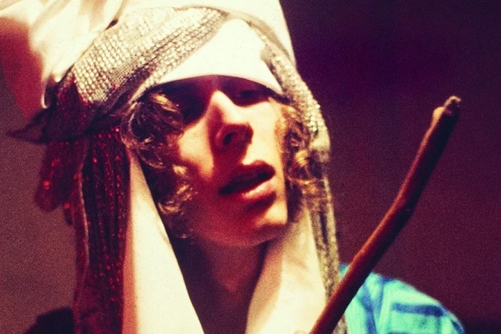
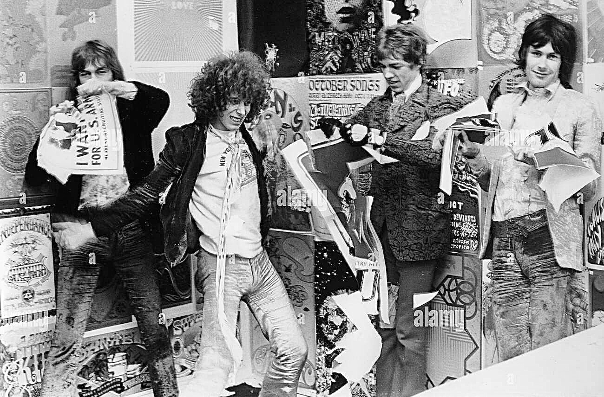
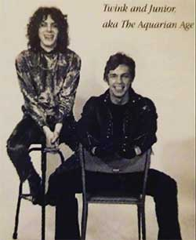
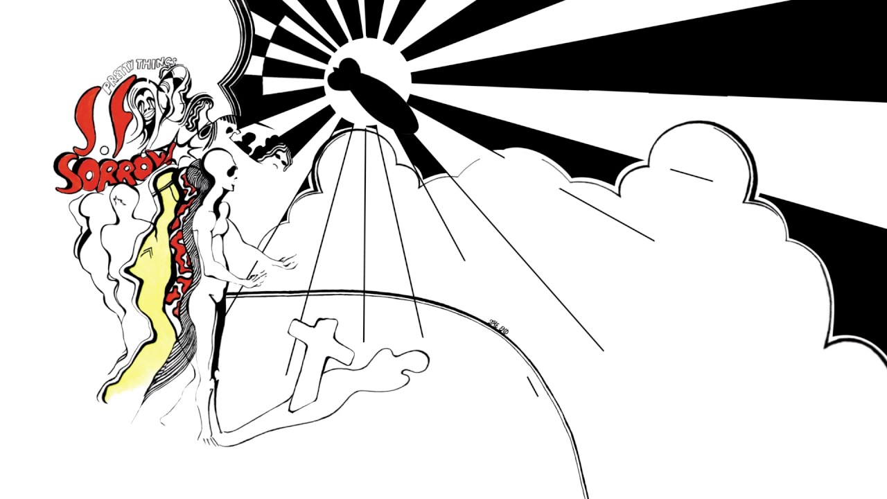
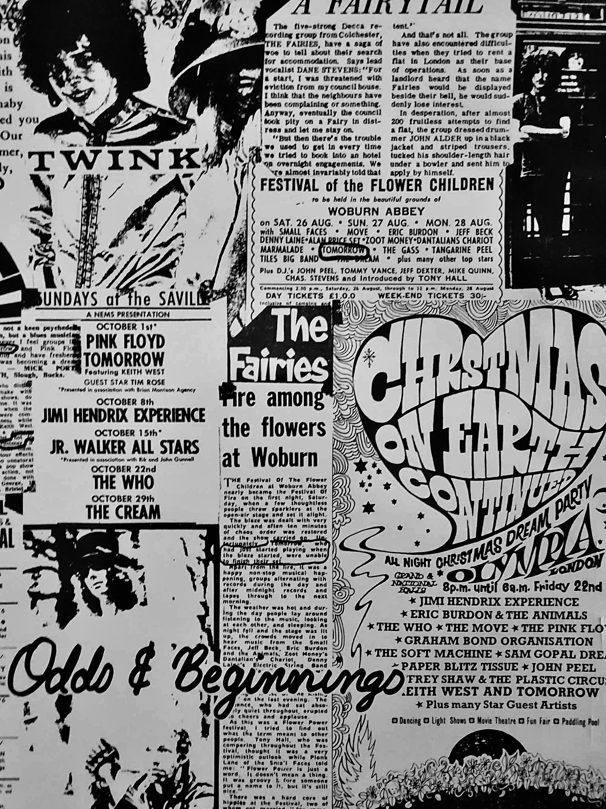

{fig-align="center"}

<em>Personaggio cruciale dell'underground londinese, maestro della psichedelia free form e inventore del misconosciuto acid punk, protagonista di un attivismo musicale di rottura ricco di soluzioni, John Adler/Mohammed Abdullah, più celebrato come Twink, ha suonato, tra gli altri, con Faires, Tomorrow, Aquarian Age, Pretty Things, Pink Fairies, Fallen Angels, Stars, PinkWind, Rings, Plasticland, Technicolor Dream - esperienze, ai più ignote, proprie ad un mondo che per onestà verso la musica intenzionalmente sfugge al music business. A lui la parola (da interviste del</em> [*1985*](https://pfco.neptunepinkfloyd.co.uk/band/interviews/other/othertwink.html), [*2012*](https://www.psychedelicbabymag.com/2012/11/tomorrow-pretty-things-pink-fairies.html), [*2013*](https://www.distorsioni.net/canali/interviste/italianenglish-version-5), [*2014*](https://hit-channel.com/interviewtwink-pink-fairiestomorrowthe-pretty-thingsstars-66892/#google_vignette), [*2021*](https://psychedelicscene.com/2021/12/12/interview-twink/)<em>, e da altre sue</em> [*testimonianze*](https://members.tripod.com/pink_fairies/index.html)),<em> e a seguire un'attenta ricostruzione del suo lungo, vario e sorprendente percorso.</em>

<em>«Quando ero con Faires nel 1964/65 i nostri fan scozzesi mi mandavano Twink Home Perm (la lozione preferita di Eric Clapton) perché avevo i capelli molto ricci. Era una battuta un po' divertente. I compagni della band hanno iniziato a chiamarmi Twink e il soprannome mi è rimasto! Nel 1967 con i Tomorrow abbiamo suonato sugli stessi palchi di Pink Floyd, Soft Machine, Jimi Hendrix Experience e molte altre grandi band dell'epoca. My White Bycicle era ispirata al movimento anarchico olandese dei Provos, che avevano creato un sistema di scambio di biciclette che potevi predere e lasciare dove volevi. Le cose stavano cambiando rapidamente. Ci siamo divertiti molto per il breve periodo in cui la band durò. Penso che Steve Howe sia un talento raro e straordinario. Le nostre influenze erano principalmente indiane. Era sempre una sorpresa con noi. Abbiamo suonato all'Ufo Club, al Saville Theatre, al 14 Hour Technicolor Dream, al Christmas On. Abbiamo anche lavorato al film Blow Up di Antonioni. Dopo, entrai nei Pretty Things programmando di restare solo per un mese per aiutarli a finire S.F. Sorrow, ma alla fine sono rimasto per un anno e mezzo. Ci esibimmo a Hyde Park il 27 luglio 1968. Phil, Dick, John e Wally erano straordinari come al solito. A un certo punto, sono salito in cima agli altoparlanti per tuffarmi sul pubblico che rimase sbalordito. Portammo un livello di psichedelia mai visto prima. Fu un periodo stupendo, quello con i Pretties e poi con i Pink Fairies. Originariamente i Pink Fairies erano un piccolo club di bevitori. La nostra visione culturale era semplicemente quella di condividere gratuitamente il nostro dono con chi ritenevamo che in quel momento la meritasse. Eravamo contrari all'enorme commercializzazione della musica da parte del music business. Credevamo che la musica dovesse essere gratuita. È davvero irrealistico in questo mondo di follia finanziaria, ma abbiamo cercato di bilanciare le due facce della medaglia e rendere il mondo un posto migliore. Ci sentivamo parte di una rivoluzione, che per certi versi continua ancora oggi.</em>

<em>Il concetto originale di Think Pink era quello di creare una serie di ritratti sonori molto psichedelici che avrebbero trasportato la mente dell'ascoltatore in altri luoghi. All'epoca del disco ero molto influenzato dal lavoro del Living Theatre. In The Coming of the Other One dei versi di Nostradamus raccontano su un paesaggio di suoni il Giorno del Giudizio: Gesù, la pace sia su di lui, tornerà e tutti coloro che sono stati sepolti risorgeranno dalle tombe per incontrare il loro Creatore. Dawn of Magic è un ritratto della Terra appena prima che Adamo, la pace sia su di lui, ed Eva, la pace sia su di lei, precipitassero dal Paradiso seguiti dal diavolo. Suicide risale 1966 ed lè stata a prima canzone che ho scritto, non ho mai pensato al suicidio ma mi sembrava un argomento interessante. Ho poi suonato con The Last Minute Put Together Boogie Band e Syd Barrett è venuto a suonare con noi un paio di volte, così come Fred Frith. Syd, Jack Monck e io abbiamo deciso di mettere insieme una band e l'abbiamo chiamata Stars. Syd stava bene, ed era ancora determinato a suonare. Non era più strano o fuori di testa di chiunque altro avessi intorno in quei tempi, e si lavorava perfettamente con lui e Jack. Syd suonava bene ed era sempre puntuale alle prove. Era il suo ultimo giro e lui era ansioso di suonare. Sono stati registrati tutti i concerti. Ho sempre detto che la "follia" di Syd è stata sopravvalutata e continuo a crederci. E poi, boom, un giornalista idiota che voleva fare il Kingpin, lo recensisce negativamente. Penso fosse Roy Hollingworth del Melody Maker, ha fatto un pezzo e ha ucciso la band. Syd viene a casa mia con la pubblicazione tra le mani e, riferendosi alla recensione, dice: "Twink, non voglio più suonare". Pensavo fosse possibile che accadesse qualcosa del genere, tuttavia è stato un peccato che sia successo.</em>

<em>Non ho mai pensato esistesse una connessione tra gli anni Sessanta della psichedelia e i Settanta del punk, a parte i manager e le case discografiche. Il business era rimasto lo stesso. Credo che il punk rock avesse ben poco a che fare con la musica e non fosse altro che un’invenzione del marketing. In compenso erano cambiate le droghe, si era passati da sostanze benigne come l’hashish e gli psichedelici a roba pesante come eroina, cocaina e speed. La differenza era tutta lì. Mi sono fatto trasportare anch’io da questa "nuova onda", finché non ho capito che era un vicolo cieco. Mi sono comunque divertito a incidere qualche singolo, I Wanna Be Free a nome The Rings, Do It 77/Psychedelic Punkeroo, brano questo dedicato a Barrett. Nel 1988 sono andato negli Usa e ho registrato un singolo e un live con i Plasticland. Tempo dopo, a Marrakesh, ho registrato con Sheikh Mohammed alcune canzoni che ho scritto solo per voce e batteria, tutti gli strumenti richiesti saranno imitati dalla voce. Abbiamo inoltre lavorato alle traduzioni del Corano e degli Hadith. A Roma ho registrato con i Technicolour Dream. Un progetto per me davvero molto speciale, che ho sentito come una continuazione di dove ero rimasto nel 1971, dopo aver registrato Never Neverland con i Pink Fairies.</em>

<em>Ho abbracciato l’Islam nel 2006, dopo che per tutta la vita aveva cercato un modo per esprimere la mia gratitudine a uno spirito superiore, che oggi riconosco in Allah. Gratitudine per tutte le meraviglie che questo mondo ci offre, e di cui possiamo godere liberamente. Non credo ci sia un filo che lega passato e presente, ognuno è libero in ogni momento della sua esistenza di fare delle scelte e cambiare percorso. Ora vivo a Marrakech con mia moglie marocchina e la nostra bambina Sara. Sto scrivendo la mia autobiografia, che è un sacco di lavoro, ma sta venendo fuori bene. Fate i bravi.»</em>



## Twink, nato John Adler e diventato Mohammed Abdullah

Le vicende della musica rock inglese hanno spesso nascosto o messo da parte i personaggi che non rientravano nella trattazione classica, quelli che esulavano dai generi o se ne mantenevano ai margini. Nel racconto emerge sempre un susseguirsi di eventi che sembra stritolare le personalità contrastanti e fluttuanti. Eppure, il nostro Twink (all’anagrafe John Charles Edward Adler), magistrale batterista, cantante, attore, si è trovato nel corso della storia al posto giusto e nel momento giusto, niente da dire su questo. Nella Swingin' London e nella Londra del punk, all'Ufo club come a Ladbroke Grove o tra le fila della Chiswick Records, la prima indie label in ambito punk. È stato l’ultimo hippy e allo stesso tempo un punk ante litteram, ma tutto questo invece che portargli gloria ha finito per lasciarlo ai margini, forse volutamente.

{fig-align="center"}

Batterista dei Tomorrow, mitico gruppo psichedelico con lo Steve Howe dei futuri Yes nelle fila, artefici di due fra i più popolari singoli della Londra Underground del 1967, My *White Bycicle* e *Revolution*, e di un omonimo Lp, Twink poi approda in un’altra grande band della Londra alternativa, i Pretty Things. Ma prima di approdare nel gruppo di Phil May e Dick Taylor forma un duo con l’ex bassista dei Tomorrow John "Junior" Wood chiamato The Aquarian Age e registra un singolo, *10.000 Words In A Cardboard Box/Good Wizard Meets Naughty Wizard*, che poi ritroveremo più avanti nella nostra storia. Ma, come dicevamo, Twink, ormai già famoso nei circuiti alternativi, prende il posto di Skip Alan dietro i tamburi dei Pretty Things e registra con loro uno dei capolavori del rock inglese. *S.F. Sorrow*, pubblicato nel dicembre 1968, è il disco della svolta psichedelica del gruppo basato sulla storia drammatica del protagonista Sebastian F. Sorrow. Primo concept album che anticipa il *Tommy* degli Who, purtroppo per il gruppo non riscuote il successo sperato e questo provoca l’abbandono temporaneo del chitarrista Dick Taylor nel giugno del 1969.



A questo punto Twink, pur essendo formalmente ancora un membro dei Pretty Things, inizia a pensare in proprio e registra alcuni demo insieme al suo vecchio amico John "Junior" Wood e a Steve "Peregrin" Took dei Tyrannosaurus Rex di Marc Bolan. La Sire, un'etichetta discografica americana che aveva pubblicato il disco dei Tomorrow negli States, gli offre la possibilità di registrare un album a suo nome e lui, ovviamente, accetta. Il periodo certo non è lo stesso di qualche anno prima, quando una Londra effervescente era il luogo di residenza privilegiato della sperimentazione in tutte le arti, atmosfere vibranti cariche di creatività e ribellione. La psichedelia è ormai defluita nelle retrovie e una certa aria di riflusso pervade sia la società che ovviamente la musica. Nonostante questo Twink si imbarca in un progetto che tenta, con successo va detto, di tenere in vita quel mix di stravaganza, improvvisazione e visionarietà tipico della musica psichedelica e inizia le registrazioni del suo primo disco solista, *Think Pink*.

{fig-align="center"}

L’elenco dei musicisti che collaborano alla realizzazione del disco è significativo e anticipa anche gli sviluppi futuri della carriera di Twink. Accanto a Wood e Took ci sono membri dei Pretty Things come Phil May, il chitarrista Vic Unitt, il bassista Wally Allen e il tastierista John Povey. E poi il chitarrista Paul "Blackie" Rundolph, il bassista Duncan "Sandy" Sanderson e l'attivista e agitatore culturale Mick Farren, tutti membri dei Deviants, un gruppo garage rock dalle sonorità sperimentali e protopunk, una sorta di Fugs londinesi.

{fig-align="center"}

L'apertura è affidata a *The Coming Of The Other One*, caratterizzata da voci trattate, chitarre e sitar in sottofondo, in un paesaggio psichedelico vicino a Syd Barrett e con frammenti di un poema di Nostradamus sul Giorno del Giudizio. Il secondo brano è quella *Ten Thousand Words In A Cardboard Box* del singolo degli Aquarian Age, qui in una versione più psichedelica, con la chitarra di Paul Rudolph che attraversa tutto il brano e nel finale erompe in un assolo acido, allucinogeno, incalzato dalla movimentata e agile ritmica di Twink e "Junior" Wood. *Dawn Of Magic* è un bordone ipnotico e surreale, un mantra colorato, mentre la successiva *Tiptoe On The Highest Hill* (già nel repertorio degli Aquarian Age) è, probabilmente, l'apice del disco. Una commovente e sognante ballad, con la strabiliante chitarra di Rudolph al contrario, che può benissimo dirsi l'essenza della musica psichedelica. Chiude la prima facciata *Fluid*, un inizio sexy con una voce femminile in estasi e un lungo e piacevole crescendo fino all’esplosione finale caratterizzata dagli accordi di una chitarra estremamente distorta e l’altra impegnata in brevi ricami psichedelici, con i piatti e le rullate di Twink ad esaltare il tutto.



La seconda facciata del disco si apre con *Mexican Grass War*, musica free form elaborata collettivamente in studio, caratterizzata da tamburi di guerra e voci confuse, con la chitarra distorta che trafigge il brano fino ad un parossistico finale. *Rock An' Roll The Joint* è una sorta di hard rock blues, dalle parti di Hendrix, mentre *Suicide* è in puro stile Tomorrow/Pretty Things di S.F.Sorrow, chitarre acustiche, stop and go e la solita atmosfera sognante e fluida. *Three Little Piggies* vede insieme Syd Barrett e Daevid Allen, una buffa filastrocca tipicamente sixties, un divertissement psichedelico. Chiude il disco *The Sparrow Is A Sign*, anch’essa composta in studio ma con un contributo particolare di Steve Took, ed è un anomalo e disorientante rock attraversato, al solito, da una grande lavoro di chitarra di Paul Rudolph.

{fig-align="center"}

Twink e i suoi compagni, con *Think Pink*, elaborano un piccolo capolavoro, certo nei suoni leggermente datato ma assolutamente ancora fresco nell’approccio e nello sviluppo di un linguaggio espansivo e sperimentale. Un disco di autentica musica psichedelica, una miscela di pop, rock e improvvisazione free form, con atmosfere dilatate e suoni eterei, melodie sognanti e stravaganze sonore.



Si tratta di quei lavori unici per certi versi, eccentrici e irripetibili che spesso sono poco conosciuti o apprezzati. Potrebbe essere fatto un parallelo con *The End Of The Game* di Peter Green, tra l’altro uscito nello stesso anno, il 1970, per come viene affrontata la materia musicale, e per il ruolo che riveste l’improvvisazione nella composizione delle musiche, anche se ovviamente il lavoro di Peter Green è innervato completamente di blues.



Come detto, *Think Pink*, con la splendida copertina dello studio Hipgnosis, esce nel 1970 non prima di essere stato rimixato dallo stesso Twink, insieme a Steve Took, perché insoddisfatto del lavoro fatto da Mick Farren, che rivestiva per l’appunto il ruolo di produttore e arrangiatore. Nonostante questi contrasti con il leader dei Deviants, Twink è intenzionato a costituire una nuova band proprio con Mick e Steve Took, una specie di supergruppo composto da ex Pretty Things, Tyrannosaurus Rex e Deviants per l’appunto. È proprio per quest’entusiasmo riguardo il nuovo progetto che il disco solista di Twink praticamente non avrà promozione e verrà dimenticato dallo stesso autore, che lo considererà come una sorta di primo album della nuova formazione, i Pink Fairies.



Dopo un disastroso concerto a Manchester la nuova band finalmente si stabilizza con i vecchi membri dei Deviants Paul Rudolph, Duncan Sunderson, Russell Hunter (una line up con doppia batteria!) ma senza Mick Farren e Steve Took. Il nome deriva da un locale chiamato Pink Fairies Motorcycle Club And All-Star Rock’n’Roll Band e ricorda la prima band di Twink, quei Fairies con i quali aveva registrato tre singoli intorno alla metà degli anni 60 e che si erano sciolti nel 1967.



A questo punto va avviata una riflessione, certamente breve in questo ambito, su quella corrente sotterranea che ha attraversato i sixties e la prima metà degli anni Settanta e che dalla scena psichedelica londinese, l’Ufo club e il 14 Hour Technicolor Dream, arriva dritta al punk. Una serie di musicisti e musiche che rimangono lontane dallo star system e dalle evoluzioni prog, restando fedeli a quell’approccio spontaneo verso la musica, anche scanzonato. Un intreccio di grezzo e sporco rock‘n’roll con suggestioni e sonorità psichedeliche, dilatate. E che si contrappone all’esasperato virtuosismo, all’esibizionismo delle rock star, in un’ottica ancora legata agli ambienti della controcultura attiva e militante, all’underground alternativo che sommuove la società.



Questi musicisti, i Pink Fairies ma anche gli Hawkwind (collaboreranno spesso insieme e daranno vita, ad un certo punto, ad un gruppo dal nome PinkWind), i Deviants di Mick Farren, Steve Cook, Larry Wallis e altri meno noti sono l’anello di congiunzione tra la controcultura dei sixties e la rivoluzione punk, e terranno in vita l’approccio libertario e hippy alla musica e agli eventi intorno ad essa, come festival, concerti e produzione di dischi.

{fig-align="center"}

Da questo punto di vista il disco d’esordio dei Pink Fairies, *Never Never Land*, è significativo. Il brano d’apertura, quella *Do It* uscita anche come singolo (*The Snake/Do It*, gennaio 1971, Polydor), è un graffiante inno alla rivolta e il titolo è ripreso dal libro di Jerry Rubin, l’attivista e politico radicale americano amico di Abbie Hoffman (*Do It! Scenarios Of The Revolution*, uscito nel 1970 e con l’introduzione di Eldridge Cleaver, esponente delle Pantere Nere).



*Do It* è ripubblicato da Twink nel febbraio del 1978, in piena era punk, per la Chiswick Records (*Do It ‘77/Psychedelic Punkeroo/Enter The Diamonds* 12”Ep a nome Twink And The Fairies), ed è poi ripreso nel 1988 dalla band di Henry Rollins, ex frontman dello storico gruppo punk californiano Black Flag.



Tutto il disco dei Pink Fairies è un perfetto alternarsi di energici brani rock e composizioni dilatate, ancorate alla matrice psichedelica. Basterà citare, oltre a *Do It*, gli ultimi due brani di *Never Never Land*: la potente ed estesa *Uncle Harry's Last Freakout*, cavallo di battaglia del gruppo dal vivo, un mix di grezzo e ruvido rock e lunghi assoli che espandono la composizione in una sorta di viaggio spaziale, mentre il finale è uno splendido brano proprio di Twink, *The Dream Is Just Beginning*, delicato ed etereo, che ricorda certe atmosfere del David Crosby di *If I Could Only Remember My Name*. Il disco uscirà per la Polydor nel maggio del 1971 con una copertina dall’aspetto fantasy, curiosamente molto vicina all’estetica prog ma anche alla mitologia del pianeta Gong.



A questo punto i percorsi e le traiettorie si fanno confuse, tra abbandoni, ritorni, nuovi innesti, collaborazioni, discografie frammentarie, fughe in Marocco di Twink. E per quanto lo riguarda, è degno di menzione l’effimero progetto con Syd Barrett e l’ex bassista dei Delivery Jack Monck, il trio Stars, che purtroppo, a parte qualche esibizione dal vivo, non riuscì a registrare nulla per le precarie condizioni di Barrett. Twink partecipa inoltre alle registrazioni di quel bizzarro e folle esperimento di Mick Farren, il suo disco solista *Mona-The Carnivorous Circle* (registrato nel dicembre 1969 e pubblicato nel marzo del 1970), intreccio tra spoken word e stralunato rock, con interviste agli Hell's Angels e la preziosa presenza di Steve Took.



Poi, nel 1975 una reunion con i Pink Fairies in un bel live alla Roundhouse (*Live At The Roundhouse*, edito nel 1982 dalla Big Beat). Tra innumerevoli partecipazioni e collaborazioni si arriva al 1977, in piena era punk e qui troviamo il nostro Adler, in qualità di cantante, tra le fila dei Rings, insieme ad Alan Lee Shaw e Rod Latter degli Adverts. Con questo gruppo registra uno dei primi singoli punk, *I Wanna Be Free*, sempre per la Chiswick Records. Ma il gruppo si scioglie e la carriera di John Charles Adler, da questo punto in poi, si fa estremamente confusa e il suo Acid Punk, come lui aveva definito la sua musica, non avrà seguito.



La storia prosegue sempre più sotterranea, tra registrazioni clandestine e apparizioni come attore in diverse serie televisive inglesi, finché nel 2013 Fabio Porretti e Marco Conti, i Technicolour Dream, uno dei primi gruppi italiani neo psichedelici degli anni 80, tramite Facebook contattano Twink, nel frattempo convertitosi alla religione islamica e con il nuovo nome Mohammed Abdullah. Con lui, e con Brian Godding ex chitarrista dei Blossom Toes, registrano *You Reached The Stars* (al Gulliver Master di Roma e missaggio agli Abbey Road Studios di Londra) seguito poi da *Think Pink II*, con la partecipazione di John Povey dei Pretty Things (mixato da John "Junior" Wood!) e da *Sympathy For The Beast*, sempre con Povey.



Tre dischi che riportano in superficie quelle sonorità psichedeliche fatte di melodie estatiche e atmosfere dilatate nel tempo e nello spazio. Come si può facilmente notare, il nostro non ha certo perso la voglia di suonare e di rimanere nell’underground, fedele alla sua storia e alla sua estetica di hippy senza tempo. E c’è ancora spazio per il terzo e quarto capitolo del suo capolavoro, un *Think Pink III* assolutamente barrettiano, elettroacustico e sognante, mentre il *Think Pink IV* accarezza il cosmo e lo space rock tra Hawkwind e Gong, senza far mancare l’energia delle chitarre distorte alla maniera punk. Ancora tanta musica, ancora quella voce evocativa che si perde nei meandri dello spazio, quel suono sconfinato, etereo, incantato.



Riannodando i fili possiamo notare come questo musicista, ai più sconosciuto, sia stato presente in alcuni album di culto della storia del rock, *Tomorrow* dell’omonimo gruppo, *S.F. Sorrow* dei Pretty Things e *Never Never Land* dei Pink Fairies, e in più abbia scritto pagine memorabili a suo nome, come per l’appunto *Think Pink*. Ma Twink rappresenta quel mondo che ha avuto il suo momento di gloria nella Londra della seconda metà degli anni 60, dove psichedelia, improvvisazione, pop, rock, blues e sperimentazioni varie ribollivano in un unico calderone, dando vita a musiche affatto straordinarie. Un periodo irripetibile che John Charles Adler, insieme a pochi altri, ha tentato di tenere vivo fino all’avvento del punk, trovando in questa ennesima rivoluzione musicale, seppur parzialmente, alcune caratteristiche che lo hanno sempre contraddistinto, prima fra tutte la voglia di suonare liberi, senza far troppo caso alla tecnica o al virtuosismo.



## Discografia ragionata

Tomorrow, *Tomorrow*, Parlophone Records/Sire 1968.

Pretty Things, *S.F. Sorrow*, Columbia 1968.

Twink, *Think Pink*, Sire 1970.

Mick Farren, *Mona–The Carnivorous Circus*, Transatlantic Records 1970.

Pink Fairies, *Never Never Land*, Polydor 1971.

Elton Motello, *Victims Of Time*, Pinball 1978.

Pink Fairies, *Live At The Roundhouse*, Big Beat 1982.

Twink, *Apocalipstic*, Twink Records 1986.

Pink Fairies, *Kill'Em And Eat 'Em*, Demon Records 1987.

Twink, *Mr Rainbow*, Twink Records 1990.

Bevis & Twink, *Magic Eyes*, Woronzow 1990.

Twink, *Odds & Beginnings*, Twink Records 1991.

Mouse & Twink, *Out Of The Pink Into The Blues*, HTD Records 1995.

Twink, *The Never Never Land and Think Pink Demos*, Get Back 2000.

Twink & The Technicolour Dream, *You Reached For The Stars*, Sunbeam Records 2013.

Last Minute Put Together Boogie Band (with Syd Barrett and Fred Frith), *Six Hour Technicolour Dream Cambridge 1972*, Easy Action 2014.

Twink & The Technicolour Dream, *Think Pink II*, Sunbeam Records 2015.

Star Sponge Vision, *Crowley and Me,* Mega Dodo 2018.

Twink, *Think Pink III*, thinkpink50th.com 2018.

Twink & The Technicolour Dream, *Sympathy for the Beast: Songs from the Poems of Aleister Crowley*, Sunbeam Records 2019.

Twink, *Moths & Locusts. Think Pink IV*, Noiseagonymayhem Records 2019.

## [Podcast](https://thestrangebrew.co.uk/wp-content/uploads/2019/05/twink.mp3)

1.  Twink, *Brand New Morning* (Single A-side, Brand New Morning 2019).

2.  The Pretty Things, *You Don’t Believe Me* (*Get The Picture?*, Fontana 1965).

3.  Tomorrow, *My White Bicycle* (Single A-side, Parlophone 1967).

4.  The Aquarian Age, *10.000 Words In A Cardboard Box* (Single A-side, Parlophone 1968).

5.  The Pretty Things, *She Said Good Morning* *(S.F Sorrow*, Columbia 1968).

6.  Twink, *Tiptoe On The Highest Hill* (*Think Pink*, Polydor,1970).

7.  Pink Fairies, *Do It* (Single B-side to *The Snake*, Polydor 1971).

8.  The Last Minute Put Together Boogie Band featuring Syd Barrett, *Number Nine - Live at the Cambridge Corn Exchange January 27th 1972* (*Six Hour Technicolour Dream*, Easy Action 2014).

9.  The Rings, *I Wanna Be Free* (Single A-side, Chiswick 1977).

10. Bevis & Twink, *Jissom Analogy* (*Odds & Beginnings*, Twink Records 1991).

11. Twink & The Technicolour Dream, *Animal Man* (*Think Pink II*, Sunbeam 2015).

12. Twink & the Technicolour Dream featuring Jon Povey, *The Vampire - from Clouds without Water* (*Sympathy for the Beast: Songs from the Poems of Aleister Crowley*, Sunbeam 2019).

{fig-align="center"}

Pubblicato come *Twink, the pink drummer. Le avventure di un batterista underground tra psichedelia e punk* su «Prog Italia» n. 31, 2020.
