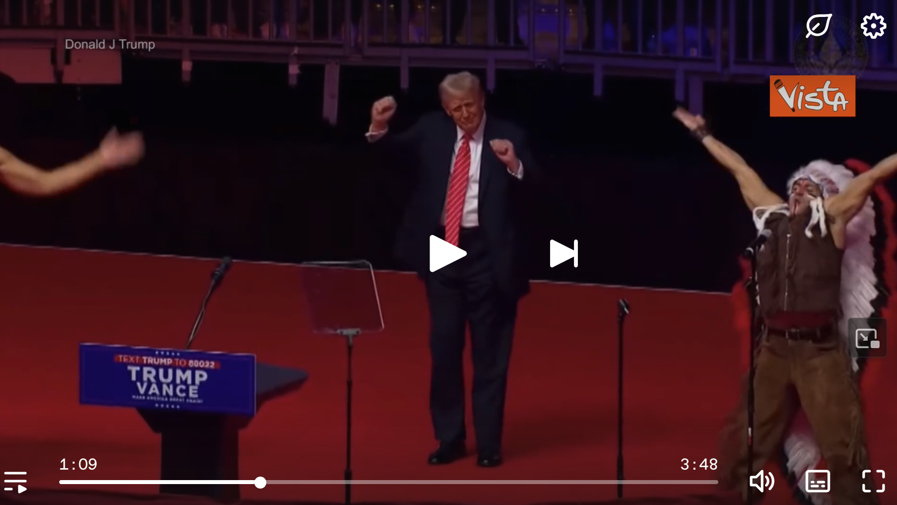

[{fig-align="center"}](https://dai.ly/x9cojte)

*Fratture e cambiamenti nel cuore dell'Impero Occidentale. Oltre il clamore mediatico, uno sguardo sul secondo mandato di Trump alla Casa Bianca al suo annunciarsi. Ripercussioni prevedibili e problematiche inevitabili. I saluti romani alla folla e i balletti con i Village People.*

## 1. Il discorso dell'insediamento

Fratture e cambiamenti nel cuore dell'Impero Occidentale. Oltre il clamore mediatico, analizziamo senza pregiudizi: tanto, la situazione faceva schifo pure prima, quanto è interessante è che all'interno si stiano introducendo distinzioni. Tali distinzioni comportano la complicazione dei conflitti in corso, ed è quantomeno opportuno evitare battaglie sbagliate e militanze low-cost. Soprattutto, è necessario recuperare prospettiva storica e lavoro sulle idee. E dove la sinistra ormai svenduta al capitale sembra esistere perlopiù come macchietta tecno-finanziaria, e la destra che ancora lo incarna rimane impresentabile per quanto tecno-plebiscitaria, non si tratta di identificarsi con una parte o l'altra delle oligarchie in competizione. Siamo ormai già oltre gli attuali feticci a cui sono ridotti democrazia e progresso, non servono a nulla piagnistei ed esaltazioni: piuttosto, si tratta di osservare la struttura complessiva e descriverne la, per così dire, evoluzione.

La situazione peggiorerà ancora, darsi risposte sulle soluzioni aiuterà a trovarle. Possiamo cominciare a farlo proprio a partire dalle discontinuità e dai vuoti che si sono introdotti.

Ci farà da guida il discorso dell'insediamento di Trump e, al di là della sua retorica, e del fatto che forse per fretta è mancato il giuramento sulla Bibbia, lo useremo come chiave, insieme a quale breve incursione sulla composizione del nuovo governo, per penetrare in problematiche sulle quali la pubblica ottusità si costringe spesso al silenzio. Lo faremo, anche se a molti a ragionare infastidisce, oltre i recinti decisi delle contrapposizioni che mantengono il potere fermo nelle sue assurdità e la popolazione mondiale nella propria impotenza. Lo scombinamento del puzzle del vecchio ordine globale potrebbe sconvolgere ogni disegno già conosciuto, così come la composizione del voto ha spaccato ogni Stato dell'Unione, e non saranno certo le piagnucolose puttanate dei benpensanti a farci comprendere dove piazzare i tasselli.

Quanto serve, se le nostre parole significano qualcosa, è porsi di fronte alla situazione e farsi carico della propria irriducibilità fino a quanto ha di più universale e auspicare la vittoria dell'interesse comune - e, magari, andarlo pure a cercare, tale interesse, e se non c'è più, inventarselo di nuovo.

**Capitol Hill**. La grazia ai fan del presidente era scontata. Procederà davvero nei confronti di leader della manifestazione che fino ad adesso non sono stati neanche indagati? Rispetto alla punibilità di assaltare le istituzioni si è comunque introdotta incertezza: potremmo quindi tutti fare altrettanto con il comune, le circoscrizioni, e tutti gli altri palazzi del potere che così malamente ci rappresentano?

**Accordi di Parigi**. È davvero sostenibile e veritiera la visione finora prevalente rispetto al cambiamento climatico? Sono realmente risolutive le soluzioni sinora approntate? Quali altri parametri considerare, al netto dell'inquinamento derivato dall'antropizzazione, che non cambierà grazie ai dogmi dell'ambientalismo facilone? Come sarà possibile riportare equilibrio nell'economia e nell'ecosistema? Quali le distinzioni operanti in ogni specifica zona del pianeta? Le politiche ambientali troveranno una soluzione che non sia la produzione esclusiva di auto elettriche e l'impostura dei feticci greenwashing?

**Uscire dall’Oms**. L’organizzazione, che resta un insieme non omogeneo e spesso pieno di contrasti interni, non sembra aver garantito alcunché se non le multinazionali del farmaco e della malattia, e proprio il Covid lo ha dimostrato. Tale disposizione si accompagna al pieno reintegro dei dipendenti federali e dei militari a suo tempo sospesi per aver rifiutato il vaccino. Il segretario alla sanità Kennedy già si è opposto alla lobby farmaceutica. Ciò si intreccia con la grazia concessa da Biden nei confronti di Fauci, che può condurre a gravi omissioni di giustizia. Quali conseguenze può portare tutto ciò nel resto del mondo? L'uscita dall'Oms può davvero ritardare la ricerca scientifica? Oppure, è in grado di porre un freno alla già invasiva medicalizzazione? Come procederanno le indagini sui reati di potere connessi alla gestione della pandemia? Un mondo di malati per forza è per davvero l'unica utopia che ci resta? E per davvero rischiamo che l’assistenza sanitaria resti roba per ricchi, e che gli altri si sbrighino a morire?

**Gender e dintorni**. Pur ammettendo infinite gradazioni e sfumature, come è stato possibile credere che esistessero più di due sessi, e al contempo annullare le loro stesse peculiarità? E anche accettando che il genere sia l'aspetto culturale che completi il sesso biologico, perché dovrebbero necessariamente entrare in contrasto, invece di completarsi e arricchirsi reciprocamente? Considerare il corpo come cosa manipolabile a capriccio è stato un buon affare per la bioingegneria e la medicina estetica: lo è anche per l'umanità? E con quali conseguenze sulla psiche individuale, sui rapporti personali, sulla società complessiva? Dove un gay dichiarato come Scott Bennet è stato nominato segretario del Tesoro, possiamo auspicare che finirà il paradossale stupro woke del linguaggio e della cultura e la ridicola ipocrisia della riscrittura dei classici e della cancel colture, senza che ciò comporti nuovi privilegi o nuove persecuzioni sulla base di varianti di comportamento quali quelle omosessuali?

**Migrazioni e crimine**. Ai tempi delle colonie abbiamo depredato ampia parte del mondo di risorse preziose, gli affari oggi continuano con terre rare e semiconduttori. In uno slancio di apparente generosità, i Paesi occidentali concedono ai migranti il permessodi venire a rovistare nei cassonetti dei rifiuti; qualcuno di questi preferisce dedicarsi al crimine, e trova anche in questo ampie complicità. Lo squilibrio esistente va certamente sanato con una politica e un'economia diverse, a livello internazionale perseguita da Cina e Russia con la realizzazione di infrastrutture nei Paesi che l'Occidente ha prima reso poveri per poi rubare da loro persino la povertà. Verrà sottratta l'immigrazione alle nuove e vecchie forme di sfruttamento, con rispetto delle persone, dei Paesi e delle culture? E per noi, è ancora tollerabile che le nostre città siano diventate buone piazze per fare elemosina, senza prospettive vere di lavoro, cultura e integrazione per nessuno, nemmeno per noi? È possibile ammettere nei nostri stati e nei nostri schermi file di persone incatenate pronte ad essere deportate?

**Ucraina, Gaza e altri fronti**: «*Il nostro successo non si misurerà solo in base alle battaglie che vinceremo, ma anche in base alle guerre a cui porremo fine e, forse ancor più importante, alle guerre nelle quali non parteciperemo mai.*» Al di là di queste parole, che significativamente riconoscono che la vera forza è quella trattenuta, Trump porterà fuori gli USA e il mondo dal pantano delle guerre infinite, e lo farà anche contro gli interessi di Israele, oppure persevererà nel massacro dei palestinesi nel sostanziale disinteresse della cosidetta comunità internazionale? Come affrontare una ridefinizione «*realistica*» del conflitto Ucraino, come dice il segretario di stato Marco Rubio, dopo la distruttiva orgia di armi, denaro e comunicazione di cui è stato oggetto? Come gestire i rapporti con Taiwan e con la Cina? Come regolarsi con fenomeni espansionisti e aggressivi quali i jihadisti, non interpretabili secondo uno schema terzomondista, e che però a più di vent'anni dalle Torri gemelle ancora si pretende di manipolare in un modo o nell’altro, pur senza capire e senza voler capire nulla del mondo musulmano? Laddove anche l’aereospaziale è una forma di conquista, è così necessario ampliare i territori fino a Marte, che peraltro non è in condizione di fare affari così come la Groenlandia, dominio danese e serbatoio di risorse su cui ha mire anche la Cina? E dato che anche i dazi sono una forma di guerra, come si intreccerà la competizione nei confronti del Canada con gli accordi di questo con l'Unione Europea? E come si metterà con la stessa Unione Europea, che va a rimorchio degli USA riducendosi a mercato per le multinazionali senza nessuna capacità di stabilire un proprio orizzonte plausibile? E a cosa si riferisce il presidente quando dice che impedirà "esperimenti sociali" sui soldati?

**Intelligenza artificiale e digitale**. Qui la continuità con le politiche precedenti è netta, e all'incoronazione di Trump non mancava nessuno di quelli che contano. Ma come verrà gestita la competizione interna con Musk, capo del dipartimento per l'Efficienza del governo, che proprio sulla IA, nonché sul green, sembra indirizzato su obiettivi diversi? E dove il digitale non è una scelta ma costituisce la nostra realtà, dovremmo necessariamente continuare a sottostare al saccheggio dei nostri dati e delle nostre vite per favorirne i profitti? In un'epoca di menomazione dell’umano, verrà messo un argine ad un transumanesimo che sembra menomarlo sempre di più?

**Note di colore**. Musk ha fatto un saluto romano, non cambia che sia autistico: lo erano anche i fascisti, che di Roma hanno capito molto poco. E il saluto romano i romani non lo praticavano, nasce nella pittura di David, si trasmette al cinema, i fascisti lo ufficializzano con il Regio decreto del 27 novembre 1925 e in tal modo sostituire la poco igienica stretta di mano; negli USA c’era un saluto alla bandiera molto simile, sostituito nel 1942 da Roosevelt con il gesto della mano sul cuore. Per accontentare tutti, Musk si è toccato il cuore e ha alzato il braccio sulla folla: il saluto alle plebi osannanti lo fanno tutti i leader, non sarebbero tali sennò. Come già aveva compreso Pasolini, il nuovo fascismo dei cosiddetti democratici sa essere il peggiore: ti impedisce proprio di pensare, e non pensare a livelli di società di massa porta a danni maggiori dell'olocausto.

## 2. L'agenda della Nuova Destra

Ogni previsione verrà prontamente disattesa: non per questo si può fare a meno di descrivere la situazione al suo grado di calore massimo. Pertanto, partiamo da dove la temperatura è più rovente. La rottura dello stallo distruttivo tra Israele e Palestina potrebbe permettere due conseguenze. Primo, rianimare la società ebraica, forzata al consenso a Nethaniau dalla guerra: non scordiamo che l'inizio di questa nuova ondata è stato favorito dalla flessione della intelligence dovuta agli scioperi contro la riforma della giustizia. Secondo, costringere l'Umma musulmana alla responsabilità verso la Palestina e la sua popolazione: della quale sostanzialmente non è mai interessato niente a nessuno se non per opporsi genericamente a Israele.

Per quanto riguarda pesi e contrappesi dell'area, non saranno sufficienti le parole di Trump per rassicurare l'Iran dell'obbligo si rinunciare al nucleare laddove resta costantemente sotto attacco interno ed esterno. L'Arabia Saudita ha ricevuto una provocazione inaudita e meritata perché la difesa di Gaza sarebbe un dovere per chi detiene i luoghi sacri. La Turchia non può non sentirsi sollecitata a prendere un ruolo ancora più netto, autonomo e di dominio. A decidere saranno i rapporti reciproci tra Paesi, che potrebbero comune rinsaldare un equilibrio di interesse reciproco.

A livello interno, la riconversione politica che può effettuare Trump rispetto agli assetti di potere della globalizzazione, il vecchio e sempre disgraziato apparato militare-industriale e le noiosissime vittimistissime false opposizioni comprese, viene certamente ammorbidita dal mantenere un ruolo guida al capitalismo digitale e ad un transumanesimo che sembra produrre subumani. In ampia parte ciò rappresenta uno *zeitgeist* inevitabile e nemmeno soltanto negli USA, e comunque su questa terra niente è eterno, e non può certo esserlo la pretesa di ibernarsi, trasferire la mentre su pen drive, o roba del genere.

Altro paradosso a favore è che la stessa impostazione repubblicana, già più isolazionista di quella democratica, potrebbe incrementare ancora di più, svincolando il resto del mondo dall'eccessivo controllo americano. Le decisioni americane inevitabilmente creeranno interferenze con la nomenclatura europea, ormai ucrainizzata proprio nel senso di fortemente marginalizzata e ingombra di macerie per quanto in maniera morbosa e mistificatoria sempre al centro della scena. In ogni più piccola contrada, legata mani e piedi agli interessi messi prevalente degli ultimi decenni, quelli che provocano crolli senza fine ai quali poi lasciano appeso tutto il mondo.

Per comprendere come potranno integrarsi le diverse pulsioni della nuova amministrazione statunitense, è indicativo fare riferimento alle [posizioni del vice JD Vance](https://www.politico.com/news/magazine/2024/09/13/jd-vance-new-right-political-movement-00177203), inizialmente critico verso Trump, che portano a convergenza il populismo nazionalista con il conservatorismo cattolico, secondo un'agenda di Nuova Destra definita già da tempo. I suoi referenti principali sono tre. Patrick Deneen, accademico a Notre Dame nell'Indiana e teorico della crisi del liberalismo; Curtis Yarvin, filosofo blogger fondatore del movimento antiegualitario e antidemocratico Dark Enlightenment che rigetta il modernismo per esaltare l'assolutismo; Peter Thiel, imprenditore di vnture capital che ha fondato il servizio di pagamento online PayPal.

Osserviamo nel dettaglio le loro posizioni. Deneen intende promuovere un nuovo protezionismo statale dell'economia dopo l'autodistruzione del neo-liberismo promulgato dalle élite progressiste, limitare l'aborto e le politiche LGBT e introdurre un welfare per famiglie tradizionali. Per Yarvin, dove la democrazia ha già fallito producendo oligarchie di corrotti, vanno introdotte forme propriamente dittatoriali come quelle dei CEO all'opera sulle star-up nonché strutture di potere ispirate alla mitologia del Signore degli Anelli. Thiel, omosessuale e conservatore libertario, ha il metodo di investire in persone intelligenti che sappiano risolvere problemi difficili, con lo scopo abbattere lo stato centralizzato favorendo un anarco-capitalismo governanto esclusivamente dal mercato e dalla competizione sociale.

Dove la stessa amministrazione americana non sembra operare con piena coerenza e con consapevolezza appropriata, ogni previsione è un azzardo; ed è un azzardo anche immaginare un fronte alternativo, laddove è assente a livello planetario qualcosa o qualcuno che possa raccogliere e dirigere un movimento di qualche tipo. La situazione è tale anche per troppi idioti che, interessati o meno, straparlano di cose che ignorano: il problema è pure la culturetta del protagonismo a tutti i costi e il falso attivismo da tifoseria degli sciacalli e dei coglioni.

Il punto è che, dal Covid in poi, se il potere costruito sembra essere indiscutibile, trova più consistenza né un popolo, né tantomeno una sua coscienza, e non sembra che in nessun modo nessuno senta nessun'altro. A maggior ragione, andare avanti, dire e fare quanto serve, auspicando che, mentre cambia la cornice, cambi anche il quadro e la rappresentazione generale. E che lo faccia anche in fretta, permettendo fermenti *altri*, irriducibili tanto al vecchio potere quanto a quello nuovo.

## 3. I castelli di carte delle civiltà

Quanto è certo è che sul fronte occidentale, dopo i fantastici giorni del Covid, ci si può illudere soltanto a proprio rischio e pericolo. In Europa le reazioni alle iniziativa di Trump perseveranno nello schema ormai sclerotizzatosi, rivendicando l'inutilità di nazioni che erano più integrate ai tempi del loro continuo conflitto. Un popolo non esiste più e ognuno fa principato a sé, rivendicando fiero la propria irrilevanza spesso contraddicendosi apertamente; la fuga verso l'autoritarismo è rigidamente ambidestra, spietata e senza scampo e coinvolge ogni schieramento. La cosiddetta cultura è ormai una parola che serve soltanto a non dire niente, il suo criterio di legittimazione è l'inaninità di ciò che sostiene, la ripetizione del banale e il non turbare in nessun modo gli equilibri esistenti, e mai è stata così goffa, maldestra e sinistra.

L'opposizione esiste, ma è puramente verbale, e del tutto impotente. Indubbiamente, piace a tutti lamentarsi del potere, e sono a disposizione strumenti potentissimi per contestarlo, ma tutto si risolve in uno stupido vezzo completamente inutile. Non soltanto la popolazione è impotente. La stessa politica soffre di una sorta di malattia autoimmune che rende labile ogni suo più stringente processo decisionale, e nessun ciclo si compie. Ad una fase progressista presuntuosa e petulante, risoltasi in irresolutezza perlopiù per proprie contraddizioni e incapacità e per la vanità del suo argomentare, segue una fase conservatrice arrogante, dirompente senza ancora aver sortito effetti concreti, controversa al punto di venir vanificata anche in sedi istituzionali internazionali prima di venir compresa. Il dissidio tra le insanabili fratture interne e la forzata egemonia mondiale di un Paese che ha perso guida anche di se stesso si estende al mondo intero, e porterà ancora più follia ad una democrazia che si esaurisce in contorsioni e incompiutezze e, comunque vada, in mezzo ai cocci resteremo.

Decenni di terrorismo mediatico hanno dissolto persino se stessi, la perdita di legittimità ed efficacia degli strumenti si accompagna alla vanificazione di ogni possibile discorso. L'immagine del mondo si scompone in tessere che non coincidono. Civiltà crollano addosso l'una all'altra in castelli di carte e troppe ne mancano al mazzo. Nessuno ha ragione, nessuno ne troverà. I sessi rimangono due e l'Ucraina riceve quanto merita; Gaza non ha bisogno di villaggi turistici e andare su Marte non migliorerà il pianeta. Le moltitudini si gettano noncuranti nella fornace e il dio della salvezza non è il loro. Inutili parole scorrono come sangue a fiumi e a nessuno frega un cazzo di niente.

Ad ogni modo, mentre in troppi si atteggiano a fan di schieramenti contrapposti chiamati destra e sinistra che non corrispondono più a quanto avevamo conosciuto con tale nome e ormai del tutto fantasiosi, la realtà va avanti per conto proprio fregandosene di tante chiacchiere e ogni socialismo possibile cede il passo alla barbarie più assurda. E intanto, il tycoon sudafricano gioca al piccolo duce e il neopresidente balla con i Village People.
