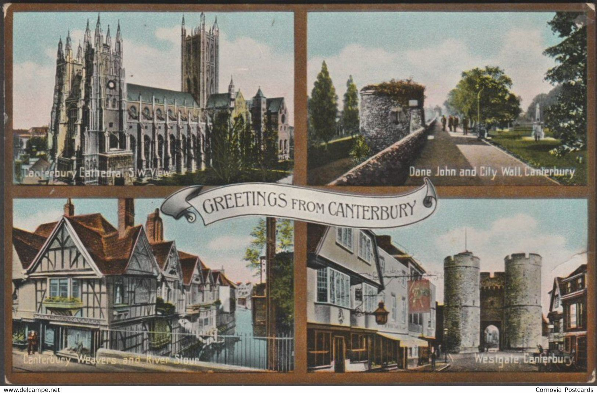
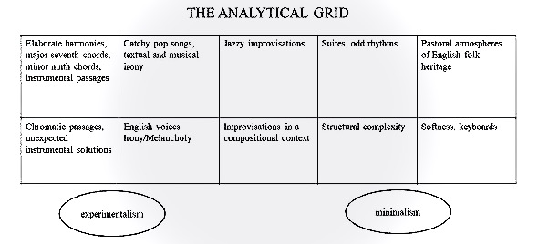
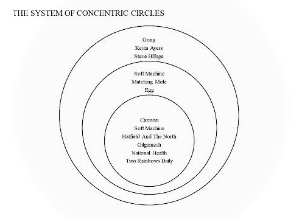
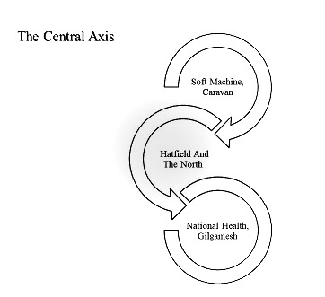
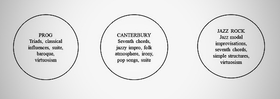
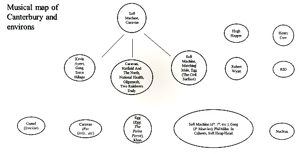
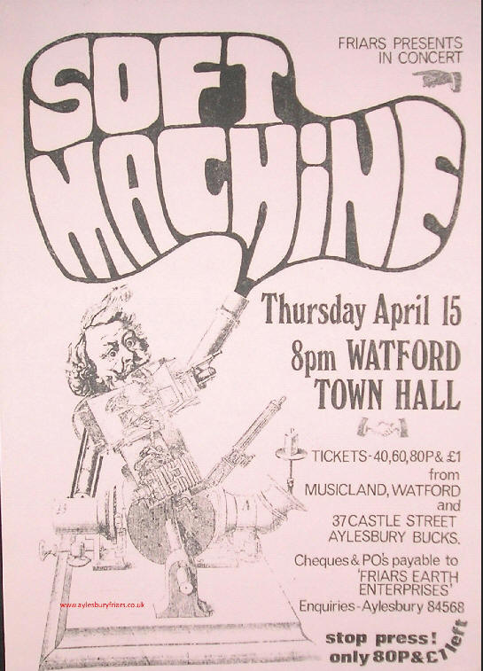
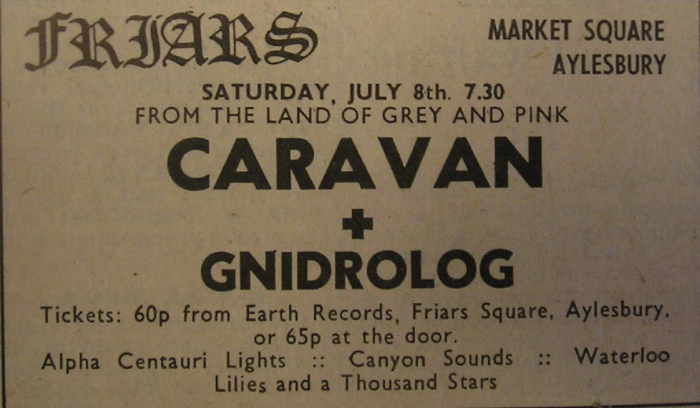

{fig-align="center"}

*Un'escursione analitica nella "musica di Canterbury", terra di mezzo tra prog e jazz-rock.* *Cosa ne caratterizza le peculiarità e ne definisce lo sviluppo, e come può venir distinta in diverse cerchie.*

## 1. Canterbury e dintorni

La definizione di "*scena di Canterbury*" è sempre stata fonte di discussioni sia tra gli addetti ai lavori che tra gli stessi appassionati. L'estrema eterogeneità delle musiche solitamente definite canterburiane ha provocato un senso di indeterminatezza, di ambiguità nel cercare di chiarire quali fossero le caratteristiche della scuola di Canterbury o, addirittura, di affermare l'esistenza della stessa. Eppure, molti di noi sono in grado, istintivamente, di riconoscere un particolare tipo di musica, di composizione, come *materiale canterburiano*, indipendentemente da chi sia il gruppo o il musicista che si ascolta. Cosa significa questo? Che esiste un'estetica con caratteristiche particolari che pensiamo, definiamo, riconosciamo come musica di Canterbury.

Prima di addentrarci nella nostra analisi va fatta una distinzione che ci aiuta a focalizzare maggiormente la questione. Quando parliamo di scena di Canterbury facciamo riferimento ad un gruppo di musicisti provenienti, per la maggior parte, da quell’area ai quali successivamente si sono aggiunti ancora altri musicisti, primi fra tutti Phil Miller e Dave Stewart, che a Canterbury non ci sono mai stati. Possiamo certamente definire questa scena anche come una sorta di "*scuola*" di Canterbury, vista l'affinità musicale che i protagonisti condividono. Ma non tutto quello che è stato prodotto dalla scena canterburiana effettivamente corrisponde alla musica di Canterbury. Mentre invece, pur non essendo parte della scena, possiamo trovarci di fronte a musica dalle caratteristiche canterburiane. Un classico esempio è il gruppo italiano Picchio Dal Pozzo, che chiaramente non appartiene a quel giro di musicisti ma suona musica di Canterbury. Va fatta quindi una distinzione tra "*scena*" di Canterbury e "*musica*" di Canterbury, per poterne delineare con maggior precisione i caratteri estetici. Per questo abbiamo adottato una griglia analitica all'interno della quale poter inserire le musiche che realmente costituiscono il *suono di Canterbury*.

{fig-align="center"}

Una volta stabilita la griglia analitica, dobbiamo attenerci al solo prodotto che è in grado di assicurarci una lettura e un'analisi il più possibile obiettiva: i *dischi.* Solo facendo quasi esclusivamente riferimento ad essi potremo definire confini e caratteristiche peculiari della musica di Canterbury. Il fare riferimento alla musica ci permette di non essere confusi e mal indirizzati dalle vicende personali e dalle connessioni. È ovvio che la vicinanza di un certo gruppo di musicisti influenzi le musiche prodotte e ne dia un substrato comune, ma non è detto che sempre tutti i prodotti musicali elaborati da questo gruppo di musicisti abbiano le caratteristiche che la griglia richiede. In poche parole: invece di elencare le band e i musicisti di Canterbury ne elencheremo i dischi fondamentali. Dischi che rispondono alle caratteristiche della griglia analitica e che, solo loro, sono in grado di aiutarci nella definizione della scena in termini ovviamente musicali, anche se non va certamente trascurato l'apporto letterario testuale.

Nel determinare i dischi canterburiani, di fronte alla vasta e variegata produzione, abbiamo pensato fosse utile avere un sistema di cerchi concentrici, dove il *primo cerchio* è costituito dalle fondamenta della musica di Canterbury, il *secondo* da quei prodotti che solo in parte rispondono alle caratteristiche richieste, il *terzo* che contribuisce in maniera ancor più limitata alla costruzione dell'estetica canterburiana.

{fig-align="center"}

Le caratteristiche della musica di Canterbury possono racchiudersi in una serie di elementi musicali: l'intreccio tra armonie elaborate, passaggi strumentali e *pop songs*, un certo approccio all'improvvisazione vicino al jazz ma non aderente completamente ad esso, suite e talvolta tempi dispari, atmosfere pastorali vicine al patrimonio folk inglese, ironia testuale e anche musicale, infine una sonorità generalmente morbida, ricca di tastiere ed elegante. Ancora: accordi maggiori di settima, accordi minori di nona, passaggi cromatici e soluzioni strumentali inaspettate, sconfinamenti limitati in territori sperimentali e improvvisazioni inserite generalmente in un contesto compositivo.

## 2. Il Primo Cerchio

{fig-align="center"}

Passiamo all'individuazione del primo cerchio, quello fondamentale che costituisce l'estetica principale canterburiana: i primi due dischi dei **Soft Machine**, i primi quattro dei **Caravan**, i dischi di **Hatfield and the North** e **National Health**, i due album ufficiali dei **Gilgamesh** e *Two Rainbows Daily* a nome **Alan Gowen** e **Hugh Hopper**.



Partiamo dagli esordi di Soft Machine e Caravan, per certi versi acerbi, con aperture armoniche limitate e un legame ancora stretto con la scena psichedelica e beat della swingin' London. Brani quali *Joy of* *a Toy* dal primo LP dei Soft Machine (1968), o *Ride* e *Cecil Rons* dal primo dei Caravan (1968)**,** portano innegabili tracce della stagione psichedelica inglese. C'è quell'esotismo, quegli accenni di modi orientali e di sonorità alla Pink Floyd di Syd Barrett che non ritroveremo più in questo ambito, ma che saranno invece una caratteristica significativa dei Gong di Daevid Allen. Va sottolineato che il primo album dei Soft Machine viene registrato a New York subito dopo il trionfale tour americano con Jimi Hendrix, e certamente il disco ne porta le tracce delineando così sostanziali differenze con il gemello *Caravan*. Dove quest'ultimo è pacato, morbido e tutto sommato abbastanza fedele ai cliché del beat psichedelico, *The Soft Machine* è contraddistinto da un suono spesso aspro, energico, tutt'altro che morbido, con l'organo distorto di Mike Ratledge a infuocare la musica, il drumming di Robert Wyatt esuberante e ricco e l'animo pop di Kevin Ayers a levigare le asprezze. Brani quali *A Certain Kind*, *Save Yourself* e *Hope for Happiness* sono l'emblema di un certo modo di intendere il rock in salsa canterburiana: stralunate e accattivanti *songs* con inserti inaspettati e spericolate improvvisazioni.



Il primo disco dei Caravan è certamente meno sperimentale, irruento, più pop, dovuto soprattutto al fatto che in questa prima fase le composizioni sono in gran parte di Pye Hastings, con un apporto più limitato dei cugini Sinclair.[^1] La forma canzone, anche se con accenti originali, attraversa tutto il disco, dando ampio spazio alle linee melodiche, ai *refrain*, alle atmosfere pop. Le improvvisazioni sono limitate (il sassofonista e flautista Jimmy Hastings, fratello di Pye, che tanta importanza rivestirà per la musica di Canterbury, è presente in qualità di ospite in un solo brano) e mostrano un approccio differente dai cugini Softs. Il solismo di David Sinclair è «*spesso poco virtuosistico e invece attento alla creazione di una serie di variazioni partendo dal materiale melodico del brano o con dei riferimenti ad esso*»[^2] come, per esempio, nel brano di apertura, *Place of My Own*. *Magic Man*, con richiami sia nel testo che musicalmente, ai Soft Machine vede la tipica presenza del *wah wah* sull'organo di David Sinclair, confermando come le influenze tra la due band siano costanti anche in presenza di sonorità generali abbastanza differenti. Ma è *Where but for Caravan Would I?,* suite a chiusura dell'album, che mostra chiaramente quella che sarà l'evoluzione del gruppo. Suite in 11/8 (a parte un frammento in 12/8), con grande spazio all'organo e improvvisazioni più audaci e articolate, inserti inaspettati e una maggiore complessità compositiva. La voce splendida di Richard Sinclair, gli ostinati che lanciano le improvvisazioni, il suono pastorale alternato a segmenti energici, il tutto avvolto però da morbidezza ed eleganza, sono tratti distintivi dei Caravan e di Canterbury in generale. Tornando a *The Soft Machine*, va segnalato l'elemento ipnotico e minimalista alla Terry Riley. *We Did it Again*, ma anche *Box 25/4 Lid* (che lascia prefigurare gli sviluppi successivi del gruppo: metro disparo e basso distorto all'unisono con Ratledge), sono classici esempi di questo approccio, così come lo sono *Asforteri 25* e *If I Could Do it…* entrambi dal secondo LP dei Caravan.

[^1]: Aymeric Leroy, *L’ecole de Canterbury*, Le mot et le rest 2016, pp. 115-116.

[^2]: Lelio Camilleri, *La musica in grigio e rosa*, Arcana Lit Edizioni, Roma 2020, p. 32.

I secondi lavori di Soft Machine e Caravan, e in questo il percorso è abbastanza parallelo, allargano la materia sonora. Le composizioni sono più elaborate, le improvvisazioni sono meglio inserite all'interno dei brani, le suite iniziano ad essere strutturate con cura mostrando l'alto livello artistico raggiunto dai due gruppi e le caratteristiche principali del sound di Canterbury. Da tale punto di vista i due album, rispettivamente *Volume Two* (1969) e *If I Could Do It All Over Again, I’d Do It All Over You* (1970) rappresentano i due filoni sui quali corrono le musiche canterburiane in questa prima fase: il primo più sperimentale e ruvido, il secondo più morbido e attento all'elemento pop. Ma ambedue hanno questa particolare apertura al jazz, sia dal punto di vista armonico che negli assoli. L'elemento jazzistico è in perfetto equilibrio con il pop, le sperimentazioni (Soft Machine), le atmosfere folk (Caravan), ironia, suite, tempi dispari funzionali alla composizione e non quali esercizio di virtuosismo.



In *Volume Two* ci sono la provocazione dada (*A Concise British Alphabet Pt. 1* e *Pt. 2*) e le intriganti melodie di Hopper (*Dedicated to You but You Weren't Listening*, una sorta di standard canterburiano), gli irruenti e virtuosistici interventi solisti di Ratledge (gli ultimi segmenti della suite *Esther's Nose Job*) e le improvvisazioni noise (*Fire Engine Passing with Bells Clanging*, tra gli altri), i tempi dispari (l'irresistibile *Hibou, Anemone and Bear* e *As Long as He Lies Perfectly Still*) ma anche le particolari melodie vocali di Wyatt e il morbido sapore *jazzy* che evocano. La proficua interazione tra organo e basso elettrico, entrambi modificati nel suono da una *fuzz box*, permettono ai Soft Machine di avere allo stesso tempo un suono potente e strutture più complesse ed elaborate.



Anche *If I Could Do It All Over Again, I’d Do It All Over You*, secondo album dei Caravan, raggiunge un perfetto equilibrio dei vari elementi musicali caratterizzanti il gruppo e, di conseguenza, il suono di Canterbury. Rispetto al primo LP c'è una netta apertura al jazz, non solo grazie ai numerosi interventi ai fiati di Jimmy Hastings, ma anche riguardo l'armonia, con uso frequente di accordi di settima e relative estensioni. Come per *Volume Two* ci sono suite e brani composti (*Can’t Be Long Now*, *And I Wish I Were* *Stoned/Don't Worry*, *With an Ear To The Ground You Can Make it*), tempi dispari (il 7/4 del brano eponimo, in apertura del disco, l'11/8 della seconda parte di *As I Feel I Die*, oppure il 7/8 di *Hello Hello* in apertura della seconda facciata).[^3] Rispetto ai Soft Machine le atmosfere pastorali, un chiaro richiamo alla tradizione folk inglese, sono maggiormente presenti, per esempio nella stessa *Asforteri 25*, oppure nel primo segmento della suite *Can't Be Long Now*, a rendere fondamentale questa caratteristica per la definizione di musica di Canterbury. Le maggiori differenze tra i due gruppi risiedono, come nei lavori d'esordio, nel solismo misurato e compositivo di David Sinclair, rispetto a Mike Ratledge, e nel drumming certamente più composto e molto meno virtuosistico di Richard Coughlan rispetto a Robert Wyatt.

[^3]: Lelio Camilleri, cit., pp. 47-51.



A concludere questa prima fase abbiamo i due seguenti LP dei Caravan; il loro capolavoro*, In the Land of Grey and Pink* (1971) e il successivo *Waterloo Lily* (1972). Non è certamente esagerato definire *In the Land of Grey and Pink* un album fondamentale per la musica di Canterbury, perché al suo interno ci sono tutti gli elementi analitici che contraddistinguono questa estetica. Nel quadro generale di alto livello *Winter Wine* è un mirabile esempio di brano Canterbury music. Dall’atmosfera nebbiosa, appena tratteggiata, alla forma elaborata eppure scorrevole, priva di pesantezze classiche e di giustapposizioni tematiche, fluida, morbida. I cugini Sinclair forniscono una prova eccellente e una grossa parte del successo di questo disco è certamente merito loro. David è il protagonista della seconda facciata (*Nine Feet Uderground* divisa in otto differenti sezioni), una lunga suite dove il suo solismo, melodico, tematico, cantabile, trascina il resto del gruppo in un alternarsi di momenti eterei (*Disassociation*), transizioni caratterizzate dall'uso di distorsori e *wah wah* applicati all’organo (come Canterbury insegna), nostalgiche linee melodiche (*Nigel* *Blows a Tune*) e riff energici e incisivi (*100% Proof*) a conclusione di una delle più belle pagine della storia del rock.

Importante è anche l'apporto di Pye Hastings, sia come cantante che come autore di *Love to Love You (and Tonight Pigs Will Fly)*, oppure la compostezza della batteria di Richard Coughlan, a sorreggere aperture armoniche e variazioni tematiche, ponendosi al servizio del gruppo. Ai quattro va aggiunto, come spesso è accaduto nel mondo di Canterbury, il suono preciso e brillante dei fiati di Jimmy Hastings, flauti e sassofono tenore, a sottolineare quelle aperture jazz che attraversano l'intero disco. Ancora altre annotazioni: la malinconica voce di Richard Sinclair che canta *non-sense* e buffi gorgoglii vocali (la title track), il suo basso dalle elaborate linee tematico/ritmiche, l'atmosfera scanzonata (ancora la title track ma anche *Golf Girl*), e l'accento tipicamente inglese delle voci, l'uso limitato e assolutamente funzionale alla composizione dei tempi dispari (*Winter Wine*).



*Waterloo Lily* è invece condizionato dal primo cambio di formazione che avviene all’interno dei Caravan: David Sinclair lascia il gruppo e al suo posto subentra Steve Miller, fratello maggiore di Phil Miller, proveniente dai Delivery. Le sonorità generali del disco sono meno leggere, e la maggiore influenza jazz dovuta alla presenza di Steve Miller sembra non amalgamarsi bene con l’elemento pop. L'album alterna tipiche *catchy pop songs* come il brano eponimo o *Songs & Signs*, a suite dai classici tratti jazz-rock come *Nothing at all/It’s coming soon/Nothing at all (reprise),* con gli assoli dei fratelli Miller (Phil alla chitarra e Steve al piano) e del sassofonista Lol Coxhill (che ritroveremo poi con Kevin Ayers). Il brano di apertura dell'altra suite presente sull'album, *To Love in Your Eye*, invece è caratterizzato da arrangiamenti orchestrali che anticipano l’evoluzione successiva del gruppo. Indubbiamente elemento estraneo al suono di Canterbury, ma va detto che il seguito della suite, che vede la presenza di Jimmy Hastings, è nel solco tracciato dai precedenti dischi. Per quanto riguarda i successivi lavori dei Caravan**,** con l’abbandono di Richard Sinclair e il timone nelle mani di Pye Hastings, questi non contengono più le principali caratteristiche della musica di Canterbury e quindi sono fuori da questa sistematizzazione.

Con la formazione degli Hatfield and the North si arriva ad una maggiore definizione della musica canterburiana, una stabilizzazione di alcuni elementi, quali ad esempio il suono generale, l'uso delle voci, l'ironia testuale, le atmosfere agresti, gli accordi minori di nona. A questo vanno aggiunti gli apporti essenziali dei due nuovi arrivati, Phil Miller e Dave Stewart. Ciò comporta una più rilevante complessità armonica, un solismo elaborato, soprattutto per quanto riguarda Miller, di stampo jazzistico ma assai particolare, una maggiore vicinanza al prog, con quadri e interludi compositivi, e in generale un maggior allargamento della materia sonora, caratterizzata da continue evoluzioni e quasi senza soluzione di continuità.



Nel primo disco, dal titolo *Hatfield and the North* (1974), con Richard Sinclair, Phil Miller, Dave Stewart e Pip Pyle ci sono, in qualità di ospiti, Geoff Leigh dagli Henry Cow al sax e al flauto, e Robert Wyatt alla voce nella stupenda *Calyx*, altra sorta di standard della musica di Canterbury. Inoltre, in alcuni brani c'è la presenza significativa alle voci delle Northettes, Barbara Gaskin, Amanda Parsons e Ann Rosenthal. È un lavoro completo, definito, che unisce «*in un mix idiosincratico le eccentriche abilità nello scrivere canzoni di Richard Sinclair già sviluppate con i Caravan, le melodie jazz di Pip Pyle, le influenze Soft Machine e le abilità di Dave Stewart nel gestire gli effetti di studio, l'armonia moderna e la combinazione delle timbriche strumentali*».[^4]

[^4]: John Wickes, *Innovations in British Jazz. Volume One 1960-1980*, Soundworld, Chelmsford 1999, pp. 170-171.

All'interno dell'album possiamo dire sia presente per intero la nostra griglia analitica: «*frammenti di bebop e folk, cambi modali, ostinati, melodie tracciate su parti contrappuntistiche intrecciate, passaggi di armonia e cambi di tempo inaspettati, ritmi funk asimmetrici, e dove richiesto improvvisazioni che si intrecciano per estendere le strutture*».[^5] «*Tutti questi elementi si adattano nell'album con noncurante compatibilità alle tracce brevi, bizzarre e per lo più irrilevanti, che si susseguono l'una con l'altra fornendo l'impressione di un brano musicale continuo, ampiamente variato nell'umore: dolce nostalgia, birichina eccentricità, disinvolura pacioccona e solare radiosità in ironico contrasto con la complessità dei dettagli e la varietà idiomatica che racchiudono.*»[^6]

[^5]: John Wickes, cit., pag. 171.

[^6]: John Wickes, cit., p. 171.

Vanno aggiunte ancora alcune considerazioni. La prima è l'importanza dell'elemento folk, la presenza di melodie dal sapore agreste che ammorbidiscono spesso il sound generale. È il caso, per esempio, di *Son of There’s No Place Like Homerton,* scritta da Pip Pyle (che si rivela un ottimo compositore oltreché batterista, e certamente uno degli artefici della musica di Canterbury), dove la presenza delle Northettes fa scivolare il brano, nel finale, in quel territorio pacato, bucolico, vicino per l'appunto alle atmosfere folk inglesi. La seconda considerazione riguarda l'altro tipico brano manifesto del Canterbury sound, in questo caso non solo musicalmente ma anche per quanto riguarda i testi. *Fol De Rol*, pastiche nonsense composto da Sinclair, contiene al suo interno quella tensione provocata dalla coppia ironia/malinconia, che possiamo benissimo dire sia una delle caratteristiche fondamentali degli Hatfield e di Canterbury in generale.

E l'elemento malinconico riporta spesso al patrimonio folk inglese, innervando tutto il lavoro degli Hatfield, in questo differenziandosi consistentemente dai Soft Machine di *Third* e dei successivi album. Ancora su *Fol De Rol*, va notato l'aggancio al minimalismo, alle reiterazioni, elementi che hanno giocato un ruolo importante per tutti i gruppi di Canterbury, e che funge da collante all’interno dei tre cerchi. Un'ultima annotazione: l'elemento pop non è più solo circoscritto alla *song*, ma è diluito all'interno delle composizioni, che alternano molto più che nei Caravan e Soft Machine, momenti energici e rarefazione, cantabilità, approcci jazzistici e melodie pop.



Questo discorso vale ovviamente anche per il successivo lavoro degli Hatfield and the North, *The Rotter's Club* (1975). Questa volta tra gli ospiti ritroviamo Jimmy Hastings ai fiati, Lindsay Cooper all'oboe e bassoon e Tim Hodginkson al clarinetto, entrambi dagli Henry Cow, Mont Campbell al corno francese (Egg, Arzachel e poi nella prima line up dei National Health) e le Northettes alle voci. Un album anch'esso fondamentale per la musica di Canterbury, che racchiude in sé, come il precedente, le caratteristiche fondamentali di questa musica. Nel caso di *Rotter's Club* va segnalata, in apertura, una delle più belle canzoni canterburiane, quella *Share it* che è classico esempio di *catchy pop song* canterburiana e l'importante lavoro all'organo e al piano elettrico di Dave Stewart. Una complessità armonica comunque non invasiva, che sorregge l'intero album con leggerezza e con un'ampia gamma di colori e atmosfere. A queste caratteristiche va aggiunto il suo particolare solismo, misurato ed elaborato, lontano dalle scorribande di Ratledge così come dagli assoli tematici di David Sinclair. Importanti anche i contributi di Phil Miller, distanti dal virtuosismo e dal mainstream, e con un considerevole apporto in fase compositiva, a confermare quella sua particolare ispirazione già brillantemente emersa nel lavoro precedente con la splendida *Calyx*.

L'ultima fase del processo creativo della musica di Canterbury è caratterizzata dal ridimensionamento dell'elemento pop, da una maggiore complessità armonico/tematica e ritmica, con maggiori connessioni sia al prog che ad un certo jazz-rock più elaborato. L'assenza di una vera e propria voce solista ovviamente comporta uno sviluppo maggiore delle parti strumentali, con suite e composizioni estese dove all'interno vengono inseriti assoli, quadri, interludi e nuovi elementi tematici, rendendo più complessa la materia. Nondimeno, la musica continua ad avere quella leggerezza e morbidezza proveniente dal filone Caravan/Hatfield, con un uso consistente di accordi minori di nona, i suoni particolari dell'organo e del piano elettrico, un approccio jazzistico alle chitarre e ai fiati, drumming elaborato. E rimane intatta la presenza di quelle atmosfere bucoliche, folk, che provengono sempre in gran parte dall'asse Caravan/Hatfield. La presenza, nei National Health ma anche nei Gilgamesh di Amanda Parsons delle Northettes, fornisce questo particolare *sound* utilizzando la propria voce quasi come fosse uno strumento a fiato, evocando melodie elaborate ma allo stesso tempo con un fascino antico.



Il primo album *National Health* (1978), con Dave Stewart, Phil Miller, Pip Pyle, Neil Murray al basso, Alan Gowen e come ospite il solito Jimmy Hastings, illustra in modo chiaro le nuove (relativamente) coordinate del Canterbury sound. In particolare, il brano di apertura, la lunga *Tenemos Roads*, di Dave Stewart, con l'inizio in puro stile Hatfield, contiene al suo interno elementi di scrittura sempre più elaborati che si legano tra loro nel formare un'unica composizione. Si alternano momenti pastorali, tenui ad altri più energici, assoli e timbri e colori differenti, la voce della Parsons che "*suona*" melodie d'altri tempi e un finale alla Soft Machine. La matrice pop, pur se ridimensionata, appare all'interno delle suite, in brevi interludi o stacchi, nelle parti cantate o sussurrate.



In *Of Queues and Cures* (1978), secondo album dei National Health, all'interno del brano di Pip Pyle *Binoculars*, è presente una parte cantata da John Greaves (basso e voce in questo disco in luogo di Neil Murray) in puro stile Caravan, con passaggi cromatici e uso di triadi, dalle atmosfere delicate e soffici.



Anche nei Gilgamesh, nel loro primo album omonimo (1975), il ruolo della Parsons evoca atmosfere folk, come in *World's of Zin* e in *Jamo and Other Boarding Disasters (From the Holiday of the Same Name)*, ambedue dalle caratteristiche vicine agli Hatfield.



Il secondo album, *Another Fine Tune You’ve Got Me Into* (1978), che vede la presenza di Hugh Hopper, mantiene quella pacatezza e quella sensazione di nostalgia tipica della musica di Canterbury. L'album è caratterizzato da «*composizioni accattivanti, per lo più in una vena delicata, ritmate in modo da consentire un'improvvisazione rilassata all'interno degli intriganti cambiamenti armonici di Alan Gowen*»,[^7] e con il basso di Hopper attento ad evitare «*la tipica pesante distorsione fuzz introdotta con i Soft Machine*.»[^8]

[^7]: John Wickes, cit., pag. 177.

[^8]: John Wickes, cit., p. 177.



Leggermente differente dai lavori di quest'ultima fase, è *Two Daily Rainbows* (1980) progetto estemporaneo di Alan Gowen e Hugh Hopper. La formazione, di per sé, condiziona musicalmente l'intero album ed è certo una novità in questo ambito: un duo con tastiere e basso elettrico con ampio uso di effetti si allontana ovviamente dalle estetiche di gruppo precedentemente analizzate. Ma, oltre alla line-up, la musica vive in gran parte di improvvisazione, anche se parliamo di un'improvvisazione tematica, melodica. Tuttavia, questo disco ha una forte sapore malinconico che rimanda pienamente alla musica di Canterbury, pur in presenza di suoni non così affini a quell'estetica o all'assenza di vere e proprie *songs*.

Per concludere la nostra analisi del primo cerchio, va riaffermato che la parte preponderante dell'estetica canterburiana proviene dal filone Caravan piuttosto che dai Soft Machine. I due gruppi sono il risultato dello scioglimento del gruppo madre, i Wilde Flowers, dove tutto ebbe inizio.



Le due formazioni hanno un percorso parallelo durante i primi anni, incarnando le due anime della scena di Canterbury degli inizi. Una, quella di derivazione Caravan, maggiormente legata alle atmosfere pop, folk e con morbide aperture verso l'improvvisazione. L'altra, quella dei Soft Machine, più sperimentale, con un maggiore idioma jazzistico, più ruvida e movimentata. Ma lo sviluppo dell'estetica di Canterbury corre più sul primo filone, mentre gran parte delle sonorità Soft Machine virano verso un percorso jazz/avanguardia, a scapito dell'elemento pop e delle atmosfere folk. Da questo punto di vista possiamo affermare che gli Hatfield And The North siano una evoluzione del suono Caravan e National Health un ulteriore sviluppo degli Hatfield. Chiudiamo con le parole di Dave Stewart che racchiudono con efficacia le caratteristiche della musica di Canterbury: «*è uno stato malinconico, piuttosto tranquillo. Viene fuori utilizzando accordi di nona in minore e di settima in maggiore. Ed anche cantando con voci inglesi invece che con voci americane, e usando l’organo con i fuzz-boxes e tutti quegli altri elementi che creano quel tipo di suono. È importante anche l’uso di tempi strani come il 7/4 o il 9/8*».[^9]

[^9]: Dave Stewart in *Hatfield ed altri racconti - Intervista esclusiva a Richard Sinclair e Dave Stewart*, «Gong» n.7/8 a.2, luglio-agosto 1975.

## **3. Il Secondo Cerchio**

La sistemazione del Canterbury sound in un sistema di cerchi concentrici non comporta giudizi di valore sui dischi analizzati né tantomeno un’esclusione dall’estetica generale. Si è proceduto in questo modo per definire meglio la musica di Canterbury cercando di trovare affinità e influenze, e riconoscere differenze. Porre all'interno del secondo cerchio il terzo, quarto e quinto album dei **Soft Machine** e i due dei **Matching Mole**, oltre a *Civil Surface* degli **Egg**, significa evidenziare un percorso, un filone della musica canterburiana che ha maggiormente sviluppato l'elemento sperimentale e improvvisativo, le sonorità più aggressive, una maggiore vicinanza all’area musicale della libera improvvisazione inglese e all’avanguardia. Questo ha comportato un disequilibrio dove gli elementi pop, folk e per certi versi l'ironia (anche se nei Matching Mole quest'ultima è assai presente) vengono posti in secondo piano. Ma è soprattutto il sound complessivo che si allontana da quella morbidezza, da quel sapore malinconico che è divenuto, nel corso degli anni, tratto distintivo, tipico del suono canterburiano. Tuttavia, non possiamo certo dichiarare questi dischi estranei alla musica di Canterbury, semplicemente ne contribuiscono in maniera parziale, con delle proprie specificità che esulano parzialmente dalla riconosciuta ed evidente estetica canterburiana.



In *Third* (1970) l’approccio e le sonorità sono molto sperimentali, in alcuni tratti vicino alle avanguardie musicali del Novecento, e che si discostano dagli elementi principali della nostra griglia analitica. La sola *Moon In June*, peraltro simbolo dell’avvenuta emarginazione di Robert Wyatt all'interno del gruppo, lungo brano dove pop, influenze jazz, sonorità morbide e inserti minimalisti sono miscelati alla perfezione, non basta a riequilibrare un disco profondamente sperimentale. Certamente un capolavoro ma parzialmente distante dall’estetica generale di Canterbury, ricco com’è di elementi noise, dissonanze, momenti vicini al free jazz. Per quanto riguarda *Fourth* (1971) e *Fifth* (1972), qui i Soft Machine si avvicinano maggiormente al jazz-rock, soprattutto su *Fifth*. Pur contenendo ancora elementi estetici canterburiani, un certo tipo di riff, il suono dell'organo di Ratledge e del basso di Hopper, i cambi e il tessuto armonico, le melodie stralunate, il tono generale è nettamente spostato sull'improvvisazione modale, con una forte presenza dei fiati di Elton Dean, mentre l'elemento pop così come i rimandi al folk sono quasi del tutto scomparsi.



I successivi LP non rientrano in questa sistematizzazione perché pienamente inseriti in quel filone jazz rock caratterizzato da «*grande enfasi su pezzi lunghi, virtuosismi metrici e lunghi assoli ripiegati su uno schema ostinato ripetuto o una progressione di accordi*»[^10] e da un ridimensionamento della melodia. Discorso leggermente diverso va osservato per *Matching Mole* (1972) e *Little Red Record* (1972), i due lavori ufficiali dei Matching Mole di Robert Wyatt.

[^10]: Edward Macan, *Rocking the classics*, Oxford University Press 1997, p. 130



La presenza, sul primo album, di un brano come *O Caroline*, autentico esempio di *catchy pop song*, oppure di *Signed Curtain*, caratterizzata dalla coppia ironia/malinconia, alla stregua della *Fol De Rol* degli Hatfield, non riequilibrano un lavoro dalle sonorità aspre e spigolose, spesso privo di quella leggerezza e morbidezza presenti nei lavori del primo cerchio. Basta ascoltare il finale di *Instant Kitten*, dove la rarefazione pastorale viene spostata su ambiti contemporanei, dissonanti.



*Little Red Record* insiste ancora di più su questi territori, appena ammorbiditi dalla costante ironia presente sia sul primo album che su questo. L'abbandono di David Sinclair, autore insieme a Wyatt della splendida *O Caroline*, va tutto a vantaggio del suono e delle modalità jazz dell’organo e del piano elettrico di Dave McRae, presente anche sul primo LP. Se mettiamo a confronto i due lavori degli Hatfield and the North con i due album dei Matching Mole possiamo notare le profonde differenze estetiche, pur in presenza ovviamente di similitudini e affinità. Il tono generale degli Hatfield è contraddistinto da morbidezza, consonanza, pastoralità, mentre quello dei Matching Mole da asprezza, dissonanza, contemporaneità. Un ultimo sguardo sul lavoro degli Egg di Dave Stewart, Mont Campbell e Clive Brooks.



I primi due album, *Egg* (1970) e *The Polite Force* (1971), non sono stati inseriti in questo sistema perché troppo legati al prog, con i riarrangiamenti di brani del repertorio classico e un suono generale vicino agli Emerson Lake & Palmer. Pur in presenza di suite, tempi dispari e una particolare ironia molto Canterbury, solo *The Civil Surface* (1974) sembra avere maggiori elementi della griglia analitica, forse perché registrato nel periodo in cui Dave Stewart era già entrato nel circuito dei musicisti di Canterbury. Sicuramente più vicino alle esperienze che furono poi dei National Health, *The Civil Surface* si apre con *Germ Patrol*, con al suo interno un assolo di Campbell con il basso distorto, alla maniera di Hugh Hopper dei primi Soft Machine. Ma è con la presenza delle Northettes su *Prelude* e soprattutto la chitarra di Steve Hillage e la voce di Campbell su *Wing Out The Ground (Loosely Now)* che gli Egg si avvicinano alle atmosfere della musica di Canterbrury, pur in presenza di un tono generale a metà tra prog e sperimentazione.

{fig-align="center"}

## **4. Il Terzo Cerchio**

E veniamo al terzo e conclusivo cerchio. È il filone bizzarro e psichedelico che solo in piccola parte contribuisce alla costruzione del suono di Canterbury. È vero che anche i primi lavori dei Soft Machine e dei Caravan risentono delle atmosfere della psichedelia inglese della seconda metà degli anni Sessanta, ma solo marginalmente. Anche l'influenza minimalista, che è elemento importante per la prima fase della scuola di Canterbury, qui rimane fondamentale al contrario di quanto accade con l’arricchimento tematico e strutturale delle musiche dagli Hatfield in poi. Così come forte è l’elemento *non-sense*, ironico, eccentrico, o le lunghe improvvisazioni che tanto ricordano la psichedelia. Stiamo parlando dei **Gong** di Daevid Allen, dei primi quattro dischi di **Kevin Ayers** e di *Fish Rising* di **Steve Hillage**.



Per quanto riguarda i Gong, in questo cerchio sono inseriti *Camembert Electrique* (1971) e la trilogia di *Radio Gnome Invisible* (1973-1974), mentre il primo lavoro è acerbo e privo sostanzialmente di molti elementi della musica di Canterbury, così come i dischi con a capo Pierre Moerlen possono benissimo essere collocati nell'alveo jazz-rock.



*Fish Rising* (1975) di Steve Hillage è il suo lavoro d’esordio dove ancora risiedono forti le atmosfere e le bizzarrie dei Gong, mentre i primi quattro album di Ayers, *Joy of a Toy* (1969), *Shooting at the Moon* (1970), *Whatevershebringswesing* (1972), *Bananamour* (1973), sono quelli che compiutamente fotografano lo spirito di questa sua musica bizzarra e stravagante, tra psichedelia, cantautorato e suggestioni sperimentali.



Proprio riguardo la sperimentazione, vale lo stesso discorso fatto sul minimalismo. È importante per la prima fase dell'evoluzione del suono di Canterbury, ma poi lascia il passo ad un suono meno estremo. Possiamo dire che gli elementi maggiormente sperimentali rimangono all'interno del secondo e terzo cerchio, soprattutto nel filone che fa capo ai Soft Machine**.** Da questo punto di vista, va notato il fatto che alcuni lavori solisti, come *The End of an Ear* (1970) di Wyatt o *1984* (1973) di Hopper si sviluppino e lavorino proprio su questo versante. Altra differenza sostanziale con il primo e secondo cerchio è il suono generale, complessivo, assai distante dagli altri gruppi. I Gong sono caratterizzati dal synth di Tim Blake e dalla sognante e psichedelica chitarra di Steve Hillage, mentre Kevin Ayers rimane nei solchi di un suono rock seppur stralunato ed eccentrico, con influenze sperimentali dovute soprattutto alla presenza di David Bedford o a quella di Lol Coxhill.



Patrimonio comune di tutti i dischi è il giocare con le parole, il *divertissement*, l'ironia, il non prendersi mai troppo sul serio, persino con le proprie carriere artistiche, di Daevid Allen come di Kevin Ayers, di Didier Malherbe come di Lol Coxhill.



## 5. Conclusioni

Rimangono delle esclusioni eccellenti. Dei primi due dischi degli Egg abbiamo già accennato. La forte impronta "classica" li porta certamente dalle parti della musica progressive, cosa che vale anche per i dischi dei Camel. Sono fuori dal sistema dei cerchi anche Uriel, Arzachel, Khan, piccole gemme psichedeliche che non rientrano nella costruzione del suono di Canterbury, così come i lavori solisti di Hopper (di *1984* abbiamo già detto, ma il discorso vale anche per *Hopper Tunity Box* (1977), peraltro meno sperimentale del suo predecessore) oppure i Delivery o anche gli In Cahoots di Phil Miller. Alcuni lavori o progetti particolari, come per esempio *Before A Word Is Said* (1981) di Gowen, Richard Sinclair, Phil Miller e Trevor Tomkins, oppure i Soft Heap o i Soft Head, ricadono invece in quel territorio jazz-rock certamente più elaborato e originale, con lontani echi di Canterbury, ma che comunque non rientrano nel *corpus* principale.

{fig-align="center"}

Anche gli Henry Cow, assolutamente troppo sperimentali e privi, per esempio, di *catchy pop songs*, rimangono fuori dal sistema. Discorso a parte meritano i lavori solisti di Robert Wyatt: il suo stile, la sua musica, la sua complessità sono tali da non poter essere inseriti non solo nella scena di Canterbury, ma in qualsiasi altra scena. Wyatt fa scuola a sé. Per concludere: mentre agli inizi gli sviluppi dell’estetica di Canterbury risiedono nelle mani e nelle voci di Wyatt, Ayers, Hopper, Ratledge, i Sinclair, poi il testimone passa, attraverso Richard Sinclair, a Dave Stewart, Phil Miller, Pip Pyle e Alan Gowen. Sono loro che perfezionano le idee e le modalità partite anni prima da Canterbury. Ancora un'ultima cosa: possiamo definire, in breve, la musica di Canterbury come una terra di mezzo tra prog e jazz-rock. Rispetto al progressive c'è un approccio più *jazzy* con importanti risvolti pop, mentre rispetto al jazz-rock c’è una maggiore elaborazione strutturale/tematica all'interno della quale sono inseriti gli assoli, non così determinanti.

*Conferenza presenta al Colloque international et interdisciplinaire "Soft Machine, Robert Wyatt et la scène de Canterbury: un regard différent sur le rock dans les années 1960 et 1970", Université de Strasbourg, 20 novembre 2020.*

{fig-align="center"}

{fig-align="center"}

{fig-align="center"}
