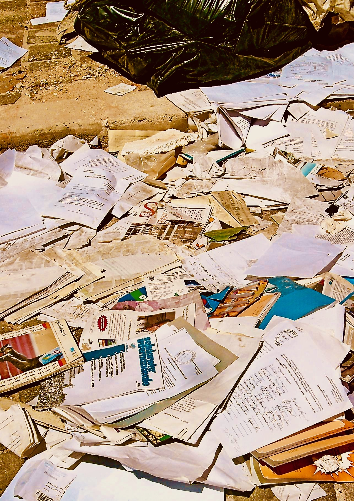

{fig-align="center"}

<em>«Il patrimonio culturale non è mai un documento della cultura senza essere insieme un documento della barbarie», scriveva Benjamin, evidenziando la dialettica che produce quanto genericamente chiamiamo "arte". In maniera particolare in tempi di reazione come i nostri, tutte le dichiarazioni in ambito culturale sulle quali apparentemente ricade la più completa "unanimità" andrebbero, laddove la parola "cultura" davvero abbia un senso, accuratamente portate a critica. A rischio di svelare l'ipocrisia e il pressapocchismo che si annida dietro la presunta "bontà" di libri e di operazioni che si risolvono perlopiù in pretesti per noiose e scontate passerelle mondane, oppure in operazioni ideologiche non sempre pertinenti scrittura e lettura. Una critica spassionata dei limiti e delle contraddizioni di Più libri più liberi 2024, una delle manifestazione più rappresentative delle attuali tendenze del contesto editoriale attuale, scritta da [Giacomo Tinelli](https://www.iltascabile.com/author/giacomo-tinelli/).</em>

L'industria culturale contemporanea pare tutta impegnata nelle attività espansive e imprenditoriali di crescita quantitativa, moltiplicazione dei titoli, stampa-distribuzione-vendita. Chissà cosa ne avrebbe pensato [Vladimir Majakovskij](https://www.treccani.it/enciclopedia/vladimir-vladimirovic-majakovskij/?search=Majakovskij%2C%20Vladimir%20Vladimirovi%C4%8D%2F) – lui che in una celebre poesia (invecchiata male) scriveva: «*Contro la marea di parole innalziamo una diga. / All'opera! / Al lavoro nuovo e vivo! / E gli oziosi oratori, / al mulino! / Ai mugnai! / Che l’acqua dei loro discorsi faccia girare le macine.*» E quanto avrebbe berciato [Louis-Ferdinand Céline](https://www.treccani.it/enciclopedia/louis-ferdinand-celine/) di fronte al galateo della benignità sciorinato in vesti eleganti (o eccentriche, in ogni caso *distintive*) al vernissage dei molti eventi culturali, piccoli o grandi, dai benemeriti attori editoriali che raccontano l'incremento di vendite librarie, *sic et simpliciter*, come un fattore autoevidente di sviluppo culturale? «*Forse semplicemente il pubblico applaude perché è presente; intendo non tanto presente a se stesso, ma all’evento*», scriveva un altro autore allergico alla mondanità, [Vitaliano Trevisan, in *Works*](https://www.einaudi.it/catalogo-libri/narrativa-italiana/narrativa-italiana-contemporanea/works-vitaliano-trevisan-9788806254292/).

Il meccanismo dello spettacolo, il cui esito inevitabile è appunto l'applauso, e la logica del "*purché si legga*" hanno moltiplicato – ancora: quantitativamente – le occasioni in cui le diverse agenzie del campo letterario, tutte insieme nel pentolone "*culturale*", celebrano la propria *bontà* (così, tra l'altro, è intitolato un racconto lungo di [Walter Siti](https://www.treccani.it/enciclopedia/walter-siti/?search=Siti%2C%20Walter%2F) pubblicato nel 2018, il cui protagonista è proprio un editore misantropo e del tutto a disagio in questo nuovo clima): il festival, l'happening, il reading e altri sostantivi di importazione. La letteratura, l'arte, i prodotti estetici, tuttavia, sono sempre frutto di un compromesso tra i vari attori sulla scena: «*il patrimonio culturale \[…\] non è mai un documento della cultura senza essere insieme un documento della barbarie*», scriveva [Benjamin](https://www.treccani.it/enciclopedia/walter-benjamin/?search=Benjamin%2C%20Walter%2F) nella più celebre delle *Tesi di filosofia della storia* (la VII), evidenziando la dialettica storica che produce ciò che genericamente siamo disposti a chiamare "*arte*". Pertanto, in tempi di reazione come i nostri, ancor più che in passato, tutte le dichiarazioni in ambito culturale sulle quali ricade la più completa unanimità andrebbero portate a critica con particolare accuratezza.

Vorrei condurre qui, passato lo zelo forcaiolo puntualmente sgonfiatosi nel giro di un amen, una critica spassionata della vicenda *Più libri più liberi,* concentrando l'attenzione su un aspetto solo di rado chiamato in causa eppure, a mio giudizio, cruciale, forse il vero *prius* della faccenda. La faccenda… ricordate? [Chiara Valerio](https://www.treccani.it/enciclopedia/chiara-valerio/), in qualità di direttrice editoriale della fiera della piccola e media editoria, invita Leonardo Caffo, autore di [*Anarchia. Il ritorno del pensiero selvaggio*](https://www.raffaellocortina.it/scheda-libro/leonardo-caffo/anarchia-9788832856279-4338.html) (2024), nonostante i molti dubbi, sollevati in tempi non sospetti, sull'opportunità della presenza di una persona imputata (e poi condannata in primo grado l'11 dicembre 2024) per maltrattamenti e lesioni nei confronti della ex compagna in una fiera dedicata, tra gli altri, a Giulia Cecchettin, uccisa brutalmente nel novembre del 2023 dall'ex fidanzato. Molto presto il caso è scoppiato, come si dice, e si è creata subito una polarizzazione mediatica che, com'era prevedibile, ha impedito un dibattito accurato, e che si incardinava fondamentalmente su due argomentazioni: da un lato la presunzione di innocenza e la libertà di parola, arrocco difensivo immediato quanto inefficace di Valerio e dei suoi difensori, in compagnia – insolita, ma significativa – della nuova destra reazionaria e *alternative* (che tiene il dito sul grilletto per tirare a vista su qualsiasi cosa possa essere, com'è qui il caso, ricondotta a ciò che sempre spesso più viene definita ideologia *woke*); l’altra argomentazione riguardava l’inadeguatezza dell’invito, declinata in molti modi, più o meno aggressivi: chi ha rinunciato all’invito alla fiera defilandosi in silenzio come un imbucato, chi l'ha fatto platealmente, con una comunicazione pubblica; chi, ancora, ha pubblicato dei pezzi rap sarcastici contro Valerio e il suo femminismo di carta (brani verbalmente molto violenti e di pessima qualità, ad essere onesti).

La questione va forse ripensata a partire proprio dalla dedica a una persona, Giulia Cecchettin, la cui vita (e la cui morte) c'entra ben poco con l’editoria e con i libri. Occorre fare un passo indietro. La [dichiarazione di Valerio](https://www.ansa.it/sito/notizie/cultura/libri/approfondimenti/2023/11/21/ansapiu-libri-chiara-valerio-dedicata-a-giulia-cecchettin_3a71f2b4-f837-4e8f-9d68-a005abbb3f01.html) all’apertura della sua direzione, nel novembre del 2023, era un appello, di per sé più che legittimo benché un po' astratto e dunque evasivo, alla connessione tra i testi e il mondo: «*Le fiere e i festival, i libri, stanno nel mondo e servono nel mondo, in mezzo alle persone. E così questa fiera comincia in un momento tetro. Noi parliamo mentre Giulia Cecchettin è stata ammazzata. Ma siamo qui a parlare perché siamo certi che leggere fornisca le parole e più parole si hanno, meno mani si alzano. \[…\] Per me questa fiera è per Elena Cecchettin che ha tutte le parole, ma ci aggiungo le mie, anzi, le nostre ogni volta che dovessero servirle, i libri servono in mezzo agli esseri umani. Ed è in memoria di Giulia Cecchettin.*»

[Giacomo Tinelli, Le fiere feroci dell'editoria, «il Tascabile» 10.13.2025.](https://www.iltascabile.com/societa/fiere-feroci-editoria/)

<em>Fotografia: Claudio Comandini, Parole perdute, L'Aquila 2010</em>
