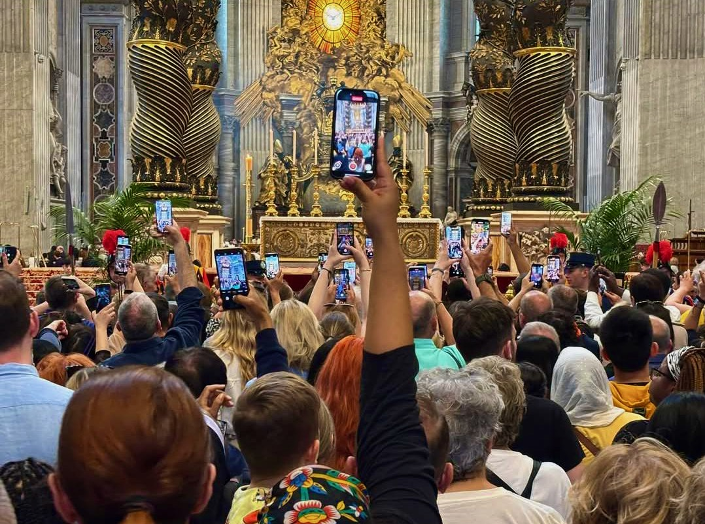

{fig-align="center"}

*Cosa ci sfugge e cosa si impone del pontificato appena conclusosi? Fenomenologia di un papa forse atipico eppure propriamente universale.*

## 1. *In morte pontificis*

In un mondo in cui ognuno è chiuso nel suo proprio piccolo mondo, papa Francesco ha fatto quello che era istituzionalmente chiamato a fare: costruire ponti, mediare istanze diverse per tentare un linguaggio comune, propriamente ecumenico. In tal modo ha risposto alla funzione della Chiesa e alla sua missione universale anche sopravanzando lo stesso cattolicesimo, che anzi in molti comparti si è frazionato assecondando proprio la tendenza che il papa tentava di contrastare. E se è stato particolarmente ammirato da figure lontane dal contesto ecclesiastico, ha provocato tra i clericali punte di avversione che preannunciano ulteriori conflitti.

Le contraddizioni dell'azione di Bergoglio non sono però interpretabili nell'abusata polarizzazione tra progressisti e conservatori, inadeguata a comprenderne i termini. Se è stato sin troppo incline alla mediazione con il secolo nelle circostanze legate alla pandemia, oppure in pieno contrasto con i poteri terreni per le sue posizioni sui diversi teatri di guerra, o controverso in una apertura nei confronti dei credenti omosessuali comunque priva di ammiccamenti LGBT, lo è stato all'interno di un quadro eminentemente cattolico, per cui cruciale è l'incarnazione e il portarne testimonianza. Conformemente ad un insegnamento gesuita, ha anticipato nel mondo i passi di Dio. Coerentemente, il suo ruolo si è posto tra terra e cielo e tra questo e il mondo. Eppure, è stato accusato di relativismo di fronte alla dottrina, di conferire un discutibile primato alla prassi attraverso la sinodalità, di porre dubbi senza fornire risposte e di aver azzerato la metafisica.

Il confusionarismo che gli addebita non senza argomenti interessanti il filosofo cristiano conservatore Stefano Fontana ([*Papa Francesco, dieci anni di scompiglio e sconcerto*, 2023](https://lanuovabq.it/it/papa-francesco-dieci-anni-di-scompiglio-e-sconcerto)) deve comunque considerare anche quanto la generalità della Chiesa continui a segnare spesso una netta autoincomprensione delle proprie stesse posizioni, nonché di aver volentieri e da tempo arretrato il proprio ruolo sociale a quello di *voyer*. Inoltre, le accuse a Francesco di aver ceduto alla secolarizzazione devono confrontarsi con il suo sforzo costante di restituire ruolo e infuenza alla fede, permettendo così di risalirne i significati anche in un mondo che si sente svuotato dalla trascendenza. Insomma, dove sembra esserci poco da difendere nella Chiesa pur millenaria e magnificente che Bergoglio si è ritrovato, egli ha da parte sua mirato ad un universalismo che per quanto discutibile ha spesso cercato Cristo al di là delle convenzioni e anche lì dove appariva assente. In qualche modo, al di là hanno guardato anche gli ultimi eventi: la Pasqua cattolica è caduta in coincidenza di quella ortodossa, della chiusura della Pesach ebraica e dell'anniversario della nascita di Maometto, mentre il giorno successivo è stato quello del Natale di Roma e in tale data è venuto a mancare. Cosa verrà dopo di lui, che si era definito come proveniente dalla fine del mondo, non è ancora dato saperlo.

## 2. *Conscientia et cohaerentia carens*

Leggere le figura di Bergoglio e le vicende della Chiesa secondo statuti a loro propri, e interrogare anche questi, è necessario dove, invece di cadere in interpretazioni ideologiche più o meno larvate e paranoidi, vogliamo quantomeno cercare di comprendere gli eventi. Secondo tale sobrietà interpretativa, Francesco non può essere definito prono a nessun potere mondialista, in quanto la Chiesa è tale per conto suo, così come il suo predecessore Benedetto XIV Ratzinger non si è "dimesso" per l'intermissione di tali poteri. Così, piuttosto di imporre tali semplificazioni, è opportuno cogliere l'aspetto propriamente cattolico ed ecumenico della loro azione e la continuità di visione *riformista* che li ha accomunati. Ciò sfugge a tutti quelli che da ogni sponda identificano la Chiesa con gli interessi di un Occidente ormai imploso per poi accusarla un giorno di una cosa e il giorno dopo dell'opposto.

Mediare è nella natura della Chiesa, del papa e del compito politico che appartiene loro, e questo non significa aderire allo bolso e sterile perbenismo 'volemosebenista' di coloro che sono chiamati «*tiepidi*» e destinati a venir «*vomitati*» (Apocalisse 3:16). Da parte sua, lo stato di eccezione pandemico ha avuto certamente regia e intenti, ma anche molti aspetti di impreparazione e improvvisazione: per farla breve, l'ignobile truffa delle mascherine non la ha organizzata Schwaab che comunque è tra i promotori del sordido livellamento del Grande Reset, e possiamo serenamente convenire che nessuno di costoro ha scatenato il virus. Certamente, da parte del papa è mancata la definizione di una posizione più decisiva, e soluzioni quale la realizzazione di una "processione simbolo" che avrebbe permesso piena riaffermazione dei crismi ecclesiastici. Tuttavia, ciò è avvenuto per applicazione di criteri cattolici, quali l'esigenza di piena contestualità ai tempi nonché per una scelta paolina di «*obbedienza*» ai poteri preposti (Romani 13:1-7), e soprattutto per una vocazione solidaristica irriducibile all'individualismo estremo a cui si sono perlopiù appellate molte critiche all'emergenza covid e alla campagna vaccinale.

Il problema vero è che il mondo cattolico manca di coscienza e di coesione, e un papa da solo non significa niente e non basta a rimettere a paro i conti. Troppe le pecore matte che nessun buon pastore andrà mai a cercare. Gli autentici problemi sono tanti, e pure la sinistra riformista si è invaghita del Grande Reset liberista e si è ammalata di medicalizzazione, mentre anche un Vasco Rossi fa canzoncine di merda e si sconvolge di vaccini. Siamo alla deriva di una visione del mondo ormai abrogata che non ha più alcuna contezza di sé, e che ha lasciato innumerevoli frammenti di specchio nei quali ognuno resta chiuso in un universo personale che in definitiva non esiste e non ha nemmeno motivi per esistere.

## 3. *Quaestiones apocalypticae*

Per comprendere significato e funzione di questo controverso pontificato è più opportuno, piuttosto che affidarci a dubbie profezie e a dietrologie fantasiose, mantenere un solido impianto filosofico e teologico, anche se questo significa travalicare il Cristianesimo così come ancora viene concepito. Inoltre, laddove nell'orizzonte più prossimo ci si aspetta la guerra, la terza da definirsi mondiale per quanto le guerre globali siano in atto da decenni, tale guerra è comunque già in corso: i suoi "pezzi", ai quali faceva riferimento proprio Bergoglio, stanno progressivamente configurandosi in sistema. Per studiare l'andamento e prendere atto dell'aspetto "apocalittico" degli eventi in corso, sarà interessante valutare come cambieranno posizionamento specifico e relazioni reciproche le diverse realtà che possono richiamarsi tanto all'eredità di Roma, tra loro piuttosto differenziate, quanto alla figura di Cristo, che non riguarda il solo Cristianesimo e rispetto alla quale peraltro anche molte correnti cristiane non sono mai giunte ad un accordo definitivo.

I termini sono complessi da sempre. Quanto colpisce leggendo i testi che si dicono sacri è come tutta la vicenda di Gesù rappresenti una sorta di citazione delle profezie, in particolar modo di Isaia, in cui ritroviamo le scene di un martirio ricondotto a «*conoscenza*» (Isaia 53:11), mentre è Daniele a introdurre il pur contestato carattere di «*Figlio dell'Uomo*» (Daniele 7:13). L'indubbio carattere rivoluzionario di Gesù si svolge così nei modi della continuità e del compimento, come del resto egli stesso afferma, e come è implicito in un mondo che non aveva ancora elaborato il concetto moderno di rivoluzione, il quale trova così più consonanze con l'idea astronomica di chiusura di ciclo e ritorno all'origine (René Guénon, *La crisi del mondo moderno*, 1927). Troviamo però anche passaggi che scardinano la letteralità banale e fanno comprendere come nell'uso comune dei termini siano stati convalidati modi impropri, mentre invece la stessa "tradizione" nella sua prassi si costituisca attraverso rotture e riletture, conformemente al proprio più pregno significato di *trasmissione*. Le questioni si complicano ulteriormente, e con esse quanto chiamiamo storia, dove consideriamo passaggi dei Vangeli particolarmente vicini all'Ebraismo, nonché nell'interpellare l'Islam, che proponendosi quale rivelazione finale rielabora contenuti e argomenti ebraici e cristiani abrogandone a diverse riprese alcuni elementi.

Tali argomenti, la cui risoluzione è propriamente apocalittica, restano in sospeso: quanto può aiutare la nostra comprensione è prenderli in considerazione. I Romani, destinati ad accogliere il messaggio cristiano e a renderlo universale, a detta dei Vangeli sono meramente gli esecutori materiali e nemmeno troppo convinti di quello che Cicerone definisce come «*il supplizio più crudele e il più tetro*» (Cicerone, *Contro Verre*, 7 a.C.). Per quanto riguarda le inevitabili ma continuamente revisionate fonti cristiane, Matteo riporta la «*diceria*» (Matteo 28:15) diffusasi e mantenutasi tra gli ebrei, del suo corpo rapito nella tomba dagli apostoli; ciò allude ad una rottura destinata ad approfondirsi sempre più, che contraddice in pieno i piani del sommo sacerdote Caifa di fare di Gesù messia e martire ad uso esclusivo della rivolta giudaica. Da parte sua, quale testo fondante di quella che proprio nel proclamarsi quale ultima rivelazione sarebbe per definizione in rapporto essenziale con quanto la precede, il Corano si ricollega ad eresie quali il Donatismo nell'affermare che Gesù non fu né crocefisso né ucciso, ma «*così parve*» (Corano 4:157); di tale inganno furono vittima un'altra volta gli ebrei, lasciando alle dispute dei cristiani l'aspetto di semplici congetture, assimilate in tal modo alle divinità e alle credenze pagane. Va comunque rimarcato come l'Islam, per cui popoli diversi esistano proprio «*per conoscersi a vicenda*» (Corano 49:13), si sia nelle sue forme più rozze, peraltro le più moderne, contraddetto al punto di sparare cannonate ad altrimenti inoffensive statue di Buddha e templi di Baal. Insomma, il problema delle Scritture è che gli uomini non sanno leggere, ed è in grossa parte ciò a fare danni. E quindi, rispetto a cosa occorre considerare la responsabilità e il cambiamento che in molti aspetti esse stesse sollecitano?

## 4. *Aberrationes antiquae*

Alcuni atteggiamenti moderni sembrano autentiche aberrazioni, eppure anche essi hanno una radice antica. E così, farsi selfie con la salma del papa trasformata in reliquia digitale, così come il cercarne l'investitura mediatica post-mortem da parte di esponenti politici anche molto lontani dalla sua parola, non sono circostanze delle quali stupirsi. Infatti, ambedue affondano in un repertorio che potrebbesi persino definire "tradizionale", se a questa parola non venisse perlopiù concesso il significato, piuttosto dubbio e improprio, di *passatista*. In maniera analoga, dileggio, ripudio e condanne, che nel caso di Francesco comprendono il tentativo di deligittimazione per via giuridica e procedurale, non rappresentano il privilegio di un pontefice indubbiamente originale e controverso, ma possono venir rintracciate in ogni epoca: in maniera esemplare quando, per invalidarne radicalmente azioni e investiture, nell'897 il cadavere di papa Formoso venne riesumato e quindi processato. Al contempo, l'aspetto *pop* messo in gioco del Vaticano non è affatto una novità, e peraltro processioni, miracoli e altri dispositivi si pongono all'origine dello spettacolo e del marketing; similmente, per quanto a livelli diversi, liturgia ed eucaristia sono in qualche modo modello del sistema delle notizie e della comunicazione, che rinnova continuamente "nuove" e "novelle". In tale contesto antropologico, tutti scattano foto per ambire ad una sorta di 'documento' che testimoni la propria stessa esistenza, e nessuno può farne a meno.

A livello di riflessione filosofica quanto deve essere colta, così come hanno indicato pensatori quali Debord e Derrida, è la continuità tra forme diverse: «*la ricostruzione materiale dell'illusione religiosa*» e «*l'esilio dei poteri umani*» (Guy Debord, *La società dello spettacolo*, 1967) prosegue dove la risposta a tutto diventa «*lo dice la televisione*» e la "buona novella" è continuamente destinata ad «*autocancellarsi*» e «*autoimmunizzarsi*» (Jacques Derrida, *...sopratutto niente giornalisti!*, 2005). E ciò che storicamente può interessare è considerare fino a che punto il Cristianesimo, così come già indica la sua peculiare lettura del profeta a cui si è ispirato, non sia destinato a trapassare e divenire altro. Si può infatti notare come, in modi diversi, il suo messaggio sia stato raccolto e trasformato in tempi relativamente recenti dalle forme più mature del socialismo, ed è inoltre da tempo alla base dall'Islam più consapevole e compiuto quale Sigillo della Santità. Infatti, è significativo come Marx nel *Capitale* (1867, 1885, 1894) impieghi un linguaggio apocalittico e nella *Critica del Programma di Gotha* (1875) tratteggi la società senza classi in forme che rimandano alla Pentecoste (Atti: 3,31- 4,35). Da parte sua, l'ottomano Maometto II, che nel 1553 conquistata Costantinopoli, aveva madre cristiana ed era collezionista di reliquie, e da musulmano era convinto che Cristo non fosse morto ma asceso direttamente al più alto livello del Paradiso, dove gode della compagnia di fanciulle dai grandi occhi neri dalla perenne età di trentatré anni. In tale quadro, la rappresentazione della figura umana conosce spiccate limitazioni, non c'è nessun papa, e tutti pregano.

Le questioni sono tante ed è comunque opportuno metterne almeno qualcuna sul tappeto. Laddove la mediazione comunicativa di Bergoglio ha funzionato parzialmente, sarà inevitabile l'inasprirsi della frattura che divide in se stessa la Chiesa e questa dai suoi fedeli? Qualcuno imputa questo papa di eresia, in genere il clero progressista viene considerato eretico dal conservatore tipo, ma fino a che punto pure costui non è *eretico,* cioè «*colui che ama la propria verità più della verità stessa*» (Gilbert K. Chesterton, *L'uomo comune*, 1950)? Il Vaticano II ha diluito il brodo e le chitarrine e le canzoncine a messa fanno venire voglia di bestemmiare, ma pure quello modernista non è stato a sua volta un brodo cattolico? Certamente in duemila anni di storia e di cultura troppe cose degne sono andate perse, e il credente non capisce nemmeno cosa significhi lo stesso Gesù Cristo: ma dove inizia esattamente l'equivoco, e quante le omissioni? E se, come prescrive il *katechon* paolino, che espone il necessario confronto con il «*mistero d’iniquità*» (Tessalonicesi II 1:1-12), la forza che trattiene il male è pure la stessa che lo manifesta, dove cercare l'effettivo discrimine con il bene?

*Fotografia: Valeria Penelope Garcia Quintiliani, "Tutti documentano, nessuno prega", Roma 24 aprile 2025.*
