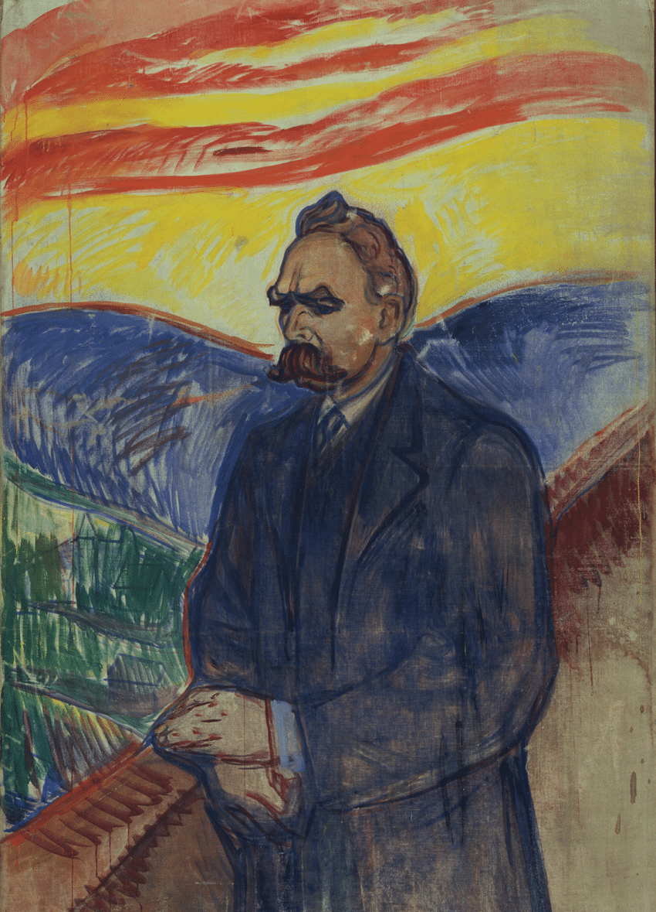
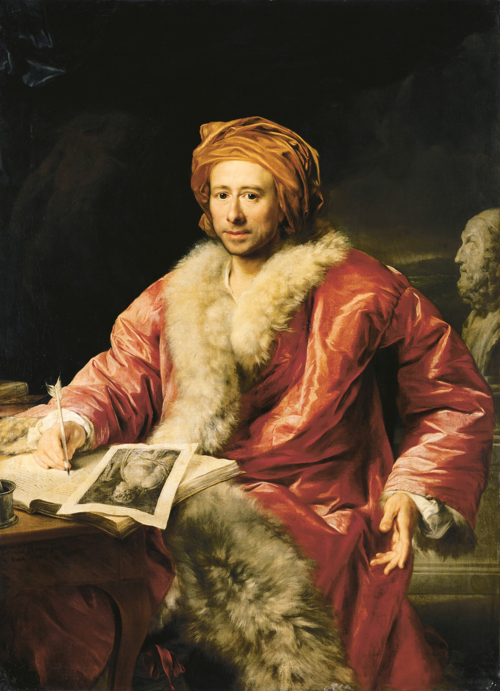
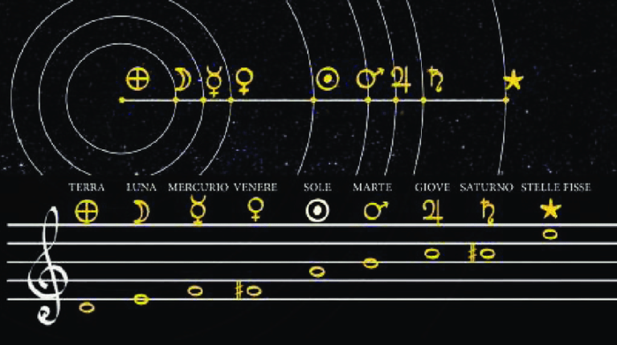
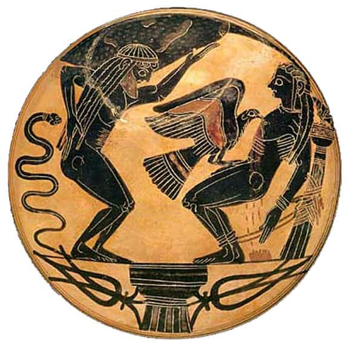
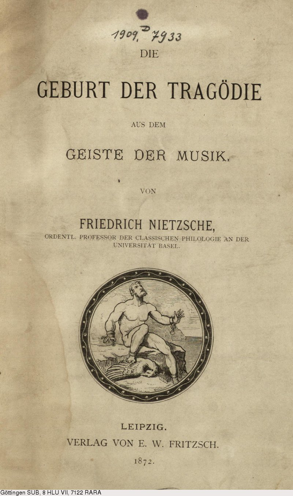
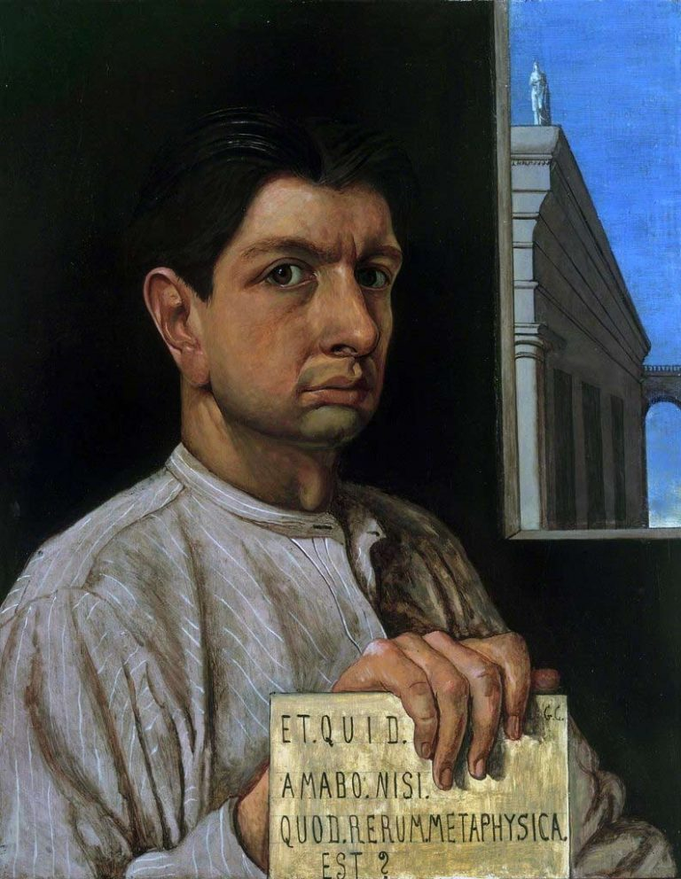
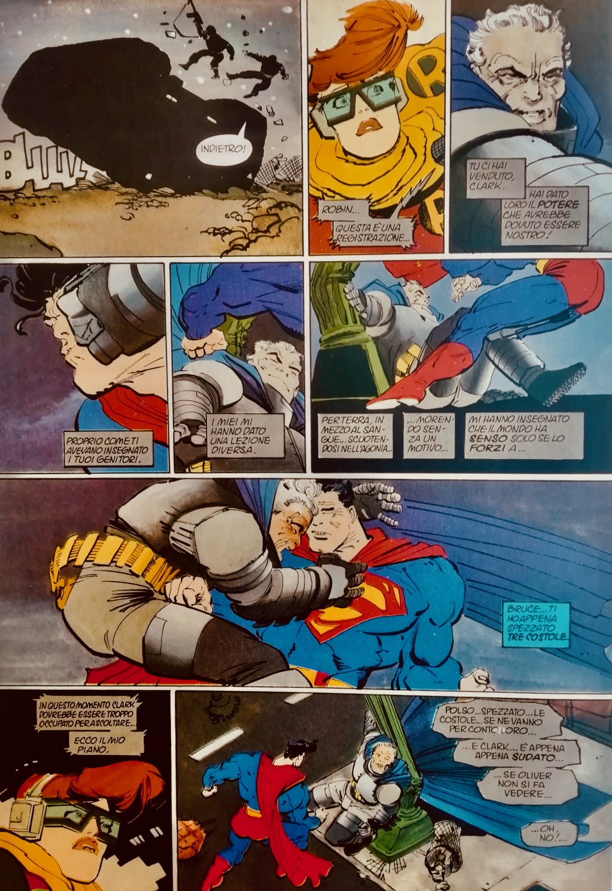
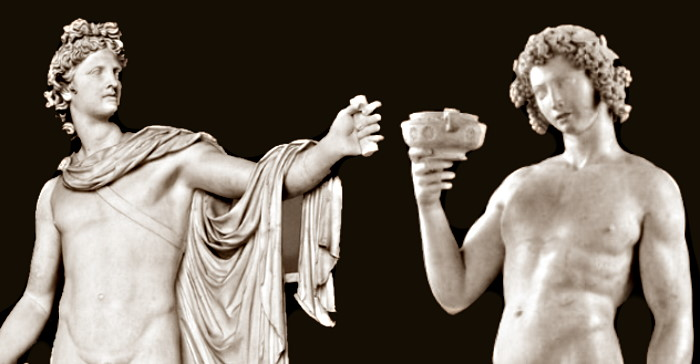

{fig-align="center"}

*Dalla nascita del teatro greco alle proprie composizioni musicali, dal sodalizio con Wagner alla fascinazione per Bizet, dalla filologia classica al multiprospettivismo all'opposizione totale, dalla sua influenza sul poema sinfonico e sul rock all'improvvisazione quale forza vitale: Nietzsche, un filosofo per la musica. In tre movimenti (+ improvvisazioni).*

## 1. Vivace

«*Meglio non esser mai nati - oppure, morire presto!*» Dal Detto di Sileno esala quel dramma dell’esistenza al quale i [Greci](https://grandtour.shop/posts/pages/2014-06-30-popsophia-greci-comandini.html) trovarono equilibrio nella polarità tra Apollo e Dioniso, tra immagini plastiche e dinamismo musicale, esprimendo quindi un contrasto che trova sintesi vivente nella forma mista del teatro, nel quale si esprime la capacità di purificare la condizione umana e dominarne il dolore. Parallelamente, a detta di Nietzsche, una nuova culminazione che riscatti la decadenza europea potrà imporsi perlopiù grazie ad una musica “totale” capace di riconciliare arte e natura, in virtù del singolare soccorso di una sorta di pessimismo attivo che sappia, nonostante tutto, esprimere la costante della sua visione: “*dire sì alla vita”*. Come già in Schopenhauer, l'arte rende sopportabile l'esistenza e, a tratti, persino degna; non è però la volontà a *determinare* la musica, ma piuttosto si vuole che questa sia destinata a dominare il mondo.

*La nascita della tragedia dallo spirito della musica* (1872) è il primo libro del filosofo tedesco, al tempo ventiquattrenne professore di filologia a Basilea, scritto nel mentre i prussiani subiscono da parte dei francesi la pesante sconfitta di Sedan. Da tale evento, a detta dello storico Jacob Burckhardt che di Nietzsche fu sodale, emerge soprattutto lo «*straordinario accrescersi del senso del profitto*», aprendo l'interrogativo su «*Quali classi e quali ceti saranno d'ora in poi gli esponenti essenziali della cultura?*» (*Riflessioni sulla storia universale*, 1905 - postumo). Le pagine di Nietzsche rappresentano una risposta indiretta a tale preoccupazione sull'incipiente mediocrità culturale e su quanto verrà chiamato spirito *filisteo.* Il libro contesta l'armonizzante immagine classicista della serenità greca, il cui senso può vedersi anche nei panneggi del ritratto di Winckelmann realizzato nel 1768 da Anton von Maron.

{fig-align="center"}

Contro tale senso di conciliazione, Nietzsche rintraccia al fondo della classicità una visione drammatica della vita. Questa viene marcata anche nei contrasti cromatici degli sfondi di uno dei suoi ritratti realizzati da Edvard Munch nel 1906. Testimoniando altresì diverse stagioni estetiche, lo sguardo dello storico dell'arte ci fissa con occhi carichi, quello del filosofo fugge altrove. Occidente e modernità sono già in una crisi che ancora perdura, e la cui risoluzione è rintracciabile, per quanto possa sorprendere e forse proprio per questo, dove tra i fili del *Logos* scorgiamo l'*enigma*.

Tale tensione costante verso un *significato possibile* si inserisce ancora della contrapposizione individuata da Kant tra la realtà manifestata del fenomeno e il semplicemente pensabile del noumeno, risolta in maniera larvatamente e paradossalmente hegeliana, rendendo ogni dialettica dionisiaca e tutte le idee apollinee. L'opera prima del filosofo è rifiutata veementemente dalla filologia classica accademica e in seguito viene parzialmente sconfessata dallo stesso autore, eppure vi si annunciano le dominanti del suo pensiero e questioni decisive per tutta la riflessione a venire. Tra queste: «*Solo come 'fenomeni estetici' l’esistenza e il mondo sono eternamente 'giustificati'.*» Occorre però anche chiedersi cosa fossero musica e mondo, apollineo e dionisiaco presso gli antichi greci.

Per i pitagorici la musica era, insieme alla matematica, quanto coinvolgeva l'universo nei suoi stessi termini logici e metafisici. Pitagora dividendo una corda in quattro parti determina un sistema di proporzioni per cui le prime risononza di un suoni sono intervalli di unisono, ottava, quinta e quarta; tali proporzioni regolano pure le distanze tra i pianeti, sette quante le note del tetracordo e la cui rotazione produce la silenziosa *Armonia delle sfere*. Il *Manuale di armonica* (I d.C.) di Nicomaco di Gerasa testimonia la lunga e profonda influenza di tale concezione.

{fig-align="center"}

Per comprendere la differenza tra la musica e il pensiero degli antichi e dei moderni, va considerato come, nella serie degli armonici naturali, l'intervallo di quarta sia "dissonante", in quanto la nota corrispondente compare soltanto come ventesimo armonico. Maggiormente "consonante" risulta invece il settimo armonico, equivalente all'intervallo di sesto grado aumentato, successivo a quelli di quinta e di terza maggiore e presente nelle scale minori melodiche quale settimo grado diminuito. La modernità infrange l'unità con la natura e spodesta la visione essenzialista a favore di rapporti *contingenti*, convenzionali eppure necessari, che stabiliscono tra *suono* e *nota* codici tanto rigorosi quanto adattabili.

Nei miti greci, Apollo è figlio di Zeus e Leto e fratello di Artemide, in seguito è identificato con il Sole e quindi si impone a Roma, dove la sorella sarà perlopiù conosciuta come [Diana](https://grandtour.shop/posts/pages/2024-11-15-istanbul-genzano-mezzaluna-comandini.html#diana-dai-molti-nomi), in modi diretti; da parte sua Dioniso, che si farà un nome presso i Romani come Bacco, nasce come dio della vegetazione e risulta figlio di Zeus e di madre incerta o meglio plurima: Demetra, Io, Lete, Dione, Semele, Persefone le candidate più accreditate. Il primo ha come luoghi elettivi il monte di Delfi e l'isola di Delo, mentre del secondo, allevato sul Niso, è discusso se sia frigio, tracio, oppure autoctono. Tanto Apollo quanto Dioniso sono legati alla musica: il primo alla cetra e al suo aspetto formale al punto che è lui a dirigere le Muse, il secondo alla dimensione della fisicità e delle passioni. La musica accompagnava la tragedia attica, che presso Atene rappresenta una cerimonia religiosa dai forti connotati sociali.

Nietzsche, senza nemmeno nominare le variazioni del mito e le complessità per cui la musica sfugge alle sue pur indispensabili razionalizzazioni, rivendica un carattere di "necessaria" irrazionalità alla realtà tutta, e adatta i due dèi "musicali" Apollo e Dioniso alla propria visione, rendendoli funzionali alla risoluzione della crisi europea e della sua scienza, individuane la soluzione nella restaurazione dello spirito tragico. Se il suo intento è *filologico*, conduce ad un'esperienza del divino che scavalca la storia delle religioni, per quindi fondare un'*antropologia*.

A suo dire, la tragedia elabora la propria arte nell'equilibrio dinamico tra distacco e abissalità, di cui sono testimoni Apollo e Dioniso, rispettivamente immagine del sogno e dell'ebbrezza che fondano la realtà attraverso lotta incessante e periodiche conciliazioni. Ciò viene reso evidente nello sviluppo delle forme artistiche proprie alla cultura greca, nelle quali si esprime la tensione dell'individuo a tornare al tutto dissolvendosi nel divenire. Osserviamone alcune delle fasi. L'*Elegia del naufrago* (VII sec. a.C.) di Archiloco annulla la soggettività, così preponderante nei poemi omerici, proprio portandola all'estremo e ponendo virtù nella sopportazione. Il discorso si approfondisce nel *Prometeo incatenato* (460 a.C. ca.) di Eschilo, che dona all'uomo il fuoco ma è costretto da Giove alla catena, giustificando così in pari modo il giusto e l'ingiusto.

{fig-align="center"}

Tale fato si impone anche all'uomo, dove l'*Edipo re* (430-420 a.C. ca.) di Sofocle subisce il destino di dover ricomporre la frattura tra la regressione dell’incesto e la pienezza della regalità. In tutte queste tragedie, il ruolo della musica è sempre preponderante: Archiloco rinnova il recitativo musicale, in Eschilo il coro è in armonia con la musica e la danza, in Sofocle il canto del coro accompagna l'azione. Affacciandosi al secolo successivo, Euripide porta il coro ad assumere un valore lirico e lo riconduce alla poesia, introducendo tuttavia al razionalismo socratico e alla ricerca dell'oggettività scientifica.

Così come egli considera tali motivi molto più problematici per la civiltà greca rispetto ai numeri irrazionali e alle grandezze incommensurabili scoperti dal pitagorico Ippaso che ne infransero l'edificio logico e matematico, ritiene il razionalismo parimenti funesto per la civiltà europea. La quale, tra convenzioni mistificanti e falsa coscienza, «*vive in servitù di maligni nani*» (*La nascita della tragedia*, cit.) ed è incapace di «*sentire correttamente*» (*Richard Wagner a Bayreut*, 1876).

Un ritorno alla tragedia, al culto di Dioniso e allo spirito della musica sono gli antidoti a quella fede nella «*forza salvifica universale del sapere*» (*La nascita della tragedia*, cit.) che rappresenta semplicemente la copertura della decadenza della quale è sintomo. Particolari attenzioni sono peraltro rivolte da Nietzsche proprio alla pratica musicale. Infatti, egli stesso compone 74 opere, tra cui un primo frammento melodico scritto a dieci anni (1854), diciassette *Lieder* (1861-1865), *Frammento in sé* (1871), *Meditazione di Manfred* (1872) ispirato al dramma di Byron per cui avrà sempre particolare predilezione.

L'*Inno alla Vita* (1882), considerato addirittura quale espressione principale del proprio pensiero, viene composto su libretto della sua diletta (ma non troppo) Lou Salomé, scrittrice, psicologa e filosofa russa, che in seguito ebbe una lunga relazione con Rilke e fu in contatto anche con Freud. Dove lei nel libretto scrive: «*Nell'ardore della battaglia, fammi trovare la soluzione al tuo mistero*», lui sembra chiedere in controcanto: «*Cadendo da quali stelle ci siamo venuti incontro fin quaggiù*?» (parole pronunciate tra 23 e 24 aprile 1882 a piazza S. Pietro, Roma - F. Nietzsche-L. Salomé, *Da quali stelle siamo caduti?*, 2018).



Nelle composizioni del filosofo, il cui modello è sopratutto Beethoven (Simone Zacchini, *Beethoven. Un modello musicale per il giovane Nietzsche*, 2019) il *pathos* predomina: la melodia è spiccata, le progressioni insolite, il centro tonale fluttuante: se ai critici dell'epoca ciò appare dilettantistico e al nostro orecchio risulta invece piacevole e vario, per le sue tensioni verso l'«*opera arte totale*» ciò non è sufficiente. Sedotto dal recupero delle forme del teatro greco e dalla scoperta della *melodia infinita*, prende quindi luogo il sodalizio con Richard Wagner che, fortemente influenzato a sua volta da Schopehauer, ne *L'opera d'arte del futuro* (1849) ha già espresso con "corretto sentire" la riconciliazione di natura e arte, laddove questa è «*liberazione del pensiero nell'azione sensibile*».

Quanto più è decisivo, e non soltanto per gli ascolti di Nietzsche, è dove nel *Tristano e Isotta* (1865) un accordo formato da tonica, quarta aumentata, sesta aumentata e nona aumentata chiama all'appello almeno trentatré organizzazioni sonore diverse dissolvendo così l'impianto della scala temperata e della tonalità occidentale (Jean-Jacques Nattiez, *Il discorso musicale*, 1977). Quanto verrà chiamato da Spengler *Tramonto dell'Occidente* (1923) e da Husserl *Crisi delle scienze europee* (1936) comincia da qui.



Il rapporto tra il filologo-musicista e il compositore-pensatore attraversa differenti fasi. Dal pieno accordo espresso nel *Siegfried* (1871), dove si canta contro gli dèi «l'*amore lucente e la morte ridente*», si passa alla rottura segnata dal *Parsifal* (1882) che celebra sin troppo cristianamente «*la forza della pietà*». I gusti di Nietzsche si dirigono verso l'opera di Bizet, lodando nella *Carmen* (1875), alla quale assiste per più di venti volte, quell'amore che «*è tutto intorno*» rifiutando il sentimentalismo convenzionale, e dalla musica romantica venutagli a noia si volge verso quanto gli appare «*audace, sottile, cattivo, meridionale*». (*Umano troppo umano II*, 1886) In maniera affine, preferirà i climi del sud e soprattutto italici a quelli tedeschi, e piuttosto che ad una vita da accademici, da lui detestati insieme a tutti i pedanti, opterà per quella da "turista".

Il suo pensiero ancora rappresenta la più efficace confutazione dalle alternanti accuse che lo coinvolgono di costituire il cattivo maestro tanto della "degenerazione" nazista quanto del "degrado" contemporaneo, con i quali, come rimarcò con tempismo Georges Bataille (*Nietzsche e i fascisti*, 1937) non ha niente a che spartire. Nietzsche, il più scrittore dei filosofi e il più filosofo degli scrittori, trova con difficoltà epigoni alla sua altezza, eppure la sua influenza, tanto nella letteratura quanto nella saggistica, è stata enorme. Tra gli autori più rilevanti, oltre a quelli qui già chiamati all'appello: Proust, Kafka, Mann, Hesse, Shaw, London, Lawrence, D'Annunzio, Jünger, Hemingway, De Unamuno, Jung, Blanchot, Braudel, Tillich, Cioran, Caraco, Iqbal, Kundera; nessun filosofo ha potuto prescinderne, per quanto ognuno in modi a lui peculiari, fosse soltanto per motivi *genealogici*. Tale influsso non si è esercitato perché egli giustifichi alcunché, ma perlopiù a motivo di una caratteristica combinazione di capacità di descrizione, attitudine critica, attenzioni stilistiche.



## 2. Maestoso

La figura di Nietzsche emerge dalle ombre dell'ottocento per proiettarsi fino a noi, giunti all’opposto di quella che poteva essere la società del suo tempo, della quale individuava il guasto principale nel cristianesimo protestante, di cui il padre era pastore. Se la cultura sviluppatasi nei paesi di impronta protestante oggi si è esaurita in uno [sterile puritanesimo intellettuale](https://grandtour.shop/posts/pages/2014-06-02-neolingua-comandini.html) che pretende di imporsi in ogni ambito, si può altresì sorprendere il filosofo scagliarsi contro quelli che ancora oggi sono i più comuni *idola plebis*: la democrazia, il socialismo, il femminismo, tutti accusati di *risentimento*. E ciò, con grande scorno dei *filistei* di ieri e di oggi, non avviene affatto in nome di un'autorità, ma piuttosto di un'*opposizione totale*.

Dove sentenzia che «*primo principio del nostro amore per gli uomini: i deboli e i malriusciti debbono soccombere \[…\], e dobbiamo anche dar loro una mano in tal senso*» (*L'Anticristo*, 1888), non intende affermare quale criterio l'adeguatezza ad un’identità, ma piuttosto sollecita ad una differenza radicale. La sua è la denuncia, sempre attuale sui diversi registri che ogni epoca può stabilire, della «*gigantesca mistificazione per cui i più nichilisti, i più impotenti, i meno capaci di creare, divengono padroni del mondo in nome di entità trascendenti che essi stessi gestiscono e amministrano.*» (Mario Perniola, *Introduzione all'Anticristo*, 1984)

Va rimarcato come la capacità di rintracciare il nichilismo più becero e quindi il male più radicale, nel moralismo più piagnucoloso che pretende di essere il bene assoluto, se si distanzia fermamente dal cordoglio melanconico non può neppure ridursi ad un’apologia della violenza, così come il rifiuto dell'opinione generica non significa cedere ad una volgare ebbrezza. La sua distanza dalla metafisica oggettivista e dalla religiosità dei servi non si risolve in una generica condanna delle religioni, dove troviamo parole di apprezzamento per il Buddhismo e l'Islam (*L’Anticristo*, cit.) e persino, nonostante la posticcia fama di antisemita, per l'Ebraismo (*Aurora*, 1881), per quanto attraverso letture spesso originali e anche paradossali: l'uno è realista, l'altro vitale e quell'altro abile.

{fig-align="center"}

Un Dio bellicoso e severo come quello del monoteismo assoluto dei semiti sembra venir *personalmente* stimato quasi come fosse un nostro pari, il papato del Rinascimento viene apertamente elogiato in figure quali il pontefice Giulio II Della Rovere, condottiero e mecenate (*L'Anticristo*, cit.). Nietzsche ha lo sfacciato talento di saper capovolgere i pregiudizi comuni in prospettive originali e rendere queste perfettamente plausibili.

L'aspetto peculiare è che in tale visione *multiprospettica* ogni argomento viene sviluppato, indipendentemente dalle eventuali aporie che possano registrarsi rispetto ad altri contesti discorsivi, in modi prettamente musicali, seguendo le esigenze del *tema* e della partitura, e quindi le sue carature di intonazione, ritmo, espressione, dinamica e agogica. In pratica, Nietzsche scrive come se fosse un musicista. I suoi aforismi, nei quali si gongola di essere «*il primo dei maestri tedeschi*» (*Crepuscolo degli idoli*, 1889) hanno la concisione e la nitidezza di un *riff* ben costruito. Quanto in lui si impone è soprattutto l'esercizio costante di un *orecchio filosofico assoluto*. E dove afferma che i grandi pensieri «*vengono camminando*» (*Crepuscolo degli idoli*, cit.) e chi scrive aforismi non vuole venir letto ma essere «*mandato a memoria*» (*Così parlò Zarathustra*, 1885), decostruisce l'opposizione tradizionale tra *oralità e scrittura* in modi che fanno da antidoto al terribile connubio tra chiacchiera e grafomania, oggi impostosi nelle distrazioni diffuse dalle aberrazioni dei media in quello che già all'epoca chiamava con disgusto "gregge".

Pur se privo tanto tanto della sistematicità che solo in parte riesce a sottrarre alla ripartizione tra volontà e rappresentazione di Schopenhauer, quanto della visione ontologica ed epocale di Heidegger che comunque vede in lui un decisivo momento di svolta, è provvisto di una «*intuizione conoscitiva*» capace di giungere con straordinaria acutezza «*all'essenza di ogni cosa.*» (Giorgio Colli, *Apollineo e Dionisiaco*, 2010). Tale esercizio, spesso inconscio, di una conoscenza *noematica* capace di oltrepassare quella *discorsiva*, mantiene tuttavia ruolo, per quanto simbolico, ad una *necessità* di tipo determinista (*Frammenti postumi,* 1885-1887), e pur nella sua radicale contingenza esclude immediatamente teleologie e cause finali (*La teleologia a partire da Kant*, 1868). E nel considerare identità, uguaglianza, logica, mere finzioni e al più di «*metafore delle cose*» (*Verità e menzogna*, 1870), la sua libertà resta quella della musica e pur sempre nella musica, come indicò proprio l'insuperato modello giovanile Beethoven, cerca la massima *rivelazione*. Non a caso, la sua stessa esistenza a svilupparsi «*per temi e grandi motivi direttori musicali: tema della guarigione, del riscatto dei valori della mandria, della "grande salute" mediterranea*.» (Lorenzo Giusso, *Nietzsche*, 1942)

## 3. Cadenza - Andante con moto



Indipendentemente dal suo essere stato anche musicista, aspetto perlopiù fortemente sottovalutato, il filosofo ha avuto vasta influenza sulla musica. In maniera eminente su Richard Strauss che, accentuandone gli elementi pagani, si ispira al *Così parlò Zarathustra* per l'omonimo poema sinfonico (1896), suddiviso in otto parti che corrispondono ad otto capitoli del libro; il dominio della musica, che si annuncia nel preludio costruito sulla degli armonici naturali, è quello della stessa "*volontà di potenza*" capace di «*rendere ogni così fu un così volli che fosse*» (*Così parlò Zarathustra*, cit.). Nietzsche è altresì rintracciabile nelle *Enigma Variations* (1899) di Edward Elgar, il cui tema di due melodie in contrasto, composto improvvisando sul violino, si sviluppa per tredici ritratti preceduti da enigmatiche iniziali, da tempo decifrate quali figure domestiche al compositore, il quale avverte che l’autentico "enigma" è laddove «*lungo e sopra la costruzione 'procede' \[goes\] un altro tema più ampio che non si suona.*»

Temi nascosti e programmi aperti diventeranno peculiari delle musiche di avanguardia popolare del secondo novecento, nelle quali sostanza e forma si confondono e che, per quanto di ampia diffusione, esigono ascoltatori partecipi e consapevoli. [Ornette Coleman](https://grandtour.shop/posts/pages/2016-02-25-variazioni-differenza-derrida-coleman-comandini.html), relativizzando metrica musicale e memoria esecutiva, in *The Circle with an Hole in the Middle* (1956) pur mantenendo melodica cantabilità omette l'esposizione dello stesso tema, preludendo in qualche modo alla "à" muta della *differànce* di Derrida e agli sviluppi della decostruzione. Klaus Schulze ne realizza in *X* (1978) una biografia di impianto classico e brillante, che risulta piuttosto contrastante rispetto alla versione originale, pubblicata solo in seguito come *Crazy Nietzsche* (2000), dove il costrutto include fasi più controverse e ai sintetizzatori si aggiungono batteria e cori. Resta da chiedersi quale delle due sia più "filologica".



Jim Morrison prende ispirazione dal filosofo nei testi e nella messa in scena, si atteggia a Dioniso e officia l'«*Eterno ritorno dell'Identico*» (*Così parlò Zarathustra*, cit.), sopratutto in *The End* (1967), *Celebration of the Lizard* (1970 - ne fu esclusa la pubblicazione su disco) e *An American Prayer* (1969-1970 - ne venne registrata soltanto la recitazione), e esiste pure *Ode to Nietzsche* (1968) improvvisata per piano e voce in un backstage. John Densmore, batterista dei Doors, ebbe addirittura modo di affermare che fosse stato proprio Nietzsche ad ucciderlo (Megan Michele Stypinski, *Reinventing the Gods*, 2008).



[David Bowie](https://grandtour.shop/posts/pages/2016-01-15-cinque-questioni-bowie-comandini.html) interpreta un *Oltreuomo* che si fa carico di ogni complessità fondando creativamente nuovi valori. «*Nessuna morte per gli uomini perfetti*» canta in *The Supermen* (1970 - su un giro composto e donato da Jimmy Page), e può trovarsi traccia di Nietzsche tanto in *The Rise and Fall of Ziggy Stardust & the Spiders from Mars* (1972 - fumetto in musica il cui protagonista è un intermediario con gli alieni), quanto nello ieratico, distaccato e controverso personaggio del *Thin White Duke* che si impone a partire dalla "cabalista" *Station to Station* (1976). In seguito scrive, riflettendo sul novecento appena conclusosi: «*Nelle vesti di Dio, l’uomo ha prodotto soltanto disastri. Questo ha portato a una terribile conclusione: se non potevamo prendere il posto di Dio, come avremmo potuto riempire lo spazio creatosi dentro di noi?*» (note a *Heathen*, 2002)



Una risposta viene da Giorgio De Chirico, dove l'*Autoritratto* (1911) recita *Et quid amabo nisi quod aenigma est?*» per venir quindi seguito dall'*Autoritratto* (1920) per cui «*Et quid amabo nisi quod rerum metaphisica est?*», associando così enigma e "nuova metafisica". Nel ricostruire i motivi della propria arte, il pittore afferma: «*Schopenhauer e Nietzsche per primi insegnarono il profondo significato del non-senso della vita e come tale non-senso potesse venir trasmutato in arte, anzi dovesse costituire l’intimo scheletro d’un arte veramente nuova, libera e profonda. \[Infatti\] Il non-senso del mondo nasconde un senso più profondo e tuttavia più indecifrabile, "metafisico", che non può essere descritto, ma solo rivelato da un’immagine che l’artista ha il potere di fissare.*» (Maurizio Calvesi, *Da metafisico a psicofisico*, 2007)

{fig-align="center" width="768"}

Completa tale pensiero e la sua immanenza nella sensibilità contemporanea una delle concitate e drammatiche tavole di un'opera che descrive un universo distopico piuttosto simile al nostro, dominato dalla corruzione e dai media e nel quale anche i *superuomini* sono stati inglobati: in *Batman: Dark Knight Return* (1986) di Frank Miller, nel duello epocale con [Superman](https://grandtour.shop/posts/pages/2017-07-15-berlino-metropolis-comandini.html), il protagonista afferma, ricordando i propri genitori uccisi in un vicolo: «*Il mondo ha un senso solo se lo forzi a…*».

{fig-align="center"}

Come può quindi l’arte giustificare ancora il mondo e l'esistenza? Qual è e dove sta lo spirito della musica? La musica di derivazione classica è perlopiù ridotta a sterile esercizio accademico, la sovversione dei principi armonici e ritmici definita jazz si ritrova a fare da passatempo ai benpensanti, i surrogati di quanto chiamavamo rock non vanno oltre a nullità funzionali ad un mercato normalizzante. Possono offrire formule interessanti l'industrial e il metal più provocatori e sperimentali e alcuni sviluppi delle musiche etniche e folk, soprattutto laddove fornite di una dimensione rituale e "apocalittica". È però sopratutto nella prassi dell'*istant composition* che troviamo lo «*spezzarsi dell’individuo e il suo unificarsi con l'essere originario*» (*La nascita della tragedia*, cit.) per cui improvvisare diventa sostare nella corda tesa tra impulso e forma e tra ebbrezza e sogno, rischiare costantemente un’identità data per perderla, e quindi ritrovarla, in stretta adesione alle forze vitali osservate con placido distacco.

Tale processo nella conclusione de *La nascita della tragedia* viene condensato in questi termini: «*Quel fondamento di ogni esistenza, del sostrato dionisiaco del mondo, può passare nella coscienza dell'individuo solo esattamente quello che può essere poi di nuovo superato dalla forza di trasfigurazione apollinea, sicché questi due istinti artistici sono costretti a sviluppare le loro forze in stretta proporzione reciproca, secondo le leggi dell'eterna giustizia. Dove le forze dionisiache si levano così impetuosamente come noi possiamo sperimentare, là deve essere giù disceso sino a noi, avvolto in una nube, Apollo; le sue più rigogliose espressioni di bellezza saranno certo contemplate da una prossima generazione.*»

{fig-align="center"}

La polarità di apollineo e dionisiaco procede così oltrepassando la concezione di Nietzsche, in definitiva appena abbozzata. Il senso dell'infinito e quello dell'espressione trovano sintesi in un pensiero che è suono e silenzio, ascolto e danza: la corda non percossa che vibra per simpatia, la nota non suonata che completa la frase nella sua stessa omissione.

Similmente ad un buon improvvisatore, Nietzsche abbina una capacità virtuosistica straordinaria all'abilità di creare spazi per chi sappia ascoltare e completare il discorso: pertanto, il miglior tributo realizzabile nei confronti del suo lascito è, e anche nei suoi stessi confronti, continuare a «*filosofare con il martello*» (*Crepuscolo degli idoli*, cit.). E così come la «*verità per cui si può danzare*» (*Ditirambi di Dioniso*, 1891) e le ragioni della corporeità segnano in maniera peculiare il fare musica, l'«*oblio attivo*» (*Genealogia della morale*, 1887), assimilabile al fare “vuoto” della meditazione, permette la sospensione delle associazioni obbligate e delle soluzioni scontate che favorisce nuova creazione. In un flusso dove i musicisti hanno, come segnala Davide Sparti (*L’identità incompiuta*, 2010), l'impressione che la musica «*si dispieghi da sé*».

Nel vasto movimento di improvvisatori che nei decenni ha coinvolto musicisti di aree diverse, tra i più vicini ad un’idea di arte totale che oltre alla musica include reading e installazioni, capaci di far ballare e cantare il pubblico al punto da costringere gli stessi gestori del locale a chiamare i pompieri, il collettivo People Band, già Continuos Music Ensemble, fondati dal batterista Terry Da e del quale fecero parte anche il sassofonista Lyb Dobson (tra gli altri, con [Soft Machine](https://grandtour.shop/posts/pages/2025-02-15-canterbury-popolla.html) e Third Hear Band), che scrivono: «*La musica è un continuo, la musica è sempre qui, tutta intorno a noi, non si ferma mai, noi dobbiamo soltanto connetterci. Tutto è musica. I suoni dominano la nostra esistenza. Ogni suono/rumore è musica o può essere usato per fare musica.*» (note a *People Band*, 1968 - prodotto da Charlie Watts batterista dei Rolling Stones)



Se la People Band oltre a notevoli entusiasmi suscitò anche la disapprovazione dei musicisti più banali e conformisti, è pur vero che, come ricorda in una frase senza tempo il trombonista Giancarlo Schiaffini, «*l'improvvisazione non si improvvisa*»: comporta ore di studio sullo strumento, ore di studio della teoria, ore di studio delle forme, ore di studio - così come richiede studio e pratica l'*esercizio* della filosofia. E, soprattutto, la capacità di accogliere e amare l'enigma di sé, degli altri e del mondo con cui ci si relaziona. Conclude Nietzsche, in inaspettata cadenza perfetta: «*Senza musica, la vita sarebbe un errore*.» (*Al di là del bene e del male*, 1886)

## 4. Ombre di N. (per tromba e altri strumenti)

1.  *Ditirambi del sogno e dell’ebbrezza (enigmi musicali)*
2.  *Aforismi filosofico-musicali (improvvisazioni)*
3.  *Nell'ardore della battaglia, fammi trovare la soluzione al tuo mistero (variazioni infinite sul tema dell’Inno alla vita)*

