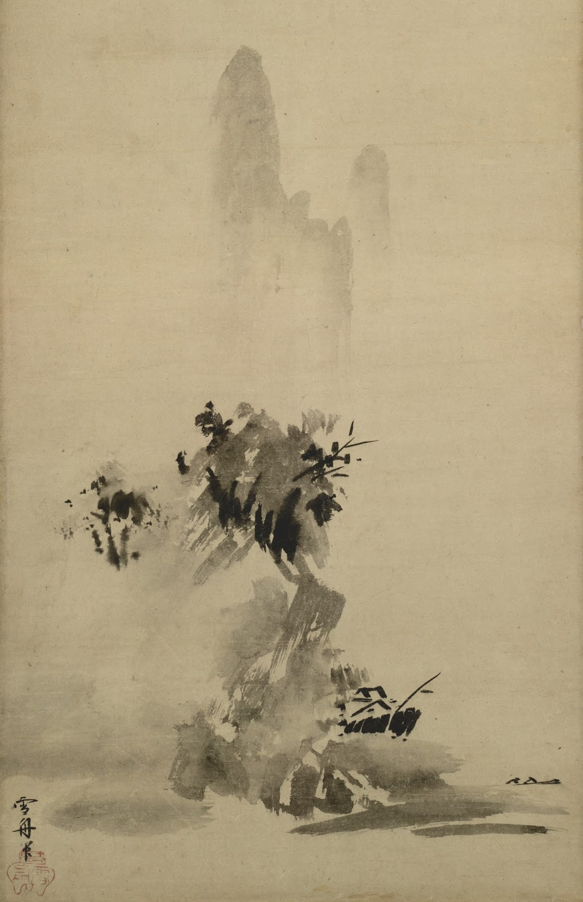

"){fig-align="center"}

«*Nel vuoto non ci sono il bene e il male: c’è la saggezza, c’è il principio e c'è la via. La mente è il vuoto». Questa frase de "Il Libro dei Cinque Anelli"* *(1645) di* *Miyamoto Musashi può fornire un primo passo per avventurarci in un'analisi comparativa tra pensiero buddhista e filosofia occidentale. Oltrepassando moralismi e nichilismi, l'illusione e la sofferenza, il vuoto costituirà sorgente di realtà e condizione di conoscenza.*

## 1. Il Principio e la Via

La filosofia è, per definizione, *amore della sapienza*. Tale termine, nel suo significato etimologico, non presenta connessioni dirette con il concetto di *Logos* - il principale strumento della filosofia occidentale. I filosofi greci sono stati i primi diffusori di questo modo di *fare filosofia* rimasto alla base della ricerca filosofica occidentale per la maggior parte della sua storia. È indispensabile alla contestualizzazione notare, come ricorda Pierre Hadot nel saggio *Esercizi spirituali e filosofia antica* (1981), la differenza tra l'antico e il moderno modo di *fare filosofia*. Infatti, per i filosofi antichi il regno del *Logos* non era da esplorare soltanto attraverso il discorso, la parola, lo sviluppo dialettico, ma anche attraverso pratiche fisiche e spirituali, essenziali alla ricerca del sapere.

Con il proseguire dei secoli, l'aspetto pratico della filosofia è stato gradualmente abbandonato. Possiamo ipotizzare che il processo sia avvenuto in modo analogo alla trasformazione religiosa della preghiera, trasformatasi da mezzo di connessione a obbligo dogmatico, per venire quindi ignorata dai fedeli: l'esempio evidente è nella concezione contemporanea di "cattolico-non-praticante", per la cui credenza l'aspetto pratico sembra non costituire più condizione necessaria. La pura ricerca intellettuale, in assenza della sua controparte pratica, rappresenta una ricerca incompleta, limitata ad un solo metodo e ad una sola fonte di conoscenza. La *philia* greca è invece diffusa, tranquilla, ampia: una forma di amore non-polarizzato, che si propaga in ogni direzione a propria disposizione.

Dunque, per lo stesso *amore* citato in precedenza, siamo spinti verso l'esplorazione della seguente questione: è possibile individuare degli aspetti di unificazione e diversità tra la nostra cultura occidentale, basata sulla matrice del *Logos* e del *discorso logico*, e la cultura buddhista, basata sulla matrice del *Pathos* e della *pratica*? Questo scritto si prefigge l'obiettivo di condurre una breve analisi comparativa tra alcuni dei principali esponenti della filosofia occidentale e le principali scuole buddhiste, concentrandosi particolarmente sul concetto e sull'estetica della *Vacuità*.

## 2. Le radici della conoscenza

{fig-align="center"}

Qualsiasi essere senziente nella propria vita può affermare di avere partecipato ad una realtà semplice, universale e diffusa: la *sofferenza*. Prima di noi, circa 2500 anni fa, il principe Siddharta Gautama fece la medesima esperienza quando chiese ai propri genitori, desiderosi di proteggerlo dal conflitto dentro le mura regali, di abbandonare la propria abitazione. Egli vide un vecchio, un malato e un cadavere - tre incontri che cambieranno profondamente la vita del giovane principe, e costituiranno le basi per la nascita della scuola di pensiero più influente della filosofia orientale.

La vita di Siddharta venne profondamente turbata dalla testimonianza del dolore, tanto da portarlo ad abbandonare i suoi possedimenti materiali e dedicarsi alla ricerca di una Via, una strada che lo portasse alla *Liberazione*.

L'ormai monaco decise così di sedersi ai piedi di un albero di fico, oggi conosciuto come Albero della Bodhi ("albero della conoscenza"), e giurò di non alzarsi fino a quando non avesse ottenuto l'*Illuminazione*. Si narra che dopo quarantanove giorni Siddharta si alzò, avendo finalmente raggiunto il *Risveglio* - nasce in questo momento il *Buddha*, o l'*Illuminato*. Il Buddha passerà la vita ad insegnare attraverso i suoi discorsi ai fratelli monaci la *Via verso la Liberazione*, conosciuta nella tradizione buddhista come *Nobile Ottuplice Sentiero* (Retta visione, Retta intenzione, Retta parola, Retta azione, Retta sussistenza, Retto sforzo, Retta presenza mentale, Retta concentrazione).

Prima di addentrarci nell'analisi comparativa, riassumiamo alcuni punti focali della filosofia buddhista:

a\) Il Buddhismo è una filosofia strettamente connessa al dolore, come è evidenziato anche da Friedrich Nietzsche nell'[*Anticristo* (1894)](https://ia803203.us.archive.org/18/items/nietzsche-anticristo/NietzscheAnticristo_text.pdf). Tale concezione si basa sull'esistenza delle *4 Nobili Verità*: esiste il dolore; esiste la causa del dolore; esiste la cessazione del dolore; esiste la Via che porta alla cessazione del dolore. È possibile denotare in origine una differenza fondamentale con la filosofia greca antica, in quanto il tema fondamentale appartiene ad una matrice psicologica-emotiva e non, a differenza dei filosofi presocratici, razionale-fisica. Tale differenza nelle modalità di indagine è probabilmente dovuta ad una differente struttura linguistica tra lingue occidentali e lingue orientali, ipotesi condivisa e ampiamente accettata nel campo storico-linguistico e approfondita nello scritto di [Giovanni Fava *Parlare, pensare, vivere: parole orientali e parole occidentali* (2018)](https://www.frammentirivista.it/parole-orientali-e-parole-occidentali/).

b\) Un secondo concetto fondamentale nella filosofia buddhista è l'*Anātman* (*A*, il suffisso privativo, + *Atman*, il *sé*), ovvero l'inesistenza della personalità individuale o dell'"Io Indipendente".

Risulta necessaria un'analisi più approfondita dell'ultimo punto citato per poter comparare la filosofia buddhista alla filosofia occidentale con maggiore chiarezza.

L'*Anātman* desidera infatti affermare la "non-esistenza individuale" di ogni componente della realtà: queste in quanto esperibili devono esistere, o deve quantomeno esistere la possibilità di farne esperienza, ma tale status ontologico non contiene alcuna validità se non viene preso in considerazione anche il resto della *Natura*. L'esempio più rappresentativo ed evidente di tale affermazione è il rapporto tra osservatore e oggetto osservato.

Il secondo aspetto fondamentale dell'*Anātman* è la natura momentanea e non-persistente di tutti gli enti componenti la realtà *fenomenica.* È dunque opportuno analizzare ciò che si trova alla base del Fenomeno - questo, seguendo una lettura affine alla filosofia di Schopenhauer, viene chiamato *Noumeno*. Specifichiamo inoltre come tale spiegazione sia soltanto una semplificazione del pensiero buddhista, che distingue estensivamente tra *Anitya (Impermanenza)*, *Anātman (assenza di sé)* e *Śūnyatā (vacuità)*.

Naturalmente, come ogni fenomeno diffuso per vaste aree geografiche, si sono venute rapidamente a formare molteplici scuole di pensiero, interpretando i discorsi del Buddha secondo modalità diverse. Per comprendere con maggiore profondità la complessa realtà della filosofia buddhista, risulta importante evidenziare alcune principali differenze tra le varie correnti.

*Theravāda* ("La Via degli Anziani") è la tradizione Buddhista più antica le cui idee derivano da un'interpretazione letterale dei discorsi del Buddha. È estremamente legata alle regole monastiche del *Canone Pāli*, una raccolta di testi canonici Buddhisti fissata oralmente dai monaci dopo la morte dell'Illuminato e successivamente scritta durante il primo concilio monacale nel I sec. a.C . Il fulcro di tale scuola è la possibilità della Liberazione della mente dai *Tre Inquinanti (Attaccamento, Avversione e Confusione)*.

*Mahāyāna* ("Il Grande Veicolo") risale approssimativamente al I/II sec. d.C ed è strettamente legata all'ideale del *Bodhisattva*. Tale termine è utilizzato nella dottrina Theravāda per indicare Siddharta Gautama prima che raggiungesse l'illuminazione; nella scuola Mahāyāna rappresenta invece un praticante ideale che ha raggiunto l'Illuminazione della mente eppure decide di rimanere nel *saṃsāra*, ovvero il ciclo delle rinascite, per agire secondo amore universale, abbracciando la sofferenza di ogni essere senziente.

*Vajrayāna* ("Il Veicolo di Diamante") ha origine in un periodo compreso tra il V al VIII sec. d.C e rappresenta la scuola maggiormente esoterica; utilizzando pratiche rituali complesse e prediligendo insegnamenti diretti da maestro e allievo per ottenere una rapida Illuminazione. Tale scuola si basa sui principi della corrente Mahāyāna, ampliandola con ulteriori tecniche meditative e di pratica.

Un'altra differenza fondamentale tra le varie scuole riguarda ciò che si trova al di là del fenomeno. In una filosofia dove le componenti della natura non hanno validità ontologica, esiste un principio che eluda tale condizione?

Generalmente, nella tradizione buddhista ciò è identificabile con il *nirvāṇa*: la realtà ultima, raggiungibile attraverso il *Nobile Ottuplice Sentiero*. Questo non costituisce però un principio fondante ma la sua pura assenza, in quanto viene definito solo quale negazione del *saṃsāra*: esso è non-nato, non-morto, non-divenuto, non-composto, non-condizionato. Adottando una lettura più fedele alla tradizione *Mahāyāna*, esso è una manifestazione diretta della *Vacuità*, senza la "maschera" della realtà condizionata presente nel ciclo delle rinascite.

## 3. Lo spazio del Vuoto

{fig-align="center"}

Come può il mondo, nella sua pienezza, essere il frutto di una natura vuota? Le parole dell'Illuminato sembrano essere l'unione della oscurità Eraclitea e del paradosso tipico dei Kōan Zen. Così l'enigma, irrisolvibile con il puro Logos, trova risposta nella *metapratica*.

Nel saggio *Upãya. Il cuore della compassione buddista* (2003) John W. Schroeder, filosofo particolarmente interessato al confronto tra Oriente e Occidente, mette in luce una caratteristica fondamentale del Buddhismo: l'insegnamento metapratico. Ogni insegnamento dialettico del Buddha è funzionale al raggiungimento della Liberazione, e non alla comprensione della Verità metafisica. La cosmologia buddhista nasce quindi come strumento per guidare il praticante lungo la Via, e non come espressione di una verità assoluta, affinché egli possa comprendere la Natura a partire dalla pratica spirituale.

Secondo Schroeder, il soggetto della riflessione viene così trasferito dalla verità alla prassi: «*Laddove la riflessione metafisica si adegua alle questioni molto generali che pertengono alla natura dell'essere, il linguaggio, la coscienza e la verità, la riflessione metapratica si adatta specificamente all’efficacia della prassi religiosa.*»

La *vacuità* buddhista è perciò da intendersi come mezzo di espressione della prassi religiosa, e non come stato fisico della materia. Il termine utilizzato nei testi liturgici è *Śūnyatā*: *Śūnya* è un aggettivo riferito al vuoto, al niente, all'assenza; il suffisso -*tā* rende l’aggettivo un sostantivo, indicando uno “stato delle cose”.

L’aggettivo *Śūnya* è un elemento ricorrente nei discorsi dell'Illuminato, invitando i monaci a praticare in *spazi vuoti*, spesso caratterizzati dall'aria aperta e dalla natura. La necessità metapratica a cui adempie l'aggiunta del -*tā*, portando la vacuità a diventare un elemento fisico della cosmologia Buddhista, è la trasposizione della vacuità da condizione esteriore a stato interiore. In questo modo il praticante è portato a osservare l'esistenza della *spaziosità* in qualsiasi luogo e situazione, avvicinandosi all’ideale di *incondizionato* tipico del Nirvāṇa. Si guardi bene il lettore occidentale dall'interpretare uno *spazio vuoto* quale *locus amoenus* o *giardino epicureo*: nè la bellezza nè l'isolamento sono condizioni necessariamente presenti nella spaziosità. Nel vuoto è necessario solamente ciò che richiede di esistere.

## 4. Essere e Vuoto

{fig-align="center"}

Per analizzare in maggiore profondità il concetto di *Vacuità* risulta funzionale alla comprensione un parallelo con la filosofia dell'Essere parmenideo: questo è infatti *non nato* e *non morto*, in quanto l'Essere non può derivare dal Non-Essere, e rappresenta anch'esso l'unica realtà essente e valida. Come nella filosofia buddhista il praticante deve realizzare la vera natura della realtà (l'*Anātman*) attraverso il *Nobile Ottuplice Sentiero*, nella filosofia di Parmenide il filosofo non deve farsi distrarre dalla apparente molteplicità della Natura, ma attraverso il Logos arrivare alla realizzazione di una realtà unica: l'Essere.

È necessario ovviamente delineare le fondamentali differenze: la filosofia dell'Essere di Parmenide non contempla la possibilità del cambiamento, in quanto l'Essere è e non può *Non-Essere* e tutto ciò che è lo è sempre stato e sempre lo sarà. Il cambiamento mantiene invece un'importanza fondamentale nel concetto di *Vacuità* - il primo passo per arrivare alla consapevolezza di questa è proprio l'*Impermanenza*.

Ciò sembra rappresentare una frattura irreversibile tra le due filosofie. Come è possibile quindi riuscire a riconciliare nello stesso concetto del "Tutto" due visioni così profondamente diverse?

Una risposta soddisfacente potrebbe celarsi nelle caratteristiche fondanti dei due principi: l'Essere parmenideo è *totale*, *perfetto* e *sferico*; al contrario la *Vacuità* buddhista è definita attraverso la negazione delle caratteristiche del mondo condizionato, rappresentando un concetto di totalità "vuota". Se da un lato troviamo la *sfericità* greca (*immutabile*, *autosufficiente*, *unica*, *perfetta*), dall'altro l'*assenza* di forma, o *spaziosità*.

Dove si colloca dunque il cambiamento? Nell'Essere Parmenideo, ogni trasformazione (ovvero manifestazione del molteplice) è un'*illusione* *interna* all'Essere, mentre nel concetto di *Vacuità* questo è una *naturale conseguenza* della natura del vuoto, dove è presente la spaziosità necessaria ad ogni processo di generazione. Ciò non implica che la realtà terrena abbia validità ontologica e non contraddice quindi i principi stessi del concetto di *Vacuità*, ma riesce a spiegare la necessaria coesistenza e complementarietà nella filosofia buddhista di cambiamento e unicità, che secondo Parmenide sono due realtà inconciliabili. Per chiarire la possibilità della *nascita all'interno del vuoto* potrebbe risultare utile pensare alla *Vacuità* in quanto sfondo dell'esistenza, da cui tutto può avere origine - profondamente diversa dal Non-Essere parmenideo, in quanto esso *Non-è* e non può essere pensato.

## 5. La nascita del Vuoto nel vuoto

{fig-align="center"}

Il processo di nascita nel vuoto è un aspetto strettamente interconnesso con la natura umana. Chiunque abbia sperimentato il processo di nascita del pensiero artistico avrà potuto sperimentare la *creazione-non-attiva* dell'idea: essa, se sono presenti nella mente le condizioni giuste, sembra fiorire in modo autonomo. Il processo è quantomeno interessante: lo sforzo umano della creazione è necessario, ma non sufficiente, al processo ideativo.

È possibile continuare l'esplorazione del rapporto *azione/non-azione*; *pienezza/vacuità* attraverso l’analisi del processo di scrittura. Cosa rappresenti l’inaugurarsi di uno scritto o di un altro elaborato creativo può trovare risposta in questo passo delle *Lezioni Americane* (1988) di Italo Calvino: «*Il distacco dalla potenzialità illimitata e multiforme per incontrare qualcosa che ancora non esiste ma che potrà esistere solo accettando dei limiti e delle regole.*»

A detta di Calvino la creazione di un manoscritto si stabilisce, inizialmente, attraverso un processo di individuazione: attraverso l'*azione* lo scrittore *identifica* la storia da raccontare tra la moltitudine indefinita di racconti nata dal *vuoto*. Il processo è critico: come la mano che raccoglie argilla dal fiume, lo scrittore deve modulare la forza con cui pesca l'inizio del racconto, rischiando altrimenti di stringere eccessivamente la presa e rimanere a mani vuote. È l'equilibrio tra la *pienezza* della forza creativa e la *vacuità* del materiale di creazione che genera l'eleganza, la raffinatezza, la profondità. La mano agile dello scrittore, inoltre, non rimuove mai dal materiale la sua natura interdipendente con il rimanente della *vacuità*: ogni storia porta con sé le infinite possibilità di ciò che sarebbe potuta essere. L'azione non è necessaria tanto alla creazione, quanto alla traduzione: essa deve essere necessaria e misurata, per riuscire a tradurre, citando ancora Calvino, «*Il mondo come memoria individuale e come potenzialità implicita*» in un discorso che trova il proprio limite nella necessità di uno strumento di comunicazione atto a dare vita alla parola.

Laddove l'equilibrio citato in precedenza non è presente, lo strumento di traduzione si impone sulla materia, privandola della sua proprietà *vacua* che autoalimenta la creazione - nasce così ciò che è comunemente chiamato *assenza di contenuti* ed *eccesso di forma*. Quest'ultima deriva infatti in modo esclusivo dalla componente *attiva*, in quanto il vacuo non presenta in sé un limite chiuso e definito. Generalizzando il concetto espresso attraverso questa analisi della scrittura, nella società dell'*esecuzione* frenetica, imposta, forzata, bisogna tornare allo stato naturale dell’artigiano o *homo faber*, il quale può manifestarsi solamente laddove è presente la *Vita Contemplativa*,interpretabile come la capacità di osservare, contemplare, divenire uno con il *vuoto*. Il *fare*, a differenza dell'eseguire, non conosce altro se non il proprio ritmo - esso inizia e finisce laddove necessario, attraverso l'*azione senza azione* (*Wei Wu Wei*, concetto fondante del Taoismo).

## 6. Sulla libertà

{fig-align="center"}

Risulterà a questo punto naturale comprendere il duplice ruolo, etico e fisico, che la *vacuità* ricopre nella filosofia buddhista. A livello morale infatti l'accettazione di tale verità comporta la *equanime accoglienza* di tutto ciò che cambia, in quanto nulla di ontologico è veramente mai cambiato. Questo concetto non è esclusivo della filosofia orientale - in Occidente l'accettazione del cambiamento e della morte è uno dei principi fondanti dell’etica stoica.

Nel diario personale di Marco Aurelio, pubblicato con il nome di *Meditazioni* o *Colloqui con sé stesso* (180 d.C), troviamo nel *Libro X* una lettura stoica del concetto di *concordĭa*: «*concordiae nomine spontaneam eorum receptionem, quae a natura communi assignantur* \[*'concorde' il deliberato accoglimento di quanto ci è assegnato dalla comune natura* - trad. Franco Scalenghe, su *La proairesi a se stessa* (2018)\].

Il *vir concordis* è quindi colui che osserva la vera natura della realtà, riuscendo ad affermare il panteismo del *Logos* - egli accetta dunque in maniera volontaria tutto ciò che è portato ad affrontare, in quanto il motore del mondo è la Ragione e il Saggio stoico vive secondo Ragione, ovvero secondo Natura.

Tale caratteristica del *Saggio*, incarnazione degli ideali stoici, presenta delle nette similarità con il concetto buddhista di *Bodhisattva*: egli realizza la natura *vuota* e *impermanente* di tutte le componenti della realtà, accettando quale sua manifestazione naturale ogni cambiamento.

Entrambe le pratiche portano dunque alla Liberazione: nella filosofia greco-romana essa rappresenta la liberazione dalle passioni materiali e terrene, permettendo (secondo gli Stoici della prima *Stoà*) all'anima del *Saggio* di sopravvivere temporaneamente fino alla prima conflagrazione universale dell'universo, che sarebbe poi rinato nell'*Eterno Ritorno*; nella filosofia buddhista essa è invece l'abbandono totale della realtà condizionata. Per comprendere meglio tale differenza risulta essenziale chiarire il rapporto delle due filosofie con l'esperienza della morte.

Per gli Stoici, la morte rappresenta una semplice disgregazione di atomi, ovvero un evento fisico come molti altri. L'uomo non ha un *ragionato* motivo per temerla. La cessazione della vita rappresenta dunque uno stimolo che provoca paura e terrore nell'uomo, da poter superare mediante l'uso della ragione. L'etica stoica si concentra sulla morte in quanto possibilità di esercizio del *Logos* - attraverso il corretto uso della ragione il filosofo riesce a contemplare la morte e a realizzare il suo stato di *adiaphoron* o *indifferente*; la morte trascende i codici morali ed etici della vita terrena, rappresentando un evento esterno indipendente dalla volontà umana.

Invece, nel pensiero buddhista la morte viene interpretata come "manifestazione" della realtà condizionata: solo l'Illuminato, pronto per raggiungere il *nirvāṇa*,è in grado di abbandonare il ciclo delle rinascite che lo lega al mondo fenomenico. A differenza della morale stoica, dove è necessaria la realizzazione e il riconoscimento del *Logos* quale principio fondante della realtà per non temere la morte, nella filosofia buddhista è anche la contemplazione di essa che porta alla realizzazione dell'*Impermanenza* - necessaria per la Liberazione.

Nonostante le differenze analizzate, le due filosofie presentano degli aspetti fortemente affini: la presenza di un principio unico dietro la realtà, la superazione della sofferenza, l'ideale di una mente *salutare…* Tali aspetti non sono da considerarsi una casualità: lo storico Jerry H. Bentley nel saggio *Old World Encounters: Cross-Cultural Contacts and Exchanges in Pre-Modern Times* (1993) suggerisce l'importanza dell'Impero Persiano e dell'Impero Macedone di Alessandro Magno nel creare un collegamento ideologico tra territori e culture distanti geograficamente. La cultura greca avrebbe così conservato uno sfondo culturale orientale, che avrebbe poi trasmesso ai Latini. Bentley ipotizza inoltre che i motivi per la vicinanza ideologica tra Cristianesimo e Buddhismo, testimoniata dai valori comuni quali l’amore per il prossimo o il rispetto per il povero, siano da ricercare in una possibile influenza orientale nella nascita della religione cristiana, processo reso possibile dal "ponte" greco tra cultura asiatica e filosofia latina.

## 7. La crisi della logica

{fig-align="center"}

Proseguiamo con l'approfondimento dell'influenza della filosofia buddhista nella filosofia del XIX e XX secolo, analizzando l'evoluzione della *vacuità* nei filosofi Schopenhauer e Nietzsche e nello scrittore Hermann Hesse. Fino a questo periodo, il pensiero occidentale ateo ha spesso provato a ricondurre la realtà ad un ente pieno, totale, sottomesso a leggi razionali: l'esempio evidente è la corrente filosofica del Positivismo. Negli ultimi due secoli, come risposta ad un eccessivo attaccamento alla ragione, avviene una ripresa del concetto di *vacuità* che alberga nelle filosofie orientali - il pensiero di Schopenhauer ne è la rappresentazione più evidente.

Egli riprende infatti le antiche scuole orientali appartenenti a religioni Indiane antecedenti al Buddhismo, nate circa nel XII sec. a.C e fondate sul concetto di *māyā*: termine inizialmente utilizzato per indicare la forza della creazione, assumerà dopo pochi secoli la concezione di *Illusione*. È infatti il *Velo di Māyā* - l'impossibilità umana di osservare il *Noumeno* - che nasconde la vera natura della realtà: la *Voluntas*. Parimenti nella filosofia buddhista la valida apparenza ontologica della realtà condizionata nasconde la libertà del *nirvāṇa*. Una ulteriore similitudine tra la filosofia schopenhaueriana e il buddhismo si trova nel percorso da seguire per arrivare alla liberazione: la volontà, l'impulso vitale dell'esistenza, ci richiede di vivere e di lottare, provocando quindi uno stato di sofferenza nella vita umana. Il modo per liberarsi dal dolore, causato dalla *Volontà* in quanto *realtà condizionata*, è giungere alla *Noluntas*, ovvero l'annullamento della Volontà. Si arriva in questo modo ad un sottofondo vuoto della realtà fenomenica, simile alla *vacuità* della scuola Mahāyāna.

L'influenza del pensiero di Schopenhauer sulla filosofia, l'arte e la narrativa del XX sec. è estremamente vasta, aprendo al pensiero ateo occidentale la possibilità della contemplazione dell'*annullamento della cosa in sé*, creando così una condizione *vuota*.

La vacuità aleggia in quello che è lo spirito del tempo durante i primi decenni del XX sec.: in un'epoca che tende alla massificazione, al nazionalismo, al progresso scientifico e bellico, la *totalità* del pensiero occidentale diventa eccessiva, superando i limiti del controllo umano e provocando in Europa una sensazione diffusa di frenesia caratteristica del 1914. Giocheranno un ruolo fondamentale nella "rottura" di questi confini la filosofia di Nietzsche, la crisi della fisica classica, con la conseguente nascita della Teoria della Relatività e della Meccanica Quantistica, e il trauma del dolore della guerra, il quale darà vita ad un diverso modo di creare l'opera d'arte attraverso i principi Dada di *Scelta*, *Automatismo* e *Casualità*.

È proprio il *dolore* delle grandi stragi del XX secolo che mette in luce le fallacie di un sistema totalmente logico. Come i Dadaisti desiderano iniziare a costruire qualcosa di nuovo sulle macerie della grande guerra, così la specie umana si accorge della necessità di un cambiamento. Attribuire un peso eccessivo alla Logica è portatore di distruzione: si prenda ad esempio la filosofia hegeliana dello Stato Etico, concezione del mondo sociale in cui la guerra è auspicabile e portatrice di progresso. Quando bisogna successivamente affrontare le conseguenze della propria ideologia - crisi, distruzione, morte - queste teorie giustificatrici della guerra formulate nel precedente periodo di prosperità non appaiono più di così virtuosa applicazione.

Il pensiero europeo occidentale tende dunque verso una direzione diversa da quella percorsa finora. Adottando parzialmente il concetto di *vacuità* di Schopenhauer dà vita ad un'estetica di *totalità senza forma*: essa è diversa dalla sfericità greca, in quanto tende all'indefinitezza e prova a rompere i limiti del discorso logico, eppure non identificabile con la *vacuità* pura, poichè la nuova estetica occidentale considera *ciò che non è* non come *assenza di status ontologico*, ma come *possibilità futura di tale*. La differenza tra l'estetica orientale del Wabi-Sabi, basata sui principi della filosofia buddhista, e la nuova estetica scaturita dalla crisi dei valori, è la funzione rispetto alla quale viene definito il *vuoto*: nella prima questo è un non-ente valido in sé e per sé; nella seconda è definito principalmente rispetto alla sua capacità di ridiventare totalità o, quantomeno, parziale presenza dell'Essere.

Nell'analisi di tale tendenza risulta utile la lettura di un passo dell'*Anticristo* di Nietzsche, dove nella *Sezione XX* scrive: «*\[Il Buddhismo\] ha già lasciato dietro di sè - e ciò lo divide profondamente dal cristianesimo, - il proprio inganno sui concetti morali; - si trova, per usare la mia terminologia, "al di là" del bene e del male.*»

La filosofia buddhista è già riuscita nell'abbandono dei concetti morali di "bene" e "male", fondandosi sul principio della *liberazione dal dolore* e non della *liberazione dal peccato*. Tuttavia, secondo Nietzsche il Buddhismo rimane un pensiero decadente e nichilista: nonostante predichi l'*equanimità*, interpretata dal filosofo come uno stile di vita salutare e correlata con lo spirito dionisiaco di «*dire di sì alla vita*», tende comunque al nulla. Il professore e cultore dell'Oriente Benjamin A. Elman evidenzia come tale analisi derivi probabilmente da un'interpretazione errata del concetto di *vacuità*, legata ad una lettura schopenhaueriana che esclude dalla *Noluntas* la *spaziosità necessaria alla generazione*, processo esclusivo della *Voluntas*. Il filosofo tedesco riconosce dunque la validità del pensiero buddhista, apprezzando la filosofia del *vuoto* quale possibilità di una ricostruzione potente, di espansione e di superamento - profondamente diversa da una concezione buddhista del cambiamento, che emerge naturalmente dalla natura piatta della *vacuità*, come una *tranquilla passione*.

L'altra manifestazione della *vacuità attiva* dell'Occidente è la *ricerca*, rappresentata con agilità nelle opere di Hermann Hesse, i protagonisti delle cui opere sono definiti dal critico Massimo Mila come le incarnazioni del *Der Suchende* - *Colui che cerca*. Ancora una volta, l'*impermanenza della vacuità* assume nel mondo occidentale una dimensione attiva, in cui è il soggetto, che non *si muove*,decide di *muoversi*. [*Siddharta* (1922)](https://ebooks.boldewyn.de/Siddhartha.pdf) non trova la liberazione dal dolore negli insegnamenti di Gautama, ma dall'attraversamento delle esperienze della vita: dagli scambi commerciali alle esperienze di amore con la cortigiana Kamala, realtà indubbiamente non contemplate dalle scuole tradizionali. La cultura occidentale non riesce a rinunciare al concetto di *pienezza* - e infatti Siddharta è *colui che cerca*, non *colui che trova*. Nonostante dichiari di conoscere esclusivamente «*l'arte del pensare, dell’attendere, del digiunare*» senza venir mai dominato dalle passioni terrene, il Siddharta di Hesse necessita comunque di una condizione attiva, che deve trascendere la *pura attesa*.

## 8. Sisifo

{fig-align="center"}

Risulta necessario affrontare un'ultima questione: come si manifesta nella cultura Occidentale del XX secolo la possibilità di giungere al *vuoto* assoluto? Una risposta a tale domanda si può trovare nell'interpretazione del filosofo e scrittore francese Albert Camus del *Mito di Sisifo* (1942).

Camus definisce in questo saggio la modalità di nascita dell'*Assurdo*. Quando l'uomo rifiuta il *suicidio filosofico*, ovvero l'eccessivo attaccamento ad una credenza, egli è costretto a confrontarsi con il conflitto alla base dell'Esistenzialismo: la necessità umana della ragione e di un significato non viene e mai potrà essere soddisfatta all'interno di un mondo caotico e indifferente al *Logos*. È in questa differenza inconciliabile che nasce l'Assurdo - esso non è intrinseco alla Natura o all'uomo, ma nasce dal conflitto tra queste due realtà.

Sisifo rappresenta l'incarnazione del soggetto continuamente conscio dell'Assurdo: condannato dagli dei per la sua tracotanza, è costretto a spingere un macigno lungo le pendici di un monte, ma ogni volta che questo avesse raggiunto la cima sarebbe rotolato di nuovo alla base della montagna per l’eternità. Consapevole del proprio fato, Sisifo ritrova nella spinta continua il coraggio che gli rende possibile la sopportazione esistenziale. Egli diviene così il simbolo dell’uomo vuoto, che non cerca di attribuire un significato alla sua condizione ma convive con essa nello sforzo. Nel compimento della sua condanna ritrova la condizione pura dell’Essere e dell’Esistenza - la vacuità.

Tuttavia, l'uomo occidentale non è pronto a rapportarsi in questo modo con la Natura: riempie la sua vita di faccende, rumori, impegni - in termini heideggeriani, di chiacchiera, di innanzitutto e perlopiù; ignorando la vacuità spaventosa dell’esistenza umana. Accettare l’esistenza del vuoto e la sua onnipresenza nell’Essere significa riconoscere la presenza di un macigno esistenziale.

Serve dunque un salto compiuto attraverso la *fede*, termine oggi relegato alle religioni dogmatiche e spesso erroneamente interpretato come *illusione*. Quest'ultima infatti non indica il *cieco affidamento*, ma la *fiducia* necessaria ad abbandonarsi a quel senso di sacralità e spaziosità che aleggia nell'Essere.

Nell'estetica della *vacuità*, la fede è la fiducia dell'abbandono dell'"Io" individuale al *vuoto.* Essere interconnessi con il *vuoto*, e quindi interdipendenti con tutti gli esseri, non comporta assenza, ma *presenza*. Compiuto questo salto, l'uomo può iniziare a vivere il peso della propria esistenza con consapevolezza, e raggiungere la *gioia nell'Assurdo* di Sisifo. L'unione con il *vuoto* rappresenta la risoluzione al conflitto dell'*Assurdo* - uno slancio impossibile che si compie in modo definitivo nella morte, quando compiendo l'ultimo passo, ridiventiamo Uno.

## 9. Sulla positività della religione

Il concetto di *fede* sembra essere strettamente legato alla *vacuità*: questo rappresenta la strada da percorrere per arrivare al nulla e per riuscire a mantenere la consapevolezza dell’Assurdo. Il termine merita senza dubbio di essere approfondito. La questione fondamentale per comprendere la *fede* quale *porta di accesso per il vuoto risiede* nella distinzione tra *assioma* e *dogma*, *fiducia* e *affidamento*.

La realtà dell'*affidamento* è connessa al concetto di dogma: una realtà accettata in quanto unica, totale, che non contempla il *non-sé* e il *non-identico*. Ciò ne interrompe la dialettica, in quanto la *cosa per sé* non può divenire *cosa in sé* se non nell'*altro*. Al contrario, l'*assioma*, elemento alla base del discorso logico, sembra preservare la sua capacità di autosuperamento nella scienza e nella filosofia. A cosa è dovuta tale differenza tra i due tipi di *verità di base*?

Il fattore discriminante tra assioma e dogma può essere rinvenuto in uno dei principi base della ricerca: il *Rasoio di Occam*. Per il quale, generalmente, gli assiomi richiedono una minore quantità di ipotesi da accettare affinchè questi possano essere ritenuti corretti. Al contrario, i dogmi rappresentano verità fondamentali *costruite* e *positive*, lontane dall'esperienza umana. Nel minimizzare il numero di ipotesi necessarie all'accettazione delle verità sulle quali si fonderà una teoria, viene massimizzato il numero di teorie possibili. La scienza e la filosofia mantengono dunque la loro capacità di autosuperamento nel *non-sé* attraverso la conservazione delle alternative assiomatiche.

Si cela in questa differenza sottile la divisione tra *affidamento* e *fiducia*. Nell'affidamento ai dogmi si pone il proprio sistema di credenze e valori all’interno della *verità costruita e positiva*, stabilendo così un termine al suo sviluppo possibile; nella fiducia negli assiomi si conserva la contemplazione di possibilità diverse e la capacità di mutare le *verità di base* in modo libero ed efficace.

Così, nel dilagante clima di perdita spirituale, è comunque possibile tornare ad una religione "viva"", abbattendo i dogmi e ricostruendo una credenza religiosa sulla più evidente delle verità analogiche: l'esistenza del Sacro. Escludendo dalle nostre verità di base la presenza di un principio generale o generatore è possibile ri-acquisire un rapporto intimo con la spiritualità, che faccia fiorire la fiducia all’interno dell’uomo. Occorre che sia il vuoto stesso a condurci nella sacralità del mondo e mostrarci la Via, ritornando in qualche modo all'*unicum* di pratica e discorso delle antiche scuole filosofiche. Quanto si vuole suggerire è la possibilità di tornare alle origini delle religioni e ricostruirle, riscoprendo la capacità della fede di svelare l'essenza del tutto come se questa risiedesse dentro il cuore di ogni essere.
