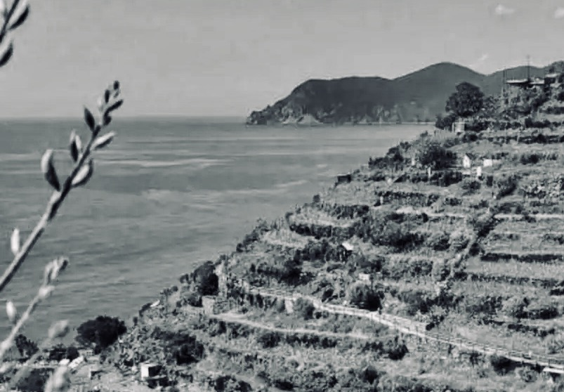

*Leggere la prima poesia degli Ossi di Seppia di Montale un secolo dopo la prima pubblicazione del libro. Forme e tensioni della poesia. Rassegna critica e movimenti di pensiero.*

## **1. La soglia e l'invito**

Il paesaggio delle Cinque Terre, nella costiera ligure di levante, offre scoscesi pendii che si risolvono nel mare, dove la costruzione dei muretti a secco ha strappato spazi per la coltivazione. Come mare e montagna coesistono nella loro disarmonia, sovrapponendo i rispettivi universi di significati,[^1] il muro coesiste con l'orto, «*quella meraviglia che poche regioni italiane possiedono \[…\], pochi metri quadrati non sempre protetti da cocci di bottiglia in cui una famiglia trovava tutto, dico tutto quello ch'era necessario per il suo sostentamento. Anche in quegli orti il dio Pan faceva capolino; ma doveva rimpiccolirsi come uno gnomo, rendersi domestico e utile, aiutare i bambini ad attingere acqua dal pozzo. Non fu mai alcionica la riviera ligure né torrenziale nel senso panico della parola. Fu piuttosto, nelle sue forme naturali, antropomorfica e squisitamente umana, sia pure in piccolo formato.*»[^2]

[^1]: Giachery, 1985: 12

[^2]: Montale, 1970: 14

L'orto è nominato, con la variante preziosa e arcaica di ‘*pomario*', al termine del primo verso di *In limine*, poesia di apertura degli *Ossi di seppia* di Eugenio Montale, nato a Genova e all'epoca dell'elaborazione del libro frequentatore delle Cinque Terre e in maniera particolare di Monteresso. Tale poesia segna l’ingresso nel libro, conferisce il titolo anche alla sua sezione iniziale comprensiva di questo solo componimento, e la sua funzione proemiale viene rimarcata dal carattere corsivo con cui è scritta. Ciò ne sottolinea la condizione di confine, di soglia dell’opera: il suo porsi sul limitare dell'esperienza che formula.[^3] Una differente versione è in un manoscritto privo di data appartenuto a Francesco Messina e donato a Vanni Scheiviller dove, con altre trascurabili varianti, porta il titolo *La libertà*, esplicitando così la propria tensione filosofica.

[^3]: Giachery, 1985: 9, 11

La fuga «*dalla rete che ci stringe*» (v.15): è questa la libertà a si riferisce in funzione gnomico-sapienziale la quartina finale, la cui immagine è direttamente connessa da Emerico Giachery al dichiarato interesse di Montale per la filosofia della contingenza di Boutroux e Bergson e soprattutto del primo. [^4] La principale idea direttrice di Boutroux era quella di decostruire sistematicamente la necessità che permette di ricavare analiticamente le leggi naturali delle scienze le une dalle altre: infatti, nel suo pensiero, esse indicano livelli diversi di realtà di cui ognuna presenta specifico principio esplicativo e schemi distinti e irriducibili. Nella loro serie risulta quindi impossibile ridurre una forma superiore e complesse, quale la vita, al legame chimico, e tantopiù alla logica e quindi al principio d'identità. In tal senso, le leggi della scienza sono *contingenti*, non necessarie: possono essere o non essere, e presentano quindi carattere di indeterminatezza. Boutroux asserisce la libertà dello spirito quale spontaneità individuale e la superiorità della religione in quanto approfondimento del significato dell'esistenza; influenzato da Leibniz e Pascal, critico di Cartesio, Kant e Comte, in rapporto con il suo predecessore Renouvier e con il matematico Poincaré, rappresenta il retroterra della rivoluzione che da inizi novecento ha scosso il determinismo meccanicista e che non ha ancora trovato sintesi tra le sue varie tendenze.

[^4]: Giachery, 1985: 10

L'interesse per Boutroux in Montale si compie, come chiarisce *Intenzioni - Intervista immaginaria,* dal 1920 al 1925, periodo che coincide con l'elaborazione degli *Ossi di seppia*, dati alle stampe in prima edizione da Gobetti a Torino nel giugno 1925; Montale è già consapevole che la poesia «*va diventando più un mezzo di conoscenza che di rappresentazione*», ma il suo intento non è quello di formulare una «*poesia filosofica, che diffonda idee*»: «*il bisogno di un poeta è quello di una verità puntuale, non di una volontà generale*», «*che canti ciò che unisce l'uomo agli altri uomini ma non neghi ciò che lo disunisce e lo rende unico e irripetibile.*»[^5] Tale pensiero implicito si scandisce internamente alla poesia, e *In limine* si colloca consapevolmente tra *attesa del miracolo* ed esigenza di cambiamento, come riconosciuto in una lettera a Paola Nicoli spedita da Monterosso il 24 agosto 1924:

[^5]: Montale, 1976: 564-565

«*È un pò difficile ch'io riesca a lavorare per ora; il mio genere è tutta un'attesa del miracolo, e di miracoli in questi tempi senza religione se ne vedono pochini. Finito il libro - e finito quasi può dirsi - o sposterò la visuale, mutando genere, o* silentium*. Non ho nessuna voglia di autovivisezionarmi di più. Ma sì, '*godi se il vento*' esiste, e la '*vetta d'albero*' è stata vista con commozione. Ora m'è rimasta fra le mani pezzi di certa* Crisalide *che spunterà fuori un giorno o l’altro...*»[^6]

[^6]: Montale, 1980: 862

*In limine* rappresenta quindi una realizzazione tarda rispetto all'assetto della prima redazione degli *Ossi*. Architettata per «*essere la summa o il congedo di tutto il resto*»,[^7] prende un valore riassuntivo e vi si strutturano in un discorso assertivo i motivi complessivi di tutta la raccolta, della quale diventa, per il ruolo conferito dal montaggio, prefigurazione ed esplicitazione.[^8] Analoga interscambiabilità tra inizio e fine è propria anche di *Riviere,* risalente al 1920 e quindi nelle prime posizioni della cronologia, che seppur considerata «*sintesi e guarigione troppo prematura*»[^9] è collocata quale testo conclusivo dell'opera.

[^7]: Montale, 1980: 862

[^8]: Marchese, 1977: 61

[^9]: Montale, 1976: 566-7

*In limine* rappresenta il passaggio che permette l'accesso al libro e compendia la visuale sulla quale si organizza, formula l'«*invito al metodo*»[^10] di una dimensione per cui la poesia sorge non in base all’assunzione di dati realistici o autobiografici, il che sarebbe incongruo rispetto agli intenti propriamente poetici dell'autore, ma esclusivamente nella dimensione metaforica del testo, per quindi compiersi attraverso una scansione personale del negativo, nella quale un accorto campionamento delle dissonanze opera attraverso una consapevole ridefinizione degli strumenti retorici e stilistici.

[^10]: Contini, 1974: 28

Il poeta trova risposta alla propria disincantata attesa del miracolo nella ricerca della possibilità di uno slancio che permetta di scoprire, nel turbato groviglio di un mondo chiuso, una '*maglia rotta*'.[^11] Passato e futuro convergono in un presente dove è possibile comporre e '*scancellare*' '*atti*' e '*storie*', nel punto dove ciò che muore è vivo e la libertà avvolge il tempo. La figura umana assente in *Meriggiare* (1916), momento iniziale della poesia montaliana dove prevale il senso antropologico del paesaggio, viene accolta *In limine* e quindi sul limitare del libro, nel suo «*piccolo formato squisitamente umano*». Infatti, l'attacco rivolge un discorso diretto in forma colloquiale e augurale ad una seconda persona, «*un tu istituzionale, l'antagonista che bisognerebbe inventare se non ci fosse*», non necessariamente riferito ad una persona concreta o ad una vicenda autobiografica ma che risulta comunque ispirato da Anna degli Uberti, villeggiante romana conosciuta a Monterosso, interlocutrice anche in *Incontro* (*Arletta* nella prima stampa su rivista), *La casa dei doganieri (*ne *Le Occasioni)*, *Annetta* (in *Diario del '72*).[^12] Alla forma verbale imperativa '*godi*' segue l'avverbio dubitativo '*se*': l'evento rappresentato è occasionale e contingente, non è una realtà stabile e necessaria; le condizioni di comunicazione sono poste dal messaggio, dove alle constatazioni del poeta si oppone il silenzio dell'*altro*, con il quale verranno identificate le aspettative.[^13]

[^11]: Forti, 1983: 59

[^12]: Giachery, 1985: 9. Nascimbeni, 1986: 58, 91, 140-1

[^13]: Fabris, 1984: 102-103

Nell'orto soffia il vento, che risveglia '*memorie*' informi e paralizzate '*in un morto/ viluppo*' (v.3-4), rinnovando '*l'ondata della vita*' (v.2), così come il respiro dell'onda che ribolle nel limine tra terra e mare, esprimendo in tal modo la teoria che presiede al movimento metaforico dell'opera (Forti, 1983: 59). È un invito a godere, ma non, come in *Invitation au vojage* (1857) di Baudelaire, con '*lusso calma e voluttà*', e nemmeno '*ordine e beltà*'.

1 *Godi se il vento che entra nel pomario*\
2 *vi rimena l'ondata della vita:*\
3 *qui dove affonda un morto*\
4 *viluppo di memorie,*\
5 *orto non era, ma reliquiario.*\
\
6 *Il frullo che tu senti non è un volo*\
7 *ma il commuoversi dell'eterno grembo;*\
8 *vedi che si trasforma questo lembo*\
9 *di terra solitario in un crogiuolo.*\
\
10 *Un rovello è di qua dall'erto muro.*\
11 *Se procedi t'imbatti*\
12 *tu forse nel fantasma che ti salva:*\
13 *si compongono qui le storie, gli atti*\
14 *scancellati pel gioco del futuro.*\
\
15 *Cerca una maglia rotta nella rete*\
16 *che ci stringe, tu balza fuori, fuggi!*\
17 *Va, per te l'ho pregato, - ora la sete mi sarà*\
18 *lieve, meno acre la ruggine...*\
\
Nella prima strofa l'opposizione semantica di '*pomario*' (v.1) e '*reliquiario*' (v.4) è legata da una rima che unisce gli estremi e raccoglie l'azione complessiva della prima strofa; gli elementi fonici della rima e soprattutto il *fonema R*, di particolare rilevanza, sono ripetuti in parole prive di nesso semantico o grammaticale.[^14] La struttura ritmica è analoga al senso lessicale: un luogo dove sono raccolti "*avanzi di ciò che andato distrutto o perduto*" (Devoto-Oli), un '*reliquiario*', si metamorfizza in uno spazio fertile, '*pomario*', presso i Romani il terreno consacrato lunga la cerchia delle mura.[^15]

[^14]: Fabris, 1984: 106

[^15]: Montano, 1978: 10

Il movimento dell'onda si propaga nella seconda strofa con la ripetizione del *fonema R*, che vanifica attraverso il condensarsi irregolare e soffocato ogni senso di pienezza associabile alla vita.[^16] Il respiro marino è riportato in terra, all'interno di un '*lembo/ di terra solitario*' (v.8-9), in rima baciata con '*grembo*' (v.7); tale associazione si verifica anche in *Crisalide*, poesia di poco successiva concorde per temi e atmosfera. Nel contesto di *In limine*, i termini sono più tellurici e maggiormente vicini all'uso dannunziano, per quel '*commuoversi dell'eterno grembo*' (v.7), sentito come '*frullo*' (v.6), movimento d'ali e quindi di vento, che induce la trasmutazione di uno spazio di chiusura in un incandescente '*crogiuolo*' (v.9) di forme, ove si compie, piuttosto che l'elevazione del '*volo*' (v.6), un pullurare ctonico, una natura onnipresente nel suo nascosto e continuo germogliare.

[^16]: Fabris, 1984: 107

Nella terza strofa '*l'erto muro*' (v.10) dichiara uno stato esistenziale di stasi; '*di qua*' s'agita, in rima interna e alternata con '*muro*' e collegato fonicamente a '*futuro*' (v.14) '*un rovello*' (v.10), piccolo cespuglio di spine, oggetto in cui si correla, in modo circostanziale e universalissimo, una condizione di «*tormento assiduo e lacerante*» degli eventi semplicemente possibili e non necessari, censurati dal gioco deterministico delle cause e degli effetti che vuole il futuro conforme a ieri e il passato schiacciato dalle nostre previsioni. La salvezza possibile si consuma nell'«*infinita attesa*»[^17] di un incontro casuale con un qualche spettro della nostra affezione, '*fantasma che ti salva*' (v.12). Il *fonema R*, ripetuto tre volte sul primo verso, si rarefà sui seguenti, che ne contengono uno per ognuno, accompagnando immagini più dilatate e tessendo un livello di corrispondenze sonore che collega quanto il significato separa.

[^17]: Contini, 1974: 28

La massima concentrazione sonora, dove alle *R* presenti in numero di 11, contro le 8, 8, 4 delle strofe precedenti, si affianca il massimo materializzarsi degli oggetti nonché l'incalzare delle forme verbali imperative,[^18] è nella quarta e ultima strofa. La consapevolezza della necessità lascia sulla voce del poeta, legata da una rima tronca con '*fuggi*' (v.16), aspra '*ruggine*' (v.18), senso di corrosione esistenziale: non rancore ma piuttosto angoscia, offerta in sacrificio per l'altrui gioia. E all'interlocutore si affida il compito di varcare, con un salto, la soglia che separa dalla libertà, '*la maglia rotta nella rete*' (v.15).

[^18]: Fabris, 1984: 107-109

## **2. Ritmi e silenzi**

Le quattro strofe di *In limine* alternano quintine e quartine, svolgendo una cadenza ritmica al contempo di apparente regolarità e di irregolarità controllata. A livello metrico, la prima strofa presenta al v.1 un endecasillabo ipermetro, al v.2 un endecasillabo *a majore*, seguiti al v.3 e 4 da due settenari che svolgono un incisivo *enjambament*, mentre il decasillabo al v.5 è dato dall'accostamento di due quinari separati da una virgola. Nella seconda strofa, un dodecasillabo al v.6, due endecasillabi ipermetri ai v.7 e 9, e un endecasillabo *a majore* al v.8, unito al verso successivo da un *enjambement*. Nella terza strofa, al v.10 c'è un dodecasillabo, al v.11 un settenario in *enjambement* con l'endecasillabo *a majore* del v.12, e un altro è svolto dall'endecasillabo ipermetro al v.13 con l’endecasillabo *a minore* del v.14. Nella quarta strofa, l'*enjambement* lega i due distici: l'endecasillabo ipermetro al v.15 all'endecasillabo spezzato nel suo movimento interno dalle virgole del v.16, il dodecasillabo spezzato del v.17 al dodecasillabo dato da un quinario e un settenario separati da una virgola del v.18.

In tale movimento metrico emerge una continua oscillazione dell'endecasillabo a eccedere il proprio ritmo e a ricostituirsi all'interno del verso. Al riguardo, Ottaviano Giannangeli ha coniato il termine di *dodecasillabo montaliano*, irriducibile alle forme tradizionali dell'endecasillabo regolare e del doppio senario. Il poeta, con consapevole esercizio critico, seleziona e modella le parole alle intime esigenze espressive. Dove Carducci sperimentava ritmi "barbari" all'interno delle forme tradizionali, adattandovi le parole attraverso elisioni e troncature, Montale fa prevalere, rispetto al vincolo dell'accento metrico-sillabico del verso, la concentrazione sull'accento ritmico della parola «*celebrata nella sua intierezza*» e quindi perlopiù aliena agli aulicismi letterari.[^19]

[^19]: Giannangeli, 1987: 93

Il dodecasillabo montaliano ricorre come impronta personale della versificazione, e generalmente si alterna nell'organizzazione strofica a versi più brevi, riconducibili a settenari,[^20] conferendo un andamento narrativo cadenzato da tessiture ritmiche di tempi dispari, nascoste sincopi e improvvisi mutamenti, anche grazie all'uso di virgole e altri segni grafici che assumono valore di pause interne al verso, nonché all'intervenire della tecnica dell’*enjambement*.

[^20]: Briganti, 1984: 181

L'*enjambement* elude il verso ritmico e prolunga la sua unità sintattica al verso seguente. È una anomalia linguistica e retorica la cui frequenza è emblematica di una crisi in atto e di una complessità culturale, che si profila storicamente parallelamente al manierismo pittorico e al contrappunto musicale: nell'*enjambement* avviene come nella fuga musicale, e la partitura prosegue nell'esecuzione del tema in una diversa sezione ritmica.[^21] L'*enjambement* è la tecnica del silenzio, una pausa artificiale nel mezzo di una frase: respiro e pensiero sono simultaneamente sospesi alla fine del verso. Il ritmo si rallenta, esita su un termine, e quasi si sorprende di conoscere una grammatica che lo lega ad un altro, appena sotto di sé.

[^21]: Giannangeli, 1987: 27-9

L'utilizzo dell'*enjabement* in Montale è frequente quanto peculiare, e sembra seguire il movimento del paesaggio, dove si rincorrono dislivelli e bruschi tornanti, provocando ansia, delusione, sorpresa. La poesia sperimenta se stessa, fissa la brevità dell'evento su un sostantivo separato dal suo attributo, com'è nel tipo classico dell'*enjambement*, e si attarda su un pronome sciolto dal suo sostantivo o su una congiunzione qualsiasi, blocca l'azione di un verbo: se precisa i termini, ritarda la percezione, prolungando così i tempi di ogni verso e moltiplicando l'attesa di ogni parola. Due parole congiunte dal senso sono divise da un diverso rilievo dato all'organizzazione del testo: la lettura ha il compito di comprendere quanto nella pausa è taciuto e chiede ascolto.[^22]

[^22]: Musumeci, 1972: *passim.*

## **3. Il paesaggio e il respiro**

*In limine* formula un esperienza del negativo funzionale alla scoperta di un'occasione positiva, valutata con una sentenza gnomica. Così come descritto in *Intenzioni*, la «*spinta*» alla poesia si traduce in gesto poetico compiuto, varcando la soglia dell'esperienza individuale nella tensione verso l'io poetico e la ricerca di una «*verità puntuale*».[^23] Il '*pomario*' si può configurare anche quale metafora del libro, la cui dinamica è mossa dall'oggettivazione dei moventi psichici, '*frulli*' e '*fantasmi*', che il '*vento*' porta con sé,[^24] sviluppando un ampio metadiscorso poetico dove l'ispirazione ritrova il senso del proprio ètimo nel '*vento*' che anima il '*viluppo*' inconscio e smuove le memorie del '*pomario*' verso nuove possibilità di salvezza singolare lasciando germinare la poesia,[^25] che si rinnova con i *rottami* (titolo primitivo tanto di *Meriggiare* quanto della raccolta) della tradizione, in aderenza ad una lingua prossima a quella d'uso. Montale, consapevole del carattere storico delle parole, è intenzionato a «*torcere il collo*» all'eloquenza aulica pur se a rischio di una «*controeloquenza*»[^26] perlopiù ispiratata ad una "ricca semplicità" e ad un "savio disincanto".

[^23]: Montale, 1976: 566, 564

[^24]: Ramat, 1972: 494

[^25]: Giachery, 1985: 22

[^26]: Montale, 1976: 565

Come chiarisce l'articolo *Stile e tradizione* pubblicato parallelamente agli *Ossi* sul Baretti, la rivista dell'editore Piero Gobetti, istanza fondamentale è lo «*sforzo verso la semplicità e la chiarezza, a costo di sembrar poveri*», e quindi la ricerca di «*una lingua d’intesa che ci leghi alla folla per cui si lavora, inascoltati*», capace di proporre al lettore una sorta di collaborazione con il fine di istituire «*un centro di risonanza che permetta alla poesia di tornare ancora a costituire il decoro e il vanto del nostro paese, e non più una solitaria vergogna individuale*». Su queste basi, per tradizione non deve intendersi «*un morto peso di schemi, di leggi estrinseche e di consuetudini - ma un intimo spirito, un genio di razza, una consonanza con gli spiriti più costanti espressi dalla nostra terra*»; per quanto riguarda lo stile, esso «*ci verrà dal buon costume. Se fu detto che ii genio è una lunga pazienza, noi vorremmo aggiungere ch'esso è ancora coscienza e onestà.*»[^27]

[^27]: Montale, 1925a: *passim*

In consonanza con tale programma, il '*vento*' supera ogni ostacolo e risveglia dal torpore uno spazio chiuso e consacrato alle memorie, '*rimena l'ondata della vita*'. Il vento quindi torna negli *Ossi* evocando risonanze nel paesaggio (*Corno Inglese*), porta con sé la distruzione (*L'agave sullo scoglio: Tramontana*), viene a levarsi dopo la rottura dell'accordo immediato col mondo (*Fine dell'infanzia*) e lo spargimento in forme inerti del '*fuoco impetuoso*' che lo animò (*Sul muro grafito*). Arriverà anche oltre, nel libeccio della *Casa dei doganieri* (nelle *Occasioni*), e diventerà poi *La bufera* (in *Nella bufera e altro*); intanto, il vento respira tra gli *Ossi* testimoniandone la folta circolazione intertestuale interna, per la quale la contiguità tra i componimenti è funzione del carattere unitario dell'universo immaginativo proposto. In tale prospettiva, se il significato complessivo dell'opera è superiore ai significati parziali dei singoli momenti presi autonomamente, e il titolo *Ossi di seppia* indica la contrazione di un insieme nel suo frammento più elementare suggerendo una metaforica prevalenza della parte sul tutto, il testo scelto quale inaugurale si carica di risonanze che incrementano la portata semantica delle singole parole. Così, ogni parola del componmento indica una tematica che si sviluppa attraverso i diversi contesti dell'opera.[^28]

[^28]: Giachery, 1985: 12-13

Il vento è assimilabile all'archetipo del soffio del mondo delle religioni primitive, all'*anèmos* di Anassimene, allo *pneuma* degli Stoici, allo *Spirito Santo* cristiano. Una traduzione moderna dello pneuma, che attraversa come *raison* le stesse forme della conoscenza scientifica, è nell'*esprit* di Boutroux, «*anima invisibile e presente che fa muovere le* ressorts \[il cui significato letterale è quello tanto di molle quanto di *competenze*, *giurisdizioni*\] *del mondo*».[^29] In Bergson esso si svincola dalla finalità e prende configurazione nell'*élan vital,* e a detta di Arshi Pipa il vento improvviso che in Montale '*rinnova l'ondata della vita*' è immagine della spontaneità dell’*élan vital* attivo al fondo della natura e del quale il meccanismo e l'abitudine non sono che una fase di cristallizzazione. «*La percezione della vita che si rinnova ad ogni istante*»,[^30] l'eterno flusso che anima ogni singolo momento, si ripropone poi in *Crisalide* (v. 10-13) come lo '*sbigottimento*' di ognuno di essi capace di portare '*nuove fronde*' in quell''*estremo angolo d'orto*' dove '*la vita*' '*viene ad impetuose onde*’.

[^29]: Boutroux, 1913: 144

[^30]: Pipa, 1987: 844

L'oggetto concreto è «*carico di forza simbolica*» e si configura pertanto quale concentrazione di simboli. Il muro è protezione e ostacolo, l'orto dominio e prigione:[^31] il riparo offerto esclude la libertà, ma dispone alla sua ricerca. *Chiusura* e *apertura* sono colti in un gioco non conciliativo che lascia trapelare i lampi di una liberazione possibile, testimonianza dell'isolamento e «*disarmonia della condizione umana*»,[^32] metafora del «*cerchio chiuso del finito*» e della concezione deterministica del mondo,[^33] indice di una ricerca della salvezza individuale all’interno della "*cittadella della memoria”.*[^34] Ciò è anche segno dell'ambiente di Genova e Monterosso, sentito come provinciale e oppressivo e in seguito abbandonato con una lenta operazione di sradicamento e mai più recuperato.[^35] Da parte sua, il muretto a secco non esaurisce la portata semantica del muro, ma ne costituisce il dato oggettuale; vederlo come immagine del determinismo, pur non pretendendo ad assolutezza, precisa la portata universale di un sentire.

[^31]: Campailla, 1984: 153-4

[^32]: Montale, 1976: 569

[^33]: Fagone, 1976: 123

[^34]: Marchese, 1977: 18

[^35]: Barile, 1966: 258

## **4. Correlare e sentire**

La «*barriera fra interno ed esterno*» è traccia del dualismo di natura e spirito. La «*campana di vetro*»[^36] di cui porta testimonia Montale comporta un'affollata rappresentazione di oggetti che vanno oltre ogni piacere contemplativo e qualsiasi indugio descrittivo: la distanza, la separazione tra io e non-io è condizione di obiettivazione e ricerca dell'espressione assoluta, partecipazione sensoriale priva di effusione sentimentale privata. La parola mantiene incisività visiva, una petrosità più di stile che di contenuti, e porta alla presenza una realtà precisa e puntuale all'interno di una durata che si frammenta risolvendosi in memoria ed entropia. Se il miracolo sfugge, il ricordo si nega: il rapporto con le cose resta incerto, impossibile l'idillio. In un'ansia di luce non consolatoria, la poesia è ascolto e improvvisa rivelazione luminosa e numinosa. La parola è esperienza di libertà, prossima quanto precaria.[^37]

[^36]: Montale, 1976: 566-567

[^37]: Getto, 1966: 124-133

La parola riscatta le cose dall'oscurità: eppure, non rende loro una certezza, ma piuttosto ne riconosce l'enigma. Erano stati gli stoici Pirrone e Sesto Empirico ad esserire che le cose possono comprendersi con *segni indicativi* se giungono all'evidenza dall'oscurità, e con *segni rammemorativi* laddove oscure in quanto assenti e per natura evidenti. Come rimarca Piero Bigongiari, la teoria stoica dei segni è implicita nelle immagini montaliane, immerse nella *durata*.[^38] *Segno rammemorativo* è quindi la parola specifica ad alto contenuto informativo, che tenta di organizzare il mondo attraverso un vasto e preciso campionario di tecnicismi e preziosismi. *Segno indicativo* è invece la parola tipica, il cui carattere visivo tende all'individuazione dell'oggetto in un orizzonte comune e quotidiano, come risposta all'esigenza di comunicazione posta nel poeta da una oggettività irriducibile, che prescinde dalla memoria e ed è condannata alla sua corruzione: in ogni momento è data, in ogni momento conosce la propria fine.[^39]

[^38]: Bigongiari, 1970: 12

[^39]: Rosiello, 1965:141

Tale impianto teorico ci riporta alla teoria dei segni della linguistica di De Saussure, che, oltre che tra *significato* (caratteri concettuali) e *significante* (immagine acustica), distingue tra *segni denotativi* (impiegati in senso letterale e informativo) e *segni connotativi* (usati in un senso figurato capace di ampliare i significati); il recupero della concezione stoica se ne distingue laddove l'intento diventa quello di andare oltre al legame tra concetto e immagine acustica e così proporsi di indagare il rapporto della parole con le cose e quindi con il tempo.[^40] Al riguardo di parole e cose, Foucault arriverà a riconoscere che l’*episteme* implicita della modernità considera che esse abbiano perduto il proprio legame reciproco, in quanto il linguaggio non rappresenta l'inquadramento preliminare delle cose e il soggetto conoscente è giunto ad esprimere trascendentalmente le condizioni di possibilità del sapere.[^41] Il linguaggio diventa così autonomo rispetto alla realtà oggettiva ed è esso stesso a parlare. Con Mallarmé e le poetiche simboliste, ad evocare la cosa è il suono e la parola conquista capacità creativa nella fluttuazione inconscia della «*suspensión vibratoire*». Montale, pur aderendo a tale visione, continua a interrogarsi, per quanto prossime al crollo in risposta ad un “ordine superiore”, rispetto a '*le cose che non chiedono/ormai che di durare, di persistere/ contente dell’infinita fatica*' (*Clivo* v. 35-37): tale durata e tale persistenza chiamano quindi all'appello una teoria dei segni quale quella stoica, particolarmente legata alla temporalità.

[^40]: De Saussure, 1967: *passim*

[^41]: Foucault, 1970: 13, *passim*

Dove tempo e cose sono irreversibilmente consumate dall'entropia, un rifugio è rinvenuto nell'intensità degli eventi dell'attimo e nella persistenza della memoria, e quindi nella fedeltà alla *verità puntuale* e alla «*fermezza espressiva della parola*».[^42] La desiderata rottura della necessità si consuma così nell'attesa del *miracolo*; la risorsa all'entropia è nella nominazione degli oggetti.[^43] Montale rifiuta parole vaghe e sceglie termini che correlano oggetti particolari e precisi, accetta il carattere congetturale e contingente della conoscenza e del linguaggio sviluppandone ad un tempo il valore di indagine e di espressione con particolare attenzione alla loro capacità di conferire forma.

[^42]: Cambon 1963: 117-8

[^43]: Marchese 1977: 60-62

La disarmonia con la realtà non permette un uso strumentale del linguaggio ma piuttosto lo sperimenta come fluttuante ed emblematico, sviluppandone gli aspetti fonetici e gli aspetti visivi. Fuori dalle cristallizzazioni dell'uso linguistico e del descrittivismo naturalista, la parola si configura come *«presenza assoluta»*, nella quale il senso si unisce al suono, il ritmo al significato.[^44] La conoscenza permessa dalla poesia si compie così attraverso la scelta attenta e continua dei termini possibili. L'oggetto si configura così quale *segno espressivo* di cui le parole tentano il disegno attraverso l'atto di correlazione del soggetto.[^45]

[^44]: Bonfiglioli, 1963: 48

[^45]: Manacorda, 1969: 20

Il momento più rappresentativo di tale tendenza è nel "*correlativo obiettivo*" di Eliot. L'espressione artistica di una emozione particolare è cercata in una formula che contenendo «*una serie di oggetti, una situazione, una catena di eventi*»[^46] si fosse conclusa in una esperienza sensibile capace di evocare immediatamente l'emozione. Viene così correlato in un oggetto continuo il discreto di partenza: *The Waste Land* (1922) è il luogo del compatto, dell'inscindibile, della rivelazione totale del linguaggio nella sua significatività.

[^46]: Eliot, 1971: 135

Montale cerca la rivelazione per lampi. Questi lampi sono visti da Bigongiari quando i termini compiono delimitazioni di significato correlandosi con un reale continuo. Il flusso sintattico tenta l'incontro con le cose disponendo delle parole, nominando gli oggetti nel ritmo del suo respiro. Il moto sintattico lineare del linguaggio diviene centripeto, parole di ogni provenienza si specificano contestualmente rispetto ai significati possibili, elementi descrittivi sparsi tendono alla concentrazione del significato. Scomposizione analitica e folgorazione improvvisa individuano il "*punto nella serie caotica*" con cui segno e cosa significata si incontrano, all'estremo del '*seguitare*' (*Meriggiare*, v.16) della vita, in una geometria completamente funzionale ai fenomeni che vi si svolgono, nella quale l'infinito precipita in punti distinti.[^47]

[^47]: Bigongiari, 1970: 16

L'*atto di correlazione* montaliano non è allegorico come il correlato eliotiano e si sviluppa indipendentemente dal suo esempio. Non allude ad una connotazione codificata e segreta attraverso una denotazione che poi verrà annullata, non è codificato da una razionalità ma piuttosto la instaura. Il suo fondo è strettamente esistenziale, non segna una determinazione gnoseologica o emotiva operante dal soggetto all'oggetto: piuttosto, indica la constatazione di un dato quantitativo, oggettivamente qualificato in una essenza che si rivela, '*traluce*' e '*vapora*', nell'esistenza che la sopporta.[^48]

[^48]: Bigongiari, 1970: 18

Alla costituzione di questo *correlativo esistenziale* montaliano fornisce un contributo la filosofia della contingenza. Il punto d’attacco è dove Boutroux e Bergson avevano confutato, in base all'originarietà qualitativa dell'atto del decidere, i criteri quantitativi della psicofisiologia di Wundt nelle analisi seriali dei fenomeni psichici.[^49] Da parte sua, Montale opera una *qualificazione* degli oggetti accompagnando la serie percettiva al *ritmo quantitativo* delle manifestazioni fenomeniche. Nella sua paradossale modernità, è cosciente che «*ragione dell'arte si differenzia rispetto alla razionalità scientifica per le intenzioni, mantenendo lo stesso meccanismo*», e sa che un impiego razionale è vigile anche in espressioni poetiche quali il surrealismo che si affidano ai movimenti subconsci.[^50]

[^49]: Boutroux, 1913: 122-3; Bergson, 1959: 113-4

[^50]: Montale, 1976: 591

## **5. I fenomeni e gli elementi**

La psicofisiologia e la psicologia sperimentale di Wundt avevano supposto un parallelismo tra il pensiero e il movimento corrispondente, elaborando una scienza basata su formule di previsione che tendeva alla spiegazione delle condizioni meccaniche e fisiche misurando i diversi fenomeni psichici attraverso l'individuazione di quantità omogenee. Tale scienza permette regolarità e misura e impiega a proprio favore la legge di conservazione dell'energia psichica, che presuppone un equivalente meccanico di sensazioni, idee e decisioni, rendendo così possibile una quantificazione di qualità eterogenee e complesse quali il ricordo. Tuttavia, questa impalcatura teorica viene smontata nella sua pertinenza all'analisi seriale dei fenomeni psichici da Boutroux laddove le tre forme della necessità, *analitica, sintetica o empirica*, alle quali la psicofisica dovrebbe rispondere per avere condizione di legge positiva, sono confutate dal carattere *contingente*, irriducibile a qualsiasi antecedente, compiuto proprio dall'atto volontario su cui si appuntano le analisi di Wundt.[^51]

[^51]: Boutroux, 1913: 115-6

L'influenza di tale questione risulta in Montale piuttosto obliqua ed è piegata alle proprie esigenze espressive. Infatti, i criteri quantitativi che per i contingentisti dimostrano il carattere paralogistico del parallelismo psicofisico, divengono nella sua poesia, nella quale la volontà si converte in *irresolutezza* e l'*abitudine* predomina sulla decisione, uno strumento linguistico di indagine della correlazione continua che allontana e avvicina gravitazionalmente le sfere di soggetto e oggetto, e operano una *qualificazione* degli oggetti accompagnando la serie percettiva al *ritmo quantitativo* delle manifestazioni fenomeniche.[^52] *Chose continue* di Boutroux e *dureé* di Bergson si mantengono comunque alla base del *continuum* montaliano, che si articola sulla stessa implicazione contingentista, di marca leibniziana, della qualità nel soggetto, e della quantità nell'oggetto, dove principio delle cose è la qualità concepita come dinamica alla «*percezione distinta*»[^53]

[^52]: Bigongiari, 1970: 11

[^53]: Leibniz, 1992: 137

Per Boutroux «*un fenomeno non ha un un punto preciso dove inizia o finisce realmente*», ipotesi che sarebbe legata a quella degli istanti indivisibili e quindi contraria alla «*natura del tempo*»;[^54] il tempo si configura per Bergson quale esperienza qualitativa interiore che si «*incrosta in superficie*» in oggetti, poi in abitudini motorie e azioni virtuali, e quindi in una successione di stadi «*ciascuno dei quali preannuncia quello che segue e contiene quello che lo precede*».[^55] In Montale il tempo viene colto nelle forme del discontinuo,[^56] lo spazio è un'allegoria razionalmente scandita; la durata si frantuma in istanti, le cose si contraggono nella presenza.[^57] L'affollamento di oggetti, le abitudini e le disposizioni legate a percezioni o ricordi, la rappresentazione spazializzata del tempo, insomma la quantificazione della qualità in un sistema chiuso e statico, viene affrontata per rinvenire nel linguaggio la dinamica dell''*ordegno universale*' (*Mediterraneo VII*, v.13), tendendo a nominare la qualità specifica delle varie quantità discrete, ognuna misura di se stessa e indice della proprie possibilità.[^58] Se in accordo con Leibniz il possibile esprime la tendenza a dispiegarsi,[^59] è in sintonia con la fisica contemporanea il disegnarsi del reale sulla curva del possibile[^60] ed è una «*saggia economia di oggetti e qualità*» a permettere l'evidenza.[^61]

[^54]: Boutroux, 1925: 24

[^55]: Bergson, 1995: 46

[^56]: Pipa, 1978: 845

[^57]: Piero Bigongiari, 1970: 18

[^58]: Bigongiari, 1970: 13. Bodei, 1995: p. 7

[^59]: Leibniz, 1992: 143

[^60]: Piattelli Palmarini, 1976

[^61]: Macrì, 1996: 439

*In limine* esemplifica tale movimento: il '*commuoversi dell'eterno grembo*', il continuo germinare e dispiegarsi delle forme, è il correlato del '*frullo*' che scuote la stasi: l'oggetto percepito attraverso la parola tipica e comune allude alla qualità del *segno rammemorativo*, realtà assente ma di per sé evidente, tesa alla organizzazione di un mondo di significati. Il '*crogiuolo*' si compone nel correlarsi dinamico di oggetto e soggetto, che scuote l'intreccio sterile delle memorie. Per il contingentismo, tra soggetto e oggetto esiste un rapporto di «*inclusione reciproca*»[^62]: la materia possiede una forma immanente che tende alla manifestazione nel pensiero,[^63] la realtà è «*un'intreccio universale, una combinazione reciproca di cambiamento e permanenza*».[^64] Dal '*crogiuolo*' della realtà emergono immagini a cui la poesia affidata la missione salvifica di liberazione degli archetipi.[^65]

[^62]: Boutroux, 1919: 55

[^63]: Boutroux 1913: 27-28

[^64]: Boutroux, 1913: 27-28

[^65]: Bigongiari, 1970: 15

I quattro elementi alchemici, riconosciuti da Bachelard quali fisiologici all'universo immaginativo, sono individuati da Giachery nel testo di *In limine*. L'aria e la terra, nominati come '*vento*' e '*lembo/ di terra solitario*’, possono venir ricondotti a *segni indicativi*; invece, a *segni rammemorativi* il fuoco e l'acqua, evocati come fusione nel '*crogiuolo*' e '*ondata della vita*’, dove in una forte metafora entra il mare, "*deuteragonista continuo ed obbligato di tanta parte degli Ossi*”,[^66] associato ai campi semantici del tempo.[^67] '*Vita*' compare alla fine del distico iniziale, anticipata a sciarada nelle allitterazioni, e non in rima; nei versi successivi la morte viene attribuita all'informità delle '*memorie*', e collegata da una rima interna con '*orto*', condotto in una continua trasmutazione di forme. L'orto, quale archetipo del *temenos*, recinto sacro, è animato dallo *pneuma*, il principio vificatore riconosce la propria complementarietà con la morte così come il viluppo è informità e al contempo fertilità mantenendo quella variabile continuità capace di continue trasformazioni della *hyle*, materia caotica originaria.[^68]

[^66]: Giachery, 1985: 13

[^67]: Graziosi, 1971: 156-8

[^68]: Fabris, 1984: 112-113

La terra è la sede dell'esistenza, il vento è il respiro che dà vita, il fuoco è potenza che crea, trasforma e conserva, l'acqua l'illimitata libertà. All'interno del muro vento e fuoco rievocano il movimento dell'onda, il '*rovello*' si muta in miracolo, questo nel suo fallimento, e un'altra volta in interrogazione e ricerca. Questa vasta metafora elementale e la loro reciproca trasmutazione[^69] costituisce il riferimento centrale e la base del discorso poetico degli *Ossi* e ne rappresenta l'elemento cosmico indifferenziato, individuato in una natura implacabile che preannuncia una liberazione qualitativa.[^70] Montale elabora il dualismo tra soggetto e oggetto correlando dati empirici e sensi riposti: lo spoglio dei dati quantitativi della percezione è realizzato al fine di rinvenire nel turbato meccanismo della natura una libertà concepita, laicizzando l'esigenza di rivelazione di Pascal, come *miracolo*, evento irriducibile alle forze in campo.[^71]

[^69]: Bellucci, 1977: 5

[^70]: Macrì, 1996: 434

[^71]: Pascal, 1962: 360 (fr. 812)

## **6. Il miracolo e la parola**

L'orto da '*pomario*' viene riconosciuto come '*reliquiario*' e quindi da '*lembo*' si metamorfosa in '*crogiulo*', nel quale si compie il costante ritorno alle origini in risposta '*al commuoversi dell'eterno grembo*', psicologicamente metafora del testo stesso, luogo di composizione, di esperimento e trasformazione dei campi del possibile che ha forma ne '*le storie, gli atti/ scancellati pel giuoco del futuro*' (v.14). ‘*Al di là*’ è la figura topica, con tutte le sue varianti, della '*maglia rotta nella rete*' (v.15), intuita e suggerita ad altri. Compito della poesia è inventariare gli oggetti interni alla condizione di chiusura e rianimarli con un discorso che aderisca al loro livello d'esistenza.[^72] Le parole rinviano continuamente significati alle cose, tentando di fermarle nella loro oggettività, o richiamandosi alle loro tracce nella memoria, eppure non si identificano con esse: per quanto in modo paradossale e critico, Montale resta consapevolmente moderno, dimostrando altresì quanto la tradizione rappresenti per lui non uno schema, ma una consonanza.

[^72]: Ramat, 1972: 489

L'imprevedibilità e la precisione della parola sono ragione della sua capacità di nominazione, pronta a salvare ogni cosa per poi dissolvere tutto.[^73] Il carattere centripedo del linguaggio di Montale è nella tensione a muoversi in una continua traslazione di significati. Le parole testimoniano l'esistenza di cose significate, ma piuttosto che identificarsi con queste attestano la *disarmonia* del poeta rispetto al mondo; dove le cose tendono alla loro corruzione, le parole invertono questo movimento di fuga tentando una definizione che, se precisa e puntuale, è pur sempre provvisoria e contingente, evidenziando quello stesso irriducibile dinamismo rispetto al quale rappresentano l'espediente comunicativo.

[^73]: Giannangeli, 1987: 74-6

In un contesto esistenziale drammatico e in una concezione linguistica che sperimenta l'incertezza del reale, viene ad esprimersi la concezione contingentista dell'impossibilità di realizzare, nel mondo dove ogni cosa è distinta e in relazione reciproca con tutte le altre, la necessità già dal livello formale del *principio d'identità*.[^74] Per Boutroux le definizioni logiche sono sintesi a posteriori del rapporto della parte con il tutto, convenzionali e mai definitive ma legittimate dall'analogia tra natura e spirito.[^75] Per Montale, il cui pensiero si legittima nell'espressione poetica, l'osservazione della cosa nelle proprie determinazioni particolari si compie internamente alla trama continua del reale proprio attraverso la discontinuità e l'eterogeneità di ogni nozione impiegata, per cui si attinge ad un vasto repertorio di vocabolari: poetici, tecnici, geografici, colloquiali, tentando una lingua prossima a quella per coloro per cui, pur se inascoltati, si lavora.

[^74]: Boutroux 1913: 8; 1918: X; 1925: 12

[^75]: Boutroux 1913: 30-4

La capacità cognitiva del linguaggio diventa in tal modo funzione dell'inesauribile traslazione di significati posta in essere dall'utilizzo di termini specifici e distinti, il cui confronto si svolge per similiarità e contrasto. La realtà è un perenne dispiegarsi di novità. L'orto che si trasmuta è la propria stessa metamorfosi, compiuta attraverso variazioni di significato e concatenazioni analogiche. Ogni parte conserva qualcosa di più del tutto al quale potrebbe essere riaccostata in base a rapporti logici di contenenza. Nell'incrocio dei campi semantici entra in gioco la metafora, le cui soluzioni imprevedibili permettono continuo incremento delle capacità di comprensione. La metafora non descrive: traccia intersezioni al livello generativo del linguaggio. Da parte sua, il simbolo diventa espressione, totale e inesauribile, della qualità di un oggetto reale, delle possibilità di significato di una cosa in cui si concentri un sentire la quale si configura a sua volta quale simbolo. Il poeta tende al «*più definito correlativo della propria esperienza interiore*», ad un'arte «*incarnata nel mezzo espressivo*», lavorando il poema come un «*oggetto*». La «*resistenza della parola*» trova corrispondenza in «*una passione fatta cosa*».[^76]

[^76]: Montale 1976: 560

Nella risonanza della parola nella cosa e nel manifestarsi della cosa nella parola si concentra '*il miracolo, la libertà,/ il fatto che non era necessario*' (*Crisalide*, v.66-67). La parola resiste di fronte '*alle forme/ della vita che si sgretola*' (*Non rifugiarti nell'ombra*, v.7-8), portando al riconoscimento di un nome, precario quanto preciso: in tale nome traluce il simbolo della cosa. Una realtà dinamica, in cui niente è mai compiuto e tutto è sempre pronto a giungere alla percezione, dove '*tendono alla chiarità le cose oscure*' (*Portami il girasole*, v.5),[^77] è conosciuta attraverso illuminazioni improvvise, che portano a coincidenza la percezione con il sottrarsi delle cose dall'oscurità del semplice possibile, con il quale il reale ha un rapporto di contingenza.[^78]

[^77]: Bodei, 1995: 7

[^78]: Leibniz, 1992: 162-3

Il possibile per Leibniz implicava l'esistenza di fatto;[^79] per Boutroux è implicato in ogni fatto costitutivamente contingente.[^80] L'armonia prestabilita di Leibniz, sostanzialmente mantenuta da Boutroux, risolve il rapporto tra possibile e reale con il criterio di ragion sufficiente, e tra i compossibili emerge l'esistenza. Invece, per la radicale disarmonia testimoniata da Montale, le parti del mondo concepito quale rappresentazione sono in un rapporto finito e condannato all’entropia:[^81] l’esistenza è per propria natura esitante, incerto il mondo nella sua stessa costituzione fisica. E dove il passare del tempo si scandisce nelle forme del paesaggio, esso si risolve nel dissolvimento analitico delle forme: come nell'impressionismo pittorico e musicale, '*in un fluire di tinte*’ e, analogamente alle poetiche simboliste, nello '*svanire*' (*Portami il girasole*, v.6-7).[^82] Il destino del tempo è uno spazio vuoto, nel quale le possibilità si mutano in radicale impossibilità e che oscilla tra vuoto di cose e annullamento meditativo.

[^79]: Leibniz, 1992: 167-8

[^80]: Boutroux, 1913: 16

[^81]: Manacorda, cit.: 7

[^82]: Montale 1976: 563; 1980: 41

## **7. Il nulla e la legge**

Il nulla si impone nelle forme di quell'esperienza fondamentale che di lì a poco verrà definita da Heidegger come «*essenziale impossibilità di determinazione*»:[^83] deiezione, angoscia, corrosione, che corrisponde alla «*constatazione della radicale contingenza dell'essere finito*» rintracciata da Fagone in Montale.[^84] In tale limite l'uomo è gettato. Il destino di un'epoca è scelto nell'accettazione della problematicità individuale, l'uomo è libero nell'esistere quale «*essere per la morte*».[^85] Il tempo è l'essere su cui l'esistente si interroga: l’istante tra l’angoscia del passato e l’orientamento al futuro. Nelle cose si manifesta la loro stessa impossibilità d'essere. L'esistenza ha il proprio progetto essenziale nella comprensione della fondamentale impossibilità di esistere. L’essere dell'ente è il nulla. L'esistenza ha costitutiva apertura nel trascendere verso il mondo, le cui cose non sono l'essere ma vi rimandano. La ricerca di fondamento scopre l'assenza di questo stesso fondamento: *Abgrund*.

[^83]: Heidegger 1959: 18

[^84]: Fagone, 1976: 122

[^85]: Heidegger 1976: 323

In una riflessione più avanzata, Heidegger concepirà l'essere come dono che si occulta e si disvela quale verità eventuatasi nel *dire poetico*, che nomina l'essere delle cose attraverso il loro apparire, di cui l'uomo è silenzioso ascolto e possibilità di esperienza.[^86] Montale non può certamente aver già letto quanto Heidegger non ha ancora scritto, ma in qualche modo ne ritrova i temi in un dialogo a distanza nel quale inevitabilmente ambedue rispondono alle istanze esistenziali e poetiche del proprio tempo, e sembra suggerire come le fondamentali esperienze di corrosione, angoscia e deiezione possano sciogliersi nella direzione del *dono di sé*. Quindi, nella oblazione e nell'offerta, sostanzialmente in una coesistenza che riassuma il significato di *aver cura*, aiutare gli altri a realizzare se stessi e ad essere liberi.[^87]

[^86]: Heidegger 1988: 43

[^87]: Heidegger 1976: 158

Con la prima stampa di *Sein und Zeit* del 1927 l'esistenzialismo da corrente culturale si fa interrogazione ontologica, indagando sull'essere e le sue categorie; l'anno successivo, esce per Carabba la seconda edizione degli *Ossi*, la cui introduzione di Gargiulo ne esplicita la denuncia della «*corrosione critica dell’esistenza*»;[^88] il riferimento al "mondo come rappresentazione", e al suo inganno da dissipare, costituisce una diretta citazione da Schopenhauer; l'interesse per le filosofie di Croce e Gentile, e particolarmene alla «*decifrazione*» della teoria dell'*atto puro*, copre parte consistente della sua formazione.[^89]

[^88]: Gargiulo, 1958: 45

[^89]: Montale, 1976: 564-5

Se tali riferimenti contribuiscono a costituire il clima culturale nel quale l'opera giunge a maturazione, l'influenza filosofica diretta e dichiarata della prima stagione poetica montaliana è rappresentata dal contingentismo di Boutroux. Il cui pensiero possiamo anche scandirlo in tali componenti: il dualismo tra materia e spirito costituisce la condizione della loro integrazione nei diversi mondi di organizzazione gnoseologica delle scienze; soggetto e oggetto e qualità e quantità si articolano in sfere di diverso livello di complessità, concepite quali formazioni storiche e come cammino ascensionale dalla necessità alla libertà; il reale è un continuo miracolo di risoluzione del superiore nell'inferiore. L'integrazione tra natura e spirito sancita dalle leggi della natura rappresenta comunque una tensione spontanea e un compito inderogabile, la cui realizzazione, sempre parziale e provvisoria e frutto di un continuo adattamento delle cose a costruzioni simboliche, è raggiungibile soltanto nella religiosità di una «*moralità reale*» concepita quale attivo *dono di sé*.[^90]

[^90]: Boutroux, 1917: 47; 1919: 34.

Montale, lettore onnivoro ed esigente e pensatore attento e originale,[^91] nell'assorbire tali concetti si assume il compito di «*conciliare e oltrepassare immanenza e trascendenza*», a suo avviso «*non separabili*»,[^92] esprimendo «*la profondità delle sue intuizioni filosofiche nei termini e figure della sua poesia*».[^93] E in questa poesia, una componente etica e metafisica affine al contingentismo, ma priva dell'esito teleologico, si sviluppa in senso esistenzialista, lasciando tra i motivi sotterranei le preoccupazioni epistemologiche e formulando implicitamente una teoria razionale del miracolo.

[^91]: Sansone, 1984: 288

[^92]: Montale, 1976: 566

[^93]: Macrì, 1996: 13

Il carattere contingente delle leggi non comporta la negazione delle regole: piuttosto che all'anarchismo epistemologico di Fayrabend che rappresenta comunque uno sviluppo critico del falsificazionismo di Popper,[^94] siamo più vicini al convenzionalismo di Mach, che cerca nell'economia dei concetti e nell'originarietà della sensazione la possibilità di mantenere il carattere sperimentale della ricerca scientifica.[^95] La lotta di Boutrox contro la necessità, contro il determinismo meccanicista e il positivismo si risolve quindi nel riconoscere nella leggi la cristallizzazione della spontaneità,[^96] il metodo che la nostra intelligenza rinviene per trovare la propria libertà;[^97] Montale, per cui la forma poetica è la funzione dove spontaneamente si strutturano esigenze cognitive ed espressive, cerca nell'applicazione delle leggi della poesia la possibilità di cristallizzare il senso del proprio tempo.[^98] Regole metriche, stilistiche e retoriche vengono attraversate per trovare una libertà propria, capace di comunicare il mondo instaurato dall'atto poetico.[^99]

[^94]: Paul Feyrerabend, 1979: *passim.*

[^95]: Mach, 1982: *passim*

[^96]: Boutroux, 1913: 167

[^97]: Boutroux, 1925: 142-3

[^98]: Montale, 1976: 264

[^99]: Giannangeli, 1987: 34

Il '*Non domandarci la formula che mondi possa aprirti*' (*Non chiederci la parola* v.9), l'indeterminatezza gnoseologica costitutiva del rapporto dell'uomo con il mondo, giunge ad articolarsi in cifra stilistica e si esprime anche negli intervalli non dicibili che separano cose, parole, pronuncia. Significati e significanti esprimono un mondo insicuro dei propri fondamenti, che si organizza sulle sue rotture, segnato tanto da continui mutamenti prospettici e ininterrotte metamorfosi quanto da un senso di chiusura intrascendibile nel muro della realtà fisica delle cose. In tale realtà, comunque incerta e «*poco probabile*»,[^100] dominata da un «*panismo ontologico e fatale*»,[^101] da una «*forza cosmica crudele e cieca*»,[^102] la condizione umana è più estrema che nel male di vivere di Leopardi o nella miseria pascaliana, rifiuta ottimismi da parata e non conosce superomismi, risolvendosi nel semplice e puro caso offerto nell'«*impossibile ricerca di un varco*»:[^103] la testimonianza poetica del mondo cerca affrancamento proprio dove le maglie e le sue leggi sono più serrate, e la liberazione da un mondo corrisponde al suo attraversamento. Il miracolo è anche temuto, e dove esso è prossimo a darsi, il poeta cerca il riscatto del proprio fallimento con la salvezza dell'interlocutore.

[^100]: Dego, 1985: 23-4

[^101]: Campailla, 1984: 153

[^102]: Pipa, 1978: 840

[^103]: Scaramucci, 1972: 251

La critica, quando è ascolto, tende a evidenziare le tensioni di un testo e del suo autore e a rendere esplicito un contesto culturale dato e vissuto, scandagliando testimonianze dirette e riferimenti indiretti. Da parte sua, in una cartolina inviata per la realizzazione di un articolo a Piero Gadda Conti, letterato a sua volta e compagno di escursione nei sentieri montani delle Cinque Terre, così Montale parla della sua poesia:

«*I miei motivi sono semplici e sono: il paesaggio (qualche volta allucinato, ma spesso naturalistico: il nostro paesaggio ligure, che è universalissimo); l'amore, sotto forma di fantasmi che frequentano le varie poesie e provocano le solite 'intermittenze del cuore' (gergo proustiano che io non uso) e l'evasione, la fuga dalla catena ferrea della necessità, il miracolo, diciamo così, laico ('cerca la maglia rotta' ecc.). Talvolta i motivi possono fondersi, talora sono isolati. Nulla di più semplice; se può esservi qualche oscurità, certo non è voluta di proposito, né amata da me. Non mi sento responsabile delle malefatte della 'nuova poesia' e non le approvo. Se pecco, pecco senza volere e sapere. Ecco tutto.*»[^104]

[^104]: Gadda Conti, 1966: 279-280

Ritroviamo il poeta esprimere in forma colloquiale quanto abbiamo rintracciato sulla scorta di stratificate letture critiche. La riflessione su necessità e libertà si sviluppa nella musicalità del discorso e nella fusione di temporalità e *paesismo*, sentimento del paesaggio,[^105] nella cui circolarità archetipica di forme naturali precipitano i momenti distinti un'interiorità disgregata.[^106] In questa giostra di diversità, Montale prega poeticamente per l'altrui salvezza, esplorando lo spazio finito e necessario dell'esistere. Estraneo alla sua storia e a quella che già incombe prossima ad erompere nelle poesie della raccolta successiva,[^107] nell'assenza del Dio *causa sui* od orologiaio della metafisica intellettualistica, alla deriva in un cosmo relativo di cui accetta l'autonomia e la preliminare inconoscibilità.

[^105]: Montale, 1983: 24-25

[^106]: Graziosi, 1972: *passim*

[^107]: Dego 1985: 43-4

La parola conserva l'impronta, il ritmo e l'eco attraverso cui si può manifestare in tutte le cose l'intreccio di stasi e dinamica, un '*crogiuolo*' di vuoto e pieno, la rivelazione e il nascondersi del pensiero più abissale. Nelle *fulgurazioni*[^108] che squarciano "*l'inganno del mondo come rappresentazione*" e per cui la memoria del futuro indica le tracce di un miracolo offerto, quale assenza fatta presenza,[^109] varcando la soglia del dire, nella poesia. Poesia essa stessa *limine*.

[^108]: Montale, 1983: 57

[^109]: Bigongiari, 1965: 274

*Estratto della Tesi di laurea in Filosofia "Poesia, scienza, contingenza: Boutroux e Montale", vincitrice del Premio Montale 1997. Riveduto e aggiornato.*

## **BIBLIOGRAFIA**

Angelo BARILE, 1961, *La vigilia genovese di Montale*, in «Letteratura», n. 51, p. 257-259 (poi in *Omaggio a Montale*, a cura di S. RAMAT, Mondadori, Milano 1966, p. 369-372).

Laura BELLUCCI, 1977, *Di là dalla metafora in quattro poesie del primo Montale*, "Atti dell'Accademia delle Scienze dell'Istituto di Bologna. Classe di Scienze Morali", a. 71°, Bologna, p. 5-35.

Henri-Luis BERGSON, 1959, *Oeuvres*, Presses Universitaires de France, Paris.

Henry BERGSON, 1994, *Introduzione alla metafisica* \[1903\] a cura di Vittorio MATHIEU, Bari, Laterza.

Piero BIGONGIARI, 1965, *I tre tempi della lirica montaliana* \[1956\], in *Poesia italiana del novecento*, Vallecchi, Firenze

Piero BIGONGIARI, 1970, *Montale fra Boutroux e M.lle de Scudéry*, «Il Bimestre», n. 6, gennaio-febbraio, p. 11-20.

Remo BODEI, 1995, *Intervista* di Mirella CARIGNANI, in «Informazione Filosofica», n. 24, a. V aprile 1995.

Pietro BONFIGLIOLI, 1963, *Dante Pascoli Montale*, in "Nuovi studi pascoliani", centro di cultura dell'Alto Adige - Società di studi romagnoli, Bolzano - Cesena, p. 35-62

Emilé BOUTROUX, 1913, *De la contingence des lois de la nature* \[1874\] Alcan, Paris.

Emilé BOUTROUX, 1918, *Préfaction a Traité de logique* par E. GOBLOT, Colin, Paris.

Emilé BOUTROUX, 1919, *La Natura e lo Spirito* \[1904\], trad. di Giovanni Papini, Carrabba, Lanciano.

Emilé BOUTROUX, 1925, *De l'idée de loi naturelle dans la science et la philosophie contemporaines* \[1895\] Vrin, Paris.

Alessandra BRIGANTI, 1984, *Comportamenti metrici montaliani: la strofa degli "Ossi di seppia"*. in AA.VV., *La poesia di Eugenio Montale*, Atti del convegno internazionale di Genova, p. 177-194.

Glauco CAMBON, 1963, *Montale e l'Altro*, in *Lotta con Proteo*, Bompiani, Milano, p. 113-137 (prima pubblicazione come *Montale dantesco e bruegelliano*, «Aut Aut» n. 35, sett. 1956).

Sergio CAMPAILLA, 1984, *Il muro di Montale*, «Nuova Antologia», Luglio-Settembre, fasc. 2151, Le Monnier, Firenze.

Gianfranco CONTINI, 1974, *Una lunga fedeltà. Scritti su Eugenio Montale*, Einaudi, Torino.

Giuliano DEGO, 1985, *Il bulldog di legno. Intervista ad Eugenio Montal*e, Editori Riuniti, Roma.

Ferdinand DE SAUSSURE, 1967, *Corso di linguistica generale* \[1916\], trad. di T. De Mauro, Laterza, Bari.

Marlena FABRIS, 1984, *Lettura polimorfa di "In limine" di Montale*, in *Poesia italiana del '900. Una proposta didattica per la lettura del testo poetico*. A cura di M. Mancini, M. Marchi, D. Marinari. Franco Angeli, Milano, p. 101-121.

Virgilo FAGONE, 1976, *Il nulla e l'"altro" nella poesia di Montale*, «La Civiltà Cattolica», 17 gennaio, p. 116-141.

Paul FEYERABEND, *Contro il metodo. Abbozzo di una teoria anarchica della conoscenza* \[1975\] trad. di Libero Sosio, Feltrinelli, Milano 1979.

Marco FORTI, 1983, *Eugenio Montale. La poesia, la prosa di fantasia e d'invenzione*, Mursia, Milano, ristampa della 2ª ed. accr. (1ª ed. 1973).

Michel FOUCAULT, 1970, *Le parole e le cose* \[1966\], Rizzoli, Milano.

Piero GADDA CONTI, 1966, *Montale nelle cinque terre* (1926-1928), «Letteratura», cit., p. 275-280 (poi in *Omaggio a Montale*, cit, p. 407-417).

Giovanni GETTO, 1966, *Antico omaggio a Montale*, in *Omaggio a Montale*, cit. p. 124-135. (1ª ed. in «Letteratura», cit., p. 87-96).

Emerico GIACHERY, 1985, *Metamorfosi dell'orto ed altri scritti montaliani*, Bonacci, Roma.

Ottaviano GIANNAGELI, 1987, *Metrica e significato in D'Annunzio e Montale*, Solfanelli, Pescara.

Elisabetta GRAZIOSI, 1972, *Le figure del tempo negli "Ossi di seppia"*,in «Lingua e stile», a. VII, n. 1, aprile, p. 147-180. (poi in *Il tempo in Montale. Storia di un tema*, La Nuova Italia, Firenze 1978).

Martin HEIDEGGER, 1976, *Essere e tempo* \[1927\], a cura di P. Chiodi, Longanesi, Milano.

Martin HEIDEGGER, 1959, *Che cos'è la metafisica?* \[1929-1949\], a cura di A. Carlini, La Nuova Italia, Firenze.

Martin HEIDEGGER, 1988, *In cammino verso il linguaggio* \[1959\], a cura di A. Caracciolo, Mursia, Milano.

Gotfried W. LEIBNIZ, 1992, *Monadologia* \[1714-1720\], con note al testo e *Notizie sulla vita e la filosofia di Leibniz* di E. Boutroux ed H. Poicaré, trad. di Y. Colombo, Napoli (I ed. 1934).

Ernst MACH, 1982, *Conoscenza ed errore. Abbozzi per una psicologia della ricerca* \[1905\], trad. S. Barbera, Einaudi, Torino.

Oreste MACRÍ, 1996, *La vita della parola. Studi montaliani*, Le Lettere, Firenze.

Giuliano MANACORDA, 1969, *Montale*, «Il Castoro», La Nuova Italia, Firenze.

Angelo MARCHESE, 1977, *Visiting Angel. Interpretazione semiologica della poesia di Montale*, SEI, Torino.

Eugenio MONTALE, 1925, *Ossi di seppia*, Gobetti, Torino.

Eugenio MONTALE, 1925a, *Stile e tradizion*e, «Baretti» a.II n.1, Gobetti, Torino.

Eugenio MONTALE, 1966, *Auto da fé. Cronache in due tempi*, Il Saggiatore, Milano.

Eugenio MONTALE, 1970, *La riviera di Ciceri (e la mia)*. Presentazione del volume *Paesaggi della riviera di Levante* di Eugène Ciceri, Banco di Chiavari e della Riviera Ligure, Verona.

Eugenio MONTALE, 1976, *Sulla poesia*, a cura di Giorgio Zampa, Mondadori, Milano.

Eugenio MONTALE, 1980, *L'opera in versi* - edizione critica a cura di Rosanna Betarini e Gianfranco Contini, Einaudi, Milano.

Eugenio MONTALE, 1983, *Quaderno genovese* \[1917\], Mondadori, Milano.

Rocco MONTANO, 1978, *Comprendere Montale* - vol. II, G. B. Vico Editrice, Napoli.

Antonino MUSUMECI, 1972, *Silenzi Montaliani: note sull'enjambement nella poesia di Montale*, «Forum Italicum», vol. VI, n. 4, dicembre, p. 497-514.

Giulio NASCIMBENI, 1986, *Montale. Biografia di un poeta* \[1969\], Longanesi, Milano.

Blaise PASCAL, 1962, *Pensieri* \[1670 - ed. Brunschwicg\], a cura di P. Serini, Einaudi, Torino.

Massimo PIATTELLI PALMARINI, 1976, *Come uno scienziato interpreta Montale*, «Corriere della Sera», 4 novembre.

Arshi PIPA, 1978, *Montale et le déterminisme physiqu*e, in AA.VV. *Letteratura e scienza nella storia della cultura italiana* "Atti del IX Congresso dell'Associazione internazionale per gli studi di lingua e letteratura italiana", Manfredi, Palermo, p. 839-846. Prima pubblicazione: *L'influence de Boutroux et de Bergson sur Montale*, «Revue des Études Italienne», n. 3, Juill./Sept. 1976.

Silvio RAMAT, 1972, *Il libro come "opera": Ossi di seppia*, «Italianistica», a. I, n. 3, p. 478-500 (poi in *Storia della poesia del novecento*, Milano, 1976, p. 189 e sgg.).

Luigi ROSIELLO, 1965, *Analisi statistica della funzione poetica nella poesia montaliana*, in *Struttura, uso e funzioni della lingua*, Vallecchi, Firenze, p. 45-114.

Mario SANSONE, 1984, *Croce e Montale*, in *La poesia di E. M.* - Atti del Convegno Internazionale di Genova, cit.

Ines SCARAMUCCI, 1972, *La dimensione pascaliana da Leopardi a Montale*, Edizioni IPL, Milano.
